# Familiarise — Product Flow Map

Complete permutation map of every customer journey on the platform, with Mermaid diagrams. Written for a half-technical, half-business CEO reading.

---

## 1. The Four Products Inside One Platform

You are not building one product. You are building **four distinct commerce models** under one roof.

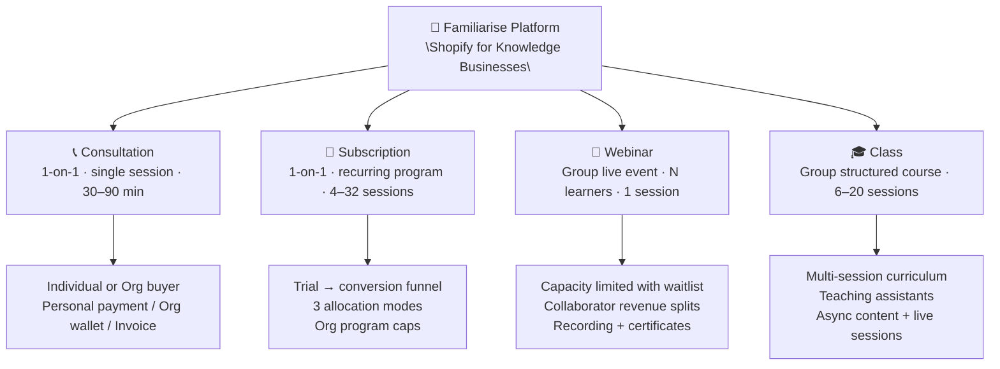

| Product | Who buys | Who delivers | Sessions | Key Mechanic |
|---|---|---|---|---|
| **Consultation** | Individual or Org | Solo expert | 1 | Approval gate + doc review |
| **Subscription** | Individual or Org | Solo expert | 4–32 over weeks | 3 allocation modes + trial funnel |
| **Webinar** | Many individuals or Org | Expert + co-hosts | 1 | Capacity + waitlist queue |
| **Class** | Many individuals or Org | Expert + TAs | 6–20 | Curriculum + collaborator splits |

---

## 2. The Cast of Characters

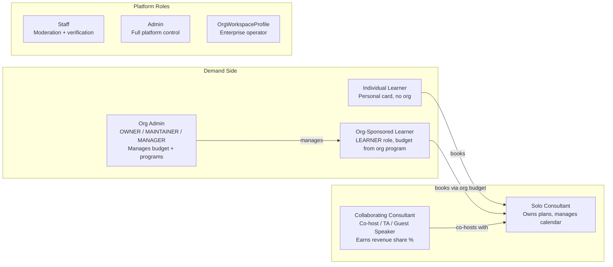

---

## 3. Consultant Setup Flow (Supply Side)

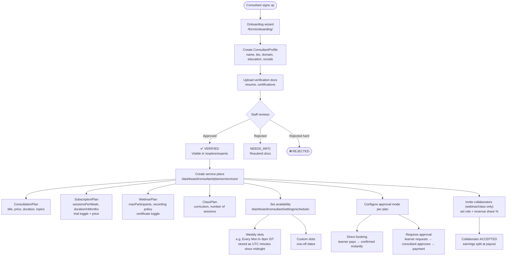

---

## 4. The Booking State Machine

Every booking — regardless of service type — moves through this state machine.

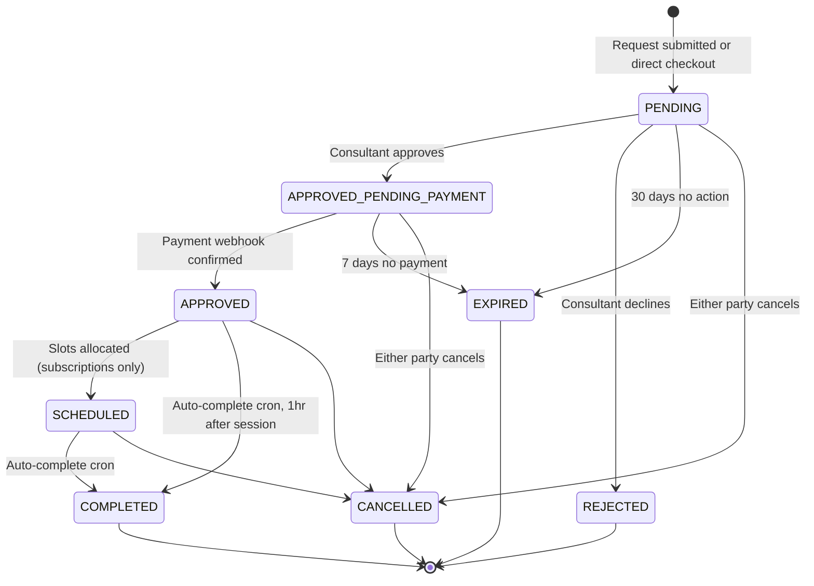

Slot state runs in parallel:

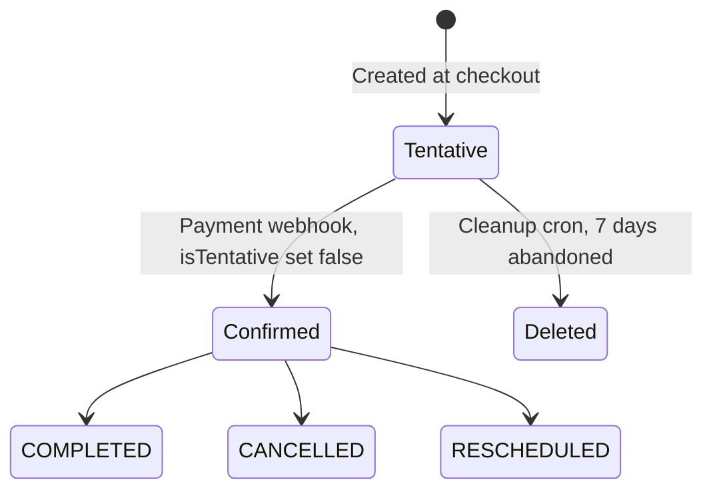

---

## 5. The Checkout Algorithm (500ms)

What actually happens when a consultee clicks "Pay Now":

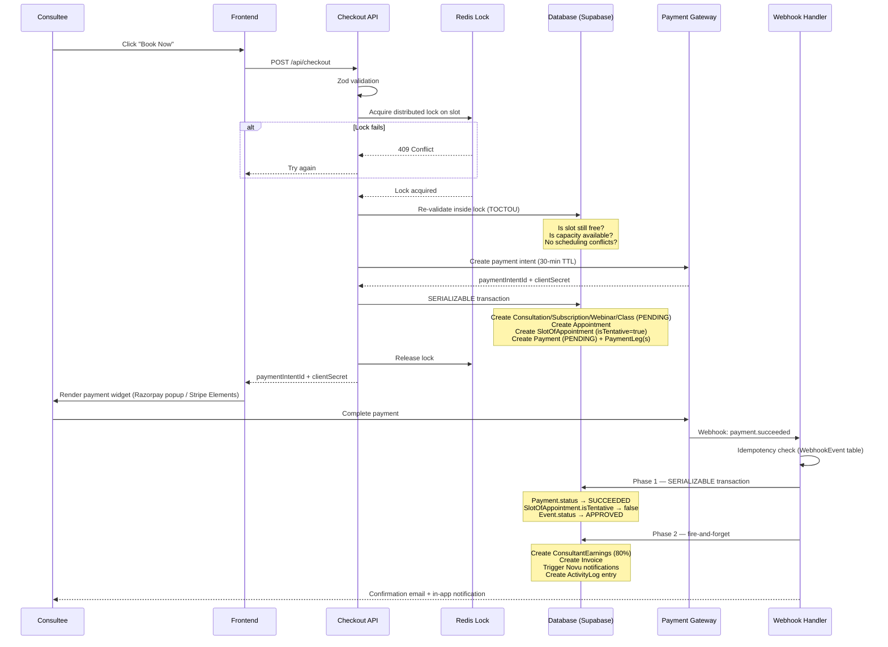

---

## 6. Slot Availability & The 30-Minute Atom

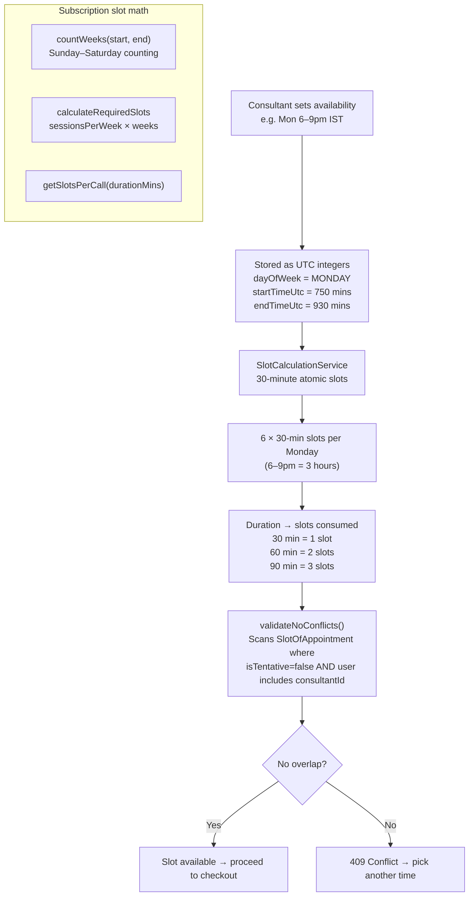

---

## 7. Consultation Journeys (All Variants)

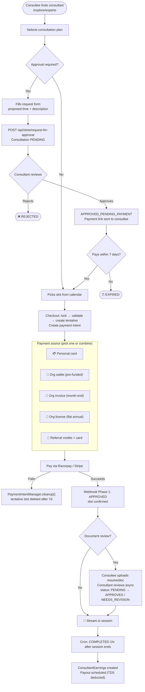

---

## 8. Subscription Journeys — Trial, Allocation, Org Cap

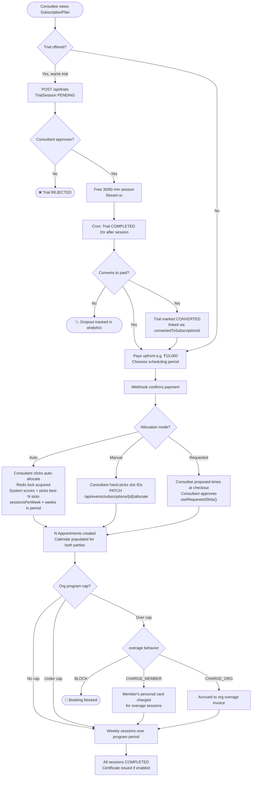

---

## 9. Waitlist Flow (Webinar & Class)

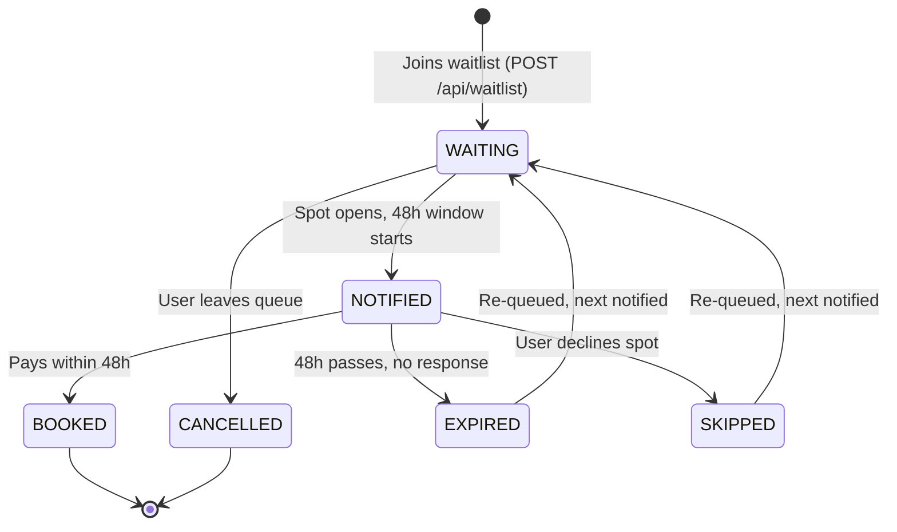

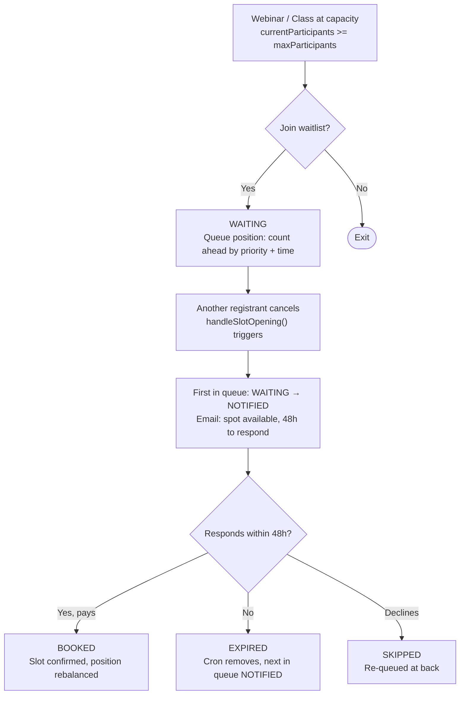

---

## 10. Webinar & Class Group Session Flow

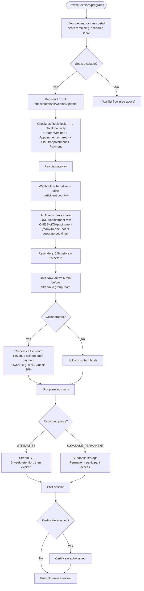

---

## 11. Trial Session Lifecycle

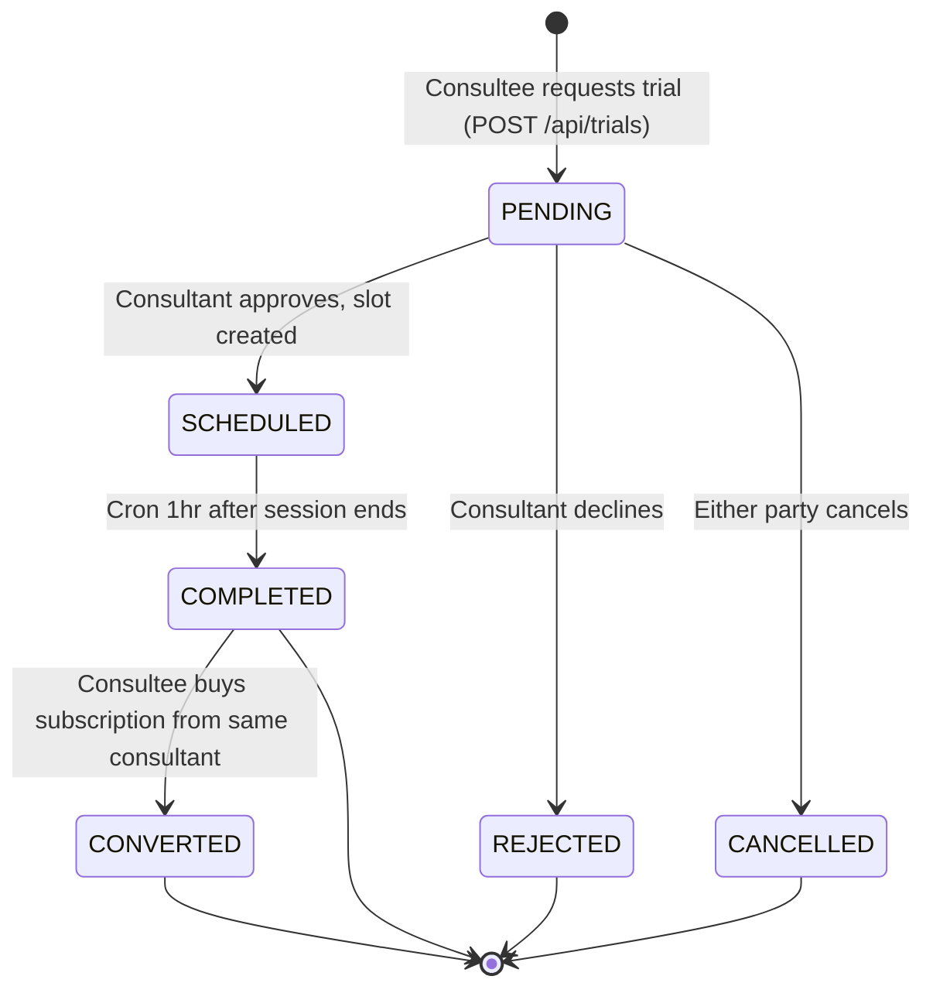

---

## 12. Enterprise Organization Types

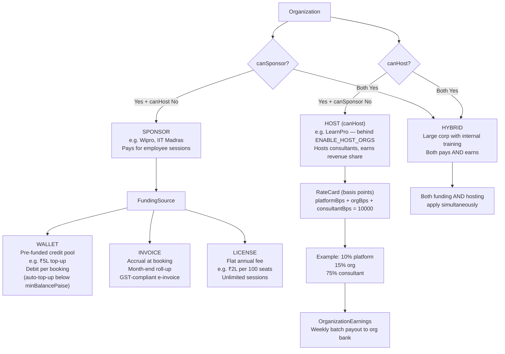

---

## 13. Enterprise Program & Budget Cap Flow

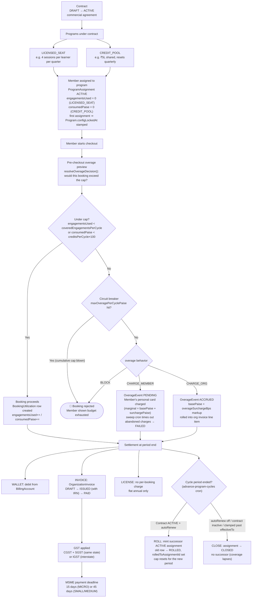

> **v2 (#777/#779).** Caps now reset automatically: the `advance-program-cycles`
> cron rolls each `ProgramAssignment` into a fresh successor (`ROLLED` → new
> `ACTIVE`) when the governing contract is `ACTIVE` + `autoRenew`, else `CLOSED`
> (`lib/enterprise/cycle-engine.ts`). Overage is split into `basePaise` +
> `surchargePaise` (`overageSurchargeBps`) and capped by a per-cycle circuit
> breaker (`maxOveragePerCyclePaise`) that forces `BLOCK` once cumulative overage
> is exceeded. Money config locks (`Program.configLockedAt`) the moment the first
> assignment exists.

---

## 14. Revenue & Earnings Split

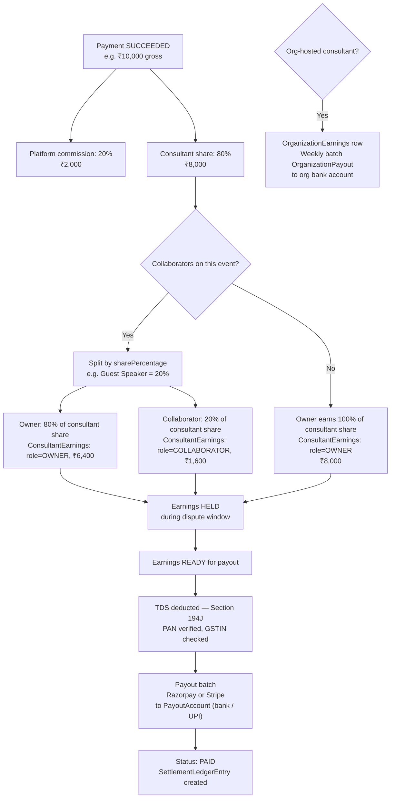

---

## 15. Full End-to-End User Journey

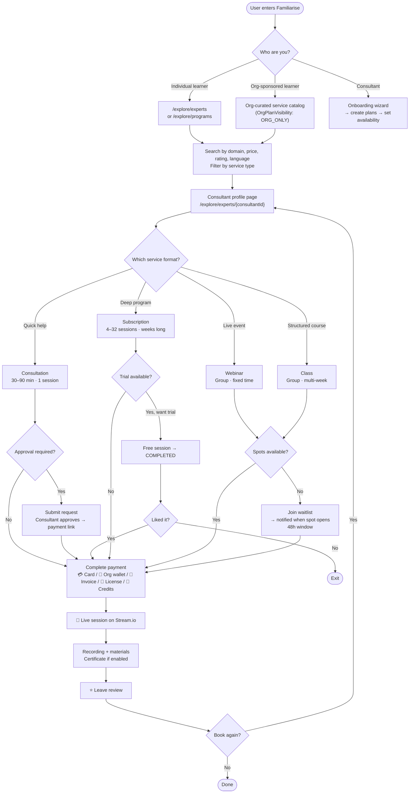

---

## 16. Background Automation (No Human Needed)

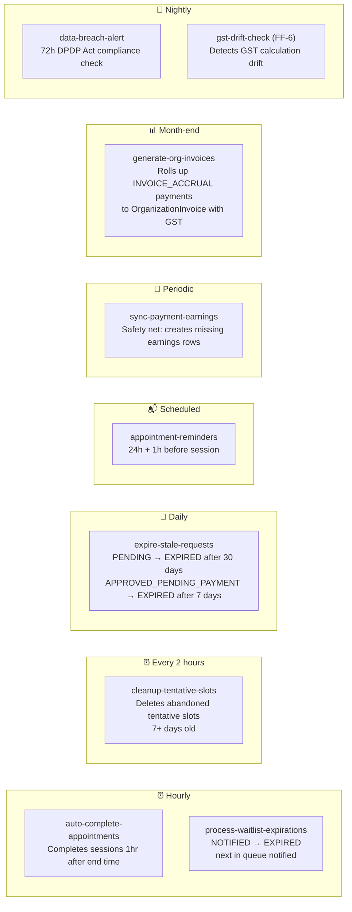

---

## 17. The Permutation Matrix

Every journey is a combination of these axes:

| Axis | Options |
|---|---|
| **Service type** | Consultation · Subscription · Webinar · Class |
| **Approval mode** | Direct · Requires approval |
| **Allocation mode** (subscription only) | Auto · Manual · Requested slots |
| **Trial** (subscription only) | None · Trial no-convert · Trial converts |
| **Payment source** | Personal card · Org wallet · Org invoice · Org license · Credits+card · Wallet+card |
| **Capacity** | Available · Waitlist→enrolls · Waitlist→expires |
| **Collaboration** | Solo consultant · With co-host/TA (revenue split) |
| **Document review** | None · Consultee uploads · Consultant responds |
| **Recording** | None · Stream 2-week · Supabase permanent |
| **Org program cap** | None · Under cap · Overage BLOCK · Overage CHARGE\_MEMBER · Overage CHARGE\_ORG |

**~3,000+ distinct end-to-end paths.** ~15–20 primary journeys cover 90% of real usage. The rest are edge cases handled automatically by the state machine + cron jobs.

---

## 18. Competitive Moat (Why This Is Hard to Copy)

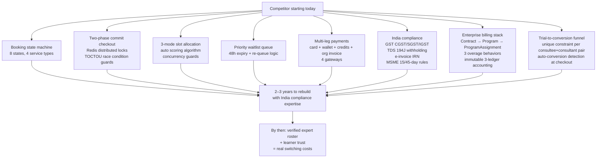

---

## Key Files Reference

| Area | Path |
|---|---|
| Schema | `prisma/schema.prisma` |
| Booking architecture | `docs/booking/01-architecture.md` |
| Booking lifecycle | `docs/booking/06-booking-lifecycle.md` |
| Slot math | `docs/booking/03-slot-math-and-calculations.md` |
| Trial sessions | `docs/booking/09-trial-sessions.md` |
| Waitlist system | `docs/booking/11-waitlist-system.md` |
| Checkout + payment | `docs/booking/10-checkout-payment-integration.md` |
| Enterprise overview | `docs/enterprise/00-foundations/01-overview.md` |
| Enterprise scenarios | `docs/enterprise/60-scenarios-and-verdicts/01-scenarios-and-examples.md` |
| Funding & programs | `docs/enterprise/00-foundations/03-funding-and-programs.md` |
| Enterprise readiness | `docs/enterprise/90-audits/01-readiness-audit.md` |
| Slot allocation engine | `utils/slotAllocation/SlotAllocationService.ts` |
| Checkout orchestration | `lib/payments/operations/checkout.ts` |
| Webhook handlers | `lib/payments/webhooks/handlers.ts` |
| Explore pages | `app/explore/` |
| Checkout pages | `app/checkout/plans/` |
| Consultant dashboard | `app/dashboard/consultant/[consultantId]/` |
| Org dashboard | `app/dashboard/organization/` |
