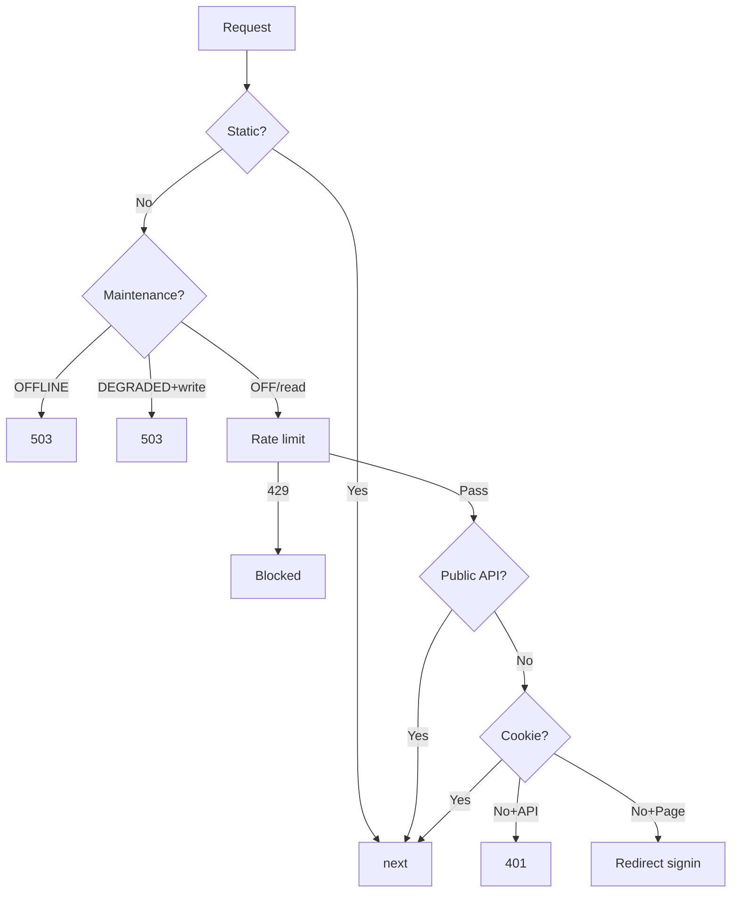

# Middleware

| Field | Value |
|---|---|
| Status | Stable |
| Audience | All engineers |
| Last reviewed | 2026-04-26 |
| Source files | `middleware.ts`, `lib/rate-limit.ts`, `lib/maintenance-edge.ts` |

## 1. Background

Next.js middleware runs on every non-static request before the route handler. Ours handles four concerns in order: static asset bypass, maintenance mode, rate limiting, and authentication gating (cookie check only).

The middleware runs in the **Edge Runtime** — no `node:crypto`, no `node:dns`, no `@better-auth/sso` imports. Only Web APIs.

## 2. Scope

| In scope | Out of scope |
|---|---|
| Route classification (public, authenticated, protected) | Actual session validation (happens in API handlers) |
| Cookie-only auth gating | Authorization role checks |
| Edge rate limiting via Upstash | Handler-level rate limits |
| Maintenance mode (OFFLINE / DEGRADED) | Maintenance admin UI |

## 3. Design

### 3.1 Request Lifecycle



### 3.2 Route Classification

Routes are classified by **string prefix matching** — no globs, no regex.

| Category | Examples | Behavior |
|---|---|---|
| **Public API** | `/api/auth/`, `/api/health/`, `/api/user/consultants`, `/api/slots/availability/` | Pass through |
| **Authenticated API** | `/api/user/`, `/api/dashboard/`, `/api/admin/`, `/api/organizations/` | 401 if no cookie |
| **Public auth pages** | `/auth/` | Always pass — client-side redirect logic |
| **Protected pages** | `/form/`, `/dashboard/`, `/settings/`, `/checkout/` | Redirect to `/auth/signin?callbackUrl=…` |

> [!IMPORTANT]
> Public API prefixes are checked **first**. `/api/user/consultants` (public) is under `/api/user/` (authenticated). The public check short-circuits.

### 3.3 Cookie-Only Auth Check

```typescript
const sessionCookie = getSessionCookie(req);
const isAuthenticated = !!sessionCookie;
```

**Not session validation.** Cookie presence = "likely authenticated." Actual validation happens in `requireApiAuth()` (API routes) and `requireAuth()` (server components).

> [!CAUTION]
> **Never** redirect cookie-present users from `/auth/signin` to `/dashboard` in middleware. Stale cookies cause infinite redirect loops.

### 3.4 Maintenance Mode

Three phases from Redis via `getMaintenanceState()`:

| Phase | API | Pages |
|---|---|---|
| `OFF` | Normal | Normal |
| `DEGRADED` | Writes → 503. Reads → pass with `x-maintenance-*` headers | Banner via headers |
| `OFFLINE` | 503 JSON with Retry-After | Rewrite to `/maintenance` |

### 3.5 Edge Rate Limiting

Runs before serverless invocation (cost amplification prevention). All use Upstash sliding windows. See `04-rate-limiting.md` for the full bucket table.

**Key edge limiters:** auth brute-force (10/15min), search (60/min), SSO domain-check (60/hr), org invite accept (30/hr), wallet top-up (20/hr per org).

Localhost (`::1`, `127.0.0.1`) is bypassed so dev/test flows aren't throttled.

## 4. Reference

| Function | File | Purpose |
|---|---|---|
| `middleware()` | `middleware.ts` | Main entry |
| `matchesAnyPrefix()` | `middleware.ts:81` | Fast prefix matcher |
| `getSessionCookie()` | `better-auth/cookies` | Reads session cookie |
| `getClientIp()` | `lib/rate-limit.ts:142` | IP from `req.ip` or `x-forwarded-for` |
| `applyRateLimit()` | `lib/rate-limit.ts:117` | Returns `NextResponse(429)` or `null` |

## 5. Operational Concerns

**SSO enforcement cannot happen in middleware** (Edge Runtime lacks Node APIs). Primary gate is `session.create.before` hook. Defense-in-depth is `customSession()` setting `ssoEnforcementFailed`.

**Adding a new protected prefix:** Add to `PROTECTED_PREFIXES` (pages) or `AUTHENTICATED_API_PREFIXES` (API). If sub-routes should be public, add them to `PUBLIC_API_PREFIXES`.

## 6. Edge Cases & Foot-Guns

1. **Public prefix ordering** — `/api/user/consultants` must be in the public list so it isn't caught by `/api/user/`.
2. **Rate limit fail-open** — If Redis is down, requests proceed. Intentional.
3. **callbackUrl preservation** — Middleware preserves the original path + query as `callbackUrl` on the signin redirect.

## 7. Related Docs

- [01-architecture.md](./01-architecture.md) — BetterAuth setup, plugin chain
- [04-rate-limiting.md](./04-rate-limiting.md) — Full rate limiter reference
- [docs/authorization/](../../authorization/) — Handler-level auth checks
