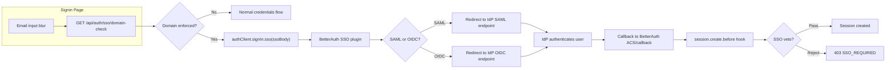

# SSO — Enterprise Single Sign-On

| Field | Value |
|---|---|
| Status | Stable |
| Audience | Engineers working on enterprise features |
| Last reviewed | 2026-04-26 |
| Source files | `lib/sso/`, `lib/auth.ts`, `app/api/auth/sso/`, `app/api/organizations/[orgId]/sso/` |

## 1. Background

Enterprise SSO lets organizations enforce that their employees sign in via their corporate Identity Provider (Okta, Auth0, Azure AD, etc.) instead of credentials or personal OAuth. We support both **SAML 2.0** and **OIDC** via the `@better-auth/sso` plugin.

SSO is the most security-sensitive subsystem in the codebase. Eight static invariants guard against regressions (see [`../05-testing.md`](../05-testing.md)).

## 2. Scope

| In scope | Out of scope |
|---|---|
| SSO enforcement (write-time; read-time removed — see §4) | OAuth providers — see [`../oauth/`](../oauth/README.md) |
| Provider registration (SAML + OIDC) | General BetterAuth setup — see [`../01-architecture.md`](../01-architecture.md) |
| Domain claims + DNS TXT verification | Org management UI |
| Member-to-Membership bridge | Authorization / role hierarchy — see `docs/authorization/` |
| Cert expiry alerting | IdP-side setup (see enterprise docs) |

## 3. Design

### 3.1 Architecture Overview



### 3.2 Data Model

Three Prisma models support SSO:

**`OrganizationSSOSettings`** — Per-org SSO policy:
| Field | Type | Purpose |
|---|---|---|
| `enforceSSO` | `Boolean` | When true, users with this domain must sign in via SSO |
| `allowedEmailDomains` | `String[]` | Curated allowlist. Empty = all claimed domains enforced |
| `defaultRoleForAutoJoin` | `MemberRole` | Role assigned to SSO auto-joined members (default: `LEARNER`) |

**`OrgDomainClaim`** — Maps email domains to organizations:
| Field | Type | Purpose |
|---|---|---|
| `domain` | `String @unique` | e.g., `acme.com` |
| `organizationId` | FK | The org that owns this domain |
| `verificationToken` | `String?` | Token for DNS TXT verification |
| `verifiedAt` | `DateTime?` | Null = unverified claim (not enforced) |

> [!IMPORTANT]
> **Unverified domain claims do not enforce SSO.** A malicious org owner could claim `gmail.com` — without DNS verification, this would intercept all Gmail users. The `verifiedAt IS NOT NULL` check is critical in both `session.create.before` and `domain-check`.

**`SsoProvider`** — BetterAuth-managed table (`@@map("ssoProvider")`):
| Field | Type | Purpose |
|---|---|---|
| `providerId` | `String @unique` | Alphanumeric slug (e.g., `acme-okta`). Used in callback URLs. |
| `domain` | `String` | Email domain this provider handles |
| `organizationId` | `String?` | Owning org |
| `userId` | `String?` | **Must be null for org-scoped providers** (FK cascade footgun) |
| `samlConfig` / `oidcConfig` | `String?` | JSON-stringified provider config |

### 3.3 SSO Enforcement — Two Layers

**Layer 1: Write-time (primary gate)**

`session.create.before` hook in `lib/auth.ts` calls [`shouldRejectSession()`](../../../../lib/sso/enforce-session.ts):

1. Extract email domain → look up `OrgDomainClaim` (must be verified)
2. Check `OrganizationSSOSettings.enforceSSO` (must be true, org must be ACTIVE)
3. Honour `allowedEmailDomains` allowlist if non-empty
4. Find registered `SsoProvider.providerId` values for the org
5. **Fail open** if no providers are registered yet (prevents setup lockout)
6. Check if user has an `Account` row with a matching `providerId`
7. If no match → throw `FORBIDDEN` with `code: "SSO_REQUIRED"`

**Layer 2: Read-time (removed in #1242)**

`customSession()` used to mirror this logic and set `ssoEnforcementFailed: true`, with the docs claiming layouts redirected on it. **No layout ever consumed the flag** — it cost 2 DB queries per session resolution for nothing, and was removed (see #1242 and the lifecycle spec in [#1241](https://github.com/Practitionist/familiarise_web/issues/1241)).

Consequence: sessions created *before* an admin flips `enforceSSO` are not retroactively revoked — they persist until natural expiry/updateAge. Layer 1 catches every NEW session. If retroactive enforcement is needed, implement the Phase-1/2 plan from #1241 with an actual consumer.

### 3.4 Domain Check API

[`GET /api/auth/sso/domain-check?email=<email>`](../../../../app/api/auth/sso/domain-check/route.ts) — Pre-auth discovery endpoint. The signin page calls this on email blur. Returns:

```json
// Enforced domain with provider:
{ "enforceSSO": true, "organizationName": "Acme Corp", "ssoBody": { "providerId": "acme-okta", "domain": "acme.com", "callbackURL": "..." } }

// Not enforced:
{ "enforceSSO": false }
```

Rate limited at 60/hr per IP to prevent org-existence enumeration.

### 3.5 Provider Registration

[`POST /api/organizations/[orgId]/sso/providers`](../../../../app/api/organizations/%5BorgId%5D/sso/providers/route.ts) — Owner-only. Creates a `SsoProvider` row:

- Validates via `createProviderSchema` (Zod)
- `providerId` must be alphanumeric (prevents path injection in derived URLs)
- Duplicate `providerId` → 409
- Duplicate domain within same org → 409
- **`userId` is always null** (prevents FK cascade on owner deletion)
- Creates audit log entry

### 3.6 URL Derivation

[`lib/sso/derive-urls.ts`](../../../../lib/sso/derive-urls.ts) derives ACS and metadata URLs from `providerId`:

| Type | URL pattern |
|---|---|
| SAML ACS | `{baseUrl}/api/auth/sso/saml2/sp/acs/{providerId}` |
| OIDC callback | `{baseUrl}/api/auth/sso/callback/{providerId}` |
| SAML metadata | `{baseUrl}/api/auth/sso/saml2/sp/metadata?providerId={providerId}` |

> [!WARNING]
> These must stay in sync with BetterAuth's default endpoint templates. If BetterAuth changes its URL patterns, these helpers must be updated too. The `derive-urls.test.ts` suite guards against drift.

### 3.7 Provider Schema Validation

[`lib/sso/provider-schemas.ts`](../../../../lib/sso/provider-schemas.ts):

- `samlConfigSchema`: `issuer` (string), `entryPoint` (URL), `cert` (string). **No `callbackUrl`** — BetterAuth derives it.
- `oidcConfigSchema`: `issuer` (URL), `clientId`, `clientSecret`, `discoveryEndpoint` (URL), `pkce` (defaults to `true`).
- `createProviderSchema`: Wraps both with `providerId` (alphanumeric regex), `domain`, `providerType` (`saml` | `oidc`).

### 3.8 Member-to-Membership Bridge

When an SSO user auto-joins, BetterAuth creates a `Member` row. Our typed `Membership` row is created by `customSession()` on the first session read:

```
SSO auto-join → BetterAuth creates Member → customSession() finds
bare Member (no sibling Membership) → creates Membership with
defaultRoleForAutoJoin → links via betterAuthMemberId
```

### 3.9 PKCE Requirement

The client must use `authClient.signIn.sso()` (from `ssoClient()` plugin) — not a raw `fetch()`. The plugin generates the OIDC PKCE `code_verifier`/`code_challenge` pair. Invariant #1 in `verify-sso-invariants.sh` guards against this regression.

## 4. Operational Concerns

### Cert Expiry

SAML certs have expiration dates. The daily cron (`sso-cert-expiry-alert.yml`, 08:30 IST) scans all `SsoProvider` rows and alerts on approaching expiry.

**Rotation:** Org admin uploads new cert in IdP → update `SsoProvider.samlConfig.cert` via API or DB → test with a non-enforced user first.

### DNS TXT Verification

Domain claims require a DNS TXT record at `_familiarise-verify.<domain>` containing the `verificationToken`. The POST `/verify` endpoint flips `verifiedAt`. Without verification, the claim exists for audit but doesn't enforce SSO.

### Fail-Open During Setup

If an org enables `enforceSSO` but hasn't registered any providers yet, enforcement is skipped by `shouldRejectSession` (`registeredProviderIds.length > 0`). This prevents the org owner from locking themselves out mid-setup. (The removed `customSession` read-time check used to mirror this; see §4 Layer 2.)

## 5. Edge Cases & Foot-Guns

1. **`userId` on `SsoProvider` must be null.** Setting it to the creating owner causes FK cascade — deleting the owner deletes the provider, killing SSO for the whole org.
2. **Personal OAuth ≠ SSO.** A Google OAuth account does not satisfy enforcement. Only `account.providerId` matching a registered `ssoProvider.providerId` counts.
3. **Domain overlap.** `OrgDomainClaim.domain` is `@unique` — one domain, one org. If two orgs try to claim the same domain, the first wins.
4. **Allowlist + claim interaction.** A domain can be in `OrgDomainClaim` but NOT in `allowedEmailDomains`. In that case, SSO is not enforced for that domain (graceful transition).

## 6. Related Docs

- [../01-architecture.md](../01-architecture.md) — Plugin chain, `customSession`
- [../03-sessions-and-hooks.md](../03-sessions-and-hooks.md) — Session hooks, membership bridge
- [../05-testing.md](../05-testing.md) — SSO tests and static invariants
- [docs/enterprise/20-iam-and-security/01-sso-and-authentication.md](../../../enterprise/20-iam-and-security/01-sso-and-authentication.md) — Admin-facing SSO configuration guide
- `docs/enterprise/playbooks/sso-testing.md` *(planned; not in repo yet)* — Local SSO testing (mocksaml, Keycloak, etc.)
