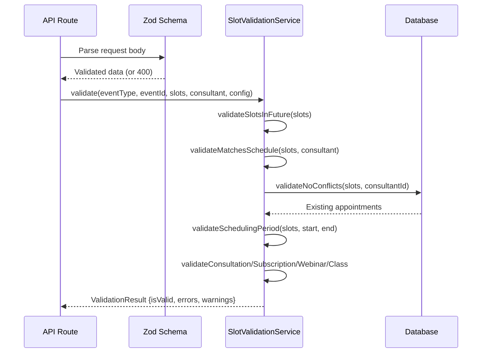
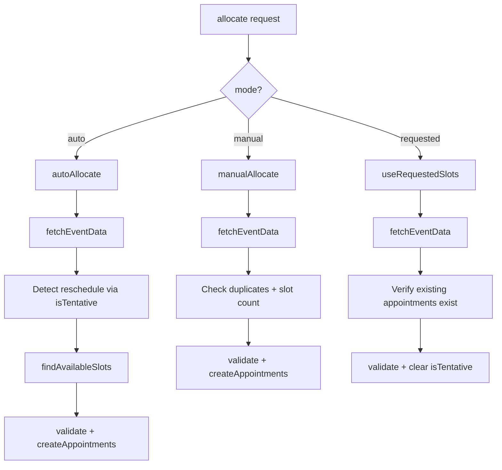
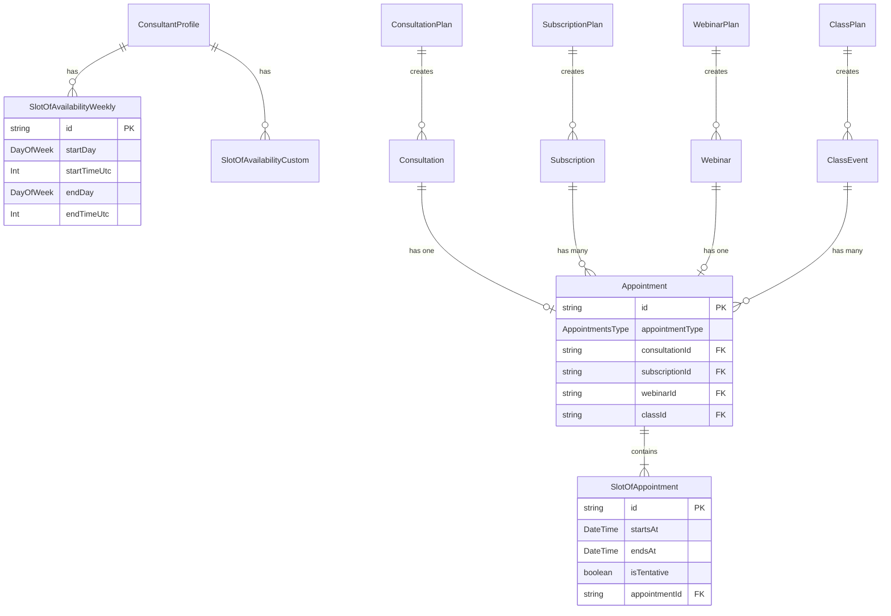
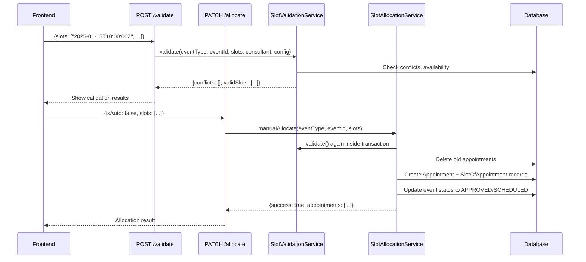
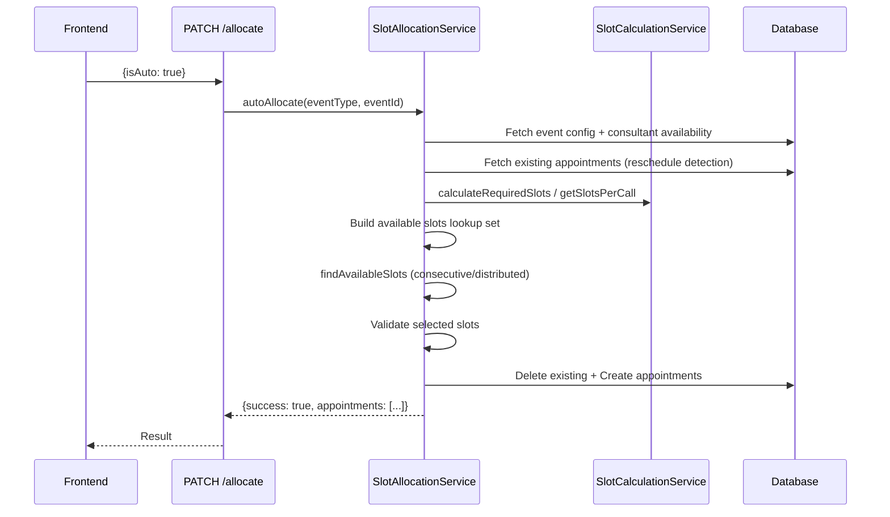
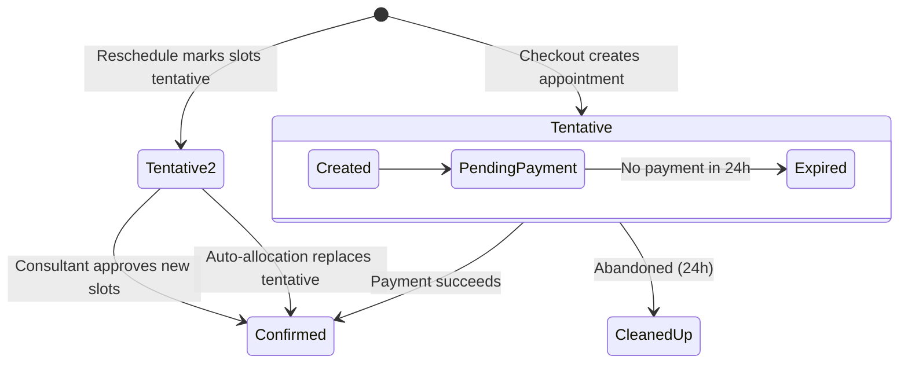

# Architecture

## Service Layer

### SlotCalculationService

**File**: `utils/slotAllocation/SlotCalculationService.ts`

Pure-function service with no database access. Single source of truth for all slot math.

| Method                                                | Purpose                                                 |
| ----------------------------------------------------- | ------------------------------------------------------- |
| `countWeeks(start, end)`                              | Count Sunday-to-Saturday weeks overlapping a date range |
| `startOfWeekSunday(date)`                             | Get the Sunday 00:00 of the week containing a date      |
| `validateDuration(duration, fieldName)`               | Safety check: positive, finite, >= 0.5h, <= 24h         |
| `calculateRequiredSlots(eventType, config)`           | Total 30-min slots needed for an event                  |
| `getSlotsPerCall(sessionDurationInHours)`             | Slots per session: `Math.ceil(duration / 0.5)`          |
| `calculateProgress(selectedSlots, eventType, config)` | UI progress: scheduled vs required vs remaining         |
| `countCompletedCalls(slots, slotsPerCall)`            | Count complete consecutive-slot groups per day          |
| `groupSlotsByDay(slots)`                              | Map\<dateString, slots[]\>                              |
| `groupSlotsByWeek(slots)`                             | Map\<sundayISO, slots[]\>                               |

### SlotValidationService

**File**: `utils/slotAllocation/SlotValidationService.ts`

Unified validation for all 4 event types. Takes a `PrismaClient` or transaction in the constructor.

**Entry point**: `validate(eventType, eventId, slots, consultant, config)` runs universal checks first, then routes to event-specific validation.

**Universal validators** (all event types):

| Validator                  | What it checks                                                                                                                                                                                                                                                                                                                                                       |
| -------------------------- | -------------------------------------------------------------------------------------------------------------------------------------------------------------------------------------------------------------------------------------------------------------------------------------------------------------------------------------------------------------------- |
| `validateSlotsInFuture`    | All slots > now + 5 seconds (buffer prevents race conditions)                                                                                                                                                                                                                                                                                                        |
| `validateNoConflicts`      | Range overlap detection: `slotStart < existingEnd AND existingStart < slotEnd`. Uses `buildOccupiedAppointmentFilter()` to exclude terminal-status appointments (CANCELLED, REJECTED, EXPIRED). Checks APPROVED subscriptions, PENDING/APPROVED/APPROVED_PENDING_PAYMENT consultations, SCHEDULED webinars/classes. Detects expired payments (orphaned payment fix). |
| `validateMatchesSchedule`  | WEEKLY: day-of-week + time-of-day within availability ranges. CUSTOM: overlap detection with available slots.                                                                                                                                                                                                                                                        |
| `validateSchedulingPeriod` | All slots within [startDate, endDate] -- server-side enforcement                                                                                                                                                                                                                                                                                                     |
| `validateConsecutiveSlots` | Sort + check 30-min diff with 1-second tolerance                                                                                                                                                                                                                                                                                                                     |
| `validateSameDaySlots`     | All slots share the same `toDateString()`                                                                                                                                                                                                                                                                                                                            |

**Event-specific validators**:

| Validator              | Rules                                                              |
| ---------------------- | ------------------------------------------------------------------ |
| `validateConsultation` | Same day + consecutive + exact slot count                          |
| `validateSubscription` | Delegates to `SubscriptionValidationService`                       |
| `validateWebinar`      | Consecutive + exact slot count                                     |
| `validateClass`        | Complete sessions per day + consecutive within day + weekly limits |



### SlotAllocationService

**File**: `utils/slotAllocation/SlotAllocationService.ts`

Main allocation engine. All operations run inside a Prisma transaction with 60-second timeout.



**Auto allocation** (`autoAllocate`):

1. Fetch event config and consultant availability
2. Detect reschedule (existing tentative slots? preserve total slot count)
3. Build lookup set of all available 30-min blocks (weekly: generate 8 weeks of occurrences; custom: break into 30-min blocks)
4. For consultations/webinars: find first available consecutive block
5. For subscriptions/classes: distribute across weeks (1 call/day, iterate days within weeks)
6. Validate selected slots, create appointments, update event status

**Manual allocation** (`manualAllocate`):

1. Convert ISO strings to Date objects
2. Reject duplicates
3. Verify slot count is exact multiple of slotsPerCall
4. Run full validation pipeline
5. Delete existing appointments, create new ones, update status

**Requested allocation** (`useRequestedSlots`):

1. Verify appointments actually exist (prevents approving empty requests)
2. Verify slot count matches
3. Run full validation
4. Clear `isTentative` flag on all slots
5. Update event status to APPROVED

**Appointment structure**:

```
1 Appointment record = 1 call/session
  N SlotOfAppointment records (N = slotsPerCall)
    Each: [startsAt, endsAt] = 30-min interval, isTentative flag
    Connected to: consultant user + consultee user
```

---

## Frontend Hooks

### useSlotAllocation

**File**: `hooks/scheduling/useSlotAllocation.ts`

Central React hook (exported as `useEventSlotAllocation`) managing slot selection state for all event types.

**Key behaviors**:

- `toggleSlot()` -- event-specific interactive blocking: weekly limits (subscription), daily session limits (class), consecutive enforcement, delegated to the pure rules in `lib/scheduling/slotSelectionValidation.ts`
- Auto-expansion -- when selecting a slot, auto-select consecutive adjacent slots to fill `slotsPerSession`
- Progress tracking -- scheduled/required/remaining calls
- Submission for manual and requested modes goes through `lib/scheduling/allocationAlgorithms.ts` (`AllocationAlgorithms.manualAllocate` / `allocateRequestedSlots`); auto mode just posts `isAuto: true` and lets the server pick

### useCalendarData

**File**: `hooks/scheduling/useCalendarData.ts`

Unified calendar data synchronization. Fetches availability, appointments, and event slots, and drives the visibility-gated poll defined in `lib/scheduling/availabilityPolling.ts` (`AVAILABILITY_POLL_INTERVAL_MS = 60_000`, #1164).

**Key function**: `getSlotStatusForInterval()` returns:

- `isAvailable` / `isBookedForDisplay` (fully booked) / `isPartiallyBooked`
- `isDisabled` / `isInPast`
- `overlappingAppointments` for tooltips

Uses server-calculated `bookingStatus` (available / partially-booked / fully-booked) as source of truth.

There is no `useSubscriptionValidation` hook in this repo today — no file of that name exists, and the API it would imply (`validateSlots()`, `getAvailableWeeks()`, `canScheduleInWeek()`) has no matching functions anywhere. The subscription-specific week math it would have covered lives server-side in `utils/subscriptionValidation.ts` (`getSubscriptionWeek`, `getSubscriptionType`), which `SlotValidationService`, `lib/scheduling/allocationService.ts`, and `useSlotAllocation.ts` all call directly.

### Where allocation happens

There is one allocator and it lives on the server. The client engine that used to pick slots for auto mode — strategies, time-of-day and day-of-week scoring, weekly distribution, same-day spacing — was deleted in PR #1178 along with the tests that could only have exercised it, because product code has submitted `isAuto: true` and left the picking to `SlotAllocationService`, under its Redis locks and timezone-aware caps, since #997 Phase 1. Auto-mode preference scoring now lives server-side in `utils/slotAllocation/preferenceScoring.ts`, which orders candidate slots but never filters them (#1065). `lib/scheduling/allocationAlgorithms.ts` was not deleted along with the auto engine: the file and class still exist, still export `manualAllocate()` and `allocateRequestedSlots()`, and are still imported — by `hooks/scheduling/useSlotAllocation.ts` alone, which `UnifiedCalendar.tsx` and `RequestSlotAllocationTab.tsx` both consume through that hook rather than importing the file directly — they now do pre-submission validation and submission for the manual and requested modes only, so nothing on the client can any longer be mistaken for a second auto-allocation engine. The hooks above are correspondingly a selection and display layer: `useSlotAllocation` guards selection and submits, while `useCalendarData` polls date-dependent availability every 60 seconds whenever the tab is visible (#1164), so the heatmap reflects slots other people have taken instead of staying green until allocation rejects the choice.

---

## Data Model



> Note: we are using ClassEvent instead of Class because Class is a reserved keyword in Mermaid.

**Key relationships**:

- One-time events (consultation, webinar) have **1 appointment** with N slots
- Recurring events (subscription, class) have **M appointments** (one per call/session), each with N slots
- `slotsPerSession = Math.ceil(sessionDurationInHours / 0.5)`
- Weekly availability uses `startDay` / `endDay` DayOfWeek enums and `startTimeUtc` / `endTimeUtc` Int fields (minutes since midnight UTC, 0-1439)

---

## Data Flows

### Manual Allocation (Validate-then-Allocate)



### Auto Allocation



---

## Tentative Appointment Lifecycle

Tentative appointments handle two scenarios: pending payment and rescheduling.



**Retry protection**:

- User deduplication: 5-minute window blocks same-user duplicate attempts
- Rate limiting: max 3 pending attempts per slot per 30 minutes
- Cleanup job: runs every 2 hours, releases tentative slots older than 24 hours with no successful payment (`TENTATIVE_EXPIRATION_HOURS = 24`, cut from 7 days by #833); users can also self-release via `DELETE /api/checkout/pending/[paymentId]` (#849) (see [13-cron-jobs-and-background-tasks.md](./13-cron-jobs-and-background-tasks.md))
- Expired payment detection: `APPROVED_PENDING_PAYMENT` consultations with expired payments are treated as available slots
