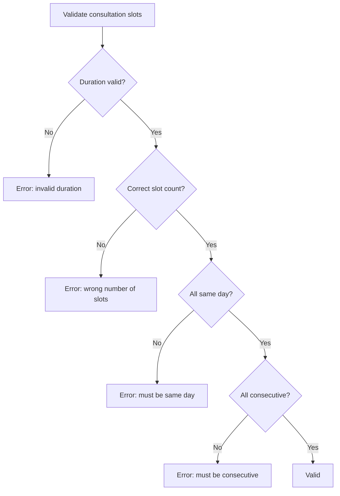
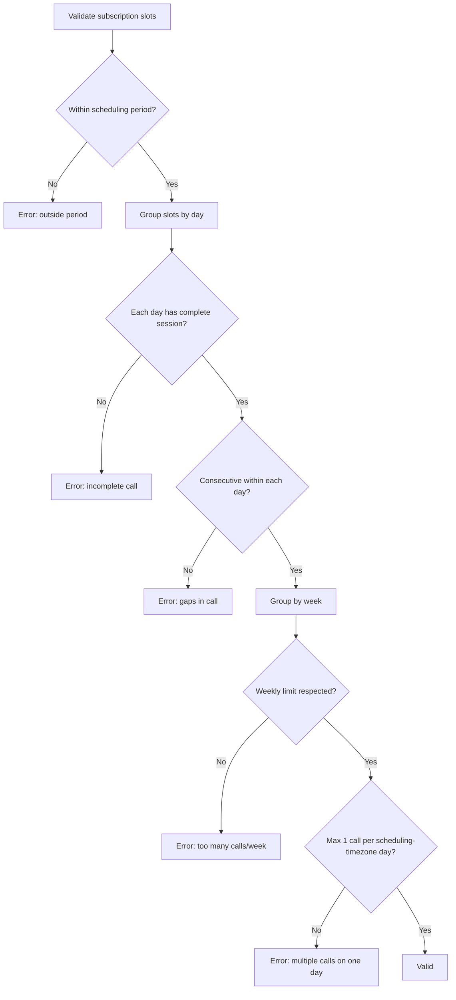
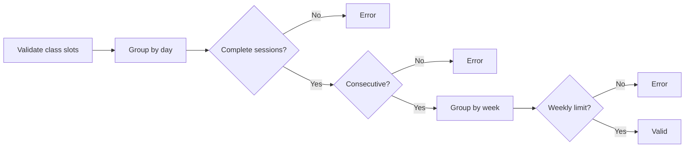
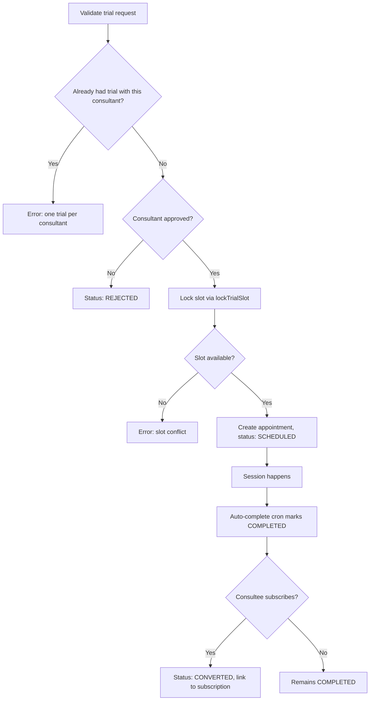
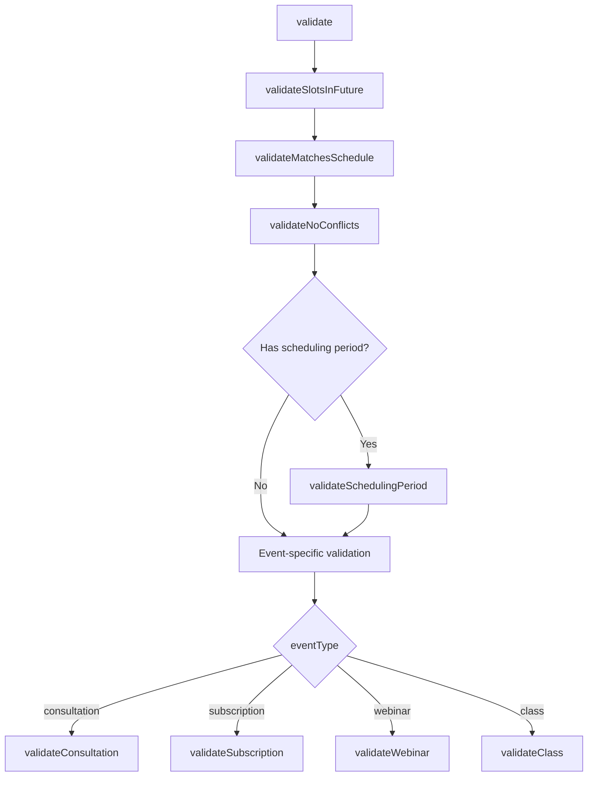

# Event Types & Validation

## Event Type Comparison

| Aspect                   | Consultation              | Subscription                                             | Webinar                   | Class                                                       | Trial                            |
| ------------------------ | ------------------------- | -------------------------------------------------------- | ------------------------- | ----------------------------------------------------------- | -------------------------------- |
| **Relationship**         | 1:1                       | 1:1                                                      | 1:many                    | 1:many                                                      | 1:1                              |
| **Frequency**            | One-time                  | Recurring                                                | One-time                  | Recurring                                                   | One-time (free)                  |
| **Duration field**       | `durationInHours` (total) | `sessionDurationInHours` (per call) + `durationInMonths` | `durationInHours` (total) | `sessionDurationInHours` (per session) + `durationInMonths` | Fixed 0.5h (1 slot)              |
| **Slot grouping**        | Consecutive + same day    | 1 call/day max, consecutive within day                   | Consecutive               | Max 2-3 sessions/day, consecutive within session            | Single slot                      |
| **Scheduling period**    | None                      | Required [startDate, endDate]                            | None                      | Required [startDate, endDate]                               | None                             |
| **Appointments created** | 1                         | 1 per call (many)                                        | 1                         | 1 per session (many)                                        | 1                                |
| **Weekly limit**         | N/A                       | `sessionsPerWeek` (0-7)                                  | N/A                       | `sessionsPerWeek`                                           | N/A                              |
| **Status field**         | `status`                  | `status`                                                 | `status`                  | `status`                                                    | `status` (TrialSessionStatus)    |
| **Allocation modes**     | auto, manual, requested   | auto, manual, requested                                  | auto, manual              | auto, manual                                                | Consultant-scheduled             |
| **Min duration**         | 0.5h                      | 0.5h per session                                         | 0.5h                      | 0.5h per session                                            | 0.5h (fixed)                     |
| **Payment**              | Required                  | Required                                                 | Required                  | Required                                                    | Free                             |
| **Uniqueness**           | Multiple allowed          | Multiple allowed                                         | Multiple allowed          | Multiple allowed                                            | One per consultant per consultee |

---

## Consultation

Single one-time session between consultant and consultee.

**Config**: `durationInHours` (0.5-4 hours)
**Slots**: `slotsPerSession = Math.ceil(durationInHours / 0.5)`
**Rules**: All slots must be consecutive and on the same day. Exactly one Appointment is created.



**Booking flows**:

- **Direct checkout**: Consultee selects slot, pays. Appointment created with `isTentative: true`, confirmed on payment webhook.
- **Request-based**: Consultee submits preferred slots. Consultant approves/rejects via "Use Requested Slots" mode.

---

## Subscription

Recurring sessions over a period of months. Most complex event type.

**Config**: `sessionDurationInHours` (per call) + `durationInMonths` + `sessionsPerWeek` (0-7) + `schedulingPeriodStartsAt/EndsAt`
**Total calls**: `countWeeks(startDate, endDate) * sessionsPerWeek`
**Total slots**: `totalCalls * Math.ceil(sessionDurationInHours / 0.5)`

**Rules**:

- All slots within scheduling period [startDate, endDate]
- Max 1 call per **scheduling-timezone** day (consecutive slots within that call). The same-day check buckets by `SlotCalculationService.dayKey()` in the event's `schedulingTimezone` (default Asia/Kolkata) on both the client and the server (ADR B9), so the verdict is identical everywhere; the old browser-local `toDateString()` bucketing disagreed with the server's for slots near day boundaries.
- Weekly limit: `sessionsPerWeek` calls per Sunday-Saturday **scheduling-timezone** week (`SlotCalculationService.weekKey()`)
- Weekly distribution validation counts **calls** (complete session groups), not raw slots

**Important**: Total weeks uses `SlotCalculationService.countWeeks()`, not `durationInMonths * 4`. A 6-month subscription has ~26 weeks, not 24.



**Delegates to**: `SubscriptionValidationService` for full validation.

---

## Webinar

Single one-time event with multiple attendees.

**Config**: `durationInHours` (0.5-4 hours)
**Slots**: `slotsPerSession = Math.ceil(durationInHours / 0.5)`
**Rules**: Consecutive slots required. Exactly one Appointment created. Consultant-scheduled (no request-based flow).

**Enrollment**: Consultees enroll via checkout. A full event is sold out — registration closes until the organizer raises its capacity.

---

## Class

Recurring sessions with multiple attendees over months.

**Config**: `sessionDurationInHours` (per session) + `durationInMonths` + `sessionsPerWeek`
**Total sessions**: `countWeeks(startDate, endDate) * sessionsPerWeek`
**Rules**: Complete sessions per day (slot count % slotsPerSession == 0), consecutive within day, weekly session limit, scheduling period.



Consultant-scheduled. Consultees enroll via checkout; a full event reads as sold out.

---

## Capacity

Capacity applies to the two group event types, webinars and classes. It lives in
two places, and the difference matters.

`WebinarPlan.maxParticipants` and `ClassPlan.maxParticipants` are the plan's
default: the number a newly created instance starts with.
`Webinar.maxParticipants` and `Class.maxParticipants` are nullable per-instance
overrides. The effective capacity of an event is its own value when it has one
and the plan's otherwise, which is what `effectiveMaxParticipants` in
`lib/events/capacity.ts` computes. Every surface that counts seats — the
checkout gates, the explore pages, the planner cards, the participants screen —
reads from that module, so there is one answer to "is this event full".

A seat is taken by any user connected to one of the event's slots, whether or
not their payment has settled. Registration connects the buyer to the event's
shared session slots, so tentativeness is a property of the slot rather than of
an individual registrant and cannot be filtered per person. An abandoned
checkout releases its seat when `jobs/payments/cleanup-abandoned-payments.ts`
disconnects the buyer, or immediately if they cancel the pending checkout
themselves.

The organizer edits capacity from the planner, which submits to
`PATCH /api/bookings/{webinars,classes}/crud-with-plan`. Raising it simply
reopens registration; there is no queue to notify. Lowering it below the number
of people already registered is rejected with a 400 and a message naming the
current count, and the check runs inside the update transaction so a booking
cannot slip in between the check and the write. Nobody is ever removed from an
event by a capacity change.

---

## Trial

Free one-time session that lets a consultee try a subscription plan before committing.

**Config**: Fixed 0.5h (1 slot), no payment
**Slots**: 1 slot per trial
**Rules**: One trial per consultant per consultee (`@@unique([consulteeProfileId, consultantProfileId])`). Uses `lockTrialSlot()` for concurrency protection.

**Status lifecycle**: `PENDING` -> `SCHEDULED` -> `COMPLETED` -> `CONVERTED` (with `CANCELLED` and `REJECTED` branches)



**Data model**: `TrialSession` links to `ConsulteeProfile`, `ConsultantProfile`, `SubscriptionPlan`, and optionally to `Appointment` (when scheduled) and `Subscription` (when converted via `convertedToSubscriptionId`).

For full details see [09-trial-sessions.md](./09-trial-sessions.md).

---

## Validation Layers

### Layer 1: Zod Schemas

**File**: `schemas/slotAllocation/validationSchemas.ts`

Input format validation at the API boundary. Runs before any business logic.

**Schemas**:

```typescript
// Allocation request (PATCH /allocate)
allocationRequestSchema = z
  .object({
    isAuto: z.boolean(), // Required
    useRequestedSlots: z.boolean().optional(),
    slots: z.array(z.string().datetime()).optional(),
  })
  .refine((data) => {
    if (data.isAuto) return true; // Auto: no slots needed
    if (data.useRequestedSlots) return true; // Requested: no slots needed
    return data.slots && data.slots.length > 0; // Manual: slots required
  });

// Validation request (POST /validate)
validationRequestSchema = z.object({
  slots: z.array(z.string().datetime()).min(1),
});

// Event ID (URL parameter)
eventIdSchema = z
  .string()
  .min(1)
  .refine((id) => {
    return (
      /^[0-9a-f]{8}-[0-9a-f]{4}-[0-9a-f]{4}-[0-9a-f]{4}-[0-9a-f]{12}$/i.test(
        id,
      ) || // UUID
      /^[a-z][a-z0-9]{23,24}$/.test(id)
    ); // CUID (v1: 25 chars, v2: 24 chars)
  });
```

**Error handling**: `formatZodError()` converts Zod errors to `"field: message; field2: message2"` format. `safeParse()` wrapper returns `{success, data}` or `{success: false, error}`.

### Layer 2: Business Rules (SlotValidationService)

**File**: `utils/slotAllocation/SlotValidationService.ts`

Server-side enforcement of all business rules. Runs inside the allocation transaction.



**Conflict detection** uses range overlap, not exact match:

```
slotStart < existingSlotEnd AND existingSlotStart < slotEnd
```

This catches partial overlaps that exact-match would miss.

**Schedule matching** (weekly availability):

- Uses the `startDay`/`endDay` DayOfWeek enum as the source of truth for which day, and that day is the **consultant's local** day, not a UTC day and never the viewer's (ADR B4).
- Derives the UTC weekday the row actually starts on with `utcStartDayIndex` (`utils/schedule/weekly-projection.ts`), which applies the row's own frozen `utcOffsetMinutes`: `utcDay = (localDay − floor((startTimeUtc + offset) / 1440)) mod 7`. `isMinuteWithinWeeklySlot` and the allocator's `getNextOccurrenceWeekly` and `matchWeeklySlotToDay` all call it, so the validator and the generator cannot disagree about which day a row belongs to.
- Compares `startTimeUtc`/`endTimeUtc` Int fields (minutes since midnight UTC, 0-1439)
- Handles overnight (cross-midnight) slots where `endTimeUtc <= startTimeUtc`
- Slot must start >= availability start AND end <= availability end

### Layer 3: Database Constraints

Prisma enforces:

- Foreign key relationships (appointment -> event, slot -> appointment)
- NOT NULL constraints on required fields
- Enum constraints (`AppointmentsType`, `AppointmentStatus`, `DayOfWeek`)
- All appointment creation runs inside a Prisma transaction with 60-second timeout

---

## Availability Types

Consultants configure one of two schedule types:

### Weekly

Recurring weekly patterns stored in `SlotOfAvailabilityWeekly`:

- `startDay`: DayOfWeek enum (SUNDAY, MONDAY, ..., SATURDAY) -- **source of truth** for which day, expressed in the consultant's own local calendar
- `startTimeUtc`: Int (minutes since midnight UTC, 0-1439)
- `endTimeUtc`: Int (minutes since midnight UTC, 0-1439)
- `endDay`: DayOfWeek enum recording whether the row crosses midnight **in UTC**, which is a narrower question than whether it crosses midnight locally; an Asia/Kolkata 23:00–02:00 row is 17:30–20:30 UTC and is therefore stored as a single same-day row
- `utcOffsetMinutes`: Int frozen at write time, derived from the consultant's `User.timezone` by `lib/scheduling/weeklyUtcOffset.ts` and never accepted from the request body

### Custom

Specific date/time ranges stored in `SlotOfAvailabilityCustom`:

- `startsAt`: Exact DateTime
- `endsAt`: Exact DateTime
- Validated using overlap detection: `proposedStart < availEnd AND availStart < proposedEnd`

The `scheduleType` field on `ConsultantProfile` determines which availability set is used.
