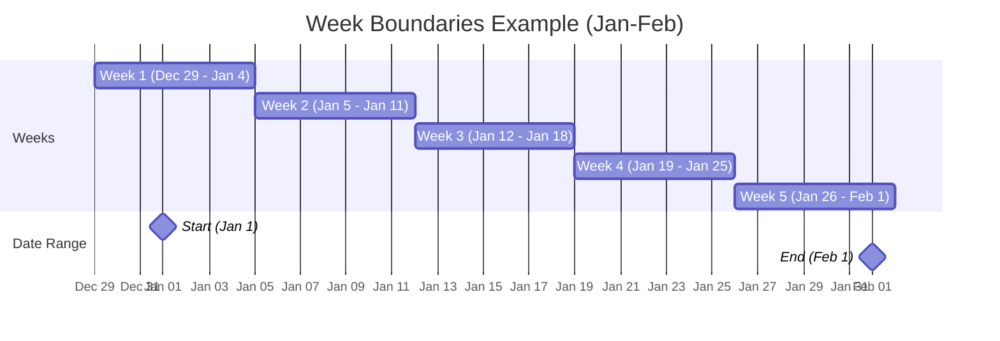
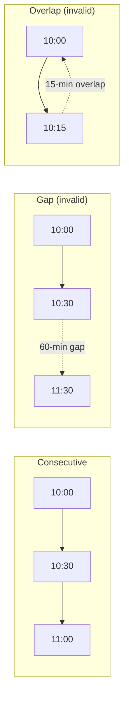
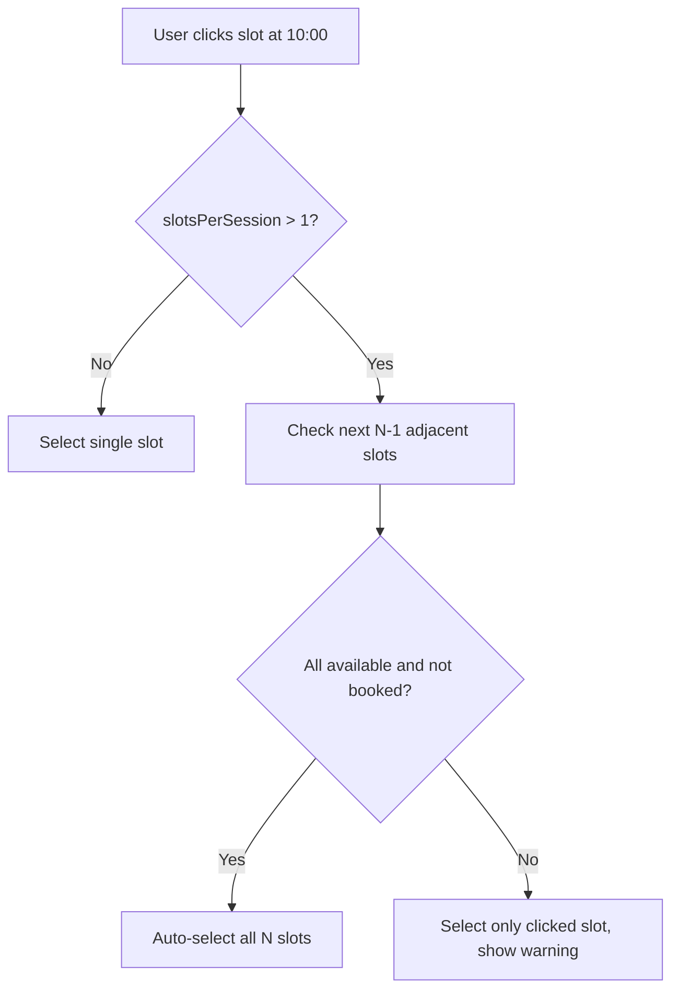

# Slot Math & Calculations

All slot math lives in `utils/slotAllocation/SlotCalculationService.ts`.

## Fundamentals

Every time slot in the system is a **30-minute atomic unit**.

- `SLOT_DURATION_MS = 30 * 60 * 1000` (1,800,000 ms)
- 48 intervals per day (24h / 0.5h)
- `slotsPerSession = Math.ceil(sessionDurationInHours / 0.5)`

| Duration  | Slots |
| --------- | ----- |
| 0.5 hours | 1     |
| 1 hour    | 2     |
| 1.5 hours | 3     |
| 2 hours   | 4     |
| 2.5 hours | 5     |
| 3 hours   | 6     |
| 4 hours   | 8     |

## Sessions Versus Slot Rows

The arithmetic above has an invariant hiding inside it that is worth stating on its own, because everything downstream of booking depends on it.

> A **session** is N **contiguous** slot rows on one appointment. A slot row is not a session. Any surface that treats one row as one session is wrong.

A one-hour consultation is two rows, a four-hour consultation is eight, and in both cases the customer booked exactly one meeting. The rows are a storage detail of the allocator, not something a user ever asked for or should ever be shown.

### `groupSlotsIntoRuns` Is the Single Definition

`groupSlotsIntoRuns` in `lib/appointments/slots.ts` is the one place that decides what counts as a session. Any surface that needs to answer "which rows make up this session?" must call it rather than walking the rows itself. It encodes four rules, in this order.

1. Bucket the rows by `appointmentId`, so two different bookings can never merge. A row with no appointment becomes its own bucket rather than pooling with every other orphan.
2. Sort each bucket by start time, because the rows arrive from Prisma and from API payloads in no guaranteed order.
3. Split the bucket wherever `prev.endsAt !== next.startsAt`, so a gap between two sittings ends the run.
4. Split it again wherever `isTentative` changes, because an unallocated placeholder is not part of the confirmed session sitting next to it.

Rows that `isDeadSlot` rejects — `completionStatus` in `{CANCELLED, RESCHEDULED}` **or** a non-null `deletedAt` tombstone — are dropped before any of this happens. They can never be joined, and leaving them in would let a dead row bridge two runs that are not actually contiguous. Callers that do not select `deletedAt` still degrade safely (`undefined` is treated as live for that signal alone).

The run's first row is its **anchor**, and it is the only row anything may be keyed to.

### Why the Walk Exists Rather Than Keying on `appointmentId`

One appointment per session is the designed model, and the allocator enforces it on every path that creates a booking. It is not, however, enforced by the schema, and it was historically violated in two places. `prisma/seedFiles/6a-create-appointments.ts:368` attaches weeks-apart sessions to a single appointment (seed-only). The planner webinar/class path used to write one long slot or move only `slotsOfAppointment[0]` (#1071).

**Planner create** for both webinars and classes now goes through `lib/appointments/contiguous-slot-run.ts` (`buildContiguousSlotAtoms`) and writes a contiguous N×30min run. **Planner PATCH** differs by type: webinar `crud-with-plan` rewrites the live run via `replaceContiguousSlotRun` (in-place reconcile — update overlapping ids, create the delta, soft-retire surplus as `RESCHEDULED` — so `MeetingSession` / `Recording` cascades are not tripped). Class `crud-with-plan` PATCH does **not** rewrite slot times when `sessionDurationInHours` changes; allocated class sessions keep their existing run length until a future allocator/reschedule path moves them.

If sessions were keyed on `appointmentId` alone, both of those cases would collapse unrelated sessions into one shared video room. That is a cross-session privacy leak rather than a cosmetic defect, so the contiguity walk is load-bearing and must not be simplified away.

### What Follows From a Run

Three things derive from runs and never from individual rows.

- **Room identity.** The Stream call is keyed to `slot-<anchorSlotId>`, so both sides of a booking resolve the same room from whichever row their surface happened to hand over. Keying on the clicked row is #1061: a one-hour booking had capacity for two rooms and the two parties could each sit alone in one.
- **Join state.** The join window, and the check for a call the host has already ended, are both measured over `[run.startsAt, run.endsAt]`. Measured per row, a two-hour class stops being joinable thirty minutes in.
- **The session count and label.** A four-hour booking is one session running 12:30 to 16:30, not eight half-hour sessions of which the list shows the first. The same applies to "sessions this week", progress text, and anything else that counts.

## The Join Gate

Whether a person may open the video room for a booking is decided by three independent questions, and every surface that renders a Join affordance must ask all three. They live in `lib/appointments/slots.ts` and `lib/appointments/status.ts` so that no page has to answer them for itself.

### Is the session inside its window?

`getSessionJoinState(run)` answers this over the whole run, never over a single row. It returns one of four values. A `countdown` session has not opened yet, a `joinable` one is open now, an `ended` one is over, and a `disabled` one is a tentative placeholder or a dead row that can never be joined at all. The window itself is a role-dependent lead time before the session starts, and there are exactly two of them.

| Constant                    | Value      | Who it applies to                                                         |
| --------------------------- | ---------- | ------------------------------------------------------------------------- |
| `CONSULTEE_JOIN_WINDOW_MS`  | 10 minutes | Learners, on every consultee and organization-member surface.             |
| `CONSULTANT_JOIN_WINDOW_MS` | 15 minutes | Hosts, so that they can be in the room before the first attendee arrives. |

Both constants are exported from `lib/appointments/slots.ts` and every caller imports one of them. Declaring the value locally is what #1270 removed: six surfaces had each written their own, landing on four different answers, so the same booking opened at four different times depending on which page the user happened to be looking at. The planner in particular gave a host a ten-minute window while the appointments list beside it gave the same host fifteen.

An `ended` session is not merely one whose clock has run out. When the host closes the call, the `MeetingSession` row records `endedAt`, and from that moment the session is over even though its slot rows still run for another forty minutes. Any surface that compares only `startsAt` and `endsAt` will keep offering Join for the rest of the booked hour and will drop whoever clicks it into a fresh, empty room. That is the defect `getSessionVMJoinState` exists to prevent for the mapper-emitted `SessionVM` rows that the session timeline renders.

### Is the booking confirmed?

An open window is a statement about the clock, not about the booking. `isConfirmedStatus(status)` is the second half of the gate, and it admits only `APPROVED`, `SCHEDULED` and `IN_PROGRESS`. It therefore refuses a booking still at `APPROVED_PENDING_PAYMENT` or `AWAITING_PAYMENT`, where the slot is held but nobody has paid, and it refuses the terminal states, where the session has already been closed out or called off. Both sides of a booking use the same predicate, which is what #1270 restored: the consultee adapter had always required it while the consultant adapter tested only that the row was not in the cancelled bucket, and the consultant home tab tested nothing at all.

### Is the surface allowed to hand over a join handler?

The third question is asked by the adapter, not by the shared helpers. A read-only surface renders the timeline without an `onJoinSession` callback, and a session that is live but whose booking the adapter has refused must then read as a state rather than as an action. `SessionTimeline` renders the Join button only when a handler is present and shows a muted, non-actionable label otherwise, because a row that says "JOIN" in unmuted text and does nothing when clicked is worse than one that says nothing at all.

### The development escape hatch

`NEXT_PUBLIC_ENABLE_DEV_TOOLS` is the single flag that opens the force-join backdoor, and it is opt-in: `.env.sample` ships it as `"false"`. Keying the backdoor off `NODE_ENV` instead means it is open on every local run whether or not the developer asked for it, which is why #1270 standardised the surfaces that did so.

The backdoor is always **additive**. It adds a separately labelled "Join (Dev)" affordance in the places where the real Join is absent; it never relaxes, re-labels or un-disables the real one. The consultant home tab used to do exactly that — the dev arm _was_ the gate — with the side effect that every genuine Join on a development build was mislabelled as a dev join.

## Week Boundaries (Sunday-Saturday)

All week-based calculations use **Sunday as the first day** of the week.

### `startOfWeekSunday(date)`

Returns the Sunday at 00:00:00 of the week containing the given date.

```
Input: Wednesday Jan 15, 2025
       day = 3 (Wednesday)
       diff = 3 (days since Sunday)
Output: Sunday Jan 12, 2025 00:00:00
```

### `countWeeks(startDate, endDate)`

Counts distinct Sunday-start weeks overlapping the date range [start, end].

**Algorithm**:

1. Normalize both dates to midnight
2. Find the Sunday of start week and end week
3. Count Sundays from start to end inclusive

```
Example: Jan 1 (Wed) to Feb 1 (Sat)
  Start Sunday: Dec 29
  End Sunday:   Jan 26
  Weeks: Dec 29, Jan 5, Jan 12, Jan 19, Jan 26 = 5 weeks
```



### Why not `durationInMonths * 4`?

The hardcoded `* 4` approximation is wrong for anything beyond short durations:

| Duration  | `* 4` result | `countWeeks()` result | Error |
| --------- | ------------ | --------------------- | ----- |
| 1 month   | 4 weeks      | 4-5 weeks             | 0-1   |
| 3 months  | 12 weeks     | 13-14 weeks           | 1-2   |
| 6 months  | 24 weeks     | 26-27 weeks           | 2-3   |
| 12 months | 48 weeks     | 52-53 weeks           | 4-5   |

Always use `SlotCalculationService.countWeeks()`.

## Total Slots Required

**`calculateRequiredSlots(eventType, config)`**:

| Event Type   | Formula                                                                       | Example                                             |
| ------------ | ----------------------------------------------------------------------------- | --------------------------------------------------- |
| Consultation | `Math.ceil(durationInHours / 0.5)`                                            | 1.5h = 3 slots                                      |
| Webinar      | `Math.ceil(durationInHours / 0.5)`                                            | 2h = 4 slots                                        |
| Subscription | `countWeeks(start, end) * sessionsPerWeek * Math.ceil(sessionDuration / 0.5)` | 5 weeks, 2/week, 1h sessions = 5 × 2 × 2 = 20 slots |
| Class        | `countWeeks(start, end) * sessionsPerWeek * Math.ceil(sessionDuration / 0.5)` | Same formula                                        |

## Consecutive Slot Validation

**`validateConsecutiveSlots(slots)`** in `SlotValidationService`:

1. Sort slots by time
2. For each adjacent pair: check `|current.time - (prev.time + 30min)| <= 1 second`

The **1-second tolerance** accounts for floating-point precision and timezone round-trip artifacts.



## Grouping Functions

### `dayKey(date, timeZone?)` and `weekKey(date, timeZone?)`

These two helpers are the canonical bucketing keys for every daily and weekly limit (ADR B9). Both return `YYYY-MM-DD` calendar dates evaluated in the event's scheduling timezone — `dayKey` the date containing the instant, `weekKey` the date of the Sunday that starts its week. The timezone defaults to `SlotCalculationService.DEFAULT_SCHEDULING_TIMEZONE` (Asia/Kolkata) and is overridden by the event's `schedulingTimezone` column. The client's interactive guards, the auto-allocation algorithm, and the server validators all bucket with these keys, so their verdicts cannot diverge by machine timezone. `startOfWeekSundayInTz(date, timeZone?)` returns the same week boundary as a UTC instant for code that needs Date ranges (the weekly-info generator).

### `groupSlotsByDay(slots, timeZone?)`

Groups slots by `dayKey(startTime, timeZone)`. Returns `Map<string, TimeSlot[]>`.

Used by: daily call limits (subscription), session count (class), completed-calls counting.

### `groupSlotsByWeek(slots, timeZone?)`

Groups slots by `weekKey(startTime, timeZone)`. Returns `Map<string, TimeSlot[]>`.

Used by: weekly distribution validation, weekly limit checks.

## Progress Calculation

**`calculateProgress(selectedSlots, eventType, config)`**:

For one-time events (consultation, webinar):

- `scheduled = selectedSlots.length >= slotsPerCall ? 1 : 0`
- `required = 1`

For recurring events (subscription, class):

- `scheduled = countCompletedCalls(selectedSlots, slotsPerCall)`
- `required = countWeeks(start, end) * sessionsPerWeek`

**`countCompletedCalls`** groups slots by day, sorts within each day, and counts complete consecutive groups of `slotsPerCall` slots. It counts **calls** (complete session groups), not individual slots.

Example: 2 slots/call, day has slots at [10:00, 10:30, 14:00, 14:30]

- Group 1: 10:00 + 10:30 = 1 complete call
- Group 2: 14:00 + 14:30 = 1 complete call
- Result: 2 completed calls

## Auto-Expansion (Consecutive Slot Selection)

When a user selects the first slot of a multi-slot session, the frontend auto-selects the remaining consecutive slots.



This feature applies to all event types where `slotsPerSession > 1`. Implementation is in `useSlotAllocation.ts` within the `toggleSlot()` function.

## Duration Validation

**`validateDuration(duration, fieldName)`** is a safety gate called before any division or loop:

- Must be defined (not undefined/null)
- Must be a number
- Must be positive (`> 0`)
- Must be finite
- Must be >= 0.5 hours (30 minutes)
- Warns if > 24 hours (unusual but not blocked)

This prevents division-by-zero, infinite loops, and negative slot counts in `calculateRequiredSlots` and `getSlotsPerCall`.

## Availability windows are contiguous, and validation is a union (#1320)

A consultant's published availability is stored as one `SlotOfAvailabilityWeekly` row per contiguous window, up to the twelve-hour bound that `isValidTimeRange` enforces on a single row, beyond which the fold starts a new row and the booking still spans both through the union check described below. Every save path merges exactly-adjacent same-day rows before writing, so an entry of "3:30–4:30" followed by "4:30–5:30" lands as one "3:30–5:30" row, and a one-off script folds rows that already exist. The booking generator merges consecutive available atoms regardless of which row produced them, and checkout validates a booking window by requiring that every thirty-minute atom of the window falls inside some published row, weekly or custom, rather than inside the single row the client named. The named row id still proves ownership and catches a soft-deleted profile, but it is no longer the boundary of what can be booked. This is what makes a two-hour plan bookable inside a two-hour block that the expert page draws as one, which was not the case while the generator and checkout were row-bound.

## Projecting a weekly row onto real dates (#1342, #1343)

A weekly availability row is a rule, not an event: it says that the consultant is free on a named local day between two wall-clock times, and the concrete instants it produces have to be computed for whatever date range a surface is drawing. Because `startDay` is the consultant's local day (ADR B4) while `startTimeUtc` and `endTimeUtc` are minutes since midnight UTC, the UTC weekday the row starts on is not the stored day whenever the consultant's midnight is not UTC midnight. The derivation is one line and it belongs in one place:

```
utcDay = (localDay − floor((startTimeUtc + utcOffsetMinutes) / 1440)) mod 7
```

An Asia/Kolkata row published for Monday 01:00–05:00 stores `startDay = MONDAY`, `startTimeUtc = 1170`, `endTimeUtc = 1410` and `utcOffsetMinutes = 330`, and the formula puts its start on a UTC **Sunday** at 19:30. Every occurrence it generates is the same instant for every viewer on the planet; only the label the viewer reads changes.

`utils/schedule/weekly-projection.ts` is that one place. It exports `utcStartDayIndex` for the weekday, `weeklyRowDurationMinutes` for the overnight-aware length (`1440 − start + end` when the row crosses midnight in UTC, `end − start` otherwise), and `weeklyRowOccurrencesInRange(row, rangeStartUtc, rangeEndUtc)`, which walks the range one UTC day at a time and emits every occurrence as a half-open `[start, end)` pair. The walk begins one UTC day before the range so that an overnight occurrence which started before the window keeps the part of its tail that falls inside it, and each candidate is kept only when it genuinely overlaps. The module holds a type-only Prisma import and no Sentry, Prisma or date-fns dependency, so the grid, the allocator, the jsdom tests and the client bundle can all share the same generator.

Two surfaces consume it and they must never diverge. `processWeeklySlots` (`utils/timeSlotsProcessing.ts`) generates the calendar grid, and `SlotAllocationService.findAvailableSlots` generates the allocator's candidates; checkout then re-checks each atom through `isMinuteWithinWeeklySlot`, which derives the weekday through the very same helper. The rule to hold onto when changing any of them is that the grid must offer only atoms the validator accepts, and `__tests__/booking-algorithm/weekly-day-semantics.test.ts` asserts exactly that for the IST pre-dawn row that broke it, for an `Asia/Kolkata` and an `America/New_York` viewer alike.

Segmenting those occurrences for display is a separate step with its own boundary rule. `splitSlotsByDay` cuts a generated window at each local calendar-day boundary, and the segments are **half-open**: a segment ends at the next day's local midnight, not at 23:59:59.999. The earlier closed bound cost a millisecond at the end of every block that ran to midnight, and a 23:30–23:59:59.999 remainder is not a thirty-minute atom, so a consultant who published up to local midnight silently lost their final bookable slot on every surface (#1415).

Merging is the last step, and its rule is exact adjacency in both of the places that merge. `mergeConsecutiveSlots` joins the booking-side atoms and `mergeConsecutiveSlotsForDisplay` (`app/explore/experts/[consultantId]/utils/mergeSlots.ts`) joins the expert page's; the only difference between them is which atoms are eligible, since the first merges available atoms only and the second merges any run that shares a status. Neither tolerates a gap. A tolerance on the display side advertised a window whose seam no availability row publishes, and checkout's per-atom union coverage then refused the booking the card had just promised (#1416).
