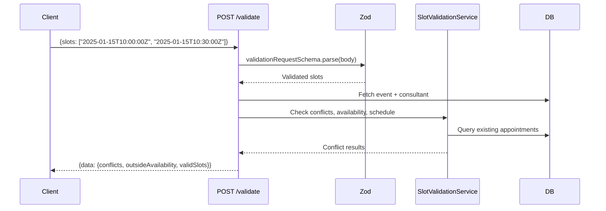
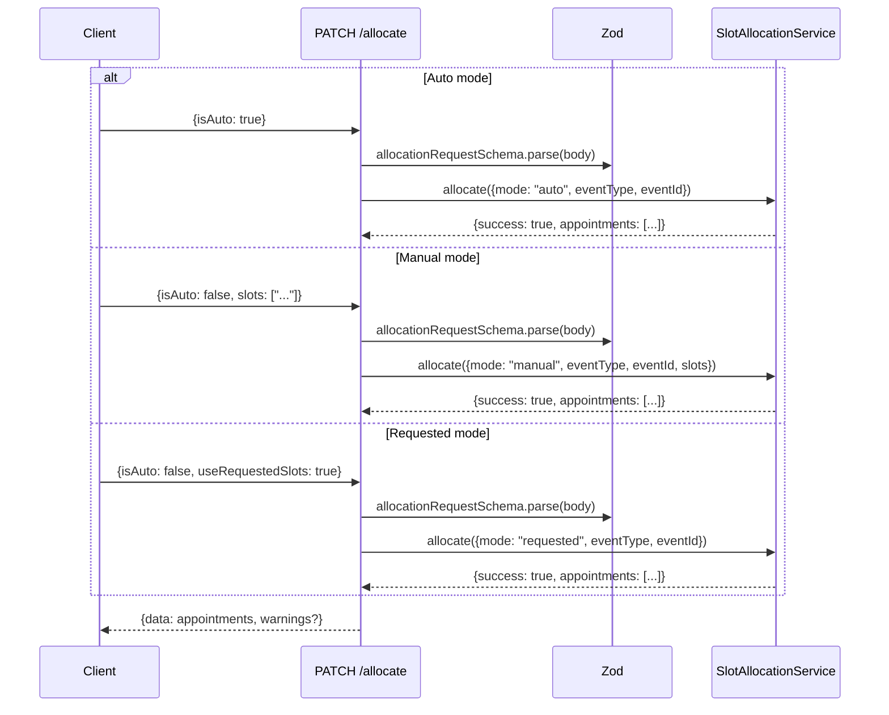

# API Reference

## Endpoints Overview

| Event Type   | Validate (POST)                           | Allocate (PATCH)                          |
| ------------ | ----------------------------------------- | ----------------------------------------- |
| Consultation | `/api/bookings/consultations/{id}/validate` | `/api/bookings/consultations/{id}/allocate` |
| Subscription | `/api/bookings/subscriptions/{id}/validate` | `/api/bookings/subscriptions/{id}/allocate` |
| Webinar      | `/api/bookings/webinars/{id}/validate`      | `/api/bookings/webinars/{id}/allocate`      |
| Class        | `/api/bookings/classes/{id}/validate`       | `/api/bookings/classes/{id}/allocate`       |

All endpoints require session-based authentication. The `{id}` parameter accepts UUID or CUID format.

---

## Slot Endpoint Authentication

All `/api/slots/` endpoints are covered by `AUTHENTICATED_API_PREFIXES` in middleware, meaning they require a valid session cookie. Two sub-paths are exempted as public:

| Path                                    | Auth Required | Notes                                                              |
| --------------------------------------- | ------------- | ------------------------------------------------------------------ |
| `/api/slots/availability/`              | No            | Public -- consultees can view consultant availability without auth |
| `/api/slots/availability-with-allocation/` | No         | Public -- includes allocation data for calendar display            |
| `/api/slots/appointments` (GET)         | Yes           | Non-privileged users are filtered to their own profile only        |
| `/api/slots/appointments` (POST)        | Yes           | Admin/staff only                                                   |
| `/api/slots/appointments/[id]` (GET)    | Yes           | Requires participant check (consultant or consultee on the appointment) |

**Removed (booking-journey audit B3 / #1193)**: the `[id]` route's `PATCH` (blind delete-all + slot recreate with no conflict validation and no `consultantProfileId`, so recreated confirmed slots sat OUTSIDE the `slot_no_confirmed_overlap` guard), `PUT`, and `DELETE` (hard-delete bypassing the soft-cancel doctrine) handlers. No in-repo caller used them; slot mutations go through `SlotAllocationService` (allocate/reschedule/manage-timings), which carries locks, revalidation, and the GiST backstop.

### Status Filters

The `/api/slots/appointments` GET endpoint supports status filtering. The accepted status values depend on the event type:

| Event Type                   | Status Enum    | Valid Values                                       |
| ---------------------------- | -------------- | -------------------------------------------------- |
| Consultation / Subscription  | `AppointmentStatus` | PENDING, APPROVED, APPROVED_PENDING_PAYMENT, etc. |
| Webinar / Class              | Event status   | SCHEDULED, IN_PROGRESS, COMPLETED, CANCELLED       |

---

## Validate Endpoints

**Method**: `POST /api/bookings/{type}/{id}/validate`

Pre-flight check before allocation. Returns which slots have conflicts, which are outside availability, and which are valid.



### Request

```json
{
  "slots": ["2025-01-15T10:00:00Z", "2025-01-15T10:30:00Z"]
}
```

Slots must be ISO 8601 datetime strings. Array must have at least 1 element.

### Response (200)

```json
{
  "data": {
    "conflicts": [
      {
        "slot": "2025-01-15T10:00:00Z",
        "existingAppointment": {
          "type": "CONSULTATION",
          "with": "John Doe",
          "time": "10:00 AM - 10:30 AM"
        }
      }
    ],
    "outsideAvailability": [{ "slot": "2025-01-15T14:00:00Z" }],
    "validSlots": ["2025-01-15T10:30:00Z"]
  }
}
```

### Subscription/Class Extensions

Subscription and class validate endpoints return additional fields:

```json
{
  "data": {
    "conflicts": [],
    "outsideAvailability": [],
    "validSlots": ["..."],
    "weeklyDistribution": {
      "2025-01-12": 2,
      "2025-01-19": 1
    },
    "totalScheduled": 3,
    "totalRequired": 10
  }
}
```

---

## Allocate Endpoints

**Method**: `PATCH /api/bookings/{type}/{id}/allocate`

Creates or replaces appointments for an event. Three allocation modes:



### Auto Mode Request

```json
{ "isAuto": true }
```

System finds the first available slots automatically. For consultations/webinars: first consecutive block. For subscriptions/classes: distributed across weeks.

### Manual Mode Request

```json
{
  "isAuto": false,
  "slots": ["2025-01-15T10:00:00Z", "2025-01-15T10:30:00Z"]
}
```

Slot count must be an exact multiple of `slotsPerSession`. Duplicates are rejected.

### Requested Mode Request

```json
{
  "isAuto": false,
  "useRequestedSlots": true
}
```

Approves pre-created appointments from a consultee's request. Verifies appointments exist and clears `isTentative` flags.

### Response (200)

```json
{
  "data": [
    {
      "id": "appointment-id",
      "appointmentType": "CONSULTATION",
      "slotsOfAppointment": [
        {
          "id": "slot-id",
          "startsAt": "2025-01-15T10:00:00.000Z",
          "endsAt": "2025-01-15T10:30:00.000Z",
          "isTentative": false
        }
      ]
    }
  ],
  "warnings": []
}
```

---

## Error Codes

| Status | Cause                   | Example                                                                   |
| ------ | ----------------------- | ------------------------------------------------------------------------- |
| 400    | Zod validation failure  | `"slots: Each slot must be a valid ISO 8601 datetime string"`             |
| 400    | Business rule violation | `"Consultation requires exactly 2 slots (1 hour) but 3 provided"`         |
| 400    | Duplicate slots         | `"Duplicate slots detected: 3 slots provided but only 2 are unique"`      |
| 404    | Event not found         | `"consultation not found"`                                                |
| 409    | Slot conflict           | `"Slot already booked: 1/15/2025 (conflicts with consultation for John)"` |
| 500    | Transaction failure     | `"Allocation failed"`                                                     |

### Zod Error Format

Zod errors are formatted as semicolon-separated field:message pairs:

```
"slots: Each slot must be a valid ISO 8601 datetime; isAuto: Required field"
```

---

## Zod Schema Reference

**File**: `schemas/slotAllocation/validationSchemas.ts`

### allocationRequestSchema

| Field               | Type     | Required    | Description                                                                         |
| ------------------- | -------- | ----------- | ----------------------------------------------------------------------------------- |
| `isAuto`            | boolean  | Yes         | `true` for auto allocation, `false` for manual/requested                            |
| `useRequestedSlots` | boolean  | No          | `true` to approve pre-created consultee appointments                                |
| `slots`             | string[] | Conditional | ISO 8601 datetimes. Required if `isAuto: false` and `useRequestedSlots` is not true |

### validationRequestSchema

| Field   | Type     | Required    | Description                           |
| ------- | -------- | ----------- | ------------------------------------- |
| `slots` | string[] | Yes (min 1) | ISO 8601 datetime strings to validate |

### eventIdSchema

Validates URL path parameter `{id}`. Accepts UUID (`xxxxxxxx-xxxx-xxxx-xxxx-xxxxxxxxxxxx`) or CUID (`cxxxxxxxxxxxxxxxxxxxxxxxxx`).

---

## Type Definitions

**File**: `utils/slotAllocation/types.ts`

| Type                       | Description                                                                                        |
| -------------------------- | -------------------------------------------------------------------------------------------------- |
| `EventType`                | `"consultation" \| "subscription" \| "webinar" \| "class"`                                         |
| `AllocationMode`           | `"auto" \| "manual" \| "requested"`                                                                |
| `AllocationRequest`        | `{eventType, eventId, mode, slots?}`                                                               |
| `AllocationConstraints`    | `{schedulingPeriod, slotsRequired, sessionDuration, sessionsPerWeek, ...}`                            |
| `ValidationResult`         | `{isValid, errors: string[], warnings: string[]}`                                                  |
| `SlotConflictResult`       | `{conflicts[], outsideAvailability[], validSlots[]}`                                               |
| `AllocationResult`         | `{success, appointments?, error?, warnings?}`                                                      |
| `TimeSlot`                 | `{startTime, endTime, isAvailable, isBooked}`                                                      |
| `ProgressInfo`             | `{scheduled, required, remaining, sessionDuration, displayText}`                                   |
| `ConsultantAllocationData` | `{userId, scheduleType, slotsOfAvailabilityWeekly[], slotsOfAvailabilityCustom[]}`                 |
| `EventConfig`              | `{durationInMonths?, durationInHours?, sessionDurationInHours?, sessionsPerWeek?, schedulingPeriod?}` |
