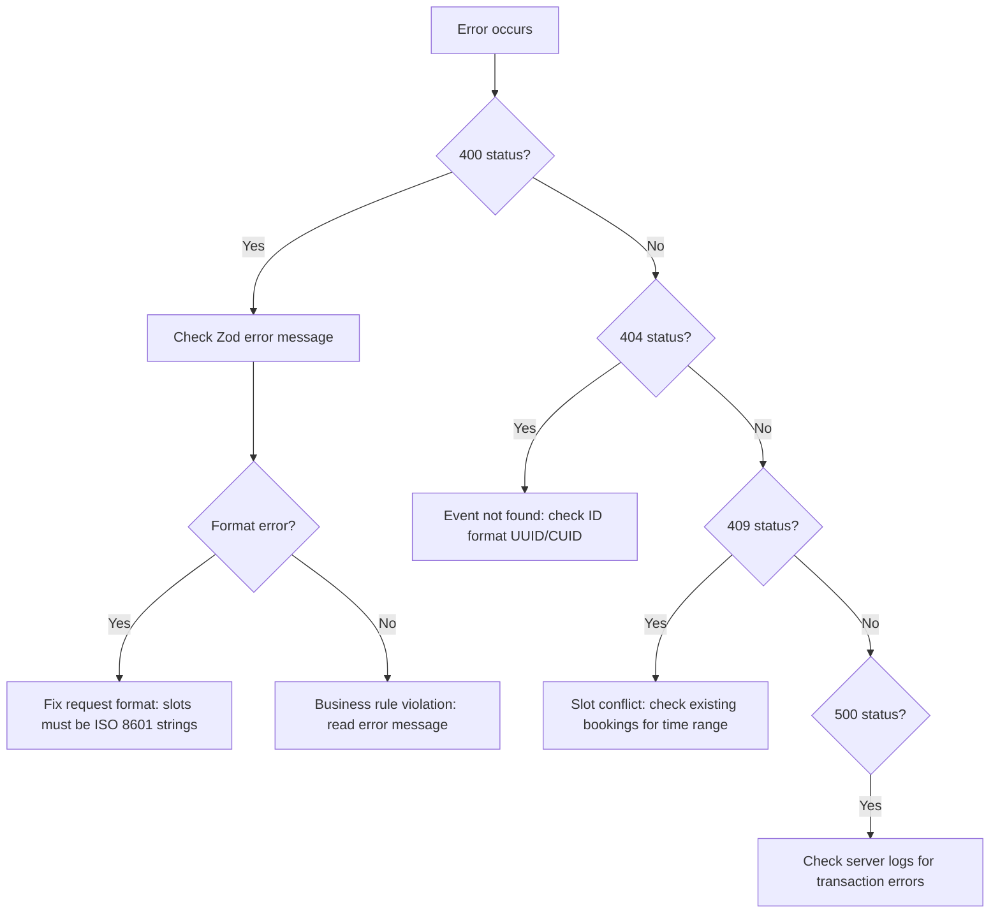

# Troubleshooting & Changelog

## Quick Error Lookup

| Error Pattern                            | Category           | Cause                                             | Fix                                                          |
| ---------------------------------------- | ------------------ | ------------------------------------------------- | ------------------------------------------------------------ |
| `"Slots must be consecutive"`            | Validation         | Gap between selected slots                        | Ensure 30-min intervals with no gaps                         |
| `"Weekly limit exceeded"`                | Subscription       | More calls than `sessionsPerWeek` in a week       | Remove excess calls; check Sunday-Saturday boundaries        |
| `"Outside scheduling period"`            | Subscription/Class | Slot before startDate or after endDate            | Select within [startDate, endDate]                           |
| `"Slots in the past"`                    | Universal          | Slot < now + 5 seconds                            | Select future slots; 5-second buffer for processing          |
| `"Does not match consultant's schedule"` | Universal          | Slot not within any availability window           | Check weekly/custom availability; ensure correct day-of-week |
| `"No available slots found"`             | Auto allocation    | Consultant has no open slots in the search window | Add availability; check for conflicts                        |
| `"Slot already booked"`                  | Conflict           | Range overlap with existing appointment           | Choose a different time; check for PENDING bookings          |
| `"Invalid slot count"`                   | Manual allocation  | Count not a multiple of slotsPerSession           | Must be exact multiple (e.g., 2, 4, 6 for 1h sessions)       |
| `"Duplicate slots detected"`             | Manual allocation  | Same slot provided twice                          | Remove duplicates from request                               |
| `"Cannot approve requested slots"`       | Requested mode     | No appointments exist for the event               | Consultee needs to resubmit request                          |

## Common Issues

### Validation Errors

**"Slots must be consecutive"**
Slots are sorted by time and checked pairwise: each gap must be exactly 30 minutes (with 1-second tolerance). Common causes:

- Missing a slot in the middle of a block
- Timezone conversion creating small offsets
- Frontend sending slots from different days

**"Does not match consultant's schedule"**
For **weekly** schedules: the validator compares the slot's day-of-week and time-of-day against the availability windows. It uses the `startDay`/`endDay` DayOfWeek enum and `startTimeUtc`/`endTimeUtc` Int fields (minutes since midnight UTC, 0-1439).

For **custom** schedules: the validator checks overlap between the proposed 30-min slot and each custom availability range.

### Allocation Failures

**"No N consecutive slots available"**
Auto allocation searched 8 weeks of weekly occurrences (or all custom slots) and couldn't find a consecutive block. Either:

- Consultant doesn't have enough consecutive availability
- All matching slots are already booked
- Scheduling period is too restrictive

**Transaction timeouts**
All allocations run in 60-second Prisma transactions. Large allocations (200+ slots for long subscriptions) may approach this limit. The timeout is generous but not infinite.

### Data Issues

**Calendar showing stale data**
`useCalendarData` fetches in parallel and caches results. Call the refetch functions to force refresh. The server-calculated `bookingStatus` is the source of truth.

**Progress showing wrong count**
`calculateProgress` counts **completed calls** (consecutive groups of `slotsPerSession` slots), not raw slot count. Ensure selected slots form complete sessions.

**Historical: the calendar accepted a selection the server then rejected near midnight IST**
Before July 2026 the client bucketed daily and weekly limits by the browser's local day while the server bucketed by its own (UTC in production), so for slots between 00:00 and 05:30 IST the two sides disagreed — the calendar would allow a selection that the allocate endpoint rejected with a `WEEKLY_LIMIT` or `DAILY_LIMIT` error (or, in the other direction, block a selection the server would have accepted). Both sides now bucket with `SlotCalculationService.dayKey()`/`weekKey()` in the event's scheduling timezone (ADR B9). If this symptom reappears, look for a new call site that buckets with `toDateString()`, date-fns `startOfWeek`, or local `getDay()` instead of the shared helpers.

**"Already allocated" toast when clicking Allocate**
The Allocate Slots dialog sends `initialAllocation: true`, so the server returns 409 when the request already has confirmed slots — typically because the same request was allocated from another tab or by another teammate moments earlier (ADR B10). The dialog closes and the request list refreshes; this is the intended outcome, not an error to investigate. Reschedule flows do not send the flag and are unaffected.

## Debugging Strategy



**Layer-by-layer approach**:

1. **Layer 1 (Zod)**: Is the request format valid? Check `allocationRequestSchema` or `validationRequestSchema`.
2. **Layer 2 (Business rules)**: Does the request meet business constraints? Check `SlotValidationService` universal + event-specific validators.
3. **Layer 3 (Database)**: Are there constraint violations? Check Prisma transaction logs.

---

## Changelog: 2026-09-03 — wave 6

Wave 6 finishes the doctrine cleanups that waves 1-5 started. Each PR appends its own subsection here.
Wave 6 picks up the follow-ups that wave 5 left marked in the code. Each PR appends its own subsection here.

### PR 0 — the gateway loads at call time, and test keys on production need an explicit opt-out (`fix/gateway-lazy-import-and-test-key-optout`)

- **Cancel, cancel preview, reject and checkout returned a bare 500 page on production.** The post-release verification on 2026-09-03 found every one of them dying before its handler ran. The Netlify function logs named the cause: the production context carries a Razorpay TEST key, and the #1219 guard in `lib/payments/core/razorpay.ts` throws at module load when it sees one under the production posture. That guard has shipped in every release since 2026-08-26, so checkout, gateway refunds and Razorpay webhooks had been dead on production for a week, hidden behind the signup outage (#1298). Wave 5 widened the blast radius: the cancel preview route started importing `booking-refund`, which imports `refund.ts`, which imported the gateway barrel as a value, so a request that needed no gateway at all still evaluated the core and tripped the guard.
- **The gateway barrel is now imported at its three call sites, not at module load.** `refund.ts` keeps a type-only import for its return type and does `await import("@/lib/payments")` at the one place it calls the gateway; `approval-payment.ts` and `checkout.ts` do the same for intent minting and cancellation. A bundle that quotes, previews or soft-cancels never evaluates the Razorpay core; a real gateway call under a bad posture still fails closed with the guard's own message, now as a JSON error the route can classify and a Sentry event, instead of a platform error page. The guard itself and its pinned "dies at require time" contract are untouched.
- **A documented opt-out for the pre-launch window.** With `RAZORPAY_ALLOW_TEST_KEYS_IN_PRODUCTION=true` the guard logs a loud error and lets the module boot, because the production site legitimately runs on test keys while signup is closed and checkout is exercised with test cards. The variable is declared in the required-secrets reference with the rule that it is deleted, and LIVE keys set, before signup opens. The owner chose this posture on 2026-09-03 over switching to live keys immediately.
- Two pins in the existing guard suite: the opt-out boots with the warning, and the refund modules load under the production posture with a test key while the core still throws.

### PR A — top-up allocation places only the missing sessions (`feat/allocation-top-up-mode`, #1206)

- **`autoAllocate` gains a `topUp` mode that never deletes anything.** A partial allocation confirms some of a plan's sessions and leaves the rest unplaced, and until now the only way to recover them was to re-run the ordinary auto path, which deletes every confirmed appointment and re-plans the whole event from scratch. That is correct for a reschedule and destructive for an event whose earlier sessions are already booked and paid, so the recovery was left to the consultant. With `topUp: true` the allocator skips `deleteExistingAppointments` entirely, treats every confirmed appointment as fixed, and asks the search only for the plan's total minus the sessions that already exist.
- **The fixed sessions keep blocking the search and keep counting toward the caps.** A top-up excludes no appointment from the occupancy scan, so the confirmed sessions' intervals stay in the booked set, and their weeks and days seed the per-week and per-day counters exactly as the validator will re-count them. That is the whole difference between a top-up and a re-plan expressed in one list: the ordinary path excludes the event's own appointments because it is about to delete them.
- **The "already fully scheduled" guard answers instead of throwing.** For a top-up, an event that is already complete, and an event whose consultant still has no room, both return a success carrying `noChange: true` rather than a 409 or a `SLOT_SHORTAGE`. A sweep that runs every hour over every incomplete event cannot treat "nothing to do" as an error. A top-up asked for _without_ `allowPartial` still gets the typed `SLOT_SHORTAGE` back, so the consultant's dialog can keep offering to place what fits.
- **Nothing is notified on a run that changed nothing.** `allocate()` suppresses the allocation-time notice when `noChange` is set, which is the precondition the deferred sweep was waiting on: without it the consultee would be told about their booking once an hour, forever, until their consultant happened to publish more availability. When at least one session is placed, the existing complete or partial notice fires once, and its counts are reported against the plan rather than against the run, so a consultee reads "three of four scheduled" rather than "one of four".
- **The hourly `reconcile-slot-availability` job now runs the pass the code had a comment where.** The cohort is recurring events — APPROVED subscriptions and SCHEDULED or IN_PROGRESS classes — whose scheduling window is still open, which carry at least one confirmed session, which carry no tentative slot (a reschedule or a live checkout hold must not be topped up underneath), and whose confirmed session count is short of what the plan requires. Each candidate is attempted only when its consultant's `SlotOfAvailabilityWeekly` or `SlotOfAvailabilityCustom` rows have been touched since the event's own `updatedAt`, because re-searching an unchanged calendar can only reach the same answer. No column was added for that timestamp: a successful top-up re-stamps the request or the class through its transition helper, so `updatedAt` already means "when this event was last attempted".
- **The pass is bounded so the fleet's heaviest cron does not grow a second unbounded tail.** The candidate read is capped, at most twenty-five events are attempted per run, and the loop stops after a minute of wall clock; whatever is skipped is picked up the following hour, ordered so that the consultants who most recently opened up time are served first. One event's failure never ends the sweep, and top-up failures are counted and logged rather than folded into the job's error list, because a calendar with no room is an ordinary outcome and a red cron trains people to ignore it.
- **Review round: a top-up that cannot apply is refused, and the sweep rotates.** `topUp` on a single-session event, on an event with tentative rows, or on an event with nothing confirmed is now a 400 `VALIDATION_ERROR` instead of a silent downgrade to the ordinary delete-and-re-plan path; a whole plan reports `partial: false`. The sweep excludes soft-deleted appointments, reads only the ids of confirmed appointments (the count is the session count), scans in `updatedAt` order across up to three pages, and bumps the event's `updatedAt` on every outcome, including no-change and failure, so the same rows no longer head the list every hour.
- **The four allocate routes accept `topUp` in their shared Zod input** and honour it only for the event's consultant or a privileged caller, on the same footing as `allowPartial` — a consultee may not decide how someone else's calendar is re-planned. The success responses now carry `noChange` so a caller can tell "sessions were added" from "already complete, or still no room".

### PR B — the last tentative-slot hard deletes become soft cancels (`fix/tentative-slots-soft-cancel`)

- **Review round: every slot-status write and its history rows share a transaction, and the sweep's guards ride the write.** The three sweeps and the auto-complete pass now run `transitionSlotCompletion` inside `prisma.$transaction`, so a slot can never be moved without the audit row that says why. `cleanup-tentative-slots` repeats its cohort's parent-status predicates in the CAS WHERE, so a request that went back under review, or an event that went live, between the scan and the write keeps its hold. The forbidden-delete pin tolerates whitespace and bracket access and matches allowlisted files exactly, and the cancel-vs-webhook chaos scenario asserts the tombstone state after a cancel win.
- **Review round 2: sweep transactions are bounded.** The helper writes one history row per moved slot, so a whole cohort in one transaction (up to 5,000 rows for the tentative cleanup) would outlive Prisma's default timeout and roll back to zero. `lib/booking/slot-release.ts` now moves cohorts in chunks of 200, each in its own 30-second transaction; the stale-RESCHEDULED release and the three auto-complete passes read a bounded, oldest-first cohort first. The PENDING-consultation expiry commits the EXPIRED transition and the release of its holds in one transaction per consultation, so a failed release can never leave an expired request holding the calendar.
- **The four remaining tentative-hold deletes now free the slot by status.** Doctrine rule 2 says a slot is released by its `completionStatus`, never by a `DELETE`, but four sites still called `slotOfAppointment.deleteMany` on tentative rows: the PENDING-consultation expiry and the stale-RESCHEDULED release in `scripts/appointments/expire-stale-requests.ts`, the stale-hold sweep in `scripts/appointments/cleanup-tentative-slots.ts`, the direct-booking arm of `releaseSlots` in `lib/payments/operations/cancel-pending.ts`, and the failed-payment cleanup in `lib/payments/webhooks/handlers.ts`. All five call sites now route through `transitionSlotCompletion` to `CANCELLED` with a `deletedAt` tombstone, so the hold is released for availability while the row survives for support, disputes and refunds. Every guard that made each site correct — `isTentative: true`, the no-SUCCEEDED-payment predicate, the re-checked parent status — is carried into the compare-and-set WHERE clause verbatim, so a booking that was approved or captured between the cohort read and the write still matches zero rows. The allocator's own re-planning delete in `utils/slotAllocation/SlotAllocationService.ts` remains the one sanctioned exception, because it releases never-paid rows under a `payment: { none: {} }` guard.
- **The stale-RESCHEDULED sweep moves its status scope out of the WHERE and into the from-set.** `transitionSlotCompletion` spreads the caller's WHERE and then overwrites `completionStatus` with its own allowed-from list, so leaving `completionStatus: "RESCHEDULED"` in the WHERE would have silently widened that sweep to SCHEDULED rows it must never touch. The scope is now expressed as `fromIn: ["RESCHEDULED"]`, which the helper bakes into the same statement.
- **Every follow-up read that counts remaining slots now filters the tombstones out.** A soft-cancelled row stays in the table, so the failed-payment cleanup's `remainingSlots` count and the tentative sweep's own cohort read would otherwise never reach zero again: the EXPIRED transition that the count gates would stop firing, and the sweep would refill its per-run cap with its own dead rows on every pass. The orphaned-confirmation reconciler's "still blocked" check is filtered for the same reason, so a successful re-drive is no longer reported as a conflict. Occupancy needed no change, because `buildOccupiedAppointmentFilter`, the grid route and `SlotValidationService` already require `deletedAt: null` on both the slot and its appointment.
- **The lapsed pay-link arm of the expiry sweep stops writing status bare.** `expirePaymentPendingRequests` moved `APPROVED_PENDING_PAYMENT` to `EXPIRED` with a bulk `updateMany` that carried neither the compare-and-set from-set nor the money predicate, which made it the standing counter-example to doctrine rule 1 rather than an instance of it. Because `reconcile-payment-status` flips a recovered capture to SUCCEEDED without touching the request, a booking the buyer had paid for could be expired in the window between the scan and the write, and no `BookingStatusHistory` row was written to show it had happened. Each request now moves through `transitionConsultationRequest` or `transitionSubscriptionRequest` in its own transaction with `fromIn: ["APPROVED_PENDING_PAYMENT"]` and the unpaid predicate repeated in the WHERE, so a raced capture matches zero rows and is counted as skipped instead of expired.
- **Auto-complete's slot-level pass stops stamping holds it should not reach.** The three statements in `completeIndividualSlots` wrote `completionStatus` with a bare `updateMany`, which made them the last uncovered writers of that column and gave them no audit row. Worse, the WHERE clause filtered on nothing but the status and the end time, so an unpaid tentative hold on a slot whose time had passed was marked UNVERIFIED an hour later, and a slot that a sweep had already released was re-stamped from its tombstone. Marking a hold UNVERIFIED is not cosmetic: it moves the row out of the from-set that the release sweeps reach through, so the hold survives every subsequent pass and keeps blocking the consultant's calendar. All three passes now go through `transitionSlotCompletion` with `fromIn: ["SCHEDULED"]`, which is narrower than the map's default so an hourly fallback can never lift a slot a human parked for review, and both `isTentative: false` and `deletedAt: null` ride the same compare-and-set WHERE. The job's counts and log line are unchanged.
- **Two smaller corrections ride along.** The maintenance preflight check counted upcoming sessions without excluding tombstones, so it warned the operator about cancelled sessions that were never going to happen. The lapsed pay-link arm gains a `MAX_REQUESTS_PER_RUN` cap of 500 per cohort, oldest first, matching the cap the tentative sweep already carries: now that each request expires in its own transaction rather than one bulk statement, an unbounded backlog would exhaust the function before it finished, and a capped run logs a warning so the next scheduled run is known to be continuing.
- **The forbidden-delete pin is now a repo-wide rule rather than a list of named files.** `__tests__/payments/appointment-delete-forbidden.test.ts` previously asserted that three specific sweeps were free of `slotOfAppointment.delete`, which is exactly why four other sites kept the shape for months. It now walks `scripts/`, `jobs/`, `lib/`, `app/` and `utils/` — 1,563 source files — against an allowlist of exactly the allocator plus seed and reset scripts under `prisma/` and `scripts/db/`, so a new delete site fails the moment it is written.

### PR C — every status history row carries its appointment id, and creation is a row

- **The audit column was dead.** `BookingStatusHistory.appointmentId` has existed since wave 5 and `appendHistory` has always been willing to write it, but the value only ever arrived when a caller volunteered one, and no caller ever did. Every row in the table therefore carried NULL, and the staff timeline resolved a booking's trail entirely through the polymorphic `{ entity, entityId }` arms of its OR. Each of the seven helpers already reads a pre-image inside its transaction to learn the from-status, so the appointment id now rides that same read and is stamped automatically. A caller that knows better still wins, because the resolution only fills in what the caller left out.
- **Two entities deliberately keep writing NULL.** A subscription and a class own `Appointment[]` rather than a single appointment, so their pre-image selects two live appointments and stamps the id only when exactly one came back. A multi-appointment aggregate has no single appointment to name, and guessing one would point the trail at an arbitrary member. A trial that has not been placed yet is the other case: its `appointmentId` is genuinely null until acceptance schedules the session. Both fall back to the entity arms, which is why those arms are load-bearing rather than a transitional fallback.
- **The slot sweep takes the id from the rows it moved.** `transitionSlotCompletion` sweeps a full `WhereInput`, so its callers pass either one appointment id or an `in` list, and reading the id out of the caller's WHERE would have to branch on which. The `updateManyAndReturn` that already tells the helper which slots moved now returns each row's `appointmentId` alongside its id, so the stamp is exact in both shapes and needs no branch.
- **Creation is now a history row.** A freshly created request had never transitioned, so it had no rows at all and the staff timeline answered "nothing has moved on this booking yet" for every new booking on production. A new `appendCreationHistory` helper writes one opening row in the same transaction as the create, from the literal `"CREATED"` to whatever status the row was born in. The literal matters: `appendHistory` renders a missing from-status as `"UNKNOWN"`, which on this surface means a concurrent writer moved the row between the pre-read and the update, and creation is emphatically not that.
- **Three creation paths write it.** The direct-checkout consultation and subscription handlers already run inside the checkout transaction and simply append after the appointment exists. The request-for-approval route did not have a transaction at all — its nested create was atomic on its own — so the create and the audit row are now wrapped in one, budgeted well inside the sixty-second slot lock the route already holds. The capture webhook's own creators in `lib/payments/webhooks/handlers.ts` are deliberately out of scope for this PR. They are the legacy fallback that builds a booking when the payment carries no appointment because checkout never made one, so a booking born that way still opens with no creation row and its timeline starts at its first real transition.

### PR D — scoped rate cards reach settlement, behind a flag that defaults off (`feat/rate-card-scoped-settlement`)

- **A rate card scoped to a contract or a plan could be created and never chosen.** `resolveEffectiveRateCard` ranks eight tiers, from the per-expert membership override down to the hardcoded 10/10/80, but its only settlement caller passed just the org, the membership override and the effective instant. Tiers 2 through 6 — contract-scoped and plan-scoped cards — were therefore unreachable, so an org that configured a negotiated split through `POST /organizations/{orgId}/rate-cards` watched every booking settle on the org default instead, with no error anywhere to say so. `resolveOrgSplit` (`lib/payments/payouts/earnings-service.ts`) now forwards the booking's `contractId`, `planType` and `planId` as well.
- **The forwarding is gated on `RATE_CARD_SCOPED_RESOLUTION`, which is on only when the value is exactly `on`.** Flipping it changes which card pays live money: any scoped card an org created while the tiers were dark would begin settling at a different split the moment it became selectable, so an org has to be able to audit its cards first and flip second. The gate is `isScopedRateCardResolutionEnabled()` in `lib/api/organizations/rate-card.ts`, read from `process.env` per call rather than at module load so the flip is a deployment variable rather than a value baked into whichever bundle imported the module first. With the flag off the resolver call is the pre-#1335 one verbatim, and the scoped tiers are not even queried.
- **The effective instant is unchanged.** Settlement still resolves at `payment.createdAt`, because a hold can be days long and a retroactive rate bump must not rewrite what a consultant was owed for work already delivered.
- **The contract is forwarded only when it belongs to the settling org.** The one link a settling payment has to a `Contract` is the org-funded chain `BookingUtilization` → `ProgramAssignment` → `Program` → `Contract`, and `Contract.organizationId` is the **sponsoring** org while `resolveOrgSplit` resolves the expert's **host** org. Because a contract-scoped card is created with the contract checked against its own org, and the resolver then matches `ownerContractId` without re-asserting the org, forwarding a sponsor's contract unguarded would settle one tenant's booking on another tenant's negotiated split. Contract scope is consequently reachable only where the sponsor and the host are the same organization, which is the HYBRID case the tier was designed for. Marketplace and self-funded bookings have no contract at all, and a subscription meters its utilization at slot-allocation time, so it has none yet at settlement; both resolve null and fall through to org scope.
- **Consultation and subscription bookings resolve at plan-type granularity, not plan granularity.** `planType` is derived from the settlement's own `AppointmentType` through an exhaustive record, so all four kinds reach tiers 4 and 5, but only webinar and class carry a plan id into settlement, so only they reach tiers 2 and 3. A card scoped to a specific consultation or subscription plan is still never selected; closing that means widening the payment projection at the three `createEarningsFromPayment` call sites.
- **The collaborator leg forwards no scope under either flag state.** ADR 18 makes collaborations org-blind — a collaborator on someone else's org-owned plan is not that org's expert — so the seller's contract and plan must not select a card owned by the collaborator's own org.
- **`sync-payment-earnings` reads the flag too.** The earnings healer accrues through the same `createEarningsFromPayment` the capture webhook uses, so the workflow now carries `RATE_CARD_SCOPED_RESOLUTION` in its environment. Set on Netlify alone, the same booking would have settled on the scoped card when the webhook caught it and on the org default when the healer did.
- **Pin:** `__tests__/payments/rate-card-scoped-settlement.test.ts` drives the real resolver end to end and asserts the bps that land on the earnings rows — the plan-scoped card's split with the flag on, the org default's with it off, and no contract query at all when the sponsoring contract belongs to another org.

### PR E — the cancel and reschedule routes go through the CAS helpers (`fix/lifecycle-routes-cas-helpers`)

- **A successful cancel wrote no history and left its slots holding the calendar.** The two most-used lifecycle routes carried seventeen raw status writes between them — eight in cancel, eight in reschedule, one in `lib/booking/reschedule-withdraw.ts` — so doctrine rule 1 was false exactly where it matters most. Each write did re-check the status in its own WHERE, so the compare-and-set itself was sound, but nothing appended the `BookingStatusHistory` row the helpers write, which is why that table is empty on production, and the cancelled slots were stamped CANCELLED without the `deletedAt` tombstone, so every reader that filters on `deletedAt: null` still saw the consultant as busy. Both routes now call `transitionConsultationRequest`, `transitionSubscriptionRequest`, `transitionWebinarEvent`, `transitionClassEvent`, `transitionSlotCompletion` and `transitionRescheduleRequest` with the same `tx`, and the raw count in the three files is zero.
- **The client contract is unchanged.** The helpers throw `IllegalTransitionError` where the routes used to read a zero count, so each route catches it and answers with the code it always answered: 409 `NOT_CANCELLABLE` on cancel, 409 `NOT_RESCHEDULABLE` on reschedule. Every WHERE guard was preserved as `fromIn` plus its non-status predicates, and the sweeps that legitimately match no live row — a cancel of a fully delivered booking, a release that finds nothing — pass `allowZero` rather than turning a 200 into a conflict.
- **Only the cancel path tombstones.** A cancelled slot is retired, so it takes `deletedAt` alongside the terminal status, which is the shape `cleanup-abandoned-payments` already writes. A rescheduled slot is kept: the proposal's `releasedSlotIds` point at those rows and a withdrawal restores them in place, so the reschedule route flips them to RESCHEDULED and tentative and never tombstones them.
- **Closing an open proposal reads before it writes.** `transitionRescheduleRequest` CASes one row by id, so the cancel route now reads the appointment's open proposals inside the transaction and moves each to DECLINED, letting the helper release `openForAppointmentId` and stamp `resolvedAt` itself. The proposal-expiry cron holds no appointment lock and can answer a proposal in between, so a lost CAS on this step is tolerated: either way the cancelled booking ends with no open proposal, and failing the cancel over it would be the wrong outcome.
- The pin extends `__tests__/payments/cancel-route-refund.test.ts`, the suite that already drives this route: a successful consultation cancel records the request's move with the acting user and one row per slot the update actually returned, the slot write carries the tombstone, and a lost CAS still answers 409 `NOT_CANCELLABLE` with no history row written.

## Changelog: 2026-09-02 — wave 5

The wave-5 train (#1319) reconciles the original booking and maintenance audit briefs against everything that shipped in waves 1–4 and closes the residuals that survived. Each PR appends its own bullets here.

### PR 1 — CAS and delete sweep (`fix/booking-cas-and-delete-sweep`)

- The abandoned-payment sweep no longer deletes a consultation or subscription whose hold lapsed. Deleting the request cascaded the Appointment and every Payment row under it, which was the #1074 class in a second location. The request now moves to EXPIRED through the CAS helper, the slots are cancelled and tombstoned by status, and the money rows stay readable for support.
- A request that was approved but never paid is now EXPIRED, not REJECTED. REJECTED reads as the consultant declining on every dashboard. The unscheduled `app/api/cleanup/approval-payments` route, which reverted the same cohort to PENDING and was never wired to any scheduler on this deployment, is removed so there is one outcome.
- `lib/booking/transitions.ts` gains `transitionSlotCompletion` and `transitionTrialSession`. The slot completion lifecycle and the trial lifecycle were the two with no CAS helper: Stream session webhooks, the orphan reconciler, the maintenance drain, auto-complete, trial accept, cancel and conversion all wrote the status column bare, so a late webhook could stamp a cancelled slot COMPLETED. Every one of those writers now carries its allowed-from set in the WHERE clause.
- The webinar and class `crud-with-plan` routes no longer write a client-supplied status with a bare update. A stale tab could flip a cancelled, already refunded event back to SCHEDULED; the move now goes through `transitionWebinarEvent` and `transitionClassEvent`, with publishing as the one edge that leaves DRAFT.
- `auto-complete-appointments` marks webinars and classes COMPLETED only from the allowed set, and completes trials through the new helper, so a cancelled event is never resurrected into a state that releases earnings.
- The invalid-appointments and stale-pending sweeps cancel only rows that are still cancellable and report the ones that moved on instead of clobbering them. Their slot deletes are soft-cancels now.
- The admin single-payment refund goes through `refundBookingPayment`, so an org-funded intent reverses in-ledger instead of dying on an unknown gateway.

### PR 2 — schema finalization (`fix/booking-schema-finalization`)

- `AppointmentParticipant` is added as the first-class participant edge (ADR A9). Every writer that connects a user to a slot (all four checkout handlers, the allocator, trial scheduling, attendee removal, the capture webhook, cancel and refund) now records the participant row in the same transaction, and the seed suite writes it too. Nothing in production reads the table yet; `reconcile-slot-availability` logs any divergence from the slot-to-user join.
- `BookingStatusHistory` is appended inside every CAS transition helper (ADR A12), giving reschedule and cancel disputes the audit trail they lacked. The from-status is read just before the compare-and-set and the imprecision that allows is documented in the ADR.
- Ten booking models gain `deletedAt`, nine naive timestamp columns become `Timestamptz` (every column on `TrialSession` among them), seven redundant prefix indexes are dropped, `Appointment` gains an index on `(organizationId, deletedAt, createdAt)` for the org-scoped reads, and `cancelledBy` becomes a real foreign key on consultations and subscriptions.
- The two phantom columns that exist only in the database are captured by a one-off script before the reset push drops them, and the STAGED sidecar block now sits at the true bottom of `check-constraints.sql` with a reset runbook in `docs/prisma/pre-mvp-reset-runbook.md`.
- `npm run db:push` is push, then sidecars, then `db:assert-sidecars`; the assertion and the CI guard share one quote-aware parser that covers all three sidecar files, constraints, indexes and triggers alike.

### PR 3b — availability windows are merged, and validated as a union (`fix/availability-window-merge`, #1320)

- A production bug: a consultant whose Monday availability was stored as two adjacent one-hour rows saw the expert-page grid draw one two-hour block, the one-hour dialog offer both hours, and the two-hour dialog say "No available slots". The grid merged rows for display while the booking generator refused to merge across rows, because checkout validated the whole booking window against the single row the client named.
- Checkout now validates the booking window as interval containment against the union of the consultant's published rows: every thirty-minute atom must fall inside some weekly or custom row. The named row id still proves ownership and catches a soft-deleted profile, but it is no longer the boundary, and a row that was coalesced mid-checkout no longer fails the booking.
- The booking generator merges consecutive available atoms regardless of which row they came from, matching the display merge, and carries every covering row id on the merged slot.
- Availability is stored as one row per contiguous window from now on: onboarding, the settings bulk save and the single-row routes merge exactly-adjacent same-day rows on every save. A dry-run-by-default script, `scripts/db/coalesce-weekly-availability.ts`, folds the rows that already exist; because one Supabase project serves both dev and prod, running it with `--apply` is an owner-approved, backed-up operation.
- Custom availability is now merged on save as well. Production carried the same fragmentation on the date-anchored side: 1,717 of the 1,719 custom rows were exactly sixty minutes long, and twenty-nine consultants held forty-four exactly-adjacent pairs between them. Because a custom row is an absolute instant range and is purely additive — the table has no `isAvailable` and no `deletedAt` column, so a row can never express a blackout — the merge rule is simpler than the weekly one: a row folds into its predecessor when it starts exactly where the predecessor ends, or inside it, and the later of the two ends survives. Unlike the weekly coalescer, which deletes and re-creates the whole set, the custom one keeps the surviving row's identifier, because a booking can name a custom row and re-keying it mid-flight would orphan the reference. A second dry-run-by-default script, `scripts/db/coalesce-custom-availability.ts`, folds the rows that already exist, and carries the same warning about `--apply`.
- Checkout's union is now scoped to the consultant's schedule type. A consultant is either WEEKLY or CUSTOM and never both, and the expert-page allocation route has always honoured that by passing an empty array for the dormant arm. Checkout read both arms, so a row left behind when a consultant switched schedule modes could cover an atom that no surface offers, and checkout would accept a booking the calendar never drew. The two availability reads have moved into a shared `loadPublishedCoverage` helper that resolves the schedule type first and only queries the active arm; checkout and the trial route now call the same loader. The diagnostic log that fires on a rejected window carries the resolved schedule type, so a failure tells you which arm was consulted.
- The manual-allocation validator's custom branch tests containment rather than overlap. Its weekly twin asks whether a thirty-minute atom sits wholly inside a published row; the custom branch asked only whether the atom touched one, so an atom hanging half outside a custom row passed manual allocation and was then refused by checkout, which has always demanded that the whole booking window sit inside published availability. Both the branch predicate and the consecutive-issue heuristic that counts valid slots now use containment. The case the overlap test was originally written for, an atom the calendar broke out of a larger row, still passes, because such an atom is by definition inside its row.
- Scheduling a trial now validates against the published window. The trial route's schedule arm ran a conflict check and nothing else, so it only ever answered whether either participant was already booked at that time; nothing asked whether the consultant publishes availability there at all. A trial could therefore be pinned at three in the morning on a day the expert offers nothing, and the resulting appointment sat outside every calendar the platform draws. The arm now runs the same union coverage rule checkout does, on the scheduling transaction's own client so that the check shares its snapshot, and it holds even when the consultant is the one scheduling manually, because a trial is a booking like any other. An uncovered atom raises `OutsideAvailabilityWindowError`, which the route maps to a 400 rather than the 409 a lost race earns: the time was never on offer, so the request was wrong rather than unlucky.
- Every write that touches availability now runs at Serializable isolation with explicit transaction bounds. Coalescing rewrites a consultant's whole set as delete-then-recreate, so the overlap check, the write and the fold share one transaction under bounded retry in all four `/api/slots/availability` routes; the settings bulk save, which replaces the whole set from a form, joins them, because at Read Committed a second replacement takes its snapshot before the first commits, misses the rows the first inserted and leaves both sets behind — overlapping availability, which every reader downstream assumes cannot exist. The bounds are explicit for the same reason the payment transactions carry them: Prisma's two-second wait and five-second budget are sized for a single statement, and one connection per function instance means a busy instance can spend the wait before the transaction starts. The single-row routes also answer strictly with the row that covers the saved window; when no row does, they fail with a 500 rather than echoing the pre-coalesce row, whose identifier the same transaction may have just deleted.

### PR 5 — maintenance and cron coverage (`fix/maintenance-and-cron-coverage`)

- Guarded the 13 `jobs/**` entrypoints that called neither `abortIfMaintenance` nor anything equivalent, so they had been connecting to Postgres regardless of the maintenance phase, including during an OFFLINE window when the database may be mid-migration. Six of them move money or mutate the org contract/program state the checkout sponsorship resolver reads, so those six also joined `FINANCIAL_JOB_NAMES` and now run fail-closed, and `auto-renew-contracts` and `expire-contracts` were flipped from `failMode: "open"` to `"closed"` to satisfy the cron-lock registry invariant. The sweep also found that `jobs/cleanup/prune-system-events.ts` had no `require.main` entry point at all, so its daily workflow only ever loaded the module and exited without pruning a single `SystemEvent` row; that entry point was added alongside the guard.
- Added `assertNotInMaintenance(jobName)`, the throwing twin of `abortIfMaintenance`, because the 44 HTTP routes under `app/api/cleanup/**` import the same job cores as the `jobs/**` entrypoints but cannot call `abortIfMaintenance` itself: its `process.exit(0)` would take the whole Next.js instance down with the request. The new guard surfaces a typed `MaintenanceActiveError` with `httpStatus = 503`, both guards now share one phase-read and one verdict function so they cannot drift apart, and 43 of the 44 routes call it after their cron-secret check — every one except `approval-payments`, which is owned by a sibling PR. `reconcile-sessions` originally kept a local `getMaintenanceState()` check that blocked only OFFLINE; review round 1 replaced it with `assertNotInMaintenance("reconcile-orphaned-sessions")` so that route cannot drift from the shared policy the next time the phase rule changes.
- Deleted `app/api/cleanup/auto-complete-trials`, which had no `jobs/` wrapper, no GitHub Actions workflow and no Netlify schedule, so nothing had ever invoked it, and which was also substantively wrong: it completed a trial as soon as any one of its slot rows had ended, with no buffer, while the hourly `auto-complete-appointments` job already completes trials behind `COMPLETION_BUFFER_HOURS` and an `every` clause over all of the appointment's slots. Closes #1278.
- Fixed the DEGRADED write-block matcher, whose wildcard branch anchored the match to the end of the path (`startsWith(prefix) && endsWith(suffix)`), so naming a route blocked only that exact leaf and left `/api/appointments/*/reschedule/respond` and `.../withdraw` — the two routes that actually move a booking — writable through every DEGRADED window since the write-block shipped. The matcher now matches by prefix so naming a route blocks its whole subtree, and the sweep used the new semantics to add the routes the list had never covered: the approval-rail booking route, all of slot availability, per-appointment documents/feedback/support, and the `/api/organizations/*` money rails (wallet top-ups, invoices, purchase orders, programs, contracts, rate cards, payouts, payout account) plus the seat changes that meter licences. The `/api/slots/appointments` pattern was removed because both of its routes are GET-only, so it had always been a no-op.
- Added retention and reconciliation for the `SystemJobExecution` trail, which every locked cron run had been writing but nothing had ever read back: no prune meant the table only grew, and no reconciler meant a run whose process died mid-flight (an evicted Actions runner, an OOM kill) left a `RUNNING` row that stayed `RUNNING` forever, so "is this job running right now" was unanswerable from the table. The new daily job at 03:26 UTC deletes rows older than 90 days and stamps anything still `RUNNING` past six hours — an order of magnitude past the longest lock TTL and past every workflow's own timeout — as `FAILED` with a stranded-run error, reconciling before it prunes so a stranded row is never deleted unresolved.
- Fixed `GET /api/health`'s cron-heartbeat probe, whose Redis-error catch returned a body byte-identical to the "no heartbeat has ever been written" case, so an external monitor watching the field could not tell an unreadable Redis (an incident) apart from a fleet that had simply never run yet (a cold start). The probe now reports `stale: "unknown"` with `probeError: true` on failure, while keeping both paths fail-open so neither may ever be the reason the health check itself errors.
- Extracted the shared HTTP-twin shape of the `app/api/cleanup/**` routes into one factory, `cleanupRoute()` in `lib/cron/cleanup-route.ts`, to clear a SonarCloud duplication gate that the `assertNotInMaintenance` guard above had pushed over threshold: 42 route files carried a hand-copied ~75-line block for the cron-secret check, the maintenance guard, structured start/finish logging, and the three-way error mapping (lock held → 409, maintenance active → its own status, anything else → captured and 500). Thirty-six of those routes now call the factory with only the job name, the underlying script call, and their own status/summary logic; each shrank to roughly 15–30 lines with identical status codes, JSON shapes, and Sentry/Redis behaviour. Six routes were left untouched because they diverge from the shared shape in ways the factory cannot express without changing behaviour: `abandoned-payments` and `invalid-appointments` have no GET twin and their own auth or composition logic, `reconcile-sessions` composes its own response shape (its maintenance gate now goes through `assertNotInMaintenance` all the same), `approval-payments` has no maintenance guard at all and runs its business logic inline, and `mark-expired-recordings`/`transfer-expiring-recordings` route their catch-block errors through the structured `streamLogger` rather than `console.error`. `expire-unpaid-trials` was also left alone: it has no POST twin and its failure response omits the `details` field the rest of the fleet used to return.

The first CodeRabbit review of the pull request produced seven further changes, all of them in the code the sweep had just touched.

- The factory's 500 response no longer echoes `details: error.message` back to the caller. On thirty-six endpoints that string can carry Prisma query fragments, table and column names, gateway payloads and payout identifiers, and the caller is a scheduler that has no use for any of it; the exception is still captured in Sentry with the job tag and still printed to the server log. `reconcile-sessions` was given the same treatment.
- The factory compares the `Authorization` header against the cron secret in constant time, by hashing both sides with SHA-256 and comparing the fixed-length digests, so neither the secret's length nor a matching prefix is observable through response timing. `invalid-appointments` had already done this by hand; every route on the factory now inherits it.
- The result-to-status mapping moved into one exported helper, `statusFor(result, needsAttention)`, which the five reconciliation routes and `handle-lost-disputes` now share. It also fixes an ordering bug those routes had copied from each other: they asked "is anything flagged?" before "did the run succeed?", so a run that both failed and found a flagged row answered 207 — a 2xx, which reads as healthy to anything watching the status. Failure is tested first now, which is the same masking PM-34 removed from the refund cascade.
- `app/api/cleanup/reconcile-refunds` passed the job name `"reconcile-refunds"` to its new maintenance guard, but the canonical name — the one on `FINANCIAL_JOB_NAMES` and the one the `jobs/**` entrypoint guards with — is `"reconcile-pending-refunds"`. The guard was therefore live but toothless: the route would have run a financial job straight through a DEGRADED window. It now passes the canonical name.
- `irp-uploader` joined `FINANCIAL_JOB_NAMES` and its cron lock was flipped from fail-open to fail-closed. It moves no money, but it registers IRNs with the government portal and writes the resulting IRP state onto the invoice, and an IRN can only be cancelled inside a twenty-four-hour window, so neither a partial deployment nor an unreachable Redis is an acceptable time to be submitting one.
- `advance-program-cycles` filtered non-billable organizations out of its candidate scan but never re-read that fact inside the claiming transaction, so an organization suspended or deactivated between the scan and the claim still got a fresh successor cycle minted under it. The in-transaction re-read that already covers the program and the contract now covers the organization too, and a non-billable one takes the same CLOSE path a deleted contract takes.
- The `SystemJobExecution` retention delete runs in bounded batches of five thousand rather than as one unbounded statement, so the first run after this ships does not hold row locks on a table every cron run writes to for the length of the whole backlog.

### PR 6 — booking lifecycle tail (`fix/booking-lifecycle-tail`)

The tail of the booking lifecycle audit: the places where a surface told the customer something that was not true, and the places where two concurrent requests each believed they were the only one.

- **2026-09-02 — The cancellation quote names the rail the money actually travels.** The preview derived a single `creditFunded` boolean from the `free_` intent prefix and had no branch for org funding at all, so a learner whose session their organisation had paid for was told that "refunds reach your original payment method in 5–7 working days" about a card nobody had charged. `fundingRailForIntent` is now the one derivation the quote, the charge and the consultant-side removal toast all read.
- **2026-09-02 — The consultee sees what cancelling would return, and by when.** The consultee's cancel dialog quoted the policy in the abstract while the consultant's quoted a number. It now calls the same preview endpoint and states both the amount and the deadline after which that amount drops.
- **2026-09-02 — The availability poll loop is honest about what it is doing.** The heatmap's polling decisions — whether to fire, whether a return from a hidden tab is stale enough to refetch, whether a landed response still belongs to the current navigation — are pure functions in `lib/scheduling/availabilityPolling.ts` and are unit-tested without a DOM.
- **2026-09-02 — Non-contiguous sittings stop being merged into one phantom session.** The consultee home grouped a booking's slots by day, so two sittings hours apart on the same date rendered as a single long session that nobody had booked. Closes #1199.
- **2026-09-02 — The approval mint stops writing a "pending" appointment sentinel.** The Payment column beside it had already moved to `null`, and the capture handler branches on the column, so the literal bought nothing and cost the one thing a metadata key is for: a reader could no longer tell "no appointment yet" from an appointment whose id happens to read like a sentinel. Gateway notes are string-valued, so absence is that null.
- **2026-09-02 — A duplicate trial request answers 409 rather than 500.** The request path reads the consultee/consultant pair, deletes a freed row and inserts across three statements, so two concurrent requests for the same pair both clear the eligibility read and both reach the insert. The loser now gets the same `TRIAL_ALREADY_REQUESTED` answer the sequential path gives instead of falling into the route's generic catch.
- **2026-09-02 — Removing an attendee is a single writer, so one seat refunds once.** The webinar and class participant DELETE handlers read the attendee's slot links, asked whether they had found any, and only then disconnected them in a separate transaction. A double click, a stale tab, or an organiser removing someone who was leaving at the same moment therefore had both requests see a non-empty roster and both call the seat refund, which resolves the payment by user and event rather than by what was released. The read now sits inside an interactive Serializable transaction with the write, so the losing writer finds the roster empty and returns `{ removed: false }`.
- **2026-09-02 — An org member below `operations.read` now gets the org they picked.** `resolveOrgScope` downgrades such a member from `org` to `orgMember`, and five call sites projected the resolved scope by hand while testing only `kind === "org"`. That downgrade fell through to the unfiltered arm, so picking one organisation returned every organisation the member belongs to plus their personal rows. The trial list, the consultation request list, the consultant appointments list, the consultee events read and the chat sidebar all route through `scopeOrgId` / `scopeToWhereOrgId` now, and the repeated literal `organizationId: null` personal pin is projected from the shared scope rather than re-typed at a dozen sites. `getStaffAppointments` and `getConsultantAppointments` take a required `Scope`, and the two operator appointment pages name `{ kind: "all" }` out loud, because the widest read on the platform should not be something a caller gets by omission.
- **2026-09-02 — Payer admins can see org-funded requests nobody has scheduled.** The org Requests page gates on holding a consultant profile, which is the right rule for the allocation controls and the wrong rule for the page: an OWNER or MAINTAINER who does not deliver was redirected away, leaving the delivering expert's queue as the only surface in the product that showed a funded booking with no times against it. Those two roles now get that queue read-only, with a line saying whose act allocation is. There is deliberately no allocate control.
- **2026-09-02 — A program seat may only be assigned to an ACTIVE membership.** The create path checked that the membership belonged to the organisation and stopped there, so assigning a PENDING invitee or a removed member still incremented `activeSeatCount` — the figure the invoice generator bills on — for a seat nobody could consume. Non-ACTIVE memberships now get a 409 carrying `MEMBERSHIP_NOT_ACTIVE`.
- **2026-09-02 — An org admin's reschedule proposal has a side, so exactly one party answers it.** "The counterparty" was defined as a participant who is not the initiator, which reads correctly only while the initiator is one of the two participants. An org admin matches neither profile, so the test came out true for both parties at once and the sponsored learner could accept a proposal opened on their own behalf. An org admin acts on the payer's side, so the consultant answers; an initiator who is neither party nor a payer admin resolves to no side at all and nobody can answer.
- **2026-09-02 — TRIAL is gone from the org appointments surface.** Trial checkout never stamps `Appointment.organizationId`, so the org scope's query could only ever match zero trial rows. The filter was a control that always answered "no trials", which reads as "this organisation has none yet" rather than the truth, that an organisation does not have trials at all. The query schema no longer admits the value and the table no longer carries `trialSession` columns.

### PR 3 — hold expiry and locks (`fix/booking-hold-expiry-and-locks`)

Part of #1319. This PR makes an abandoned checkout release its slot by definition rather than by cron, and retires every lock budget that could not finish inside a Netlify function.

**Hold expiry is a predicate, not a sweep outcome.** A PENDING direct-checkout appointment whose every payment row is dead (marked EXPIRED, or past `Payment.expiresAt`) no longer counts as occupancy. `isOccupiedByLiveAppointment` frees it, and its SQL twin `buildDeadHoldFilter(now)` is applied as a `NOT` inside the checkout, trial-accept and consultee-conflict queries, so the grid, the allocator, `/validate` and checkout agree the instant the thirty-minute hold lapses instead of when `cleanup-abandoned-payments` next runs. An appointment with zero payment rows still blocks, and a REQUEST_SUBMITTED request still blocks until it is decided; only the direct-checkout hold expires. The "max three pending attempts per slot" branch in `validateSlotAvailability` has been unreachable since #1169 PR 2 made any live hold block at step 1, so it is deleted.

**Lock budgets fit the function ceiling.** Every request-path acquisition now uses `REQUEST_PATH_RETRY_CONFIG` (five attempts, about seven seconds worst case). The previous default retried for up to 204 seconds against a 26-second function ceiling, so a contended request-for-approval, trial accept, allocation or approval lost as a 504 rather than a 409. The approval lock TTL is 45 seconds (`APPROVAL_LOCK_TTL_MS`), above the 30-second approval transaction timeout it used to equal exactly. `lockAppointment` goes through `acquireGuarded` (fails closed on a Redis outage, 75-second grant, above the reschedule transaction's 60-second budget) and is exposed as `withAppointmentLock`; `isAppointmentLocked` had no caller and is gone.

**Cancel and reschedule are rate-limited and serialized.** Both routes apply `eventMutationLimiter` after the session check and run their transaction under the appointment lock. A lock outage answers 503 and contention answers 423; neither is a 500 any more. The trial PATCH and DELETE routes take the same limiter — PATCH mints a pay-link and takes a slot, and DELETE reaches the refund gateway — although neither of them runs under the appointment lock. The trial scheduling transition additionally claims the status it read, narrowing `transitionTrialSession`'s allowed-from set to the single status this request observed: two accepts that both saw `PENDING` serialise on the consultee lock, but when they pick different slots neither trips the availability check, so before the claim the second one created a second appointment and overwrote `TrialSession.appointmentId`, stranding the first slot hold with nothing pointing at it. A claim that matches no row answers 409.

**The pay-link mint is its own guarded atom.** The approval-payment mint used a private `lock:approval_payment:<id>` key through the single-shot `lib/redis` `acquireLock`, where a breaker-open Redis and a held lock were indistinguishable. Review of this PR caught that the approval routes mint while they still hold `consultation-approval:` / `subscription-approval:`, so folding the mint into those keys would have made every approval contend with itself. The mint now takes `approval-payment-mint:<kind>:<id>` through the guarded path, keyed by the validated `appointmentType`, nested under the approval lock (order: approval → mint). The approval routes also re-grant their lock at the top of every Serializable attempt (`renewApprovalLock`); a lapsed grant is a 409 `APPROVAL_LOCK_LOST`, never a concurrent second mint. The two crud-with-plan delete routes and the org payout writer retry once, not three times, so their per-attempt budgets stay under the function ceiling and the 60-second payout grant.

**A dead approval intent is re-minted in place, never handed back or duplicated.** The reuse branch of `createApprovalPaymentIntent` treated every PENDING payment as live, so a row the hold rule already calls dead — marked EXPIRED, or still PENDING past its own `expiresAt` — was returned as the checkout URL. That link points at a slot `buildDeadHoldFilter` has just released, so the payer either pays for a slot somebody else now holds or pays into an order the sweep is about to void. Minting a second row is not the way out either, because `Payment` is unique on `[userId, appointmentId]` and the insert dies on P2002. The mint now creates a fresh gateway order and writes it back into the same Payment row, which keeps its id, its owner and its appointment while taking the new intent, PENDING status, a new forty-eight-hour window and the figures the gateway was actually asked for; the CARD leg is re-pointed with it so the funding legs still sum to `amount`. When the sweep has already moved the request on — a REJECTED consultation or subscription, a trial that is no longer AWAITING_PAYMENT — there is nothing left to re-mint against, so the mint raises `ApprovalWindowLapsedError` and both approval routes answer 409 telling the consultee to submit the request again. A FAILED row is untouched by this rule: a gateway rejection is retried from scratch.

**Checkout renews its slot grant on every retry attempt.** One renewal before the Serializable loop could not cover four 25-second attempts against a 60-second CONSULTATION grant, so the lock lapsed mid-payment on a retried checkout. The grant is now renewed at the top of every `withSerializableRetry` attempt with a TTL sized to one attempt plus slack (the larger of the type's TTL and 35 seconds). Lost ownership aborts the attempt with the existing "already in progress" error, which the route maps to 409. An exhausted P2034 retry budget in `app/api/checkout/route.ts` is a 409 `SERIALIZATION_CONFLICT` that tells the customer the card was not charged.

**Ten Serializable transactions retry on P2034.** Both approval routes, the four crud-with-plan routes, the org payout writer, and the collaborator invite and revenue-share updates ran Serializable transactions without `withSerializableRetry`, so a serialization failure surfaced as a 500. Each callback was audited before wrapping and contains only in-transaction writes and console logging.

**The org funding context is re-asserted under the lock.** The org gate chain (organization status and `canSponsor`, the caller's ACTIVE membership, the ACTIVE program assignment inside its period and contract window, the dunning suspension, and the DPDP session-booking consent) ran before the locks and never again, so a change between the gate and the write was still sponsored. `revalidateInsideLock` now receives the resolved organization, membership and assignment ids and re-checks each by id inside its transaction; the invoice credit limit was already re-checked inside the Serializable booking transaction and is unchanged.

**Redis health is probed once per two seconds per instance.** `checkRedisHealth(force)` caches its PING so a booking no longer pays one probe per atom; `/api/health` passes `force` to keep its own reading live.

### PR 7 — money parity and the earnings healer (`fix/booking-money-parity-tests`)

- The checkout amount derivation — list price, then discount, then GST on the discounted base, then referral credits against the tax-inclusive total — moved out of `calculateAmountAndValidate`'s Prisma transaction into `lib/payments/pricing/derive-checkout-amount.ts`. It had never been importable, so `__tests__/payments/checkout-price-parity.test.ts` transcribed the sequence by hand and said so in its own header; the suite now imports the real function, which means a change to the server's sequencing, rounding, discount cap or credit floor fails the parity check rather than passing against a stale copy. The credit balance still resolves lazily through a caller-supplied callback, so an order below the redemption floor keeps that read out of the checkout transaction exactly as before, and the suite gains the international arm it never had.
- The cancel route and its preview both computed the refund amount inline — the notice tier, the frozen snapshot policy, the per-session proration from #1006 and the clamp to the remaining refundable balance — in two files with two sets of comments explaining the same reasoning. That sequence is now `quoteBookingRefund` in `lib/payments/operations/cancellation-policy.ts` and both routes call it. Because a shared function only guarantees so much when each caller still supplies its own inputs, `__tests__/payments/refund-preview-parity.test.ts` drives the real GET and the real POST over one database stub and asserts that the amount the buyer was quoted is the amount `refundBookingPayment` is asked for, across a matrix of snapshot tiers, notice windows, paid amounts, proration and prior partial refunds.
- The earnings sweep in `scripts/earnings/sync-payment-earnings.ts` no longer forgets old money. Settlement for an org-funded checkout runs after the checkout transaction commits, so a failure there leaves a consultant unaccrued, and this sweep was the only repair — but it looked back only thirty days, past which a payment left the cohort silently and was never accrued at all. The age window is gone and the run is bounded instead at five hundred payments, oldest first. Payments the sweep can never heal, meaning a booking that resolves no consultant, now escalate through `recordSystemError` under category `PAYMENT` once per payment per day rather than being skipped into a log; payments with no appointment at all are deliberately left to `alert-orphaned-payments`, whose cohort legitimately includes the overage side-charge.
- The organization billing page gained a read-only Receivables tab, closing a residual from the #1169 audit. The `ORG_RECEIVABLE` ledger account has recorded what a sponsored organization owes since #771, but nothing showed it to the organization, so a charge that had not yet been rolled into an invoice was invisible to the people responsible for paying it. The read is `lib/data/org-receivables.ts`, called from the server page under the same `billing.read` and `canSponsor` gate the billing API uses; its totals are computed over the whole account rather than the page of rows displayed. Nothing on the tab can be edited, because the ledger is append-only and a correction is a counter-posting, and per ADR 20 the rows name their source identifiers and carry no session content.

---

### PR 4 — allocation collaborators + partial (#1319)

The co-host availability guard from AE-2 (#784) had been wired into exactly one call site, the webinar `crud-with-plan` PATCH, even though a webinar or a class commits to a time through five other paths. Auto, manual and requested allocation, and both class `crud-with-plan` arms, all ran unguarded, so a class could be scheduled onto a slot an ACCEPTED co-host was already busy for. A co-host is not a participant of the slot, so neither the `slot_no_confirmed_overlap` exclusion constraint nor the owner-scoped validators could ever see that clash. The guard now runs inside all three allocation write transactions, immediately after the in-transaction conflict recheck, and a clash is returned as a typed 409 with the `COLLABORATOR_UNAVAILABLE` code rather than surfacing as a constraint violation.

The class `crud-with-plan` POST was the last transaction in this family still running at Read Committed while writing the session slot atoms that the overlap constraint arbitrates, and neither class arm mapped the resulting `23P01`. A consultant who double-booked themselves therefore received a 500 and paged Sentry instead of being told that the time conflicts. Both class arms now run Serializable under `withSerializableRetry` and map `23P01` to a 409 with the same wording the webinar arms use. The `#626`/`#627` pre-checks that freeze the times of an event with paying registrants moved inside those transactions at the same time, closing the window in which a checkout landing between the count and the commit could move a session under someone who had just paid for the old time.

The candidate-start walk gained a voice. `#1194` had given `candidateStartsInRow` a row-end ceiling but left it optional and silent, so a row longer than a day of cover still exited on the blind 48-step cap with no signal at all; the tail of that availability row was invisible to allocation, and the `SLOT_SHORTAGE` it produced was indistinguishable from a genuinely full calendar. The ceiling is now a required argument, and a walk that ends on it rather than at the row end emits a Sentry breadcrumb and a structured warning naming the consultant, the event and the row.

Two org-metering defects were closed on the same pass. Subscriptions are the only event type metered at allocation rather than at checkout, and the resolver that re-finds the ProgramAssignment omitted the `status: "ACTIVE"` filter its checkout counterpart carries, so a ROLLED, CLOSED or CANCELLED assignment whose period window a stale PATCH had extended could still be debited by a session booked months later. Separately, removing an allocated subscription session never returned the engagement: the substitution logic covered sessions that were replaced, but a partial reschedule that dropped three sessions and re-placed one left the difference debited forever, so the organization kept paying for engagements the consultee will never take. The net delta is now reversed through the ledger-derived reversal helper in the same transaction, which clamps to what is still reversible so a replay cannot over-credit.

Checkout was metering every booking through the unguarded branch of `recordBookingUtilization`. That helper only arms its set-diff idempotency guard when the caller names the appointments it is counting, and the CONSULTATION, WEBINAR and CLASS debits never passed them, so the guard was inert for all three and a replay against the same Payment — a retried webhook or a resumed order — charged the organization's cap twice.

Partial allocation (#1206) is the behavioural change in this PR. A plan sells twenty-four sessions; the consultant's published availability inside the scheduling period holds seventeen. Until now `findAvailableSlots` threw `SLOT_SHORTAGE`, the write transaction never opened, and a consultee who had already paid ended up with zero sessions instead of seventeen, with nothing in the product able to express "book what fits and place the rest later". The allocate routes now accept an `allowPartial` flag, defaulting to false so every existing caller keeps today's refusal, and honour it only for the consultant or a privileged caller, because shortening what someone paid for is the schedule owner's decision. Only the recurring event types and only a fresh allocation can be partial: a consultation or a webinar is a single session that either fits or does not, and a reschedule's tentative rows are the sessions being moved, so placing fewer would delete the remainder outright instead of leaving it pending. Nothing is persisted about the shortfall — no column, no status, no schema change — the unplaced sessions are simply not allocated, and the request keeps whatever status the allocation gave it.

The refusal itself now carries the answer to the only question the consultant can act on. `SlotShortageError` reports how many whole sessions the search could have placed, the allocate routes forward that count, and the successful result carries `partial`, `placedSessions`, `requiredSessions` and `unplacedSessions`, all derived at the moment of allocation and none of them stored. In the calendar, an auto-allocation that fails for want of availability but could still place something opens a confirm dialog reading "Only N of M sessions fit" instead of the dead-end "Not enough free slots" toast; answering it re-runs auto-allocation with `allowPartial`, and declining leaves the request exactly as it was. A shortage that can place nothing keeps the old toast, because there is no question to ask. The success toast names the counts, since "all sessions have been automatically scheduled" would otherwise be a lie on this path.

The consultee is told separately. A new `appointment-partially-scheduled` Novu workflow fires to the consultee only, alongside the ordinary booking notice, because the sessions that were placed are a real booking and read as one — what the consultee would never otherwise learn is what happened to the rest. The workflow definition must exist in the Novu dashboard under that slug, as with every other workflow in `lib/novu/workflows.ts`.

One piece of #1206 is deliberately deferred and marked in the code. Re-attempting the unplaced sessions when the consultant later publishes more availability belongs in the hourly `reconcile-slot-availability` job, but `autoAllocate` has no top-up mode today: a recurring event with confirmed-but-incomplete sessions and no tentative rows is neither a reschedule nor an in-progress reallocation, so re-running it would delete every confirmed appointment and re-plan from scratch. The sweep needs a "place only the missing sessions, preserve the rest" path in `SlotAllocationService` first, plus a notification suppressor so that a run which changes nothing does not page the consultee every hour. Until that lands, the consultant re-allocates from the request's Allocate Slots page, which already re-plans the whole event.

---

### PR 12 — appointment row shape (`fix/appointment-row-shape`)

A booked session is stored as N contiguous 30-minute `SlotOfAppointment` atoms (ADR B1, issue #1071), and every reader that matters has been run-aware for some time: the three appointment mappers, the Stream room key anchored on the run, the join gate, the session timeline and `utils/subscriptionValidation.ts` all fold atoms back into sessions before they answer anything. The writers had not all caught up. Production held 76 of 87 consultations as a single 60-minute row, four of them created in August 2026, which meant a live path was still producing them. This PR brings the remaining writers onto the invariant and fixes the two readers that were still counting rows where they meant to count sessions.

| Fix                                        | Severity | Description                                                                                                                                                                                                                                                                                                                                                                                                                                                                                                                                                                                                     | Files                                                                                                                 |
| ------------------------------------------ | -------- | --------------------------------------------------------------------------------------------------------------------------------------------------------------------------------------------------------------------------------------------------------------------------------------------------------------------------------------------------------------------------------------------------------------------------------------------------------------------------------------------------------------------------------------------------------------------------------------------------------------- | --------------------------------------------------------------------------------------------------------------------- |
| Webhook consultation fallback writes atoms | Critical | The creator that runs when a capture arrives with no `appointmentId` on the payment wrote one row spanning the whole session and connected only the buyer. Because the consultant-side conflict filter matches on `user.some.id` rather than on the denormalized profile column, that row was invisible to conflict detection and the allocator would allocate on top of a paid booking. It now calls the same `buildContiguousSlotAtomsForWindow` helper `handleConsultationCheckout` calls, connects both parties to every atom, and resolves the consultant's user id through the plan's consultant profile. | `lib/payments/webhooks/handlers.ts`, `lib/payments/operations/checkout.ts`, `lib/appointments/contiguous-slot-run.ts` |
| Post-write run assertion                   | High     | `assertSingleContiguousLiveRun` now runs on the rows the consultation create returns, inside the transaction, so a future regression throws instead of persisting. It costs nothing: the rows are already in hand from the create's `include`.                                                                                                                                                                                                                                                                                                                                                                  | `lib/payments/webhooks/handlers.ts`                                                                                   |
| Class enrolment no longer mints a session  | Critical | `createClass` created a fresh `Appointment` per buyer under the same `classId`, holding one tentative seat row spanning `schedulingPeriodStartsAt` to `schedulingPeriodEndsAt`. A class's Appointments are its sessions, so every legacy enrolment added a phantom months-long session to the class, which capacity counting, the fully-scheduled enrolment gate and the consultee timeline all read. It now connects the buyer to the slots of the sessions the consultant already allocated, exactly as `handleClassCheckout` does, and refuses an unscheduled class rather than inventing a placeholder.     | `lib/payments/webhooks/handlers.ts`, `lib/appointments/attendee-seats.ts`                                             |
| Webinar seat is a connection, not a row    | High     | `createWebinar` duplicated the master slot's window into a per-attendee row with no `consultantProfileId`, so a webinar's occupancy grew by a full session for every ticket sold. It now shares `connectAttendeeToEventSlots` with the checkout handler.                                                                                                                                                                                                                                                                                                                                                        | `lib/payments/webhooks/handlers.ts`, `lib/appointments/attendee-seats.ts`                                             |
| Dead subscription slot branch removed      | Medium   | The webhook subscription creator had a branch that wrote a seat row with neither `startsAt` nor `endsAt`, both of which are `NOT NULL` with no default; an `as unknown as` cast was what let it compile, and at runtime it could only throw and take the capture transaction with it. `handleSubscriptionCheckout` writes a slotless placeholder and lets the consultant allocate from the Requests tab, so the fallback does the same.                                                                                                                                                                         | `lib/payments/webhooks/handlers.ts`                                                                                   |
| Approval gate counts atoms, not rows       | Critical | The requested-mode approval path compared the number of stored slot rows to the number of requested 30-minute atoms. For any appointment holding a legacy 60-minute row the two could never agree, so the request could not be approved and the consultant was told "the appointments may have been modified" when nothing had been. It now sums the atoms each row covers, through a shared `countHalfHourAtoms` helper, and the error message states what it measured.                                                                                                                                        | `utils/slotAllocation/SlotAllocationService.ts`, `lib/appointments/contiguous-slot-run.ts`                            |
| Class-plan trending ranks sessions         | Medium   | The `trending` sort scored each plan by counting slot rows created in the last thirty days, so a plan stored as canonical atoms outranked an identical plan stored as 60-minute rows two to one. It now counts contiguous runs through `groupSlotsIntoRuns`, which answers "one session" for either storage shape and drops cancelled and rescheduled rows on the way.                                                                                                                                                                                                                                          | `app/api/plans/classes/route.ts`                                                                                      |

Two consequences are deliberate and worth stating. The first is that HOIf/#1202's tentative birth no longer has a creator: with the event fallbacks writing no rows at all there are no confirmed ghosts to strand, and the B2 event-state CAS in `confirmExistingAppointment` remains the only thing that decides what is flipped or stamped. What a capture-after-cancellation now leaves behind is a connection to the host's slots on a cancelled event, refunded by Phase 2 — which is exactly what the checkout path has always left behind, and matching it was the point. The second is that a consultation plan whose consultant profile carries no user now fails the capture loudly rather than committing a booking no conflict check can see; the caller's existing critical payment-without-appointment alert is the right destination for that.

CodeRabbit's review added four corrections to the above. The approval gate now normalises both sides of its comparison to atom coverage: `fetchEventData` had been handing the validator one requested slot per stored row, so fixing only the existing side would have turned the old mismatch into its mirror image, and a legacy 60-minute row is now offered as the two atom starts it covers. The participant rows the webinar and class fallbacks write are born HELD rather than CONFIRMED, because they commit with the transaction whether or not the B2 event-state CAS that runs immediately after them agrees to confirm anything; on a live event `confirmExistingAppointment` promotes them in the same transaction, and on a cancelled one they stay HELD next to the refund Phase 2 issues instead of reading as a paid seat. `createClass` refuses a class whose sessions carry no slots, not merely one with no session rows at all, since connecting a buyer to a slotless session enrols them in a class that has no time on the calendar. Finally, the class-plan POST route validates `classContents` before mapping it, so a request that omits or malforms the field is answered with a 400 rather than the 500 the unguarded mapper threw.

No schema change, no migration and no backfill. Existing 60-minute rows are read correctly by every path this PR touches, and the pre-MVP database reset will clear them.

### PR 8 — booking status-history surface (`feat/booking-status-history-surface`)

**The audit trail has a reader.** The status log that `BookingStatusHistory` has been accumulating since PR 2 was written by every guarded transition and read by nothing at all, which meant that support staff investigating a booking still had only its current state to go on. `lib/data/booking-history.ts` closes that gap with `getBookingTimeline`, which returns the newest-first merge of two sources: the status rows recorded for the appointment, and the reschedule proposals raised against it, each carrying the count of concrete times it named. Those two sources together are what issue #448 asked for under the name "RescheduleLog", so no new table was added to hold the same facts a third time.

**The trail is resolved by `entityId`, not by `appointmentId`.** `BookingStatusHistory.appointmentId` is nullable, and no writer in the `lib/booking/transitions.ts` call graph passes `meta.appointmentId` today, so the column is NULL on every row that exists. A reader that filtered on it would therefore return an empty list for every appointment on the platform. The read model instead collects the appointment's own polymorphic keys — its consultation, subscription, webinar, class or trial id, every one of its slot ids, and every reschedule request id — and matches each of them against `entityId` paired with the entity type its writer stamps, because `entityId` is polymorphic and unconstrained on its own, so a bare list of ids would admit a row of a different type that happened to carry the same id. That pairing is the only reason `SLOT` and `RESCHEDULE_REQUEST` rows appear on the timeline and nothing else does. The `appointmentId` arm stays in the query so that rows written once the metadata is threaded through are picked up without a further edit.

**Reading it is privileged-only, and it says so in the type.** ADR 20 gives an organization role no per-session drill-in whatsoever, so `getBookingTimeline` takes a scope narrowed to the single `all` kind rather than a general `Scope` it would have to branch on. An organization or personal caller is a compile error, and an untyped one throws before the first query runs. Every person the trail names — the actor on a status row, the initiator of a proposal — is read through a select allow-list that stops at id and name, so no email leaves the database (#946).

**The surface is the operator appointment detail modal.** `GET /api/staff/appointments/[appointmentId]/timeline` is a thin shell over the read model that mirrors the sibling `/api/staff/appointments` route exactly: `requirePrivilegedAuth` is the gate, and passing it is what earns the widest scope on the platform. The param is validated as a UUID, a missing appointment answers 404, and the read is throttled through `participantReadLimiter` under its own route slug. The staff and admin appointments pages already share one detail modal opened from the row, so the timeline renders there — one line per event with an entity badge, the `from → to` edge, the actor's name or "system" for the crons, webhooks and sweeps that record no actor, a relative timestamp, and the reason when one was written. It is metadata only: no notes, no chat, no recording links.

### PR 9 — availability grid conditional GET (`perf/availability-grid-conditional-get`)

Part of #1319. This PR makes the polled availability grid cheap when nothing has changed, and it does so on the strength of a measurement rather than a guess. The measurement itself is written up in [20-availability-grid-cost.md](./20-availability-grid-cost.md).

**The endpoint's cost was measured before anything was changed.** ADR 16 keeps slot freshness on a sixty-second poll, so every open calendar re-asks `/api/slots/availability-with-allocation/[consultantId]` once a minute. One public poll is eight SQL statements and about 140 ms; one consultant Allocate-Slots poll is eighteen statements and about 205 ms, and passing `consulteeUserId` adds roughly five more. `EXPLAIN (ANALYZE, BUFFERS)` on the occupancy query shows fifteen `LEFT JOIN`s, seventeen sequential scans, and 8.9 ms of planning against 7.6 ms of execution — the query costs the same whether it returns rows or not, because it reads the whole booking core every time. The response body costs a measured 405 bytes per thirty-minute cell, so a busy consultant's week is about 25 KB and a month view roughly four times that. No new index was added: the plan shows every consultant-scoped arm already served by an existing one, and the sequential scans that remain are the planner's correct choice on tables of a few hundred rows.

**The route now answers 304 when nothing it reads has moved.** Before any of the work above, the route computes a change marker in a single indexed statement — measured at 3.4–5.5 ms of planning, 3.3–4.7 ms of execution and 32 ms end to end, which is the network round trip and almost nothing else. The marker is the consultant profile's `updatedAt`, the newest availability row for that consultant, the newest booked slot row among the appointments that reach them, the newest parent request row among those same appointments and among their own plans, and the earliest still-future `PENDING` payment deadline. Those five values are hashed together with the window, the timezone, the resolved detail flag and the accepted consultee id into a strong ETag, and a matching `If-None-Match` short-circuits the whole endpoint. An unchanged poll therefore costs one statement instead of eight or eighteen, and sends no body at all.

**The marker deliberately over-invalidates rather than risk a stale 304.** It is scoped to the consultant rather than to the requested window, so an edit to a booking months away recomputes this week's grid; that costs one wasted response and can never serve a stale one. The last entry is the clock fold: a payment hold lapsing changes the answer without changing a row, so the marker carries the earliest deadline _still in the future_, which moves to the next hold the moment the clock crosses it. Authorization is not in the marker and does not need to be, because the ETag is computed after the permission gates — a caller who has lost access is refused there and never reaches the conditional branch.

**The marker is one raw `SELECT`, against the ORM-first rule, and the reason is round trips.** `PG_POOL_MAX=1` serialises every Prisma read onto one connection on Netlify, and `Promise.all` buys nothing there (#1117). Expressed through the ORM the marker is ten aggregates, which is ten round trips — slower than the query it exists to skip. As one statement it is one.

**The calendar hook echoes the tag back and treats 304 as "unchanged".** `useCalendarData` keeps the last response's ETag in a ref and `AllocationService.fetchAvailabilitySlots` sends it as `If-None-Match`, except on the post-allocation refetch, which has just mutated and wants the body regardless. A 304 returns early without calling `setState`, so an unchanged poll no longer re-renders every cell in the grid. Sending a conditional header makes `fetch` treat the request as `no-store` per the Fetch specification, so the browser's own thirty-second freshness shortcut no longer short-circuits it; that is the trade, and it buys a client that never repaints from a body the browser may have evicted.

**One defect was found while measuring and deliberately not fixed here.** Both occupancy branches select only `payment.expiresAt`, while `isOccupiedByLiveAppointment` reads `paymentStatus` and `bookingSource`, so the route's expired-hold handling is inert and a lapsed hold paints busy until the sweep tidies it. That is a correctness bug rather than a performance one and belongs in its own change; it means the clock fold is, for now, defensive rather than load-bearing.

### PR 11 — booking docs refresh and dead-code sweep (`docs/booking-wave-5`)

Part of #1319. This PR brings the booking docs back in sync with the mechanisms the rest of wave 5 shipped, and clears a handful of confirmed-dead exports and stale TODOs. Its only behavioural change is the organization PATCH fix described at the end.

**Every doc that taught the retired locking/deletion model was rewritten from the current code.** `15-checklist.md` (last touched 2026-03-06) taught slot deletion on cancel, event semaphores and a single 130s lock TTL; it now documents soft-cancel via `completionStatus`/`deletedAt`, the interval-atom `slot-booking:` locks with their per-kind TTLs, the CAS helpers in `lib/booking/transitions.ts`, the hold-expiry predicate pair, and a "what to check before merging" section. `06-dependency-graphs.md` and `01-architecture.md` no longer point at `shared/hooks/*` or a `useSubscriptionValidation.ts` that don't exist, and no longer credit `allocationAlgorithms.ts` with auto-allocation scoring it lost in #1178 — the file is still there, still imported by `hooks/scheduling/useSlotAllocation.ts` (which `UnifiedCalendar.tsx` consumes through the hook), and now correctly described as manual/requested-mode pre-validation only, with auto-mode scoring moved server-side into `utils/slotAllocation/preferenceScoring.ts`. `docs/booking/README.md` points its frontend source map at `hooks/scheduling/`, `lib/scheduling/`, and `components/scheduling/`, and adds a pointer to the agent-run test corpus (`prompts/booking-algorithm-tests/`) and the booking Claude Code skills (`.claude/skills/booking/`), both owned by a sibling PR and left untouched here.

**ADR 16 and the DST posture doc were corrected against current mechanisms.** ADR 16's "per-slot and event semaphores" wording named a mechanism that was never real; it now cites the interval-atom locks and the CAS transitions by file, and records that the availability grid's freshness mechanism is a 60-second visibility-gated poll (`lib/scheduling/availabilityPolling.ts`, #1164) with `Cache-Control: private, max-age=30` and deliberately no `stale-while-revalidate` — PR 9's conditional-GET had not landed as of this PR. `19-dst-and-timezone-posture.md` now records that #1200, the travel-hazard operational caveat it documents, closed 2026-09-02 folded into #872 as the single post-MVP DST issue.

**Line-number citations were replaced with function names in the three docs that had drifted worst.** `17-org-funded-checkout.md`'s citations into `checkout.ts` were stale by 500-700+ lines; every `:LINE` reference now names the enclosing function or flag (`handleCheckout`, `revalidateInsideLock`, the `isOrg*Payment` booleans, `walletDebit`, `recordBookingUtilization`, `refundBookingPayment`/`refundWholeEventPayments`) instead. `docs/enterprise/10-money-and-ledger/05-booking-to-earnings.md` gets the same treatment for `resolveOrgSplit` and the `DISCOUNT`-plug fix, and drops two references to a `computeSplit()` function that was never real — the split is computed inline inside `resolveOrgSplit`. The three November-2025 `docs/payments/checkout-flow/` docs (03, 04, 06) describe an architecture — webhook-driven appointment creation, a hand-rolled three-layer race guard, a point-in-time issue tracker for a branch that shipped ten months ago — this codebase no longer has; a full rewrite was out of scope, so each gets a dated "Superseded" banner pointing at `00-architecture-decisions.md`, `15-checklist.md`, and this changelog's wave-5 section instead.

**One roadmap doc was marked a rejected proposal.** `docs/roadmap/performance/realtime-caching-strategy.md` recommended a Redis/SWR/SSE dashboard-caching stack that was never built and that ADR 16 separately concluded the platform doesn't need; it now carries a superseded banner pointing at ADR 16 rather than reading as a live implementation guide.

**Dead code was deleted, not just documented.** `lib/api/scope/server-default.ts`, `serializeScope` (`lib/api/scope/parse.ts`), and the plain `validateRevenueShares` wrapper (`lib/collaborators/service.ts`) had zero references anywhere in the app, confirmed by grep before deletion; `validateRevenueSharesTx`, their real caller's target, is unchanged. The `TODO(#1174)` note on `cancel/preview/route.ts` is dropped now that the duplication it flagged converged. `isAppointmentLocked` was already deleted by PR 3 (#1328); nothing further to do there.

**Stale TODOs were retargeted off closed umbrella issues.** Ten TODOs still cited #768, #777, #779, #1008, or #471 — all closed. Each now points at whichever open tracker actually owns the remaining work: #1332 (folder layout / API surface / naming) for the two Route-Handler-vs-Server-Action notes and the payout-service migration note; #1319 for the rest (dispute admin-bypass, collaborator capability gating, no-show partial refunds, wallet auto-topup, dunning suspend-cascade). Comment text only — no behavior changed.

**One TODO turned out to describe a live bug, so it was fixed instead of retargeted.** The note on the organization settings profile card said the fields it guards are MAINTAINER-enabled in the UI while the PATCH route is owner-only, so a maintainer's save died on a silent 403. The route has not been owner-only since #779 §A gave it a field-level gate whose MAINTAINER remit already covers exactly those fields — but that gate counted every key in the request body against the caller's remit, and `expectedVersion`, the optimistic-lock token the panel echoes back on every save, is in no remit at all. A maintainer therefore did get a 403, on a field they had not edited and cannot edit. `expectedVersion` is now excluded from the touched-field set, which is what the CAS inside the transaction has always been there to enforce; no role gained write access to anything. The comment was replaced with an accurate description of the split it mirrors.

### PR 13 — booking skills and prompt corpus (`docs/booking-skills-and-prompts`)

The single `booking-doctrine` skill was split into five, and the agent-run test
corpus under `prompts/booking-algorithm-tests/` was regenerated from the route
files rather than edited in place, because both had drifted from the code they
described. The skills are now `booking-doctrine` (the six invariants — the seven
CAS transition helpers, the payment guard that must sit inside a DELETE's WHERE
clause, the refund front doors, explicit org scoping, EXPIRED as the single
outcome for an approved-but-unpaid request, and the no-backfill reset posture),
`booking-concurrency` (lock key shapes, the global order, fail-closed
acquisition, retry budgets, TTL renewal per attempt, the SQL sidecars and
Serializable retries), `booking-availability` (weekly versus custom rows,
coalescing on save, union coverage validation, occupancy and the dead-hold rule,
and the three allocation modes), `booking-money-boundary` (the hold, the one
price derivation, the one refund quote, the funding rails, and what checkout
re-validates under its lock) and `booking-verification` (which jest suites cover
what, the shared-`node_modules` worktree trap, what CI actually blocks on, and
the prohibition on `db push` against the shared project).

Four claims were corrected rather than restated. The org arm of the scoped
appointment list no longer includes sessions the org merely funded elsewhere,
since #1166 ORG-8 removed that clause because the detail page 404s any row the
org does not own. The internal-funded intent predicate is the single `org_`
prefix, not the three longer prefixes the skill had listed. Slot rows are not
uniformly soft-deleted: `cleanup-abandoned-payments` soft-cancels them, but
`expire-stale-requests` and `cleanup-tentative-slots` still hard-delete
tentative holds under an `isTentative` re-check at delete time. And the ESLint
and Prettier steps in `ci.yaml` both carry `continue-on-error: true`, so they
report rather than block; the gate is `tsc`, the guard scripts, the test run and
the build.

In the prompt corpus every `/api/events/*` path became `/api/bookings/*`, the
dynamic segments were given their real entity names, and the two coverage
markers telling an agent to skip a case until an unmerged PR landed were removed
because both PRs have shipped. Four cases were added for behaviour the corpus
never exercised: the two idempotency mechanisms and the multi-tab guards (009),
the cancellation quote with its funding rail alongside `?orgScope=` (010), hold
expiry and availability coalescing (011), and partial allocation with the
collaborator guard (012).

---

### PR 10 — load gate harness (`test/load-and-chaos-exit-gate`)

- **The harness is built and has not been executed.** Nothing in this entry has been measured; no script here has been pointed at any environment. Issue #874 is closed by dispatching the workflow and recording the numbers, and the runbook carries a result table to paste into it.
- A k6 harness now lives under `load-tests/booking/`, with one runnable script per write path — consultation checkout, event checkout, auto allocation, cancel, and reschedule with its response leg — and a `scenarios.js` that composes the three chaos scenarios the chaos runbook records as never having run: scenario 6, the ramp to twice the expected peak with a realistic mix; scenario 14c, N org admins allocating against one consultant pool concurrently; and scenario 17, the flash-sale storm of M buyers on a single consultant-minute and M buyers on a nearly-full event. Everything is parameterised by environment variable, every request carries both idempotency credentials, and the whole thing is dispatched by `.github/workflows/load-gate.yml`, which is `workflow_dispatch` only because Actions minutes are tight (#866) and, more importantly, because one Supabase project serves both dev and production so every run writes production rows.
- The gate grades a losing racer by how it was refused rather than counting it as an error, which is the distinction that makes a booking storm measurable at all. In a hot-slot race most requests are supposed to fail, since only one buyer may hold a consultant-minute. A structured 409 is a pass, and that covers the busy codes that carry a `retryAfter` as well as `SERIALIZATION_CONFLICT`, which means an exhausted P2034 retry whose transaction never committed. A sold-out 4xx is a pass, because the optimistic capacity pre-check answered before the mutex was even requested. A 502 or 504 is a failure, and it is the most important line in the harness: it means a lock or its retry budget outlived the twenty-six second function ceiling, which is the class of defect #1328 fixed. A typed 503 gets its own counter and its own threshold, because both lock rails fail closed that way when Redis is unreachable — a correct answer, but one that means the run measured Upstash instead of the booking path.
- The over-booking invariants are encoded as thresholds on tag-scoped sub-metrics, so the run's exit code carries the verdict rather than a human reading a report: at most one winner on the hot slot, at most the event's seat count on the hot event, and zero platform timeouts on either. `verify-integrity.js` then asserts the same two invariants from the other side, against what the database actually holds, because a 2xx is a claim and a confirmed slot is a fact, and the two have diverged before — the #827 confirm-time recheck exists precisely because they did.
- `cleanup.js` undoes the run through the same routes it used, and the workflow runs it on every path including after a failed storm, treating its failure as a workflow failure. Discovery is by window rather than by identifier, because the checkout response carries neither an appointment id nor a payment id — only the gateway order id — and no route lists a user's payments by order id. Every consultation is therefore booked into one declared window and anything of the buyer pool's that starts inside it is cancelled. The script is deliberately slow: the event-mutation limiter is ten per minute per user, so it pauses between cancels rather than measuring the limiter and leaving production rows behind.
- Building the harness surfaced four facts about the API that were not written down anywhere and that each change what a run measures. `isMockPayment` is honoured only when the server runs with `NODE_ENV=development`, so a Netlify deploy preview — a production build — silently ignores it and leaves a real gateway hold rather than a confirmed booking; a preview run is a valid measurement of the lock and capacity stack and an invalid measurement of the confirmation stack. There is no capacity endpoint anywhere in the API, so the integrity check re-derives an event's registered count by de-duplicating participant identifiers, and because that roster counts the host while the server's own arithmetic does not, the host's user id has to be excluded explicitly. The public availability route reports only free slots with no field separating free from tentative from confirmed, so it is useless as a double-booking oracle and the check uses the self-scoped `/api/slots/appointments` instead, which is why the harness needs a consultant or `ADMIN`/`STAFF` session to verify anything. And the sign-in limiter is ten requests per fifteen minutes per IP while a whole run comes from one runner address, so sessions are established once in `setup()` and pre-minted cookies are the preferred input for any serious run.
- The browse mix runs on its own arrival-rate executor below the availability limiter rather than ramping with the virtual users. That limiter is thirty requests per minute per IP and does not skip localhost, so a browse mix that scaled with the load would have measured Upstash instead of the application above roughly half a request per second. This is a real limitation of running the gate from a single GitHub runner, and it is stated in the runbook rather than hidden: the harness measures the write paths honestly and the read paths only up to the limiter.
- The ESLint configuration gains a k6 globals block. `load-tests/smoke.js` had been carrying four standing `no-undef` errors on `__ENV` since it was written; the whole directory is clean now.
- New operations runbook at `docs/enterprise/50-operations/08-load-gate-runbook.md` covering prerequisites, the auth method and why a session cookie is the only option, how to dispatch, what "pass" means per scenario with the provenance of every threshold, the limiter table and what it does to a run, the cleanup step, and the result template for #874. The chaos runbook gains a section pointing at it, since that is the document which records those three scenarios as never having been executed.
- The first review round closed six ways the harness could have passed a gate while measuring nothing, and every one of them was a silent substitution rather than a crash. A missing org-admin credential fell back to a buyer, so scenario 14c would have measured an authorization refusal; the race is now skipped when no org admin exists and refuses to run with a substitute. The reschedule respond leg was driven by a buyer, but the route answers only the counterparty and returns 404 to everyone else, so the leg needs its own consultant cookie and is skipped without one. A 401, 403, 404, 405 or 422 was graded as an honest refusal alongside a real 409; those five now count as failures, because they mean the request never reached the guard under test. The integrity check reported `PASS` when neither of its two oracles was configured, and event capacity was counted from a roster it had not de-duplicated. Cleanup truncated its discovery at the per-user cap and still reported `CLEAN`, leaving production rows on real calendars. Alongside them, the marked booking window is now resolved once by the workflow rather than derived independently by each of the three k6 processes, which is what a run crossing midnight UTC needed to be cleanable; `base_url` is allow-listed to a Netlify preview host rather than merely denied the production name, because every request carries a production session cookie; `peak_vus` must be digits before it reaches a shell arithmetic expansion; and `skip_cleanup` now fails the workflow on purpose, since a green run with production rows still in the database is the one outcome this gate must never report as success.
- **The `fixture_overrides` dispatch input was a silent no-op.** The step wrote each `KEY=VALUE` line to `$GITHUB_ENV`, but a job-level `env:` entry beats a `$GITHUB_ENV` write of the same name, and every fixture the input exists to override is declared at job level. The lines now go to a file under `RUNNER_TEMP` that the window, storm, integrity and cleanup steps each source through `load-tests/booking/apply-overrides.sh`, which exports the literal text of every well-formed line (`export -- "$line"`, so nothing is evaluated) and warns on the rest. The Sonar findings on the workflow were also fixed: the input is read through a step-level `env:` rather than interpolated into the script, and the k6 action is pinned to a commit.

### PR 14 — co-host holds and the manual-allocation lock scope (`fix/allocation-guard-holds-and-lock-scope`)

- **The co-host double-booking guard could not see a live hold.** `assertCollaboratorsAvailableForWindows` scanned only slots with `isTentative: false`, so a co-host who was mid-checkout — a live PENDING direct-checkout hold whose payment window is still open — was invisible to it, while the occupancy policy every other reader consults (`buildOccupiedAppointmentFilter` minus `buildDeadHoldFilter`, and its JS twin `isOccupiedByLiveAppointment`) has always counted that same hold as occupying the calendar. An allocation could therefore commit a co-host onto a minute that checkout would immediately refuse, and the two answers were reached from the same database at the same instant. The guard now applies the subsystem-wide predicate instead of the tentative flag: the slot's appointment must be in an occupying state and must not be a dead hold, keeping the existing `deletedAt` liveness on both the slot and its appointment and the existing exclusion of the event's own appointments. A live tentative hold now blocks, and a dead one — an approved-but-unpaid or direct-checkout PENDING request whose every payment is EXPIRED, FAILED, or a PENDING row past its `expiresAt` — correctly does not. Function signatures and the 409 message are unchanged.
- **Manual allocation held a lock narrower than the invariant it was enforcing.** When `wideLock` was unset, `manualAllocate` sharded the allocation lock by the earliest target day, but the validator it runs under that lock enforces a weekly cap: `sessionsPerWeek` for a subscription, by way of `SubscriptionValidationService`, and the `[WEEKLY_LIMIT]` check for a class. A week spans days, so two concurrent manual allocations placing sessions on different days of one week took two different keys, each read a session count the other had not committed yet, and both passed. The lock is now consultant-wide whenever the event type carries a weekly cap — the two recurring types, subscription and class — and the day shard survives only for the cap-less placements, consultations and webinars, that it was always sound for. `wideLock` remains the explicit opt-out for callers placing times nobody picked per day. The global lock order is untouched: the consultant lock is still taken first, then the consultee lock, then any per-slot key.
- **The `#860` comment claimed a backstop that does not exist.** It read as though `#440`'s `slot_no_confirmed_overlap` GiST exclusion constraint covered whatever the day shard let through. That constraint is keyed on a consultant and a time range, so it refuses two confirmed slots covering the same instant and nothing else. It cannot see a count, which makes it no backstop at all for a weekly cap, and the sessions that race such a cap sit on different days, so they never overlap and the constraint never fires. The comment now says exactly that.
- Two pins were added, one per defect: the collaborator availability suite asserts that a live tentative hold is reported busy while a dead one is not, and the manual-allocation lock suite asserts that a weekly-capped allocation takes the consultant-wide key. The where-shape assertions in the collaborator suites were updated to the new predicate.

## Changelog: 2026-09-01 — Stream video-join recovery + hardening train

The Stream video-join outage (#1270) — video calls had been dead on production for 17 days — was fixed starting with PR #1271, which restored authorless call creation, synced call membership before naming participants, and closed a leaked-capture path; the PRs that followed it (#1272-#1287, #1297 onward) hardened the surrounding surface: call types the app never uses were made unusable, end-call was revoked from every non-host participant, the shared circuit breaker stopped retrying calls that could never succeed, dormant DM channels freeze and unfreeze correctly, `queryChannels` now pages at Stream's real 30-row cap, and the Stream cron fleet's runs became visible. No-show detection now corroborates against Stream's own attendance record instead of trusting the booking alone, and the recording pipeline's storage access was decoupled from the transfer step so a partially delivered session is still visible to the reconciler.

Two infrastructure fixes landed alongside it: a shared SQL sidecar splitter now breaks on every line terminator instead of only `\n` (closing two SonarQube criticals), and `.coderabbit.yaml` was repaired after a bad field had been silently failing the whole config closed.

## Changelog: 2026-08-14 — documentation refresh

Docs-only pass shipped as the final PR of the #1169 booking + maintenance productionization train, closing the long-standing booking-docs drift item #1013. No code changed in this entry.

| Change                         | Area                                       | Description                                                                                                                                                                                                                                                                                                                                                                                                                                                                                                                                                        |
| ------------------------------ | ------------------------------------------ | ------------------------------------------------------------------------------------------------------------------------------------------------------------------------------------------------------------------------------------------------------------------------------------------------------------------------------------------------------------------------------------------------------------------------------------------------------------------------------------------------------------------------------------------------------------------ |
| Collaborators de-drift         | `docs/collaborators/`                      | All seven files rewritten against the merged `Collaborator` model (#784): typed permission booleans replacing the JSON override (#768), basis-point shares (#772 B5), pool-based split with floors (#778 §C-2), and the co-host availability guard (AE-2), which is enforced on webinar plans only.                                                                                                                                                                                                                                                                |
| Org-funded checkout documented | `docs/booking/17-org-funded-checkout.md`   | New page covering the sponsored rail end to end — resolution chain, gateway skip, wallet/engagement debits, inline settlement, internal refunds — previously documented nowhere in this folder.                                                                                                                                                                                                                                                                                                                                                                    |
| Funding-seam citations         | `docs/payments/05-b2c-b2b-funding-seam.md` | Stale file:line references re-verified and corrected.                                                                                                                                                                                                                                                                                                                                                                                                                                                                                                              |
| Prompts corpus                 | `prompts/`                                 | New index README; enterprise shared-setup corrected (deleted three-ledger models replaced by the double-entry journal, seed cohort reconciled with the verification guide); two new booking case files (007 reschedule-response loop for #1162, 008 maintenance-freeze correctness for #1163).                                                                                                                                                                                                                                                                     |
| Booking doctrine skill         | `.claude/skills/booking/SKILL.md`          | The subsystem's invariants (CAS transitions, nothing-is-deleted, refund front doors, lock namespaces, sidecars, org scoping, testing recipes) captured for future agents.                                                                                                                                                                                                                                                                                                                                                                                          |
| Cancellation flow rewritten    | `docs/booking/08-cancellation-flow.md`     | The chapter still taught delete-on-cancel, no authentication and no refunds — the three claims #1013 was raised against. Walkthrough, diagrams, record tables and error contract now match the route: soft-cancel under a CAS guard, participant/privileged/org-admin authorization (#1166), and the automatic policy refund. The #1006 manual-review escalation for partly-consumed subscriptions is gone, replaced by the linear per-session proration that closed it; the only surviving `MANUAL_REVIEW` path is the credit-funded partial-window case (#1161). |
| Lock namespaces corrected      | `.claude/skills/booking/SKILL.md`          | Rule 4 still listed `trial-slot-booking:` as a live namespace. #1170 retired it: trials take the shared `slot-booking:` atom keys, one key per 30-minute atom of the booked interval.                                                                                                                                                                                                                                                                                                                                                                              |

---

## Changelog: July 2026

Booking-calendar correctness sweep (branch `fix/booking-algorithm-calendar`, tracking the Request Calendar work under #997).

| Fix                                           | Severity | Description                                                                                                                                                                                                                                                                                                                                                                                           | Files / PRs                                                                                                                                                                         |
| --------------------------------------------- | -------- | ----------------------------------------------------------------------------------------------------------------------------------------------------------------------------------------------------------------------------------------------------------------------------------------------------------------------------------------------------------------------------------------------------- | ----------------------------------------------------------------------------------------------------------------------------------------------------------------------------------- |
| Scheduling-timezone limit bucketing (ADR B9)  | Critical | All daily/weekly limit bucketing unified on `SlotCalculationService.dayKey()`/`weekKey()` in the event's `schedulingTimezone` (default Asia/Kolkata) across the client guards, the client auto-allocator, and the server validators. Removes the client/server verdict divergence near day boundaries AND makes "one session per day" match the day Indian customers see. Display stays viewer-local. | `useSlotAllocation.ts`, `slotSelectionValidation.ts`, `UnifiedCalendar.tsx`, `allocationAlgorithms.ts`, `calendarUtils.ts`, `SlotValidationService.ts`, `subscriptionValidation.ts` |
| `initialAllocation` multi-tab guard (ADR B10) | Critical | Fresh dialog allocations 409 instead of silently replacing an allocation that landed from another tab; checked under the locks and re-checked in-transaction for all three modes.                                                                                                                                                                                                                     | `SlotAllocationService.ts`, allocate routes, `validationSchemas.ts`                                                                                                                 |
| Client Idempotency-Key wiring                 | High     | Every client allocate path now sends an `Idempotency-Key` (reused when the identical payload is retried), activating the existing #837 replay path; previously no client sent the header. 409s surface a dedicated "already allocated" toast, close the dialog, and refresh the list; window focus also refetches.                                                                                    | `allocationService.ts`, `useSlotAllocation.ts`, `RequestSlotAllocationTab.tsx`                                                                                                      |
| Requested-path parity                         | High     | The requested-slots path (formerly `preAllocate`, renamed `allocateRequestedSlots`) now honors the plan's `totalSessions` and subtracts `pastConfirmedSlotCount`, matching manual/auto; it previously rejected valid in-progress reschedules.                                                                                                                                                         | `allocationAlgorithms.ts`, `useSlotAllocation.ts`                                                                                                                                   |
| 4-weeks/month fallback removed                | Medium   | A subscription with neither `totalSessions` nor a scheduling period now renders a disabled "plan configuration incomplete" row (with a Sentry event) instead of guessing `sessionsPerWeek × 4 × months`, which the server rejected anyway.                                                                                                                                                            | `RequestSlotAllocationTab.tsx`                                                                                                                                                      |
| Toast queue                                   | Medium   | The allocation hook queues toasts instead of holding one pending slot, so same-tick messages no longer overwrite each other; all wording now comes from one `allocationMessages` catalog shared by the week view, month view, and requests table.                                                                                                                                                     | `useSlotAllocation.ts`, `allocationMessages.ts`                                                                                                                                     |
| Dead code removed                             | Low      | Unused `_validateSessionDistribution`/`_validateDailyCalls`/`_validateTotalCalls`, the duplicated local-week `groupSlotsByWeek`, and the four copy-pasted per-type allocate fetch methods were deleted; selection validators extracted to `slotSelectionValidation.ts` (unit-tested, and the seed for #997 Phase 3).                                                                                  | Shared calendar utils                                                                                                                                                               |

---

## Changelog: August 2026

Booking algorithm Pre-MVP wave (`fix/booking-algorithm`, tracker #1072).

| Fix                                                   | Severity | Description                                                                                                                                                                                                                                                                                                                                                                                                                                                                                        | Files / Issues                                                                                    |
| ----------------------------------------------------- | -------- | -------------------------------------------------------------------------------------------------------------------------------------------------------------------------------------------------------------------------------------------------------------------------------------------------------------------------------------------------------------------------------------------------------------------------------------------------------------------------------------------------- | ------------------------------------------------------------------------------------------------- |
| Allocation audit wave (PR #1191)                      | Critical | Class session duration unified on the plan field (the avg-of-contents derivation disagreed with /validate and slot creation); auto-allocate honors the validator's per-day caps (class 2/day — dense classes no longer unallocatable); payment-guarded appointment deletes (`deleteMany where payment: { none }`, closing a Payment-cascade race); occupancy reads bounded to live intervals; `deletedAt` excluded from every occupancy path.                                                      | `SlotAllocationService.ts`, `sessionCaps.ts` — PR #1191                                           |
| Journey hardening wave (PR 2a)                        | Critical | See the entries marked **B1–B9** below — from the full booking-journey + flash-sale audit.                                                                                                                                                                                                                                                                                                                                                                                                         |
| Flash-sale checkout behavior (PR 2b)                  | High     | Webinar/class checkout runs an optimistic capacity pre-check BEFORE the event mutex (sold-out buyers fail fast with `EVENT_SOLD_OUT`, no mutex queueing); checkout lock waiters are bounded to ~7s (`CHECKOUT_WAIT_RETRY_CONFIG`) so losers get structured `EVENT_CHECKOUT_BUSY` / `CONSULTEE_BOOKING_BUSY` 409s with `retryAfter` instead of raw 504s; all four client submit paths auto-retry a BUSY 409 exactly once (idempotency-key dedupe-safe). Serializable recount remains authoritative. | `checkout.ts`, `appointmentlock.ts`, checkout route, 4 submit paths                               |
| Notifications + expiry money closure (PR 2c)          | Critical | Allocation-time APPOINTMENT_BOOKED to both parties from EVERY caller path (routes/auto-confirm/accept-proposal) — completing B9's deferral; reschedule ACCEPTED now notifies initiator + other party (MOVED arm); the expiry sweep refunds SUCCEEDED payments of expired engagements via `refundBookingPayment` and drains the immortal APPROVED-unallocated cohort (EXPIRED allowed-from widened to APPROVED).                                                                                    | `SlotAllocationService.ts`, `reschedule-respond.ts`, `expire-stale-requests.ts`, `transitions.ts` |
| Docs: state machines + DST posture (PR 2d)            | Medium   | New generated reference [18-state-machines.md](./18-state-machines.md) projecting every transition map (incl. PR 2c's APPROVED→EXPIRED widening) plus the CAS-bypass inventory of raw-status writers with their guard shapes; new [19-dst-and-timezone-posture.md](./19-dst-and-timezone-posture.md) documents the #872 frozen-offset stub, its silent travel hazard, and the four rules for touching availability time math.                                                                      | `docs/booking/18`, `docs/booking/19`, `README`                                                    |
| Allocation resilience — cause-specific errors (PR 2e) | High     | The four allocate routes now forward the structured `errorCode` to the client; `allocationFailedWithCode()` maps NO_AVAILABILITY / PERIOD_ENDED / SLOT_SHORTAGE to cause-specific toast titles; a scheduling period in the past returns PERIOD_ENDED with an actionable message instead of the opaque "0 of N"; stale-reschedule 409s render as "Request changed" instead of mislabeled "Already allocated".                                                                                       | allocate routes ×4, SlotAllocationService.ts, allocationMessages.ts, useSlotAllocation.ts         |

### Booking-journey audit fixes (PR 2a)

| Fix                                       | Severity | Description                                                                                                                                                                                                                                                                                                                                                                                                                       | Files / Issues                                                                             |
| ----------------------------------------- | -------- | --------------------------------------------------------------------------------------------------------------------------------------------------------------------------------------------------------------------------------------------------------------------------------------------------------------------------------------------------------------------------------------------------------------------------------- | ------------------------------------------------------------------------------------------ |
| B1 — RFA hold hygiene                     | P0       | Request-for-approval caps each user at **3 ACTIVE pending requests** (a PENDING request pins a tentative slot; the old 10/hour limiter let a bot farm pin a consultant's whole calendar for up to 30 days). The stale-request sweep now expires PENDING consultations after **48h** (was 30d), runs **hourly** (was daily), and releases their tentative slots in the same pass.                                                  | `request-for-approval/route.ts`, `lib/booking/request-caps.ts`, `expire-stale-requests.ts` |
| B2 — capture-after-cancel on events       | P1       | Webinar/class capture confirmation is CAS-guarded (`EVENT_ALLOWED_FROM.SCHEDULED`). A capture landing on a CANCELLED/DRAFT event no longer resurrects it to SCHEDULED nor re-confirms its slots — it returns `capturedAfterTerminal` and Phase 2 auto-refunds, exactly like consultations since #855. Benign replays (already SCHEDULED/IN_PROGRESS/COMPLETED) still confirm idempotently.                                        | `lib/payments/webhooks/handlers.ts`                                                        |
| B3 — legacy slot-mutation API removed     | P1       | `PATCH/PUT/DELETE /api/slots/appointments/[id]` deleted: PATCH was a blind delete-all+recreate with no locks/validation whose recreated confirmed slots carried no `consultantProfileId` (outside the GiST guard); DELETE hard-deleted appointments against the soft-cancel doctrine (#1193). No in-repo caller existed.                                                                                                          | `app/api/slots/appointments/[appointmentId]/route.ts`                                      |
| B7 — dead-slot projections                | P1       | Consultant Home Today/Upcoming/action-items filter dead + tentative rows (a released reschedule slot no longer renders as "Today's Appointment"); org appointment list selects `deletedAt` + `meetingSession` so Join state sees tombstones and host-ended calls; dashboard seed filters non-SCHEDULED rows.                                                                                                                      | `appointmentHelpers.ts`, `list-appointments.ts`, `consultant-dashboard.ts`                 |
| B8a/b — lock order + webhook GiST         | P2       | RFA takes the consultee lock BEFORE the slot atoms (checkout's order — the reverse was an ABBA deadlock waiting to happen, and the missing arm let a user double-book themselves across consultants). A LEGACY-shape capture that trips `slot_no_confirmed_overlap` inside the webhook create is now modelled: SUCCEEDED stamped outside the rolled-back tx, then auto-refund — instead of looping the sweeper on captured money. | `request-for-approval/route.ts`, `handlers.ts`                                             |
| B9 — guest redirect + honest notification | P2       | Guest "Request approval" redirects to sign-in with `callbackUrl` (matching the Buy path) instead of a toast dead-end; APPOINTMENT_BOOKED notification is skipped when no slot exists yet (subscription placeholder rendered a blank date placeholder) — allocation-time notification lands in PR 2c.                                                                                                                              | `ConsultationPricingToggle.tsx`, `handlers.ts`                                             |

| Trial slots enter the exclusion constraint | Critical | Trial slot create stamps `consultantProfileId`, bringing trials inside `slot_no_confirmed_overlap`; availability validation moved inside the scheduling transaction and now also checks the consultee's calendar. | `app/api/trials/[trialId]/route.ts` — #1169 PR 1, #1093 §1 |
| One lock namespace, interval-granular | Critical | Checkout, request-for-approval and trials all lock the same `slot-booking:` keys, one per 30-minute atom of the interval, so overlapping bookings with different starts collide; the private trial namespace is retired. Booking locks fail closed on an unreachable Redis. | `utils/appointmentlock.ts`, `checkout.ts`, ADR B11 — #1169 PR 1 |
| Held-session slots survive re-allocation | High | `deleteExistingAppointments` never deletes a slot whose `MeetingSession` exists (the delete cascaded to `Recording`); appointments with held sessions are preserved like payment-bearing ones. | `SlotAllocationService.ts` — #1169 PR 1 |
| Capacity include-trap throws | High | `getWebinarCapacity` / `getClassCapacity` throw when slots were loaded without the `user` relation instead of silently counting a sold-out event as empty. | `lib/events/capacity.ts` — #676 CN-4 |
| Deterministic org-payment pick | Medium | The subscription org-cap debit selects the EARLIEST org-tagged payment instead of an unordered `.find()`, so retry chains debit the right `ProgramAssignment` cycle. | `SlotAllocationService.ts` — #1169 PR 1 |
| Dead admin slot-create endpoint removed | Medium | `POST /api/slots/appointments` wrote a non-existent `type` column (every call 500'd) and bypassed all validation and locking; the handler is deleted, GET stays. | `app/api/slots/appointments/route.ts` — #1169 PR 1 |
| Contiguous N×30min planner runs | Critical | Webinar/class **create** writes allocator-parity atoms via `buildContiguousSlotAtoms`. Webinar **PATCH** rewrites the live run via `replaceContiguousSlotRun` (reconcile in place — no `deleteMany`, so Stream `MeetingSession`/`Recording` survive). Class PATCH does not rewrite slot times on duration edits. | `lib/appointments/contiguous-slot-run.ts`, webinar/class `crud-with-plan` — #1071 |
| Reconcile avoids exclusion self-collision | Critical | Before shifting confirmed atoms, `replaceContiguousSlotRun` `updateMany`s live rows to `isTentative: true` so `slot_no_confirmed_overlap` cannot 23P01 a run against itself mid-statement. | `contiguous-slot-run.ts` — PR #1091 |
| Live-slot reads ignore dead/tombstoned rows | Critical | Planner webinar PATCH filters `CANCELLED`/`RESCHEDULED`/`deletedAt`; `isDeadSlot` also treats `deletedAt` as dead (affects run math / join / reschedule affordances). | `slots.ts`, webinar `crud-with-plan` — #1071 |
| Reschedule stale-tab precondition | Critical | Allocate accepts `expectedTentativeSlotCount`; mismatch → 409. Auto/manual re-assert inside the write txn (not only the pre-txn read), matching requested-slots — covers races `guardInitialAllocationInTx` skips on reschedule. | `SlotAllocationService`, allocate routes, SlotPicker — #1012 |
| Consultee kind-gates + self-leave | High | Hide impossible Reschedule/Cancel; trial cancel via trial API; group Leave Event via participant DELETE self. Webinar leave closes once the first live atom has started; class leave closes once the **last** live session has started. Self-leave refunds use attendee notice tiers (`initiatedBy: "attendee"`, next future slot for `hoursUntilStart`). | `consultee-affordances.ts`, adapter, participant routes, `event-refunds.ts` — #1005 |
| #997 Phase 3 weekly-limit parity | Medium | `useSlotAllocation` weekly guard now includes server `weeklyConfirmedCallCounts` (Phase 2 grid already shipped). Residual: per-cell rule-flag payload still optional follow-up. | `useSlotAllocation.ts`, `UnifiedCalendar.tsx` — Part of #997 |
| ClassPlan 30-min duration refine | Medium | `sessionDurationInHours` must be a multiple of 0.5 on create / when the field changes. Class PATCH grandfathers an unchanged legacy duration so unrelated edits (title/price) still succeed. | `schemas/plans.ts`, class `crud-with-plan` PATCH |
| Novu inbox popover sizing | Low | Fixed notification popover height/scroll (unrelated to booking integrity; shipped on the same branch). | `NotificationInbox.tsx` |

The rest of the month went to the #1169 booking and maintenance productionization train. Its first wave carried its own documentation; the rows below cover the late PRs, which shipped without it. PR #1177 stacks on PR #1174 and merges after it.

| Fix                                                         | Severity | Description                                                                                                                                                                                                                                                                                                                                                                                                                                                                                                                                                                                                                                                                                                                                                                                                                                                                                                                                                                                                                                                                                                                                                                                           | Files / Issues                                                                                                                                                 |
| ----------------------------------------------------------- | -------- | ----------------------------------------------------------------------------------------------------------------------------------------------------------------------------------------------------------------------------------------------------------------------------------------------------------------------------------------------------------------------------------------------------------------------------------------------------------------------------------------------------------------------------------------------------------------------------------------------------------------------------------------------------------------------------------------------------------------------------------------------------------------------------------------------------------------------------------------------------------------------------------------------------------------------------------------------------------------------------------------------------------------------------------------------------------------------------------------------------------------------------------------------------------------------------------------------------- | -------------------------------------------------------------------------------------------------------------------------------------------------------------- |
| Reschedule proposals can finally be answered                | Critical | `POST /api/appointments/[appointmentId]/reschedule/respond` closes a loop that #1064 never actually shipped, since `ACCEPTED` and `DECLINED` existed only as enum members. Accept re-validates the proposed times through the full allocator in manual mode under the consultant-wide lock — the same machinery auto-confirm trusts, so nothing is written unless validation commits — and then finalizes the request to `ACCEPTED` by compare-and-set. Decline is a guarded transition to `DECLINED` that deliberately leaves the released slots in the consultant's allocate queue, because the initiator still wants to move; withdraw remains the initiator-only exit that restores the booking. Authorization is the counterparty alone, with the withdraw route's anti-oracle 404 discipline. The consultee event reads now carry the live proposal and its proposed times, so a consultant-initiated reschedule stops rendering as an indefinite "Awaiting schedule confirmation".                                                                                                                                                                                                             | `app/api/appointments/[appointmentId]/reschedule/respond/route.ts`, `lib/booking/reschedule-respond.ts`, `lib/data/consultee-events-read.ts` — #1163, PR #1174 |
| Org admins act on the payer side                            | High     | An `OWNER` or `MAINTAINER` of the organization funding an appointment may now cancel and reschedule it, resolved through `lib/booking/org-actor.ts`. Their cancellations tier exactly as the buyer's own would, so an org admin never trips the consultant-initiated 100% arm, and their reschedule proposals carry the consultee role, which leaves the existing auto-confirm consent semantics unchanged.                                                                                                                                                                                                                                                                                                                                                                                                                                                                                                                                                                                                                                                                                                                                                                                           | `lib/booking/org-actor.ts`, cancel and reschedule routes — #1166, PR #1174                                                                                     |
| Linear per-session proration                                | Critical | A partially consumed subscription's refundable base is now the undelivered share, `floor(gross × sessionsRemaining / totalSessions)`, tiered by the frozen policy snapshot and clamped to the refundable amount. It replaces a ₹0 refund plus a `MANUAL_REVIEW` escalation that killed every remaining session while returning nothing. A fully undelivered subscription reduces to the previous whole-price behaviour.                                                                                                                                                                                                                                                                                                                                                                                                                                                                                                                                                                                                                                                                                                                                                                               | cancel route, `lib/booking/cancellation-scope.ts` — Closes #1006, PR #1174                                                                                     |
| Credit-funded cancels reach the restoration rail            | Critical | The cancel route now detects `free_` payment intents and restores the credit in full inside a 100% window, recording a durable `FREE_CREDIT_PARTIAL_RESTORATION_UNDEFINED` escalation in partial windows because partial credit restoration has no product rule yet. That branch was dead on arrival until `fc9defcf`: `resolveBookingRefundContext` filtered funding payments to `amount > 0`, so a fully credit-funded zero-amount payment never became `paidPayment` and the branch could never fire. The floor is gone, and zero-amount rows now pass through the tier math harmlessly because the credit branch runs first.                                                                                                                                                                                                                                                                                                                                                                                                                                                                                                                                                                      | `lib/booking/cancellation-scope.ts`, cancel route — #1161, PR #1174                                                                                            |
| Cancel audit actor, and channel removal on seat refund      | Medium   | The cancel activity log gained its missing third arm, so a platform or organization actor is recorded as `system` rather than being mislabelled as the consultee, matching the notification payload beside it. Removed webinar and class attendees now lose their Stream event-channel access at refund time through `removeUserFromEventChannel`, instead of keeping it until the nightly expiry job runs, and `notifyAppointmentBooked` carries the session `dateTime`.                                                                                                                                                                                                                                                                                                                                                                                                                                                                                                                                                                                                                                                                                                                             | `lib/activity/log-activity.ts`, webinar and class participant routes, `lib/payments/webhooks/handlers.ts` — #1085, PR #1174                                    |
| The consultee can answer a proposal                         | Critical | `RescheduleProposalCard` mounts on the shared appointment detail page and renders the open request: who proposed it, the current round's times in the viewer's locale, the reason, and the expiry. The counterparty gets Accept and a confirmed Decline whose dialog states plainly that the released times stay with the consultant to re-place, because declining is not cancelling; the initiator gets Withdraw. A `COUNTERED` request shows only the current round's offer. List rows gain a "Review reschedule request" item that navigates to the appointment actually carrying the proposal, which for a subscription is not necessarily the row's anchor child.                                                                                                                                                                                                                                                                                                                                                                                                                                                                                                                               | `components/appointments/detail/RescheduleProposalCard.tsx`, `lib/appointments/consultee-affordances.ts` — Closes #1163, PR #1177                              |
| The consultant inbox routes through respond-accept          | High     | "Use Requested Times" is no longer suppressed when an open `PENDING_REVIEW` consultee proposal names concrete times. The dialog then previews the proposed times and confirms through respond-accept rather than the allocate `PATCH`, which would have confirmed the times while leaving the request dangling open. Consultant-countered and preference-only proposals stay suppressed, and decline gained a confirmation dialog plus the subscription arm it was missing.                                                                                                                                                                                                                                                                                                                                                                                                                                                                                                                                                                                                                                                                                                                           | `RequestSlotAllocationTab.tsx`, `RequestedSlotsDialog.tsx` — PR #1177                                                                                          |
| Cache invalidation was a silent no-op on the org route      | High     | `useEventActions` now takes the adapter's resolved `consulteeId` instead of trusting `useParams`, which returns nothing on the organization detail route because that route has no `[consulteeId]` segment — so every invalidation there quietly did nothing. Cancel and reschedule success also always invalidate the `appointment-detail` key now, rather than only on some paths.                                                                                                                                                                                                                                                                                                                                                                                                                                                                                                                                                                                                                                                                                                                                                                                                                  | `components/appointments/consultee/useEventActions.ts` — PR #1177                                                                                              |
| Trial picker guard, and a misplaced include                 | Low      | The consultee reschedule page refuses `TRIAL` subjects with a plain message instead of drawing a picker whose submit could only 403. Separately, the `rescheduleRequests` include came off the webinar arm of the consultee events read, where proposals cannot exist, so it was a per-row subquery that could never match; the subscription branch gained the include it had been missing, and the `proposedSlots` selects gained `round` for parity with the detail read.                                                                                                                                                                                                                                                                                                                                                                                                                                                                                                                                                                                                                                                                                                                           | consultee reschedule page, `lib/data/consultee-events-read.ts` — PR #1177                                                                                      |
| The availability grid stops being permanently stale         | Critical | The heatmap fetched once per navigation and then never again, so a slot booked by anyone else stayed green until allocation rejected it. It now polls date-dependent availability every 60 seconds, pauses while the tab is hidden, and refetches immediately on a return that is at least 5 seconds stale — that staleness floor is what stops `focus` and `visibilitychange` firing duplicate fetches on the same return. Polls are serialized so the next tick is armed only when the current fetch settles, a poll landing after a navigation is dropped by the existing request-id guard, and a background poll fails silently so a flaky connection cannot toast once a minute. The three decisions are pure functions in `availabilityPolling.ts`, unit-tested without a DOM.                                                                                                                                                                                                                                                                                                                                                                                                                  | `hooks/scheduling/useCalendarData.ts`, `lib/scheduling/availabilityPolling.ts` — Closes #1164, PR #1178                                                        |
| Availability caches, and the one caller that must bypass it | High     | `/api/slots/availability-with-allocation/[consultantId]` now answers `private, max-age=30, stale-while-revalidate=60`. It is `private` rather than the sibling route's `public, s-maxage` because the same URL answers differently per session, and bounded staleness is safe because allocation re-validates server-side regardless. The post-allocation refetch asks for `cache: "no-store"`, without which the consultant refetches straight into the pre-allocation body and does not see the slots they just booked.                                                                                                                                                                                                                                                                                                                                                                                                                                                                                                                                                                                                                                                                             | availability-with-allocation route, `lib/scheduling/allocationService.ts` — #1164, PR #1178                                                                    |
| The client auto-allocator is deleted                        | Medium   | Product code has picked slots server-side since #997 Phase 1, but the client engine it replaced — strategies, time and day scoring, weekly distribution, same-day spacing — survived as a test oracle and read as a usable second allocator sitting next to the real one. It is gone: 589 lines out of `allocationAlgorithms.ts` and the 437 lines of tests that could only have exercised it, inside a PR that removes 1,055 lines against 659 added. What remains is what the application actually calls, the manual and requested pre-validation that runs before submission, and coverage moves to the server allocator's own suites.                                                                                                                                                                                                                                                                                                                                                                                                                                                                                                                                                             | `lib/scheduling/allocationAlgorithms.ts`, `allocationAlgorithms.test.ts`, `mode-parity.test.ts` — #997, #1132, PR #1178                                        |
| Cap rejections name the day they counted                    | Medium   | Day and week caps bucket in the event's scheduling timezone (ADR B9) rather than the viewer's, so for a consultant in another zone "choose a different day" named a day they could not identify. Rejections now name the scheduling bucket and translate its span onto the viewer's clock, and the bounds are computed by snapping through `SlotCalculationService` rather than adding 24 hours or 7 days, so a DST day reads correctly as 23 or 25 hours. The note is empty when the two zones agree. This is the #1076 mitigation, not the full grid redraw — drawing the grid itself in the scheduling timezone remains #1168.                                                                                                                                                                                                                                                                                                                                                                                                                                                                                                                                                                     | `lib/scheduling/allocationMessages.ts`, `SlotCalculationService.ts`, `UnifiedCalendar.tsx` — Closes #1076, PR #1178                                            |
| Real slot conflicts stop reading as "already allocated"     | High     | Every 409 from allocation was relabelled "this request was already allocated in another tab" and tore the dialog down. That is the wrong reading of a slot conflict: `Slot taken during allocation: [CONFLICT] Slot already booked` means the slot went to someone else, while the request itself is still allocatable at a different time. Those messages now render as themselves and the dialog stays open so the consultant can pick again.                                                                                                                                                                                                                                                                                                                                                                                                                                                                                                                                                                                                                                                                                                                                                       | `lib/scheduling/allocationMessages.ts`, `hooks/scheduling/useSlotAllocation.ts` — #1132, PR #1178                                                              |
| Every paid or destructive action shows its price first      | High     | Four surfaces charged or destroyed without ever quoting a number. The trial booking modal and its CTA now render `trialPriceInPaise`, which was a real column the client type simply never declared, formatted with `formatCurrencyAmount` rather than the viewer's FX-converting `formatPrice`, which would relabel a plan already denominated in another currency. A new read-only `GET /api/appointments/[appointmentId]/cancel/preview` computes what cancelling right now would return by reusing the POST route's own pieces — the refund context, the policy percentage, the linear proration base and the same clamp — with authorization mirroring the POST route exactly, and `CancelConfirmationDialog` renders the concrete number, falling back to the old policy sentence on any error. Removing an attendee gained a confirmation dialog and a success toast carrying the actual refund outcome from the response, which the previous code explicitly discarded. The webinar re-entry page reads `getWebinarCapacity` instead of printing the plan's `maxParticipants` while counting nobody, shows real remaining seats, and disables both pay buttons when the instance is sold out. | `cancel/preview/route.ts`, `TrialBookingModal.tsx`, `CancelConfirmationDialog.tsx`, participants page, webinar checkout page — PR #1180                        |
| Razorpay stops dead-ending                                  | Critical | Closing the gateway sheet fires neither `handler` nor `payment.failed`, so the button sat on "Processing…" forever with no way back; `modal.ondismiss` now resets it and says the payment was not completed and can be retried. The blanket `finally` that cleared processing state also un-disabled the button while the sheet was still open, so that state is now owned by the sheet's own exits. Success routes to `/checkout/checkout-success` rather than `/dashboard`, matching Stripe: the poll surface drives the confirmation pipeline synchronously and says so, instead of leaving the buyer on a dashboard that has not caught up yet. `Payment.paymentIntent` holds the Razorpay order id, which is what the verify route keys on, so that is what gets handed over.                                                                                                                                                                                                                                                                                                                                                                                                                    | `app/checkout/components/RazorpayCheckout.tsx` — PR #1180                                                                                                      |
| Reschedule subjects clamp to the plan                       | Medium   | `buildRescheduleSubject` omitted `allowedStart`, `allowedEnd`, `schedulingTimezone`, `sessionsPerWeek` and `totalSessions`, so the subscription and class reschedule grids were unclamped and the consultee's choice was rejected at submit instead of being unselectable with a stated reason. Both shapes are now populated the way the allocate subject does it.                                                                                                                                                                                                                                                                                                                                                                                                                                                                                                                                                                                                                                                                                                                                                                                                                                   | `lib/scheduling/slot-picker-subject.ts` — PR #1180                                                                                                             |
| Price parity pinned, and one divergence recorded            | Medium   | `checkout-price-parity.test.ts` runs 35 assertions across ten fixtures — base, percentage, capped-percentage, fixed and over-value fixed discounts, credit-applied and international — checking page math against the server derivation to within one paise, the two rounding differently by construction. The server's derivation lives inside `createCheckoutSession`'s transaction and is not exported, so the suite imports every pure primitive that derivation uses, the real `determineTax` and the real `MIN_CREDIT_REDEMPTION_PAISE` included, and transcribes only the sequencing, once. It also records a live divergence rather than papering over it: the ₹500 credit-redemption floor is enforced only on the server, so on an order below it the pages show a credit the charge will not honour. That is asserted as a named failing-behaviour test, so the eventual fix turns it red instead of passing silently.                                                                                                                                                                                                                                                                     | `__tests__/payments/checkout-price-parity.test.ts` — Closes #1167, PR #1180                                                                                    |
| Checkout display riders                                     | Low      | The trial checkout page rendered both its session time and its payment deadline with `toLocaleString("en-IN")` and no `timeZone` inside a server component, which resolves against the server's zone — UTC on Netlify; both now render viewer-local through a small client component, and the page, previously orphaned, is linked from the pending-payments widget and the appointment sheet's "Pay now". The "slot starting soon" destructive toast re-fired every 60 seconds for as long as the tab stayed open and now fires once per threshold crossing. `PendingPaymentsWidget` renders a widget-shaped skeleton instead of `null` while loading, and formats non-INR rows in their own currency rather than passing them through an INR-paise converter a second time.                                                                                                                                                                                                                                                                                                                                                                                                                         | trial checkout page, `ViewerLocalTime.tsx`, `PendingPaymentsWidget.tsx`, consultation checkout page — PR #1180                                                 |
| Every scheduled job is locked                               | High     | The fleet audit walked all 61 scheduled workflows and found exactly one running with no mutual exclusion of any kind. `cleanup-empty-folders` is now wrapped in `withCronLock` fail-open — the work is storage-only and harmless to repeat, so the lock exists purely to stop a schedule overlapping a manual dispatch — and its error path throws rather than calling `process.exit`, because a hard exit inside the lock skips `releaseLock` and strands the key until its TTL expires. A `CronLockHeldError` is treated as a clean skip rather than a pageable failure. The hand walk that established the other 60 is now `cron-lock-registry.test.ts`, which re-derives the whole fleet from source on every CI run and fails in both directions, so the exemption list cannot rot into a list nobody rechecked.                                                                                                                                                                                                                                                                                                                                                                                 | `scripts/utils/cleanup-empty-folders.ts`, `__tests__/maintenance/cron-lock-registry.test.ts` — #866, #697, PR #1179                                            |
| A job trail, and a fleet that can notice its own death      | Medium   | Every locked run writes a `SystemJobExecution` row, opened `RUNNING` inside the lock so a held-lock skip leaves no row at all, and closed `COMPLETED` or `FAILED` with a duration and a stack truncated to 8,000 characters. Every step of that bookkeeping is individually guarded, the dynamic Prisma import included, so a workflow with no generated client or no `DATABASE_URL` degrades to no trail rather than to a crash. Separately, every locked run refreshes `cron:heartbeat:last` in Redis and `GET /api/health` exposes its age under a new `cron` field, stale past six hours, so an external monitor with no GitHub dependency can detect schedules being disabled repository-wide — the one failure the heartbeat job cannot report, because it stops along with everything it watches.                                                                                                                                                                                                                                                                                                                                                                                              | `lib/cron/with-cron-lock.ts`, `app/api/health/route.ts` — #697, #866, PR #1179                                                                                 |
| Two janitors bounded                                        | Medium   | `cleanup-tentative-slots` gained a 5,000-row oldest-first per-run cap with a capped-run warning, following the `expire-event-channels` precedent, because its unbounded `findMany` with a five-level include exhausts the function before it can page. `reconcile-slot-availability` bounds its scan to a 60-day window, since overlaps surface within the scheduling horizon and later runs cover later windows. The PR's earlier descope of row-bounding still stands, but it reasoned about `process-data-exports` and `reconcile-document-storage`, whose full-set semantics a `take:` would quietly break — different jobs from these two.                                                                                                                                                                                                                                                                                                                                                                                                                                                                                                                                                       | `scripts/appointments/cleanup-tentative-slots.ts`, `scripts/appointments/reconcile-slot-availability.ts` — commit `fa302aad`, PR #1179                         |
| Finding: 12 of the 61 jobs ignore maintenance mode          | Critical | The maintenance reference claimed 28 jobs and asserted that every one of them called `abortIfMaintenance()`. Both claims were wrong, and the second was wrong in the direction that gets a database corrupted: it told an operator an OFFLINE window was safe for a migration while twelve jobs ran straight through it. The regenerated reference lists those twelve explicitly. None is on the financial list, so what is missing is the OFFLINE protection rather than the DEGRADED one, and they are documented rather than fixed — adding the guard changes when a job runs, and twelve of those decisions do not belong in a PR whose subject is locking.                                                                                                                                                                                                                                                                                                                                                                                                                                                                                                                                       | `docs/maintenance/04-cron-jobs-reference.md` — PR #1179                                                                                                        |

---

## Changelog: March 2026

Security, auth, and booking fix sprint. 12 PRs merged.

| Fix                                          | Severity | Description                                                                                                                                                                                                                                        | Files / PRs                              |
| -------------------------------------------- | -------- | -------------------------------------------------------------------------------------------------------------------------------------------------------------------------------------------------------------------------------------------------- | ---------------------------------------- |
| Slot endpoint auth                           | Critical | `/api/slots/` added to `AUTHENTICATED_API_PREFIXES`. All slot endpoints now require session cookie. `/api/slots/availability/` and `/api/slots/availability-with-allocation/` exempted as public.                                                  | `middleware.ts`                          |
| Appointment endpoint auth                    | Critical | `GET /api/slots/appointments` requires own-profile filter for non-privileged users. `POST` is admin/staff only. `GET/PATCH` on `[appointmentId]` require participant check. `PUT/DELETE` are admin/staff only. `PATCH` uses consultant-only check. | `app/api/slots/appointments/`            |
| Trials stats auth                            | High     | `/api/trials/stats` removed from `PUBLIC_API_PREFIXES`. Now requires auth + ownership check.                                                                                                                                                       | `middleware.ts`, `app/api/trials/stats/` |
| Slot conflict filter                         | High     | Checkout conflict check now uses `buildOccupiedAppointmentFilter()`. Cancelled/rejected/expired appointment slots no longer block new bookings.                                                                                                    | `lib/payments/operations/checkout.ts`    |
| Waitlist checkout validation (since removed) | High     | `fromWaitlist` validated inside `revalidateInsideLock()`. Superseded: the event waitlist was retired.                                                                                                                                              | `lib/payments/operations/checkout.ts`    |
| Status filters in appointments API           | Medium   | Status filters now work correctly with proper enum per type: `AppointmentStatus` for consultation/subscription, event status for webinar/class.                                                                                                    | `app/api/slots/appointments/`            |
| Planner participant counts                   | Medium   | Participant counts exclude the consultant host. For webinars spanning multiple 30-min slots, the same attendee is counted once (not per-slot) via unique user set.                                                                                 | Planner components                       |
| Consultee dashboard events (since revised)   | Medium   | Dashboard events API included waitlisted webinars/classes. Superseded: membership is slot presence only.                                                                                                                                           | Dashboard API routes                     |
| Verification document upload limit           | Medium   | Server-side limit of 10 documents per verification. Ownership validated before connecting document IDs.                                                                                                                                            | Verification API routes                  |
| Document bucket private                      | High     | Documents bucket switched to private (`public: false`). All URLs now use `createSignedUrl()` with `supabaseAdmin`. Download proxy requires service role key.                                                                                       | Document storage utils, Supabase config  |
| Trial cancellation cleanup                   | Medium   | `PATCH CANCELLED` now cleans up appointment/slots (matching DELETE). `DELETE` now sends cancellation notifications (matching PATCH). Both wrapped in transactions.                                                                                 | `app/api/trials/[trialId]/route.ts`      |
| Trial CONVERTED handler                      | Medium   | CONVERTED handler requires `subscriptionId` in body, validates same plan/consultee, links via `convertedToSubscriptionId`, calls `logTrialConverted()`.                                                                                            | `app/api/trials/[trialId]/route.ts`      |
| Collaborator Stream cleanup                  | Medium   | Removed collaborators are now removed from Stream event channels AND plan-level collab channels (`collab-webinar-{planId}`). Notification and Stream removal have independent try/catch.                                                           | `lib/collaborators/service.ts`           |

---

## Changelog: January-February 2025

| Fix                            | Severity   | Description                                                                                                                                                                                                                                                              | Files                                                               |
| ------------------------------ | ---------- | ------------------------------------------------------------------------------------------------------------------------------------------------------------------------------------------------------------------------------------------------------------------------ | ------------------------------------------------------------------- |
| validateWeeklyDistribution     | Medium     | Was counting raw **slots** and comparing to `sessionsPerWeek` (which counts **calls**). For 1h sessions (2 slots/call) with 2 calls/week: 4 slots > 2 = false warning. Now divides by `slotsPerSession` before comparing.                                                | `useSlotAllocation.ts`                                              |
| sessionsPerWeek === 1 guard    | Medium     | Secondary weekly limit check in `toggleSlot` was guarded by `sessionsPerWeek === 1`, making it dead code for multi-call subscriptions. Removed guard and generalized to all sessionsPerWeek values.                                                                      | `useSlotAllocation.ts`                                              |
| weeklyConfirmedCalls counting  | Medium     | Used `Map.size` (count of weeks-with-calls) instead of summing actual call counts across weeks. Changed to `.reduce()` sum.                                                                                                                                              | `useSlotAllocation.ts`                                              |
| Hardcoded \* 4 weeks-per-month | Low-Medium | `totalSessions = sessionsPerWeek * durationInMonths * 4` in subscription plan API. Replaced with `SlotCalculationService.countWeeks()`.                                                                                                                                  | `api/plans/subscriptions/route.ts`, `[subscriptionPlanId]/route.ts` |
| getUTCDay() on epoch dates     | Medium     | `validateMatchesSchedule` used `availStart.getUTCDay()` which fails for 1970 epoch reference dates. Now uses `startDay` DayOfWeek enum (source of truth). Time stored as `startTimeUtc`/`endTimeUtc` Int (minutes since midnight UTC). Corrupt slots logged and skipped. | `SlotValidationService.ts`                                          |
| Auto-expansion feature         | Feature    | When selecting first slot of a multi-slot session, auto-selects consecutive adjacent slots.                                                                                                                                                                              | `useSlotAllocation.ts`                                              |
| Calendar display fixes         | Low        | Cancelled/rejected appointments were still showing as booked. Fixed status filtering.                                                                                                                                                                                    | `useCalendarData.ts`                                                |
| Session calculation accuracy   | Low        | Improved `totalSessions` and `totalHours` accuracy in subscription plan metadata.                                                                                                                                                                                        | Subscription plan API routes                                        |

## Changelog: December 2024

Major refactor: migrated from custom `InputValidator` to Zod schemas (~75% code reduction).

| #   | Fix                                                                 | Severity |
| --- | ------------------------------------------------------------------- | -------- |
| 1   | Double-booking via exact-match instead of range overlap             | Critical |
| 2   | Auto-allocation ignoring booked slots (missing lookup set)          | Critical |
| 3   | Slots outside scheduling period accepted                            | High     |
| 4   | Missing duration validation (division by zero)                      | High     |
| 5   | Only checking APPROVED consultations for conflicts (missed PENDING) | High     |
| 6   | Expired payment appointments blocking new bookings                  | Medium   |
| 7   | Reschedule changing total slot count                                | Medium   |
| 8   | Date range validation not enforced server-side                      | Medium   |
| 9   | Non-consecutive slots accepted for consultations                    | Medium   |
| 10  | Duplicate slot submission accepted                                  | Low      |

---

## Testing Checklist

After any booking algorithm change, verify:

### Per Event Type

- [ ] **Consultation**: Consecutive slots, same day, correct count for duration
- [ ] **Subscription**: Weekly distribution, total calls, scheduling period, 1 call/day max
- [ ] **Webinar**: Consecutive slots, single appointment created
- [ ] **Class**: Session distribution, weekly limits, complete sessions per day

### Cross-Type

- [ ] Conflict detection across all event types (subscription slot blocks consultation, etc.)
- [ ] Auto allocation finds slots correctly
- [ ] Manual allocation rejects invalid inputs
- [ ] Requested allocation verifies existing appointments

### Edge Cases

- [ ] Minimum duration (0.5h = 1 slot)
- [ ] Maximum duration (4h = 8 slots)
- [ ] sessionsPerWeek = 1 (single call subscriptions)
- [ ] sessionsPerWeek = 7 (daily subscriptions)
- [ ] Odd sessionsPerWeek values (3, 5, 7)
- [ ] Month boundaries (slots crossing month change)
- [ ] Scheduling period boundaries (first/last day)
- [ ] Past slots rejected
- [ ] Concurrent booking attempts (conflict detection)

### Run Tests

```bash
npm run test
```

All tests should pass. Current count: 538 tests.
