# Booking Lifecycle

> **Start here.** This is the most important document for understanding how a booking moves from initial request through payment to completion. If you are a new developer, read this document end to end before touching any checkout or webhook code. It covers the full lifecycle, explains the design decisions behind each pattern, and links to the exact source code locations.

---

## Table of Contents

1. [Overview](#1-overview)
2. [Booking Lifecycle Stages](#2-booking-lifecycle-stages)
3. [Entity-Relationship Model](#3-entity-relationship-model)
4. [Which Checkout Handler Runs?](#4-which-checkout-handler-runs)
5. [Per-Event-Type Flows](#5-per-event-type-flows)
   - [Consultation](#5a-consultation)
   - [Subscription](#5b-subscription)
   - [Webinar](#5c-webinar)
   - [Class](#5d-class)
   - [Trial](#5e-trial)
6. [The Two-Phase Commit Pattern](#6-the-two-phase-commit-pattern)
7. [Approval Flow vs Direct Checkout](#7-approval-flow-vs-direct-checkout)
8. [Status Transitions](#8-status-transitions)
9. [Edge Cases and Failure Modes](#9-edge-cases-and-failure-modes)
10. [Notification Triggers](#10-notification-triggers)
11. [System Automation](#11-system-automation)
12. [Timeline: Life of a Booking](#12-timeline-life-of-a-booking)
13. [Cross-References](#13-cross-references)

---

## 1. Overview

The booking system connects **consultees** (learners or clients) with **consultants** (service providers) through five distinct event types. Each event type has its own checkout handler, database record structure, and lifecycle -- but they all share a common pattern of tentative-first booking, payment confirmation via webhook, and automated completion via cron.

The reason the system is organized this way is to solve a fundamental distributed systems problem: you cannot atomically charge a user's credit card AND reserve a database slot in the same transaction. The two operations happen in different systems (payment gateway vs your database), so the system uses a "tentative slot" pattern to bridge them safely.

### Actors

| Actor               | Role                                                                         | Where They Interact                          |
| ------------------- | ---------------------------------------------------------------------------- | -------------------------------------------- |
| **Consultee**       | Browses plans, submits requests, pays, attends sessions                      | Frontend checkout pages, dashboard           |
| **Consultant**      | Creates plans, approves/rejects requests, allocates slots, conducts sessions | Requests tab, slot allocation UI             |
| **Payment Gateway** | Processes charges, sends webhook confirmations                               | Razorpay / Stripe APIs                       |
| **System (cron)**   | Auto-completes sessions, cleans up stale data, expires old requests          | GitHub Actions scheduled jobs, API endpoints |

### Event Types at a Glance

| Type             | Model             | Who Attends                 | Sessions   | Appointment Structure                                   | Payment Required |
| ---------------- | ----------------- | --------------------------- | ---------- | ------------------------------------------------------- | ---------------- |
| **Consultation** | 1:1, one-time     | 1 consultee + 1 consultant  | 1          | 1 Appointment with N SlotOfAppointment                  | Yes              |
| **Subscription** | 1:1, recurring    | 1 consultee + 1 consultant  | M sessions | M Appointments (one per session), slots allocated later | Yes              |
| **Webinar**      | 1:many, one-time  | N consultees + 1 consultant | 1          | 1 shared Appointment, per-user SlotOfAppointment        | Yes              |
| **Class**        | 1:many, recurring | N consultees + 1 consultant | M sessions | M shared Appointments (one per session), per-user slots | Yes              |
| **Trial**        | 1:1, one-time     | 1 consultee + 1 consultant  | 1          | 1 Appointment with N SlotOfAppointment                  | No (free)        |

A common mistake is thinking that "Appointment" means "a single meeting." In this system, an Appointment is a database record that acts as a container for time slots. Webinars and classes use shared Appointments where multiple users each get their own SlotOfAppointment within the same Appointment record. This matters because it determines how the webhook handler knows which slots to confirm.

---

## 2. Booking Lifecycle Stages

Every booking, regardless of event type, follows this universal lifecycle. The specifics vary (consultations create slots at checkout; subscriptions create a placeholder), but the high-level stages remain the same.

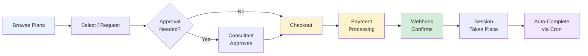

### What Happens at Each Stage

| Stage                    | What Happens                                                                                                                                                                                              | Database Changes                                                                                                               | Key Source File                                      |
| ------------------------ | --------------------------------------------------------------------------------------------------------------------------------------------------------------------------------------------------------- | ------------------------------------------------------------------------------------------------------------------------------ | ---------------------------------------------------- |
| **Browse**               | Consultee views consultant profiles and available plans. No database writes occur.                                                                                                                        | None                                                                                                                           | Frontend routes                                      |
| **Select/Request**       | Consultee clicks "Book" or "Enroll." The checkout handler creates the event-specific record (Consultation, Subscription, etc.) and a tentative Appointment.                                               | Creates: event record (PENDING status), Appointment, tentative SlotOfAppointment(s)                                            | `lib/payments/operations/checkout.ts`                |
| **Approval** (if needed) | Consultant reviews and approves. For consultations: sets APPROVED_PENDING_PAYMENT. For subscriptions: approves and allocates slots. For trials: approves and schedules directly (no payment).             | Updates: event record status                                                                                                   | Requests tab API routes                              |
| **Checkout**             | System validates slot availability, acquires a distributed lock to prevent double-booking, creates a payment intent with the gateway, and returns a client secret for the frontend.                       | Creates: Payment record (PENDING)                                                                                              | `lib/payments/operations/checkout.ts`                |
| **Payment**              | Consultee completes payment in the gateway's UI (Razorpay modal or Stripe form). This happens entirely on the client side.                                                                                | None (gateway-side only)                                                                                                       | Payment gateway client-side SDK                      |
| **Webhook Confirms**     | Gateway sends a webhook. The handler runs in two phases: Phase 1 (transaction) marks payment SUCCEEDED and confirms slots; Phase 2 (post-transaction) creates earnings, invoice, and sends notifications. | Updates: Payment status to SUCCEEDED, SlotOfAppointment.isTentative to false, event record status. Creates: Earnings, Invoice. | `lib/payments/webhooks/handlers.ts`                  |
| **Session**              | Consultant and consultee meet for the scheduled session(s).                                                                                                                                               | None (managed by video/meeting integration)                                                                                    | External integrations                                |
| **Auto-Complete**        | Cron job runs hourly. Marks sessions as COMPLETED one hour after their end time. For trials, also creates an ActivityLog entry and sets completedAt.                                                      | Updates: event record status to COMPLETED                                                                                      | `scripts/appointments/auto-complete-appointments.ts` |

---

## 3. Entity-Relationship Model

Understanding how the database records relate to each other is essential before reading the checkout code. This diagram shows the core models and their relationships.

```mermaid
erDiagram
    ConsultationPlan ||--o{ Consultation : "has many"
    SubscriptionPlan ||--o{ Subscription : "has many"
    SubscriptionPlan ||--o{ TrialSession : "has many"
    WebinarPlan ||--|| Webinar : "has one"
    ClassPlan ||--|| Class : "has one"

    Consultation ||--o| Appointment : "has one"
    Subscription ||--o{ Appointment : "has many (1 placeholder + M sessions)"
    Webinar ||--o| Appointment : "has one (shared)"
    Class ||--o{ Appointment : "has many (1 per session)"
    TrialSession ||--o| Appointment : "has one"

    Appointment ||--o{ SlotOfAppointment : "has many"
    SlotOfAppointment }o--o{ User : "many-to-many"

    Payment }o--o| Appointment : "links to"
    Payment }o--|| User : "belongs to"

    Consultation }o--|| ConsulteeProfile : "requested by"
    Subscription }o--|| ConsulteeProfile : "requested by"
    TrialSession }o--|| ConsulteeProfile : "requested by"
    TrialSession }o--o| Subscription : "converts to"


    Appointment ||--o{ Earnings : "generates"
    Payment ||--o| Invoice : "generates"
```

### Key Relationships to Understand

**Consultation and Subscription** use a 1:1 model. Each has its own dedicated Appointment(s) with the consultee as the sole participant. The reason for this is straightforward: these are private sessions.

**Webinar** uses a shared-appointment model. There is ONE Appointment record for the entire webinar. Each participant gets their own SlotOfAppointment within that shared appointment. This matters because when the webhook confirms a payment, it must only confirm THAT user's slot, not everyone else's.

**Class** extends the webinar pattern across multiple sessions. Each session is a separate Appointment, but all sessions belong to the same Class. When a user enrolls, they get a SlotOfAppointment in EVERY session's Appointment. When the webhook confirms, it must find and confirm ALL of that user's slots across ALL sessions.

**Subscription placeholder**: When a consultee checks out a subscription, the system creates a placeholder Appointment with NO slots. The reason is that the consultant has not allocated session times yet. The consultant does this later via the Requests tab. This placeholder exists so the webhook handler can use the "new flow" (confirm existing appointment) rather than falling back to the legacy flow.

**Trial-to-Subscription conversion**: A TrialSession has an optional `convertedToSubscriptionId` field. When a consultee who previously completed a trial purchases a subscription from the same consultant, the system automatically links them by setting the trial's status to CONVERTED.

---

## 4. Which Checkout Handler Runs?

When a consultee initiates a checkout, the system must determine which handler to invoke based on the `appointmentType` field in the checkout input. This decision tree shows the routing logic.

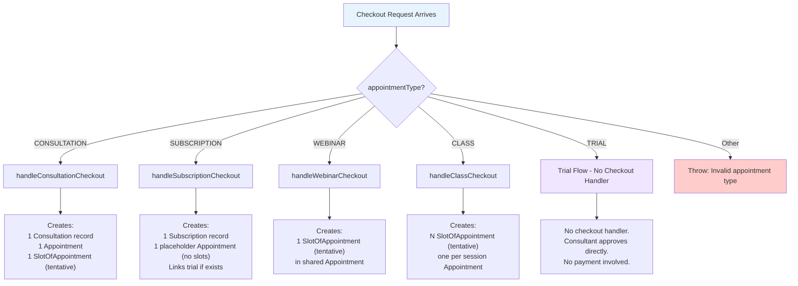

**Source**: The routing switch is in `processCheckout()` at `lib/payments/operations/checkout.ts` around line 920. Each handler is exported as a separate function immediately below.

A common mistake is thinking that trials go through the same checkout pipeline. They do not. Trials are free, so the consultant approves them directly through the Requests tab, which creates the Appointment and slots without any payment processing.

---

## 5. Per-Event-Type Flows

Each event type has unique checkout logic, database record creation, webhook confirmation behavior, and auto-completion criteria. This section provides a detailed mini-guide for each.

### 5a. Consultation

A consultation is a one-time, 1:1 session between a consultee and consultant. It is the simplest event type and the best one to understand first.

#### Two Entry Paths

Consultations support two entry paths:

1. **Direct checkout** -- The consultee selects a slot on the consultant's profile and proceeds directly to payment. The consultation record is created with status PENDING, and the slot is marked as tentative.
2. **Approval flow** -- The consultee submits a request. The consultant reviews it, approves it (setting status to APPROVED_PENDING_PAYMENT), and sends a payment link. The consultee then pays.

The reason two paths exist is flexibility. Some consultants want to screen clients before accepting bookings; others want frictionless direct booking.

#### Sequence Diagram

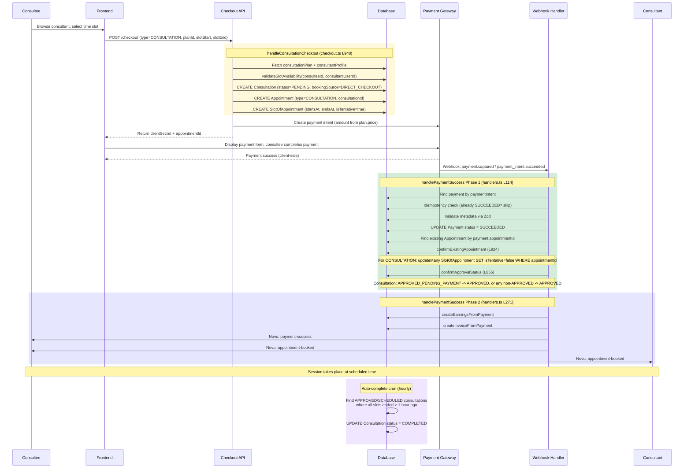

#### Database Records Created at Checkout

| Record              | Key Fields                                                                                                            | Notes                                                          |
| ------------------- | --------------------------------------------------------------------------------------------------------------------- | -------------------------------------------------------------- |
| `Consultation`      | `status=PENDING` (or `APPROVED` for mock), `bookingSource=DIRECT_CHECKOUT`, `requestedById=consulteeProfileId` | The source record for the event                                |
| `Appointment`       | `appointmentType=CONSULTATION`, `consultationId`                                                                      | Container for time slots                                       |
| `SlotOfAppointment` | `startsAt`, `endsAt`, `isTentative=true` (or `false` for mock)                                                        | The actual time reservation. Tentative until payment confirmed |

#### Status Transitions

```
PENDING --> APPROVED_PENDING_PAYMENT  (consultant approves, sends payment link)
PENDING --> APPROVED                  (direct checkout + webhook confirms)
APPROVED_PENDING_PAYMENT --> APPROVED (webhook confirms payment)
any non-APPROVED --> APPROVED         (webhook catch-all for consultation)
APPROVED --> COMPLETED                (auto-complete cron, 1hr after session ends)
```

The reason `confirmApprovalStatus` has a catch-all for consultations (any non-APPROVED to APPROVED) is to handle edge cases where the status might be in an unexpected state when the webhook arrives. This is intentionally more permissive for consultations than for subscriptions.

#### Source References

- `handleConsultationCheckout()`: `lib/payments/operations/checkout.ts` line 940
- `confirmExistingAppointment()`: `lib/payments/webhooks/handlers.ts` line 924
- `confirmApprovalStatus()`: `lib/payments/webhooks/handlers.ts` line 855
- `completeConsultations()`: `scripts/appointments/auto-complete-appointments.ts` line 193

---

### 5b. Subscription

A subscription is a recurring 1:1 arrangement with multiple sessions over a scheduling period. The critical difference from a consultation is that **the consultant allocates session slots after purchase**, not during checkout. This is the most complex 1:1 flow.

#### Why the Consultant Allocates Later

The reason the system does not let the consultee pick all session slots at checkout is practical: a subscription might span months with 12+ sessions. Having the consultee pick every slot upfront would be a terrible user experience. Instead, the consultee picks a scheduling period (e.g., "March to May"), pays, and the consultant then allocates individual session times using the Requests tab -- either manually or via the auto-allocation algorithm.

#### Sequence Diagram

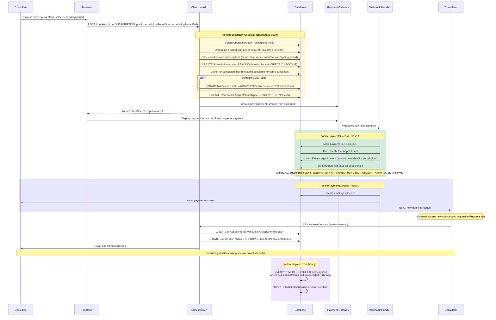

#### Database Records Created at Checkout

| Record                              | Key Fields                                                                                                     | Notes                                                                                          |
| ----------------------------------- | -------------------------------------------------------------------------------------------------------------- | ---------------------------------------------------------------------------------------------- |
| `Subscription`                      | `status=PENDING`, `bookingSource=DIRECT_CHECKOUT`, `schedulingPeriodStartsAt`, `schedulingPeriodEndsAt` | Always PENDING regardless of skipPayment flag. Stays PENDING until consultant allocates.       |
| `Appointment` (placeholder)         | `appointmentType=SUBSCRIPTION`, `subscriptionId`, NO `slotsOfAppointment`                                      | A placeholder so the webhook can use the NEW flow. Consultant creates real appointments later. |
| `TrialSession` (updated, if exists) | `status=CONVERTED`, `convertedToSubscriptionId=subscription.id`                                                | Only if a completed trial exists for the same consultee+consultant pair.                       |

#### Subscription-Specific Status Behavior

This is a critical subtlety. When the webhook calls `confirmApprovalStatus` for a subscription:

- `APPROVED_PENDING_PAYMENT` --> `APPROVED` (this is the approval flow path)
- `PENDING` --> **stays PENDING** (this is the direct checkout path)

The reason `PENDING` does not transition to `APPROVED` in the webhook is that payment alone does not mean the subscription is ready. The consultant must still allocate session slots. The `SlotAllocationService.allocate()` method is what ultimately sets the status to `APPROVED`.

A common mistake is assuming that after payment, the subscription is "active." It is not. It is paid but awaiting slot allocation. The consultee's dashboard will show "Awaiting scheduling" until the consultant allocates.

#### Trial Conversion Logic

At checkout, the system looks for a completed trial from the same consultee for the same consultant:

```
WHERE consulteeProfileId = current consultee
  AND consultantProfileId = plan's consultant
  AND status = COMPLETED
  AND convertedToSubscriptionId IS NULL
```

If found, it marks that trial as `CONVERTED` and links it to the new subscription. This enables analytics tracking of the trial-to-paid conversion funnel.

#### Source References

- `handleSubscriptionCheckout()`: `lib/payments/operations/checkout.ts` line 999
- Duplicate subscription check: `lib/payments/operations/checkout.ts` line 1032
- Trial conversion: `lib/payments/operations/checkout.ts` line 1073
- Placeholder appointment creation: `lib/payments/operations/checkout.ts` line 1109
- `confirmApprovalStatus()` subscription branch: `lib/payments/webhooks/handlers.ts` line 886
- Slot allocation: `utils/slotAllocation/SlotAllocationService.ts`

---

### 5c. Webinar

A webinar is a one-time, 1:many event. The consultant creates and schedules it; consultees enroll by paying. The key architectural decision is that all participants share a single Appointment record, with each participant getting their own SlotOfAppointment.

#### Why One Shared Appointment?

The reason webinars use a shared appointment is that all participants attend at the same time. Creating separate Appointment records per participant would be wasteful and make queries like "how many people are in this webinar?" unnecessarily complex. Instead, you count the SlotOfAppointment entries within the shared appointment (excluding the consultant's slot).

#### Sequence Diagram

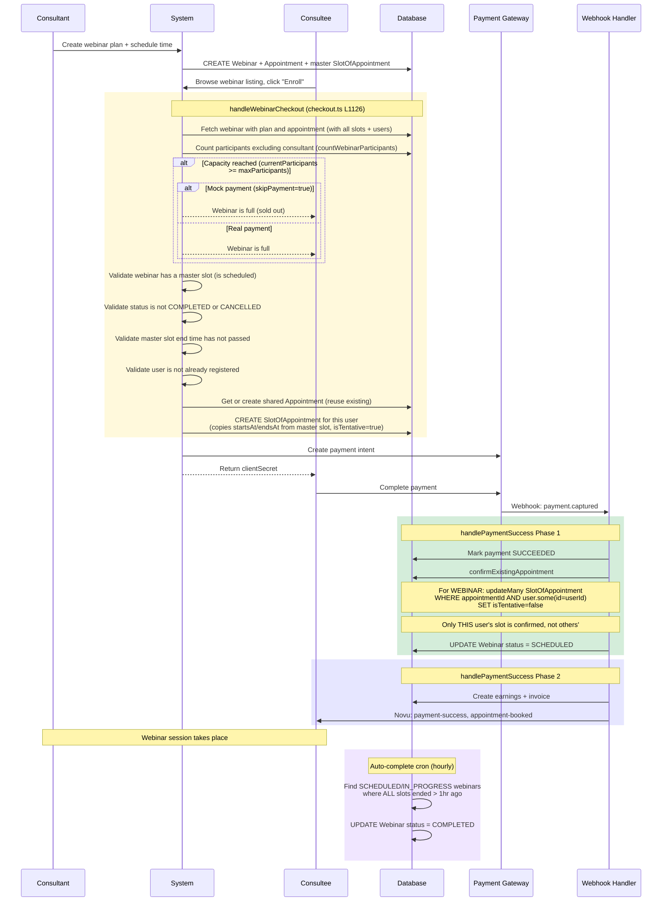

#### Database Records Created at Checkout (Per Participant)

| Record              | Key Fields                                                                                                          | Notes                                                                   |
| ------------------- | ------------------------------------------------------------------------------------------------------------------- | ----------------------------------------------------------------------- |
| `SlotOfAppointment` | `appointmentId` (shared), `startsAt` (from master), `endsAt` (from master), `isTentative=true`, connected to `User` | One per participant. All have the same times (copied from master slot). |

The webinar itself, its Appointment, and the master SlotOfAppointment already exist (created by the consultant during scheduling). The checkout handler only adds a new SlotOfAppointment for the enrolling user.

#### Capacity Check Details

The `countWebinarParticipants()` function counts unique users connected to SlotOfAppointment records within the webinar's shared appointment, excluding the consultant's user ID. This matters because the consultant also has a slot in the appointment (the master slot) but should not count toward the participant cap.

#### Webinar-Specific Confirmation Behavior

When `confirmExistingAppointment` runs for a webinar, it uses this filter:

```sql
WHERE appointmentId = ? AND user.some(id = userId)
```

This ensures only the paying user's slot is confirmed. Without this filter, confirming one participant's payment would accidentally confirm ALL participants' tentative slots, including those who have not paid yet.

#### Source References

- `handleWebinarCheckout()`: `lib/payments/operations/checkout.ts` line 1126
- Capacity check: `countWebinarParticipants()` in `lib/payments/utils/participants.ts`
- Master slot validation: `lib/payments/operations/checkout.ts` line 1182
- Webinar-specific confirmation: `lib/payments/webhooks/handlers.ts` line 967
- `completeWebinars()`: `scripts/appointments/auto-complete-appointments.ts` line 47

---

### 5d. Class

A class is a recurring, 1:many event with multiple sessions. It combines the multi-session nature of subscriptions with the multi-participant nature of webinars. It is the most complex event type.

#### Key Difference from Webinars

A class has M sessions. Each session is a separate Appointment record. When a user enrolls, they get a SlotOfAppointment in EVERY session -- not just one. The checkout handler iterates over all the class's appointments and creates a slot in each.

The reason this matters at the database level is the webhook confirmation. When confirming a class enrollment, the system cannot just filter by `appointmentId` (that would only confirm one session). Instead, it filters by `classId + userId` to find and confirm ALL of that user's slots across ALL sessions.

#### Capacity: Unique Participant Counting

A user enrolled in 8 sessions counts as 1 participant, not 8. The `countUniqueParticipants()` function collects all user IDs across all sessions into a Set and returns the set's size. This matters because if you naively counted slot records, a class with 3 users and 8 sessions would appear to have 24 participants.

#### Sequence Diagram

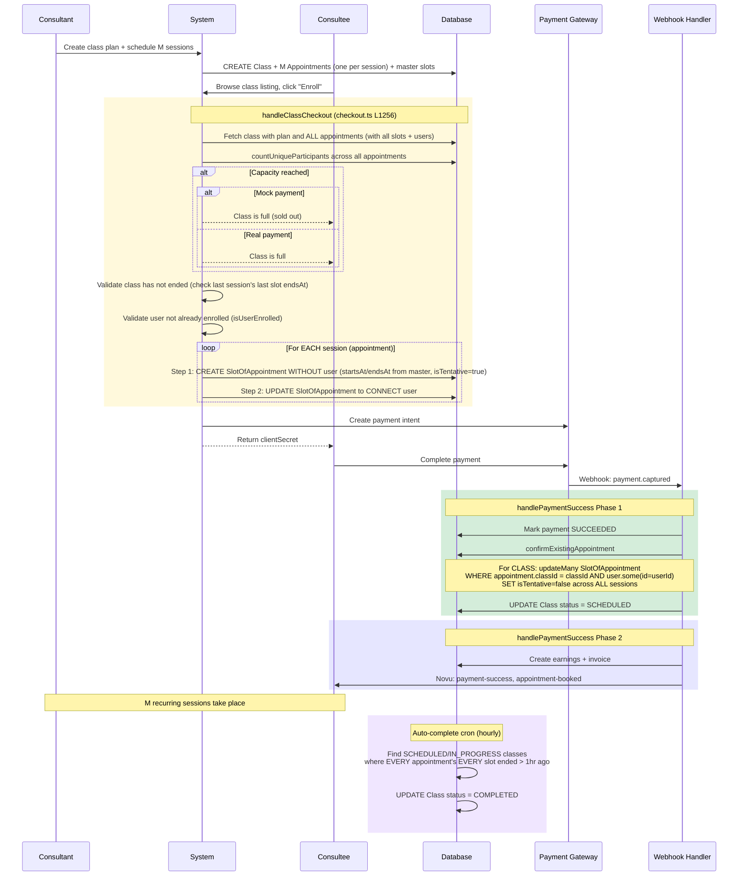

#### Why the Two-Step Slot Creation?

Notice that class slot creation uses a two-step process: first create the SlotOfAppointment without a user, then update it to connect the user:

```typescript
// Step 1: Create without user
const slot = await tx.slotOfAppointment.create({
  data: { appointmentId, startsAt, endsAt, isTentative: !skipPayment },
});

// Step 2: Connect user separately
await tx.slotOfAppointment.update({
  where: { id: slot.id },
  data: { user: { connect: { id: userId } } },
});
```

The reason for this is a foreign key constraint issue in Prisma. When creating a SlotOfAppointment and connecting a User in the same operation, Prisma may attempt to create the many-to-many relation record before the SlotOfAppointment row is committed, causing a FK violation. The two-step approach guarantees the slot exists before the relation is created.

This two-step pattern is NOT needed for webinars because webinar slots use a single `create` with `user: { connect: ... }` and do not hit the same FK issue (likely due to a simpler relation path).

#### Class-Specific Confirmation Behavior

```sql
-- confirmExistingAppointment for CLASS:
UPDATE SlotOfAppointment
SET isTentative = false
WHERE appointment.classId = ? AND user IN (userId)
```

This uses `classId` (not `appointmentId`) to find slots across ALL session appointments. This matters because the Payment record only links to the FIRST appointment (returned by the checkout handler), but the user has slots in all appointments.

#### Source References

- `handleClassCheckout()`: `lib/payments/operations/checkout.ts` line 1256
- Two-step slot creation: `lib/payments/operations/checkout.ts` line 1332-1355
- Unique participant counting: `countUniqueParticipants()` in `lib/payments/utils/participants.ts`
- Class-specific confirmation: `lib/payments/webhooks/handlers.ts` line 947
- `completeClasses()`: `scripts/appointments/auto-complete-appointments.ts` line 115

---

### 5e. Trial

A trial is a free 1:1 session tied to a subscription plan. It is the only event type with NO payment involved. The purpose is to let a consultee "try before they buy" -- experience a session with the consultant before committing to a subscription.

#### How Trials Differ

Trials bypass the entire checkout/payment pipeline. Instead:

1. The consultee requests a trial (creates a PENDING TrialSession record)
2. The consultant approves and schedules a specific time slot (PENDING --> SCHEDULED)
3. The session takes place
4. The cron auto-completes it (SCHEDULED --> COMPLETED, sets `completedAt`, creates ActivityLog)
5. Optionally, the consultee later purchases a subscription, and the trial is marked CONVERTED

#### Sequence Diagram

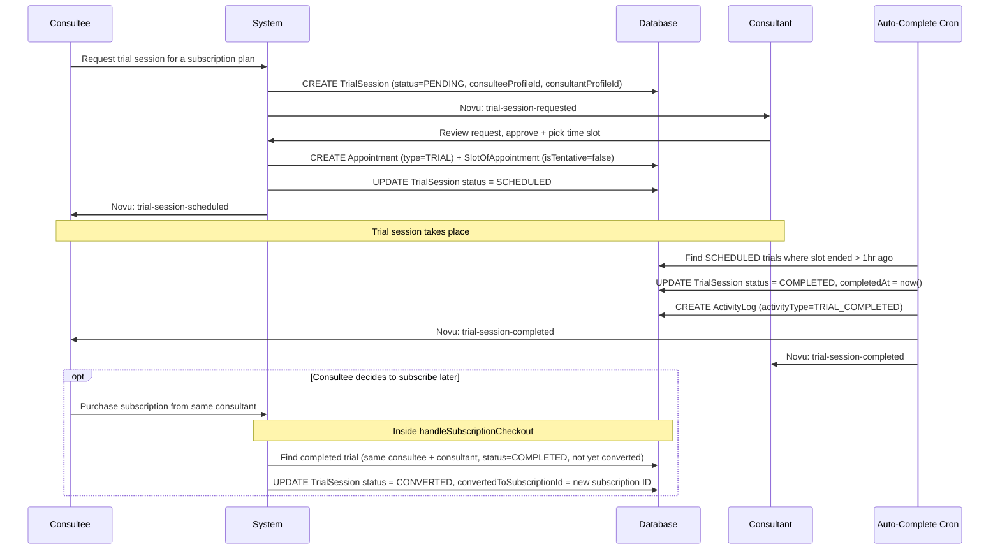

#### Trial Auto-Completion Details

The `completeTrials()` function in the auto-complete cron does more than other event types:

1. Finds SCHEDULED trials where all slots ended > 1 hour ago
2. Updates status to COMPLETED
3. Sets `completedAt` timestamp (used for analytics -- how long ago did the trial complete?)
4. Creates an `ActivityLog` entry with type `TRIAL_COMPLETED` (used for the consultant's activity feed)

No other event type creates an ActivityLog entry during auto-completion. The reason trials are special is that the conversion funnel tracking depends on knowing exactly when the trial completed.

#### Source References

- `completeTrials()`: `scripts/appointments/auto-complete-appointments.ts` line 343
- Trial conversion in subscription checkout: `lib/payments/operations/checkout.ts` line 1073
- ActivityLog creation: `scripts/appointments/auto-complete-appointments.ts` line 409

---

## 6. The Two-Phase Commit Pattern

This is arguably the most important architectural pattern in the booking system. If you do not understand it, you will be confused by why slots start as tentative, why the webhook handler has two phases, and why various edge cases are handled the way they are.

### The Problem

When a consultee clicks "Pay," two things must happen:

1. **Reserve the time slot** in the database so no one else books it
2. **Charge the consultee** via the payment gateway

These two operations cannot happen atomically because they involve different systems. This creates several dangerous scenarios:

- If you charge first and then reserve: What if the slot was taken between payment and reservation? The user paid but cannot be booked.
- If you reserve first and then charge: What if the payment fails? The slot is blocked and no one can use it.
- If you do neither first: Race conditions everywhere.

### The Solution: Tentative-First Booking

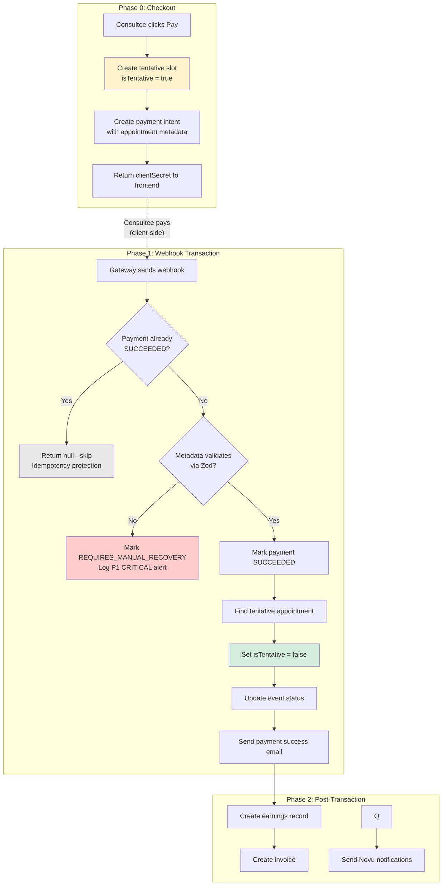

### Why Tentative-First?

The system creates the slot BEFORE payment with `isTentative = true`. This means:

1. **The slot is visible to validation queries** -- Other users attempting to book the same time will see it is taken (tentative slots are included in availability checks). This prevents double-booking.
2. **The slot can be cleaned up** -- If payment never completes, a cron job runs every 2 hours to delete tentative slots older than 24 hours (`TENTATIVE_EXPIRATION_HOURS = 24`, reduced from 7 days by #833). Users can also release their own hold immediately via `DELETE /api/checkout/pending/[paymentId]` (#849). The slot is not permanently blocked.
3. **The payment metadata includes the appointmentId** -- When the webhook arrives, it knows exactly which appointment to confirm. No guessing, no race conditions.

### Why Two Phases in the Webhook Handler?

The webhook handler (`handlePaymentSuccess`) deliberately splits work into two phases:

**Phase 1 (Inside `prisma.$transaction`)**: Only critical operations that MUST succeed or fail together:

- Mark payment as SUCCEEDED
- Find the tentative appointment
- Confirm slots (set `isTentative = false`)
- Update event status (e.g., APPROVED_PENDING_PAYMENT to APPROVED)
- Send payment success email

**Phase 2 (Outside transaction)**: Non-critical operations that should not block or roll back the payment:

- Create earnings record
- Create invoice
- Send Novu push/in-app notifications

The reason for this split is transaction timeout. Prisma transactions have a default timeout of 5 seconds. If earnings creation involves complex queries or the Novu API is slow, including them in the transaction could cause it to time out, which would roll back the payment confirmation -- a catastrophic outcome (the user was charged but the system thinks it failed).

Phase 2 failures are logged but do NOT roll back Phase 1. Background jobs like `sync-payment-earnings` serve as safety nets to catch and fix any Phase 2 failures.

### What Happens If the Webhook Never Arrives?

This is a real-world failure mode. The payment gateway charged the user but the webhook did not reach the system (network issues, server downtime, etc.).

1. The payment record stays `PENDING` in the database
2. The slot stays `isTentative = true`
3. After 24 hours, the `cleanup-tentative-slots` cron job deletes the tentative slot
4. The payment gateway's dashboard shows the charge succeeded

Resolution: The admin must manually reconcile. The system provides a `sync-payment-earnings` background job and admin dashboard for this purpose. In the future, a webhook retry mechanism from the gateway should handle most cases.

### What Happens If the Webhook Arrives Twice?

This is common. Payment gateways often retry webhooks if they do not receive a 200 response quickly enough.

The idempotency check at the top of `handlePaymentSuccess` prevents duplicate processing:

```typescript
if (payment.paymentStatus === PaymentStatus.SUCCEEDED) {
  console.log(`Payment ${paymentIntentId} has already been processed.`);
  return null; // Signal: skip Phase 2 entirely
}
```

The second webhook sees the payment is already `SUCCEEDED` and returns `null`, which causes Phase 2 to be skipped entirely. No duplicate earnings, no duplicate notifications, no errors.

---

## 7. Approval Flow vs Direct Checkout

There are two distinct paths a booking can take through the system. Understanding the difference is critical for debugging status-related issues.

```mermaid
flowchart TD
    subgraph "Direct Checkout (Consultee-Initiated)"
        DC1[Consultee selects slot] --> DC2[Checkout handler creates<br/>tentative Appointment + event record]
        DC2 --> DC3[Payment intent created]
        DC3 --> DC4[Consultee pays]
        DC4 --> DC5[Webhook confirms]
        DC5 --> DC6["Status: PENDING -> APPROVED<br/>(consultation)<br/>Status: stays PENDING<br/>(subscription)"]
    end

    subgraph "Approval Flow (Consultant-Initiated)"
        AF1[Consultee submits request] --> AF2[Event record created: PENDING]
        AF2 --> AF3[Consultant reviews in Requests tab]
        AF3 --> AF4[Consultant approves]
        AF4 --> AF5["Status: APPROVED_PENDING_PAYMENT"]
        AF5 --> AF6[Payment link sent to consultee]
        AF6 --> AF7[Consultee pays via link]
        AF7 --> AF8[Webhook confirms]
        AF8 --> AF9["Status: APPROVED_PENDING_PAYMENT -> APPROVED"]
    end

    style DC6 fill:#d4edda
    style AF9 fill:#d4edda
```

### Comparison Table

| Aspect                               | Direct Checkout                                                    | Approval Flow                                  |
| ------------------------------------ | ------------------------------------------------------------------ | ---------------------------------------------- |
| **Who initiates?**                   | Consultee                                                          | Consultee submits request, consultant approves |
| **When is the Appointment created?** | During checkout (tentative)                                        | After consultant approves                      |
| **Initial status**                   | PENDING                                                            | PENDING, then APPROVED_PENDING_PAYMENT         |
| **Payment trigger**                  | Immediate (checkout page)                                          | Payment link sent by consultant                |
| **Webhook status transition**        | PENDING to APPROVED (consultation) or stays PENDING (subscription) | APPROVED_PENDING_PAYMENT to APPROVED           |
| **`bookingSource` field**            | `DIRECT_CHECKOUT`                                                  | Not set (or set by approval route)             |
| **Slot created by**                  | Checkout handler                                                   | Consultant during approval                     |

### When Does Each Path Apply?

- **Consultations**: Support both paths. Some consultants enable direct checkout; others require approval.
- **Subscriptions**: Support both paths. Direct checkout is more common; the subscription stays PENDING in either case until slots are allocated.
- **Webinars and Classes**: Always direct checkout. The consultant creates the event; consultees enroll directly.
- **Trials**: Neither. Trials do not involve payment, so there is no checkout. The consultant approves directly.

### The `bookingSource` Field

The `bookingSource` field on Consultation and Subscription records is set to `"DIRECT_CHECKOUT"` when created through the checkout pipeline. This is used for analytics to track which bookings came from direct checkout vs the approval flow.

---

## 8. Status Transitions

### 8a. AppointmentStatus (Consultations and Subscriptions)

Used by `Consultation.status` and `Subscription.status`. This is the most complex status enum because it covers both approval and direct checkout paths.

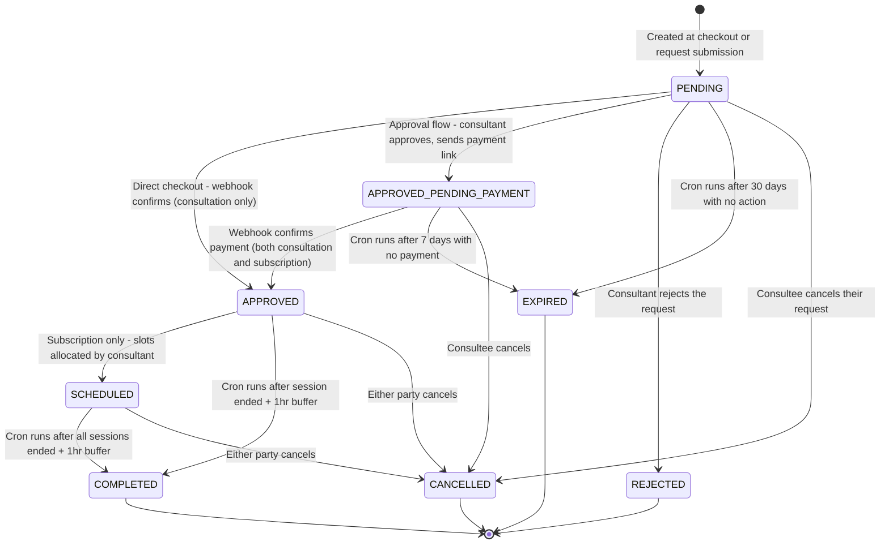

**Enum values** (from `prisma/schema.prisma`): `PENDING`, `APPROVED`, `APPROVED_PENDING_PAYMENT`, `SCHEDULED`, `COMPLETED`, `REJECTED`, `CANCELLED`, `EXPIRED`.

**Important nuance for subscriptions**: After direct checkout with payment, a subscription's status stays at `PENDING` (NOT `APPROVED`). The webhook's `confirmApprovalStatus` only transitions `APPROVED_PENDING_PAYMENT` to `APPROVED` for subscriptions. The transition from `PENDING` to `APPROVED` happens later, when the consultant allocates slots via `SlotAllocationService.allocate()`.

### 8b. TrialSessionStatus

Used by `TrialSession.status`.

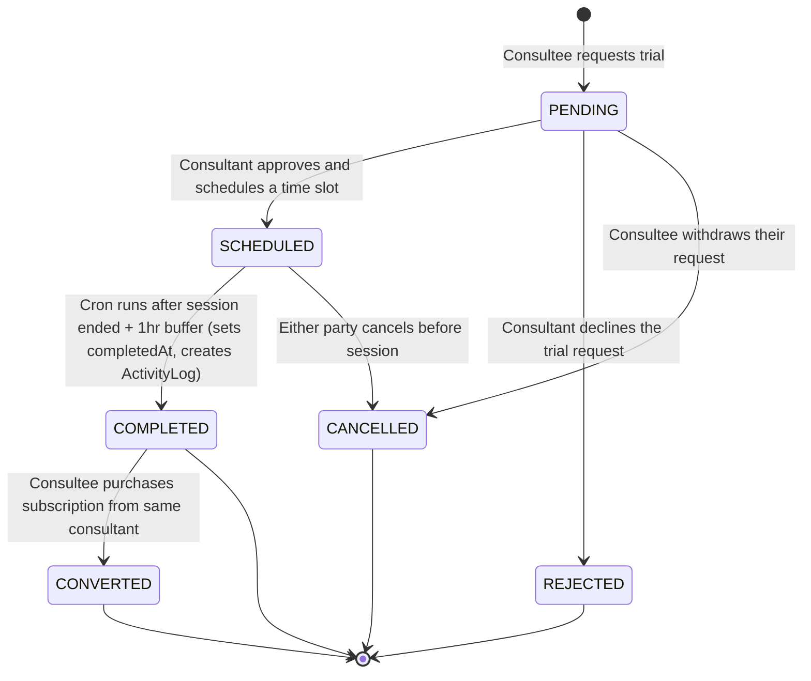

**Enum values**: `PENDING`, `SCHEDULED`, `COMPLETED`, `CONVERTED`, `CANCELLED`, `REJECTED`.

**Important**: `COMPLETED` to `CONVERTED` is not triggered by the cron job. It happens inside `handleSubscriptionCheckout()` when the system finds a completed trial from the same consultee for the same consultant and links it to the new subscription.

### 8c. WebinarStatus / ClassStatus

Used by `Webinar.status` and `Class.status`. Both enums share the same values and transition logic.

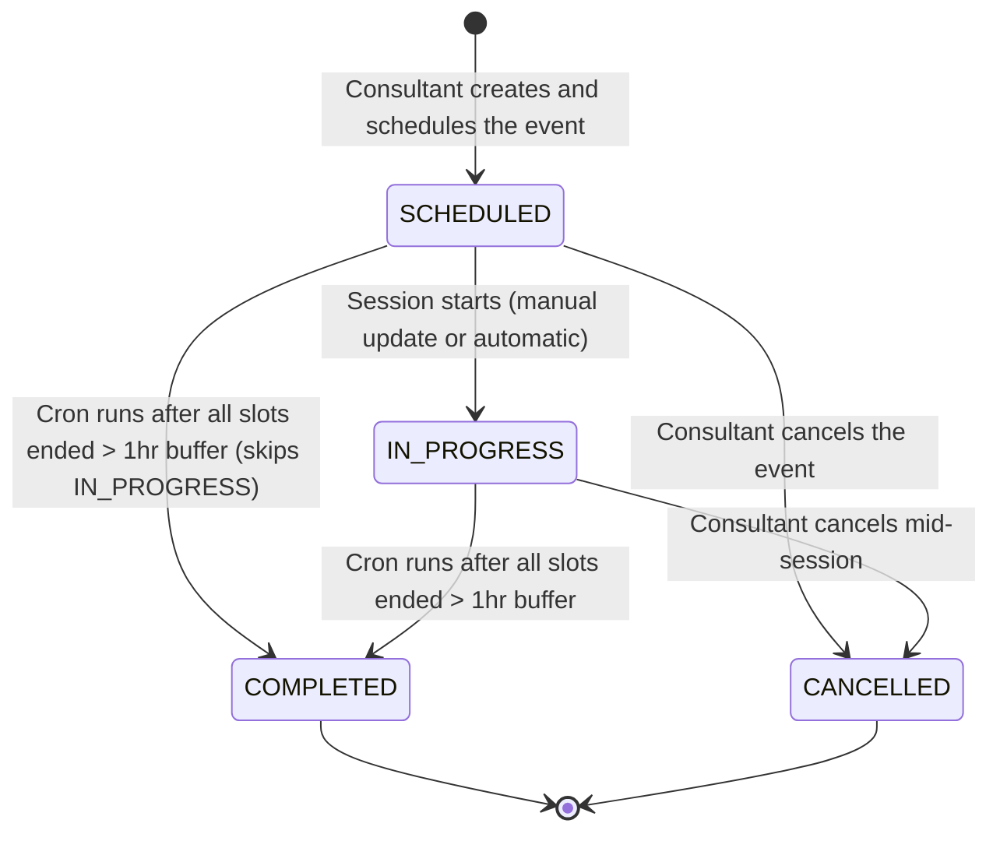

**Enum values**: `SCHEDULED`, `IN_PROGRESS`, `COMPLETED`, `CANCELLED`.

**Note**: The webhook handler for webinars and classes sets status to `SCHEDULED` when confirming a participant's enrollment. This is idempotent -- setting SCHEDULED on an already-SCHEDULED event is a no-op.

### 8d. PaymentStatus

Used by `Payment.paymentStatus`.

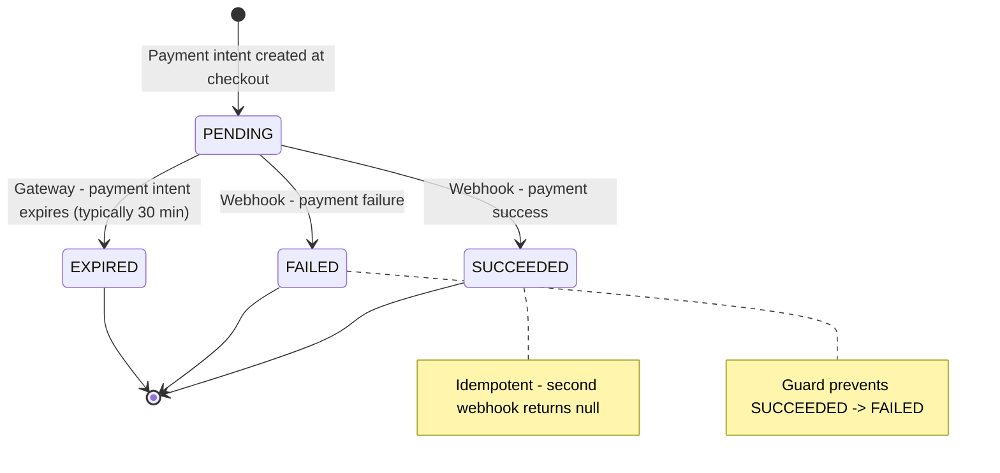

**Important guards**:

- If payment is already `SUCCEEDED`, the success handler returns `null` (idempotency)
- If payment is already `FAILED`, the failure handler returns early (idempotency)
- If payment is already `SUCCEEDED`, the failure handler will NOT override it to FAILED (protects against late failure webhooks)

### 8e. SlotOfAppointment.isTentative

This is a boolean field, not an enum, but it follows a clear lifecycle:

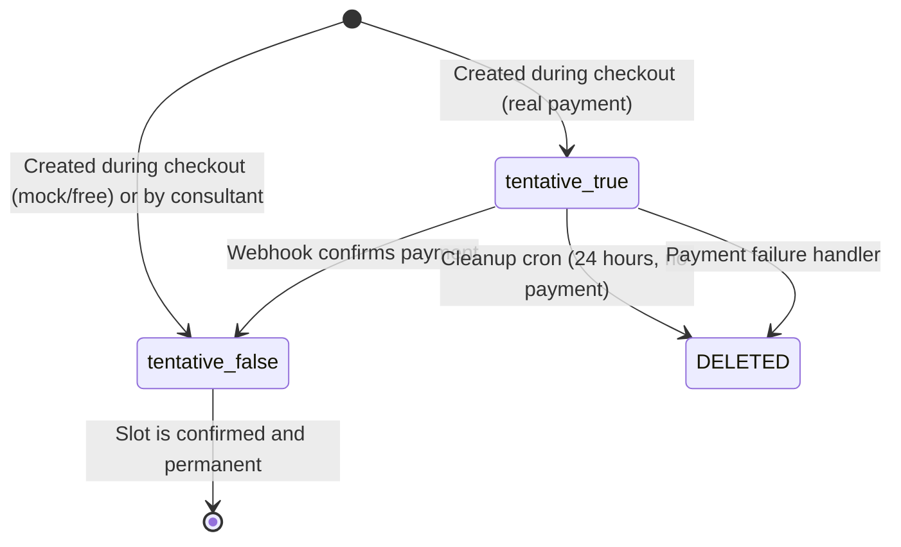

---

## 9. Edge Cases and Failure Modes

This section covers what happens when things go wrong. Understanding these scenarios is essential for debugging production issues.

### 9a. Payment Fails After Tentative Slot Created

**Scenario**: The checkout handler created a tentative SlotOfAppointment, but the payment fails (card declined, insufficient funds, etc.).

**What happens**:

1. The payment gateway sends a `payment.failed` webhook
2. `handlePaymentFailure()` finds the payment record
3. Idempotency check: if already FAILED, skip. If already SUCCEEDED, skip (late failure guard).
4. Marks payment as `FAILED`
5. Calls `cleanupFailedPaymentAppointment()` which deletes the tentative slots
6. Sends failure notification to consultee

**Safety net**: Even if the failure webhook is missed, the `cleanup-tentative-slots` cron runs every 2 hours and removes tentative slots with no successful payment after 24 hours (`TENTATIVE_EXPIRATION_HOURS = 24`).

**Source**: `handlePaymentFailure()` at `lib/payments/webhooks/handlers.ts` line 486.

### 9b. Webinar Fills Up During Checkout

**Scenario**: Two users start checkout for the last webinar spot simultaneously.

**What happens**:

1. User A's checkout handler runs, checks capacity (say 9/10), creates tentative slot (now 10/10)
2. User B's checkout handler runs, checks capacity (10/10), gets "Webinar is full" error
3. User A's payment may or may not succeed -- but the slot was reserved tentatively

The reason this works is that tentative slots ARE counted in capacity checks. The `countWebinarParticipants()` function counts ALL SlotOfAppointment records in the shared appointment, including tentative ones. Additionally, a distributed lock is acquired during checkout to serialize concurrent requests.

If User A's payment fails, the abandoned-checkout cleanup disconnects them from the event's slots and the seat is free again.

### 9c. Duplicate Checkout Attempt

**Scenario**: A user clicks "Pay" twice rapidly, or refreshes the checkout page.

**What happens by event type**:

- **Consultation**: The `validateSlotAvailability()` check will detect the tentative slot from the first attempt and block the second.
- **Subscription**: The duplicate subscription check queries for overlapping date ranges with the same plan and consultee. Throws "You already have a pending or active subscription."
- **Webinar**: The `isAlreadyRegistered` check finds the user's existing slot. Throws "You are already registered for this webinar."
- **Class**: The `isUserEnrolled()` check finds the user across any session's slots. Throws "You are already enrolled in this class."

### 9d. Webhook Arrives Twice (Idempotency)

**Scenario**: The payment gateway sends the same webhook twice (common with retries).

**What happens**:

1. First webhook: processes normally through Phase 1 and Phase 2
2. Second webhook: `handlePaymentSuccess` finds `payment.paymentStatus === SUCCEEDED`
3. Returns `null` immediately, skipping all processing
4. Phase 2 is also skipped because `txResult` is null

This is safe because:

- No duplicate earnings records
- No duplicate notifications
- No duplicate status transitions
- The function returns cleanly without errors

### 9e. Metadata Validation Fails in Webhook

**Scenario**: The payment webhook arrives, but the metadata is malformed or missing required fields (e.g., `appointmentType` is missing).

**What happens**:

1. `validateWebhookMetadata()` (Zod schema) throws a validation error
2. The payment is marked as `SUCCEEDED` (the charge went through -- the money was taken)
3. The description is set to `REQUIRES_MANUAL_RECOVERY: Metadata validation failed: ...`
4. A `P1 CRITICAL_PAYMENT_WITHOUT_APPOINTMENT` structured log is emitted
5. A human-readable banner is logged with payment ID, user email, amount, and action required
6. The function returns `null`, skipping all appointment confirmation

This is the worst-case scenario in the payment system. The user has been charged, but no appointment was created or confirmed. An admin must manually create the appointment or issue a full refund.

The reason the system marks the payment as SUCCEEDED (not FAILED) is truthfulness: the payment DID succeed at the gateway level. Marking it as FAILED would be a lie and could cause the gateway's reconciliation to disagree with the database.

### 9f. Class Session Added After Enrollment

**Scenario**: A consultant adds a new session (Appointment) to a class after users have already enrolled.

**What happens**: Existing users will NOT automatically get a SlotOfAppointment for the new session. Their enrollment only covers sessions that existed at checkout time. The consultant must handle this manually or the system needs a separate "sync enrollment" operation.

### 9g. Late Failure Webhook After Success

**Scenario**: A success webhook arrives and is processed, then a late failure webhook arrives for the same payment.

**What happens**: The failure handler checks `if (payment.paymentStatus === PaymentStatus.SUCCEEDED)` and skips processing entirely. The log says: "Payment already SUCCEEDED. Ignoring late failure webhook." This guard prevents a catastrophic scenario where a confirmed booking is erroneously rolled back.

**Source**: `handlePaymentFailure()` at `lib/payments/webhooks/handlers.ts`, the M7 FIX guard around line 542.

---

## 10. Notification Triggers

Notifications are sent via Novu workflows. All workflow IDs are defined in `lib/novu/workflows.ts`. Trigger functions are in `lib/novu/service.ts`.

### Payment and Booking Notifications

| Lifecycle Event         | Novu Workflow ID          | Recipients             | Trigger Point                                             | Source              |
| ----------------------- | ------------------------- | ---------------------- | --------------------------------------------------------- | ------------------- |
| Payment succeeds        | `payment-success`         | Consultee              | Webhook handler Phase 2 (`handlePaymentSuccess`)          | `handlers.ts` L452  |
| Payment fails           | `payment-failed`          | Consultee              | `handlePaymentFailure()`                                  | `handlers.ts` L573  |
| Appointment booked      | `appointment-booked`      | Consultee + Consultant | Webhook handler Phase 2, post-payment                     | `handlers.ts` L467  |
| Appointment cancelled   | `appointment-cancelled`   | Consultee + Consultant | Cancellation API route                                    | Cancellation routes |
| Appointment rescheduled | `appointment-rescheduled` | Consultee + Consultant | Reschedule API route                                      | Reschedule routes   |
| Appointment completed   | `appointment-completed`   | Consultee + Consultant | Auto-complete cron (planned)                              | Cron scripts        |
| Appointment reminder    | `appointment-reminder`    | Consultee + Consultant | Scheduled reminder cron                                   | Reminder scripts    |
| New booking request     | `new-booking-request`     | Consultant             | Request submission API / Webhook Phase 2 for subscription | Request API routes  |

### Trial Notifications

| Lifecycle Event | Novu Workflow ID          | Recipients             | Trigger Point             | Source                          |
| --------------- | ------------------------- | ---------------------- | ------------------------- | ------------------------------- |
| Trial requested | `trial-session-requested` | Consultant             | Trial request API         | Trial routes                    |
| Trial scheduled | `trial-session-scheduled` | Consultee              | Consultant approves trial | Approval routes                 |
| Trial completed | `trial-session-completed` | Consultee + Consultant | Auto-complete cron        | `auto-complete-appointments.ts` |
| Trial cancelled | `trial-session-cancelled` | Consultee + Consultant | Cancellation API          | Cancellation routes             |

### Subscription Notifications

| Lifecycle Event        | Novu Workflow ID         | Recipients             | Trigger Point             | Source                  |
| ---------------------- | ------------------------ | ---------------------- | ------------------------- | ----------------------- |
| Subscription started   | `subscription-started`   | Consultee              | Slot allocation completed | `SlotAllocationService` |
| Subscription cancelled | `subscription-cancelled` | Consultee + Consultant | Cancellation API          | Cancellation routes     |
| Subscription renewed   | `subscription-renewed`   | Consultee              | Renewal processing        | Renewal scripts         |

### Financial Notifications

| Lifecycle Event  | Novu Workflow ID   | Recipients             | Trigger Point          | Source         |
| ---------------- | ------------------ | ---------------------- | ---------------------- | -------------- |
| Refund processed | `refund-processed` | Consultee              | Refund API             | Refund routes  |
| Refund requested | `refund-requested` | Admin users            | Refund request API     | Refund routes  |
| Payout processed | `payout-processed` | Consultant             | Payout processing      | Payout scripts |
| Dispute created  | `dispute-created`  | Consultee + Consultant | Dispute creation API   | Dispute routes |
| Dispute resolved | `dispute-resolved` | Consultee + Consultant | Dispute resolution API | Dispute routes |

### Other Notifications

| Lifecycle Event         | Novu Workflow ID          | Recipients             | Trigger Point              | Source           |
| ----------------------- | ------------------------- | ---------------------- | -------------------------- | ---------------- |
| Recording available     | `recording-available`     | Consultee + Consultant | Recording upload           | Recording routes |

**Important**: All Novu notifications in the webhook handler are sent as fire-and-forget (`void notifyPaymentSuccess(...)`) with try-catch wrappers. Notification failures are logged but never roll back the payment transaction. The reason for this design is that a failed push notification should never cause a successful payment to appear as failed.

Cross-reference: [Notifications: Workflows and API](../notifications/02-workflows-and-api.md)

---

## 11. System Automation

Background jobs run on schedules via GitHub Actions and are also exposed as API endpoints for manual triggering. These are the "janitors" of the booking system -- they clean up stale state and advance the lifecycle.

### Scheduled Jobs

| Action                                     | Schedule      | What It Does                                                                                          | Criteria                                                   | Source                                                        |
| ------------------------------------------ | ------------- | ----------------------------------------------------------------------------------------------------- | ---------------------------------------------------------- | ------------------------------------------------------------- |
| **Auto-complete appointments**             | Hourly        | Marks events as COMPLETED when all sessions have ended                                                | All SlotOfAppointment.endsAt < (now - 1 hour)              | `scripts/appointments/auto-complete-appointments.ts`          |
| **Cleanup tentative slots**                | Every 2 hours | Deletes `isTentative=true` slots with no successful payment                                           | Tentative slot created > 24 hours ago, payment not SUCCEEDED (`TENTATIVE_EXPIRATION_HOURS = 24`) | `scripts/appointments/cleanup-tentative-slots.ts`             |
| **Expire stale requests**                  | Daily         | Sets PENDING requests to EXPIRED after 30 days; sets APPROVED_PENDING_PAYMENT to EXPIRED after 7 days | No activity within threshold                               | `scripts/appointments/expire-stale-requests.ts`               |
| **Cleanup stale pending consultations**    | Hourly        | Cancels APPROVED/APPROVED_PENDING_PAYMENT consultations with no payment activity after 7 days         | No payment record or payment stuck in PENDING              | `scripts/appointments/cleanup-stale-pending-consultations.ts` |
| **Sync payment earnings**                  | Periodic      | Safety net: finds payments with SUCCEEDED status but no earnings record, creates missing earnings     | Payment.status=SUCCEEDED AND no Earnings linked            | `scripts/payments/sync-payment-earnings.ts`                   |

### Auto-Complete Details by Event Type

The auto-complete cron (`autoCompleteAppointments()`) runs five separate queries, one for each event type:

| Function                  | Finds                                                                                          | Transition                 | Extra Actions                                               |
| ------------------------- | ---------------------------------------------------------------------------------------------- | -------------------------- | ----------------------------------------------------------- |
| `completeWebinars()`      | SCHEDULED or IN_PROGRESS webinars where every slot's endsAt < bufferTime                       | Status -> COMPLETED        | None                                                        |
| `completeClasses()`       | SCHEDULED or IN_PROGRESS classes where every appointment's every slot's endsAt < bufferTime    | Status -> COMPLETED        | None                                                        |
| `completeConsultations()` | APPROVED or SCHEDULED consultations where every slot's endsAt < bufferTime                     | status -> COMPLETED | None                                                        |
| `completeSubscriptions()` | APPROVED or SCHEDULED subscriptions where every appointment's every slot's endsAt < bufferTime | status -> COMPLETED | None                                                        |
| `completeTrials()`        | SCHEDULED trials where every slot's endsAt < bufferTime                                        | status -> COMPLETED        | Sets `completedAt`, creates `ActivityLog` (TRIAL_COMPLETED) |

**Buffer time**: 1 hour. The reason for the buffer is to give participants time for post-session activities (filling feedback forms, downloading materials) before the system considers the session complete. The `COMPLETION_BUFFER_HOURS` constant is defined at the top of the auto-complete script.

**Why APPROVED or SCHEDULED for consultations/subscriptions?** A consultation might be in APPROVED status (direct checkout) or SCHEDULED status (after slot allocation). Both represent "active" sessions that should be auto-completed. A consultation in PENDING or APPROVED_PENDING_PAYMENT status should NOT be auto-completed because the session was never confirmed.

### Automation Timeline

```mermaid
gantt
    title Life of a Booking - Automation Timeline
    dateFormat X
    axisFormat %s

    section Checkout
    Tentative slot created           :a1, 0, 1
    Payment intent created           :a2, 0, 1

    section Payment Window
    Payment intent active (30 min)   :a3, 0, 30
    Payment intent expires           :milestone, 30, 30

    section Cleanup Windows
    Tentative slot exists (up to 24h) :a4, 0, 1440
    Cleanup cron removes tentative    :milestone, 1440, 1440

    section Stale Request Windows
    APPROVED_PENDING_PAYMENT (7d)     :a5, 0, 10080
    PENDING request (30d)             :a6, 0, 43200

    section Session
    Session takes place               :a7, 1440, 1500
    +1hr buffer                       :a8, 1500, 1560
    Auto-complete cron fires          :milestone, 1560, 1560
```

---

## 12. Timeline: Life of a Booking

This section provides a minute-by-minute and day-by-day view of what happens to a typical consultation booking from checkout to completion.

```
T+0 seconds     Consultee clicks "Pay" on checkout page
                 --> handleConsultationCheckout runs
                 --> Consultation created (PENDING)
                 --> Appointment created (CONSULTATION)
                 --> SlotOfAppointment created (isTentative=true)
                 --> Payment intent created (PENDING)
                 --> clientSecret returned to frontend

T+10 seconds    Consultee enters card details, submits payment
                 --> Payment processed by gateway (client-side)

T+15 seconds    Gateway sends webhook to /api/webhooks/...
                 --> handlePaymentSuccess Phase 1 starts
                 --> Payment marked SUCCEEDED
                 --> Appointment found by payment.appointmentId
                 --> SlotOfAppointment.isTentative set to false
                 --> Consultation status: PENDING -> APPROVED
                 --> Payment success email sent

T+16 seconds    handlePaymentSuccess Phase 2 starts
                 --> Earnings record created
                 --> Invoice created
                 --> Novu: payment-success to consultee
                 --> Novu: appointment-booked to consultee + consultant

T+30 minutes    (If payment had not completed) Payment intent expires at gateway
                 Gateway may send a payment_intent.expired webhook

T+24 hours      (If payment failed or was abandoned)
                 cleanup-tentative-slots cron deletes orphaned tentative slot

T+0 to T+weeks  Session takes place at scheduled time
                 (No database changes during the session itself)

T+session+1hr   auto-complete-appointments cron runs
                 --> Finds consultation with all slots ended > 1hr ago
                 --> Consultation status: APPROVED -> COMPLETED

T+30 days       (If request was never acted on)
                 expire-stale-requests cron sets PENDING -> EXPIRED
```

---

## 13. Cross-References

| Topic                                                           | Document                                                                                                               |
| --------------------------------------------------------------- | ---------------------------------------------------------------------------------------------------------------------- |
| Slot allocation architecture (services, data model, validation) | [01-architecture.md](./01-architecture.md)                                                                             |
| Event type rules and validation logic                           | [02-event-types-and-validation.md](./02-event-types-and-validation.md)                                                 |
| Slot math (30-min intervals, weekly distribution)               | [03-slot-math-and-calculations.md](./03-slot-math-and-calculations.md)                                                 |
| Allocation and validation API endpoints                         | [04-api-reference.md](./04-api-reference.md)                                                                           |
| Troubleshooting and recent fixes                                | [05-troubleshooting-and-changelog.md](./05-troubleshooting-and-changelog.md)                                           |
| Reschedule implementation                                       | [07-rescheduling-flow.md](./07-rescheduling-flow.md)                                                                   |
| Payment system architecture                                     | [../payments/01-architecture.md](../payments/01-architecture.md)                                                       |
| Checkout flow details                                           | [../payments/checkout-flow/01-overview-and-consultation.md](../payments/checkout-flow/01-overview-and-consultation.md) |
| Webhook handling and status flows                               | [../payments/checkout-flow/05-status-flows.md](../payments/checkout-flow/05-status-flows.md)                           |
| Approval payments (pay-later)                                   | [../payments/approval-payments/01-architecture.md](../payments/approval-payments/01-architecture.md)                   |
| Cancellation and rescheduling payments                          | [../payments/cancellations-rescheduling/README.md](../payments/cancellations-rescheduling/README.md)                   |
| Payout processing                                               | [../payments/payouts/01-architecture.md](../payments/payouts/01-architecture.md)                                       |
| Notification system architecture                                | [../notifications/01-architecture.md](../notifications/01-architecture.md)                                             |
| Notification workflows and API                                  | [../notifications/02-workflows-and-api.md](../notifications/02-workflows-and-api.md)                                   |
| Database schema (enums, models)                                 | [../../prisma/schema.prisma](../../prisma/schema.prisma)                                                               |

## Approval-path corrections (2026-08-14, #1169 PR 2)

Three behaviors of the approve flow changed together. First, the payment link is minted **after** the approval transaction commits, never inside it: a gateway round-trip inside the Serializable transaction pinned a pooled connection, could exceed the 30-second budget, and on rollback left a live payment link for an approval that never persisted. If minting fails, the request stays `APPROVED_PENDING_PAYMENT` with no link and the response says so with a 502; approving again re-mints, because while the gateway call itself failed no Payment row exists for the duplicate guard to find. That 502 is reserved for the mint itself. Once a link exists, a failure to write it to `pendingPaymentUrl` or to email it is reported to Sentry and the request still succeeds, because answering with a 502 there would invite a retry that mints a **second** live payment link for the same booking — since #1181 the duplicate guard inside `createApprovalPaymentIntent` does see approval payments (they carry the request-time `appointmentId`, so the guard's walk over appointment payments matches), and its answer to an already-minted PENDING payment is to **reuse** it — returning the same intent instead of minting a parallel order. Second, confirming a paid request's tentative slots excludes `RESCHEDULED` rows, which keep their original `startsAt` — flipping them re-confirmed exactly the time the consultee had asked to move away from. Third, a request that is paid but has no appointment row (its capture webhook has not landed) is **refused** with a 409 rather than papered over: the old fallback fabricated a confirmed slot at now+1h with no availability check, no lock, and no `consultantProfileId`, on the global client, so it even survived the transaction's rollback. The `reconcile-orphaned-confirmations` sweep (#830) settles that state, after which approval succeeds normally.

Approval links also now mint on RAZORPAY across all three request types (#1165), and org sponsorship survives the flow end-to-end (#1166): the request validates an ACTIVE membership of a `canSponsor` organization that is itself transactable (`ACTIVE` or `PENDING_VERIFICATION`, the same standing the checkout path demands), stamps `Appointment.organizationId` at creation, and the approval payment carries the org onto the `Payment` row and gateway metadata. Approval payments now also write the `CARD` funding leg that every `Payment` is required to carry; this was the one gateway path that created a payment with no leg at all, which mattered little while the rows were untagged and matters a great deal now that they carry an organization.
