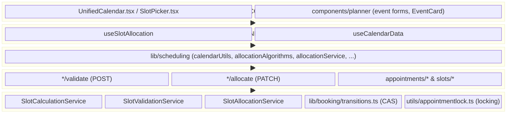
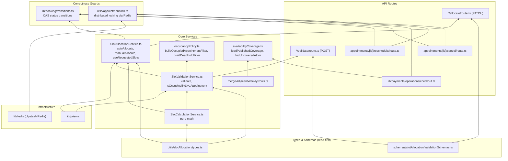
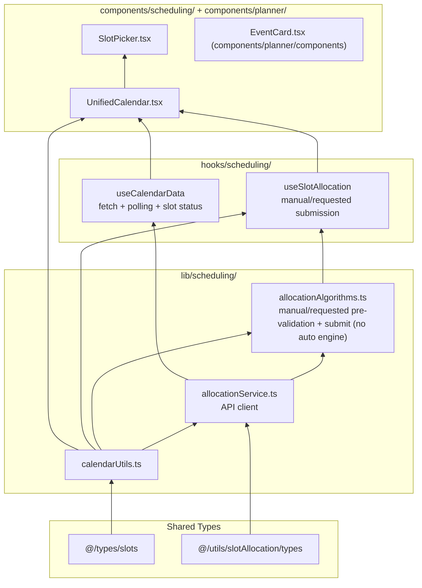
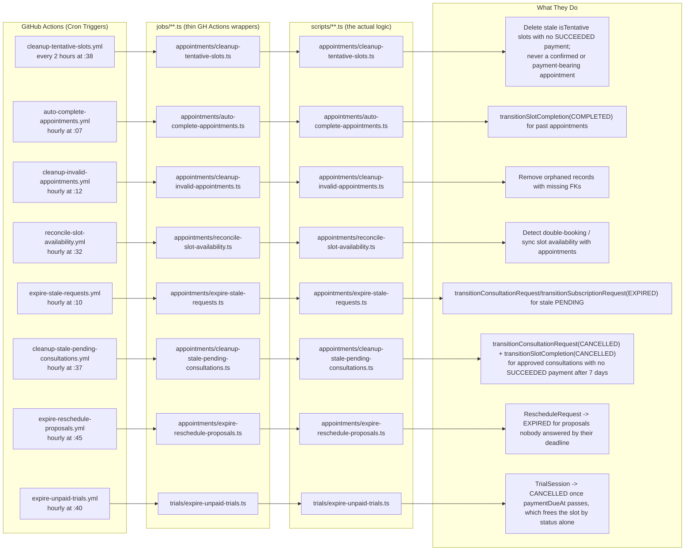
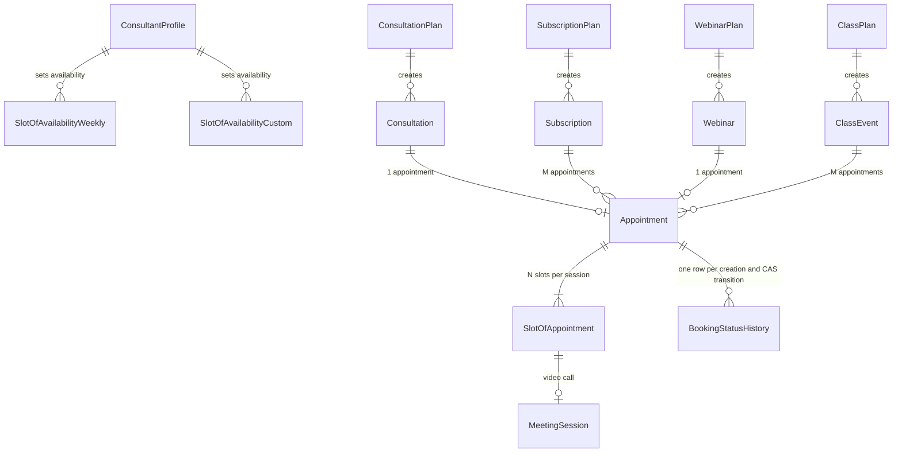

# Dependency Graphs

Maps of how files in the booking system relate to each other, regenerated from the current imports.

---

## 1. System Layer Architecture

Each layer only calls the layer directly below it.



---

## 2. Backend Dependency Graph

Which backend file imports which, read bottom-up (leaf nodes first). `lib/booking/transitions.ts` is imported directly by API routes and by `SlotAllocationService`, not only by the service layer — every status write in the booking subsystem goes through it.



---

## 3. Frontend Dependency Graph



**Reading order**: `calendarUtils` -> `allocationService` -> `allocationAlgorithms` -> `useCalendarData` + `useSlotAllocation` -> `UnifiedCalendar`. Server-side auto-allocation (`SlotAllocationService`) has no frontend counterpart in this chain — the client only pre-validates and submits.

---

## 4. Request Flow: Slot Allocation (The Main Path)

What happens when the consultant clicks "Allocate Slots":

```mermaid
sequenceDiagram
  participant UC as UnifiedCalendar
  participant USA as useSlotAllocation
  participant AA as allocationAlgorithms
  participant AS as allocationService
  participant API as allocate/route.ts
  participant ZOD as validationSchemas
  participant SAS as SlotAllocationService
  participant SVS as SlotValidationService
  participant SCS as SlotCalculationService
  participant TRANS as lib/booking/transitions.ts
  participant DB as Prisma + PostgreSQL
  participant LOCK as appointmentlock + Redis

  UC->>USA: User selects slots (manual/requested)
  USA->>UC: Update UI (selected slots, progress)

  Note over UC: User clicks "Allocate"

  UC->>USA: autoAllocate / manualAllocate / allocateRequestedSlots

  alt Auto Mode (client submits, server picks)
    USA->>AS: allocateSlots(type, id, [], {isAuto: true})
  else Manual or Requested Mode
    USA->>AA: AllocationAlgorithms.manualAllocate / allocateRequestedSlots
    AA->>AA: Pre-validate (required count, no past slots, webinar contiguity)
    AA->>AS: allocateSlots(type, id, slots, options)
  end

  AS->>API: PATCH /api/bookings/{type}/{id}/allocate

  API->>ZOD: Parse request body
  ZOD-->>API: Validated {isAuto, slots?, useRequestedSlots?}

  alt Auto Mode (server-picked)
    API->>SAS: autoAllocate(type, id)
    SAS->>SCS: calculateRequiredSlots(), getSlotsPerCall()
    SAS->>SAS: findAvailableSlots() (preferenceScoring.ts orders, never filters)
  else Manual Mode
    API->>SAS: manualAllocate(type, id, slots)
  else Requested Mode
    API->>SAS: useRequestedSlots(type, id)
  end

  SAS->>LOCK: lockSlotBooking / lockAutoAllocate
  LOCK-->>SAS: Lock acquired

  SAS->>SVS: validate(type, id, slots, consultant, config)
  SVS->>SCS: validateDuration()
  SVS->>DB: validateNoConflicts() - check existing appointments
  SVS-->>SAS: ValidationResult

  SAS->>DB: BEGIN TRANSACTION
  SAS->>DB: Clear stale tentative slots (payment-guarded; never a payment-bearing appointment)
  SAS->>DB: Create/reuse Appointment, create SlotOfAppointment rows
  SAS->>TRANS: transitionConsultationRequest / transitionSubscriptionRequest
  SAS->>DB: COMMIT

  SAS->>LOCK: Release lock
  SAS-->>API: AllocationResult
  API-->>AS: JSON response
  AS-->>USA: AllocationResponse (or AllocationAlgorithms result)
  USA-->>UC: Success -> refresh calendar
```

---

## 5. Maintenance & Cleanup Flow

How the GitHub Actions crons keep the booking subsystem healthy. Every job listed here first calls `abortIfMaintenance()` (`lib/maintenance-cron.ts`), which refuses to run while the platform is in a declared maintenance freeze.



---

## 6. Data Model Relationships (Simplified)



> Note: the diagram labels the Prisma `Class` model as `ClassEvent` because `class` is a reserved keyword in Mermaid.

---

## How to Read This

**Backend algorithm**: `types.ts` -> `SlotCalculationService` -> `SlotValidationService` -> `SlotAllocationService`, with every status write routed through `lib/booking/transitions.ts` and every slot-occupying write holding a lock from `utils/appointmentlock.ts`.

**Frontend**: `calendarUtils` -> `allocationService` -> `allocationAlgorithms` -> `useCalendarData` + `useSlotAllocation` -> `UnifiedCalendar`. Auto-allocation is server-only; the client never scores or picks slots itself.

**Tracing a full request**: `UnifiedCalendar` -> `useSlotAllocation` -> `allocationAlgorithms` (manual and requested modes only; auto mode calls the service directly) -> `allocationService` -> API route -> `SlotAllocationService` -> `SlotValidationService` -> `SlotCalculationService` -> Prisma -> PostgreSQL (see Diagram 4).
