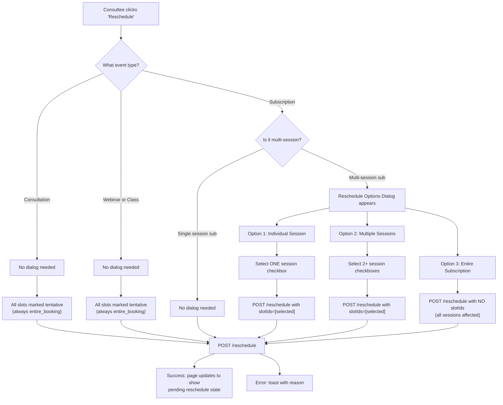
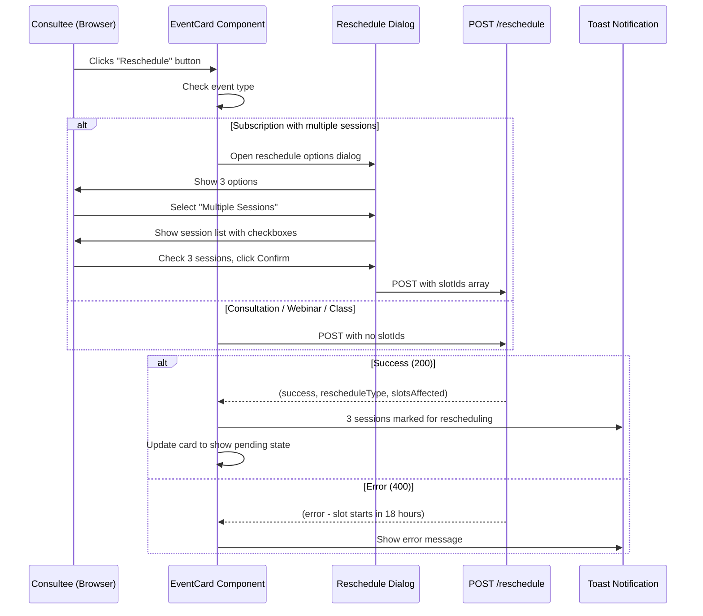
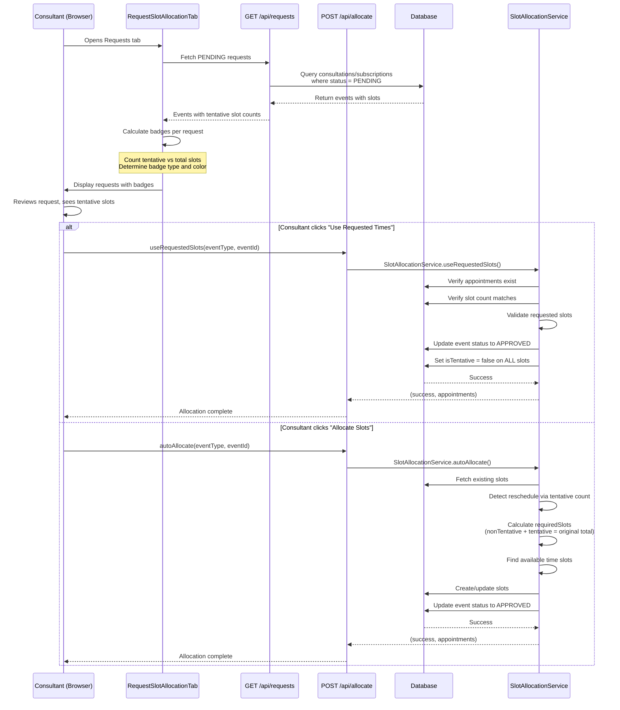
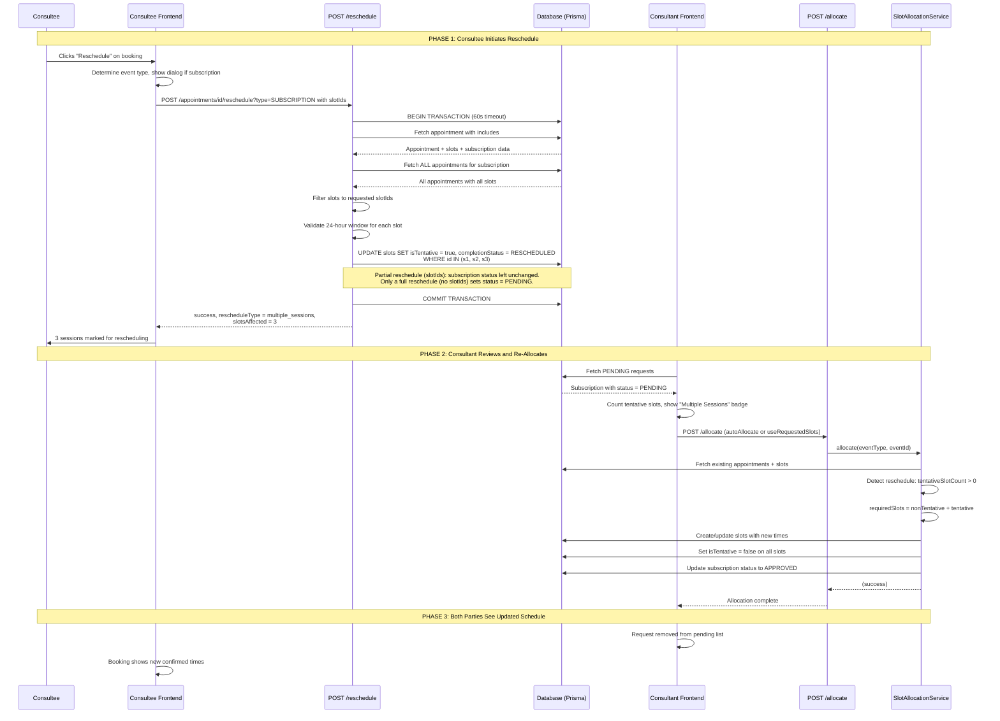
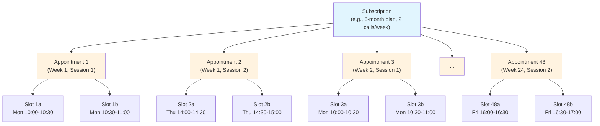
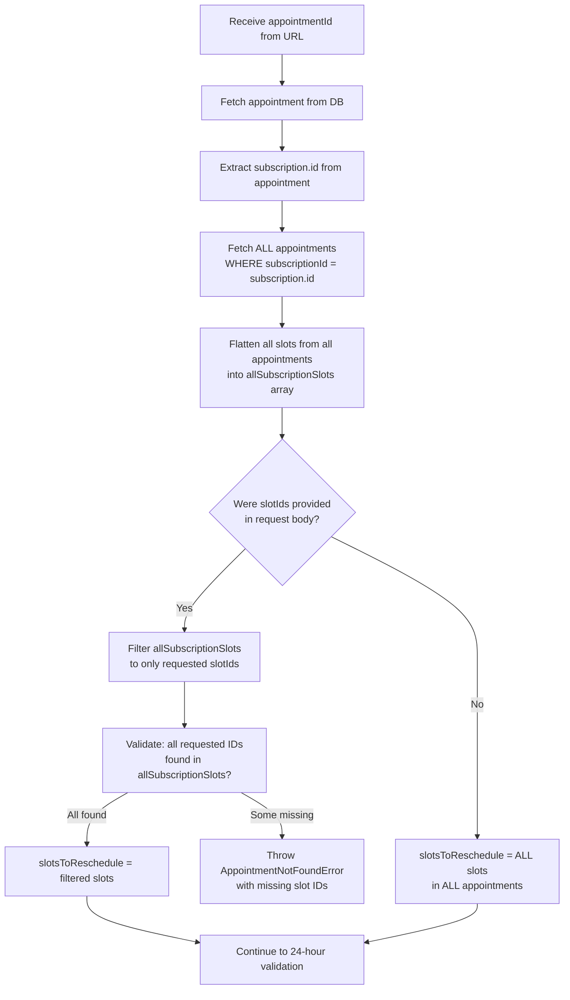
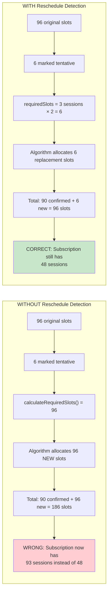
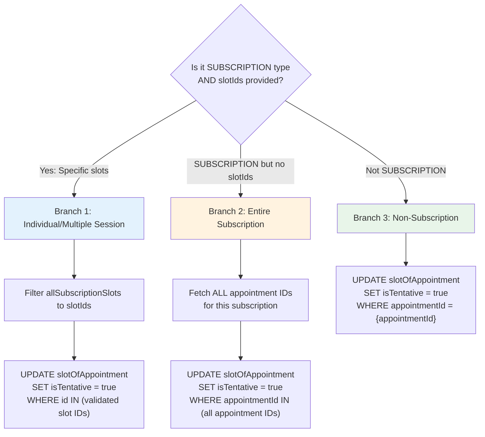
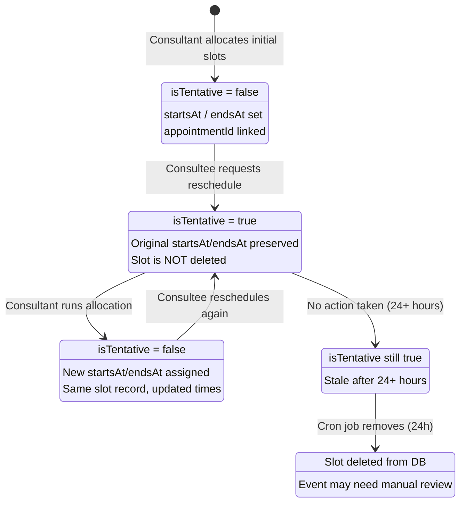
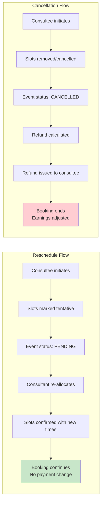

# Rescheduling Flow

## Table of Contents

- [Overview](#overview)
- [Design Philosophy: Why Rescheduling Works This Way](#design-philosophy-why-rescheduling-works-this-way)
- [The Consultee Journey (Frontend)](#the-consultee-journey-frontend)
- [The Consultant Journey](#the-consultant-journey)
- [End-to-End Sequence: The Full Picture](#end-to-end-sequence-the-full-picture)
- [Reschedule Types](#reschedule-types)
- [Multi-Appointment Complexity (Subscriptions)](#multi-appointment-complexity-subscriptions)
- [Reschedule Detection in Auto-Allocation](#reschedule-detection-in-auto-allocation)
- [API Reference](#api-reference)
- [Event-Type-Specific Behavior](#event-type-specific-behavior)
- [Slot Lifecycle During Reschedule](#slot-lifecycle-during-reschedule)
- [Reschedule vs Cancellation: A Comparison](#reschedule-vs-cancellation-a-comparison)
- [Payment Handling](#payment-handling)
- [Error Scenarios and Edge Cases](#error-scenarios-and-edge-cases)
- [Known Issues](#known-issues)
- [Related Documents](#related-documents)

---

## Overview

Rescheduling allows a consultee to request new time slots for an existing appointment without creating a new booking and without triggering any payment operation. The original payment is fully reused -- there is no charge, no refund, and no new invoice.

**Who can trigger a reschedule:** For consultations and subscriptions, the consultee who booked (or the consultant on Manage Timings / allocate). Webinars, classes, and trials are **not** consultee-reschedulable (#1005); group events are organiser-managed.

**Minimum notice:** 24 hours before any affected slot (`MINIMUM_HOURS_BEFORE_RESCHEDULE = 24`). If any slot selected for rescheduling starts within 24 hours, the entire request is rejected.

**Stale-tab guard (#1012):** Re-allocation after a reschedule must send `expectedTentativeSlotCount` matching the live tentative set. A second tab that submits after the first finished receives 409 instead of delete+recreating confirmed slots.

**Planner webinar time/duration edits (#1071):** Host edits go through `replaceContiguousSlotRun`, which reconciles the live N×30min atoms in place (tentative-flip first so `slot_no_confirmed_overlap` cannot self-collide, then update / create / soft-retire). This is distinct from consultee allocate-reschedule; class planner PATCH does not rewrite session slot runs when only `sessionDurationInHours` changes.

**Code location:** `app/api/appointments/[appointmentId]/reschedule/route.ts`

---

## Design Philosophy: Why Rescheduling Works This Way

Before diving into the technical flow, it is important to understand the architectural decisions behind rescheduling. These decisions are not arbitrary; each one addresses a real problem.

### Why mark slots as "tentative" instead of deleting them?

When a consultee reschedules, the system does **not** delete the old slots. Instead, it marks them with `isTentative: true`. This is a deliberate choice for several reasons:

1. **Audit trail preservation.** Deleted rows are gone forever. Tentative flags preserve the history of what was originally booked, which matters for dispute resolution and debugging.

2. **Slot count integrity.** The auto-allocation algorithm uses the count of existing slots (tentative + non-tentative) to determine how many new slots to create. If we deleted the old slots, the algorithm would not know how many slots the event originally required and could allocate the wrong number. See [Reschedule Detection in Auto-Allocation](#reschedule-detection-in-auto-allocation) for the full explanation.

3. **Graceful abandonment handling.** If a consultee initiates a reschedule but never follows through, a cron job can clean up stale tentative slots after a timeout period (currently 24 hours, `TENTATIVE_EXPIRATION_HOURS = 24`). Deletion would leave the event in a broken state with fewer slots than expected.

4. **No payment side effects.** Deleting slots could trigger cascading effects in the payment system (refund calculations, earnings adjustments). Marking as tentative keeps the payment records cleanly attached.

### Why a 24-hour minimum window?

The 24-hour restriction (`MINIMUM_HOURS_BEFORE_RESCHEDULE = 24`) exists because:

- Consultants need time to prepare for sessions. A same-day reschedule wastes their preparation time.
- Calendar integrations and notifications need lead time to propagate changes.
- It prevents abuse (repeatedly rescheduling to avoid sessions while keeping the booking active).

The system checks **every** slot individually. If even one slot in the reschedule request starts within 24 hours, the entire request is rejected -- this is an all-or-nothing validation.

### Why does the subscription type need special handling?

Consultations, webinars, and classes are simple: one event, one appointment, a handful of slots. Subscriptions are fundamentally different:

- A subscription can span months (e.g., a 6-month plan with 2 calls per week = 48+ sessions).
- Each session is its own `Appointment` record.
- Each appointment has its own set of `SlotOfAppointment` records.
- The consultee might want to reschedule just 3 sessions out of 48, and those 3 sessions could be spread across 3 different appointments.

This one-to-many-to-many relationship requires the API to look beyond the single appointment ID in the URL and traverse the entire subscription's appointment tree. Without this, partial rescheduling of subscriptions would be impossible.

---

## The Consultee Journey (Frontend)

This section walks through exactly what the consultee (the person who booked the appointment) sees and does when they want to reschedule.

### Step 1: Finding the Reschedule Button

The consultee navigates to their bookings page and finds the appointment they want to change. Each booking card (`EventCard.tsx`) has a "Reschedule" action button. This button is only visible when the appointment is in a reschedulable state (approved or confirmed, not already pending).

### Step 2: The Decision Tree

What happens next depends on the event type:



### Step 3: The Subscription Dialog (Multi-Session Only)

For multi-session subscriptions, a dialog (`showRescheduleDialog`) presents three options:

| Option                  | What it does                           | When to use                                   |
| ----------------------- | -------------------------------------- | --------------------------------------------- |
| **Individual Session**  | Reschedule exactly 1 session           | "My Tuesday 3pm this week doesn't work"       |
| **Multiple Sessions**   | Reschedule 2 or more specific sessions | "I'm traveling next week, move both sessions" |
| **Entire Subscription** | Reschedule every remaining session     | "I need to change my entire schedule"         |

When "Individual Session" or "Multiple Sessions" is selected, the dialog shows a list of all sessions in the subscription with checkboxes. Each session shows its date, time, and status. Sessions that start within 24 hours have their checkboxes **disabled** with a visual indicator explaining why (the 24-hour restriction).

The frontend component tracks the selection state:

```typescript
// EventCard.tsx state management
const [showRescheduleDialog, setShowRescheduleDialog] = useState(false);
const [rescheduleType, setRescheduleType] = useState<string | null>(null);
const [selectedSlotIds, setSelectedSlotIds] = useState<string[]>([]);
```

### Step 4: Confirmation and API Call

When the consultee confirms their selection, the frontend sends:

```typescript
POST /api/appointments/{appointmentId}/reschedule?type=SUBSCRIPTION
Body: { slotIds: ["slot_abc", "slot_def", "slot_ghi"] }
```

For non-subscription types or entire subscription reschedules, `slotIds` is omitted.

### Step 5: After the Reschedule Request

On success, the page updates to reflect the pending state. The consultee sees:

- The booking status changes to "Pending Reschedule" (or equivalent visual indicator).
- The consultee is told to wait for the consultant to assign new times.
- The affected sessions show as "awaiting new time" rather than showing their old times.

The consultee cannot select new times themselves. The consultant must re-allocate slots using the allocation system. This is by design: the consultant controls their own calendar.

### Consultee Journey: Sequence of Events



---

## The Consultant Journey

After the consultee initiates a reschedule, the request appears on the consultant's side. Here is what the consultant sees and does.

### How Rescheduled Requests Appear

The consultant's dashboard includes a **Requests** tab (`RequestSlotAllocationTab.tsx`). This tab fetches all consultations and subscriptions with `status: PENDING`. When a request is a reschedule (as opposed to a fresh booking), the system detects this by examining the slots:

- It counts **tentative** slots (`isTentative: true`) vs **total** slots.
- If tentative slots exist, it is a reschedule.
- The ratio of tentative to total slots determines the badge type.

### Badge Indicators

The consultant sees color-coded badges on rescheduled requests:

| Badge                  | Color | Condition                            | Meaning                            |
| ---------------------- | ----- | ------------------------------------ | ---------------------------------- |
| **Full Reschedule**    | Blue  | All slots are tentative              | The entire booking needs new times |
| **Individual Session** | Amber | Exactly 1 slot is tentative          | One session needs a new time       |
| **Multiple Sessions**  | Amber | 2+ slots are tentative (but not all) | Several sessions need new times    |
| _(No badge)_           | --    | No tentative slots                   | Fresh booking, not a reschedule    |

### Slot Display

Within the request detail, each slot is displayed with a visual indicator:

- **Warning icon** (triangle) for tentative slots -- these need new times.
- **Green check** for confirmed slots -- these are fine and should not be changed.

This makes it immediately clear which sessions are affected by the reschedule.

### The Consultant's Two Options

The consultant has two buttons for handling any pending request:

| Button                  | Action                                              | When to use                                       |
| ----------------------- | --------------------------------------------------- | ------------------------------------------------- |
| **Use Requested Times** | Accept the times the consultee proposed on a FIRST request | Consultee submitted preferred times and they work |
| **Allocate Slots**      | Run the auto-allocation algorithm to find new times | Need the system to find optimal times, and the only option after a reschedule |

#### Option A: "Use Requested Times" (useRequestedSlots)

This path is used when the consultee has already proposed specific times on
their original request. It is **not** available once a reschedule has been
requested. A reschedule releases slots by flipping `isTentative` and
`completionStatus` on the existing rows; it never writes a new `startsAt`.
Those rows therefore still hold the very times the consultee is trying to move
away from, and `fetchEventData` derives `requestedSlots` from them, so reusing
them would silently re-confirm the original booking. The service rejects that
case and the button is hidden whenever any slot is `RESCHEDULED`.

The flow:

1. Take the consultant allocation lock, then the consultee booking lock, in that
   order. This path used to hold no lock at all, which let an approval run
   alongside an auto or manual allocation of the same event. The consultee lock
   matters separately: the overlap exclusion constraint is keyed by consultant,
   so it cannot see the same person being booked with two different consultants
   at once.
2. Inside the transaction, apply the initial-allocation guard under an advisory
   lock. It is always armed here, because approving stored times is only ever
   valid for an event that has not been allocated yet. A retry carrying the same
   idempotency key replays the winner's batch; a different key gets a 409.
3. Fetch the event data including all requested slots.
4. Verify appointments actually exist (prevents approving empty requests).
5. Reject if any slot is `RESCHEDULED` — the stored times are stale by definition.
6. Verify the slot count matches (requested slots = appointment slots).
7. Run validation on the requested slots (availability, conflicts, etc.).
8. Update the event status to `APPROVED`.
9. Clear all `isTentative` flags (`isTentative: false` on all slots).
10. Stamp the idempotency key on the first appointment.
11. Return success with the existing appointments.

#### Option B: "Allocate Slots" (autoAllocate)

This path runs the full auto-allocation algorithm. It is reschedule-aware -- see [Reschedule Detection in Auto-Allocation](#reschedule-detection-in-auto-allocation) for details. The algorithm:

1. Detects tentative slots exist (indicating a reschedule).
2. Preserves the original total slot count.
3. Finds new available time slots.
4. Replaces the tentative slots with new confirmed slots.
5. Leaves non-tentative slots unchanged.

### Consultant Flow: Sequence Diagram



---

## End-to-End Sequence: The Full Picture

This diagram shows the complete lifecycle of a reschedule from the moment the consultee decides to reschedule to the moment both parties have confirmed new times.



---

## Reschedule Types

Reschedules are categorized into three types based on how many slots are affected:

| Type               | `rescheduleType` value | When used                                       | Example                                                                              |
| ------------------ | ---------------------- | ----------------------------------------------- | ------------------------------------------------------------------------------------ |
| Entire booking     | `entire_booking`       | No `slotIds` provided, or non-subscription type | User reschedules a consultation (always entire) or an entire 18-session subscription |
| Individual session | `individual_session`   | `slotIds` contains exactly 1 slot               | User picks 1 session out of 18 to move to a different day                            |
| Multiple sessions  | `multiple_sessions`    | `slotIds` contains 2+ slots                     | User picks 5 sessions out of 18 to reschedule                                        |

The type is determined by the API based on the `slotIds` array length:

```typescript
// route.ts L218-230
const getRescheduleType = () => {
  if (appointmentType !== "SUBSCRIPTION" || !slotIds || slotIds.length === 0) {
    return "entire_booking";
  }
  if (slotIds.length === 1) {
    return "individual_session";
  }
  return "multiple_sessions";
};
```

**Important:** `individual_session` and `multiple_sessions` are only possible for the `SUBSCRIPTION` type. All other event types (consultation, webinar, class) always produce `entire_booking` because they have a single appointment with no partial selection concept.

---

## Multi-Appointment Complexity (Subscriptions)

This section is critical for understanding why subscription rescheduling requires special handling. If you are new to the codebase, read this carefully.

### The Data Model

A subscription is not a single appointment. It is a container for many appointments, each with their own slots:



Key relationships:

- **Subscription** 1 ---> N **Appointments** (one per session)
- **Appointment** 1 ---> N **SlotOfAppointment** (time blocks within that session; typically 2 per 1-hour session since slots are 30 minutes each)

### The Problem

The frontend shows all sessions from a subscription in a single list. The consultee selects checkboxes for the sessions they want to reschedule. But the API URL only accepts a single `appointmentId`:

```
POST /api/appointments/{appointmentId}/reschedule?type=SUBSCRIPTION
```

The selected sessions might belong to **different** appointments. If the user selects Session 1 (from Appointment 1), Session 5 (from Appointment 3), and Session 12 (from Appointment 6), the API needs to find and update slots across three different appointment records -- despite receiving only one `appointmentId` in the URL.

### How the API Solves This

The API uses the single `appointmentId` as an entry point to discover the full subscription:



The code that performs this flattening (route.ts L101-114):

```typescript
// For SUBSCRIPTION type, we need to get ALL slots across ALL appointments
// because the UI collects slots from all appointments but only passes one appointmentId
let allSubscriptionSlots: typeof appointment.slotsOfAppointment = [];

if (appointmentType === "SUBSCRIPTION" && appointment.subscription) {
  const allAppointments = await tx.appointment.findMany({
    where: { subscriptionId: appointment.subscription.id },
    include: { slotsOfAppointment: { orderBy: { startsAt: "asc" } } },
  });
  allSubscriptionSlots = allAppointments.flatMap(
    (apt) => apt.slotsOfAppointment,
  );
}
```

### Concrete Example: Partial Subscription Reschedule

Suppose a consultee has a 6-month subscription with 2 calls per week, each call being 1 hour long (= 2 slots of 30 minutes each). That is:

- 48 sessions total
- 48 appointments
- 96 slots (2 per appointment)

The consultee wants to reschedule 3 sessions (Sessions 5, 12, and 20) because they have a vacation conflict.

**Step 1: Frontend collects the slot IDs.**

The checkboxes correspond to appointments, but the frontend collects the underlying slot IDs for those appointments:

```
Session 5  -> Appointment 5  -> Slot IDs: ["slot_5a", "slot_5b"]
Session 12 -> Appointment 12 -> Slot IDs: ["slot_12a", "slot_12b"]
Session 20 -> Appointment 20 -> Slot IDs: ["slot_20a", "slot_20b"]
```

The frontend sends: `slotIds: ["slot_5a", "slot_5b", "slot_12a", "slot_12b", "slot_20a", "slot_20b"]`

**Step 2: API receives the request.**

```
POST /api/appointments/appointment_5/reschedule?type=SUBSCRIPTION
Body: { slotIds: ["slot_5a", "slot_5b", "slot_12a", "slot_12b", "slot_20a", "slot_20b"] }
```

Note: `appointment_5` is just the entry point. The API will look beyond it.

**Step 3: API flattens the subscription.**

The API discovers that `appointment_5` belongs to subscription `sub_xyz`. It fetches all 48 appointments and flattens their 96 slots into a single array `allSubscriptionSlots`.

**Step 4: API filters to the requested slots.**

From the 96 slots, it filters to the 6 matching the provided `slotIds`. It verifies all 6 exist.

**Step 5: 24-hour validation.**

Each of the 6 slots is checked. If `slot_5a` starts in 18 hours, the entire request is rejected (all 6 slots, not just that one).

**Step 6: Mark as tentative.**

Only the 6 requested slots have `isTentative` set to `true`. The other 90 slots remain `isTentative: false`.

**Step 7: Subscription status is left untouched.**

A partial reschedule of specific sessions no longer flips the whole subscription back to `PENDING`. The subscription keeps its existing status (for example `APPROVED`), and only the rescheduled slots are re-tentatived; session-level state is tracked on the slots via their `completionStatus` (`RESCHEDULED`). Only an entire-subscription reschedule (no `slotIds`) genuinely re-enters `PENDING`.

**Step 8: Response.**

```json
{
  "success": true,
  "rescheduleType": "multiple_sessions",
  "slotsAffected": 6,
  "message": "6 session(s) marked for rescheduling. Please select new time(s)."
}
```

Note: The API returns `slotsAffected: 6` (slot count), not `sessionsAffected: 3` (session count). This is another known issue -- the frontend displays this as "6 sessions" which is confusing.

---

## Reschedule Detection in Auto-Allocation

When the consultant clicks "Allocate Slots" after a reschedule request, the `SlotAllocationService.autoAllocate()` method runs. This method must be reschedule-aware. Here is why and how.

### The Problem Without Detection

Imagine this scenario without reschedule detection:

1. A consultee books a subscription: 48 sessions, 96 slots.
2. The consultant approves and allocates 96 slots.
3. The consultee reschedules 3 sessions (6 slots marked tentative).
4. The consultant clicks "Allocate Slots".

If the algorithm did not detect the reschedule, it would call `calculateRequiredSlots()` which reads the subscription configuration (48 sessions x 2 slots = 96 slots). But there are already 90 confirmed slots. The algorithm might try to allocate 96 **new** slots, resulting in 186 total slots -- completely wrong.

### How Detection Works

The algorithm inspects existing slot data before deciding how many slots to create (`SlotAllocationService.autoAllocate`):

```typescript
// Count existing slots by tentative status
const existingNonTentativeSlotCount = existingAppointments.reduce(
  (count, app) =>
    count + app.slotsOfAppointment.filter((s) => !s.isTentative).length,
  0,
);

const tentativeSlotCount = existingAppointments.reduce(
  (count, app) =>
    count + app.slotsOfAppointment.filter((s) => s.isTentative).length,
  0,
);

const isReschedule = tentativeSlotCount > 0;

let requiredSlots: number;
if (isReschedule) {
  // RESCHEDULE: allocate only the sessions being rescheduled, not the whole
  // booking. One appointment is one session, so the count is the number of
  // appointments carrying a tentative slot, times the slots each session needs.
  // (#898 — a partial reschedule of 2 of 10 sessions needs 2 sessions' worth of
  // new slots, not all 10; the earlier `existingNonTentative + tentative`
  // formula over-allocated partial reschedules.)
  const rescheduleSessions = existingAppointments.filter((a) =>
    a.slotsOfAppointment.some((s) => s.isTentative),
  ).length;
  requiredSlots = rescheduleSessions * slotsPerCall;
} else {
  // INITIAL ALLOCATION: Calculate from config
  requiredSlots = SlotCalculationService.calculateRequiredSlots(
    eventType,
    config,
  );
}
```

### The Math

Using our example (3 sessions rescheduled, each a 1-hour call = 2 slots):

| Count                           | Value  | Explanation                                            |
| ------------------------------- | ------ | ------------------------------------------------------ |
| `existingNonTentativeSlotCount` | 90     | Slots that are confirmed and not being rescheduled     |
| `tentativeSlotCount`            | 6      | Slots marked for rescheduling                          |
| `isReschedule`                  | `true` | Because `tentativeSlotCount > 0`                       |
| `rescheduleSessions`            | 3      | Appointments carrying at least one tentative slot      |
| `requiredSlots`                 | 6      | `3 sessions x 2 slots = 6` (only the rescheduled slots) |

The algorithm now knows: "I need to find 6 new slots -- one replacement per tentative slot, across the 3 rescheduled sessions." It allocates 6 new confirmed slots, leaving the 90 confirmed ones untouched. (#898 made `requiredSlots` the count of slots being rescheduled; previously it was the booking's full total, which silently over-allocated partial reschedules.)

### What Would Go Wrong Without This



### Preserving Paid Appointments During Re-Allocation

When the allocator clears an event's old slots before writing the new ones, it must not destroy any appointment that carries a `Payment`. Deleting such an appointment cascades to its `Payment`, which `ConsultantEarnings` references with `onDelete: Restrict`, so the cascade aborts the whole transaction. The allocator therefore preserves any payment-bearing appointment and strips only its slots.

For subscriptions and classes this is sufficient, because their relation to `Appointment` is one-to-many: the allocator writes the new slots onto fresh appointment rows alongside the preserved one. Consultations and webinars are one-to-one (`consultationId` and `webinarId` are unique), so creating a second appointment for the same event would violate that unique constraint. For those two types the allocator instead reuses the preserved appointment, attaching the new slots to the existing row rather than creating a replacement (#898). The original payment, earnings, and cancellation-policy snapshot all stay attached, and a rescheduled webinar's enrolled attendees are re-linked to the new slots.

### Per-Day Session Cap

Auto-allocation also enforces a per-day session cap -- one call per day for subscriptions and two for classes -- so a week's sessions are spread across days rather than stacked onto one. The cap buckets candidate slots by local day, matching the consultant's manual-allocation guard so that automatic and manual allocation agree at timezone boundaries (#898).

---

## API Reference

### Endpoint

```
POST /api/appointments/{appointmentId}/reschedule?type={APPOINTMENT_TYPE}
```

### Authentication

Requires an active session. Returns `401 Unauthorized` if not authenticated.

### Query Parameters

| Parameter | Required | Values                                             | Description                                                                                                     |
| --------- | -------- | -------------------------------------------------- | --------------------------------------------------------------------------------------------------------------- |
| `type`    | Yes      | `CONSULTATION`, `SUBSCRIPTION`, `WEBINAR`, `CLASS` | Determines event-type-specific behavior (which related entity to update, whether partial reschedule is allowed) |

### Request Body

```json
{
  "slotIds": ["slot_abc", "slot_def"]
}
```

| Field     | Type       | Required | Description                                                                                                   |
| --------- | ---------- | -------- | ------------------------------------------------------------------------------------------------------------- |
| `slotIds` | `string[]` | No       | Specific slot IDs to reschedule. Only meaningful for `SUBSCRIPTION` type. Omit for entire booking reschedule. |
| `slotId`  | `string`   | No       | Legacy single-slot format. Converted to `[slotId]` array internally. Exists for backward compatibility.       |

If the body is empty, unparseable, or missing the slot fields, the system treats it as "reschedule everything" (no specific slot selection).

### Response (200)

```json
{
  "success": true,
  "rescheduleType": "individual_session",
  "slotsAffected": 4,
  "message": "4 session(s) marked for rescheduling. Please select new time(s)."
}
```

| Field            | Type      | Description                                                        |
| ---------------- | --------- | ------------------------------------------------------------------ |
| `success`        | `boolean` | Always `true` on 200                                               |
| `rescheduleType` | `string`  | One of `entire_booking`, `individual_session`, `multiple_sessions` |
| `slotsAffected`  | `number`  | Count of individual slots (not sessions) marked tentative          |
| `message`        | `string`  | Human-readable status message                                      |

### Error Responses

| Status | Condition                               | Error Class                | Example Message                                                          |
| ------ | --------------------------------------- | -------------------------- | ------------------------------------------------------------------------ |
| 401    | Not authenticated                       | --                         | `Unauthorized`                                                           |
| 400    | Invalid request body or missing `type`  | --                         | Varies                                                                   |
| 400    | Slot within 24 hours                    | `ReschedulePolicyError`    | `Cannot reschedule: slot starts in 18 hours (minimum 24 hours required)` |
| 404    | Appointment not found                   | `AppointmentNotFoundError` | `appointment not found: apt_123`                                         |
| 404    | Slot ID not found in subscription       | `AppointmentNotFoundError` | `slot not found: slot_xyz, slot_abc`                                     |
| 500    | Transaction failure or unexpected error | --                         | `Failed to request reschedule`                                           |

### Transaction Details

The entire operation runs inside a Prisma `$transaction` with a 60-second timeout. This means:

- All database writes are atomic -- either everything succeeds or nothing changes.
- If the transaction times out (large subscriptions with hundreds of slots), the entire operation rolls back.
- The 60-second limit was chosen to accommodate subscriptions with up to ~200 slots while preventing runaway queries.

---

## Event-Type-Specific Behavior

### Comparison Table

| Event Type       | Partial reschedule? | Status field updated | New status value | Notes                                                                                                        |
| ---------------- | ------------------- | -------------------- | ---------------- | ------------------------------------------------------------------------------------------------------------ |
| **Consultation** | No (always entire)  | `status`      | `PENDING`        | Single session, single appointment. All slots marked tentative.                                              |
| **Subscription** | Yes (via `slotIds`) | `status` (entire reschedule only) | `PENDING`        | Supports all three reschedule types. Only an entire reschedule (no `slotIds`) reverts `status` to `PENDING`; a partial reschedule of specific sessions leaves the subscription status unchanged and re-tentatives only the selected slots. |
| **Webinar**      | No (always entire)  | `status`             | `SCHEDULED`      | All slots marked tentative. Uses `status` not `status` because webinars have a different state model. |
| **Class**        | No (always entire)  | `status`             | `SCHEDULED`      | Same as webinar. Uses `status` instead of `status`.                                                   |

### Why Different Status Fields?

Consultations and subscriptions use `status` because they follow a request/approval workflow. The consultee requests, the consultant approves. Setting `status` back to `PENDING` puts the booking back into the approval queue.

Webinars and classes use `status` because they do not have the same request/approval model. Setting `status` to `SCHEDULED` indicates the event needs new time allocation without implying a request/approval step.

### Subscription Slot Marking: Three Branches

The API has three distinct code paths for marking slots as tentative. Understanding which branch executes is important for debugging:



**Branch 1** (route.ts L155-169): Uses the validated `slotIds` directly. Only those specific slots are marked.

**Branch 2** (route.ts L170-185): Performs an additional query to get all appointment IDs, then marks all their slots. This is more expensive than Branch 1 because it hits the database an extra time to resolve appointment IDs.

**Branch 3** (route.ts L186-192): The simplest path. Just marks all slots in the single appointment referenced by the URL.

---

## Slot Lifecycle During Reschedule

### State Diagram



### State Transition Table

| From State            | To State                 | Trigger                          | Database Change                                      |
| --------------------- | ------------------------ | -------------------------------- | ---------------------------------------------------- |
| Allocated (confirmed) | Tentative                | Consultee calls POST /reschedule | `isTentative` = `true`                               |
| Tentative             | Re-allocated (confirmed) | Consultant approves/allocates    | `isTentative` = `false`, `startsAt`/`endsAt` updated |
| Tentative             | Abandoned                | No action for 24+ hours          | No change (still `isTentative` = `true`)             |
| Abandoned             | Cleaned up               | Cron job fires                   | Slot record deleted                                  |
| Re-allocated          | Tentative                | Consultee reschedules again      | `isTentative` = `true`                               |

### What "Tentative" Means in Practice

A tentative slot is a slot that:

- Still exists in the database (not deleted).
- Still has its old `startsAt` and `endsAt` values (the times it was originally scheduled for).
- Is flagged with `isTentative: true` so the system knows it needs new times.
- Is **not** counted as a "real" upcoming session for the consultee.
- **Is** counted by the auto-allocation algorithm to preserve the original slot count.

Think of it as a placeholder. The slot is saying: "I represent a session that needs to happen, but my current time is no longer valid. Please give me a new time."

---

## Reschedule vs Cancellation: A Comparison

Understanding the difference between rescheduling and cancellation is important because they are often confused, but they have fundamentally different implications for payments, slots, and user experience.

### Side-by-Side Comparison

| Aspect                       | Reschedule                                            | Cancellation                                                |
| ---------------------------- | ----------------------------------------------------- | ----------------------------------------------------------- |
| **Intent**                   | Change the time, keep the booking                     | End the booking entirely                                    |
| **Payment**                  | No payment operation. Original payment reused.        | Refund may be issued (full or partial depending on policy). |
| **Slots**                    | Marked `isTentative: true`, awaiting new times        | Deleted or marked cancelled                                 |
| **Event status**             | Reverts to `PENDING` / `SCHEDULED`                    | Changes to `CANCELLED`                                      |
| **Consultant action needed** | Yes -- must re-allocate slots                         | No -- booking is done                                       |
| **Consultee can undo**       | No (but can reschedule again after re-allocation)     | No (must rebook and pay again)                              |
| **Earnings impact**          | None. Consultant earnings unchanged.                  | Earnings may be clawed back or adjusted.                    |
| **Time restriction**         | 24 hours before any affected slot                     | Varies by cancellation policy                               |
| **Partial support**          | Yes (for subscriptions: individual/multiple sessions) | Depends on implementation                                   |

### Flow Comparison Diagram



### When Should a User Reschedule vs Cancel?

| Situation                                 | Recommended Action             | Why                                                                 |
| ----------------------------------------- | ------------------------------ | ------------------------------------------------------------------- |
| "I can't make Tuesday but Thursday works" | Reschedule                     | Same service, different time. No payment friction.                  |
| "I no longer need this service"           | Cancel                         | The booking serves no purpose.                                      |
| "The consultant isn't a good fit"         | Cancel                         | Rescheduling won't fix a fit problem.                               |
| "I'm traveling for 2 weeks"               | Reschedule (specific sessions) | Only move the affected sessions, keep the rest.                     |
| "I want to pause for 3 months"            | Depends on policy              | May need cancellation + rebooking, or a subscription pause feature. |

---

## Payment Handling

Rescheduling does **not** trigger any payment operations:

| Concern             | Behavior                                                |
| ------------------- | ------------------------------------------------------- |
| New charge          | None. No new payment is created.                        |
| Refund              | None. No refund is issued.                              |
| Payment record      | Stays `SUCCEEDED`, unmodified.                          |
| Consultant earnings | Status unchanged (`PENDING` / `READY` / `PAID`).        |
| Hold period         | Not reset -- continues from original payment timestamp. |
| Invoice             | Unchanged. Original invoice remains valid.              |

The original payment covers the new slots once the consultant re-allocates. From the payment system's perspective, a reschedule is invisible -- it only affects appointment slots and event statuses, not financial records.

**Cross-reference:** [`docs/payments/cancellations-rescheduling/02-rescheduling-payment-flow.md`](../payments/cancellations-rescheduling/02-rescheduling-payment-flow.md)

---

## Error Scenarios and Edge Cases

### Scenario 1: Slot Within 24 Hours

**What happens:** Consultee tries to reschedule a session that starts in 18 hours.

**System behavior:** The API loops through every slot in `slotsToReschedule` and calculates the hours until each slot starts. When it finds one at 18 hours:

```typescript
if (hoursUntilSlot < MINIMUM_HOURS_BEFORE_RESCHEDULE) {
  throw new ReschedulePolicyError(
    hoursUntilSlot,
    MINIMUM_HOURS_BEFORE_RESCHEDULE,
  );
}
```

**Result:** `400 Bad Request` with message: "Cannot reschedule: slot starts in 18 hours (minimum 24 hours required)."

**Important detail:** This is all-or-nothing. If the consultee selects 5 sessions and 1 of them is within 24 hours, all 5 are rejected. The consultee must deselect the problematic session and try again.

**Frontend handling:** Sessions within 24 hours have their checkboxes disabled in the UI, so this error should be rare. It acts as a server-side safety net.

### Scenario 2: Slot ID Not Found

**What happens:** The frontend sends `slotIds` that include an ID that does not exist in the subscription.

**System behavior:** After filtering `allSubscriptionSlots` by the provided `slotIds`, the API checks if the result count matches:

```typescript
if (slotsToReschedule.length !== slotIds.length) {
  const foundIds = slotsToReschedule.map((s) => s.id);
  const missingIds = slotIds.filter((id) => !foundIds.includes(id));
  throw new AppointmentNotFoundError("slot", missingIds.join(", "));
}
```

**Result:** `404 Not Found` with message listing the missing slot IDs.

**When this happens:** Stale data in the frontend (another tab deleted the slot), race conditions, or frontend bugs sending incorrect IDs.

### Scenario 3: Abandoned Reschedule

**What happens:** Consultee initiates a reschedule (slots marked tentative), but the consultant never re-allocates.

**System behavior:** The tentative slots remain in the database indefinitely. The event status stays `PENDING`.

**Consequences:**

- The consultee's booking appears "stuck" in a pending state.
- The tentative slots still hold their old times, but those times are no longer valid.
- The auto-allocation algorithm will continue to detect this as a reschedule (`tentativeSlotCount > 0`) on any future allocation attempt.

**Current mitigation:** A cron job is designed to clean up tentative slots after 24 hours of inactivity (`TENTATIVE_EXPIRATION_HOURS = 24`). However, this cleanup is deletion-based, which means the subscription will then have fewer slots than expected.

**Ideal future mitigation:** Instead of deleting, the cron should either (a) revert the tentative flags and restore the original status, or (b) notify both parties before taking action.

### Scenario 4: Concurrent Reschedule Attempts

**What happens:** Two tabs or two users (if somehow both have access) try to reschedule the same appointment simultaneously.

**System behavior:** The 60-second transaction provides some protection. Prisma transactions use database-level isolation, so:

- The first transaction to commit wins.
- The second transaction may see stale data (slots already marked tentative) and could:
  - Mark already-tentative slots as tentative again (no-op, idempotent).
  - Update the status to PENDING when it is already PENDING (no-op).
  - In most cases, both succeed without conflict since `SET isTentative = true` is idempotent.

**Risk:** The real risk is not data corruption but user confusion. Both tabs show success, but only one set of slot selections is meaningful. The consultant sees the combined effect (all slots from both requests marked tentative).

### Scenario 5: Appointment Not Found

**What happens:** The `appointmentId` in the URL does not match any record.

**System behavior:** The `findUnique` call returns `null`, and the API throws:

```typescript
if (!appointment) {
  throw new AppointmentNotFoundError("appointment", appointmentId);
}
```

**Result:** `404 Not Found` with message: "appointment not found: {appointmentId}".

**When this happens:** Stale links, deleted appointments, or incorrect URL construction.

### Scenario 6: Transaction Timeout

**What happens:** The database transaction exceeds 60 seconds.

**System behavior:** Prisma aborts the transaction and rolls back all changes. The API catches this as a generic error.

**Result:** `500 Internal Server Error` with message: "Failed to request reschedule".

**When this happens:** Very large subscriptions (hundreds of appointments), database performance issues, or lock contention from concurrent operations.

---

## Known Issues

Five issues have been validated against the codebase. All are legitimate and tracked for resolution.

### Issue 1: slotIds vs Session-Based Selection

**Priority:** HIGH | **Status:** Partially addressed ([#448](https://github.com/Practitionist/familiarise_web/issues/448)) — the API responses and `rescheduleType` are now session-based, so the user-facing semantics no longer mislead. The request contract still accepts `slotIds[]`, so migrating the request itself to `appointmentIds[]` remains the Phase 3 work.

**The problem:** The API accepts `slotIds[]` (individual 30-minute time blocks) instead of `appointmentIds[]` (logical sessions). There is no session-level abstraction in the API contract.

**Why this matters:** A "session" from the user's perspective is a 1-hour call, but in the database it is represented as 2 slots of 30 minutes each. The frontend must maintain the mapping between sessions and their underlying slots. This mapping is fragile because:

- If the slot duration changes (e.g., 15-minute slots for shorter sessions), the frontend code breaks.
- The frontend must group slots by appointment to display them as "sessions," adding complexity.
- Slot IDs are database-generated UUIDs with no inherent session grouping.

**Example of the fragility:** The consultee sees "Session 5 - Monday 10:00 AM" but the frontend must know that this is `["slot_5a", "slot_5b"]` and send both IDs. If it only sends `"slot_5a"`, the API marks half a session as tentative and half as confirmed -- an invalid state.

**Planned fix:** Migrate to `appointmentIds[]` in a new endpoint version. The API would resolve appointment IDs to their constituent slots internally, removing the burden from the frontend.

### Issue 2: Status Always Set to PENDING

**Priority:** HIGH | **Status:** FIXED — a partial reschedule no longer flips the whole subscription to `PENDING`.

**The former problem:** A subscription reschedule used to set the subscription's `status` to `PENDING` unconditionally, regardless of whether it was a partial or full reschedule.

**Why this mattered:** Consider a 48-session subscription where the consultee reschedules 1 session. Setting the entire subscription to `PENDING` implied the whole subscription needed re-approval, which:

- Removed it from the "active" list and placed it in the "pending" queue.
- Could confuse the consultant into thinking the entire subscription needed attention.
- The other 47 sessions were fully confirmed and should not have appeared to need action.

**The fix:** For partial reschedules (`individual_session` or `multiple_sessions`), the subscription keeps its existing status (for example `APPROVED`) and only the rescheduled slots are re-tentatived and stamped `completionStatus = RESCHEDULED`. Only an entire (`entire_booking`) reschedule re-enters `PENDING`.

### Issue 3: No Partial Reschedule Tracking Field

**Priority:** MEDIUM | **Status:** Planned (Phase 2)

**The problem:** The Subscription model has no `sessionsAwaitingReschedule` counter or similar field. The only way to determine which sessions need rescheduling is to query all slots and check individual `isTentative` flags.

**Why this matters:** The consultant's dashboard must load all slots for every pending subscription to compute reschedule badges and counts. For large subscriptions (48+ sessions, 96+ slots), this is:

- Expensive in terms of database queries.
- Slow to render on the frontend.
- Error-prone because the count must be computed at display time rather than read from a field.

**Planned fix:** Add a `sessionsAwaitingReschedule` integer field to the Subscription model. The reschedule API would increment it, and the allocation service would decrement it upon re-allocation.

### Issue 4: 24-Hour Validation on Individual Slots

**Priority:** LOW | **Status:** Works, not optimal

**The problem:** Each 30-minute slot is validated independently against the 24-hour window. The validation is not session-aware.

**Why this matters in theory:** A session spanning midnight (e.g., 23:30-00:30) has two slots: one before midnight (23:30-00:00) and one after (00:00-00:30). If the current time is 00:15 on the session day:

- Slot 1 (23:30-00:00): Already in the past (negative hours) -- would be rejected.
- Slot 2 (00:00-00:30): Only 0.25 hours away -- would also be rejected.

In practice, this edge case is unlikely because sessions rarely span midnight. But the principle is wrong: we should validate at the session (appointment) level, not the individual slot level.

**Planned fix:** Validate based on the earliest `startsAt` of the appointment (session), not each slot independently.

### Issue 5: Toast Shows Slot Count, Not Session Count

**Priority:** HIGH | **Status:** FIXED ([#448](https://github.com/Practitionist/familiarise_web/issues/448) follow-up) — the reschedule API now returns `sessionsAffected` (the count of distinct appointments) alongside `slotsAffected`, derives `rescheduleType` from sessions, and the consultee toast displays the session count. A one-hour (two-slot) session now correctly reports one session rather than "2 sessions".

**The problem:** The API returns `slotsAffected` (e.g., 72 slots for 18 four-slot sessions), and the frontend displays this as a session count. The user sees "72 sessions marked for rescheduling" when it should say "18 sessions."

**Why this matters:** This is a direct user-facing confusion. If a consultee reschedules 3 sessions (6 slots), they see "6 sessions marked for rescheduling" and may think the system malfunctioned, rescheduling more than they intended.

**Example:**

- Subscription: 18 sessions, each 2 hours (4 slots of 30 minutes each).
- Consultee reschedules 5 sessions.
- API returns `slotsAffected: 20` (5 sessions x 4 slots).
- Frontend displays: "20 session(s) marked for rescheduling."
- Consultee panics: "I only picked 5!"

**Planned fix:** Add a `sessionsAffected` field to the API response that counts unique appointments affected, not individual slots. The frontend should display `sessionsAffected` to the user and keep `slotsAffected` for debugging.

### Fix Roadmap

| Phase   | Scope                       | Issues Fixed                                    | Breaking Change? |
| ------- | --------------------------- | ----------------------------------------------- | ---------------- |
| Phase 1 | API response + status logic | #2 (PENDING status, fixed), #5 (slot vs session count) | No               |
| Phase 2 | Schema migration            | #3 (tracking field)                             | No (additive)    |
| Phase 3 | New endpoint                | #1 (slotIds to appointmentIds)                  | Yes              |
| Phase 4 | Optimization                | #4 (session-aware validation)                   | No               |

---

## Related Documents

- [Architecture](./01-architecture.md) -- Slot services (calculation, validation, allocation)
- [API Reference](./04-api-reference.md) -- Validate and allocate endpoints (used after reschedule)
- [Rescheduling Payment Flow](../payments/cancellations-rescheduling/02-rescheduling-payment-flow.md) -- Payment reuse details
- [Cancellation Payment Flow](../payments/cancellations-rescheduling/01-cancellation-payment-flow.md) -- When user cancels instead of rescheduling

## The response loop (2026-08-14, #1163 / #1169 PR 4)

A proposal can now be answered by the other side. `POST /api/appointments/[appointmentId]/reschedule/respond` with `{ "action": "accept" }` re-validates the proposed times through the full allocator (manual mode under the consultant-wide lock — the same machinery auto-confirm uses, so nothing is written unless validation commits) and finalizes the request to `ACCEPTED`; `{ "action": "decline" }` is a guarded transition to `DECLINED` that deliberately leaves the released slots in the consultant's allocate queue, because the initiator still wants to move. The initiator's own exit remains `withdraw`, which restores the booking. Authorization is the counterparty alone, with the withdraw route's anti-oracle 404 discipline. The consultee's event reads now carry the live proposal (`rescheduleRequests` with `proposedSlots`), so a consultant-initiated reschedule finally renders on the consultee side instead of an indefinite "Awaiting schedule confirmation". Admins of the organization funding a booking may cancel and reschedule it, acting on the payer side of the policy tiers; their proposals carry the consultee role, so the same auto-confirm consent rules apply.

Two refusals guard the accept path specifically, because accept is the action that moves the booking's slots to new times. A proposal that has passed its `expiresAt` is refused with `PROPOSAL_EXPIRED` before the allocator is asked for anything. The deadline cannot be inferred from the status alone: `expireRescheduleProposals` runs hourly, so a lapsed proposal remains `PENDING_REVIEW` for up to an hour after it stops being answerable. This matters beyond tidiness, because the deadline is `min(now + 72h, earliest released session − 24h)` — accepting a lapsed proposal is precisely how a booking would land inside the 24-hour window that the reschedule route itself refuses to move it into. The race between that check and the final transition needs no lock of its own, since `EXPIRED` is not an allowed from-state for `ACCEPTED` and a cron that wins the race therefore makes the transition fail rather than accept. A booking carrying a live payment dispute is refused with `DISPUTE_ACTIVE`, matching the freeze that the cancel and reschedule routes already apply: while a dispute is contested the booking's state is evidence and must not move. That guard sits deliberately after the counterparty check rather than before it, because answering `409` to an unauthorized caller would turn the endpoint into the dispute oracle that the surrounding 404 discipline exists to prevent. Decline is exempt from both refusals, as it moves nothing.

## Confirming a proposal without declining it (2026-09-05, #1340)

Both confirmation paths — the consultee-initiated auto-confirm in `lib/booking/reschedule-auto-confirm.ts` and the explicit accept in `lib/booking/reschedule-respond.ts` — run in two steps, and the order of those steps is what makes this correct. They first call `SlotAllocationService.allocate` in manual mode under the consultant-wide lock, so the full availability, cap and conflict validation happens before anything is written, and only when that transaction has committed do they close the proposal itself with a compare-and-swap from `PENDING_REVIEW` to `AUTO_ACCEPTED` or `ACCEPTED`.

The allocator's final act inside that transaction is `resolveConsumedPreferenceRequests`, which closes every open reschedule proposal whose released slots the newly placed times replace. That sweep exists because placing times on the calendar is itself an answer: a competing proposal must not keep holding its `openForAppointmentId` reservation once the session has been moved. Until #1340 the sweep had no way to tell a competing proposal from the one it was serving, so a confirmation superseded itself. The proposal was marked `DECLINED` inside the allocator's transaction, the caller's compare-and-swap then matched zero rows and threw `IllegalTransitionError`, and the booking moved while its audit trail recorded a refusal. Auto-confirm swallowed the error and answered `autoConfirmed: false` to a consultee whose session had already been rescheduled, and the explicit accept rethrew it as a `409` and never sent the MOVED notification.

Both callers therefore pass `excludeRescheduleRequestId` on the allocation request, and the sweep adds `id: { not: … }` to its supersede query. The exclusion is opt-in and deliberately narrow: an allocation that is not confirming a specific proposal — a consultant placing different times by hand, or any ordinary re-plan — still supersedes every open proposal on those slots exactly as before.

Accept now also runs inside `withAppointmentLock`, the same per-appointment atom the cancel and reschedule routes take. Accept is a lifecycle mutation that moves this appointment's slots, and the allocator's own locks are keyed by consultant and by consultee rather than by appointment, so an accept and a concurrent cancellation of the same booking never contended for anything. The lock order is unchanged, because the appointment atom is the coarsest key and is taken before the allocator acquires its own. A caller that arrives while another mutation holds the appointment receives `423 APPOINTMENT_BUSY`, and a caller that arrives while the locking service is unreachable receives `503 BOOKING_LOCK_UNAVAILABLE`, both matching the reschedule route's answers.
