# Cancellation Flow

This document is the definitive reference for how appointment cancellation works in the Familiarise booking system. It is written for developers who are new to the codebase and need to understand not just _what_ the code does, but _why_ it is structured the way it is. Every design decision documented here was made to solve a specific production problem, and this guide will walk you through each one.

**Source file**: `app/api/appointments/[appointmentId]/cancel/route.ts`

**Endpoint**: `POST /api/appointments/{appointmentId}/cancel`

---

## Table of Contents

1. [High-Level Overview](#high-level-overview)
2. [Who Can Cancel](#who-can-cancel)
3. [Request and Response Contract](#request-and-response-contract)
4. [The Pre-Transaction Pattern](#the-pre-transaction-pattern)
5. [Step-by-Step Walkthrough: A Concrete Example](#step-by-step-walkthrough-a-concrete-example)
6. [Cancellation by Event Type](#cancellation-by-event-type)
7. [What Happens to Each Record](#what-happens-to-each-record)
8. [The Transaction: Atomic Database Operations](#the-transaction-atomic-database-operations)
9. [Post-Cancellation Cascade](#post-cancellation-cascade)
10. [Error Handling](#error-handling)
11. [Cancellation vs Reschedule Comparison](#cancellation-vs-reschedule-comparison)
12. [Related Documents](#related-documents)

---

## High-Level Overview

Cancellation is one of the most architecturally nuanced flows in the booking system. On the surface it seems simple -- "delete the appointment" -- but in practice it must coordinate across four concerns: database integrity, notification delivery, payment/refund tracking, and audit trail preservation. The cancellation endpoint is designed around three strict principles:

1. **The cancellation itself must never fail because of a side effect.** If a notification or a refund fails, the user still gets a successful cancellation. This is the "fire-and-forget" philosophy, and it is why the refund runs after the cancellation transaction has already committed.
2. **Nothing is deleted.** The appointment, its slots and its payment records are all preserved; the cancellation is a status change plus audit fields. `Payment.appointment` cascades on delete, so destroying an appointment would destroy the money trail with it.
3. **Refunds are automatic and policy-driven.** The cancellation flow computes a refund from the tiers frozen onto the booking at checkout and drives it through the payment operations, without an admin in the loop.

> **Refreshed 2026-08-15 (#1013).** This chapter previously described an earlier design in which cancellation deleted the appointment, required no authentication and never touched money. All three statements were false against the route, and the walkthrough, the diagrams and the record tables below have now been rewritten against it: soft-cancel under a compare-and-set guard, participant/privileged/org-admin authorization, and automatic policy-driven refunds including the whole-event fan-out for webinars and classes (#1003). Consultees leave group events via participant self-leave (#1005), not appointment cancel. The refund maths described here is the linear per-session proration that closed #1006.

Here is the complete decision tree for the cancellation endpoint, from the moment a request arrives to the final response:

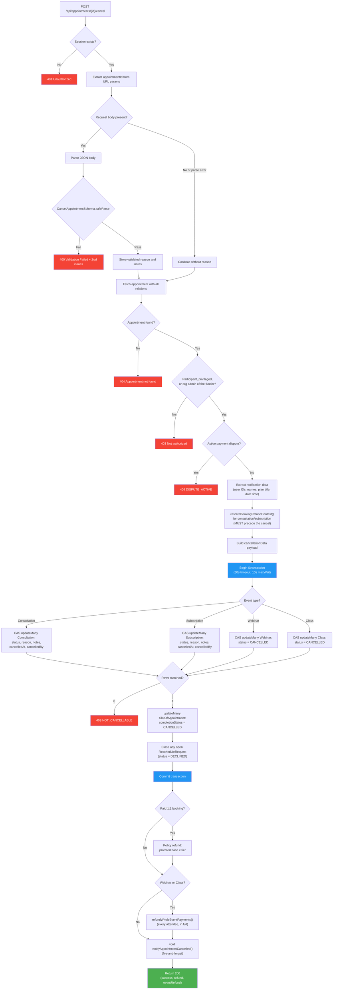

---

## Who Can Cancel

Cancellation is authorized at the API layer, not merely hidden in the UI. Here is what the route checks:

| Check                                    | Performed? | Details                                                                                     |
| ---------------------------------------- | ---------- | ------------------------------------------------------------------------------------------- |
| Is the user authenticated?               | Yes        | `getSession()` must return a valid session, or the route answers 401                        |
| Is the user a participant?               | Yes        | The consultant on the plan or the consultee who requested it, or the route answers 403      |
| Is the user privileged?                  | Yes        | `isPrivileged(session.user.role)` bypasses the participant check for admin and staff        |
| Is the user an admin of the funding org? | Yes        | `isOrgAdminOfAppointment()` admits an admin of the organization funding the booking (#1166) |
| Who may cancel a group event?            | Organiser  | Only the consultant who owns the webinar or class plan; attendees cannot cancel the event   |
| Is the booking in a cancellable state?   | Yes        | The allowed-from set rides the `UPDATE`'s `WHERE`, so a lost race answers 409               |
| Is a payment dispute open?               | Yes        | An open dispute answers 409, because a refund now could pay the customer twice              |

**What this means in practice**: the two parties to a booking, a platform admin, or an admin of the organization that funds the booking can cancel it. A group event can only be cancelled by its organiser, since cancelling it ends the session for everyone enrolled.

**Where the org admin sits in the refund maths**: an org admin acts on the **payer** side, not the consultant side. That distinction is load-bearing, because a consultant-initiated cancellation settles at the policy's consultant-initiated percentage — one hundred per cent under the platform defaults — while a payer-initiated one falls to whatever tier the remaining notice earns. The route therefore computes `isConsultantInitiated` from the consultant's own user ID or from a privileged actor who is not the consultee, and an org admin matches neither.

**Why the state check lives in the `WHERE` clause**: a cancellation racing the capture webhook, or a double-submitted cancel button, must resolve to exactly one winner. Re-reading the status in application code and then writing leaves a window between the two; putting the allowed-from set into the update's `WHERE` closes it, because the loser matches zero rows and is told the booking can no longer be cancelled. This is the same compare-and-set doctrine the rest of the booking lifecycle uses.

**Implications for developers**:

- Never assume the cancelling user is the consultee. Compare `session.user.id` against the consultant's user ID if you need to branch on role; the refund tier does exactly this, because a consultant-initiated cancellation refunds in full.
- The `cancelledBy` field on the event record stores the raw user ID, and the notification system compares it against the consultant's user ID to label the canceller.

---

## Request and Response Contract

### Request Body (Optional)

The request body is entirely optional. If omitted, empty, or unparseable as JSON, the cancellation proceeds without a reason. This design means a simple `POST` with no body is a valid cancellation request.

**Schema**: `CancelAppointmentSchema` (defined in `schemas/appointments.ts`)

```typescript
// schemas/appointments.ts
export const CancelAppointmentSchema = z.object({
  reason: CancellationReasonEnum.optional(),
  notes: z.string().optional(),
});
```

| Field    | Type                        | Required | Description                                 |
| -------- | --------------------------- | -------- | ------------------------------------------- |
| `reason` | `CancellationReason` (enum) | No       | Categorized reason for cancellation         |
| `notes`  | `string`                    | No       | Free-text notes explaining the cancellation |

### CancellationReason Enum

The enum values are organized by who initiates the cancellation. This categorization is used in analytics and notification templates.

Defined in `schemas/enums.ts`:

| Category             | Value                    | Typical Use Case                                 |
| -------------------- | ------------------------ | ------------------------------------------------ |
| User-initiated       | `SCHEDULE_CONFLICT`      | The consultee has a conflicting commitment       |
| User-initiated       | `FOUND_ALTERNATIVE`      | The consultee found another consultant           |
| User-initiated       | `FINANCIAL_REASONS`      | The consultee can no longer afford the session   |
| User-initiated       | `PERSONAL_EMERGENCY`     | Unforeseen personal circumstances                |
| User-initiated       | `NO_LONGER_NEEDED`       | The consultee's problem was resolved             |
| Consultant-initiated | `CONSULTANT_UNAVAILABLE` | The consultant cannot make the scheduled time    |
| Consultant-initiated | `CONSULTANT_EMERGENCY`   | The consultant has an emergency                  |
| System-initiated     | `PAYMENT_FAILED`         | An automated cancellation due to payment failure |
| System-initiated     | `EXPIRED`                | An automated cancellation due to expiration      |
| Other                | `OTHER`                  | None of the above; use `notes` for details       |

### Body Parsing Logic

The body parsing has a subtle but important behavior. Here is how it works line by line:

```
1. Read request body as text
2. If text is empty  --> continue without reason (no error)
3. If text is present --> try JSON.parse
4.   If JSON parse fails --> continue without reason (caught by outer try/catch)
5.   If JSON parse succeeds --> run CancelAppointmentSchema.safeParse
6.     If Zod validation fails --> return 400 with Zod issues
7.     If Zod validation passes --> use validated data
```

The key insight: **only a valid JSON body that fails Zod validation returns an error**. An empty body, a non-JSON body, or a body that fails JSON.parse will all silently proceed without a reason. This is intentional -- it makes the endpoint maximally forgiving for clients that do not need to provide a reason.

### Success Response (200)

```json
{
  "success": true,
  "cancellationReason": "SCHEDULE_CONFLICT",
  "cancelledAt": "2025-06-15T10:30:00.000Z",
  "webinarId": null,
  "classId": null,
  "refund": {
    "amountRefundedPaise": 250000,
    "refundPct": 50,
    "status": "REFUNDED"
  },
  "eventRefund": null
}
```

| Field                | Type                  | Description                                                                     |
| -------------------- | --------------------- | ------------------------------------------------------------------------------- |
| `success`            | `boolean`             | Always `true` on 200                                                            |
| `cancellationReason` | `string \| undefined` | The reason if one was provided                                                  |
| `cancelledAt`        | `string` (ISO 8601)   | Timestamp of when the cancellation was processed                                |
| `webinarId`          | `string \| null`      | The webinar ID if this was a webinar cancellation                               |
| `classId`            | `string \| null`      | The class ID if this was a class cancellation                                   |
| `refund`             | `object \| null`      | The 1:1 policy refund outcome; `null` when the booking carried no payment       |
| `eventRefund`        | `object \| null`      | The whole-event fan-out summary; `null` outside class and webinar cancellations |

The `webinarId` and `classId` fields are populated only for webinar and class cancellations. They are included in the client response so the frontend can trigger any UI updates related to the specific event.

The `refund` object never reports the money as a bare number, because `amountRefundedPaise: 0` on its own is ambiguous — it reads identically whether the policy owed nothing, the balance was already exhausted, or the gateway refused. The `status` field disambiguates all of those.

| `refund.status`      | Meaning                                                                          |
| -------------------- | -------------------------------------------------------------------------------- |
| `REFUNDED`           | Money (or credit) was returned; `amountRefundedPaise` is what actually moved     |
| `POLICY_ZERO`        | The tier for this much notice is genuinely zero, so nothing was owed             |
| `NOTHING_REFUNDABLE` | The tier was positive but the payment's refundable balance was already exhausted |
| `FAILED`             | A refund was owed and the attempt threw; the cancellation still stands           |

A credit-funded booking reports `REFUNDED` with an `amountRefundedPaise` of zero, because the restoration returns referral credit rather than gateway money. The client reads that pair as "your referral credit has been restored in full" rather than as a refund of nothing. There is no longer a `MANUAL_REVIEW` status: #1500 settled the product question that used to produce it, and the section on the credit rule below explains what replaced it.

### Error Responses

| Status | Cause                                     | Response Body                                                      | When It Happens                                                            |
| ------ | ----------------------------------------- | ------------------------------------------------------------------ | -------------------------------------------------------------------------- |
| 401    | No session / expired session              | `{ "error": "Unauthorized" }`                                      | `getSession()` returns null or no user                                     |
| 400    | Zod validation fails on a valid JSON body | `{ "error": "Validation failed", "details": [<ZodIssue[]>] }`      | Body is valid JSON but fails schema validation                             |
| 403    | Caller is not entitled to cancel          | `{ "error": "You are not authorized to cancel this appointment" }` | Not a participant, not privileged, not an org admin of the funder          |
| 404    | Appointment not found in database         | `{ "error": "Appointment not found" }`                             | ID does not match any appointment row                                      |
| 409    | Open payment dispute                      | `{ "error": "...", "code": "DISPUTE_ACTIVE" }`                     | A dispute is live on this appointment (#1008)                              |
| 409    | Booking is no longer cancellable          | `{ "error": "...", "code": "NOT_CANCELLABLE" }`                    | The CAS update matched zero rows — already cancelled, completed or expired |
| 500    | Transaction failure or unexpected error   | `{ "error": "Failed to cancel appointment" }`                      | Database error, connection timeout, or other                               |

The two 409s are told apart by their `code`, not their message, and both are terminal for that request rather than retryable. `DISPUTE_ACTIVE` is checked before the transaction opens, because refunding while a chargeback is contested would pay the customer twice. Nothing is written on either path, so a refused cancellation leaves the booking exactly as it was.

---

## The Pre-Transaction Pattern

This is the single most important architectural pattern in the cancellation flow. If you understand this, you understand why the code is structured the way it is.

### The Problem

The cancellation endpoint needs to do three things that are in tension with each other:

1. **Fetch the appointment with deep relations** (consultation -> plan -> consultant profile -> user, and similarly for consultee). This is a heavy join across 5-6 tables.
2. **Terminalise the booking and its slots atomically** within a database transaction.
3. **Send notifications and settle the refund** with data gathered before the transaction ran.

The naive approach would be to do all of this inside a single transaction:

```
BEGIN TRANSACTION
  1. Fetch appointment with all relations  <-- Heavy join
  2. Update event status
  3. Mark slots CANCELLED
  4. Close open reschedule proposals
  5. Call the payment gateway to refund   <-- Network I/O inside a transaction
COMMIT
```

This approach fails in production because Prisma's interactive transactions have a default 5-second timeout. Even with the timeout increased to 30 seconds, putting a heavy multi-table join inside a transaction alongside write operations risks hitting the timeout under database contention. The transaction holds locks for the entire duration, increasing the chance of deadlocks with concurrent operations.

### The Solution: Three-Phase Architecture

The cancellation endpoint splits the work into three distinct phases:

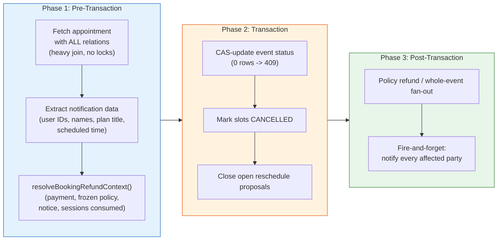

**Phase 1 (Pre-Transaction)**: Run the heavy query with all nested includes _outside_ the transaction. This query does not hold any locks. Extract all the data needed for notifications into local variables, and — for a consultation or subscription — resolve the refund context here too.

That second read is not merely an optimization; it is a correctness requirement, and the reason deserves stating plainly. "Which session is still owed" is derived from the slots that are `SCHEDULED` or `RESCHEDULED`, and Phase 2 stamps every one of them `CANCELLED`. Resolved afterwards, the booking would always look as though it had no live session left, every consultee-initiated cancellation would fall to the zero-per-cent tier, and the refund would be silently skipped. The resolver reads no transaction state, so hoisting it above the transaction costs nothing.

**Phase 2 (Transaction)**: The transaction contains only fast write operations — a compare-and-set `updateMany` on the event row, an `updateMany` marking the slots `CANCELLED`, and an `updateMany` closing any open reschedule proposal, all on indexed columns. No joins, no nested includes, and no network calls. This keeps the transaction fast and reduces lock contention.

**Phase 3 (Post-Transaction)**: The refund and the notifications happen after the transaction has committed, using the data gathered in Phase 1. The refund runs its own Serializable transaction, and the compare-and-set in Phase 2 is what guarantees this block runs at most once per appointment: a second cancel answers 409 before it ever gets here. Notifications are fault-tolerant and use `void` (fire-and-forget).

### What Would Happen Without This Pattern

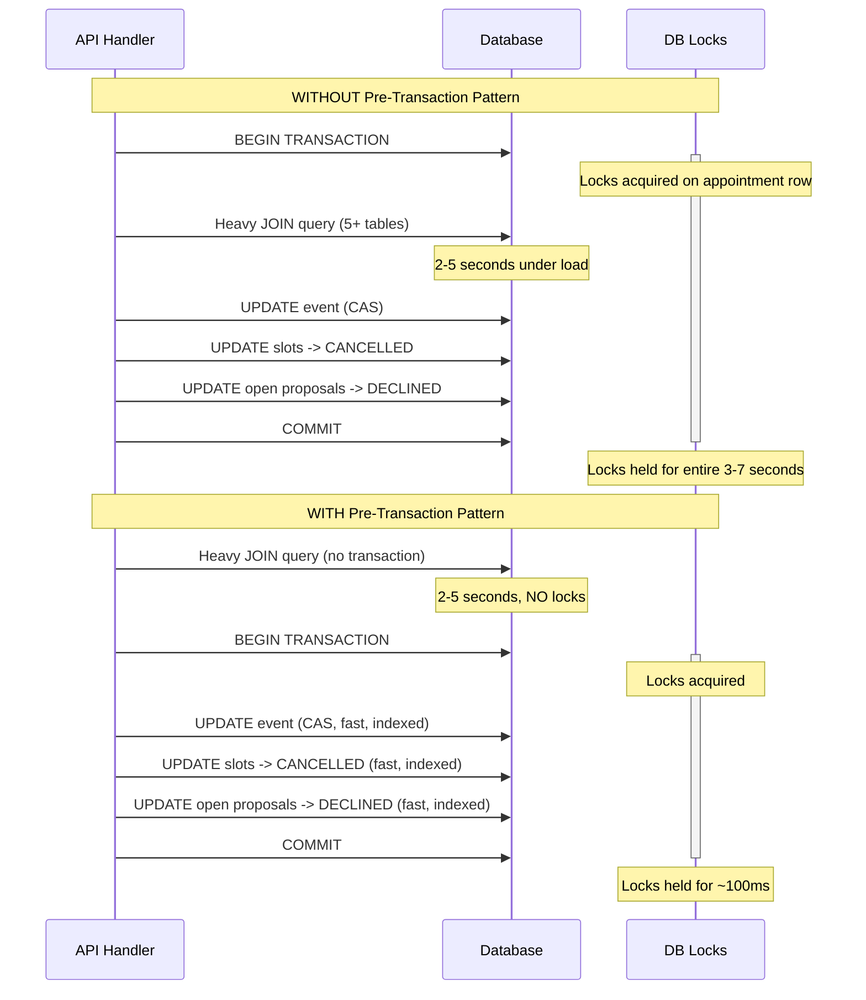

The difference is dramatic: locks are held for 3-7 seconds in the naive approach versus roughly 100 milliseconds with the pre-transaction pattern. Under concurrent load, this is the difference between a responsive system and cascading timeouts.

---

## Step-by-Step Walkthrough: A Concrete Example

Let us trace through a complete cancellation to see exactly what happens at each step. Consider this scenario:

> **Alice** (consultee) cancels her 2-hour consultation with **Bob** (consultant), which was scheduled for next Tuesday at 10:00 AM IST. The consultation uses Bob's "Career Strategy Session" plan. Alice cancels because of a schedule conflict.

### Database State Before Cancellation

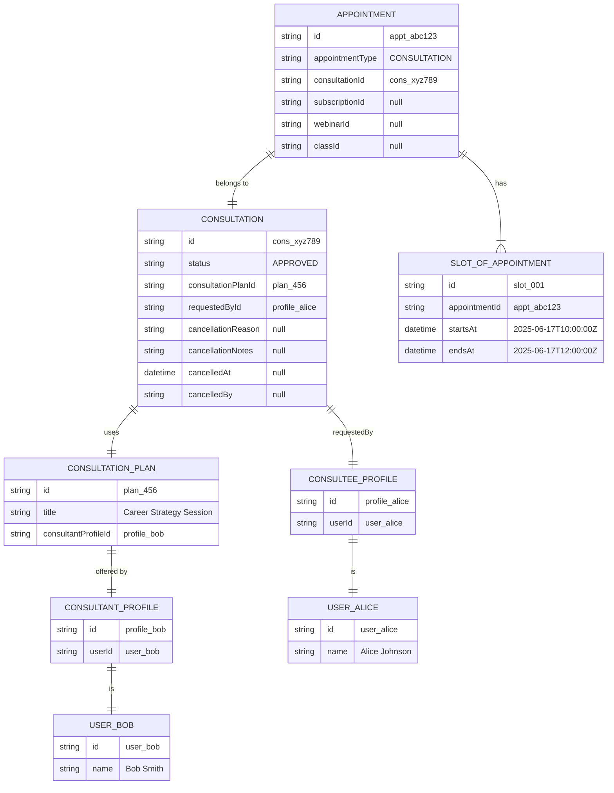

### Step 1: Authentication

Alice's browser sends:

```http
POST /api/appointments/appt_abc123/cancel
Content-Type: application/json
Cookie: session=...

{"reason": "SCHEDULE_CONFLICT", "notes": "Have a work meeting that day"}
```

The server calls `getSession()`, which validates Alice's session cookie and returns:

```json
{ "user": { "id": "user_alice", "name": "Alice Johnson" } }
```

Session is valid. Proceed.

### Step 2: Body Parsing and Validation

1. `request.text()` returns `'{"reason": "SCHEDULE_CONFLICT", "notes": "Have a work meeting that day"}'`
2. `JSON.parse()` succeeds, producing a plain object.
3. `CancelAppointmentSchema.safeParse()` validates:
   - `reason`: `"SCHEDULE_CONFLICT"` -- valid enum value
   - `notes`: `"Have a work meeting that day"` -- valid string
4. `validatedData` is set to `{ reason: "SCHEDULE_CONFLICT", notes: "Have a work meeting that day" }`

### Step 3: Pre-Transaction Fetch

The heavy query runs outside any transaction:

```sql
-- Conceptual SQL (Prisma generates this)
SELECT appointment.*,
       consultation.*,
       consultation_plan.*,
       consultant_profile.*,
       consultant_user.id, consultant_user.name,
       consultee_profile.*,
       consultee_user.id, consultee_user.name,
       slots.*
FROM "Appointment" appointment
LEFT JOIN "Consultation" consultation ON ...
LEFT JOIN "ConsultationPlan" consultation_plan ON ...
LEFT JOIN "ConsultantProfile" consultant_profile ON ...
LEFT JOIN "User" consultant_user ON ...
LEFT JOIN "ConsulteeProfile" consultee_profile ON ...
LEFT JOIN "User" consultee_user ON ...
LEFT JOIN "SlotOfAppointment" slots ON ... LIMIT 1
WHERE appointment.id = 'appt_abc123'
```

This query joins across 7 tables. It returns the full appointment tree.

### Step 4: Pre-Transaction Data Extraction

Before the transaction opens, we extract everything the later phases need for notifications:

| Variable           | Extracted Value              | Source Path                                                             |
| ------------------ | ---------------------------- | ----------------------------------------------------------------------- |
| `consultantUserId` | `"user_bob"`                 | `appointment.consultation.consultationPlan.consultantProfile.user.id`   |
| `consulteeUserId`  | `"user_alice"`               | `appointment.consultation.requestedBy.user.id`                          |
| `consultantName`   | `"Bob Smith"`                | `appointment.consultation.consultationPlan.consultantProfile.user.name` |
| `consulteeName`    | `"Alice Johnson"`            | `appointment.consultation.requestedBy.user.name`                        |
| `planTitle`        | `"Career Strategy Session"`  | `appointment.consultation.consultationPlan.title`                       |
| `appointmentType`  | `"CONSULTATION"`             | `appointment.appointmentType`                                           |
| `dateTime`         | `"2025-06-17T10:00:00.000Z"` | `appointment.slotsOfAppointment[0].startsAt`                            |

**Why this matters**: the records survive the cancellation, so these values could in principle be re-read afterwards — but doing so would mean a second heavy join for data we already hold. The genuinely order-dependent read is the refund context that follows, which must run now because the transaction is about to terminalise the very slots it measures.

Alice's consultation is a 1:1 booking, so the route also calls `resolveBookingRefundContext()` here. For her booking it answers: the single `SUCCEEDED` payment funding it, the cancellation policy frozen onto the row she paid for, that the next undelivered session starts in about 48 hours, that no session has been delivered yet, that one session remains, and that the booking holds one slot in total.

### Step 5: Build Cancellation Payload

```typescript
const cancellationData = {
  status: "CANCELLED",
  cancellationReason: "SCHEDULE_CONFLICT", // from validatedData
  cancellationNotes: "Have a work meeting that day", // from validatedData
  cancelledAt: new Date(), // 2025-06-15T10:30:00.000Z
  cancelledBy: "user_alice", // from session
};
```

### Step 6: Transaction

Three operations execute atomically within a 30-second timeout. None of them deletes anything.

**Operation 1** -- Compare-and-set the consultation record:

```sql
UPDATE "Consultation"
SET "status" = 'CANCELLED',
    "cancellationReason" = 'SCHEDULE_CONFLICT',
    "cancellationNotes" = 'Have a work meeting that day',
    "cancelledAt" = '2025-06-15T10:30:00.000Z',
    "cancelledBy" = 'user_alice'
WHERE id = 'cons_xyz789'
  AND "status" IN (<CANCELLABLE_FROM>)
```

The second predicate is the whole state machine. `CANCELLABLE_FROM` (`lib/booking/transitions.ts`) deliberately excludes `COMPLETED`, `CANCELLED`, `REJECTED` and `EXPIRED`, so a double-submitted cancel or a cancel racing the capture webhook matches **zero rows**. The route checks the matched count and throws `NOT_CANCELLABLE` (409) when it is zero, which is what makes the refund in Phase 3 run at most once.

**Operation 2** -- Soft-cancel every live slot:

```sql
UPDATE "SlotOfAppointment"
SET "completionStatus" = 'CANCELLED'
WHERE "appointmentId" = 'appt_abc123'
  AND "completionStatus" IN ('SCHEDULED', 'RESCHEDULED')
```

`RESCHEDULED` is in that set on purpose. A slot released by a pending reschedule is not `SCHEDULED`, so filtering on `SCHEDULED` alone would strand those rows in a non-terminal state on a booking that no longer exists — and reschedule proposals hang off exactly those rows. For a subscription or a class the filter widens from one appointment to the whole booking (`subscriptionId` or `classId`), because those bookings span many appointments.

**Operation 3** -- Close any live reschedule proposal:

```sql
UPDATE "RescheduleRequest"
SET "status" = 'DECLINED',
    "openForAppointmentId" = NULL,
    "resolvedAt" = now()
WHERE "appointmentId" = 'appt_abc123'
  AND "status" IN (<RESCHEDULE_OPEN_STATUSES>)
```

Leaving a proposal open would keep `openForAppointmentId` reserved forever and let the expiry cron act on a booking that has already been cancelled.

If any of these three operations fails, the entire transaction rolls back. The consultation stays `APPROVED`, the slots stay `SCHEDULED`, and any open proposal stays open.

### Step 7: The Policy Refund

The transaction has committed, so the money can move. Alice paid ₹5,000 (500000 paise) by card, her booking carries the platform default snapshot, and she is cancelling roughly 48 hours before the session.

`computeRefundPct()` is asked for the tier. Alice is not the consultant and is not a privileged actor, so `isConsultantInitiated` is false and the tiers apply: 48 hours clears the `hoursBefore: 24` threshold, which yields **100**.

The refundable base comes next, and this is the part that changed with #1006. Her booking is a consultation, not a subscription, so no proration applies and the base is the full captured amount:

```
proratedBasePaise = 500000            (consultation -> gross, unprorated)
refundAmount      = min(floor(500000 x 100 / 100), refundablePaise)
                  = min(500000, 500000)
                  = 500000
```

`refundBookingPayment()` then returns the money through the single front door, which picks the correct rail for the payment's intent. The result is recorded as `{ amountRefundedPaise: 500000, refundPct: 100, status: "REFUNDED" }`.

Had this been a four-session subscription with one session already delivered, the base would have been prorated first — `floor(500000 x 3 / 4) = 375000` — and the tier applied to that. The next section works that case through in full.

### Step 8: Fire-and-Forget Notification

After the refund settles, the notification fires using the data extracted in Step 4:

```typescript
void notifyAppointmentCancelled(
  ["user_bob", "user_alice"], // Both parties receive notification
  {
    appointmentType: "CONSULTATION",
    consultantName: "Bob Smith",
    consulteeName: "Alice Johnson",
    planTitle: "Career Strategy Session",
    dateTime: "2025-06-17T10:00:00.000Z",
    dashboardUrl: notificationHref(null, "appointments"),
    reason: "SCHEDULE_CONFLICT",
    cancelledBy: "consultee", // Because user_alice !== user_bob (consultant)
  },
);
```

The `void` keyword is critical here. It means "call this function but do not await it." The API response is sent to Alice immediately without waiting for Novu to deliver the notification. If Novu is down or slow, Alice still gets her 200 OK.

The `cancelledBy` label is three-way rather than two-way. Comparing only against the consultant would have meant that any platform or organization actor was reported to both parties as "the consultee", so an admin cancellation read as though Alice had walked away. A group event has no consultee at all, which is the other reason the third value exists: `system` is what the payload carries when the canceller is neither party.

### Step 9: Response

Alice receives:

```json
{
  "success": true,
  "cancellationReason": "SCHEDULE_CONFLICT",
  "cancelledAt": "2025-06-15T10:30:00.000Z",
  "webinarId": null,
  "classId": null,
  "refund": {
    "amountRefundedPaise": 500000,
    "refundPct": 100,
    "status": "REFUNDED"
  },
  "eventRefund": null
}
```

### Database State After Cancellation

Every row that existed before the cancellation still exists after it. Compare this against the "before" diagram: the shape is identical, and only column values have moved.

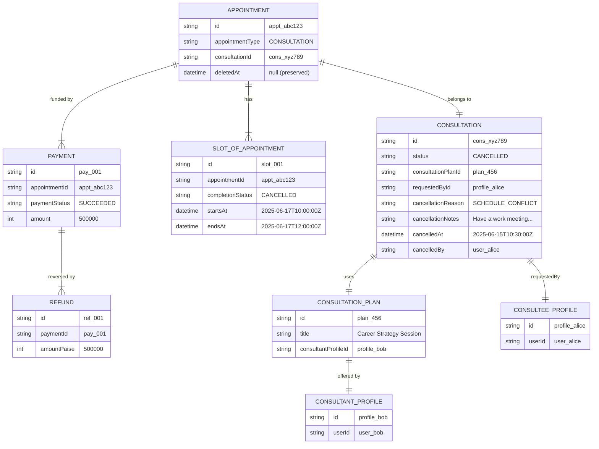

Notice what changes:

- The `Consultation` record -- `status` moves to `CANCELLED` and the four audit columns are filled in
- The `SlotOfAppointment` records -- `completionStatus` moves to `CANCELLED`, which releases the time without erasing that it was held

Notice what remains:

- The `Appointment` record -- **preserved**, so the payment and its refund keep a row to hang off
- The `ConsultationPlan`, profiles, and users -- **untouched**
- The `Payment` record -- preserved, now with a `Refund` row and a balanced ledger reversal beside it

**Why the appointment is never deleted**: `Payment.appointment` is declared `onDelete: Cascade`, so deleting the appointment would take the payment, its refunds and its dispute history down with it. That is not hypothetical — a trial cancellation once hard-deleted the appointment and destroyed the `Payment` row with it (#1074). The slot is freed by status alone, which is all that "freeing" ever required.

---

## Cancellation by Event Type

The system supports four event types, and they do not all behave the same way during cancellation. The differences are significant and worth understanding.

### Branching Logic Flowchart

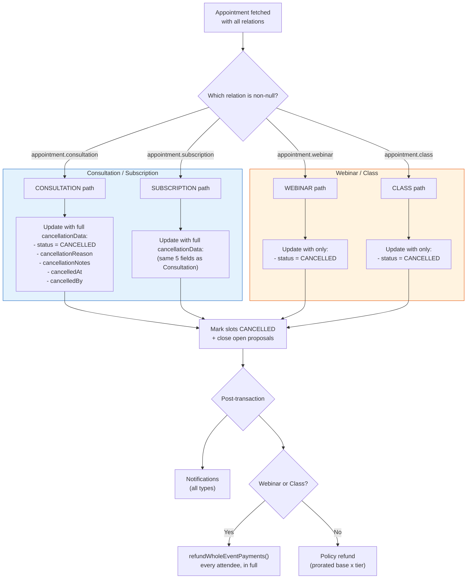

### Comparison Table: All Four Event Types

| Aspect                           | Consultation             | Subscription                     | Webinar                      | Class                        |
| -------------------------------- | ------------------------ | -------------------------------- | ---------------------------- | ---------------------------- |
| **Model updated**                | `Consultation`           | `Subscription`                   | `Webinar`                    | `Class`                      |
| **Status field**                 | `status`                 | `status`                         | `status`                     | `status`                     |
| **Audit fields stored**          | Yes (5 fields)           | Yes (5 fields)                   | No                           | No                           |
| **Cancellation reason on model** | Yes                      | Yes                              | No                           | No                           |
| **Cancelled-by tracking**        | Yes                      | Yes                              | No                           | No                           |
| **Notification sent**            | Yes                      | Yes                              | Yes                          | Yes                          |
| **Slots deleted**                | No — marked `CANCELLED`  | No — marked `CANCELLED`          | No — marked `CANCELLED`      | No — marked `CANCELLED`      |
| **Appointment deleted**          | No — preserved           | No — preserved                   | No — preserved               | No — preserved               |
| **Slot scope of the update**     | This appointment         | Whole `subscriptionId`           | This appointment             | Whole `classId`              |
| **Refund rail**                  | Policy tier on the gross | Policy tier on the prorated base | Whole-event fan-out, in full | Whole-event fan-out, in full |

### Consultation Cancellation (Detailed)

Consultations are one-to-one sessions between a consultant and a consultee. They have the richest cancellation data because they involve a direct relationship between two parties where accountability matters.

**What gets written to the database**:

```typescript
const moved = (
  await tx.consultation.updateMany({
    where: {
      id: appointment.consultation.id,
      status: { in: [...CANCELLABLE_FROM] }, // the state machine, in the WHERE
    },
    data: {
      status: "CANCELLED",
      cancellationReason: validatedData.reason || null, // e.g. "SCHEDULE_CONFLICT"
      cancellationNotes: validatedData.notes || null, // e.g. "Have a work meeting"
      cancelledAt: new Date(), // Precise timestamp
      cancelledBy: session.user.id, // Who initiated
    },
  })
).count;
```

**Why `updateMany` rather than `update`**: `update` targets a row by primary key and would happily cancel a booking that had already been completed or cancelled. `updateMany` lets the allowed-from set ride the `WHERE`, so an illegal transition matches zero rows instead of corrupting state. The route reads `count` and answers 409 when it is zero. Application-level pre-checks are only friendly error text; the `WHERE` clause is the actual guard.

**Why audit fields exist**: Consultations often involve payment disputes. When a consultee asks for a refund, the admin needs to know who cancelled, when they cancelled, and why. This audit trail is essential for the refund decision process.

### Subscription Cancellation (Detailed)

Subscriptions are recurring consultation sessions (e.g., "4 sessions per month with Bob"). They behave identically to consultations for cancellation purposes.

**What gets written to the database**: Exactly the same five fields as a consultation. The `Subscription` model has the same audit columns.

**Design note**: The fact that consultation and subscription cancellations are identical in structure is intentional. Both represent a committed agreement between two parties, so both require the same level of accountability and audit trail.

### Webinar Cancellation (Detailed)

Webinars are one-to-many events (one consultant, many attendees). Their cancellation is simpler because the business model is different.

**What gets written to the database**:

```typescript
const moved = (
  await tx.webinar.updateMany({
    where: {
      id: appointment.webinar.id,
      status: { in: EVENT_ALLOWED_FROM.CANCELLED },
    },
    data: { status: "CANCELLED" },
  })
).count;
```

The group-event allowed-from sets are written as explicit `in` lists rather than as `notIn` exclusions, so that a future addition to the status enum is refused by default instead of silently becoming cancellable (#837). Classes use `CLASS_EVENT_ALLOWED_FROM.CANCELLED`, which is the same idea against a different enum.

**Why no audit fields**: Webinars are typically cancelled by the consultant (the host). Since webinars are group events, the system does not track individual cancellation reasons on the event model. The `status` change is sufficient for the event lifecycle. If audit data is needed, it can be reconstructed from the API logs and the `cancelledBy` information in the notification payload.

### Class Cancellation (Detailed)

Classes are multi-session group events (e.g., "6-week Python bootcamp"). They behave identically to webinars for cancellation purposes.

**What gets written to the database**: Only `status: "CANCELLED"`, same as webinar.

### State Transition Diagram

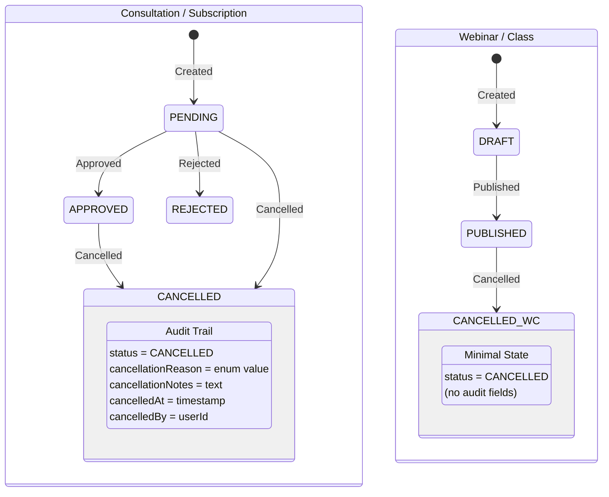

---

## What Happens to Each Record

This section provides a comprehensive before-and-after view of every database record affected by a cancellation.

### Data Cascade Diagram

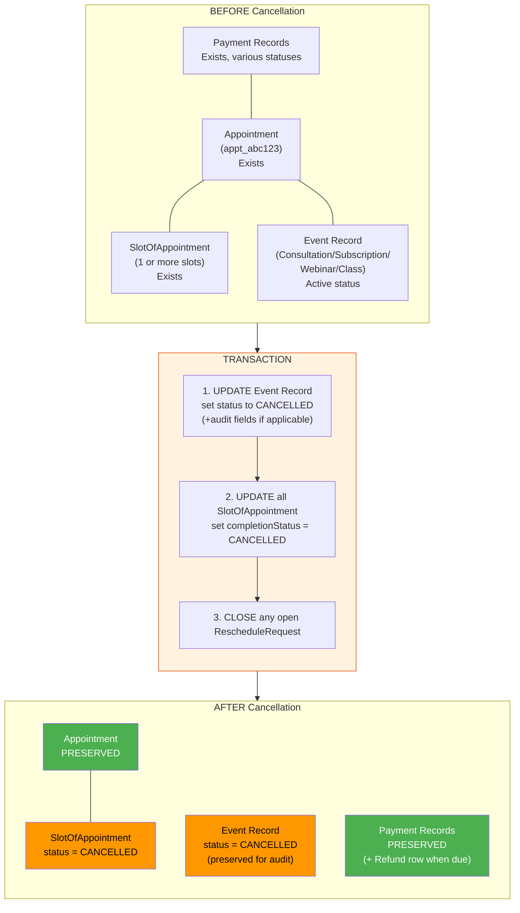

Green marks a row that comes through untouched, amber a row whose status column moved. Nothing in the diagram is red, because nothing is removed.

### Record-by-Record Breakdown

| Record                         | Before                                             | After                                                 | Why                                                                                            |
| ------------------------------ | -------------------------------------------------- | ----------------------------------------------------- | ---------------------------------------------------------------------------------------------- |
| `Appointment`                  | Exists with type and foreign keys                  | **Preserved**, untouched                              | `Payment.appointment` cascades on delete, so removing it would destroy the money trail (#1074) |
| `SlotOfAppointment` (live)     | `completionStatus` is `SCHEDULED` or `RESCHEDULED` | `completionStatus = "CANCELLED"`                      | The time is released by status; the record of it having been held survives                     |
| `SlotOfAppointment` (terminal) | Already `COMPLETED`/`CANCELLED`/`UNVERIFIED`       | Untouched                                             | A delivered session is history, and the proration denominator counts it                        |
| `RescheduleRequest` (open)     | `PENDING_REVIEW` or similar                        | `status = "DECLINED"`, `openForAppointmentId` cleared | An open proposal would reserve the appointment forever and feed the expiry cron                |
| `Consultation` (if applicable) | `status = "APPROVED"`                              | `status = "CANCELLED"` + audit fields                 | Preserved for refund decisions and analytics                                                   |
| `Subscription` (if applicable) | `status = "APPROVED"`                              | `status = "CANCELLED"` + audit fields                 | Same reasoning as consultation                                                                 |
| `Webinar` (if applicable)      | `status = "PUBLISHED"`                             | `status = "CANCELLED"`                                | Preserved but with minimal state change                                                        |
| `Class` (if applicable)        | `status = "PUBLISHED"`                             | `status = "CANCELLED"`                                | Same reasoning as webinar                                                                      |
| `Payment` / `PaymentOrder`     | Various statuses                                   | Preserved; a `Refund` row is added when due           | The policy frozen at checkout decides the amount, not an admin                                 |
| `Earning` / `PayoutItem`       | May exist if payment was captured                  | Refunded share incremented by the cascade             | Earnings reversal rides the same transaction as the refund                                     |

### Why Nothing is Deleted

A common question from new developers: "the booking is over, so why keep any of it?"

The event record (consultation, subscription, webinar, or class) is intentionally preserved for several reasons:

1. **Refund processing**: An operator reviewing a refund needs to see the cancelled event, when it was cancelled, by whom, and why. If the record were deleted, this information would be lost.
2. **Analytics**: Business intelligence queries count cancellation rates, reasons, and patterns. Deleted records cannot be counted.
3. **Dispute resolution**: If a consultee disputes a charge, the cancelled event record is evidence of what happened.
4. **Consultant dashboards**: Consultants may want to see their cancellation history.

The appointment record is preserved for a harder reason than any of those, and it is worth being blunt about it. `Payment` declares `onDelete: Cascade` against `Appointment`, so deleting an appointment silently takes its payments, refunds and disputes with it. A trial cancellation once did exactly that and destroyed a real `Payment` row (#1074). An appointment is therefore never a candidate for deletion, whatever its status: the slot is freed by `completionStatus` alone, and reads of live availability filter dead rows rather than expecting them to be gone.

The same reasoning extends to the slots. `MeetingSession` and `Recording` rows from Stream hang off slots, so deleting a slot would orphan or cascade into the session artefacts that prove a session took place. This is why reschedule flips replaced slots to `RESCHEDULED` and re-confirms them in place rather than deleting and re-creating them.

---

## The Transaction: Atomic Database Operations

### Transaction Configuration

```typescript
const result = await prisma.$transaction(
  async (tx) => {
    /* ... */
  },
  {
    maxWait: 10000, // 10 seconds: max time waiting for a DB connection from the pool
    timeout: 30000, // 30 seconds: max duration of the transaction itself
  },
);
```

| Parameter | Value     | Default  | Why It Is Changed                                                                                                                       |
| --------- | --------- | -------- | --------------------------------------------------------------------------------------------------------------------------------------- |
| `maxWait` | 10,000 ms | 2,000 ms | Under high load, the connection pool can be saturated. 10 seconds gives more time to acquire a connection before failing.               |
| `timeout` | 30,000 ms | 5,000 ms | Although the transaction only runs fast indexed writes, the increased timeout provides safety margin under extreme database contention. |

### Operation Order Within the Transaction

The three operations inside the transaction execute in a specific order that matters:

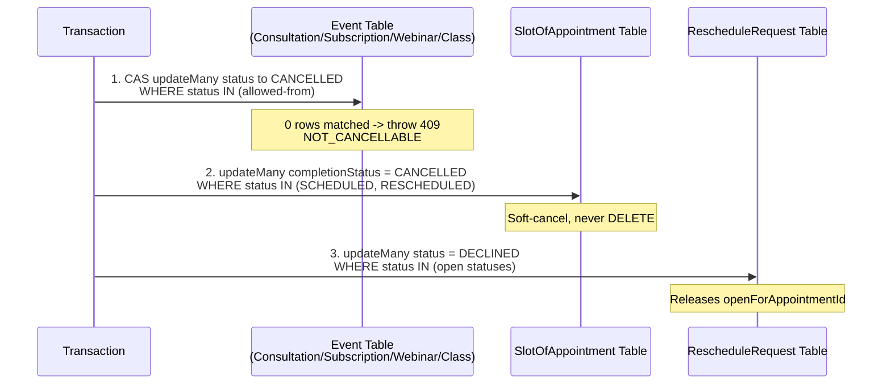

**Why the event row moves first**: it is the compare-and-set gate for everything after it. If the booking is already cancelled or completed, the `updateMany` matches zero rows and the route throws before a single slot has been touched — so a losing racer never half-applies a cancellation. Doing the slots first would mean a rejected cancel had already terminalised the calendar.

**Why the slots move before the proposals**: both are consequences of the event row, but a reschedule proposal points at slots, so closing the proposals last leaves no window in which a proposal references rows whose status is mid-flight inside the same transaction.

**Why the appointment is not in this list at all**: it is never written. See [Why Nothing is Deleted](#why-nothing-is-deleted).

### Atomicity Guarantee

If any of the three operations fails:

- The event record reverts to its previous status
- The slots revert to `SCHEDULED` or `RESCHEDULED`
- Any open reschedule proposal is still open

The user receives a 500 error, and the system state is as if the cancellation never happened. Crucially, no refund has been attempted at this point either: the refund deliberately runs after the commit, so a rolled-back transaction can never leave money returned against a booking that is still live.

---

## Post-Cancellation Cascade

After the transaction commits successfully, three post-transaction effects fire: the refund, the notification fan-out, and the activity log. None of them can cause the cancellation to "fail" from the user's perspective, because the transaction has already committed — a refund that throws is reported and recorded, not rolled back into the booking.

### Notification Delivery

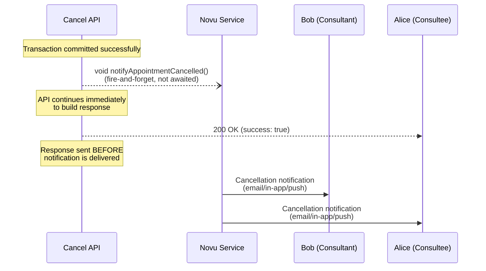

**Mechanism**: Novu (`lib/novu.ts` -> `notifyAppointmentCancelled`)

**Who receives notifications**: Both the consultant and the consultee. The user IDs are collected into an array and filtered to remove any `undefined` values (which can happen if relations are broken or missing):

```typescript
const userIds = [
  notificationMeta.consultantUserId,
  notificationMeta.consulteeUserId,
].filter((id): id is string => !!id);
```

For webinars and classes the organiser is read off the plan and every paid attendee is gathered after the refund fan-out, so the `userIds` array carries the organiser plus the attendees. It was empty for group events before #1003, which is why cancelling a class used to tell nobody at all.

**Notification payload**:

| Field             | Value                                                         | Source                                                                                                                                             |
| ----------------- | ------------------------------------------------------------- | -------------------------------------------------------------------------------------------------------------------------------------------------- |
| `appointmentType` | `"CONSULTATION"`, `"SUBSCRIPTION"`, `"WEBINAR"`, or `"CLASS"` | `appointment.appointmentType`                                                                                                                      |
| `consultantName`  | e.g., `"Bob Smith"` or `"Consultant"` (fallback)              | Extracted in Phase 1, with fallback                                                                                                                |
| `consulteeName`   | e.g., `"Alice Johnson"` or `"Consultee"` (fallback)           | Extracted in Phase 1, with fallback                                                                                                                |
| `planTitle`       | e.g., `"Career Strategy Session"` or `"N/A"` (fallback)       | From consultation/subscription plan                                                                                                                |
| `dateTime`        | ISO 8601 string or `undefined`                                | `slotsOfAppointment[0].startsAt`                                                                                                                   |
| `dashboardUrl`    | An org or personal appointments href                          | `notificationHref(appointment.organizationId, "appointments")` — both parties share one payload, so the href must suit either                      |
| `reason`          | e.g., `"SCHEDULE_CONFLICT"` or `undefined`                    | From validated body                                                                                                                                |
| `cancelledBy`     | `"consultant"`, `"consultee"`, or `"system"`                  | Three-way: the consultant's user ID, then the consultee's, then `system` for a platform or org actor and for group events, which have no consultee |

**Why fire-and-forget**: The notification is a courtesy, not a critical operation. If Novu is down for 5 minutes, the cancellation should still succeed. The user can always check their dashboard. Making the notification blocking would mean a Novu outage causes cancellation failures, which would be unacceptable.

### Refund and Earnings

**Refunds are automatic.** The judgement that used to be left to an admin is now encoded in the cancellation policy the booking was sold under, so an organisation or the platform editing its terms later never changes a buyer's deal retroactively. Since #1499 those terms are a typed, versioned row rather than a Json snapshot: the booking points at the exact `CancellationPolicy` version that governed the sale, and publishing an edit creates a new version instead of rewriting the one that bookings already cite.

When a paid consultation or subscription is cancelled, `resolveBookingRefundContext()` (`lib/booking/cancellation-scope.ts`) resolves the refund facts for the **whole booking** rather than for the single appointment the route was handed, because a subscription is one slot-less placeholder that carries the money plus one appointment per allocated session. It answers six questions: which payment funds the booking, which policy version governs the row the buyer paid for, how many hours remain until the earliest undelivered session, how many sessions have already been delivered, how many are still owed, and how many slots the booking holds in total regardless of status. The policy question is answered as terms rather than as a nullable row: a booking that points at no version is governed by the platform ladder, so `resolveBookingRefundContext` resolves that fallback once and no caller downstream has to remember it.

The last three exist because of the proration described below; of them the cancel route reads `sessionsRemaining` and `slotsTotal`, while `sessionsCompleted` is exposed for other callers and for diagnostics. `slotsTotal` is deliberately a count of slots of **any** status rather than of the completed and live ones summed. Summing those two would drop every terminal-but-not-completed session out of the plan and measure the undelivered share against a plan that had shrunk: a subscription with three `UNVERIFIED` past sessions and seven live ones would score seven-sevenths and refund the whole price for a plan that was already thirty per cent consumed.

A cancellation the consultant initiates always settles at the policy's consultant-initiated percentage — one hundred per cent under the platform defaults — because the buyer did nothing wrong. "Not the buyer's choice" is the real question that tier asks, so a platform admin cancelling on the buyer's behalf counts as consultant-initiated too; requiring the actor to literally _be_ the consultant once meant an admin cancelling in the final hours settled an unwilling buyer at zero per cent.

#### Where the tiers come from

The ladder is two tables. `CancellationPolicy` is one published version of a policy, and `CancellationPolicyTier` holds its rungs. A version carries the scope it belongs to, its version number, its status, and the percentage that a consultant-initiated cancellation always settles at; a rung carries the notice threshold and the refund percentage for it. Both percentages are stored as basis points, following the repo convention that money and splits are integers, and the API and the UI speak whole percent.

| Scope        | Which row                                                                                                                                                                                                        | Who may publish it                                                      |
| ------------ | ---------------------------------------------------------------------------------------------------------------------------------------------------------------------------------------------------------------- | ----------------------------------------------------------------------- |
| Platform     | The single row whose `organizationId` is null, at a fixed id. The seed creates it, and `ensurePlatformCancellationPolicy` creates it idempotently on first use so a database nobody seeded still quotes refunds. | Nobody through the product; it is changed in the seed and in code.      |
| Organisation | The organisation's newest `ACTIVE` version. An organisation that has never published has no row, and its bookings use the platform ladder.                                                                       | An OWNER, through `PUT /api/organizations/{orgId}/cancellation-policy`. |

The platform default remains one hundred per cent a day out, fifty per cent inside the day, and nothing inside two hours, with consultant-initiated cancellations always settling in full.

A published version is immutable. Editing an organisation's ladder does not update the row; it archives the current `ACTIVE` version and inserts a new one at the next version number, inside a Serializable transaction so two concurrent publishes cannot both claim the same number. That is what makes the guarantee in the paragraph above structural rather than conventional: `Appointment.cancellationPolicyId` points at the exact row that governed the sale, and nothing in the product can rewrite that row afterwards. There is deliberately no endpoint to edit or delete a version, and "stop using our own policy" means publishing the platform ladder as your own.

Checkout resolves the version once, inside the booking transaction, and stamps it on the appointment. An organisation's ladder governs the bookings that **organisation funds**, because on a refund it is the organisation's money that moves; a personal booking that merely carries an organisation tag keeps the platform ladder. Sessions that a consultant allocates later against a subscription inherit the version from the row checkout created, rather than resolving a fresh one, since resolving again would hand the buyer whatever ladder was published since they paid.

Webinar and class seats are the documented exception. One shared `Appointment` row serves every registrant of an event, so it cannot carry one buyer's terms; its policy pointer stays null and the platform ladder applies, which is what whole-event refunds already assumed. Organisation tiers therefore do not reach event seats. If they ever need to, the seat rather than the event has to become the row that carries the terms.

#### How the amount is computed

The refund is two multiplications, in this order: the **base** is narrowed to what the buyer has not yet received, and the **policy tier** then applies to that base.

```
proratedBasePaise = subscription && slotsTotal > 0
                      ? floor(amountPaise x sessionsRemaining / slotsTotal)
                      : amountPaise
refundAmount      = min(floor(proratedBasePaise x refundPct / 100), refundablePaise)
```

Three details in that formula carry weight.

**Proration is a subscription-only narrowing.** A consultation and a webinar are single-session bookings — there is no "half-delivered" state to prorate — so their base stays the full captured amount. Only a subscription divides.

**`slotsTotal === 0` keeps the full gross on purpose.** That is the never-scheduled plan, which the tier logic already treats as having infinite notice and therefore refunds at one hundred per cent. Zeroing the base there would refund nothing for a plan the buyer paid for and never received a minute of.

**The result is clamped to `refundablePaise`, not to the gross.** Against a payment that already carries an earlier partial refund, a percentage of the gross overshoots the remaining balance, the refund operation rejects the whole request with `AMOUNT_EXCEEDS_REFUNDABLE`, and the buyer loses the remainder they were owed rather than receiving it.

Worked example: a four-session subscription bought for ₹5,000 (500000 paise), one session delivered, three still live, cancelled by the buyer 30 hours before the next one. The base narrows to `floor(500000 x 3 / 4) = 375000`. Thirty hours clears the 24-hour tier, so the percentage is 100, and the refund is `min(375000, 375000) = 375000` — three-quarters of the price, for the three-quarters of the plan never delivered. Cancel the same booking three hours out instead and the tier drops to 50, giving `floor(375000 x 50 / 100) = 187500`.

Cancelling a whole class or webinar refunds every attendee in full instead, since the attendees did not choose to leave. Removing a single attendee as the **organiser** refunds that seat at the consultant-initiated percentage (same reasoning). A consultee **self-leave** (`DELETE` on the participant route with their own user id — #1005) instead uses the attendee notice tiers: `refundRemovedAttendeeSeat({ initiatedBy: "attendee" })` resolves `hoursUntilStart` from the next future live slot (`startsAt >= now`). Webinar self-leave is refused once the first live atom has started; class self-leave is refused only after the last live session has started, so mid-program leaves between sessions still work.

The refund runs after the cancellation transaction commits, and a failure to refund never rolls the cancellation back. The outcome is returned on the `refund` field of the response and surfaced to the buyer in the cancellation toast, so a refund that did not happen reads differently from one that did. A failure is not merely logged: Sentry alone is not a queue, and this is money owed on a booking that is already cancelled, so the route also records a durable `SystemEvent` in the `PAYMENT` category naming the payment, the percentage owed and the amount attempted, on the same operations surface the credit-restoration escalation uses.

**A partially-consumed subscription no longer escalates.** Earlier revisions of this route had no agreed proration rule, so a subscription that had already delivered sessions was not refunded automatically at all: the response carried `requiresManualReview`, the buyer was told their refund was under review, and a durable `SystemEvent` was recorded for an operator to settle by hand. That escalation is gone. #1006 is **closed**, and the linear per-session proration above replaced it — a partly-consumed plan now settles by formula like any other.

**A credit-funded booking no longer escalates either.** A booking paid entirely with referral or free credit — `Payment.amount` of zero against a `free_` intent — has no amount to tier, because its refund _is_ the restoration of the credits, and the credits rail restores the whole credit or none of it. `refundBookingPayment` refuses an `amountPaise` on that rail for exactly this reason, so a partial tier had nothing it could pay. Earlier revisions escalated that case to an operator; #1500 replaced the escalation with a rule.

The rule has two halves, and the second half is the one that keeps it fair. **Any tier above zero per cent restores the credit in full**, because rounding a partial tier up to a whole credit is the only settlement the rail can express and the buyer gave notice the ladder rewards. **A zero-per-cent tier restores nothing**, which is the same answer a card buyer gets for the same notice — a late cancel bites a credit buyer exactly as it bites everyone else, and treating "the rail cannot pay a fraction" as "therefore pay everything" would have made free credit strictly better than money.

Both halves live in `quoteBookingRefund`, in one predicate: `isFreeCreditFunded && refundPct > 0`. The quote reports the tier the ladder actually answered on `tierRefundPct` and the settlement on `refundPct`, so the refund reason can name the real tier while the buyer is told they were made whole. The zero case falls through to the ordinary `POLICY_ZERO` arm, so nothing about it is special-cased. The predicate requires both a `free_` intent and a zero amount, because a `free_` intent carrying a non-zero amount is a mixed payment that settles on the money arm; that combination is out of scope here and is refused with `INVALID_AMOUNT` as it always was.

A booking with no session scheduled at all is a different matter and does refund in full. There is no start time, so there are no hours of notice, and treating that as negative notice made cancelling before allocation score worse than cancelling after it — which no tier table can mean. The condition is keyed on the booking having no slot rows whatsoever, deliberately: a booking whose slots are merely all cancelled is not the same claim.

**What the cascade reverses**: the refund is not just a gateway call. `applyRefundCascade` reverses the funding legs at their source, returns program engagements to the organisation's cap, increments the consultant's and the organisation's refunded share, claws back an already-completed payout, mints a GST credit note for any invoiced portion, reverses the withheld TDS, restores referral credits, and posts a balanced double-entry reversal. Org-funded bookings carry a synthetic payment intent that no gateway can resolve, so they reverse purely in-ledger through the reversal engine instead of calling out.

**Cross-reference**: [Cancellation Payment Flow](../payments/cancellations-rescheduling/01-cancellation-payment-flow.md)

---

## Error Handling

The cancellation endpoint has seven distinct failure points, each handled differently. Understanding these is essential for debugging production issues.

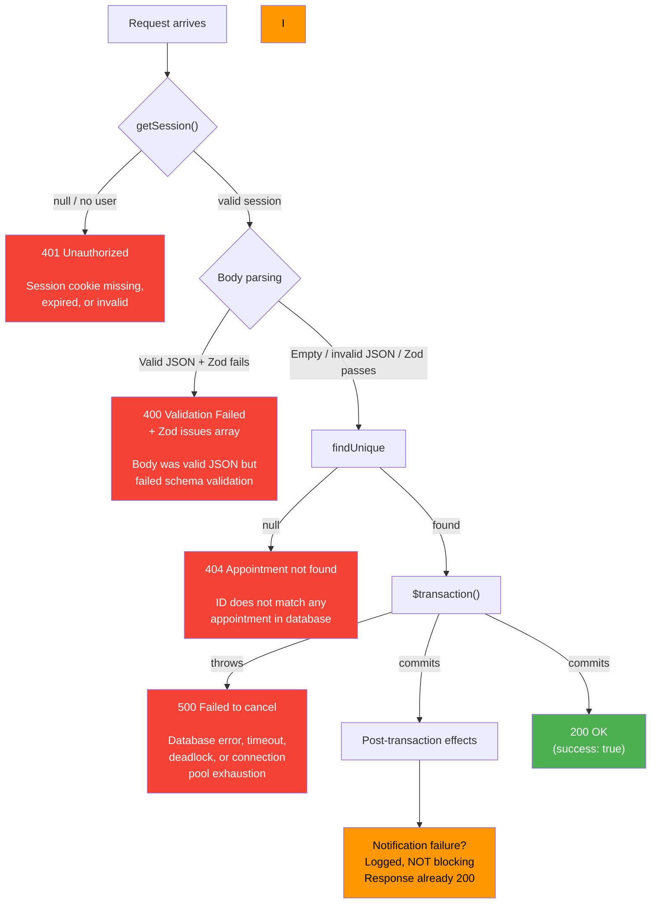

### Error Details

#### 401 Unauthorized

**When**: `getSession()` returns `null` or a session without a `user` property.

**Common causes**: Expired session cookie, missing auth header, server-side session store is down.

**Response**:

```json
{ "error": "Unauthorized" }
```

**Developer notes**: This is the very first check. No database queries run before this, so a 401 has minimal server impact.

#### 400 Validation Failed

**When**: The request body is valid JSON that fails `CancelAppointmentSchema.safeParse()`.

**Common causes**: Invalid enum value for `reason` (e.g., `"BORED"`), wrong field types.

**Response**:

```json
{
  "error": "Validation failed",
  "details": [
    {
      "code": "invalid_enum_value",
      "message": "Invalid enum value. Expected 'SCHEDULE_CONFLICT' | 'FOUND_ALTERNATIVE' | ...",
      "path": ["reason"]
    }
  ]
}
```

**Important subtlety**: An empty body or a non-JSON body does NOT trigger a 400. Only a valid JSON body that fails Zod validation returns 400. This is because the body is optional, and the try/catch around `JSON.parse()` silently catches parse failures.

#### 404 Appointment Not Found

**When**: `prisma.appointment.findUnique()` returns `null`.

**Common causes**: the appointment ID is wrong, or there is a typo in the URL. Note what is _not_ a cause: an already-cancelled booking still has its row, so it answers 409 `NOT_CANCELLABLE` rather than 404.

**Response**:

```json
{ "error": "Appointment not found" }
```

**Developer notes**: A second cancellation of the same appointment does not reach this branch. The appointment is preserved rather than deleted, so the row is still found and the compare-and-set guard on the status transition is what refuses the repeat, answering 409.

#### 500 Failed to Cancel Appointment

**When**: The `$transaction()` throws an error, or any other unexpected error occurs.

**Common causes**: Database connection timeout, deadlock with another concurrent operation, Prisma client error.

**Response**:

```json
{ "error": "Failed to cancel appointment" }
```

**Developer notes**: When this happens, the transaction has rolled back. The appointment and all its data are still intact. The user can safely retry.

#### Post-Transaction Failures (Non-Blocking)

**Notification failure**: If `notifyAppointmentCancelled` throws, the error is silently swallowed because of the `void` prefix. The function runs as an unhandled promise, but since it uses Novu's client (which has its own error handling), unhandled rejections are rare. The cancellation response has already been sent.

## Cancellation vs Reschedule Comparison

Developers frequently ask: "What is the difference between cancelling and rescheduling?" The two flows share some code but differ in fundamental ways.

### Side-by-Side Comparison

| Aspect                           | Cancellation                       | Reschedule                                                               |
| -------------------------------- | ---------------------------------- | ------------------------------------------------------------------------ |
| **Intent**                       | End the booking entirely           | Move the booking to a different time                                     |
| **Appointment record**           | Preserved (money rows hang off it) | Preserved (slots are swapped)                                            |
| **Event record**                 | Status set to `CANCELLED`          | Status unchanged (remains `APPROVED`)                                    |
| **Slot records**                 | Marked `CANCELLED`                 | Replaced slots flipped to `RESCHEDULED`, new times re-confirmed in place |
| **Payment**                      | Preserved; refunded per policy     | Untouched (no additional charge)                                         |
| **Refund triggered**             | Yes, automatically per policy      | No                                                                       |
| **Notifications**                | "Your appointment was cancelled"   | "Your appointment was rescheduled"                                       |
| **Audit fields written**         | Yes (consultation/subscription)    | Different fields (rescheduled timestamp)                                 |
| **Can happen after event start** | Allowed; the tier simply pays zero | Refused — the deadline is `min(now + 72h, earliest session − 24h)`       |
| **Reversible**                   | No (must rebook from scratch)      | Yes (can reschedule again)                                               |

### Decision Guide: When to Cancel vs Reschedule

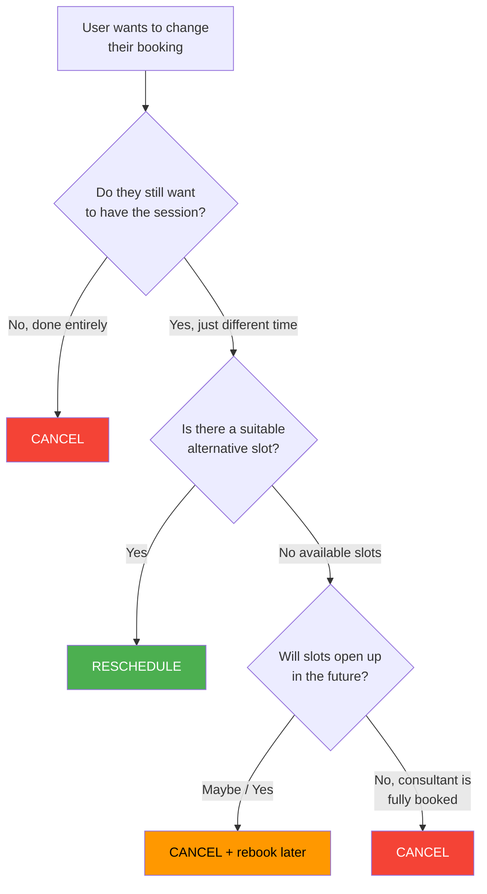

### What Happens to Slots in Each Case

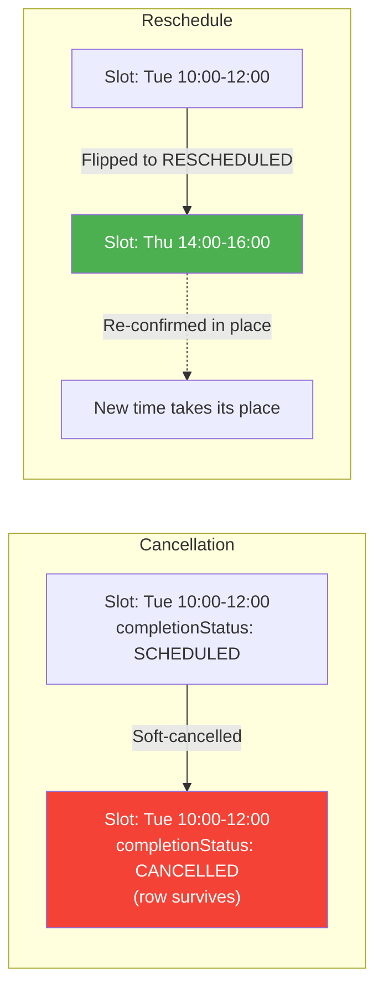

---

## End-to-End Sequence Diagram

This diagram shows every actor and every interaction in a complete cancellation flow, including the post-transaction effects.

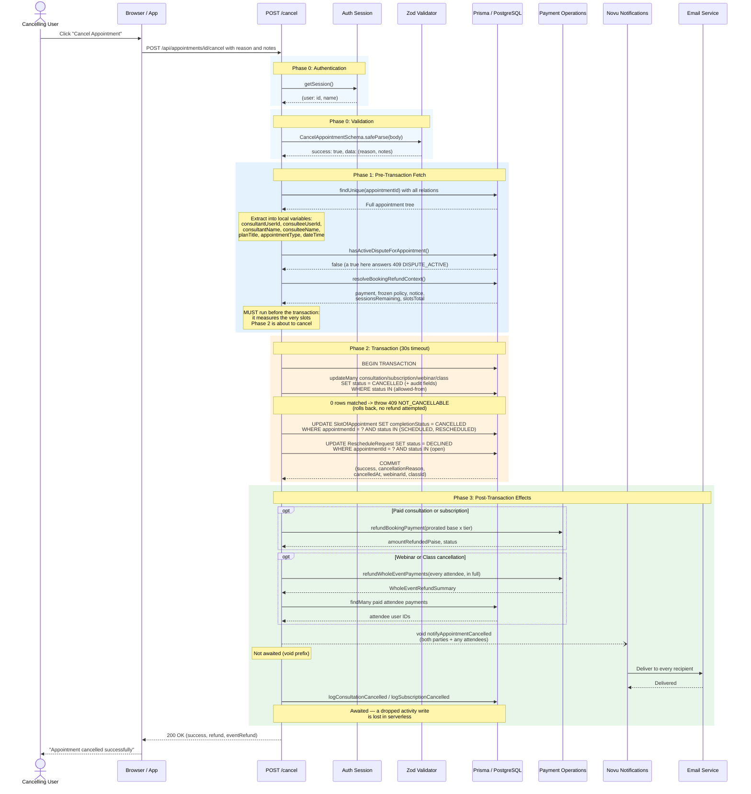

---

## Additional Technical Notes

### Structured Logging

The route's own observability is deliberately thin, because the interesting failures are money failures and those have a durable home rather than a log line. A refund that throws, and a credit-funded booking that lands in a partial-refund window, both write a `SystemEvent` in the `PAYMENT` category as well as reporting to Sentry under the `appointments` or `bookings` subsystem tag. Everything else — the CAS refusals, the dispute refusal — is carried by the HTTP status and its `code`, which is what the client branches on.

### Activity Logging

Consultation and subscription cancellations write a consultant-dashboard activity row (`logConsultationCancelled` / `logSubscriptionCancelled`). Unlike the notification, this write is **awaited**: it is a database write, and a floating promise in a serverless function can be killed when the response returns. The actor label is the same three-way consultant/consultee/system distinction the notification uses, so a platform or organization actor is never recorded as the consultee.

## Related Documents

- [Architecture](./01-architecture.md) -- Booking system overview and data model
- [Event Types and Validation](./02-event-types-and-validation.md) -- Differences between event models
- [API Reference](./04-api-reference.md) -- All booking endpoints including validate and allocate
- [Rescheduling Flow](./07-rescheduling-flow.md) -- How rescheduling works (contrast with this doc)
- [Cancellation Payment Flow](../payments/cancellations-rescheduling/01-cancellation-payment-flow.md) -- Refund processing and earnings reversal
- [Rescheduling Payment Flow](../payments/cancellations-rescheduling/02-rescheduling-payment-flow.md) -- How payment is handled during reschedule
