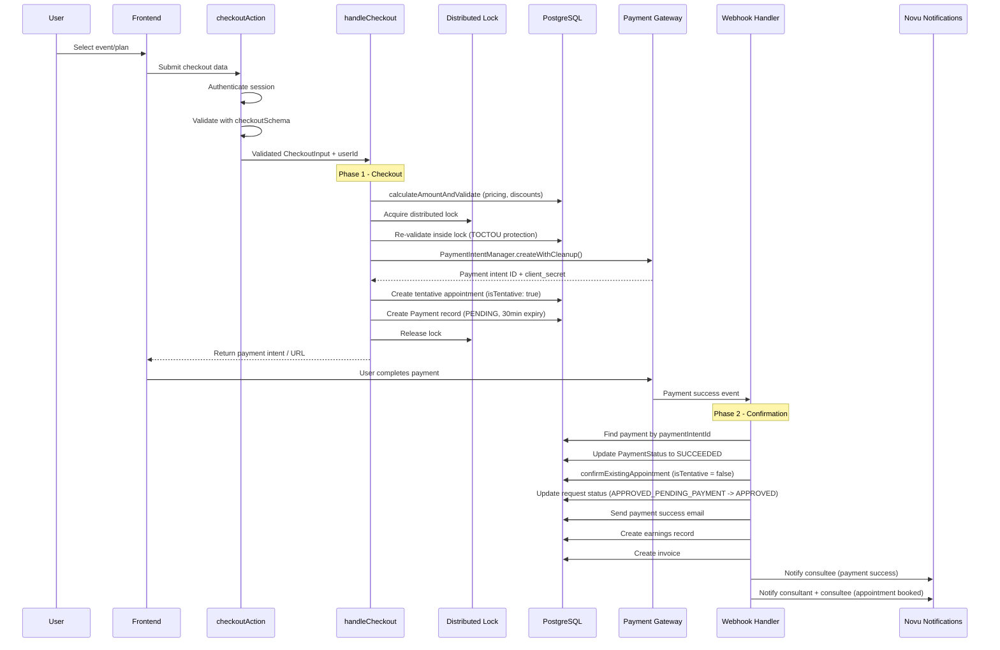

# Checkout-Payment Integration

## Overview

Bookings and payments are tightly coupled through a **two-phase commit pattern**. The checkout operation creates a tentative appointment and a payment intent in a single locked transaction (phase 1). When the payment gateway confirms success via webhook, the appointment is promoted from tentative to confirmed (phase 2). This design prevents both double-booking and orphaned payments.

| Phase            | Actor                    | Action                                                               | State                     |
| ---------------- | ------------------------ | -------------------------------------------------------------------- | ------------------------- |
| 1 - Checkout     | `handleCheckout()`       | Creates appointment with `isTentative: true`, creates payment intent | `PaymentStatus.PENDING`   |
| 2 - Confirmation | `handlePaymentSuccess()` | Sets `isTentative: false`, updates request status                    | `PaymentStatus.SUCCEEDED` |
| Failure          | `handlePaymentFailure()` | Deletes tentative slots, cleans up appointment                       | `PaymentStatus.FAILED`    |

**Key files**:

| File                                  | Role                                               |
| ------------------------------------- | -------------------------------------------------- |
| `actions/checkout.action.ts`          | Server action entry point (auth + validation)      |
| `lib/payments/operations/checkout.ts` | Core checkout logic, appointment creation, locking |
| `lib/payments/webhooks/handlers.ts`   | Webhook handlers for payment success/failure       |
| `schemas/checkout.ts`                 | Zod validation schema for checkout input           |

---

## End-to-End Flow



---

## Checkout Entry Point

### Server Action

**File**: `actions/checkout.action.ts`

```typescript
export async function checkoutAction(
  data: CheckoutInput,
  isMockPayment: boolean = false,
);
```

1. Authenticates the session via `getSession()`
2. Validates input with `checkoutSchema.parse(data)`
3. Delegates to `handleCheckout(validatedData, userId, isMockPayment)`
4. Classifies and logs errors via `classifyError()` on failure

### handleCheckout()

**File**: `lib/payments/operations/checkout.ts`

The main orchestrator. Executes five steps inside a lock-protected region:

| Step | Action                                                                                 | Error Recovery                                              |
| ---- | -------------------------------------------------------------------------------------- | ----------------------------------------------------------- |
| 1    | `calculateAmountAndValidate()` -- pricing, discount validation, currency extraction    | Throws before lock                                          |
| 2    | `acquireCheckoutLock()` -- Redis distributed lock                                      | Returns 409 if lock held                                    |
| 3    | `revalidateInsideLock()` -- re-checks slot availability and plan existence             | Throws, lock released in `finally`                          |
| 4    | `PaymentIntentManager.createWithCleanup()` -- creates gateway payment intent           | Throws, lock released in `finally`                          |
| 5    | Prisma `$transaction` (Serializable) -- creates tentative appointment + payment record | Cancels payment intent via `PaymentIntentManager.cleanup()` |

The transaction in step 5 uses `Prisma.TransactionIsolationLevel.Serializable` with a 25-second timeout to prevent phantom reads on capacity-limited events.

### Validation Schema

**File**: `schemas/checkout.ts`

The `checkoutSchema` enforces per-type requirements via `superRefine`:

| Appointment Type | Required Fields                                                                                              | Notes                                                |
| ---------------- | ------------------------------------------------------------------------------------------------------------ | ---------------------------------------------------- |
| CONSULTATION     | `startsAt`, `endsAt`, one of `slotOfAvailabilityWeeklyId` / `slotOfAvailabilityCustomId` | Slot timing validated against minimum lead time      |
| SUBSCRIPTION     | Either slot data OR `schedulingPeriodStartsAt` + `schedulingPeriodEndsAt`                                    | If slots provided, availability ID also required     |
| WEBINAR          | `eventId`                                                                                                    | No slot times needed (uses master slot from webinar) |
| CLASS            | `eventId`                                                                                                    | No slot times needed (uses session slots from class) |
| TRIAL            | (handled separately)                                                                                         | Included in `appointmentTypeSchema`                  |

Cross-field validations:

- Cannot provide both weekly and custom slot availability IDs
- `startsAt` must be before `endsAt`
- `schedulingPeriodStartsAt` must be before `schedulingPeriodEndsAt`
- Slot must pass `validateSlotTiming()` (not in the past, respects minimum booking lead time)

### Per-Type Checkout Handlers

Each type has a dedicated handler called inside the Serializable transaction:

| Type         | Handler                        | What It Creates                                                                                                                                                            |
| ------------ | ------------------------------ | -------------------------------------------------------------------------------------------------------------------------------------------------------------------------- |
| CONSULTATION | `handleConsultationCheckout()` | Consultation (PENDING) + Appointment + SlotOfAppointment (`isTentative: !skipPayment`)                                                                                     |
| SUBSCRIPTION | `handleSubscriptionCheckout()` | Subscription (PENDING) + placeholder Appointment (no slots). Slots allocated later by consultant via Requests tab. Links completed trial sessions for conversion tracking. |
| WEBINAR      | `handleWebinarCheckout()`      | Adds SlotOfAppointment to existing shared appointment. Validates: not full, not ended, user not already registered.                                                        |
| CLASS        | `handleClassCheckout()`        | Creates SlotOfAppointment for the user across ALL class sessions (appointments). Validates: not full, not ended, user not already enrolled.                                |

### PaymentIntentManager

**File**: `lib/payments/operations/checkout.ts`

Tracks active payment intents for automatic cleanup on failure.

| Method                           | Purpose                                                                |
| -------------------------------- | ---------------------------------------------------------------------- |
| `createWithCleanup(params)`      | Creates intent via gateway, tracks in `activeIntents` Map              |
| `cancelIntent(intentId, reason)` | Cancels intent with gateway, removes from tracking                     |
| `cleanup(intentId, reason)`      | Best-effort cancel (only if tracked). Called when DB transaction fails |

If the database transaction fails after the payment intent is created, `cleanup()` cancels the intent to prevent orphaned charges.

### Mock Payment Support

When `isMockPayment = true`:

- A payment intent is still created (for record-keeping)
- The payment record is immediately set to `PaymentStatus.SUCCEEDED`
- No webhook confirmation needed

---

## Locking During Checkout

`handleCheckout()` acquires a distributed lock before creating appointments. The lock type is determined by the appointment type and presence of slot data.

| Event Type                       | Lock Function       | Key Pattern                                            | Default TTL |
| -------------------------------- | ------------------- | ------------------------------------------------------ | ----------- |
| Consultation                     | `lockSlotBooking`   | `slot-booking:{consultantUserId}:{startsAt}` | 60s         |
| Subscription (with slots)        | `lockSlotBooking`   | `slot-booking:{consultantUserId}:{startsAt}` | 60s         |
| Subscription (scheduling period) | `lockEventCheckout` | `event-checkout:SUBSCRIPTION:{planId}`                 | 60s         |
| Webinar                          | `lockEventCheckout` | `event-checkout:WEBINAR:{eventId}`                     | 60s         |
| Class                            | `lockEventCheckout` | `event-checkout:CLASS:{eventId}`                       | 60s         |

For multi-participant events (Webinar, Class), an additional semaphore mechanism is available:

| Function           | Key Pattern                           | Default TTL | Purpose                                                                              |
| ------------------ | ------------------------------------- | ----------- | ------------------------------------------------------------------------------------ |
| `acquireEventSlot` | `event-counter:{eventType}:{eventId}` | 5 min       | Atomic counter with Lua script. Allows concurrent checkouts up to `maxParticipants`. |

The semaphore uses a Redis Lua script that atomically reads the counter, checks against the limit, and increments -- preventing TOCTOU races.

**TOCTOU protection**: After acquiring the lock, `revalidateInsideLock()` re-runs all availability checks (slot conflicts, capacity, plan existence) inside the protected region. This prevents the classic time-of-check-to-time-of-use race where conditions change between initial validation and the locked transaction.

**Slot conflict filtering**: The conflict check inside `revalidateInsideLock()` uses `buildOccupiedAppointmentFilter()` to exclude appointments with terminal statuses (CANCELLED, REJECTED, EXPIRED). This means cancelled, rejected, or expired appointment slots no longer block new bookings for the same time range.


> Cross-reference: `docs/booking/12-concurrency-and-locking.md` for full locking architecture and Redis infrastructure details.

---

## Payment Webhook Confirmation

### handlePaymentSuccess()

**File**: `lib/payments/webhooks/handlers.ts`

Processes successful payment events in two phases:

#### Phase 1 -- Transaction (Critical)

Runs inside a Prisma `$transaction`. If anything fails here, the entire phase rolls back.

| Step | Action                                                                           |
| ---- | -------------------------------------------------------------------------------- |
| 1    | Find payment by `paymentIntentId`                                                |
| 2    | Idempotency check -- skip if already `SUCCEEDED`                                 |
| 3    | Validate webhook metadata via `validateWebhookMetadata()`                        |
| 4    | Update `paymentStatus` to `SUCCEEDED`                                            |
| 5    | Find or create appointment (New Flow vs Legacy Flow)                             |
| 6    | `confirmExistingAppointment()` -- set `isTentative: false`                       |
|      | — Webinar/class: the status stamp is a CAS guard (`EVENT_ALLOWED_FROM.SCHEDULED`); on a CANCELLED/DRAFT event nothing is confirmed and `capturedAfterTerminal` routes Phase 2 to an auto-refund (B2) |
| 7    | `confirmApprovalStatus()` -- transition `APPROVED_PENDING_PAYMENT` to `APPROVED` |

If metadata validation fails, the payment is marked as `SUCCEEDED` with description `REQUIRES_MANUAL_RECOVERY` and a P1 critical alert is logged. The appointment is NOT created -- manual intervention required.

**Legacy Flow + GiST overlap (B8b)**: a legacy-shape capture whose slot chunks overlap an already-confirmed booking trips the `slot_no_confirmed_overlap` exclusion inside the create. The handler catches the violation, stamps the payment `SUCCEEDED` outside the rolled-back transaction, and auto-refunds it — instead of leaving the webhook to be re-delivered into the same constraint forever.

**Legacy creators birth tentative slots (HOIf/#1202)**: the webhook's LEGACY creators (consultation/subscription slot, webinar payer seat, class session) now write `isTentative: true` instead of confirmed rows. Confirmation is owned exclusively by `confirmExistingAppointment`'s event-state guard — so a capture landing on a CANCELLED/DRAFT booking commits only tentative ghosts (swept by the #830 orphan cleanup) and refunds, never confirmed slots on a dead calendar. Capacity recounts are tentative-inclusive, so nothing else changes.

### Flash-sale behavior (B4/B8c/B5)

Three cooperating changes make a hot event or hot slot survivable:

1. **Optimistic capacity pre-check (WEBINAR/CLASS)** — before the event mutex is even requested, one bounded read answers "already sold out" via the SAME capacity helpers the authoritative recount uses (`readEventCapacity` in checkout.ts). The overwhelming majority of losers in a drop fail fast with a plain **409 `EVENT_SOLD_OUT`** ("sold out, card not charged") instead of queueing into the function timeout.
2. **Bounded waiter budgets** — checkout's lock acquisitions (`event-checkout`, `consultee-booking`) pass `CHECKOUT_WAIT_RETRY_CONFIG` (5 retries ≈ 7s worst case), far inside the ~26s function ceiling. The loser of a near-capacity race now gets a structured **409 `EVENT_CHECKOUT_BUSY` / `CONSULTEE_BOOKING_BUSY` with `retryAfter`**, never a raw 504; contention errors are typed classes (`EventCheckoutBusyError`, `ConsulteeBookingBusyError`), not message-sniffed strings.
3. **Client single auto-retry (B5)** — all four checkout submit paths wrap their request in `fetchCheckoutWithBusyRetry`: on a structured BUSY 409 it shows "your card has not been charged, retrying in Ns…" once, waits the advised pause (capped at 20s), and retries exactly once. The stable `clientIdempotencyKey` rides both attempts and the server CASes on it, so the retry cannot mint a duplicate order.

The Serializable participant recount inside the mutex remains the authoritative capacity gate end to end; everything above only changes where the losers find out and how that feels.

#### Phase 2 -- Post-Transaction (Non-Critical)

Runs outside the transaction. Failures are logged but do not roll back the payment. Background jobs serve as safety nets.

| Step | Action                                                           | Safety Net                       |
| ---- | ---------------------------------------------------------------- | -------------------------------- |
| 1    | `createEarningsFromPayment()`                                    | `sync-payment-earnings` cron job |
| 2    | `createInvoiceFromPayment()`                                     | Manual reconciliation            |
| 3    | `sendPaymentSuccessNotification()` -- payment-success email (M7: runs post-commit so a rollback cannot leave a false confirmation) | N/A                              |
| 4    | `notifyPaymentSuccess()` via Novu (to consultee)                 | N/A                              |
| 5    | `notifyAppointmentBooked()` via Novu (to consultant + consultee) — **skipped when the appointment has no slots yet** (subscription placeholder): the template renders a session time, and a blank placeholder was the payer's first booking message. Allocation-time notification lands with PR 2c. | N/A                              |

### Per-Type Confirmation Differences

The `confirmExistingAppointment()` function handles each type differently to prevent confirming other users' slots in shared-appointment models:

| Type         | Confirmation Scope                   | Details                                                                                             |
| ------------ | ------------------------------------ | --------------------------------------------------------------------------------------------------- |
| Consultation | All slots on the appointment         | Single user per appointment                                                                         |
| Subscription | All slots on the appointment         | Single user per appointment. Status stays PENDING until consultant allocates slots.                 |
| Webinar      | Only the paying user's slots         | Shared appointment. Filters by `userId` to avoid confirming other participants.                     |
| Class        | All user's slots across ALL sessions | Filters by `userId` + `classId`. Payment links to first appointment but confirms all session slots. |

### handlePaymentFailure()

Cleans up tentative appointments when payment fails:

1. Idempotency check -- skip if already `FAILED`
2. Guard against `SUCCEEDED` to `FAILED` transition (ignores late failure webhooks)
3. Updates payment status to `FAILED`
4. Deletes tentative slots; if no slots remain, deletes the appointment and associated consultation/subscription
5. Sends failure email with retry URL and 48-hour expiry
6. Sends Novu notification (fire-and-forget)

---

## New Flow vs Legacy Flow

The webhook handler supports two appointment-creation strategies for backward compatibility:

| Aspect                           | New Flow                                                      | Legacy Flow                                                                |
| -------------------------------- | ------------------------------------------------------------- | -------------------------------------------------------------------------- |
| When appointment is created      | During checkout (`handleCheckout`)                            | By webhook (`handlePaymentSuccess`)                                        |
| Appointment state at checkout    | `isTentative: true`                                           | Does not exist                                                             |
| `payment.appointmentId`          | Set to the created appointment's ID                           | `null`                                                                     |
| Payment metadata `appointmentId` | `"pending"` (not used for lookup)                             | `"pending"` (used as signal)                                               |
| Webhook action                   | Finds existing appointment, sets `isTentative: false`         | Creates new appointment from metadata via `createAppointmentFromWebhook()` |
| Race condition protection        | Tentative slots visible to concurrent validators              | No protection -- concurrent checkouts could double-book                    |
| Advantage                        | Prevents double-booking; appointment always linked to payment | Backward compatible with older payment flows                               |
| When used                        | All current checkouts                                         | Old payments where `payment.appointmentId` is null                         |

The flow is determined by a single check in `handlePaymentSuccess()`:

```typescript
if (payment.appointmentId) {
  // NEW FLOW: Confirm existing tentative appointment
  appointment = await tx.appointment.findUnique({
    where: { id: payment.appointmentId },
  });
} else {
  // LEGACY FLOW: Create appointment from webhook metadata
  appointment = await createAppointmentFromWebhook(tx, metadata, payment);
}
```

For subscriptions specifically, the legacy flow logs a warning since all new subscriptions should create a placeholder appointment during checkout:

```
"Creating subscription via webhook - expected only for old payments"
```

---

## Cross-References

| Topic                                              | Document                                            |
| -------------------------------------------------- | --------------------------------------------------- |
| Payment checkout flow (frontend perspective)       | `docs/payments/checkout-flow/`                      |
| Payment status enums and transitions               | `docs/payments/03-status-enums-reference.md`        |
| Concurrency and distributed locking                | `docs/booking/12-concurrency-and-locking.md`        |
| Payment gateway configuration                      | `docs/payments/gateways/`                           |
| Payout and earnings architecture                   | `docs/payments/payouts/`                            |
| Approval payments (pay-later) flow                 | `docs/payments/approval-payments/`                  |
| Cancellation and refund flows                      | `docs/payments/cancellations-rescheduling/`         |
| Cron jobs (expired payment cleanup, earnings sync) | `docs/booking/13-cron-jobs-and-background-tasks.md` |
