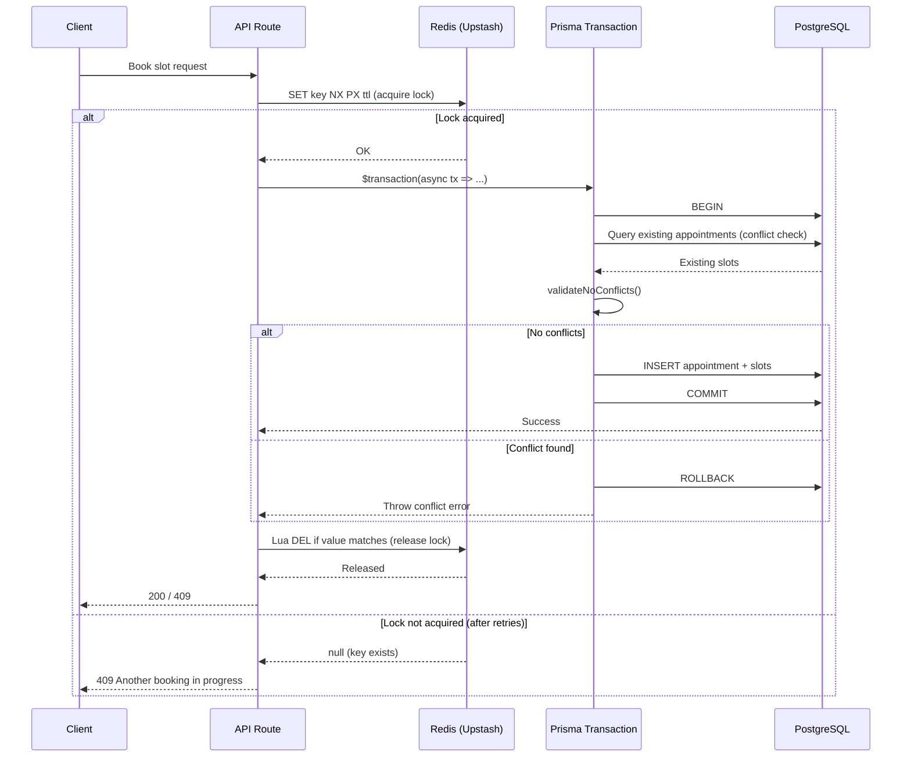

# Concurrency & Locking

## Overview

Booking operations defend against double-booking, race conditions, and data corruption with three complementary mechanisms. The Redis distributed lock is a cheap first gate that removes common-case contention, but it is never the correctness guarantee on its own, because it can expire under a slow operation. The database is the source of truth: the booking transaction re-reads the contended state inside the transaction, and for one-to-one bookings the `slot_no_confirmed_overlap` exclusion constraint is the final backstop, with a violation surfacing as Postgres `23P01` (mapped to a 409). Event checkout additionally runs at Serializable isolation so that its finite-capacity participant recount is conflict-safe. This is the booking-subsystem expression of the platform-wide posture recorded in [ADR 13](../enterprise/70-design-decisions/13-postgres-native-concurrency.md), which keeps concurrency control Postgres-native with no message broker or workflow engine, and [ADR 14](../enterprise/70-design-decisions/14-async-queue-posture.md), which keeps async work queue-less for launch.

The three mechanisms are described below in the order a request meets them.

The first mechanism is a **Redis distributed lock**, acquired before the transaction opens. It serializes concurrent requests for the same resource across processes, so the expensive database work runs without contention in the common case. The lock functions live in `utils/appointmentlock.ts`.

The second mechanism is **in-transaction re-validation**, which carries the real correctness guarantee — though the two booking paths enforce it differently. For a one-to-one slot, the allocation transaction (default Read Committed isolation) re-scans committed appointments for a conflict inside the transaction, and the `slot_no_confirmed_overlap` exclusion constraint is the database backstop: a concurrent overlap that slips past the scan is rejected at write time with Postgres `23P01`, which `SlotAllocationService.classifyError` maps to a 409. For a finite-capacity event, checkout opens the transaction at `isolationLevel: "Serializable"` and recounts participants (tentative-inclusive); PostgreSQL serializable snapshot isolation then aborts the loser of a last-seat race with Prisma error `P2034`. In both cases the database, not the application, enforces the invariant.

The third mechanism is the **`slot_no_confirmed_overlap` database exclusion constraint** (#440), a `btree_gist` `EXCLUDE` constraint on `SlotOfAppointment` that rejects any INSERT or UPDATE which would create a confirmed (non-tentative) overlap for the same consultant. It applies to the exclusive booking types — consultations and subscription sessions, where a consultant can hold only one slot at a given time — and is the final backstop even if a lock is missed and the in-transaction validation is somehow bypassed. The constraint ships with the schema, and `npm run db:push` now applies it automatically because that script chains `db:constraints` after the schema push; the previously separate `npm run db:constraints` step is therefore redundant, though harmless to run.

**Source**: `utils/appointmentlock.ts`, `lib/payments/operations/checkout.ts`

---

## Architecture



---

## Distributed Locking

Seven lock functions cover all booking-related operations. Each wraps the core `acquireLockWithRetry()` function with a domain-specific key pattern and error message.

| Function                   | Key Pattern                                                     | Default TTL  | Purpose                                                               |
| -------------------------- | --------------------------------------------------------------- | ------------ | --------------------------------------------------------------------- |
| `lockConsultationApproval` | `consultation-approval:{consultationId}`                        | 60s          | Prevents concurrent approval of the same consultation                 |
| `lockSubscriptionApproval` | `subscription-approval:{subscriptionId}`                        | 60s          | Prevents concurrent approval of the same subscription                 |
| `lockSlotBooking` / `lockSlotInterval` | `slot-booking:{consultantProfileId}:{atomStartISO}` — one key per 30-minute atom of the interval | 60s          | Prevents double-booking any part of a consultant interval; shared by checkout, request-for-approval, AND trial scheduling (#1169 PR 1) |
| `lockEventCheckout`        | `event-checkout:{appointmentType}:{eventOrPlanId}`              | 60s          | Serializes checkout for a specific event (webinar/class/subscription) |
| `lockAutoAllocate`         | `auto-allocate:{consultantProfileId}` (plus `:{scope}` when the target day is known) | 150s         | Serializes slot allocation for one consultant, whose slots are discovered dynamically under the lock |
| `lockConsulteeBooking`     | `consultee-booking:{consulteeUserId}` — on request-for-approval acquired BEFORE the slot atoms, matching checkout's order | 150s         | Serializes booking activity for one consultee across consultants, closing the cross-consultant double-book the consultant-keyed GiST net cannot see. On request-for-approval this is also what stops a user racing their own approval request against their own checkout (audit B8a); that route additionally caps each user at 3 ACTIVE pending requests (anti-scalper, audit B1). |
| `lockAppointment`          | `appointment-lock:{appointmentId}`                              | 300s (5 min) | Legacy lock for appointment-level operations (cancel, reschedule)     |

Every booking-path acquisition now goes through a guarded front door (`acquireGuarded`): a Redis health probe plus the shared circuit breaker, failing CLOSED with a typed `BookingLockUnavailableError` (503) when Redis is unreachable, while genuine contention still fails OPEN with a retryable message. Interval locks retry less per key (5 attempts instead of 10) because a held atom almost always means a real concurrent booking, and the correct outcome is a fast 409 rather than a minute of backoff. Because the atoms are acquired sequentially, the backoff spent on later atoms would otherwise erode the earlier atoms' TTLs, so once the final atom is held every atom is re-armed to a fresh shared deadline; if any re-arm fails, ownership was already lost and the whole acquisition rolls back instead of proceeding.

All locks use Redis `SET key value NX PX ttl`:

- **NX** -- only set if key does not exist (mutual exclusion)
- **PX** -- expire in milliseconds (auto-cleanup on crash)

The lock value is a `crypto.randomUUID()`, used for safe release verification (see [Safe Release](#safe-release)).

`lockSlotBooking` throws `SlotLockError` (see `utils/errors/SlotLockError.ts`) with structured fields (`consultantId`, `slotTime`, `retryAfterSeconds`) for type-safe error handling via `instanceof`. The retired `lockTrialSlot` no longer exists; trials take `lockSlotBooking` like every other direct writer.

> Cross-reference: `docs/upstash/redis/locking/` for Redis infrastructure and migration details.

---

## Retry Strategy

Lock acquisition retries up to 10 times with exponential backoff and jitter.

**Default configuration** (`DEFAULT_RETRY_CONFIG`):

| Parameter            | Value  | Description                        |
| -------------------- | ------ | ---------------------------------- |
| `retryCount`         | 10     | Maximum retry attempts             |
| `retryDelay`         | 200ms  | Base delay between retries         |
| `retryJitter`        | 200ms  | Random jitter added to each delay  |
| `exponentialBackoff` | `true` | Doubles base delay on each attempt |
| `driftFactor`        | 0.01   | Clock drift compensation (1%)      |

**Delay formula** (`calculateRetryDelay`):

```
delay = (retryDelay * 2^attempt) + random(0, retryJitter)
```

Example delays per attempt:

| Attempt | Base (ms) | + Jitter Range (ms) | Total Range (ms) |
| ------- | --------- | ------------------- | ---------------- |
| 0       | 200       | 0--200              | 200--400         |
| 1       | 400       | 0--200              | 400--600         |
| 2       | 800       | 0--200              | 800--1000        |
| 3       | 1600      | 0--200              | 1600--1800       |
| 4       | 3200      | 0--200              | 3200--3400       |

The effective TTL is reduced by the drift factor: `effectiveTTL = floor(ttl * (1 - driftFactor))`. For a 60-second lock, the effective TTL is 59,400ms. This accounts for clock skew between the application server and Redis.

---

## Safe Release

Lock release uses an atomic Lua script to prevent releasing another client's lock. This is critical because:

1. Client A acquires lock with value `uuid-A`
2. Lock TTL expires while Client A is still working
3. Client B acquires the same lock with value `uuid-B`
4. Client A finishes and tries to release -- without value checking, it would delete Client B's lock

**Lua script** (`releaseLock`):

```lua
if redis.call("get", KEYS[1]) == ARGV[1] then
  return redis.call("del", KEYS[1])
else
  return 0
end
```

- Returns `1` if the lock was successfully released (value matched).
- Returns `0` if the lock was already expired or owned by another client.
- The `GET` + `DEL` executes atomically within Redis (single-threaded Lua evaluation).

`releaseLock()` never throws. It catches all errors and logs them. This makes it safe to call from `finally` blocks without masking the original error.

---

## Lock Extension

For long-running operations, `extendLock()` implements a heartbeat pattern that extends the lock TTL without releasing and re-acquiring.

**Lua script** (`extendLock`):

```lua
if redis.call("get", KEYS[1]) == ARGV[1] then
  return redis.call("pexpire", KEYS[1], ARGV[2])
else
  return 0
end
```

- Checks ownership (value match) before extending.
- Uses `PEXPIRE` to set a new TTL in milliseconds.
- Default extension: 30,000ms (30 seconds).
- Returns `true` on success, `false` if ownership was lost.

**Usage pattern**: Call periodically during operations that may exceed the lock TTL. If `extendLock()` returns `false`, the operation should abort because another client may have acquired the lock.

---

## Event Capacity Control

Finite-capacity events — webinars and classes — must admit at most `maxParticipants` enrollments no matter how many buyers arrive at the same instant. There is no Redis counting semaphore for this; capacity is guarded entirely by the database. Two cooperating mechanisms enforce it, and `lib/payments/operations/checkout.ts` is the single source.

The first is a **per-event distributed mutex**, `lockEventCheckout` (key pattern `event-checkout:{appointmentType}:{eventOrPlanId}`). It serializes checkouts for one event so the common case never contends, and it fails closed: if Redis is unreachable, `lockEventCheckout` throws `EventCheckoutLockUnavailableError` (HTTP 503) rather than letting an unlocked buyer through, because an unlocked checkout could clear the same finite capacity twice. Genuine contention — another buyer already holding the lock — is a benign retry-later case that fails open with a "please try again" message.

The second, and the real capacity guard, is a **Serializable participant recount inside the checkout transaction**. The checkout `prisma.$transaction` runs at `isolationLevel: "Serializable"`, and inside it the code re-reads every enrollment for the event and recounts participants with `countWebinarParticipants` (webinars) or `countUniqueParticipants` (classes, where a buyer enrolled across N sessions still counts once). The recount is tentative-inclusive: it counts the in-flight tentative slots of other concurrent checkouts, not only confirmed enrollments, so two buyers racing for the last seat both observe the contended rows. If the recount is at or above `maxParticipants`, the transaction rejects with a "Webinar is full" / "Class is full" 4xx. When two last-seat checkouts interleave such that neither sees the other's write under the snapshot, PostgreSQL serializable snapshot isolation aborts the loser with Prisma error `P2034`; exactly one enrollment commits. The mutex makes that abort rare; the Serializable recount is what makes the cap correct when it is not.

For the exclusive booking types (consultations and subscription sessions, which occupy a consultant one-to-one) the `slot_no_confirmed_overlap` exclusion constraint described in the [Overview](#overview) is the database-level backstop. It does not apply to webinars and classes, whose participants legitimately share one slot; their cap is the Serializable recount above.

This event-capacity design follows [ADR 13](../enterprise/70-design-decisions/13-postgres-native-concurrency.md): the database is the correctness authority and Redis is load-bearing only for cheap mutual exclusion, never for the count itself.

### Concurrent Checkout Flow

```mermaid
sequenceDiagram
    participant U1 as User A
    participant U2 as User B
    participant API as API
    participant Redis as Redis (mutex)
    participant Prisma as Serializable TX
    participant DB as PostgreSQL

    Note over DB: Webinar capacity: 1 free seat

    U1->>API: Checkout webinar
    U2->>API: Checkout webinar (same instant)

    API->>Redis: lockEventCheckout(WEBINAR, id)
    Redis-->>API: U1 acquires; U2 retries / waits

    API->>Prisma: $transaction (Serializable) for U1
    Prisma->>DB: Recount participants (tentative-inclusive)
    DB-->>Prisma: count < max
    Prisma->>DB: INSERT tentative slot + COMMIT
    API-->>U1: Proceed to payment

    API->>Prisma: $transaction (Serializable) for U2
    Prisma->>DB: Recount participants (tentative-inclusive)
    DB-->>Prisma: count >= max (sees U1) -> "Webinar is full"
    Note over Prisma,DB: If snapshots overlap, SSI aborts U2 with P2034 instead
    API-->>U2: 4xx Webinar is full
```

---

## Prisma Transaction Layer

All slot allocation and cancellation operations run inside Prisma interactive transactions. Transaction timeouts vary by operation complexity:

| Operation                               | Timeout | Max Wait | Source                                    |
| --------------------------------------- | ------- | -------- | ----------------------------------------- |
| Slot allocation (auto/manual/requested) | 120s    | Default  | `SlotAllocationService.ts`                |
| Appointment cancellation                | 30s     | 10s      | `appointments/[id]/cancel/route.ts`       |
| Payment / checkout transactions         | 30s     | 5s       | `lib/payments/operations/checkout.ts`     |
| Webinar CRUD                            | 10s     | 5s       | `app/api/bookings/webinars/crud-with-plan/route.ts` |

The transaction provides two guarantees:

1. **Atomicity** -- All database writes succeed or all roll back. No partial bookings.
2. **Isolation** -- The contended state is re-read inside the transaction. The slot-booking transaction runs at the default Read Committed isolation and relies on the `slot_no_confirmed_overlap` exclusion constraint as its commit-time backstop: a racing transaction that would create a confirmed overlap on the same consultant is rejected with a Postgres `23P01` exclusion violation (mapped to a 409). The event-checkout transaction additionally runs at Serializable isolation, so two buyers racing for the same last seat cannot both commit -- PostgreSQL aborts the loser with a `P2034` serialization failure.

The pattern in every booking route is to take the cheap Redis lock first, then do the authoritative re-read and write inside the transaction, and always release the lock in `finally`:

```ts
lock = await lockSlotBooking(...)    // Redis mutex (common-case contention)
try {
  await prisma.$transaction(             // default Read Committed isolation
    async (tx) => {
      validate(tx, ...)                  // Re-read contended state inside the tx
      create(tx, ...)                    // slot_no_confirmed_overlap rejects a confirmed
    },                                   // overlap at commit -> Postgres 23P01 -> 409
    { timeout: 120_000 },
  )
} finally {
  await unlockSlotBooking(lock)          // Always release
}
// Event checkout follows the same shape but adds { isolationLevel: "Serializable" }
// so the last-seat participant recount aborts the loser with P2034.
```

---

## Race Condition Scenarios

| Scenario                                             | Protection Mechanism         | Key/Strategy                                                                       |
| ---------------------------------------------------- | ---------------------------- | ---------------------------------------------------------------------------------- |
| Two users book overlapping consultant intervals      | `lockSlotBooking`            | One `slot-booking:{profileId}:{atomStart}` key per 30-minute atom, acquired in ascending order -- a 10:00-12:00 booking and an 11:00-12:00 booking collide on their shared atoms instead of passing on different instant keys |
| Two admins approve the same consultation             | `lockConsultationApproval`   | `consultation-approval:{id}` -- only one approval proceeds                         |
| Two admins approve the same subscription             | `lockSubscriptionApproval`   | `subscription-approval:{id}` -- only one approval proceeds                         |
| Multiple webinar checkouts at capacity               | `lockEventCheckout` + Serializable recount | Per-event mutex, then a tentative-inclusive `countWebinarParticipants` recount inside the Serializable checkout tx; SSI aborts the last-seat loser with P2034 |
| Multiple class checkouts at capacity                 | `lockEventCheckout` + Serializable recount | Same path with `countUniqueParticipants` (a buyer across N sessions counts once)   |
| A trial and any other booking race for the same time | `lockSlotBooking`            | Trials take the SAME `slot-booking:` atom keys as every other direct writer; the old `trial-slot-booking:` namespace (which contended with nothing) is retired |
| Concurrent cancel and reschedule on same appointment | `lockAppointment`            | `appointment-lock:{appointmentId}` -- 5 min TTL                                    |
| Lock expires during slow DB operation                | `extendLock` heartbeat       | Extends TTL without releasing; 120s transaction timeout aligned with extended lock |
| Client crashes while holding lock                    | Redis TTL auto-expiry        | Lock expires after TTL, no manual intervention needed                              |
| Lock released by wrong client                        | Safe release Lua script      | `GET` + `DEL` atomic with value verification                                       |
| Slot passes validation but conflicts at commit       | `slot_no_confirmed_overlap` exclusion constraint (#440) | The DB exclusion constraint rejects any confirmed overlap for the same consultant even if application validation was bypassed, raising Postgres `23P01` (mapped to a 409). SSI/P2034 covers the event-checkout last-seat race above, not slot booking. |
| Payment abandoned mid-checkout (events)              | Tentative-slot cleanup cron  | The tentative slot is released by the 24-hour idempotent cleanup (and the buyer can free it early via `DELETE /api/checkout/pending/[paymentId]`); see [ADR B5](./00-architecture-decisions.md) |
| Cancelled/rejected slots blocking new bookings       | `buildOccupiedAppointmentFilter()` | Conflict check excludes appointments with terminal statuses (CANCELLED, REJECTED, EXPIRED) |
