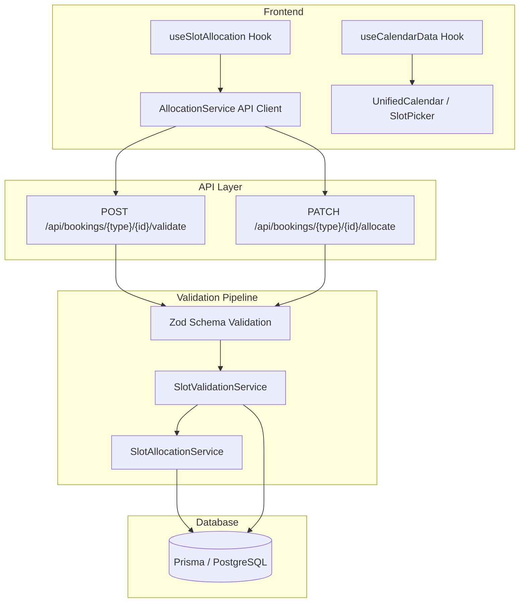

# Booking System

The booking system handles slot allocation and validation for all five event types: consultations, subscriptions, webinars, classes, and trials. It supports three allocation modes (auto, manual, requested) with a three-layer validation pipeline.

## Core Concepts

- **30-minute atomic slots** -- all scheduling is built on 30-min intervals (48 per day)
- **5 event types** -- consultation (one-time, 1:1), subscription (recurring, 1:1), webinar (one-time, 1:many), class (recurring, 1:many), trial (one-time, 1:1, free)
- **3 allocation modes** -- auto (system finds slots), manual (user selects), requested (consultee pre-selects, consultant approves)
- **3 validation layers** -- Zod schemas (input format) -> SlotValidationService (business rules) -> Prisma (DB constraints)
- **Sunday-to-Saturday weeks** -- `SlotCalculationService.countWeeks()` is the single source of truth
- **`isTentative` flag** -- marks slots pending payment or reschedule; cleaned up by cron after 24 hours (`TENTATIVE_EXPIRATION_HOURS = 24`, reduced from 7 days by #833); users can self-release via `DELETE /api/checkout/pending/[paymentId]` (#849)
- **`startDay`/`endDay` DayOfWeek enum + `startTimeUtc`/`endTimeUtc` Int** -- source of truth for weekly availability (minutes since midnight UTC, 0-1439; supports overnight/cross-midnight slots)
- The canonical definitions of "slot" and "session" and the other terms this page uses live in [`docs/enterprise/00-foundations/07-slots-sessions-glossary.md`](../enterprise/00-foundations/07-slots-sessions-glossary.md), which this document assumes rather than restates.

## Reading the audit trail

Every guarded status transition appends one `BookingStatusHistory` row inside the same transaction as the state change, creation appends one more from the literal `"CREATED"` so a booking that has not moved yet still has a timeline, and the reschedule proposals raised against a booking are kept as `RescheduleRequest` rows. Those two tables together are the booking's audit trail, and the way to read them is `getBookingTimeline` in [`lib/data/booking-history.ts`](../../lib/data/booking-history.ts), which merges both sources into a single newest-first list of status edges, actors and reasons. It resolves the trail through both the nullable `appointmentId`, which the transition helpers now fill from each row's own pre-image, and the polymorphic `entityId` column, which is what still makes the rows visible where no single appointment can be named — a subscription or class owning several live appointments, a trial not yet scheduled, and every row written before #1333. The surface over it is `GET /api/staff/appointments/[appointmentId]/timeline`, which renders in the operator appointment detail modal on the staff and admin appointments pages. Reading it requires ADMIN or STAFF: ADR 20 gives organization roles no per-session drill-in, so the read model's scope parameter accepts only the privileged `all` kind and refuses anything else.

## Source Code Map

### Backend Services (`utils/slotAllocation/`)

| File                        | Purpose                                                                                        |
| --------------------------- | ---------------------------------------------------------------------------------------------- |
| `SlotCalculationService.ts` | Pure math: countWeeks, calculateRequiredSlots, getSlotsPerCall, groupSlotsByDay/Week, progress |
| `SlotValidationService.ts`  | Unified validation: future check, conflict detection, schedule matching, event-specific rules  |
| `SlotAllocationService.ts`  | Allocation engine: auto/manual/requested modes, rescheduling, appointment creation             |
| `types.ts`                  | Shared types: EventType, AllocationMode, AllocationRequest, ValidationResult, etc.             |

### Zod Schemas (`schemas/slotAllocation/`)

| File                   | Purpose                                                                                |
| ---------------------- | -------------------------------------------------------------------------------------- |
| `validationSchemas.ts` | allocationRequestSchema, validationRequestSchema, eventIdSchema, formatZodError helper |

Auto-allocation itself has no client-side engine: the client submits `isAuto: true` and the server (`utils/slotAllocation/`, preference scoring in `preferenceScoring.ts`) picks the slots. The client-side allocation code below pre-validates and submits only the manual and requested modes; the old client-side auto-allocator (strategies, scoring, week distribution) was deleted once it stopped serving anything but a test oracle.

### Frontend Hooks (`hooks/scheduling/`)

| File                    | Purpose                                                                                                                 |
| ----------------------- | ----------------------------------------------------------------------------------------------------------------------- |
| `useSlotAllocation.ts`  | Central hook for the Allocate Slots calendar: manual/requested submission, event-specific blocking, weekly distribution |
| `useCalendarData.ts`    | Calendar data sync: fetch, polling (`availabilityPolling.ts`), server-calculated slot status                            |
| `useInFlightGuard.ts`   | Runs at most one instance of an async action at a time, keyed by string — guards double-click races on join/allocate    |
| `useLazyJoinMeeting.ts` | Lazy-loads and joins a Stream call from a slot/appointment, built on `useInFlightGuard`                                 |

### Frontend Utilities (`lib/scheduling/`)

| File                         | Purpose                                                                                                 |
| ---------------------------- | ------------------------------------------------------------------------------------------------------- |
| `allocationService.ts`       | API client wrapper for the allocation/validation endpoints                                              |
| `allocationAlgorithms.ts`    | Client-side pre-validation + submission for manual and requested allocation modes only (no auto engine) |
| `allocationMessages.ts`      | Single catalog of user-facing allocation messages, bucketed by the event's scheduling timezone          |
| `availabilityPolling.ts`     | Pure poll-decision logic for the availability heatmap (60s interval; polling, not push, by design)      |
| `calendarUtils.ts`           | Calendar display: mapWeeklySlots, mapCustomSlots, getConsultantAvailabilityForDay                       |
| `schedulingTimezone.ts`      | Resolves the scheduling timezone stamped on a Subscription/Class, from the consultant's `User.timezone` |
| `slotSelectionValidation.ts` | Pure client-side selection rules for the Allocate Slots calendar, unit-testable apart from the hook     |
| `slot-status-tokens.ts`      | Single colour vocabulary for slot availability states, shared by every calendar/grid surface            |
| `slot-picker-focus.ts`       | Where the slot picker should be scrolled/focused when it opens, for every surface that places slots     |
| `slot-picker-subject.ts`     | Turns one appointment into what the reschedule page's slot picker needs                                 |
| `manage-timings-subject.ts`  | Turns a consultation/subscription/webinar/class into what the "manage timings" page needs               |

### Frontend Components (`components/scheduling/`)

`UnifiedCalendar.tsx` (wrapped by `SafeUnifiedCalendar.tsx` for lazy-loading and error handling) is the shared week-grid calendar; `SlotPicker.tsx` and `SlotStatusLegend.tsx` build on it, and `slot-picker-policy.ts` describes the four surfaces that place slots on a consultant's calendar as data rather than as boolean props.

### API Routes (`app/api/bookings/`)

| Pattern                                     | Method | Purpose                     |
| ------------------------------------------- | ------ | --------------------------- |
| `/api/bookings/consultations/{id}/allocate` | PATCH  | Allocate consultation slots |
| `/api/bookings/consultations/{id}/validate` | POST   | Validate consultation slots |
| `/api/bookings/subscriptions/{id}/allocate` | PATCH  | Allocate subscription slots |
| `/api/bookings/subscriptions/{id}/validate` | POST   | Validate subscription slots |
| `/api/bookings/webinars/{id}/allocate`      | PATCH  | Allocate webinar slots      |
| `/api/bookings/webinars/{id}/validate`      | POST   | Validate webinar slots      |
| `/api/bookings/classes/{id}/allocate`       | PATCH  | Allocate class slots        |
| `/api/bookings/classes/{id}/validate`       | POST   | Validate class slots        |

## Quick Navigation

| I want to...                           | Go to                                                                          |
| -------------------------------------- | ------------------------------------------------------------------------------ |
| **Get the big-picture lifecycle**      | [06-booking-lifecycle.md](./06-booking-lifecycle.md)                           |
| See why the system is built this way   | [00-architecture-decisions.md](./00-architecture-decisions.md)                 |
| Understand the system architecture     | [01-architecture.md](./01-architecture.md)                                     |
| Learn event type rules and validation  | [02-event-types-and-validation.md](./02-event-types-and-validation.md)         |
| Understand slot math and calculations  | [03-slot-math-and-calculations.md](./03-slot-math-and-calculations.md)         |
| Look up API endpoints                  | [04-api-reference.md](./04-api-reference.md)                                   |
| Debug an error or see recent fixes     | [05-troubleshooting-and-changelog.md](./05-troubleshooting-and-changelog.md)   |
| Understand rescheduling                | [07-rescheduling-flow.md](./07-rescheduling-flow.md)                           |
| Understand cancellation                | [08-cancellation-flow.md](./08-cancellation-flow.md)                           |
| Learn about trial sessions             | [09-trial-sessions.md](./09-trial-sessions.md)                                 |
| See how checkout connects to booking   | [10-checkout-payment-integration.md](./10-checkout-payment-integration.md)     |
| Learn about concurrency and locking    | [12-concurrency-and-locking.md](./12-concurrency-and-locking.md)               |
| See all cron jobs and background tasks | [13-cron-jobs-and-background-tasks.md](./13-cron-jobs-and-background-tasks.md) |
| Set up local dev and run tests         | [14-local-development-and-testing.md](./14-local-development-and-testing.md)   |
| Run the release checklist              | [15-checklist.md](./15-checklist.md)                                           |
| Follow a recurring event end to end    | [16-recurring-events-journey.md](./16-recurring-events-journey.md)             |
| Understand org-sponsored bookings      | [17-org-funded-checkout.md](./17-org-funded-checkout.md)                       |
| **Check legal status transitions**     | [18-state-machines.md](./18-state-machines.md)                                 |
| **Understand the DST stub**            | [19-dst-and-timezone-posture.md](./19-dst-and-timezone-posture.md)             |
| Know what a grid poll costs            | [20-availability-grid-cost.md](./20-availability-grid-cost.md)                 |
| Understand the payment system          | [../payments/01-architecture.md](../payments/01-architecture.md)               |
| Check the database schema              | [../../prisma/schema.prisma](../../prisma/schema.prisma)                       |

## Recommended Reading Order

For new developers, read in this order:

1. **[06-booking-lifecycle.md](./06-booking-lifecycle.md)** -- End-to-end overview of how bookings flow from browse to completion
2. **[02-event-types-and-validation.md](./02-event-types-and-validation.md)** -- The 5 event types and their rules
3. **[01-architecture.md](./01-architecture.md)** -- Service layer, data model, data flows
4. **[03-slot-math-and-calculations.md](./03-slot-math-and-calculations.md)** -- How 30-minute slot math works
5. **[04-api-reference.md](./04-api-reference.md)** -- API endpoints and schemas
6. **[10-checkout-payment-integration.md](./10-checkout-payment-integration.md)** -- How bookings connect to payments
7. **[12-concurrency-and-locking.md](./12-concurrency-and-locking.md)** -- Race condition prevention
8. **[13-cron-jobs-and-background-tasks.md](./13-cron-jobs-and-background-tasks.md)** -- Background lifecycle management
9. **[14-local-development-and-testing.md](./14-local-development-and-testing.md)** -- Set up your dev environment and run tests

Then reference these as needed:

- [07-rescheduling-flow.md](./07-rescheduling-flow.md), [08-cancellation-flow.md](./08-cancellation-flow.md) -- Modify existing bookings
- [09-trial-sessions.md](./09-trial-sessions.md) -- Trial session specifics
- [05-troubleshooting-and-changelog.md](./05-troubleshooting-and-changelog.md) -- Debug errors

## Related Documentation

- **Payments**: [../payments/README.md](../payments/README.md) -- Payment architecture, checkout flows, refunds, payouts
- **Notifications**: [../notifications/README.md](../notifications/README.md) -- Novu workflows triggered by booking events
- **Agent-run booking test corpus**: `prompts/booking-algorithm-tests/` -- the E2E prompt corpus that exercises this subsystem; scenario prompts and the harness that runs them
- **Booking-specific Claude Code skills**: `.claude/skills/booking/` -- doctrine and workflow skills for agents working in this subsystem
- **Distributed Locking**: [../upstash/redis/locking/00_README.md](../upstash/redis/locking/00_README.md) -- Redis locking deep dive
- **Cron Setup**: [../guides/cron-setup.md](../guides/cron-setup.md) -- Deployment-specific cron configuration
