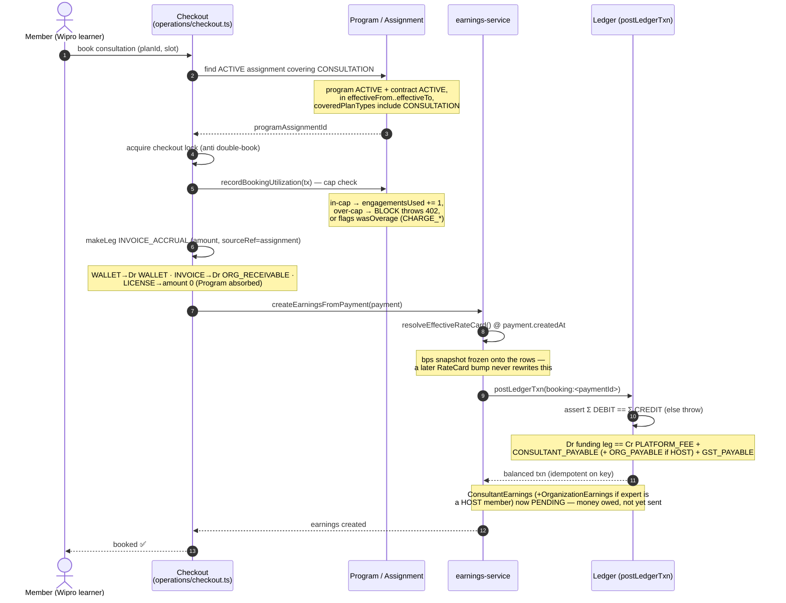
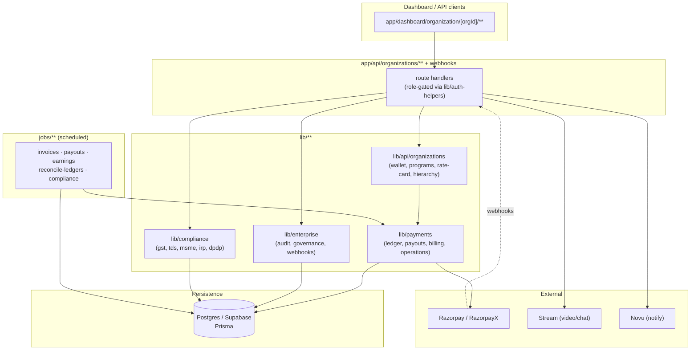
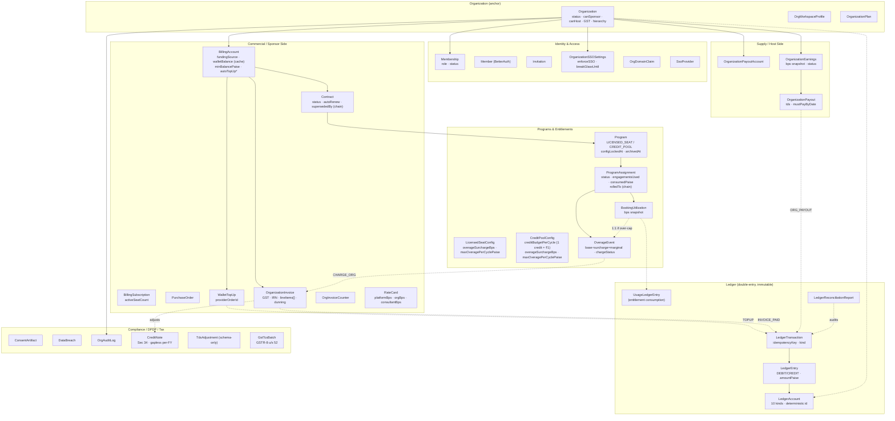

# Enterprise layer — overview

This band covers the organization primitives, programs, wallets, contracts,
invoices, payouts, SSO, consent, HRIS, and the audit log. It is written for
engineers working on anything under `app/api/organizations/**`,
`app/api/admin/organizations/**`, or `app/dashboard/organization/**`, together
with the related `lib/api/organizations/**`, `lib/labels/org-labels.ts`, and
`lib/enterprise/**` modules.

The enterprise layer is a capability-driven B2B surface that sits on top of the
marketplace. Every organization is defined by two orthogonal booleans and, if it
sponsors, one funding source. Every API gate reads from a typed `Membership` row
rather than from BetterAuth's own member table. For the reasoning behind the big
structural choices in this layer — double-entry over three logs, integer paise,
deterministic ledger account ids, typed membership, and the rest — see
[../70-design-decisions/00-README.md](../70-design-decisions/00-README.md).

## Mental model

An organization is described by two axes. The first axis is **capability** —
what the org is allowed to do — and it is carried by two boolean columns:
`canSponsor` is true when the org pays for its members' sessions, and `canHost`
is true when the org hosts experts who earn through it. An org with both booleans
true is a HYBRID, while an org with both false is INERT, a transitional shape that
is rejected at create time. The second axis is **funding source**, which records
how sponsored sessions are paid for. It is an enum set on the single
`BillingAccount` row that belongs to a sponsor org, and its values are `PERSONAL`,
`LICENSE`, `WALLET`, and `INVOICE`.

The third primitive is the **Program**, which is where the commercial terms live.
Every booking that an org sponsors is attributed to a Program, and each Program
subtype (`LICENSED_SEAT` or `CREDIT_POOL`) is a row in its own config table. See
[programs](../30-programs-and-lifecycle/02-programs.md) for the full treatment.

### `OrgWorkspaceProfile`

`OrgWorkspaceProfile` is orthogonal to `Membership`. It is a per-user profile row
that mirrors `StaffProfile` and `AdminProfile`, and it exists for any user who
operates at least one org. `POST /api/organizations` provisions one inside the
creation transaction, and `prisma/scripts/backfill-org-workspace-profiles.ts`
covers existing OWNERs. The profile id surfaces on the BetterAuth session and
backs the operator home at `/dashboard/org-workspace/:orgWorkspaceId/home`. That
home redirects single-org operators straight into their one org, shows a chooser
for multi-org operators, and presents a "create an organization" call to action
for operators whose orgs have all been deactivated. See
`docs/onboarding/onboarding-system-reference.md` §0 for the full profile-model
roster.

## Anatomy of one booking

If you read one diagram in this band, read this one. It traces a single
sponsored session end-to-end — the spine every other doc hangs detail off.

**Scenario.** A Wipro learner (canSponsor org, `INVOICE` funding,
`LICENSED_SEAT` program — the seeded `wipro` org) books a 1:1 consultation.
Wipro's program covers 12 engagements/cycle at a ₹10,000/engagement cap; this
booking is engagement #4 of the cycle, so it's in-cap (no overage). The hops
below are the real call order in `lib/payments/operations/checkout.ts` →
`lib/payments/payouts/earnings-service.ts` → `lib/payments/ledger/post.ts`.



Each hop's full story lives in a dedicated money-and-ledger doc. The assignment
lookup and cap check are covered by [programs](../30-programs-and-lifecycle/02-programs.md),
which carries the `OverageEvent` state machine for the case where this booking is
engagement #13 and has gone past the cap, and by
[funding-and-programs](03-funding-and-programs.md), which explains
`coveredPlanTypes` and `OverageBehavior`. The payment legs themselves —
`makeLeg` and the per-source `sourceRef` invariant — are documented in
[payment-legs](../10-money-and-ledger/09-payment-legs.md). The three-way split and
the BOOKING posting are split across
[booking-to-earnings](../10-money-and-ledger/05-booking-to-earnings.md), which
explains `RateCard` resolution and the bps snapshot, and
[ledger-and-postings](../10-money-and-ledger/03-ledger-and-postings.md). The
eventual payout is the subject of
[payout-pipeline](../10-money-and-ledger/07-payout-pipeline.md): the `PENDING`
earnings rows are later rolled into an `OrganizationPayout` or `ConsultantPayout`,
and disbursement is a separate cron gated by `ENABLE_LIVE_PAYOUTS`.

This booking spine is the happy path. When money has to flow backwards or a
booking is contested, three further money-band docs pick up the thread: a
refund unwinds the booking and its earnings through the reversal engine in
[refunds](../10-money-and-ledger/10-refunds.md); a chargeback or contested
payment runs through the dispute lifecycle in
[disputes](../10-money-and-ledger/11-disputes.md); and the gateway events that
drive top-up confirmation, refund settlement, and dispute notifications are
handled in [payment-webhooks](../10-money-and-ledger/12-payment-webhooks.md). The
ongoing state of an earnings row after this booking — `PENDING` to `PAID` to
`REVERSED` — is tracked in
[earnings-lifecycle](../10-money-and-ledger/06-earnings-lifecycle.md).

> **Why the ledger posts after checkout rather than inside it.** The
> `walletBalance` debit that happens during checkout moves only the cache. The
> authoritative `Dr WALLET` leg is posted by `earnings-service` once the full
> three-way split is known, so the journal balances in a single shot keyed on
> `booking:<paymentId>`. A single-consultant booking posts its journal inline,
> whereas a multi-collaborator booking defers the journal until every share is
> resolved (#773). See
> [booking-to-earnings](../10-money-and-ledger/05-booking-to-earnings.md) §1.

## Design history

This band reads cleaner than the road that built it. The chronology below is
the journey — each entry links to the band doc that carries the full story.

- **#655 — enterprise foundation.** The first cut of the org subsystem:
  capability booleans, `Membership`, the role ladder, and the
  `BILLING_ADMIN` finance role gated by a disjunction (not a rank) —
  `lib/auth/billing-admin-gate.ts`. See [roles-and-permissions](04-roles-and-permissions.md).
- **#768 — v0 schema freeze + God-model breakup.** The monolithic
  `Organization` row was split into satellites (`OrganizationTaxInfo`,
  `OrgBrandingProfile`, `OrganizationMsmeInfo`), `OrganizationKind` was
  deleted in favour of the two booleans, PAN moved to encrypted-at-rest, and
  several JSON escape-hatch columns became typed child tables
  (`InvoiceLineItem`, etc.). See [organization-types](02-organization-types.md).
- **#771 / #772 — three single-entry logs → one double-entry journal.**
  `WalletEntry` + `FundingLedgerEntry` + `SettlementLedgerEntry` were
  replaced by `LedgerTransaction` / `LedgerEntry` / `LedgerAccount` +
  `WalletTopUp`; `walletBalance` became a derived cache asserted by the
  reconciler. See [money-model-overview](../10-money-and-ledger/01-money-model-overview.md).
- **#776 — v1 money core (+ #785 review hardening).** The reversal engine,
  credit notes, refund-cascade unification, idempotency keys, and the
  `LedgerAccountBalance` O(1) snapshot. See [money-model-overview](../10-money-and-ledger/01-money-model-overview.md)
  and [ledger-integrity](../10-money-and-ledger/13-ledger-integrity.md).
- **#777 — v2 customer experience (shipped as PR #787).** The state-aware
  `/home` activation + action center, field-level RBAC on org PATCH, and the
  revenue levers (IRN payload mapper, wallet floor, overage-as-expansion).
  See [organization-lifecycle](05-organization-lifecycle.md).
- **#779 — lifecycle work (landed inside v2).** The cycle engine + auto-renew
  (kills zombie assignments), the contract supersession chain, persistent
  money-config lock (`configLockedAt`), dunning, and verification resubmit.
  See [contract-lifecycle](../30-programs-and-lifecycle/07-contract-lifecycle.md)
  and [cycle-engine-and-rollover](../30-programs-and-lifecycle/08-cycle-engine-and-rollover.md).
- **2026-06-05 — docs refresh + reorg.** The flat doc set was verified against
  code and reorganized into the numbered bands you're reading
  (`dc85f8ef`); diagrams + engineering narrative were layered on next.

For the audit-by-audit verdict (what each `#NNN` checked, what it left
`🟡`/`❌`), see [subsystem-checklist](../90-audits/02-subsystem-checklist.md).

### Schema map — Organization at the centre

The ER diagram below covers the enterprise-specific models in
`prisma/schema.prisma`. Fields shown are the load-bearing ones (id,
key FKs, status enums, settlement-relevant amounts); see the model
definitions for the full list. For a flowchart-style view that clusters
models by subsystem, see [Schema by cluster](#schema-by-cluster) below.

Three v2 lifecycle chains (#779 §A) are self-relations worth calling out. The
first is `Contract.supersededByContractId`, the amend, renew, or replace chain in
which the old row points forward and the new row is a fresh `Contract`. The second
is `ProgramAssignment.rolledToAssignmentId`, the per-cycle rollover chain that the
[cycle engine](../30-programs-and-lifecycle/08-cycle-engine-and-rollover.md) mints.
The third is `Organization.parentOrganizationId`, the `OrgHierarchy` group tree, in
which `rootOrganizationId` denormalizes the group root and there is no depth
column.

The over-cap money meter is the `OverageEvent` row (#775/#778). It is 1:1 with a
`BookingUtilization` and splits into `basePaise` plus `surchargePaise`, which sum
to `marginalPaise`. That marginal is routed to a `Payment` when the behaviour is
CHARGE_MEMBER, or to an `InvoiceLineItem` when it is CHARGE_ORG. The per-cycle
overage knobs — the `overageSurchargeBps` markup and the
`maxOveragePerCyclePaise` circuit-breaker — live on `LicensedSeatConfig` and
`CreditPoolConfig`, which are not drawn as their own entity blocks below; see
[programs](../30-programs-and-lifecycle/02-programs.md).

```mermaid
erDiagram
    Organization ||--o{ Membership          : "typed members"
    Organization ||--o{ Member              : "BetterAuth bridge"
    Organization ||--o{ Invitation          : "pending invites"
    Organization ||--o| BillingAccount      : "at most one (canSponsor)"
    Organization ||--o| OrganizationPayoutAccount : "at most one (canHost)"
    Organization ||--o| OrganizationSSOSettings   : "at most one"
    Organization ||--o{ OrgDomainClaim      : "verified domains"
    Organization ||--o{ Contract            : "commercial agreements"
    Organization ||--o{ OrganizationInvoice : "invoices"
    Organization ||--o{ PurchaseOrder       : "POs"
    Organization ||--o{ OrgInvoiceCounter   : "per-FY seq counters"
    Organization ||--o{ OrganizationEarnings: "host earnings"
    Organization ||--o{ OrganizationPayout  : "host payouts"
    Organization ||--o{ OrgAuditLog         : "audit trail"
    Organization ||--o| HrisConfig          : "directory sync (opt)"
    Organization ||--o{ RateCard            : "owned cards"
    Organization ||--o| Organization        : "parent (OrgHierarchy)"
    Organization ||--o| OrganizationTaxInfo : "GST/PAN carve-out (1:1)"
    Organization ||--o| OrganizationMsmeInfo: "MSME 43B(h) carve-out (1:1)"

    User ||--o{ Membership                  : "joined orgs"
    User ||--o| OrgWorkspaceProfile         : "operator identity"
    User ||--o{ ConsentArtifact             : "DPDP grants"

    Membership ||--o| Member                : "betterAuthMemberId"
    Membership ||--o{ ProgramAssignment     : "entitled to"
    Membership }o--o| RateCard              : "override (optional)"

    BillingAccount ||--o{ Contract          : "funded by"
    BillingAccount ||--o| BillingSubscription : "recurring billing"
    BillingAccount ||--o{ WalletTopUp       : "top-ups"
    BillingAccount ||--o{ OrganizationInvoice : "billed"

    Contract ||--o{ Program                 : "subtypes"
    Contract ||--o| BillingSubscription     : "cycle"
    Contract }o--o| PurchaseOrder           : "linked PO"
    Contract }o--o| RateCard                : "negotiated card"
    Contract ||--o| Contract                : "supersededBy (chain)"

    Program ||--o| LicensedSeatConfig       : "if LICENSED_SEAT"
    Program ||--o| CreditPoolConfig         : "if CREDIT_POOL"
    Program ||--o{ ProgramAssignment        : "member-scoped"

    ProgramAssignment ||--o{ BookingUtilization : "cap accounting"
    ProgramAssignment ||--o| ProgramAssignment  : "rolledTo (rollover chain)"
    ProgramAssignment ||--o{ OverageEvent    : "over-cap charges"
    BookingUtilization ||--|| Payment        : "1:1 lock"
    BookingUtilization ||--o| OverageEvent   : "1:1 if over-cap"
    OverageEvent }o--o| Payment              : "settling payment (opt)"
    OverageEvent }o--o| InvoiceLineItem      : "CHARGE_ORG roll-up (opt)"

    OrganizationPayout  ||--o{ OrganizationEarnings  : "rolled up"

    LedgerAccount     ||--o{ LedgerEntry       : "balance derived from"
    LedgerTransaction ||--o{ LedgerEntry       : "balanced posting (2+ legs)"
    Organization      ||--o{ LedgerAccount     : "WALLET / ORG_PAYABLE / ORG_RECEIVABLE"

    Organization {
        string  id              PK
        string  slug            UK
        OrgStatus status
        bool    canSponsor
        bool    canHost
        string  parentOrganizationId FK "OrgHierarchy self-rel"
        string  rootOrganizationId   "denormalized group root"
        bool    requiresPO
        int     paymentTermsDays "India Net-60 default"
        string  invoiceNumberPrefix
        string  billingContactEmail
        string  supportContactEmail
        string  billingAccountId FK
    }
    OrganizationTaxInfo {
        string organizationId PK "1:1"
        string gstin
        string gstStateCode
        bytes  panEncrypted "AES; panLast4 cached"
        string hsnDefault
    }
    OrganizationMsmeInfo {
        string     organizationId PK "1:1"
        MsmeStatus msmeStatus
        bool       msmeWrittenAgreementOnFile
    }
    BillingAccount {
        string         id          PK
        string         ownerOrgId  UK
        FundingSource  fundingSource
        Currency       currency
        int            walletBalance "paise (WALLET only); derived cache"
        int            creditLimit   "paise (INVOICE only)"
        int            minBalancePaise   "auto-top-up trigger floor"
        bool           autoTopUpEnabled
        int            autoTopUpAmountPaise
        string         autoTopUpMandateId "gateway recurring token"
    }
    Contract {
        string         id              PK
        string         organizationId  FK
        string         billingAccountId FK
        ContractStatus status          "DRAFT|ACTIVE|EXPIRED|TERMINATED"
        date           effectiveFrom
        date           effectiveTo
        int            paymentTermsDays "Net-NN (default 60)"
        bool           autoRenew
        date           autoRenewedAt    "renew-cron claim gate"
        string         supersededByContractId UK "self-rel chain"
        date           supersededAt
        ContractSupersessionReason supersessionReason "AMENDMENT|RENEWAL|TERMINATION_REPLACEMENT"
        string         rateCardId      FK
    }
    Program {
        string        id           PK
        string        contractId   FK
        ProgramType   type         "LICENSED_SEAT | CREDIT_POOL"
        ProgramStatus status
        json          coveredPlanTypes
        json          allowedCategories
        date          configLockedAt "money-config lock (set at 1st assignment)"
        date          archivedAt     "soft-delete"
    }
    ProgramAssignment {
        string id            PK
        string programId     FK
        string membershipId  FK
        date   periodStart
        date   periodEnd
        int    engagementsUsed "LICENSED_SEAT meter"
        int    consumedPaise   "CREDIT_POOL money-meter (1 credit=100p)"
        int    overageCount
        AssignmentStatus status "ACTIVE|ROLLED|PAUSED|CLOSED|CANCELLED"
        string rolledToAssignmentId UK "self-rel rollover chain"
        date   rolledAt        "cycle-engine claim gate"
    }
    OverageEvent {
        string id                   PK
        string programAssignmentId  FK
        string bookingUtilizationId UK "1:1"
        OverageBehavior overageBehavior
        int    basePaise            "pass-through over-cap portion"
        int    surchargePaise       "overageSurchargeBps markup"
        int    marginalPaise        "= base + surcharge (charged total)"
        OverageChargeStatus chargeStatus "PENDING|ACCRUED|CHARGED|BLOCKED|REVERSED|FAILED"
        string paymentId            FK "nullable"
        string invoiceLineItemId    FK "nullable (CHARGE_ORG roll-up)"
        date   chargeTimedOutAt     "CHARGE_MEMBER timeout telemetry"
    }
    BookingUtilization {
        string id              PK
        string programAssignmentId FK
        string paymentId       UK "1:1 with Payment"
        int    engagementsConsumed
        int    priceAtBookingPaise
        int    platformBpsAtBooking
        int    orgBpsAtBooking
        int    consultantBpsAtBooking
        date   reversedAt
    }
    OrganizationInvoice {
        string           id              PK
        string           organizationId  FK
        string           invoiceNumber   "unique per (org, FY)"
        int              fiscalYear
        OrgInvoiceStatus status
        int              subtotalPaise
        int              igstPaise
        int              cgstPaise
        int              sgstPaise
        int              totalPaise
        string           irn
        string           ackNumber
        IrpStatus        irpStatus
        int              irpRetryCount   "uploader retry telemetry"
        date             markedOverdueAt "dunning lifecycle"
        int              dunningReminderCount
        date             dunningSuspendedAt "stage-3 suspend (ENABLE_DUNNING_SUSPEND, #812)"
    }
    OrgInvoiceCounter {
        string organizationId PK
        int    fiscalYear     PK
        int    nextSeq        "atomic ON CONFLICT increment"
    }
    OrganizationPayout {
        string         id                PK
        string         organizationId    FK
        int            amountPaise       "= netPayout − TDS"
        int            netPayoutPaise
        int            tdsAmountPaise
        string         tdsSectionApplied "194O default"
        date           mustPayByDate     "MSME 43B(h) deadline"
        PayoutStatus   status
        string         gatewayPayoutId   UK
        string         idempotencyKey    UK
    }
    OrganizationPayoutAccount {
        string  id                       PK
        string  organizationId           UK
        string  accountNumberEncrypted   "AES-GCM"
        string  razorpayFundAccountId
        PayoutAccountStatus status
    }
    Membership {
        string       id                 PK
        string       organizationId     FK
        string       userId             FK
        MemberRole   role
        MemberStatus status
        string       consulteeProfileId FK
        string       consultantProfileId FK
        string       rateCardOverrideId FK
        PayoutRecipient payoutRecipient
    }
    OrgWorkspaceProfile {
        string userId PK
    }
    ConsentArtifact {
        string id                  PK
        string userId              FK
        json   purposeCodes
        date   grantedAt
        date   withdrawnAt
        string hash                "SHA-256 tamper-evident"
        date   auditRetainedUntil  "+ 7y"
    }
    WalletTopUp {
        string id PK
        string billingAccountId FK
        string providerOrderId UK "= public topUpId"
        WalletTopUpStatus status "PENDING|CONFIRMED|FAILED"
        int amountPaise
    }
    LedgerAccount {
        string id PK "kind|org|consultant|currency"
        LedgerAccountKind kind
        string organizationId FK "nullable"
        string consultantProfileId FK "nullable"
        Currency currency
    }
    LedgerTransaction {
        string id PK
        string idempotencyKey UK "e.g. booking:<paymentId>"
        string kind "BOOKING|TOPUP|PAYOUT|..."
        string paymentId FK "nullable soft-link"
    }
    LedgerEntry {
        string id PK
        string transactionId FK
        string accountId FK
        LedgerDirection direction "DEBIT|CREDIT"
        bigint amountPaise "always positive"
    }
```



On the money model, the three single-entry logs (`WalletEntry`,
`FundingLedgerEntry`, and `SettlementLedgerEntry`) were replaced in #772 by the
double-entry journal — `LedgerTransaction`, `LedgerEntry`, and `LedgerAccount` —
together with `WalletTopUp`. `BillingAccount.walletBalance` is now a derived cache
of the org's `WALLET` account, asserted by the reconciler. See the
[money and ledger band](../10-money-and-ledger/01-money-model-overview.md) for the
full picture.

## System architecture



## Index

The full, current doc index — the section map, the reading paths, and the
`NN-slug → purpose` table for every doc — lives in [README.md](../README.md). It
is intentionally not duplicated here, so that there is only one place to keep in
sync. The money and ledger band lives under `10-money-and-ledger/`, and the right
place to start is
[money-model-overview](../10-money-and-ledger/01-money-model-overview.md). The
commercial-lifecycle band under `30-programs-and-lifecycle/` ends with the two
#779 §A docs. The first is
[contract-lifecycle](../30-programs-and-lifecycle/07-contract-lifecycle.md), which
covers the Contract state machine, auto-renew, the supersession chain, and the
end-early or terminate guard and its cascade. The second is
[cycle-engine-and-rollover](../30-programs-and-lifecycle/08-cycle-engine-and-rollover.md),
which covers the `ProgramAssignment` lifecycle, the nightly cycle-advance, the
roll-versus-close decision, and the rollover chain.

## Schema by cluster

The ER diagram above relates entities to one another, whereas this view groups the
same models by subsystem. The subsystem lens is the one you will navigate the band
by, and it has six clusters: Identity and Access, Commercial and Billing, Programs
and Entitlements, Supply and Payouts, the double-entry Ledger, and Compliance and
Tax.



## The complete guide

The table below points at the one document that reads the whole band as a single
connected narrative; read the banded folders as the chapters and the guide as the
thread that walks you between them.

| File | Purpose |
|------|---------|
| [`explainers/complete-guide.md`](../explainers/complete-guide.md) | The single end-to-end narrative. Read the banded folders (`00-foundations/` through `60-scenarios-and-verdicts/`) as the story, and read the guide as the connective walkthrough. |

The former `playbooks/` and `reference/` directories were folded into this band.
The SSO testing recipes and the typed error codes moved into
[sso-and-authentication](../20-iam-and-security/01-sso-and-authentication.md). The
money vocabulary — refund, reimbursement, payout, referral, and credits — moved
into [money-model-overview](../10-money-and-ledger/01-money-model-overview.md). The
capability-by-funding matrix moved into
[funding-and-programs](03-funding-and-programs.md). The clustered schema view is
the one shown above.

## Ground-truth files

Every doc below defers to the following files when the prose drifts:

- `prisma/schema.prisma` — the schema is the source of truth. Docs cite
  model and field names verbatim.
- `lib/labels/org-labels.ts` — capability, role, status, and funding-source
  labels + Zod narrowers consumed by dashboard and wizard code.
- `lib/enterprise/audit-actions.ts` — the typed constant object that backs
  every `OrgAuditLog.action` string we emit.
- `lib/enterprise/role-transitions.ts` — `isBlockedRoleTransition`, the
  single source of truth for the disjoint LEARNER ↔ EXPERT rule.
- `lib/labels/personal-dashboard.ts` — `resolvePersonalDashboardHref`
  (priority: `orgWorkspaceProfile → consultantProfile → consulteeProfile`).
- `lib/labels/org-errors.ts` — humanized copy for `ORG_NOT_VERIFIED`
  and `ROLE_TRANSITION_BLOCKED` (surfaced via `humanizeOrgError`).
- `lib/profiles/ensure-consultee-profile.ts` — lazy
  `ensureConsulteeProfile(db, userId)` called from checkout, slot
  request-for-approval, and LEARNER invite accept.
- `lib/auth.ts` (the `customSession` hook) — the live session payload;
  also the `databaseHooks.user.create.after` hook, which no longer
  force-creates a `ConsulteeProfile` on signup.
- `lib/auth-helpers.ts` — `requireOrgAccess`, `requireOrgOwner`,
  `orgRoleSatisfies`, and `ORG_ROLE_RANK`.
- `lib/api/organizations/{wallet,program-helpers,rate-card,hierarchy}.ts`
  — the transactional primitives referenced across the ledger, program,
  rate-card, and hierarchy docs.
- `lib/enterprise/cycle-engine.ts` — the roll-vs-close decision + successor
  minting that advances a `ProgramAssignment` (#779 §A); driven nightly by
  `jobs/billing/advance-program-cycles.ts`. See [cycle-engine-and-rollover](../30-programs-and-lifecycle/08-cycle-engine-and-rollover.md).
- `lib/enterprise/config-lock.ts` — `LOCKED_PROGRAM_FIELDS` predicates that
  back `Program.configLockedAt` (money terms freeze at first assignment).
- `lib/enterprise/org-activation.ts` — the pure org-state model behind the
  `/home` activation checklist + action-required banners (#777 §A / #779 §F);
  the server-side reads live in `org-activation-signals.ts`. (The
  dangerous-mutation guard — status precondition + count block + in-tx cascade,
  contract TERMINATED → programs EXPIRED → ACTIVE assignments CLOSED — lives in
  the contract route itself plus the config-lock predicates above.)
- `lib/enterprise/governance.ts` — `verifiedAt`-gated feature locks
  (SSO, INVOICE billing, unverified-org seat cap) (#675/#687).
- `lib/auth/billing-admin-gate.ts` — `requireOrgBillingAdminOrOwner`, the
  field-level RBAC gate behind the org-PATCH allowlists
  (`MAINTAINER_FIELDS` / `BILLING_ADMIN_FIELDS`). See [roles-and-permissions](04-roles-and-permissions.md).
- `jobs/contracts/{auto-renew-contracts,expire-contracts}.ts` — the renewal
  (idempotent via `Contract.autoRenewedAt`) and expiry crons. See [contract-lifecycle](../30-programs-and-lifecycle/07-contract-lifecycle.md).
- `jobs/billing/advance-program-cycles.ts` — the nightly cycle-advance cron
  (GitHub Actions → `jobs/**`) that kills zombie assignments.
- `types/org-details.ts` — shared `OrgDetailsResponse` shape +
  `flattenOrgDetails` helper; consumed by the org layout and
  `useOrgRole`.

## Session shape

The customSession hook flattens each active membership into:

```
{
  organizationId,
  organizationName,
  organizationSlug,
  organizationLogo,
  role,                // MemberRole
  departmentLabel,
  canSponsor,
  canHost,
  fundingSource,       // FundingSource | null
  walletBalance        // int paise | null
}
```

There is no `kind`, `billingMode`, `creditBalance`, `contractEndDate`, or
`organizationProfileId` on the session anymore. UI code derives the badge
via `deriveCapabilityKind(canSponsor, canHost)` and reads fundingSource
directly — labels come from `lib/labels/org-labels.ts`.

At the user level (outside the `organizationMemberships[]` list) the
session also carries the four profile-id FKs — `consultantProfileId`,
`consulteeProfileId`, `staffProfileId`, `adminProfileId`,
`orgWorkspaceProfileId` — surfaced from `lib/auth.ts` so client code can
resolve the "Personal Dashboard" href via
`resolvePersonalDashboardHref` without re-querying the DB.

## Seed / production-shaped grid

For local development, tour rehearsals, and any agent reasoning about
"what the dashboard should look like for a real org", refer to the
deterministic cohort below. Slugs and emails are stable handles —
prefer them over raw IDs in tests, prompts, and docs (IDs change
across `prisma migrate reset`). Source: `prisma/seedFiles/15a-create-organizations.ts`.

| Slug | Capability | Funding | Program | Notes |
|---|---|---|---|---|
| `wipro` | Sponsor (canSponsor=true, canHost=false) | INVOICE | LICENSED_SEAT | PO + draft monthly invoice; pure buyer-side. |
| `learnpro-academy` | Host (canSponsor=false, canHost=true) | — | — | Payout account + 10/10/80 RateCard + EXPERT memberships. |
| `iit-madras` | Hybrid (canSponsor=true, canHost=true) | WALLET | CREDIT_POOL | Both money flows live in parallel. |
| Arjun's solo org (`arjun-anderson-coaching-…`) | Host (canSponsor=false, canHost=true) | — | — | Single-consultant convenience org; dynamic slug. |

**Tour owner:** `tour-owner@familiarise.dev`, password from
`SEED_PASSWORD` (default `SeedPass123!`). Created with
`UserRole = ORG_WORKSPACE` and `OrgWorkspaceProfile`; OWNER of `wipro` so
the operator portfolio (`/dashboard/org-workspace/<id>/home`) renders
populated on first sign-in.

[harness-verdict](../60-scenarios-and-verdicts/02-harness-verdict.md) cross-references this grid for the harness
table; if a row here changes, update both files together.
