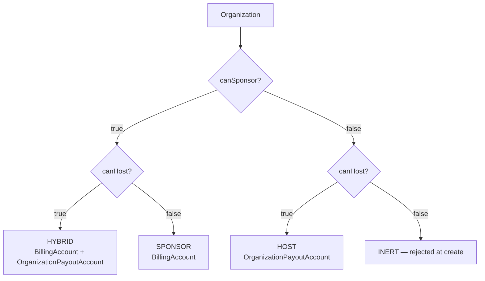

# Organization types — capability-driven

The `OrganizationKind` enum is gone. An organization's "type" is now
computed from two boolean columns on the `Organization` row and surfaced
via `deriveCapabilityKind()` in `lib/labels/org-labels.ts`.

## The two capability booleans

```prisma
model Organization {
  canSponsor Boolean @default(true)
  canHost    Boolean @default(false)
  ...
}
```

The table below reads the four combinations of the two booleans down its first two
columns and gives the derived kind and its meaning in the last two; the INERT row
is the combination that the API rejects at create time.

| canSponsor | canHost | Derived kind | Meaning |
|------------|---------|--------------|---------|
| `true`     | `false` | `SPONSOR`    | Pays for its members' sessions. Has a `BillingAccount`. No hosting-side payout flow. |
| `false`    | `true`  | `HOST`       | Hosts experts who earn through the org. Has an `OrganizationPayoutAccount`. No billing account. |
| `true`     | `true`  | `HYBRID`     | Both flows run independently. Has both records. |
| `false`    | `false` | `INERT`      | Transitional — rejected at create time (`app/api/organizations/route.ts` validates `canSponsor || canHost`). |



### Each combo, grounded in a seeded persona

The four seeded orgs (`prisma/seedFiles/15a-create-organizations.ts`) exist
precisely to put one real shape behind every cell of the table above:

| Derived kind | Seeded org | One concrete line |
|--------------|-----------|-------------------|
| `SPONSOR`  | **Wipro** (`wipro`) | `canSponsor=true, canHost=false` — buys coaching for its own engineers; has a `BillingAccount` (INVOICE), a PO, and a `LICENSED_SEAT` program. No payout account, because Wipro never earns. |
| `HOST`     | **LearnPro Academy** (`learnpro-academy`) | `canSponsor=false, canHost=true` — an agency that aggregates independent experts; has an `OrganizationPayoutAccount` + a 10/10/80 `RateCard` + 5 `EXPERT` memberships. No `BillingAccount`, because LearnPro never sponsors a learner. |
| `HYBRID`   | **IIT Madras** (`iit-madras`) | `canSponsor=true, canHost=true` — sponsors its students (WALLET-funded `CREDIT_POOL`) **and** hosts its professors as experts (payout account). Both records exist; the two flows run in parallel. |
| `HOST` (solo) | **Arjun's Coaching** (`arjun-anderson-coaching-…`) | `canSponsor=false, canHost=true` — a single-consultant convenience org so a freelancer (Arjun, the seeded solo consultant) has a payout surface. Same capability shape as LearnPro, one member. |
| `INERT`    | — (never seeded) | `canSponsor=false, canHost=false` — rejected at create. Nothing to demo because it can't exist; see the INERT guard below. |

The seed covers all four real cells on purpose, so a sales engineer or a new
SDE can open the dashboard for any capability shape without hand-crafting a
fixture. The hypothetical conglomerate case (a Wipro-style parent with
subsidiary orgs) is [hierarchy](06-hierarchy.md) — schema-only in v1.

A `capabilitiesExtra` JSON escape hatch for one-off capabilities (e.g. an
org that also resells third-party content) was sketched during design but
was never added to the schema, and no code reads it (ADR 18 confirmed
this and retired the idea from these docs). If a third capability ever
becomes real, add a typed boolean; the JSON blob remains a rejected
option, not a dormant field.

## Why booleans and not an enum

A single enum collapses two orthogonal questions (does it buy? does it
sell?) into one column, which makes HYBRID a special case everywhere it
appears. Booleans let every consumer answer only the question it cares
about:

- Checkout reads `canSponsor` to decide whether org funding is even
  eligible.
- Payout reconciliation reads `canHost` to decide whether the org has
  an earnings flow.
- The dashboard reads both to render the navigation.

`deriveCapabilityKind()` still exists, but it is a presentation helper,
not an access gate.

### Design decision: what the enum cost, and what booleans cost back

Columns are the two candidate designs; rows are the concrete extensibility and correctness scenarios that drove the choice — read it to understand why the INERT guard and `deriveCapabilityKind` are deliberate prices worth paying.

| | Single `OrganizationKind` enum (rejected) | Two booleans (shipped) |
|---|---|---|
| Add a 4th capability (e.g. RESELL) | new enum value → migration + every `switch` re-audited for exhaustiveness | a 3rd typed boolean — one additive column, no consumer re-audit |
| "Does it buy?" check | must special-case BUYER **and** HYBRID | `canSponsor` — one column |
| HYBRID | a distinct value every consumer must remember to handle | falls out for free (both booleans true) |
| Cost we pay back | — | two columns can drift into the INERT `false/false` combo, so every write path needs the guard below; and `deriveCapabilityKind` exists solely to re-derive the label the enum used to store |

The booleans win because the two questions (*buy?* / *sell?*) are genuinely
orthogonal — collapsing them into one axis made HYBRID a permanent special
case. The price is the INERT guard (a combo the enum made unrepresentable by
construction) and a presentation helper to reconstitute the label. We took
that trade.

### War story: the labels used to disagree with each other

Before Arch-4 there was no single label module: capability/funding strings
were defined inline in `OrgContextBar`, `OrganizationSwitcher`, and the
org-list — and they **drifted out of sync** (one surface said "Provider",
another "Host"). The fix was to centralize every user-facing string in
`lib/labels/org-labels.ts`; its header comment records the reason verbatim:
_"Centralising avoids the taxonomy drift we saw before Arch-4, when labels
were defined inline … and disagreed with each other."_ The same module now
owns `MEMBER_ROLE_LABEL` for the identical reason — see the
_"enum says MAINTAINER, UI says Admin"_ note beside it. The lesson baked into
this band: a taxonomy with three render sites needs one owner, or the three
render sites will tell three stories.

## Label + badge source of truth

Every user-facing string for the capability kind lives in
`lib/labels/org-labels.ts`. The table below pairs each derived kind with the label
that renders in the UI and the Tailwind badge class that colours it, all read
verbatim from `CAPABILITY_LABEL` and `CAPABILITY_BADGE_CLASS`.

| Capability | Label | Badge class |
|------------|-------|-------------|
| `SPONSOR`  | "Sponsor" | `bg-blue-100 text-blue-900 border-blue-200` |
| `HOST`     | "Host"    | `bg-emerald-100 text-emerald-900 border-emerald-200` |
| `HYBRID`   | "Hybrid"  | `bg-purple-100 text-purple-900 border-purple-200` |
| `INERT`    | "Inactive"| `bg-zinc-100 text-zinc-600 border-zinc-200` |

Descriptions (`CAPABILITY_DESCRIPTION`) are the authoritative tooltips;
the wizard, OrgSwitcher, and Home page all render straight from there.

## INERT guard

An INERT org can't exist in the wild:

- `POST /api/organizations` rejects a body with both booleans false
  (`CreateBodySchema.refine(v => v.canSponsor || v.canHost)` in
  `app/api/organizations/route.ts`).
- `PATCH /api/organizations/[orgId]` rejects any patch that would flip
  both to false (same guard, inline in the PATCH handler).

Flipping `canSponsor = false` also requires the wallet to be drained
first — see the PATCH guard in `app/api/organizations/[orgId]/route.ts`.
Otherwise the org would own a positive wallet balance with no billing
surface to reconcile it against.

## HYBRID semantics

A HYBRID org runs two independent flows:

1. **Sponsor side.** The sponsor flow is identical to a pure SPONSOR
   org: a `BillingAccount`, a `FundingSource`, optional contracts,
   programs, and invoices.
2. **Host side.** The host flow is identical to a pure HOST org: an
   `OrganizationPayoutAccount`, `OrganizationEarnings` rows created on
   each booking whose expert is a member of the org, and
   `OrganizationPayout` cycles.

The two flows never intersect inside a single `Payment` record. A HYBRID
org that sponsors its own expert's session routes the money through the
sponsor flow AND books an earnings row on the host flow — the two
settlements are computed from the same `Payment.amount` but each
uses its own `RateCard`.

## What replaced what

The table below maps each pre-Arch-4 term in the left column to its current
representation in the middle column, so a reader coming from the old vocabulary can
find the new shape.

| Pre-Arch-4 term | Now | Notes |
|-----------------|-----|-------|
| `OrganizationKind.BUYER` | `canSponsor=true, canHost=false` | — |
| `OrganizationKind.PROVIDER` | `canSponsor=false, canHost=true` | — |
| `OrganizationKind.HYBRID` | `canSponsor=true, canHost=true` | — |
| `OrganizationProfile` | merged into `Organization` | branding + policies are now columns on the base row. |
| `OrganizationProfile.id` (session) | `organizationId` | session exposes the Organization id directly. |

## Related docs

The [funding-and-programs](03-funding-and-programs.md) doc covers the funding
sources that sit on the sponsor side. The
[roles-and-permissions](04-roles-and-permissions.md) doc explains the role ladder,
which is the same regardless of capability; whether a member is an expert or a
learner is controlled through their `Membership` row rather than through the org's
capability flags. The [dashboard-pages](../30-programs-and-lifecycle/04-dashboard-pages.md) reference describes which pages render for
which capability, and
[scenarios-and-examples](../60-scenarios-and-verdicts/01-scenarios-and-examples.md)
walks four end-to-end worked cases.
