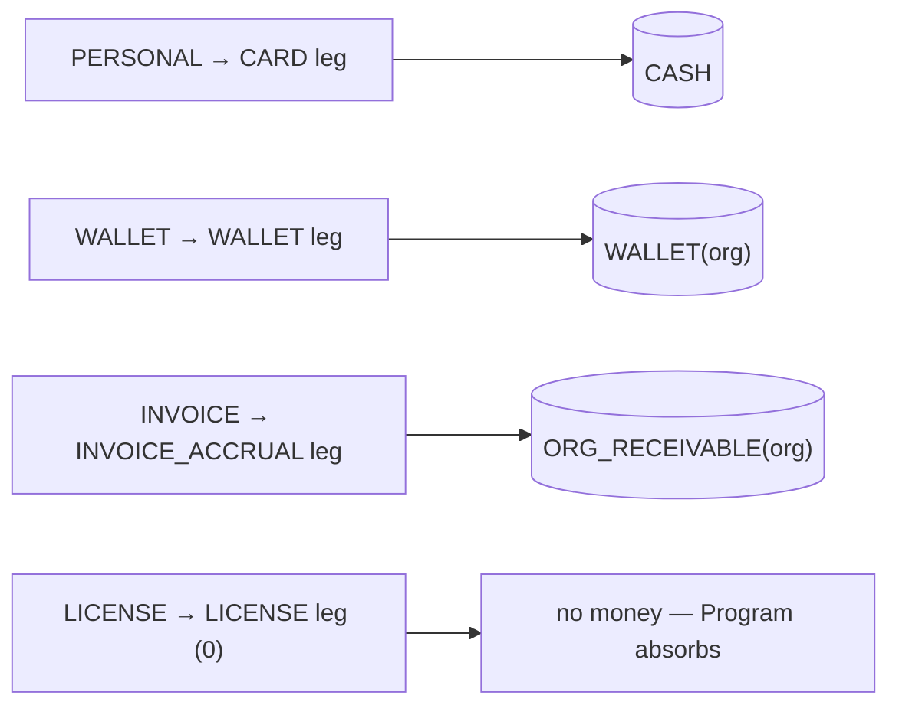

# Funding sources and programs

Sponsor-side orgs (`canSponsor=true`) attach exactly one `BillingAccount`
row. The account carries a `fundingSource` enum that controls how
sessions are paid for. Most commercial variations (seat caps, overage
behaviour, session rollover) live one layer below, on `Program` rows
hanging off `Contract`s.

## `FundingSource` enum (schema.prisma)

```prisma
enum FundingSource {
  PERSONAL // learner pays own card; Payment.organizationId tagged only
  LICENSE // flat enterprise license (was PREPAID_UNLIMITED)
  WALLET // credit pool (was SEAT_PACK)
  INVOICE // NET-X postpaid (was INVOICED_MONTHLY)
}
```

The `PROJECT` value was dropped from the enum — it never modelled a real
arrangement and carried no config. Per-engagement fixed-fee / hourly
billing, if it ever ships, lands as a `Program` subtype, not a funding
source.

Labels and taglines come from `FUNDING_SOURCE_LABEL` and
`FUNDING_SOURCE_TAGLINE` in `lib/labels/org-labels.ts`.

## Mapping from the old billing modes

The table below maps each retired `OrgBillingMode` value in the left column to the
`FundingSource` that replaced it, with a note on what changed in the move.

| Old `OrgBillingMode`    | New `FundingSource` | Notes |
|-------------------------|---------------------|-------|
| `TAG_ONLY`              | `PERSONAL`          | Members pay at checkout; the org is attribution-only. |
| `SEAT_PACK`             | `WALLET`            | Credits live as paise on `BillingAccount.walletBalance`. |
| `INVOICED_MONTHLY`      | `INVOICE`           | Roll-up invoice at month-end; `PaymentLeg.source=INVOICE_ACCRUAL`. |
| `PREPAID_UNLIMITED`     | `LICENSE`           | Flat fee contract; `coveredEngagementsPerCycle=null` on the LICENSED_SEAT Program. |

## Funding-source matrix

The table below reads one funding source per row and shows, across the columns,
which `BillingAccount` money columns it uses, which `PaymentLeg.source` a single
booking writes under it, and whether any invoice cron runs on its behalf.

| FundingSource | Wallet column | Credit limit column | Per-booking leg (`PaymentLeg.source`) | Invoice rhythm |
|---------------|---------------|---------------------|---------------------------------------|----------------|
| `PERSONAL`    | `null`        | `null`              | `CARD` (on the learner's card)        | None |
| `WALLET`      | `Int` paise (balance) | `null`      | `WALLET` (debit from balance)         | None |
| `INVOICE`     | `null`        | `Int` paise (optional, `null` = unlimited) | `INVOICE_ACCRUAL` (rolled up) | Cron rolls `Payment`s into one `OrganizationInvoice` at month-end |
| `LICENSE`     | `null`        | `null`              | `LICENSE` (no money moves; Program absorbs it) | None (flat fee already paid) |

Pre-launch verified: the "unmetered" experience of a LICENSE org is not
a separate funding model — it's a `LICENSED_SEAT` Program with
`coveredEngagementsPerCycle = null`. The old PREPAID_UNLIMITED enum value
pretended the two were distinct; they are not.

Each funding source determines which ledger account a sponsored booking debits (via its `PaymentLeg.source` → the `BOOKING` posting; see [payment legs](../10-money-and-ledger/09-payment-legs.md) and [ledger & postings](../10-money-and-ledger/03-ledger-and-postings.md)):



## One worked example per funding source

Paise integers throughout (₹1 = 100 paise). Three of these are seeded; the
LICENSE case is hypothetical (no LICENSE org is seeded — it's a
`LICENSED_SEAT` program with `coveredEngagementsPerCycle = null`).

- **`PERSONAL` — a learner pays their own card.** A student outside any
  sponsored program books a ₹2,000 consultation. `Payment.amount = 2_00_000`
  paise; the single leg is `CARD` (`sourceRef` = gateway `pay_…`); the org,
  if tagged at all, is attribution-only. Booking posts `Dr CASH`. No wallet,
  no invoice, no cron. (Arjun, the seeded solo consultant, sells into exactly
  this flow on the *host* side — his learners pay PERSONAL.)
- **`WALLET` — IIT Madras pre-funds a credit pool.** The seed tops up
  3 × ₹5,00,000 = ₹15,00,000 (`WalletTopUp` CONFIRMED, each posting
  `Dr CASH / Cr WALLET`) and debits 5 × ₹5,000 against it
  (`Dr WALLET / Cr PLATFORM_FEE`), leaving `walletBalance = 14_75_000`
  paise (₹14,75,000). A student booking debits the `WALLET` leg; when the
  balance crosses `minBalancePaise` the auto-top-up (#779) refills it. The
  cache is asserted against `balance(WALLET)` by the reconcile cron — the
  journal is the truth, the column is the fast path.
- **`INVOICE` — Wipro books now, pays NET-60.** Wipro's `BillingAccount`
  carries a ₹1 Cr `creditLimit` backed by a ₹50,00,000 PO.
  Each sponsored booking writes an `INVOICE_ACCRUAL` leg
  (`Dr ORG_RECEIVABLE`); the month-end roll-up cron groups accruals into one
  `OrganizationInvoice` (the seed ships a DRAFT `INV-WIP-2026-0001`:
  subtotal ₹1,00,000 + IGST ₹18,000 = ₹1,18,000, `irpStatus = PENDING`).
  Payment posts `Dr CASH / Cr ORG_RECEIVABLE`. This is the headline
  design-partner fit (see [design-partner-customer-set](../60-scenarios-and-verdicts/03-design-partner-customer-set.md)).
- **`LICENSE` — a flat-fee enterprise deal (hypothetical, TCS-style).** A
  services enterprise pre-pays a flat annual fee for unmetered coaching. Its
  `LICENSED_SEAT` program sets `coveredEngagementsPerCycle = null`, so every
  booking writes a `LICENSE` leg with `amountPaise = 0` — no money moves at
  booking time because the cost was sunk at contract signing. The leg exists
  only so every `Payment` still has ≥1 leg and reconciliation can prove the
  booking was lawfully fulfilled without a gateway charge.

### LICENSE vs WALLET vs INVOICE — when a buyer picks which, and what it costs us

(`PERSONAL` is excluded — it's the no-sponsorship default, zero org
operational load.)

| | `LICENSE` | `WALLET` | `INVOICE` |
|---|---|---|---|
| Buyer picks it when | usage is high + predictable; wants one flat number, no per-seat metering | wants prepaid control + a hard spend ceiling (pool can't be overdrawn) | wants to book freely now and reconcile later on NET terms (classic AP) |
| Money timing | paid up front, sunk at signing | prepaid, drawn down per booking | postpaid, settled after the invoice |
| Per-booking leg | `LICENSE` (₹0) | `WALLET` (`Dr WALLET`) | `INVOICE_ACCRUAL` (`Dr ORG_RECEIVABLE`) |
| What it costs us operationally | least: no per-booking money movement; risk is *us* over-delivering against a flat fee | top-up reconciliation + the `walletBalance` cache must stay ==`balance(WALLET)`; auto-top-up mandate to manage | most: AR carrying risk, the month-end roll-up cron, dunning when a NET-60 invoice goes `OVERDUE`, and IRN/GST e-invoice obligations |
| Failure mode that bites | margin erosion if usage spikes (cap it with a `LICENSED_SEAT` engagement ceiling instead of `null`) | a *captured-but-uncredited* top-up stranding money — the bug #785 fixed (`ca6e9073`) | silent stuck money: a stuck `CHARGE_MEMBER` or an unpaid invoice — the dunning + timeout work #779 §D added (`59482e83`) |

Operational claims here are grounded in the money-band docs:
[wallet-and-topups](../10-money-and-ledger/04-wallet-and-topups.md) (cache vs
journal, auto-top-up), [invoicing](../10-money-and-ledger/08-invoicing.md)
(roll-up, GST, dunning, IRN), and [payout-pipeline](../10-money-and-ledger/07-payout-pipeline.md).

## Programs layer

A `Contract` holds commercial terms. A `Program` sits under the contract
and defines the per-booking rules. Two subtypes ship:

```prisma
enum ProgramType {
  LICENSED_SEAT
  CREDIT_POOL
}
```

`PROJECT` + `RETAINER` are NOT enum values yet — they're named in the
schema header comment as conceptually reserved, but the enum carries only
the two shipped subtypes (and only those two have config tables). Adding
them later is a non-destructive enum extension, so nothing is pre-stamped.

Each subtype has its own config table:

```prisma
model LicensedSeatConfig {
  programId                  String          @id
  ratePerSeatPaise           Int
  cycle                      BillingCycle    // MONTHLY | QUARTERLY | ANNUAL
  coveredEngagementsPerCycle Int?            // null = unlimited (LICENSE)
  overageBehavior            OverageBehavior @default(BLOCK)
  activeSeatCount            Int             @default(0)
  priceCapPerEngagementPaise Int?
  overageSurchargeBps        Int?            // #775 bps markup on the overage marginal
  maxOveragePerCyclePaise    Int?            // #768 circuit breaker: cumulative cap, then BLOCK
}

model CreditPoolConfig {
  programId               String          @id
  cycle                   BillingCycle    // when does the pool reset?
  creditBudgetPerCycle         Int             // hard cap (1 credit = ₹1)
  minimumCreditsPerPeriod Int?            // optional commitment minimum
  overageBehavior         OverageBehavior @default(BLOCK) // #775 parity with LicensedSeatConfig
  overageSurchargeBps     Int?            // #775 bps markup on the over-budget marginal
  maxOveragePerCyclePaise Int?            // #768 circuit breaker (see LicensedSeatConfig)
}
```

`CreditPoolConfig` gained the same overage trio as `LicensedSeatConfig`
(#775): `overageBehavior` + `overageSurchargeBps` + `maxOveragePerCyclePaise`.
The pool's money cap is `creditBudgetPerCycle × 100` paise; bookings past it
route per `overageBehavior` (BLOCK / CHARGE_MEMBER / CHARGE_ORG), with the
optional bps surcharge and a cumulative-overage ceiling that falls back to
BLOCK once exceeded. The surcharge is applied to the real pass-through
engagement price — consulting rates are heterogeneous, so there's no flat
per-unit tier, just this one bps knob.

`CREDIT_POOL` was simplified post-Arch-4: 1 credit is fixed at ₹1
(100 paise). The dormant `premiumMultiplier` field was dropped and
`creditValuePaise` was retired in favor of the fixed mapping —
finance, audit, and reconciliation all read in rupees end-to-end with
no translation layer. Per-tier rate adjustments live on a Program
rate-card override rather than as JSON escape hatches.

## Config lock & archive

A Program's money config is editable only while nothing rides on it.
`Program.configLockedAt` is stamped in the same transaction that creates
the **first** `ProgramAssignment` (not at program-create, so a typo on a
brand-new program is still fixable). Once non-null, the
`LOCKED_PROGRAM_FIELDS` set in `lib/enterprise/config-lock.ts` —
`type`, `coveredPlanTypes`, `ratePerSeatPaise`,
`coveredEngagementsPerCycle`, `creditBudgetPerCycle`, `overageBehavior`,
`overageSurchargeBps`, `priceCapPerEngagementPaise`,
`maxOveragePerCyclePaise` — is read-only. A retroactive money edit would
rewrite bookings already settled at the old terms, so the rule is: locked
is locked. Changing money terms means **archive this program + create a
new one** (the same immutable pattern as a RateCard bump or contract
supersession). A bounded count check (assignments / bookings / overage
events) stays as a belt-and-braces fallback so a legacy row with a null
column still reads locked.

`Program.archivedAt` is the soft-delete: once `configLockedAt` is set the
program is never hard-deleted (financial history rides on it), so
archiving hides it from active lists while preserving the trail. Contract
terms lock on the same principle — see the deep-dive in
[contract-lifecycle](../30-programs-and-lifecycle/07-contract-lifecycle.md).

## `OverageBehavior`

`OverageBehavior` drives what happens when a program hits its per-cycle cap in the
middle of a booking. It applies to both subtypes: `LICENSED_SEAT`, which is metered
by engagement count, and `CREDIT_POOL`, which is metered by `consumedPaise` against
`creditBudgetPerCycle × 100`. The table below gives one row per enum value and describes
the behaviour each one triggers.

| Value           | Behaviour                                                                 |
|-----------------|---------------------------------------------------------------------------|
| `BLOCK`         | Checkout returns 402. `ProgramAssignmentLimitError` in `lib/api/organizations/program-helpers.ts`. |
| `CHARGE_MEMBER` | Learner pays the overage on their own card. Recorded as `wasOverage=true` on the `BookingUtilization`. |
| `CHARGE_ORG`    | Overage is rolled into the next `OrganizationInvoice` cycle via a distinct `PaymentLeg.source = OVERAGE_INVOICE_ACCRUAL` leg (kept separate from the base `INVOICE_ACCRUAL` so the `@@unique([paymentId, source])` doesn't collide). |

Each overage materialises an `OverageEvent` row carrying
`basePaise` / `surchargePaise` / `marginalPaise` (marginal = base +
surcharge, where surcharge = base × `overageSurchargeBps` / 10000). Two
guards bound the runaway: `priceCapPerEngagementPaise` caps the
per-engagement pass-through price, and `maxOveragePerCyclePaise` caps the
cumulative marginal within the cycle — once exceeded, subsequent bookings
fall back to `BLOCK` regardless of `overageBehavior`. The OverageEvent
charge state machine and CHARGE_MEMBER timeout telemetry are detailed in
[programs](../30-programs-and-lifecycle/02-programs.md).

## `CoveredPlanType`

`Program.coveredPlanTypes: CoveredPlanType[]` enumerates which product
lines a Program applies to. Values: `CONSULTATION`, `CLASS`, `WEBINAR`,
`SUBSCRIPTION`. An empty array means "any plan type" (wildcard).

## `BillingCycle` and `BillingSubscription`

When a Program sits on a subscription billing cadence, a single
`BillingSubscription` row hangs off the Contract and tracks:

- `model`: `SubscriptionModel` (`FLAT_FEE | PER_SEAT`) — the discriminator
- `cycle`: `MONTHLY | QUARTERLY | ANNUAL`
- `ratePerSeatPaise` or `flatFeePaise` (mutually exclusive via `model`)
- `activeSeatCount` (aggregated across programs)
- `currentCycleStart`, `currentCycleEnd`, `nextInvoiceDate`

The job that walks active subscriptions and emits invoices is implemented
and scheduled (`jobs/billing/generate-subscription-invoices.ts`, #681 —
daily at 01:00 UTC / 06:30 IST via
`.github/workflows/generate-subscription-invoices.yml`, amount =
`flatFeePaise` for FLAT_FEE or `activeSeatCount × ratePerSeatPaise` for
PER_SEAT, claimed via a conditional `nextInvoiceDate` advance). The
workflow carries a `concurrency` group (#813) so two overlapping runs
queue rather than double-bill. The INVOICE-funding month-end roll-up is a
separate cron — `jobs/billing/settle-invoice-accruals.ts` runs monthly on
the 1st at 04:00 UTC / 09:30 IST via
`.github/workflows/settle-invoice-accruals.yml`, gated by
`ENABLE_CONSOLIDATED_INVOICE`; it absorbed the retired
`consolidated-invoice-rollup` job (#813), reads the accrual set inside a
Serializable transaction so overlapping runs can't double-issue, and is
itself behind a `concurrency` group. (Crons are GitHub Actions invoking
`jobs/**`, not Netlify functions.) The hand-rolled
`POST /api/organizations/[orgId]/billing-account/invoices` still exists as
an operator escape hatch.

Per-cycle entitlement reset is a separate concern: `ProgramAssignment`s
are advanced (ROLLED to a fresh period or CLOSED) by the nightly cycle
engine — see [cycle-engine-and-rollover](../30-programs-and-lifecycle/08-cycle-engine-and-rollover.md).

## Capability × funding combinations

The sell-supported matrix — capability (`canSponsor`/`canHost`, see [organization-types](02-organization-types.md)) × funding source. The create call sets the booleans + (for sponsors) `fundingSource`; checkout writes the leg shown (→ which ledger account it debits, see [payment-legs](../10-money-and-ledger/09-payment-legs.md)). Worked end-to-end cases: [scenarios-and-examples](../60-scenarios-and-verdicts/01-scenarios-and-examples.md).

| Capability | Funding | Create (key fields) | Checkout leg → ledger | Cron |
|---|---|---|---|---|
| SPONSOR | PERSONAL | `canSponsor:true, fundingSource:PERSONAL` | `CARD` → Dr CASH | none |
| SPONSOR | WALLET | `…WALLET` (`walletBalance=0`) | `WALLET` → Dr WALLET(org); top-up posts `Dr CASH / Cr WALLET` | none (top-up is webhook-driven) |
| SPONSOR | INVOICE | `…INVOICE, requiresPO?, paymentTermsDays` | `INVOICE_ACCRUAL` → Dr ORG_RECEIVABLE; pay → `Dr CASH / Cr ORG_RECEIVABLE` | invoice roll-up + accrual settle |
| SPONSOR | LICENSE | `…LICENSE` + `LICENSED_SEAT` program, `coveredEngagementsPerCycle=null` | `LICENSE` (`amountPaise=0`) → no money moves | subscription invoice (flat fee) |
| HYBRID | any above | `canSponsor:true, canHost:true` | sponsor leg as above **plus** an `OrganizationEarnings` row on the host side | + payout cron |
| HOST | — | `canHost:true` + `OrganizationPayoutAccount` | no sponsor leg; earns `OrganizationEarnings` on member bookings | payout cron (`orgpayout:` posting) |

`ENABLE_HOST_ORGS` (renamed from the dead `ENABLE_PROVIDER_ORGS`) gates the entire host side: while false (the pre-MVP default) creating an org with `canHost=true` is rejected with a 400 `HOST_ORGS_GATED` response and `role=EXPERT` is likewise rejected at create, the host routes (`payouts`/`payout-account`/`earnings`/`rate-cards`) stay gated, and the earnings split in `lib/payments/payouts/earnings-service.ts` takes the sponsor-only path. The org-create wizard also hides the host capability entirely while the flag is off, so the 400 gate is a backstop rather than the first thing a user sees. The sponsor-side funding sources above are unaffected by the flag. See [feature-flags-and-rollout](../30-programs-and-lifecycle/06-feature-flags-and-rollout.md).

## Related docs

The [wallet-and-topups](../10-money-and-ledger/04-wallet-and-topups.md) doc covers
wallet top-ups, debits, and refunds, while
[invoicing](../10-money-and-ledger/08-invoicing.md) covers invoice generation, GST,
and the purchase-order three-way match. The
[programs](../30-programs-and-lifecycle/02-programs.md) doc is the deeper dive into
`Program`, `ProgramAssignment`, `BookingUtilization`, and `OverageEvent`, and
[payment-legs](../10-money-and-ledger/09-payment-legs.md) documents the
`PaymentLeg` model that carries the per-source breakdown of every payment. For the
commercial lifecycle,
[contract-lifecycle](../30-programs-and-lifecycle/07-contract-lifecycle.md) explains
how contract terms lock, the supersession chain, auto-renew, and the expiry
cascade, and
[cycle-engine-and-rollover](../30-programs-and-lifecycle/08-cycle-engine-and-rollover.md)
explains the per-cycle `ProgramAssignment` roll-or-close engine.
