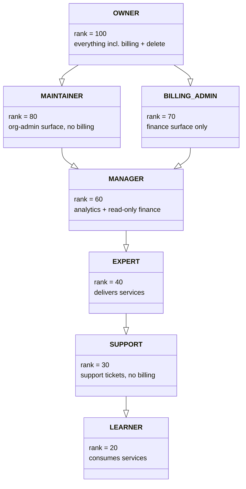
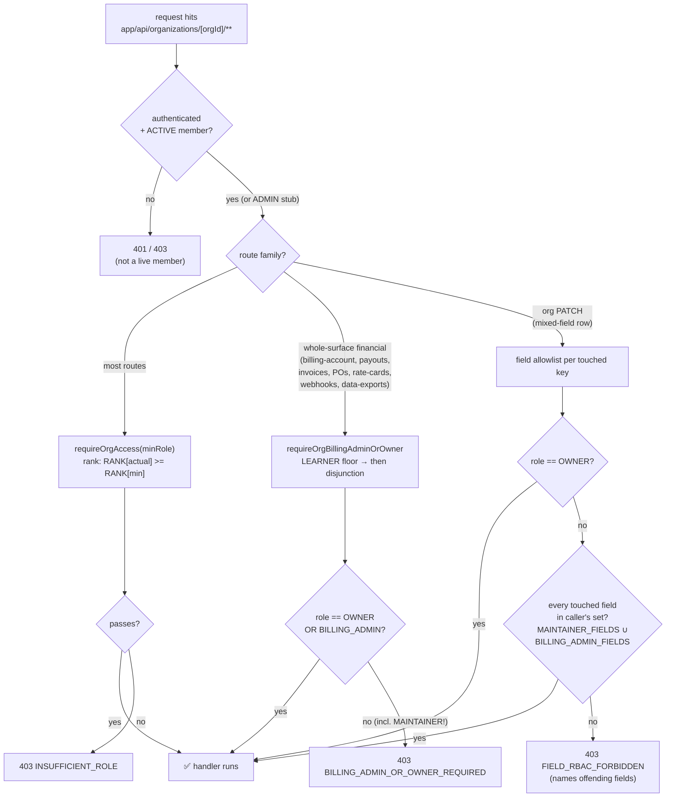

# Roles and permissions

Every membership row carries a typed `MemberRole`. The enum is unified —
there is exactly one role namespace, with values chosen to avoid any
collision with the platform-level `UserRole` enum.

## `MemberRole` (schema.prisma)

```prisma
enum MemberRole {
  OWNER
  MAINTAINER
  BILLING_ADMIN
  MANAGER
  EXPERT
  LEARNER
  SUPPORT
}
```

Prisma comments on the enum call out why the names differ from the
intuitive ones:

- `MAINTAINER` was `ADMIN`. Renamed to avoid collision with
  `UserRole.ADMIN` (platform admin).
- `BILLING_ADMIN` is the finance-team role added by PR #655 (May 2026).
  Sits between `MAINTAINER` and `MANAGER` on the rank ladder; gates
  financial routes via the dedicated `requireOrgBillingAdminOrOwner`
  helper rather than a rank comparison (see below).
- `EXPERT` was `CONSULTANT`. Renamed to avoid collision with
  `UserRole.CONSULTANT` (platform consultant user).
- `LEARNER` chosen over `MEMBER` for an explicit "receives sessions"
  semantic.

## Rank ladder

`lib/auth/role-ranks.ts` exports `ORG_ROLE_RANK`, the numeric ladder reproduced in
the table below. Each row pairs a role with its rank and a one-line summary of what
that role is typically responsible for; a higher rank can do everything a lower
rank can, with the one deliberate exception of the billing surface described
further down.

| Role            | Rank | Typical responsibility |
|-----------------|------|-------------------------|
| `OWNER`         | 100  | Everything: billing, contracts, payouts, settings, SSO, org delete. |
| `MAINTAINER`    | 80   | Members, invites, plans, programs, contracts (read), branding/identity fields, settings. **No billing, no deletion** — and SSO / domain-claims / capability + tax fields stay OWNER-only (see `MEMBER_ROLE_DESCRIPTION` in `lib/labels/org-labels.ts`: _"Members, plans, programs, and settings. No billing or deletion."_). |
| `BILLING_ADMIN` | 70   | Invoices, POs, payouts, rate cards, wallet top-ups, outbound webhooks. **No member or SSO changes.** |
| `MANAGER`       | 60   | Team analytics, seat management, read-only views of invoices/earnings/payouts/rate-cards. |
| `EXPERT`        | 40   | Delivers services on behalf of the org. |
| `SUPPORT`       | 30   | Views support tickets and assists members. No billing. |
| `LEARNER`       | 20   | Consumes services through the org's programs. |

`isAtLeastRole(actual, minimum)` (`lib/auth/role-ranks.ts`) returns
`ORG_ROLE_RANK[actual] >= ORG_ROLE_RANK[minimum]`.

The class diagram below shows the same ladder as a typed hierarchy: each role
carries its numeric rank, and the arrows point from each role up to the one
immediately above it. The ladder is deliberately sparse, in steps of roughly
twenty, so a future role can slot between two existing rungs without renumbering
the rest — which is exactly how `BILLING_ADMIN` landed at 70 between `MAINTAINER`
at 80 and `MANAGER` at 60.



The generalization arrows point from the broader role to the narrower one it
extends: `OWNER` is both a `MAINTAINER` and a `BILLING_ADMIN`, and those two
governance-orthogonal roles each extend `MANAGER`, so `OWNER` inherits every
capability on both branches. `BILLING_ADMIN` and `MAINTAINER` are siblings, not
a single rung — which is why the finance surface is gated by an explicit
disjunction rather than by rank, as the note below explains.

The numeric order of the ladder is only a capability partial-order, and it is not
the gate for the finance surface. As the next sections explain, `BILLING_ADMIN`
sits below `MAINTAINER` by rank yet reaches billing routes that `MAINTAINER`
cannot, because billing is gated by an explicit OWNER-or-BILLING_ADMIN disjunction
rather than by the rank number.

### How a request resolves to allow / deny

A new dev's first question is "given a role and a route, what actually
decides?" Three mechanisms, applied per route family. The flowchart traces an
org-scoped request through all three:



The load-bearing subtlety lives in the two right-hand branches: a
higher-ranked `MAINTAINER` is **denied** on the financial branch (it's not
`OWNER`/`BILLING_ADMIN`) and **excluded from billing fields** on the PATCH
branch (`billingEmail` / `paymentTermsDays` aren't in `MAINTAINER_FIELDS`).
Rank alone never reaches the finance surface.

### Why BILLING_ADMIN uses a disjunction gate, not a rank gate

A naïve `requireOrgAccess(orgId, { minimumRole: "BILLING_ADMIN" })`
would let `MAINTAINER` (rank 80) through on the rank comparison —
which is wrong, because `MAINTAINER` explicitly does not have billing
rights per the role description. The two roles are
governance-orthogonal: `MAINTAINER` is the org-admin surface,
`BILLING_ADMIN` is the finance surface.

The dedicated helper `requireOrgBillingAdminOrOwner` at
`lib/auth/billing-admin-gate.ts` encodes this. It first runs
`requireOrgAccess` with a `LEARNER` floor (so capability checks like
`canSponsor` still run), then applies the load-bearing role disjunction:

```ts
const role = access.member.role;
if (role !== "OWNER" && role !== "BILLING_ADMIN") {
  return {
    error: NextResponse.json(
      { error: "Forbidden", code: "BILLING_ADMIN_OR_OWNER_REQUIRED" },
      { status: 403 },
    ),
  } as const;
}
```

It deliberately does NOT pass `minimumRole: "BILLING_ADMIN"`, because that
would let `MAINTAINER` (rank 80) through on the rank comparison. Pin-down
regression: `__tests__/enterprise/billing-admin-gate.test.ts` asserts that
`MAINTAINER` is **denied** even though its rank is higher.

### Design story: why rank-70 touches billing that rank-80 cannot

This looks upside-down the first time you see it: `BILLING_ADMIN` (rank 70)
can PATCH the wallet and cut payouts, while `MAINTAINER` (rank 80) — *higher*
on the ladder — gets a 403 on those exact routes. It is deliberate, and the
reasoning is recorded in `lib/auth/billing-admin-gate.ts`:

> _"The two roles are governance-orthogonal: one is the org-admin surface,
> the other is the finance surface. A rank-based gate would conflate them.
> Hence the explicit disjunction here."_

The driver (from `MEMBER_ROLE_DESCRIPTION` in `lib/labels/org-labels.ts`):
large orgs delegate AP/GL to a finance team that needs invoice + payout +
rate-card + wallet rights **without** the ability to touch SSO, the member
roster, or org status. So the ladder ranks `BILLING_ADMIN` *above* `MANAGER`
(it has more financial privilege) but *below* `MAINTAINER` on the org-admin
axis — and the rank number is then **never used** to gate billing. Billing
routes use the OWNER ∨ BILLING_ADMIN disjunction; SSO/member routes gate at
`MAINTAINER`+ and so auto-deny `BILLING_ADMIN`. The two surfaces don't
overlap by construction.

`BILLING_ADMIN` was added by **PR #655** (the enterprise foundation; the gate
helper was wired in `f7133eaa`). The regression that pins the counter-intuitive
half down is `__tests__/enterprise/billing-admin-gate.test.ts`, which asserts
`MAINTAINER` is denied **despite** its higher rank — if someone "simplifies"
the gate to `minimumRole: "BILLING_ADMIN"` later, that test goes red.

**Who holds what at Wipro (seeded `wipro` org).** A concrete read of the three
operator tiers:

| Role | At Wipro | Sees / can do |
|------|----------|----------------|
| `OWNER` | the corporate-ops admin who created the org (the seeded `tour-owner@familiarise.dev` is an OWNER of `wipro`) | everything — capability flips, GSTIN/PAN, SSO, member roster, delete, **and** all billing |
| `BILLING_ADMIN` | a hypothetical AP clerk in Wipro's finance team | the ₹50L PO, the draft `INV-WIP-2026-0001`, NET-60 terms, rate cards, wallet — but **not** the member roster or SSO |
| `MANAGER` | a hypothetical L&D lead running the Engineer Leadership Program | team analytics, seat management, **read-only** views of invoices/earnings/payouts — no money mutation, no roster changes |

(Wipro is seeded with one OWNER membership + three LEARNERs; the
BILLING_ADMIN and MANAGER rows above are illustrative — the seed doesn't
populate every operator tier, but the gate matrix below applies the moment
one is invited.)

### Two enforcement shapes: route-level gate vs field-level gate

There are two distinct mechanisms, and both are live:

1. **Route-level disjunction gate** (`requireOrgBillingAdminOrOwner`) —
   used by routes whose *entire* surface is financial: the `billing-account`
   PATCH, wallet top-ups, invoices, POs, payouts, rate-cards, outbound
   webhook create/update/redeliver, and **data-exports**. The whole route
   is OWNER ∨ BILLING_ADMIN.

2. **Field-level gate** (per-field allowlist) — used by the org
   `PATCH /api/organizations/[orgId]` handler, where a single row mixes
   identity, branding, billing, tax, and capability fields. OWNER passes
   everything; a non-OWNER's touched fields must each fall inside the
   caller's remit or the route returns `403 FIELD_RBAC_FORBIDDEN` naming
   the offending fields:

   | Caller | May set | Source set |
   |--------|---------|------------|
   | `OWNER` | every field (incl. `canSponsor`/`canHost`, `gstin`, `pan`, `gstStateCode`, `requiresPO`, policies, `isPublic`) | — (bypass) |
   | `MAINTAINER` | `name`, `description`, `industry`, `website`, `sizeBucket`, `logo`, `bannerImage`, `primaryColor`, `secondaryColor` | `MAINTAINER_FIELDS` |
   | `BILLING_ADMIN` | `billingEmail`, `paymentTermsDays` | `BILLING_ADMIN_FIELDS` |

   The point of the disjunction surfaces here too: `MAINTAINER` (the higher
   rank) is the identity/branding surface and is deliberately **excluded
   from billing fields** (`billingEmail`, `paymentTermsDays`) — those sit
   with `BILLING_ADMIN`. Tax fields (`gstin`/`pan`/`gstStateCode`) and
   capability flips stay OWNER-only because they're in neither allowlist.

### BILLING_ADMIN gate matrix

The table below lists every route family whose gate is the OWNER-or-BILLING_ADMIN
disjunction; for each one it gives the verb and confirms that the whole route is
behind that single gate.

| Route family | Verb | Gate |
|---|---|---|
| `billing-account` | PATCH | OWNER or BILLING_ADMIN |
| `billing-account/purchase-orders` | POST | OWNER or BILLING_ADMIN |
| `billing-account/purchase-orders/[poId]` | PATCH / DELETE | OWNER or BILLING_ADMIN |
| `billing-account/invoices` | POST | OWNER or BILLING_ADMIN |
| `billing-account/invoices/[invoiceId]` | PATCH | OWNER or BILLING_ADMIN |
| `billing-account/invoices/[invoiceId]/pay` | POST | OWNER or BILLING_ADMIN |
| `billing-account/wallet/top-ups` | POST | OWNER or BILLING_ADMIN |
| `payouts` | POST | OWNER or BILLING_ADMIN |
| `payouts/[payoutId]` | PATCH | OWNER or BILLING_ADMIN |
| `rate-cards` | POST | OWNER or BILLING_ADMIN |
| `rate-cards/[cardId]` | PATCH | OWNER or BILLING_ADMIN |
| `webhooks` (Batch 3) | POST | OWNER or BILLING_ADMIN |
| `webhooks/[endpointId]` | PATCH | OWNER or BILLING_ADMIN |
| `webhooks/[endpointId]/deliveries/[deliveryId]/redeliver` | POST | OWNER or BILLING_ADMIN |
| `data-exports` | GET / POST | OWNER or BILLING_ADMIN |
| `data-exports/[exportId]/download` | GET | OWNER or BILLING_ADMIN |

### Surfaces that stay OWNER-only

- `[orgId]` DELETE (org delete + ownership transfer)
- `sso/**` (provider CRUD, settings)
- `domain-claims/**`
- `members/**` (invite, role change, removal)
- `invitations/**`
- `scim/tokens/**` (Batch 4)
- `webhooks/[endpointId]` DELETE + `webhooks/[endpointId]/rotate-secret` POST (governance-sensitive)
- `sso/break-glass` POST + DELETE (temporary SSO-enforcement bypass; see [sso-and-authentication](../20-iam-and-security/01-sso-and-authentication.md))
- `contracts/[contractId]/supersede` POST (mints the successor contract)

## `requireOrgAccess` / `requireOrgOwner`

Every API route under `app/api/organizations/[orgId]/**` uses one of
two gates from `lib/auth-helpers.ts`:

```ts
await requireOrgAccess(orgId, "LEARNER");      // any active member
await requireOrgAccess(orgId, "MAINTAINER");   // promotes
await requireOrgOwner(orgId);                  // OWNER-only
```

Platform admins (`UserRole.ADMIN`) bypass membership checks entirely;
`requireOrgAccess` returns a synthesized OWNER-rank stub membership so
admin-initiated writes still produce valid `OrgAuditLog.actorMembershipId`
values (the stub id is `__admin_stub_<userId>`).

## Gate matrix — every org-scoped API route

The table below is the exhaustive map of org-scoped routes to the minimum gate each
verb requires; read a row as "to call this verb on this route, the caller must
satisfy this gate", where a named role means that rank or higher and "OWNER or
BILLING_ADMIN" means the disjunction gate rather than a rank comparison.

| Route | Verbs | Gate |
|-------|-------|------|
| `/api/organizations` | `GET` | any authenticated user |
| `/api/organizations` | `POST` | any authenticated user (creator becomes OWNER) |
| `/api/organizations/[orgId]` | `GET` | `LEARNER` |
| `/api/organizations/[orgId]` | `PATCH`, `DELETE` | OWNER |
| `/api/organizations/[orgId]/members` | `GET` | any active member |
| `/api/organizations/[orgId]/members` | `POST` | MAINTAINER |
| `/api/organizations/[orgId]/members/[memberId]` | `GET`, `PATCH`, `DELETE` | MAINTAINER |
| `/api/organizations/[orgId]/invitations` | `GET`, `POST` | MAINTAINER |
| `/api/organizations/[orgId]/invitations/[invitationId]` | `GET`, `DELETE` | MAINTAINER |
| `/api/organizations/invitations/accept` | `POST` | any authenticated user |
| `/api/organizations/[orgId]/contracts` | `GET` | MAINTAINER |
| `/api/organizations/[orgId]/contracts` | `POST` | OWNER |
| `/api/organizations/[orgId]/contracts/[contractId]` | `GET` | MAINTAINER |
| `/api/organizations/[orgId]/contracts/[contractId]` | `PATCH`, `DELETE` | OWNER |
| `/api/organizations/[orgId]/contracts/[contractId]/supersede` | `POST` | OWNER |
| `/api/organizations/[orgId]/programs` | `GET` | any active member |
| `/api/organizations/[orgId]/programs` | `POST` | MAINTAINER |
| `/api/organizations/[orgId]/programs/[programId]` | `GET` | any active member |
| `/api/organizations/[orgId]/programs/[programId]` | `PATCH`, `DELETE` | MAINTAINER |
| `/api/organizations/[orgId]/programs/[programId]/assignments` | `GET` | any active member |
| `/api/organizations/[orgId]/programs/[programId]/assignments` | `POST` | MAINTAINER |
| `/api/organizations/[orgId]/programs/[programId]/assignments/[assignmentId]` | `GET` | any active member |
| `/api/organizations/[orgId]/programs/[programId]/assignments/[assignmentId]` | `PATCH`, `DELETE` | MAINTAINER |
| `/api/organizations/[orgId]/billing-account` | `GET` | MANAGER |
| `/api/organizations/[orgId]/billing-account` | `PATCH` | OWNER or BILLING_ADMIN |
| `/api/organizations/[orgId]/billing-account/wallet` | `GET` | MANAGER |
| `/api/organizations/[orgId]/billing-account/wallet/top-ups` | `GET` | MANAGER |
| `/api/organizations/[orgId]/billing-account/wallet/top-ups` | `POST` | OWNER or BILLING_ADMIN |
| `/api/organizations/[orgId]/billing-account/wallet/top-ups/[topUpId]` | `GET` | MANAGER |
| `/api/organizations/[orgId]/billing-account/invoices` | `GET` | MANAGER |
| `/api/organizations/[orgId]/billing-account/invoices` | `POST` | OWNER or BILLING_ADMIN |
| `/api/organizations/[orgId]/billing-account/invoices/[invoiceId]` | `GET` | MANAGER |
| `/api/organizations/[orgId]/billing-account/invoices/[invoiceId]` | `PATCH` | OWNER or BILLING_ADMIN |
| `/api/organizations/[orgId]/billing-account/invoices/[invoiceId]/pay` | `POST` | OWNER or BILLING_ADMIN |
| `/api/organizations/[orgId]/billing-account/purchase-orders` | `GET` | MANAGER |
| `/api/organizations/[orgId]/billing-account/purchase-orders` | `POST` | OWNER or BILLING_ADMIN |
| `/api/organizations/[orgId]/billing-account/purchase-orders/[poId]` | `GET` | MANAGER |
| `/api/organizations/[orgId]/billing-account/purchase-orders/[poId]` | `PATCH`, `DELETE` | OWNER or BILLING_ADMIN |
| `/api/organizations/[orgId]/rate-cards` | `GET` | MANAGER |
| `/api/organizations/[orgId]/rate-cards` | `POST` | OWNER or BILLING_ADMIN |
| `/api/organizations/[orgId]/rate-cards/[cardId]` | `GET` | MANAGER |
| `/api/organizations/[orgId]/rate-cards/[cardId]` | `PATCH` | OWNER or BILLING_ADMIN |
| `/api/organizations/[orgId]/payout-account` | `GET` | MANAGER |
| `/api/organizations/[orgId]/payout-account` | `PUT` | OWNER |
| `/api/organizations/[orgId]/earnings` | `GET` | MANAGER |
| `/api/organizations/[orgId]/payouts` | `GET` | MANAGER |
| `/api/organizations/[orgId]/payouts` | `POST` | OWNER or BILLING_ADMIN |
| `/api/organizations/[orgId]/payouts/[payoutId]` | `GET` | MANAGER |
| `/api/organizations/[orgId]/payouts/[payoutId]` | `PATCH` | OWNER or BILLING_ADMIN |
| `/api/organizations/[orgId]/sso` | `GET` | MANAGER |
| `/api/organizations/[orgId]/sso` | `PATCH` | OWNER |
| `/api/organizations/[orgId]/sso/providers` | `GET` | MANAGER |
| `/api/organizations/[orgId]/sso/providers` | `POST` | OWNER |
| `/api/organizations/[orgId]/sso/providers/[providerId]` | `GET` | MANAGER |
| `/api/organizations/[orgId]/sso/providers/[providerId]` | `DELETE` | OWNER |
| `/api/organizations/[orgId]/sso/break-glass` | `POST`, `DELETE` | OWNER |
| `/api/organizations/[orgId]/domain-claims` | `GET` | MANAGER |
| `/api/organizations/[orgId]/domain-claims` | `POST` | OWNER |
| `/api/organizations/[orgId]/domain-claims/[domain]` | `DELETE` | OWNER |
| `/api/organizations/[orgId]/hris` | `GET` | MANAGER |
| `/api/organizations/[orgId]/hris` | `PUT`, `DELETE` | OWNER |
| `/api/organizations/[orgId]/hris/sync` | `GET` | MANAGER |
| `/api/organizations/[orgId]/hris/sync` | `POST` | OWNER |
| `/api/organizations/[orgId]/hris/csv-upload` | `POST` | OWNER |
| `/api/organizations/[orgId]/consent` | `GET`, `POST`, `DELETE` | MANAGER |
| `/api/organizations/[orgId]/analytics` | `GET` | MANAGER |
| `/api/organizations/[orgId]/activity` | `GET` | MANAGER |
| `/api/organizations/[orgId]/catalog` | `GET` | MANAGER |
| `/api/organizations/[orgId]/catalog` | `POST`, `DELETE` | OWNER |
| `/api/organizations/[orgId]/catalog/search` | `GET` | MANAGER |
| `/api/organizations/[orgId]/settings` | `GET` | MANAGER (read-only wrapper) |
| `/api/organizations/[orgId]/webhooks` | `GET` | MANAGER |
| `/api/organizations/[orgId]/webhooks` | `POST` | OWNER or BILLING_ADMIN |
| `/api/organizations/[orgId]/webhooks/[endpointId]` | `GET` | MANAGER |
| `/api/organizations/[orgId]/webhooks/[endpointId]` | `PATCH` | OWNER or BILLING_ADMIN |
| `/api/organizations/[orgId]/webhooks/[endpointId]` | `DELETE` | OWNER |
| `/api/organizations/[orgId]/webhooks/[endpointId]/rotate-secret` | `POST` | OWNER |
| `/api/organizations/[orgId]/webhooks/[endpointId]/deliveries/[deliveryId]/redeliver` | `POST` | OWNER or BILLING_ADMIN |
| `/api/organizations/[orgId]/data-exports` | `GET`, `POST` | OWNER or BILLING_ADMIN |
| `/api/organizations/[orgId]/data-exports/[exportId]/download` | `GET` | OWNER or BILLING_ADMIN |
| `/api/organizations/[orgId]/checkout/overage-preview` | `GET` | any active member |
| `/api/organizations/[orgId]/verification/resubmit` | `POST` | MAINTAINER |
| `/api/admin/organizations/[orgId]/verify` | `POST` | platform ADMIN (`action: VERIFY \| REJECT \| SUSPEND \| REACTIVATE \| DEACTIVATE`) |

## Role narrowing at the API boundary

`MemberRole` is the single vocabulary — no aliases, no back-compat
mapping. Strings crossing the API boundary (BetterAuth `Invitation.role`,
query params) are narrowed via `MemberRoleSchema` from
`lib/labels/org-labels.ts`:

```ts
import { MemberRoleSchema } from "@/lib/labels/org-labels";

const parsed = MemberRoleSchema.safeParse(invitation.role);
if (!parsed.success) {
  return NextResponse.json({ error: "Unknown role" }, { status: 400 });
}
// parsed.data is typed as MemberRole here.
```

No legacy `ORG_*` aliases are accepted. The DB is pre-MVP and will be
reset; seeded roles use canonical values.

## Membership status

`MemberStatus` controls whether a role is live. The table below gives one row per
enum value and explains what each status means for access; `requireOrgAccess`
rejects anything that is not `ACTIVE`.

| Value       | Meaning |
|-------------|---------|
| `PENDING`   | The invitation was accepted or the member was HRIS auto-provisioned but the membership is not yet activated (rare). |
| `ACTIVE`    | The role is live. |
| `SUSPENDED` | The membership is temporarily blocked, and the API returns a 403 with `"Membership is suspended"`. |
| `REMOVED`   | Terminal. The row is retained for audit. |
| `ERASED`    | DPDP §12 tombstone, set by the erasure pipeline when a user exercises right-to-erasure. The row remains for audit and financial-trail integrity, but the user identifiers are scrubbed to pseudonymous values (see `User.erasedAt`). |

## Zod narrowers for self-service

`lib/labels/org-labels.ts` exposes the subset of roles allowed at self-service
onboarding:

```ts
SelfServiceMemberRoleSchema = z.enum([
  "OWNER",
  "MAINTAINER",
  "BILLING_ADMIN",
  "MANAGER",
  "LEARNER",
]);
```

`EXPERT` and `SUPPORT` are deliberately excluded from the self-service set. `EXPERT`
needs `canHost=true` plus the invite-driven EXPERT entry (see `expert-lifecycle`),
and `SUPPORT` is an operator role that only an existing OWNER can assign from
Settings. `BILLING_ADMIN` is in the self-service set because an org that delegates
its finance surface needs to be able to invite that role through the ordinary
member flow.

## LEARNER ↔ EXPERT is disjoint

LEARNER and EXPERT are treated as disjoint roles on a single
`Membership`. The server refuses `PATCH /members/[memberId]` and the
reactivation branch of `POST /members` when the requested transition
is `LEARNER → EXPERT` or `EXPERT → LEARNER`. The policy lives in
`lib/enterprise/role-transitions.ts::isBlockedRoleTransition`; callers
that violate it receive a `409 ROLE_TRANSITION_BLOCKED`, which the
dashboard translates through `humanizeOrgError` (see
`lib/labels/org-errors.ts`) into: _"Members cannot switch between
Learner and Expert roles. Remove the member and re-invite them with
the new role instead."_

The two roles wire the user up to different profile models
(`ConsulteeProfile` vs `ConsultantProfile`) and different earnings
flows, so flipping them in place would leave stale FKs. Removing +
re-inviting forces a fresh Membership row with the right profile
links and a clean audit trail. The pre-Arch-4 "apply to deliver"
workflow — which used to live on `Membership.applicationNote /
appliedAt / approvedAt / approvedBy` — was removed alongside this
rule; those columns are gone (see `expert-lifecycle`).

### The three layers, and which cross-setups are allowed

Confusion recurs here because three layers share vocabulary, so this
section records the model and the decision explicitly. The platform
profiles (`ConsultantProfile`, `ConsulteeProfile`) are global, per-User
identities and are **not** mutually exclusive: one person can both
deliver and consume on the platform, and each profile is unique per
user. The workspace roles are the `MemberRole` enum on `Membership`,
and EXPERT/LEARNER are the two enum values that bridge a workspace
membership to one of those global profiles; the operator roles (OWNER,
MAINTAINER, BILLING_ADMIN, MANAGER, SUPPORT) carry no profile linkage
at all. The following table states what is allowed across those layers.

| Setup | Allowed? | Why |
|---|---|---|
| One user holds both profiles platform-wide | Yes | Profiles are global and non-exclusive. |
| EXPERT in org A while LEARNER in org B | Yes | Each org gets its own Membership row with its own role and profile link; multi-org experts and learners are first-class (see the scenarios doc). |
| EXPERT and LEARNER inside the same org | No — by decision (2026-06-07) | `@@unique([userId, organizationId])` allows one role per org, and the LEARNER↔EXPERT transition is blocked. Allowing a dual-side membership would make `ProgramAssignment` attribution ambiguous and open self-dealing (an expert consuming their own org's sponsored budget). The remediation is remove + re-invite, or a second org for genuinely separate capacities. |
| Operator role plus sponsored consumption in the same org | No | Same single-role constraint; operators have no consumer profile linkage. An operator who needs sponsored sessions takes a LEARNER membership in a different org or books personally funded sessions. |

A fourth layer is easy to mistake for a gate on the three above, so it is worth stating plainly that it is not one. `UserRole` is a single nullable scalar on `User` holding one of CONSULTANT, CONSULTEE, ADMIN, STAFF or ORG_WORKSPACE, and it decides two things only: which dashboard a newly onboarded user lands on, and which back-office surfaces they reach through `lib/auth/backoffice-permissions.ts`. No code anywhere reads it when assigning a `MemberRole`. Identity on this platform is driven by which profiles exist, not by that field, which is why the dashboard switcher offers every facet a user holds rather than the single one `UserRole` names. A user whose `UserRole` is CONSULTANT can therefore hold a LEARNER membership without contradiction, and does so routinely.

Acquiring the two profiles is deliberately asymmetric, and the asymmetry is the safeguard rather than an inconsistency. Consuming is cheap to grant, so accepting a LEARNER invitation lazy-creates a `ConsulteeProfile` on the spot — the click is the user's own consenting action and the profile carries nothing that needs verifying. Delivering is not, so accepting an EXPERT invitation refuses to lazy-create a `ConsultantProfile` and fails with `NOT_A_CONSULTANT`; a consultant identity carries domain, rates, verification state and payout prerequisites that no invitation click can substitute for. The practical effect is that a consultant can become a learner in a single step, while a consultee becomes an expert only by building the delivering identity first.

One consequence of that openness needed its own guard. Because the two profiles are independent, a member can hold a `ConsultantProfile` with plans of their own while holding a LEARNER membership in a sponsoring organization, and nothing about that combination is blocked or should be. What must be blocked is the specific act it enables: booking one's own plan. The same-org EXPERT/LEARNER rule in the table above does not reach it, because that rule governs a single `Membership` row and this needs no EXPERT membership at all — only a consultee profile and a plan. Left unguarded, a sponsored member could book their own session against the organization's credit pool and route the sponsor's money into their own payout account. `revalidateInsideLock` in `lib/payments/operations/checkout.ts` therefore refuses any checkout where the plan's owning `ConsultantProfile` is the booking user's own, under the same distributed lock that enforces the ADR 18 panel and exclusivity checks, and for every funding path rather than only the sponsored ones.

### Who creates the identity: the who-is-acting rule

Identity creation follows one rule, settled in #819: **creating a profile
requires the user's own action, while an admin acting on someone else's
behalf requires the identity to already exist.** Concretely, the admin
direct-add surface (`POST /members`) refuses both roles when the matching
profile is missing (`NOT_A_CONSULTANT` / `NOT_A_CONSULTEE`), because an
org admin's click must never mint a platform identity for somebody else.
Invitation accept is the user's own consenting click, so it lazy-creates
the lightweight `ConsulteeProfile` for LEARNER (this is one of the
sanctioned creation points named in `lib/auth.ts`) but still refuses
EXPERT when no `ConsultantProfile` exists, because a consultant identity
carries domain, rate, verification, and payout prerequisites that no
invite click can substitute for. SSO JIT auto-join keeps its own
lazy-create path as a separately authorized provisioning channel.

## Per-role landing in `/dashboard/organization/[orgId]`

The bare org route is no longer a one-way bounce-to-personal for consumer
roles. The entry-point router at `app/dashboard/organization/[orgId]/page.tsx` chooses the
destination from the role. The table below reads one role per row and gives the
page it lands on and the reason for that choice.

| Role | Lands on | Why |
|------|----------|-----|
| `OWNER` / `MAINTAINER` / `MANAGER` / `SUPPORT` | `/home` | Operator overview (analytics, members, billing). |
| `LEARNER` | `/my-program` | Per-cycle ProgramAssignment + utilization. The only in-org consumer surface for sponsored bookings. |
| `EXPERT` | `/compensation` | Membership.payoutRecipient + RateCard split + recent earnings on org-tagged payments. |
| no membership | personal dashboard fallback (`resolvePersonalDashboardHref` → `/dashboard`) | Stranger to this org — bounce out entirely. |

Both `/my-program` and `/compensation` are read-only in v1. A LEARNER
cannot self-assign to a Program; an EXPERT cannot flip their own
`payoutRecipient`. Mutations remain on operator pages. Membership also
carries an `exclusiveEngagement` boolean (ADR 18) recording an
org-declared exclusivity arrangement for internal consultants. This was
an unenforced schema stub when it landed, but it is no longer: as of
2026-07-11 checkout rejects a booking of the consultant's independent
plans when an `ACTIVE` membership carries the flag (#982), and the
schema comment says the same. What remains unbuilt is the other half of
exclusivity — filtering those plans out of marketplace listings — so the
flag still must not surface in any UI that implies discovery is
suppressed. The "Personal
Dashboard" footer chip on the sidebar (`resolvePersonalDashboardHref`)
stays so consumers can hop back to their personal surface without
hunting for the URL.

## Related docs

The [organization-lifecycle](05-organization-lifecycle.md) doc describes what a
membership looks like in each org status, and the
[expert-lifecycle](../30-programs-and-lifecycle/03-expert-lifecycle.md) doc explains
how the EXPERT role gets populated. The
[sso-and-authentication](../20-iam-and-security/01-sso-and-authentication.md) doc
covers `defaultRoleForAutoJoin` on `OrganizationSSOSettings`, and the
[API reference](../50-operations/01-api-reference.md)
carries the exhaustive table of the audit actions each route emits.
