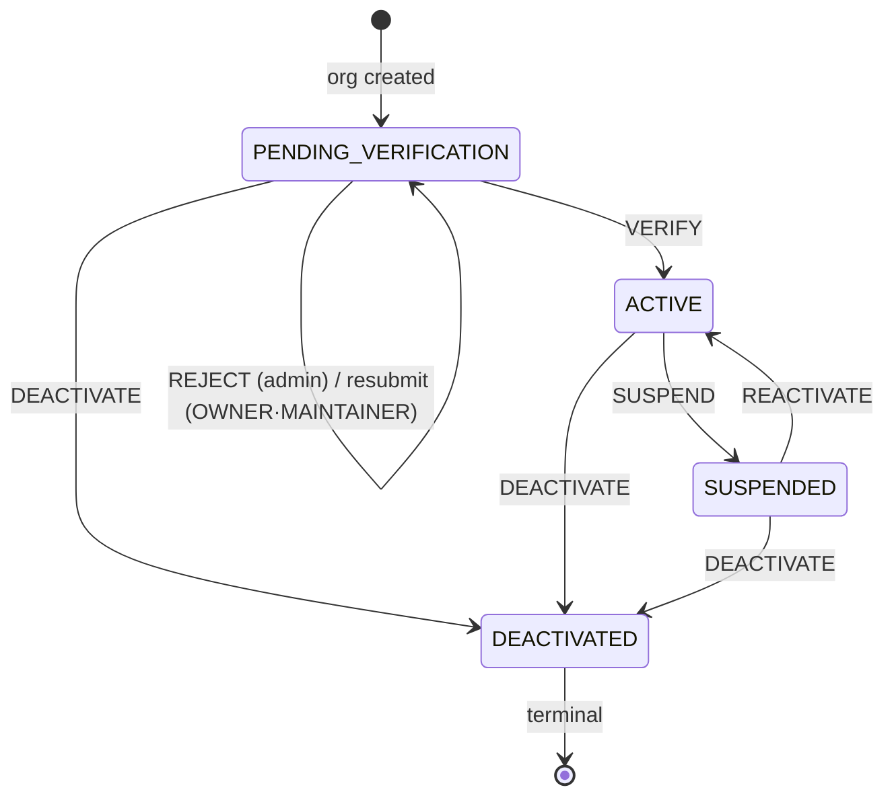
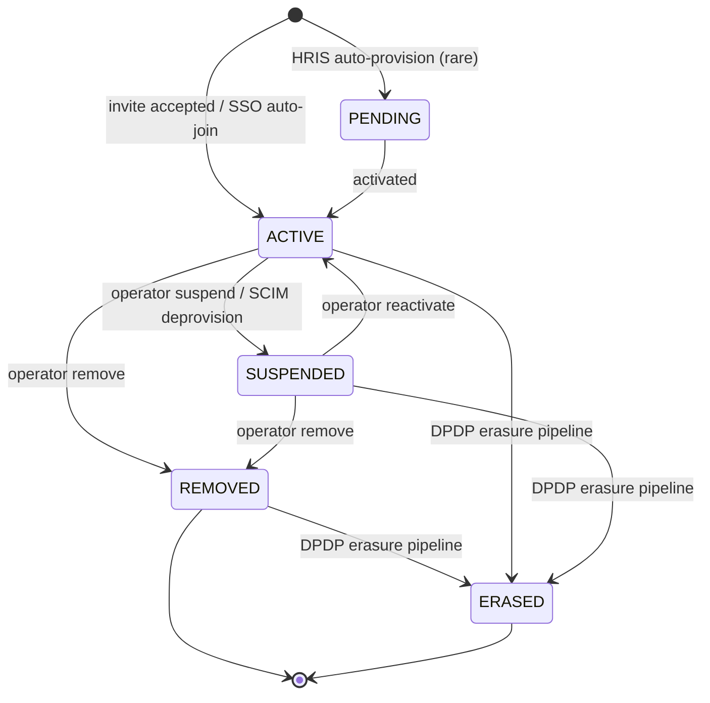
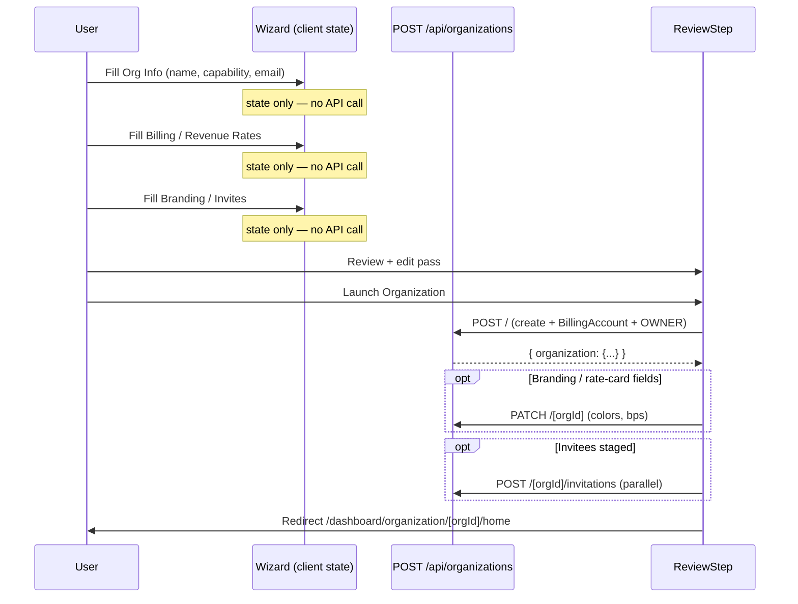
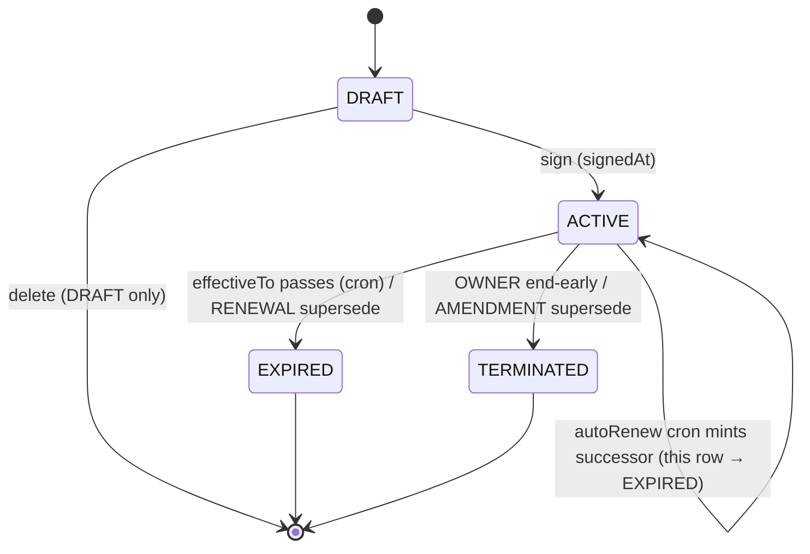
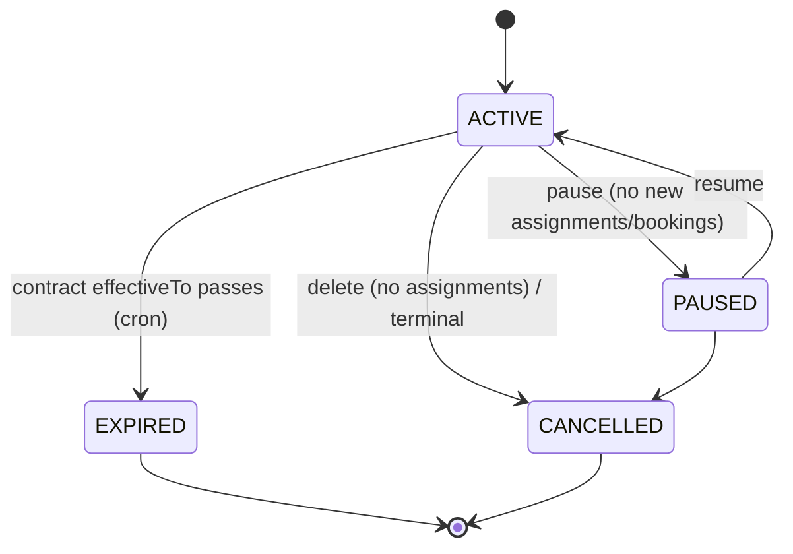
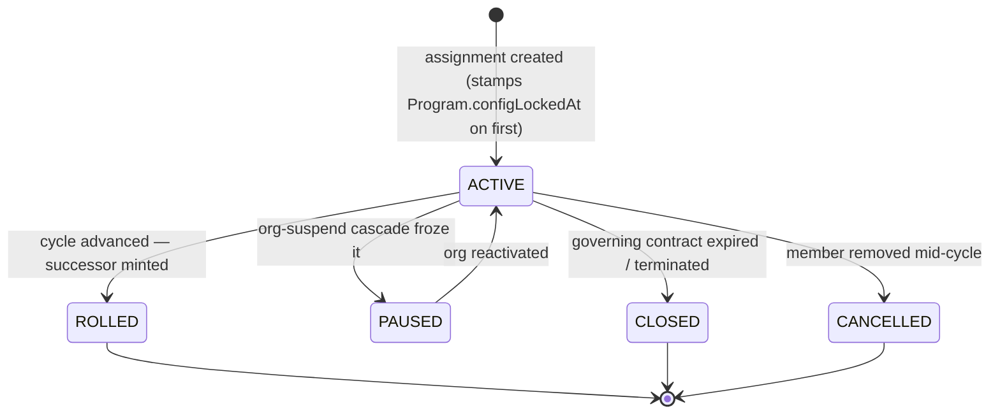

# Organization lifecycle

Three models carry their own lifecycle state machine in the enterprise
layer: `Organization`, `Contract`, and `Program`. Each is driven by a
Prisma enum and guarded by explicit allowed-transition tables in the
API.

## `OrgStatus` state machine

```prisma
enum OrgStatus {
  PENDING_VERIFICATION
  ACTIVE
  SUSPENDED
  DEACTIVATED
}
```



Transitions are gated by `POST /api/admin/organizations/[orgId]/verify`
(`app/api/admin/organizations/[orgId]/verify/route.ts`). The route
accepts `action: VERIFY | REJECT | SUSPEND | REACTIVATE | DEACTIVATE`, where a
missing action or an empty `{}` body defaults to `VERIFY` so legacy callers keep
their old behaviour. The route enforces the allowed-action table below; read each
row as the set of actions permitted from a given starting status, and note that
`DEACTIVATED` is terminal and admits none.

| From                   | Allowed actions                   |
|------------------------|-----------------------------------|
| `PENDING_VERIFICATION` | `VERIFY`, `REJECT`, `DEACTIVATE`  |
| `ACTIVE`               | `SUSPEND`, `DEACTIVATE`           |
| `SUSPENDED`            | `REACTIVATE`, `DEACTIVATE`        |
| `DEACTIVATED`          | none — terminal                   |

Every action through this route emits an `OrgAuditLog` row in the `SYSTEM`
category. `VERIFY` emits `AUDIT_ACTIONS.SYSTEM.VERIFIED`, `SUSPEND` emits
`SUSPENDED`, `REACTIVATE` emits `REACTIVATED`, `DEACTIVATE` emits `DEACTIVATED`, and
`REJECT` emits `VERIFICATION_REJECTED`. The sibling action
`VERIFICATION_RESUBMITTED` is not emitted here; it is emitted by the separate
resubmit route described next.

### Verification reject → resubmit loop

`REJECT` is **not a status move** — it's a sub-state of
`PENDING_VERIFICATION` (#779 §A). The admin must supply a `reason`; the
route stamps `Organization.verificationReason` + `verificationRejectedAt`
and leaves `status = PENDING_VERIFICATION`. The OWNER/MAINTAINER then fixes
the issue and calls
`POST /api/organizations/[orgId]/verification/resubmit` (MAINTAINER+),
which only succeeds when the org is still `PENDING_VERIFICATION` **and**
`verificationRejectedAt` is non-null (otherwise `409 NOTHING_TO_RESUBMIT`).
Resubmit bumps `verificationSubmittedAt` and clears
`verificationReason` + `verificationRejectedAt`, so the admin queue picks
it up fresh. `VERIFY` clears the same sub-state on the way to `ACTIVE`.
There is **no** `RESUBMIT` enum value — the loop is carried entirely by
the three nullable timestamp/reason columns.

#### Walkthrough: IIT Madras fails verification, fixes its GSTIN, resubmits

Concrete trace of the reject→resubmit loop using the seeded hybrid org
(`iit-madras`). Every stamp below is a column on `Organization`, not a status
move:

1. IIT submits for verification — `status = PENDING_VERIFICATION`,
   `verificationSubmittedAt` stamped.
2. A platform admin spots a typo in the GSTIN (`33AAACT5678M1Z9` mistyped) and
   calls the verify route with `action: REJECT` + a `reason`. The route stamps
   `verificationReason` + `verificationRejectedAt` and **leaves**
   `status = PENDING_VERIFICATION` — REJECT is a sub-state, not a transition.
3. IIT's OWNER (the dean) or a MAINTAINER fixes the GSTIN via
   `PATCH /api/organizations/[orgId]` (tax fields are OWNER-only; GSTIN is one
   of them) and calls
   `POST /api/organizations/[orgId]/verification/resubmit` (MAINTAINER+).
   The resubmit only succeeds because the org is still
   `PENDING_VERIFICATION` **and** `verificationRejectedAt` is non-null;
   otherwise it would 409 `NOTHING_TO_RESUBMIT`.
4. Resubmit bumps `verificationSubmittedAt`, clears `verificationReason` +
   `verificationRejectedAt` — the admin queue picks it up fresh.
5. Admin calls `action: VERIFY` → `status = ACTIVE`, the same sub-state
   columns cleared on the way through. Now IIT's WALLET top-ups and
   `CREDIT_POOL` bookings can flow.

The whole loop is carried by three nullable timestamp/reason columns and
**zero** new enum values — there is no `RESUBMIT` `OrgStatus`. That's the
design choice the next section unpacks.

## What each status allows

`PENDING_VERIFICATION` is the default on org creation. In this status the org owner
can configure settings, set up the `BillingAccount`, invite members, and sketch
contracts, and `requireOrgAccess` still lets members in. Payments and payouts are
not intended to flow until an admin flips the status to `ACTIVE`. The matching
constant in code is `OPERATIONAL_ORG_STATUSES` in `lib/enterprise/org-status.ts`,
which counts `PENDING_VERIFICATION` and `ACTIVE` as the statuses where the org
exists and may transact.

`ACTIVE` is the only status in which every feature is live, and it is the sole
member of `BILLABLE_ORG_STATUSES`.

`SUSPENDED` leaves the org record accessible but expects each caller to enforce its
own read-only guards, and the suspension reason is captured in the
`OrgAuditLog.details.reason` field. A suspended org keeps dashboard read access so
an OWNER can resolve the suspension cause, but it cannot onboard new members.

`DEACTIVATED` is terminal: `requireOrgAccess` rejects every caller with a
`403 "Organization has been deactivated"`. The row is retained for audit, and
admins use this status instead of `DELETE` whenever the org has any contracts,
invoices, purchase orders, or earnings.

## `MemberStatus` state machine

The `Organization` status above governs the org as a whole; each individual
`Membership` carries its own `MemberStatus`, which governs whether that one member's
role is live. The enum has five values — `PENDING`, `ACTIVE`, `SUSPENDED`,
`REMOVED`, and `ERASED` — and `requireOrgAccess` admits a caller only when their
membership is `ACTIVE`.

```prisma
enum MemberStatus {
  PENDING
  ACTIVE
  SUSPENDED
  REMOVED
  ERASED
}
```



A membership is born in one of two states. The ordinary invite-accept flow and the
SSO auto-join flow both create the row directly in `ACTIVE`, so the role is live
immediately. The rarer `PENDING` entry exists for HRIS auto-provisioning, where a
directory sync stages the member ahead of activation; the transition to `ACTIVE`
fires when the membership is activated.

The transition from `ACTIVE` to `SUSPENDED` is triggered either by an operator
suspending the member or by a SCIM deprovision, which suspends rather than erases so
the identity stays re-linkable. The reverse, `SUSPENDED` back to `ACTIVE`, is an
operator reactivation. While suspended, the member's role is inert and the API
returns a 403.

The transition to `REMOVED` is triggered by an operator removing the member, and it
can be reached from either `ACTIVE` or `SUSPENDED`. `REMOVED` is terminal for access
purposes — the row is kept only for the audit trail — and removing a member
mid-cycle is what cascades the member's `ACTIVE` program assignments to `CANCELLED`
(see the `AssignmentStatus` section below).

The transition to `ERASED` is triggered by the DPDP §12 erasure pipeline when a user
exercises their right to erasure. It can be reached from `ACTIVE`, `SUSPENDED`, or
`REMOVED`, and like `REMOVED` it keeps the row for financial-trail integrity while
scrubbing the user identifiers to pseudonymous values (the partner timestamp is
`User.erasedAt`).

## Deletion

`DELETE /api/organizations/[orgId]` (`app/api/organizations/[orgId]/route.ts`)
is owner-only and refuses if the org has **any** of:

- `contracts` (any status)
- `invoices`
- `purchaseOrders`
- `earnings`

The error message tells the caller to use the admin deactivate path
instead. This is not a compliance rule — it's an audit-trail guarantee.

## Organization creation

`POST /api/organizations` (`app/api/organizations/route.ts`) runs a
single Prisma transaction that:

1. Validates a unique lower-case slug.
2. Creates the `Organization` with `status = PENDING_VERIFICATION`. The
   id is generated upfront (`randomUUID()`) so the `BillingAccount` can
   reference it in the same tx; the group-hierarchy columns
   (`parentOrganizationId` / `rootOrganizationId`) are left `null` —
   they're schema-only and inert in v1 (see
   [hierarchy](06-hierarchy.md)).
3. If `canSponsor=true`, creates the `BillingAccount` with the chosen
   `fundingSource`. `walletBalance = 0` is set when the source is
   `WALLET`, and `null` otherwise.
4. Creates an `OWNER` `Membership` row AND a matching BetterAuth `Member`
   row, bridged via `Membership.betterAuthMemberId`.
5. Upserts an `OrgWorkspaceProfile` for the creator (one row per user who
   operates an org, shared across multiple orgs) and stamps
   `User.orgWorkspaceProfileId`. The response body includes
   `orgWorkspaceProfileId` so the client can land the user on
   `/dashboard/org-workspace/:id/home` without a follow-up fetch.
6. Writes the first `OrgAuditLog` row (category `MEMBER`, action
   `MEMBER_ADDED`).

If `canSponsor || canHost` is false the request is rejected at the Zod
boundary.

### Wizard flow: commit-on-review

The UI wizard at `components/organization/create-wizard/` **defers the
POST to the final Review step's "Launch" action**. Earlier steps
accumulate state in local React state only — dropping out before
Review leaves zero rows in the database. This avoids orphan
`Organization` records from users who bail mid-setup.



If `Launch` fails after the POST succeeded but before the PATCH or
invites land, the wizard keeps `initialData.orgId` in state so the
retry hits the same org row — the POST path is short-circuited and the
retry is fully idempotent.

## `Contract` lifecycle

```prisma
enum ContractStatus {
  DRAFT
  ACTIVE
  EXPIRED
  TERMINATED
}
```

This doc is the state-machine **overview**. The deep contract mechanics
(supersession terms math, lock fields, cron internals) live in
[contract-lifecycle](../30-programs-and-lifecycle/07-contract-lifecycle.md).



- `DRAFT` → `ACTIVE` via `PATCH /api/organizations/[orgId]/contracts/[contractId]`
  (OWNER only). The handler sets `signedAt = now()` and flips the status.
  `autoRenew` is a safe forward-looking toggle and stays editable on an
  ACTIVE contract; the money/term fields (`effectiveFrom/To`,
  `paymentTermsDays`, `rateCardId`, `billingAccountId`) lock once the
  contract leaves DRAFT or starts billing (`LOCKED_CONTRACT_FIELDS` in
  `lib/enterprise/config-lock.ts`).
- `ACTIVE` → `EXPIRED` when `effectiveTo` passes, set by the
  `jobs/contracts/expire-contracts.ts` cron
  (`.github/workflows/expire-contracts.yml`). Earnings already snapshot
  their `rateCardId` + bps so in-flight settlement isn't affected.
- `ACTIVE` → `TERMINATED` is an OWNER-initiated **end-early** (PATCH
  `status=TERMINATED`). Programs attached to a terminated/expired contract
  can't accept new bookings (`POST /programs` refuses to attach to a
  TERMINATED/EXPIRED contract).

**Auto-renew.** When `autoRenew=true` and `effectiveTo` passes, the
`jobs/contracts/auto-renew-contracts.ts` cron
(`.github/workflows/auto-renew-contracts.yml`) renews instead of letting
expiry run: it claims the row by stamping `autoRenewedAt` (the claim
doubles as a distributed lock — idempotent across replicas), mints a
`RENEWAL` successor (same org / billing account / terms, fresh period),
and flips the old row to `EXPIRED` with the supersession chain set. So an
auto-renewing contract never reaches `expire-contracts` with anything left
to do.

**Supersession chain.** Contracts are immutable once in use, so changing
terms means minting a successor and retiring the old row, recorded via:

- `supersededByContractId` (`@unique`) — old row points forward to the new
- `supersededAt` — when the chain was cut
- `supersessionReason: AMENDMENT | RENEWAL | TERMINATION_REPLACEMENT`

`POST /api/organizations/[orgId]/contracts/[contractId]/supersede` (OWNER)
mints the successor and re-points the programs onto it (so the cycle engine
keeps rolling their assignments), while invoices stay on the old
contract — the money trail rides the term that billed it. The route accepts
`reason: AMENDMENT | RENEWAL`: AMENDMENT cuts over now and retires the old
row → `TERMINATED`; RENEWAL chains off the old `effectiveTo` and retires it
→ `EXPIRED`. `TERMINATION_REPLACEMENT` is enum-reserved but not yet a
supersede-route option. The `@unique` on `supersededByContractId` is the
double-run backstop. Full term-math: see
[contract-lifecycle](../30-programs-and-lifecycle/07-contract-lifecycle.md).

**EXPIRED / TERMINATED cascade.** Retiring a contract (whether via the cron
or an end-early PATCH) takes its dependents down **in the same
transaction**, so nothing is left drawing on a dead contract:

- the contract's `ACTIVE` programs → `EXPIRED`
- their still-`ACTIVE` assignments → `CLOSED` (the cron also pins
  `periodEnd = now`)

`DELETE /api/organizations/[orgId]/contracts/[contractId]` is only
permitted on `DRAFT` contracts; anything else must transition to
`TERMINATED`.

Each transition emits an `OrgAuditLog` entry in the `CONTRACT` category
via `AUDIT_ACTIONS.CONTRACT.{CONTRACT_CREATED, CONTRACT_SIGNED,
CONTRACT_TERMINATED, CONTRACT_EXPIRED, CONTRACT_SUPERSEDED}`.

## `Program` lifecycle

```prisma
enum ProgramStatus {
  ACTIVE
  PAUSED
  EXPIRED
  CANCELLED
}
```



- `PAUSED` stops new `ProgramAssignment`s and new bookings against
  existing assignments. Existing sessions already in-flight are not
  cancelled.
- `EXPIRED` is driven by the contract `effectiveTo` cascade — the
  `expire-contracts` / `auto-renew-contracts` crons flip ACTIVE programs
  to EXPIRED in the same transaction that retires the contract (see the
  Contract section above).
- `CANCELLED` is a terminal state set by
  `DELETE /api/organizations/[orgId]/programs/[programId]` (MAINTAINER)
  when there are no assignments. If assignments exist, the route flips
  to `CANCELLED` status rather than hard-deleting.

A program with `configLockedAt` set is never hard-deleted (financial
history rides on it); `archivedAt` is the soft-delete that hides it from
active lists. See [funding-and-programs](03-funding-and-programs.md).

`POST /api/organizations/[orgId]/programs/[programId]/assignments`
only accepts assignments when `program.status = ACTIVE`.

## `AssignmentStatus` lifecycle (summary)

Each `ProgramAssignment` carries its own status (#779 §A — previously
inferred from `periodEnd` vs now). At a glance:

```prisma
enum AssignmentStatus {
  ACTIVE
  ROLLED
  PAUSED
  CLOSED
  CANCELLED
}
```



- `ROLLED` — the nightly cycle engine advanced the period: it minted a
  fresh `ACTIVE` successor (zeroed `engagementsUsed`/`consumedPaise`) and
  pointed the closing row at it via `rolledToAssignmentId` (`@unique`) +
  `rolledAt` (the idempotency gate).
- `CLOSED` — the contract went `EXPIRED`/`TERMINATED` and the cascade
  closed the assignment (no successor).
- `PAUSED` / `CANCELLED` — org-suspension freeze and mid-cycle member
  removal, respectively.

The roll-vs-close decision, period math, and rollover chain are detailed in
[cycle-engine-and-rollover](../30-programs-and-lifecycle/08-cycle-engine-and-rollover.md)
(`lib/enterprise/cycle-engine.ts` + `jobs/billing/advance-program-cycles.ts`).

## Design decisions & trade-offs

Three choices in this doc share one principle — *don't mutate a row whose
history something else depends on; mint a new row and chain.*

- **REJECT is a sub-state, not an `OrgStatus`.** Adding a `REJECTED` enum
  value would force every status `switch` to handle it and would lose the
  reason/timestamp once the org re-entered the queue. Instead three nullable
  columns (`verificationReason` / `verificationRejectedAt` /
  `verificationSubmittedAt`) overlay `PENDING_VERIFICATION` (#779 §A). Cost:
  callers must read the columns, not just the status, to know an org was
  bounced.
- **Supersede contracts, don't edit them.** A contract's money/term fields
  lock once it leaves DRAFT (`LOCKED_CONTRACT_FIELDS`). Amending terms mints a
  fresh `Contract` and points the old row forward via
  `supersededByContractId` (`@unique`) — because in-flight earnings and
  invoices snapshot the term that billed them, and a retroactive edit would
  rewrite settled money. The `@unique` on the forward pointer is also the
  double-run backstop (a racing supersede can't fork the chain). The same
  immutable shape governs `RateCard` bumps and `Program` config (#779 §A,
  CRUD completeness landed in `e454d429`). Cost: reading a contract's full
  history means walking the chain, not reading one row.
- **Cascade on terminate runs in the same transaction.** When a contract goes
  `EXPIRED`/`TERMINATED`, its `ACTIVE` programs → `EXPIRED` and their
  still-`ACTIVE` assignments → `CLOSED` **inside the one tx** (the cron also
  pins `periodEnd = now`). If the cascade were a follow-up job, a crash
  between steps would leave an assignment still drawing on a dead contract — a
  *zombie assignment*, the exact bug the cycle engine + cascade work killed
  (#779 §A/§B, `52a6d37f`; tracked `✅` in
  [subsystem-checklist](../90-audits/02-subsystem-checklist.md) under
  "contract-expiry/termination cascade"). Cost: a larger transaction holding
  more row locks — acceptable because termination is rare and operator-driven.

## Related docs

The [organization-types](02-organization-types.md) doc explains how capability
flips also gate status mutations, since an org cannot disable `canSponsor` while it
still holds a non-zero wallet balance. The
[sso-and-authentication](../20-iam-and-security/01-sso-and-authentication.md) doc
covers SSO enforcement for `PENDING_VERIFICATION` orgs, and
[programs](../30-programs-and-lifecycle/02-programs.md) describes the program subtypes
that sit behind this lifecycle.
