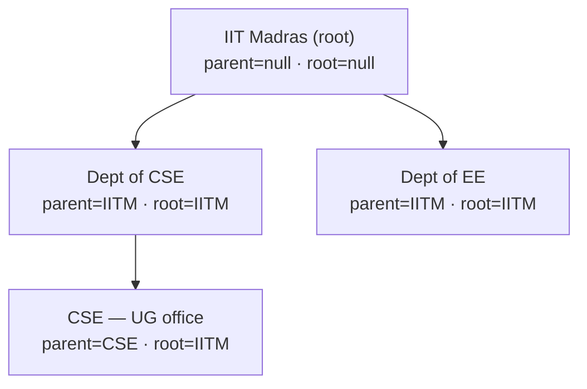

# Organization hierarchy

> **Status update (2026-07-17, #705 schema freeze):** the schema-only
> group-hierarchy columns described below (`parentOrganizationId`,
> `rootOrganizationId`, and the `OrgHierarchy` self-relation) have been
> **dropped**. A repo-wide grep confirmed they had zero readers, so they were
> removed rather than carried as inert columns through the launch freeze.
> Subsidiary scoping for a conglomerate buyer remains a future structural change
> if the demand materializes. The rest of this document is retained as historical
> design context for that eventual work.

This doc covers the (now-removed) group-hierarchy columns on `Organization`
(#771 D3) and explains what was, and was not, wired.

> 🟡 **Gap:** the subtree-scoping work that would make hierarchy real —
> population on create, the `requireOrgAccess` subtree scope, the helper functions,
> and the consolidated-reporting roll-up — is deferred to the #771 group-billing
> epic. Note that the columns are **gone**, not inert: an earlier version of this
> block said "present and inert", which stopped being true when #705 dropped them
> (corrected in #1132). There is no hierarchy in the schema today, so there is
> also no inheritance, no cycle risk and no depth bound to reason about.

**Historical design context — none of this describes the current schema.** The
original v1 design gave `Organization` two self-relation hierarchy columns,
`parentOrganizationId` and `rootOrganizationId`, so that a future
conglomerate-buyer rollout for Tata-, Reliance-, or Birla-style subsidiary groups
could land without a structural migration. Both columns were nullable and inert:
no code read or wrote them, and the group-billing and subsidiary-scoping APIs
that would have consumed them returned 501. They were dropped before launch (see
the status note above); the schema below is preserved as the shape a future
implementation would start from, not as a description of `prisma/schema.prisma`.

These columns were dropped in #768 (`4f80bac5` —
_"drop Organization hierarchy (parentId/rootId/depth)"_, which also deleted
`lib/api/organizations/hierarchy.ts` and the depth column) and deliberately
re-added in #771 D3 once a conglomerate buyer became a near-term prospect —
the cost of the **second** migration on a live table was the lesson that
motivated keeping the columns this time, even with the UI deferred. The
helpers that the drop removed have **not** come back; only the schema columns
did (see "What is NOT implemented" below).

## What the tree would look like (hypothetical, UI deferred)

The shape these columns exist to support — a conglomerate parent with
subsidiary orgs. Nothing below is wired in v1; this is purely what
`parentOrganizationId` / `rootOrganizationId` would encode once the
group-billing work (#771) ships:



Note the invariant the denormalised `rootOrganizationId` buys: every
descendant points its `root` at the **group root** (IITM), not its immediate
parent — so "every session booked by any IITM subsidiary this quarter" is a
flat `WHERE rootOrganizationId = '<iitm-root-id>'` instead of a recursive CTE.
The root org leaves both columns `null` rather than self-referencing (v1
runtime behaviour; see "Creation invariants" below). **This tree cannot be
created in v1** — `POST /api/organizations` accepts no `parentId` and every
org it mints is a flat, null-hierarchy root. IIT Madras is used here only
because it's the seeded campus org; the departments are illustrative.

## Schema

```prisma
model Organization {
  parentOrganizationId String?
  parentOrganization   Organization?  @relation("OrgHierarchy", fields: [parentOrganizationId], references: [id], onDelete: SetNull)
  childOrganizations   Organization[] @relation("OrgHierarchy")
  rootOrganizationId   String? // denormalized group root for fast subsidiary scoping
  ...
}
```

`parentOrganizationId` is the direct parent and is nullable, so root and
standalone orgs leave it `null`. Its relation is declared with `onDelete: SetNull`,
which means deleting a parent orphans its subsidiaries rather than cascading the
delete down the tree. `rootOrganizationId` is the denormalised group-root id,
intended for fast subtree scoping; it too is nullable and is deliberately not
self-populated in v1, so a standalone org leaves it `null` rather than pointing at
itself.

There is no `depth` column and no `@@index` on either field yet, and both are
intentionally deferred until the subsidiary-scoping APIs that would need them ship.
Denormalising the root id, rather than walking `parentOrganizationId` recursively,
is the chosen shape so that a future report such as "every session booked by any
Wipro subsidiary this quarter" can run as a flat
`WHERE rootOrganizationId = '<wipro-root-id>'` instead of a recursive CTE. That
query is not built yet, and the column is the forward commitment to it.

## What is NOT implemented (everything, in v1)

The hierarchy is schema-only. Nothing below exists yet:

- **No helpers.** There is no `lib/api/organizations/hierarchy.ts` and
  no `deriveHierarchyFromParent` / `rootIdOf` / `descendantIdsOf`
  function anywhere in the tree. Subtree scoping is a TODO(#771), not a
  utility you can call.
- **No population.** `POST /api/organizations` does not accept a
  `parentId` in its body and never sets `parentOrganizationId` or
  `rootOrganizationId` — every org created in v1 is a flat,
  null-hierarchy root.
- **No re-parenting.** Moving a subtree under a new root would require a
  transactional walk that rewrites every descendant's denormalised root
  id. Out of scope for v1.
- **No subtree UI** (nested sidebar, breadcrumb, "switch to parent").
- **No subtree-scoped `requireOrgAccess`.** Platform admins still bypass
  the check; org-level membership is scoped to a single org row (a user
  must be a member of each subsidiary independently).
- **No consolidated-reporting cron.** The roll-up that cross-foots
  spend / earnings across a subtree is a follow-up once the columns are
  actually populated.

## Creation invariants (v1)

Every org `POST /api/organizations` creates is a standalone root:
`parentOrganizationId = null`, `rootOrganizationId = null`. The handler
generates the org id upfront with `randomUUID()` — but that is so the
`BillingAccount` can reference `ownerOrgId` inside the same transaction,
**not** to self-populate a root id. There is no public or admin path in
v1 that sets either hierarchy column; nesting will arrive with the
#771 group-billing work.

## Why keep the columns if there's no UI

The decision comes down to three asymmetric costs. The cost of two unused nullable
columns is near zero. The cost of adding them later is a structural migration on a
table that carries uptime-critical relations, which is exactly the cost #768
incurred when it dropped these columns and the cost #771 D3 paid again to re-add
them. No backfill enters the equation here, because the database is pre-MVP and
gets reset, so re-adding the columns is free of any historical-row rewriting and
the expensive part is purely the schema and relation change against a live table
later. The cost of not having the columns when a conglomerate buyer asks for them
tomorrow is a feature gap that cannot be closed in a week. Shipping the columns now
therefore lands the schema commitment while keeping both the helpers and the UI
deferred until a real multi-business-unit customer arrives.

## Seed

`prisma/seedFiles/15a-create-organizations.ts` creates only flat,
standalone orgs — it sets neither `parentOrganizationId` nor
`rootOrganizationId` (both stay `null`), matching the v1 runtime. There
is no seeded subtree to exercise, because there are no helpers to
exercise it with.

## Related docs

The [organization-types](02-organization-types.md) doc describes the flat
capability model that the hierarchy sits alongside, and
[scenarios-and-examples](../60-scenarios-and-verdicts/01-scenarios-and-examples.md)
walks the Wipro case that motivates the feature.
