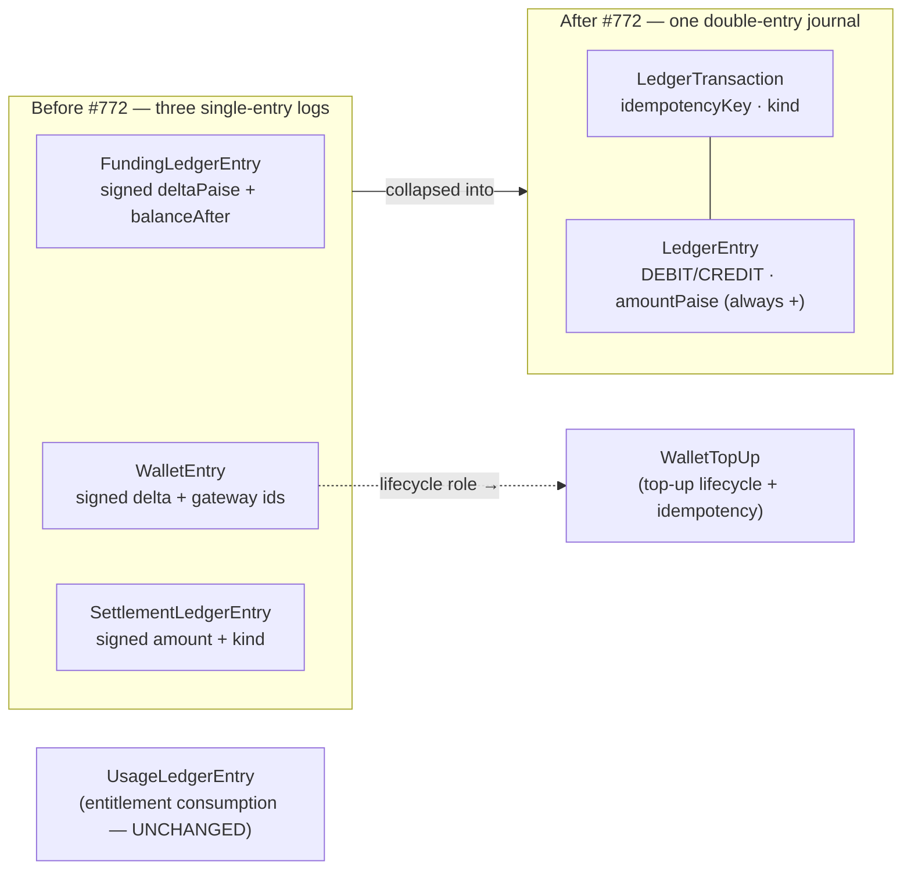
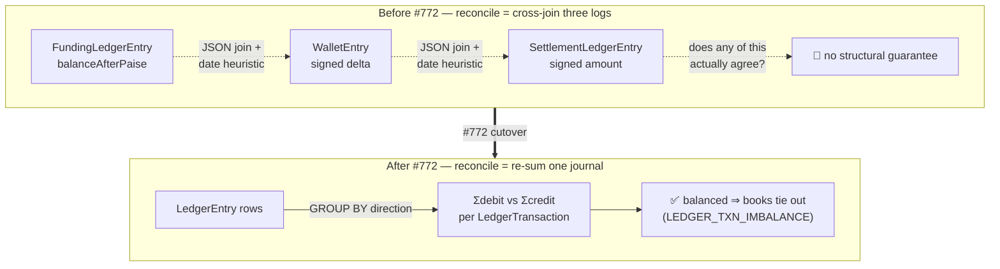

# Money model overview

**What this covers:** the principles every money doc in this section (`06`–`14`) builds on — integer paise, the double-entry journal, derived balances, and what the **#772 cutover** changed. Read this first; the rest of the band is detail.

> **One-sentence model.** Every cash event in the platform is recorded as **one balanced double-entry transaction** in a single journal (`LedgerTransaction` + `LedgerEntry`), and **every balance is derived by summing that journal** — nothing about "how much money is where" is stored as an authoritative number.

---

## 1. Three rules that never bend

1. **Money is integer paise.** No floats, ever. ₹1 = 100 paise; `amountPaise: 50000` is ₹500. Floating-point rounding has no place in a ledger. Percentages and splits are **basis points** (`bps`, integer; 10000 = 100%), not floats — see [chart of accounts](02-chart-of-accounts.md) and [booking → earnings](05-booking-to-earnings.md). Since #780, every money column is `BigInt` at the database (the old `Int` columns silently overflowed above ₹2.14 crore) and a plain `number` at the JS boundary: the client extension in `lib/prisma.ts` converts every BigInt field on read, so application code, JSON responses, and gateway payloads never see a `bigint`. The two guards that keep this true are the CI money-column check (`scripts/ci/check-money-columns.ts`, no new `Int` money columns) and the extension drift test (`__tests__/lib/prisma-money-extension.test.ts`, every BigInt column is in the boundary map). The one read shape the extension cannot cover is aggregation — `_sum`/`groupBy` results still surface `bigint` and must be wrapped in `sumPaise()` from `lib/payments/utils/money.ts`, which also asserts the value is inside `Number`'s safe-integer range. Since #781 §A, every money row's `currency` column is also the `Currency` enum rather than a free string: gateways still speak arbitrary ISO codes, so each row-write coerces through `toCurrencyEnum()` (`lib/payments/validation/currency-guards.ts`), which throws on a code we cannot book — webhook paths dead-letter that error rather than booking a mislabelled amount.
2. **Every cash event is a balanced transaction.** A posting set is only valid when **Σ(DEBIT) == Σ(CREDIT)**. `postLedgerTxn()` rejects anything else with `LedgerImbalanceError` before a row is written. This is the invariant the nightly reconciler re-proves (`LEDGER_TXN_IMBALANCE`).
3. **Balances are derived, never stored.** "What do we owe this org / this consultant / the government?" is always a `SUM` over journal entries (`ledgerBalancePaise()`), not a column. The few balance-shaped columns that exist (`BillingAccount.walletBalance`) are **caches** the reconciler asserts against the journal — see §4.

---

## 2. What #772 changed (read this if you've seen the old docs)

Before the cutover the schema carried **three single-entry, signed-delta logs**:

| Removed model | What it logged | Where it lives now |
| --- | --- | --- |
| `FundingLedgerEntry` | money allocations (top-up / booking debit / refund / grant) with a running `balanceAfterPaise` | the journal (`LedgerEntry` on the relevant accounts) |
| `WalletEntry` | per-row wallet history + gateway idempotency | `WalletTopUp` (lifecycle/idempotency) + `LedgerEntry` on the org `WALLET` account (history) |
| `SettlementLedgerEntry` (+ `SettlementKind`) | external settlements (invoice issued/paid, payout sent, refund) | `LedgerTransaction.kind` + `OrgAuditLog` |

**Why one journal beats three logs.** The old logs each answered one question but couldn't cross-check each other without JSON joins and date heuristics. A double-entry journal makes the cross-check structural: because every transaction balances and every balance is a sum of the same rows, a single invariant (`Σdebit == Σcredit`) guarantees the books tie out. Reconciliation went from "compare three logs and hope" to "re-sum one journal."

The difference is the *shape of the reconciliation question itself*, not just the table count:

The "no structural guarantee" box is not rhetorical: three independently-signed logs can each be internally consistent and still disagree with each other, and nothing in the schema forced them to agree. The double-entry rewrite makes "the books are wrong" a *single per-transaction predicate* the reconciler re-proves nightly ([ledger integrity](13-ledger-integrity.md) `LEDGER_TXN_IMBALANCE`).

### 🛠️ What this design survived

- **The cutover itself (`71923ae4` → `2911f450`, #772).** The journal foundation (`postLedgerTxn`, the three `Ledger*` tables, `ledgerBalancePaise`) landed in `71923ae4`; the very next commit `2911f450` re-pointed *every* money writer — booking, top-up, invoice-paid, both payouts, refunds — at it in one move, deleting `FundingLedgerEntry` / `WalletEntry` / `SettlementLedgerEntry` / `SettlementKind`. The empirical gate that justified the deletion was the reconciler returning **`ok: true`, 0 findings, across a full DB reseed** (commit `db7d4649` shipped seeds + reconcile + jobs on the journal) — if the new journal and every reconciled cache hadn't agreed bit-for-bit with the seeded flows, that reseed would have failed and the old logs would have stayed.

> **If you read `FundingLedgerEntry`, `WalletEntry`, `SettlementLedgerEntry`, or `SettlementKind` anywhere outside a historical note like this one — it's stale. File it.** The usage ledger (`UsageLedgerEntry`) is **not** one of the removed logs; it tracks *entitlement consumption*, not money — see [programs](../30-programs-and-lifecycle/02-programs.md).

So today there are **two** ledgers, not three:

- **The money journal** — `LedgerTransaction`/`LedgerEntry`, double-entry, this section's subject.
- **The usage ledger** — `UsageLedgerEntry`, single-entry, counts engagements consumed against a program cap. Different question ("what did this member consume?"), different table.

---

## 3. The three moving parts of the journal

Every money event in the system is represented by exactly three Prisma models working together; the table names each one, its role in the double-entry scheme, and where its full specification lives.

| Thing | Role | Detail |
| --- | --- | --- |
| `LedgerAccount` | a bucket money sits in (CASH, WALLET, …), scoped to platform / org / consultant | [chart of accounts](02-chart-of-accounts.md) |
| `LedgerTransaction` | one balanced cash event, `idempotencyKey @unique`, typed `kind` (`LedgerTransactionKind` enum since #778 §B — was a free string) | [ledger & postings](03-ledger-and-postings.md) |
| `LedgerEntry` | one leg of a transaction: `direction` + positive `amountPaise BigInt` | [ledger & postings](03-ledger-and-postings.md) |

The sign of money is carried by **direction**, never by a negative amount. Every `LedgerEntry.amountPaise` is a positive integer; whether it adds or subtracts from a balance depends on the entry's `direction` and the account's normal side (§ in [chart of accounts](02-chart-of-accounts.md)).

---

## 4. "Derived, but cached" — the one nuance

A pure double-entry system would compute every balance on read. We do that *almost* everywhere. The single exception is the **wallet overdraft guard**: a booking must atomically check "does this org have enough wallet balance?" and decrement it, under concurrency, without two bookings both spending the last rupee. The cheapest correct primitive for that is a conditional SQL `UPDATE … WHERE walletBalance >= amount` — which needs a real column.

So `BillingAccount.walletBalance` exists as a **cache** of the org's `WALLET` account balance. The contract:

- The journal is the source of truth.
- The cache is what the hot path reads/writes for the atomic guard.
- The nightly reconciler asserts `-balance(WALLET) == walletBalance` (`WALLET_BALANCE_DRIFT`); any divergence is an incident, never something to hand-patch.

This "reconciled cache" pattern recurs: `ConsultantEarnings`/`OrganizationEarnings` amount columns are caches the reconciler checks against the booking journal (`EARNINGS_LEDGER_DRIFT`), and the **usage-side** denormalized counters — `ProgramAssignment.engagementsUsed` and the CREDIT_POOL money-meter `ProgramAssignment.consumedPaise` — are re-derived from `UsageLedgerEntry` (`PROGRAM_ASSIGNMENT_ENGAGEMENTS_DRIFT` / `CREDIT_POOL_CONSUMED_DRIFT`). Same contract every time: the append-only journal/ledger is truth, the column is a checked cache. See [ledger integrity](13-ledger-integrity.md).

---

## 4a. Design decisions & trade-offs

The three rules in §1 were choices with alternatives we rejected. Why these, what they cost:

| Decision | Rejected alternative | Why we chose it / what it costs |
| --- | --- | --- |
| **Integer paise, `BigInt` columns, `number` at the JS boundary (#780)** | `Decimal`/`numeric` money columns; `bigint` end-to-end in JS | Integers can't silently round, sort and aggregate at full speed, and serialize across the JS/Prisma/Postgres boundary with no precision class to mishandle. `BigInt` columns kill the int4 ₹2.14cr overflow; converting to `number` once, inside the `lib/prisma.ts` extension, keeps the entire app `bigint`-free (safe up to ≈₹90 lakh crore, asserted by `sumPaise()`). The remaining cost is manual scaling (₹ → paise at every edge) and `sumPaise()` wrapping at aggregation sites, which the extension cannot reach. We pay it because a ledger that rounds is not a ledger. |
| **Basis points (`bps`, 10000 = 100%)** | float percents (`0.10`) | A split must sum to *exactly* the whole; `platformBps + orgBps + consultantBps === 10000` is an integer equality a float `0.1 + 0.1 + 0.8` can fail. #772 deleted the old `Float sharePercentage` columns for this reason — see [booking → earnings §2](05-booking-to-earnings.md). |
| **Derived balances + a few checked caches** | a stored, authoritative `balance` column per account | Always-derive is provably correct but can't back an atomic overdraft guard (§4). So balances derive, *except* `walletBalance`, which is a cache the reconciler re-derives nightly. The cost is one reconciliation invariant per cache; the benefit is the hot path stays a single conditional `UPDATE`. |
| **Idempotency keyed per flow** (`topup:<orderId>`, `booking:<paymentId>`, …) | request-level dedup (one key per HTTP call) | A booking and its refund and its top-up are *different cash events on the same upstream id*; per-flow keys let each post exactly once even when they share a `paymentId`, and survive at-least-once webhooks + cron retries. A request-level key would conflate them. See [ledger & postings §2](03-ledger-and-postings.md). |

## 5. Where each money flow is documented

Every cash event that touches the journal has a canonical `LedgerTransactionKind` and a dedicated doc; use this index to jump directly to the relevant deep-dive rather than scanning the full money-and-ledger band.

| Flow | Journal `kind` | Doc |
| --- | --- | --- |
| Wallet top-up (`Dr CASH / Cr WALLET`) | `TOPUP` | [wallet & top-ups](04-wallet-and-topups.md) |
| Booking (funding legs → fee/payable/GST) | `BOOKING` | [booking → earnings](05-booking-to-earnings.md) |
| Payout to a consultant / host org | `PAYOUT` / `ORG_PAYOUT` | [payout pipeline](07-payout-pipeline.md) |
| Invoice issued / paid | `INVOICE_ISSUED` / `INVOICE_PAID` | [invoicing](08-invoicing.md) |
| Program overage (member-pays side-charge) | `OVERAGE_MEMBER` | [booking → earnings](05-booking-to-earnings.md) |
| Refund / top-up refund | `REFUND` / `TOPUP_REFUND` | [invoicing](08-invoicing.md), [wallet & top-ups](04-wallet-and-topups.md) |
| How funding sources stack on one checkout | — | [payment legs](09-payment-legs.md) |
| Proving it all ties out | — | [ledger integrity](13-ledger-integrity.md) |

---

## 6. Money vocabulary — five distinct flows

New devs routinely conflate these. They are different flows with different models — learn the distinction once:

- **Refund** — money back to the *buyer* (consultee). A booking is reversed; the buyer's card/wallet is credited. Model `Refund` (`lib/payments/operations/refund.ts`), status `PENDING → SUCCEEDED | FAILED | CANCELLED` (gateway-aligned — success is `SUCCEEDED`, matching Razorpay's `refund.processed`). Journal: `refund:<refundId>` reverses the booking legs ([§4.7](03-ledger-and-postings.md)); a *top-up* refund is `topup-refund:<paymentId>`.
- **Reimbursement** — money from an *org to its own member* who fronted org-sponsored spend. Model `OrganizationReimbursement` (`/api/organizations/[orgId]/reimbursements`). **Not** a refund — org → member, not platform → card.
- **Payout** — money from the *platform to a seller* (consultant or host org), net of commission + TDS. Models `ConsultantPayout` / `OrganizationPayout`; journal `payout:<id>` / `orgpayout:<id>` (Dr `*_PAYABLE` / Cr `CASH` + `TDS_PAYABLE`) — see [payout pipeline](07-payout-pipeline.md).
- **Referral** — a *platform-funded* incentive, not a buyer payment. A shared link earns a `ReferralCredit`; consumed at checkout as `PaymentLeg.source = REFERRAL_CREDIT`, posting to `PLATFORM_PROMO` (the platform absorbs it) inside the booking txn.
- **Credits** — two senses, don't confuse: (a) an **org's prepaid wallet balance** — the `WALLET` ledger account, cached on `BillingAccount.walletBalance`; (b) a **consultee's referral/promo credits** — `ReferralCredit`, consumed via the `REFERRAL_CREDIT` leg. The first is org money we owe back; the second is a platform-funded discount.

> The old per-row `WalletEntry` with `reason = REFERRAL_BONUS` is gone (#772); referral credits now live as `ReferralCredit` and post to `PLATFORM_PROMO` when consumed.

**Grounded in the seeded orgs**, the five flows are five different actors moving money:

- **Refund** — a learner Wipro sponsored cancels; the booking reverses and the *funding source* (here Wipro's `ORG_RECEIVABLE` accrual) is credited back, with a GST credit note ([invoicing §8](08-invoicing.md)).
- **Reimbursement** — an IIT Madras member paid out of pocket for sponsored coaching; IIT Madras pays *its own member* back via `OrganizationReimbursement`. The platform is not in this loop.
- **Payout** — **LearnPro Academy** hosts the expert, so the org-share leg accrues to LearnPro and a weekly `ORG_PAYOUT` pays it out net of TDS ([payout pipeline](07-payout-pipeline.md)). **Arjun** (solo HOST) is the consultant-side mirror: his earnings pay out via `PAYOUT`.
- **Referral** — a learner books with a `ReferralCredit`; the platform eats it (`PLATFORM_PROMO`), independent of who sponsored the seat.
- **Credits** — IIT Madras's ₹14,75,000 prepaid pool is the `WALLET` sense (org money we owe back); a consultee's promo balance is the `ReferralCredit` sense (a platform-funded discount). Same English word, opposite direction of obligation.

---

### Related docs
- [Chart of accounts](02-chart-of-accounts.md) — the buckets and their normal sides.
- [Ledger & postings](03-ledger-and-postings.md) — `postLedgerTxn`, idempotency, every flow's legs.
- [Wallet & top-ups](04-wallet-and-topups.md) — the cache pattern in practice.
- [Ledger integrity](13-ledger-integrity.md) — the reconciler that proves the model holds.
- Ground truth: `lib/payments/ledger/post.ts`, `prisma/schema.prisma` (the `Ledger*` models), `scripts/reconcile/reconcile-ledgers.ts`.
