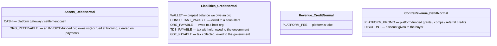
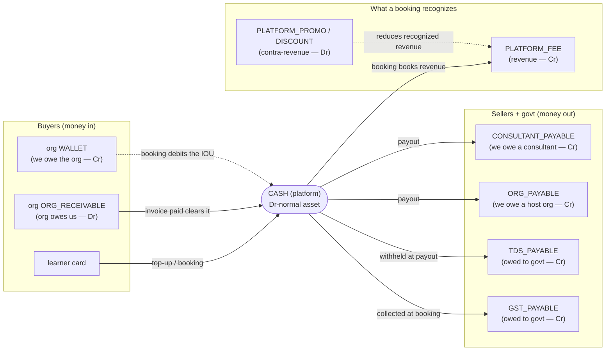

# Chart of accounts

**What this covers:** the ten `LedgerAccountKind` buckets every posting touches, which side each is *normal* on (so you can read a balance correctly), and how an account is scoped + addressed deterministically. This is the vocabulary the [postings doc](03-ledger-and-postings.md) speaks.

> **Reading a balance.** `ledgerBalancePaise()` returns the **signed** balance `Σ(DEBIT) − Σ(CREDIT)` in paise. For a **debit-normal** account that number is the balance as-is. For a **credit-normal** account (every liability and revenue), the meaningful figure — *the amount we owe / the revenue we booked* — is the **negative** of it. That single sign flip is why callers must know an account's normal side.

---

## 1. The ten accounts



| Kind | Class | Normal side | Scope | Means |
| --- | --- | --- | --- | --- |
| `CASH` | asset | DEBIT | platform | real money at the gateway / in settlement |
| `ORG_RECEIVABLE` | asset | DEBIT | org | an INVOICE-funded org owes us; accrued at booking, cleared on invoice payment |
| `WALLET` | liability | CREDIT | org | prepaid balance we owe the org (an IOU) |
| `CONSULTANT_PAYABLE` | liability | CREDIT | consultant | earnings owed to a consultant, not yet paid out |
| `ORG_PAYABLE` | liability | CREDIT | org | host-org share owed, not yet paid out |
| `TDS_PAYABLE` | liability | CREDIT | platform | TDS withheld at payout, owed to the government |
| `GST_PAYABLE` | liability | CREDIT | platform | GST collected on a booking, owed to the government |
| `PLATFORM_FEE` | revenue | CREDIT | platform | the platform's recognized take |
| `PLATFORM_PROMO` | contra-revenue | DEBIT | platform | platform-funded credits/comps + referral credits the platform eats |
| `DISCOUNT` | contra-revenue | DEBIT | platform | discount given to the buyer (reduces recognized revenue) |

`LedgerAccountKind` and `LedgerDirection` (`DEBIT` / `CREDIT`) are enums in `prisma/schema.prisma`. The class list above mirrors them exactly.

### Who owes whom — the account map as obligations

The class list says *what side* each account is normal on; this says *which direction the money obligation points*. Read an arrow as "owes / will pay": the platform's `CASH` sits in the middle, money comes in from buyers and goes out to sellers and the government.



Every liability/revenue box is **credit-normal** (the meaningful figure is the *negative* of the signed balance — what we owe / booked); the two asset boxes (`CASH`, `ORG_RECEIVABLE`) and the two contra-revenue boxes (`PLATFORM_PROMO`, `DISCOUNT`) are **debit-normal**. That split is exactly the sign-flip rule in the callout above.

---

## 2. Scope: platform / org / consultant sub-ledgers

An account is **scoped** by who it belongs to:

- **Platform-wide** (both owners null): `CASH`, `PLATFORM_FEE`, `PLATFORM_PROMO`, `DISCOUNT`, `TDS_PAYABLE`, `GST_PAYABLE`. One account per kind per currency.
- **Org-scoped** (`organizationId` set): `WALLET`, `ORG_PAYABLE`, `ORG_RECEIVABLE`. One per org.
- **Consultant-scoped** (`consultantProfileId` set): `CONSULTANT_PAYABLE`. One per consultant.

So "what do we owe **LearnPro Academy**?" is `-balance(ORG_PAYABLE, organizationId=learnpro-academy)`, and "what does **IIT Madras** hold in its wallet?" is `-balance(WALLET, organizationId=iit-madras)` — for the seeded ₹14,75,000 pool, that returns `1475000_00` paise until the first booking debits it. **Wipro**, being INVOICE-funded, has no `WALLET` account at all; its booking obligation lives on `ORG_RECEIVABLE|wipro|_|INR` (org owes us) rather than a wallet IOU.

---

## 3. Deterministic account ids

Accounts aren't looked up by a generated UUID; their id **is** their scope, joined by `|`:

```
<kind>|<organizationId | "_">|<consultantProfileId | "_">|<currency>
```

Examples:
- `CASH|_|_|INR` — the platform cash account.
- `WALLET|org_abc|_|INR` — org `org_abc`'s wallet.
- `CONSULTANT_PAYABLE|_|cp_xyz|INR` — what we owe consultant `cp_xyz`.

This is `ledgerAccountId(ref)` in `lib/payments/ledger/post.ts`. Two reasons it's deterministic rather than a UUID:

1. **Upsert-dedupe under concurrency.** `resolveAccountId()` does `upsert({ where: { id } })`, so two concurrent postings to the same scope converge on one row with no race.
2. **It sidesteps the Postgres nullable-unique gotcha.** A `@@unique([organizationId, consultantProfileId, kind, currency])` index would *not* dedupe rows where the owner columns are `NULL` (Postgres treats `NULL`s as distinct in unique indexes). Encoding the nulls as the literal `"_"` inside a single string primary key makes the dedupe exact. The composite unique still exists as a backstop, but the deterministic id is the working guard.

---

### Design decision: the id *is* the scope

The deterministic id (`<kind>|<org|_>|<consultant|_>|<currency>`) is a deliberate rejection of a generated UUID PK. Two forces drove it, both documented in `post.ts`:

- **Upsert-dedupe over a separate "find-or-create".** With a UUID PK, two concurrent first-postings to the same scope would each `findFirst` (miss) then `create` (one wins, one hits a unique violation or — worse, without the composite unique — duplicates the account). A scope-derived id makes `upsert({ where: { id } })` converge with no race.
- **The Postgres nullable-unique gotcha.** A platform account has `organizationId = NULL` and `consultantProfileId = NULL`. A `@@unique([organizationId, consultantProfileId, kind, currency])` index does **not** dedupe two such rows, because Postgres treats each `NULL` as distinct. Encoding the nulls as the literal `"_"` inside the id string makes the dedupe exact. The composite unique stays as a backstop; the id is the working guard.

> **The id embeds currency for a reason — and that reason is #783.** Because `<currency>` is the last id segment, keying a posting by `displayCurrencyAtCheckout` instead of leaving it unset (→ `INR`) would mint a *different* account (`WALLET|iit-madras|_|USD`) and silently split the org's wallet across two ids — breaking receivable/payable clearing. The ledger is INR-denominated (Razorpay settles INR; `amountPaise` is INR paise; no FX before posting), so every posting leaves `currency` unset. The reconciler's `LEDGER_ACCOUNT_NON_INR` check (commit `c38b9631`, #783) is the standing guard that no posting ever did this. See [ledger & postings §5.5](03-ledger-and-postings.md).

## 4. How the accounts net out (sanity check)

After a booking fully settles and the consultant + org are paid, the platform's books should show: `CASH` holding the platform's net take + taxes-not-yet-remitted, `PLATFORM_FEE` revenue recognized (less `DISCOUNT`/`PLATFORM_PROMO` contra), the `*_PAYABLE` liabilities drawn back to zero as payouts clear, and `TDS_PAYABLE`/`GST_PAYABLE` carrying what's owed to the government until remitted. Because every transaction balanced on the way in, the whole set always ties to zero net equity movement except recognized revenue — which is the point of double entry.

**Worked, with LearnPro's 10/10/80 card.** A ₹10,000 (1,000,000 paise) booking hosted by LearnPro, paid by a learner's card, intra-state GST 18% on the platform fee region: the booking posts `Dr CASH 1,000,000` against `Cr PLATFORM_FEE 100,000` (10%) + `Cr ORG_PAYABLE(learnpro) 800,000` (80%) + `Cr CONSULTANT_PAYABLE 0` (the expert settles to the org) + `Cr GST_PAYABLE` on the fee. When the weekly `ORG_PAYOUT` runs, `Dr ORG_PAYABLE(learnpro) 800,000` clears against `Cr CASH` (net) + `Cr TDS_PAYABLE` (194-O withholding). After both, `ORG_PAYABLE(learnpro)` is back to zero, `PLATFORM_FEE` carries the recognized ₹1,000, and `CASH` holds the platform's take plus the not-yet-remitted taxes — the books tie out because each leg balanced on the way in.

---

### Related docs
- [Money model overview](01-money-model-overview.md) — why derived, why integer paise.
- [Ledger & postings](03-ledger-and-postings.md) — the exact legs each flow posts to these accounts.
- [Ledger integrity](13-ledger-integrity.md) — the reconciler that re-sums these accounts.
- Ground truth: `lib/payments/ledger/post.ts` (`ledgerAccountId`, `AccountRef`), `prisma/schema.prisma` (`LedgerAccountKind`, `LedgerDirection`, `LedgerAccount`).
