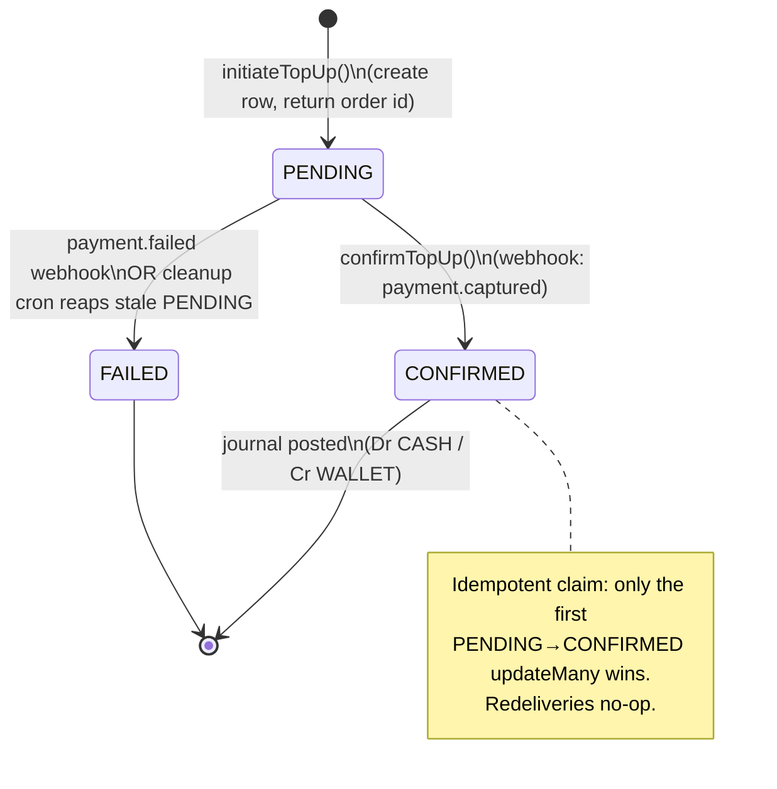
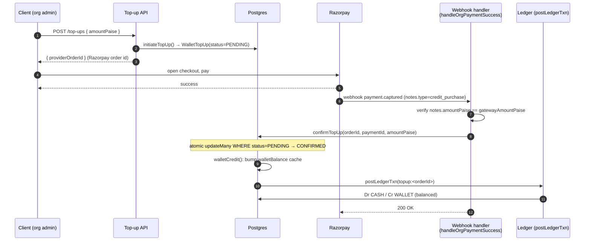

# Wallet & Top-ups

**What this covers:** how an organization's prepaid **wallet** works — the `WalletTopUp` lifecycle (initiate → Razorpay checkout → webhook confirm), how money lands in the wallet via the double-entry journal, and how bookings debit it. The wallet is a *prepaid liability we owe the org*; its balance is **derived from the journal**, with `BillingAccount.walletBalance` kept only as a fast cache.

> **Mental model.** A wallet is not a bank account we hold money in — it is an IOU. When an org tops up, the platform receives real cash (`CASH` rises) and in exchange owes the org spending power (`WALLET`, a liability, rises). When the org books, the IOU shrinks. The single source of truth for "how much do we owe this org" is the org's `WALLET` ledger account, **not** the `walletBalance` integer.

---

## 1. The two records behind a wallet

A wallet is not a single model — it is a `WalletTopUp` lifecycle record paired with a `WALLET` ledger account; understanding which is truth (the account) versus which is the fast-path cache (`walletBalance`) is essential before touching any top-up or debit code.

| Thing | Where | Role |
| --- | --- | --- |
| **`WalletTopUp`** | `prisma/schema.prisma` model `WalletTopUp` (~1000) | Lifecycle + idempotency record for one top-up attempt (PENDING → CONFIRMED / FAILED). |
| **`WALLET` ledger account** | one `LedgerAccount` per org, derived via `ledgerBalancePaise()` | **Source of truth** for the balance (credit-normal liability). |
| **`BillingAccount.walletBalance`** (`Int?` paise) | `prisma/schema.prisma` model `BillingAccount` | **Derived cache** of the WALLET account, used for the atomic overdraft guard. Reconcile asserts `-balance(WALLET) == walletBalance`. |

> **History note (#772 B3).** The old per-row `WalletEntry` log (and its "deltaPaise = 0 placeholder" trick for pending top-ups) was **removed**. Wallet history is now the `LedgerEntry` rows on the org's `WALLET` account, and top-up lifecycle lives on `WalletTopUp`. If you read "WalletEntry" anywhere, it is stale — see [Ledger & postings](03-ledger-and-postings.md).

The `walletBalance` cache exists for exactly one reason: a conditional SQL `UPDATE … WHERE walletBalance >= amount` is the cheapest correct overdraft guard under concurrency. We can't run that guard against a derived sum, so we keep a cache and let the reconcile cron prove it never drifts. See [Concurrency & idempotency](../30-programs-and-lifecycle/01-concurrency-and-idempotency.md).

The column is nullable, and an account that has never been credited carries `NULL` rather than zero, which is a real distinction in Postgres because `NULL + amount` is `NULL` and not the new balance. Both `walletCredit` and `walletDebit` therefore write a zero over a `NULL` in the same transaction before they touch the arithmetic, and they read the resulting balance back off the mutated row instead of coercing a `NULL` to zero (#1459). Giving the column a non-null default so the seeding step becomes unnecessary is a schema change, and it belongs to the pre-MVP database reset rather than to any migration written today.

---

## 2. WalletTopUp lifecycle

A top-up moves through three states. Razorpay is the only gateway in v1.



Key fields (`model WalletTopUp`, `lib/api/organizations/wallet.ts`):

- `providerOrderId @unique` — the Razorpay order id, **also** the public `topUpId`. The unique constraint is the idempotency anchor: a double-POST or webhook redelivery cannot create or confirm twice.
- `providerPaymentId?` — gateway payment id (`pay_…`), set on confirm.
- `amountPaise` — stored **up front** so `confirmTopUp` can assert the webhook-captured amount matches what was authorized.
- `status` — `PENDING | CONFIRMED | FAILED`.
- `confirmedAt?` — stamped when the claim wins.
- `capturedAt?` (#785) — stamped **outside** `confirmTopUp`'s transaction the moment the gateway reports capture, so it survives a ledger-post rollback. The stale-reaper cron skips `capturedAt`-set rows (real money landed — don't GC them), and the `sweep-orphaned-topup-captures` reconciler re-credits any row that was captured but never confirmed (e.g. the confirm tx crashed after capture). This closes the "money in, no wallet credit" gap.

> In code the failed top-up is **deleted**, not flipped to `FAILED`: `handleOrgPaymentFailure` (`app/api/webhooks/utils.ts`) runs `walletTopUp.deleteMany({ where: { status: PENDING, providerPaymentId: null } })` so the UI immediately shows "retry". The `FAILED` enum value is reserved for paths that want to keep the tombstone; the stale-reaper cron also GCs orphaned PENDING rows.

---

## 3. The top-up flow end to end



> **Worked example — TCS tops up ₹2,00,000** (hypothetical; Tata Consultancy Services, a WALLET-funded buyer). An admin POSTs `{ amountPaise: 20000000 }`; `initiateTopUp` writes `WalletTopUp(PENDING, providerOrderId=order_…, amountPaise=20000000)` and returns the Razorpay order id. TCS pays; the `payment.captured` webhook arrives, `confirmTopUp` claims the row `PENDING → CONFIRMED`, bumps `walletBalance` by `20000000`, and posts `Dr CASH 20000000 / Cr WALLET(tcs) 20000000`. The org's true balance — `-balance(WALLET, tcs)` — and the `walletBalance` cache now both read ₹2,00,000. If TCS had set `minBalancePaise = 5000000` (₹50,000), the low-balance cron (§7) would alert finance once the pool later dips below that floor — *notify-only today*, no auto-charge.

### 3.1 `initiateTopUp` — create the PENDING claim

`initiateTopUp(db, { billingAccountId, amountPaise, providerOrderId, notes? })` writes one `WalletTopUp` row with `status = PENDING`. No money has moved and **no journal entry exists yet** — the row is purely a pending claim keyed by `providerOrderId`. The API returns the Razorpay order id to the client for checkout.

### 3.2 `confirmTopUp` — atomic claim, then post the journal

The webhook (`handleOrgPaymentSuccess`, branch `notes.type === "credit_purchase"`) first does **defence-in-depth**: it compares `notes.amountPaise` to the gateway-captured amount and refuses to credit on mismatch (logs an audit row, returns 200 so Razorpay stops retrying). Then it calls:

```
confirmTopUp(prisma, { providerOrderId, providerPaymentId, amountPaise })
```

Inside one `$transaction`:

1. **Atomic idempotent claim** — a single conditional `updateMany`:
   ```
   updateMany WHERE providerOrderId = ? AND status = "PENDING"
              SET status = "CONFIRMED", providerPaymentId, confirmedAt
   ```
   Exactly one racing delivery sees `count === 1` and proceeds. A redelivery (or the losing race) sees `count === 0` and falls through to a no-op that just returns the current balance. If the order id is unknown entirely, it throws.
2. **Credit the wallet** via `walletCredit(tx, { reason: "TOPUP", … })`, which:
   - bumps the `walletBalance` cache (`COALESCE(walletBalance,0) + amount`), then
   - posts the journal (only the `TOPUP` reason posts here):

```
LedgerTransaction kind=TOPUP  idempotencyKey="topup:<providerOrderId>"
  Dr CASH                 amountPaise   (platform gateway cash rises)
  Cr WALLET(org)          amountPaise   (we now owe the org this much)
```

Both legs are positive integer paise and sum equal, so `postLedgerTxn` accepts it (it throws `LedgerImbalanceError` otherwise). The transaction is idempotent twice over: the `WalletTopUp` claim and the `LedgerTransaction.idempotencyKey @unique`.

---

## 4. `walletDebit` — spending the wallet

When an org-WALLET-funded booking is checked out, `walletDebit(tx, { billingAccountId, amountPaise, reason, … })` runs the **overdraft guard**:

```sql
UPDATE "BillingAccount"
SET "walletBalance" = "walletBalance" - :amount
WHERE "id" = :id
  AND "walletBalance" IS NOT NULL
  AND "walletBalance" >= :amount
```

If `rowsAffected === 0`, the balance was insufficient and it throws `WalletInsufficientFundsError`. Because the predicate and the decrement are one atomic statement, two concurrent bookings can never both drain the same last rupee.

That refusal carries the stable code `WALLET_INSUFFICIENT_FUNDS` and `httpStatus` 402 (#1477), so checkout rethrows it unchanged, `POST /api/checkout` answers 402 with copy telling the buyer to ask their billing admin for a top-up, and Sentry records it as an expected outcome rather than a payment fault. It reports only the requested amount, never the available balance: the guard refuses without reading the row, and re-reading it would add a query inside the checkout transaction that `PG_POOL_MAX=1` would serialise behind everything else.

> **Important:** `walletDebit` only moves the **cache**. It does **not** post a journal leg. The accounting leg `Dr WALLET` is posted later from the settlement layer (`createEarningsFromPayment`), where the full fee/payable/GST split is known — that single balanced `booking:<paymentId>` transaction is also the authoritative wallet-history record. See [Booking → earnings](05-booking-to-earnings.md) and [Payment legs](09-payment-legs.md).

`walletCredit` is the mirror: it bumps the cache for any reason, but **only posts a journal txn when `reason === "TOPUP"`**. Refund credits post their WALLET leg from the refund layer (next section), not here — this keeps each cash event owning exactly one posting.

---

## 5. Top-up refund

When Razorpay refunds a confirmed top-up, `handleRefundCreated` (`app/api/webhooks/utils.ts`) finds the `WalletTopUp` by `providerPaymentId` (status `CONFIRMED`) and reverses the original posting:

```
LedgerTransaction kind=TOPUP_REFUND  idempotencyKey="topup-refund:<providerPaymentId>"
  Dr WALLET(org)   refundAmt   (the IOU we owe the org shrinks)
  Cr CASH          refundAmt   (platform cash returns to the gateway)
```

Then it decrements the `walletBalance` cache to match. Notes:

- The refund amount is **clamped** to the original `amountPaise` (`Math.min(amount, topUp.amountPaise)`).
- `postLedgerTxn` returns `{ created: false }` on a redelivery (idempotent on the key) — the handler short-circuits before touching the cache, so a double webhook is a no-op.
- The cache decrement can legitimately drive `walletBalance` negative if the org already spent the credited funds. That is a **real reconcile signal** (the org owes back more than it holds), not a bug to swallow.
- No `Refund` row is written for org-level refunds — `Refund.paymentId` is scoped to the B2C `Payment` table. The `TOPUP_REFUND` journal transaction is the authoritative record.

---

## 6. Why `walletBalance` is "just a cache"

Every wallet movement is a journal posting:

| Event | Journal | Cache effect |
| --- | --- | --- |
| Top-up confirmed | `Dr CASH / Cr WALLET` (`topup:<orderId>`) | `walletBalance += amount` |
| Booking debit | `Dr WALLET …` inside `booking:<paymentId>` | `walletBalance -= amount` (via `walletDebit`) |
| Top-up refund | `Dr WALLET / Cr CASH` (`topup-refund:<paymentId>`) | `walletBalance -= amount` |

The org's true balance is always `-ledgerBalancePaise({ kind: "WALLET", organizationId })` (WALLET is credit-normal, so the amount we owe is the negative of the signed balance). The reconcile cron's `WALLET_BALANCE_DRIFT` check asserts this equals the cache; any drift is an incident, never a thing to patch by hand. See [Ledger integrity](13-ledger-integrity.md).

---

## 7. Wallet floor + auto-top-up (#777 §C) — NOTIFY-ONLY today

A WALLET-funded org can set a **minimum balance** so it learns the pool is running low *before* a booking gets refused for insufficient funds. The fields live on `BillingAccount`:

```prisma
model BillingAccount {
  // ... wallet funding ...
  walletBalance Int? // paise

  /// #777 §C — wallet minimum-balance + auto-top-up. When walletBalance drops
  /// below minBalancePaise the auto-top-up cron charges autoTopUpMandateId for
  /// autoTopUpAmountPaise. All-null = manual top-up only (current behavior).
  minBalancePaise      Int?
  autoTopUpEnabled     Boolean   @default(false)
  autoTopUpAmountPaise Int?
  autoTopUpMandateId   String? // gateway recurring-payment token
  autoTopUpLastFiredAt DateTime? // idempotency: rate-limit the cron per account
}
```

> 🟡 **Designed for auto-charge; shipped as notify-only.** The schema comment describes the *intended* end state (cron charges the mandate). The current cron (`jobs/billing/wallet-low-balance.ts`) **moves no money and creates no `WalletTopUp`** — Razorpay recurring mandates aren't wired yet, so `autoTopUpEnabled` / `autoTopUpAmountPaise` / `autoTopUpMandateId` are written-but-unread by this wave (`TODO(#777)`). It detects the dip, **notifies finance** (`notifyOrgWalletLow`), and stamps the cooldown. Don't document auto-debit as live.

**The cron** (daily 05:15 IST, `.github/workflows/wallet-low-balance.yml`):
1. Select WALLET `BillingAccount`s with a non-null `minBalancePaise` whose `autoTopUpLastFiredAt` is null or older than 24h (the `walletBalance < minBalancePaise` comparison can't be a Prisma column-compare, so it's narrowed here and checked in JS).
2. Skip any whose live `walletBalance >= minBalancePaise`.
3. **Claim** the row with a conditional `updateMany WHERE autoTopUpLastFiredAt = <value-read>` → stamp `now`. `autoTopUpLastFiredAt` doubles as the **idempotency gate + 24h notify cooldown**: a second replica or same-day re-run sees `count === 0` and skips, so an org is alerted at most once per day.
4. Fire `notifyOrgWalletLow` (Novu) with the balance, the floor, and a deep link to the billing top-up surface.

When real mandates land, the charge (a `WalletTopUp` + `Dr CASH / Cr WALLET` posting, exactly like a manual top-up in §3.2) slots into step 3 inside the claim's transaction — the idempotency gate is already there.

> **Regulatory constraint for the future mandate work (RBI e-mandate framework, effective 21 April 2026).** When the auto-charge wave is built it must be designed inside RBI's recurring-payment rules, not bolted on after: a registered e-mandate with explicit customer consent and tokenized card credentials (merchants may not store raw card data), a pre-debit notification at least 24 hours before each charge, and **Additional Factor Authentication for any single recurring debit above ₹15,000** (the higher ₹1,00,000 carve-outs cover insurance, mutual funds, and credit-card bills — not wallet top-ups). The practical consequence: `autoTopUpAmountPaise` should be capped at ₹15,000 per charge to stay AFA-free, and a larger refill should be modelled as multiple mandate-sized charges or a notify-to-pay flow. Notify-only remains the legally trivial posture today because no recurring debit exists at all.

> **Related — overage-as-expansion.** A low wallet is the *funding-side* nudge; the [program-overage](05-booking-to-earnings.md) preview is the *consumption-side* one (a member about to breach a program cap). Both steer an org toward topping up / expanding rather than hitting a hard `BLOCK`. They are independent surfaces — overage meters a `ProgramAssignment` cap, the floor watches the wallet pool — but share the "warn before refuse" philosophy.

---

## 8. Design decisions & trade-offs

- **A `walletBalance` cache at all (vs always-derive).** The wallet is the *one* place the money model keeps a balance-shaped column, and only because an overdraft guard must atomically test-and-decrement under concurrency — `UPDATE … WHERE walletBalance >= amount` needs a real column; you can't run that predicate against a derived `SUM`. The cost is a standing reconciliation invariant (`WALLET_BALANCE_DRIFT`); the benefit is the booking hot path stays a single conditional statement instead of a sum-then-check race. See [money model overview §4](01-money-model-overview.md).
- **`walletDebit` moves only the cache; the journal leg posts at settlement.** A booking's `Dr WALLET` leg is posted later inside the balanced `booking:<paymentId>` transaction, where the full fee/payable/GST split is known — not at debit time. This keeps "one cash event, one posting": the cache decrement reserves the funds atomically, the journal records the accounting once. The cost is that the cache and the journal leg are written at *different moments* (reconciled nightly); the alternative — posting a half-known journal leg at debit time — would need a correction once the split resolved.
- **Failed top-ups are deleted, not tombstoned.** `handleOrgPaymentFailure` deletes the `PENDING`/un-captured row so the UI immediately offers "retry" rather than showing a dead `FAILED` attempt. The `FAILED` enum value is kept for paths that *want* the tombstone. Trade-off: a cleaner retry UX vs losing the failed-attempt history (acceptable — a never-captured top-up moved no money).
- **Auto-top-up shipped notify-only, mandate fields written-but-unread (#777 §C).** The schema models the *intended* end state (cron charges a recurring mandate), but Razorpay recurring mandates aren't wired, so the cron only detects the dip and notifies. Writing the fields now (and reading them later) lets the schema freeze before launch without committing to auto-debit on day one. See §7.

## 9. What this design survived

- **Captured-but-uncredited top-ups: money in, no wallet credit (`ca6e9073`, #785 task #23).** `confirmTopUp`'s body was one `$transaction` — claim + credit + ledger post. If the ledger post threw, the whole tx rolled back, flipping the `CONFIRMED` claim *back* to `PENDING`. But the gateway had already captured the money and would not resend, and the 6-hour abandoned-top-up cleanup then **hard-deleted** the now-orphaned `PENDING` row — silently losing the org's cash. The fix: stamp `capturedAt` + `providerPaymentId` **outside** the transaction the moment the gateway reports capture, so the captured-money trace survives a ledger-post rollback; guard the cleanup cron on `capturedAt IS NULL` so it never reaps a captured row; and add `sweep-orphaned-topup-captures` (a new 30-minute cron) that finds `PENDING` rows with `capturedAt` set and re-runs the idempotent `confirmTopUp` to land the credit. Live-verified: the zombie survives the reaper and the reconciler re-credits it, idempotently on re-sweep. This is the `capturedAt` field in §2.
- **The amount-mismatch defence (`96275d68`, #785).** `confirmTopUp` asserts the webhook-captured amount equals the amount authorized at `initiateTopUp` and refuses to credit on mismatch (logs an audit row, returns 200 so Razorpay stops retrying). Storing `amountPaise` up front at initiation is what makes that assertion possible — a top-up can't be confirmed for a different number than it was started for.

---

### Related docs
- [Money model overview](01-money-model-overview.md) — double-entry principles, integer paise.
- [Chart of accounts](02-chart-of-accounts.md) — `CASH`, `WALLET`, and the rest.
- [Ledger & postings](03-ledger-and-postings.md) — `postLedgerTxn`, balanced postings, idempotency.
- [Booking → earnings](05-booking-to-earnings.md) — where the `Dr WALLET` booking leg actually posts.
- [Payment legs](09-payment-legs.md) — `WALLET` as one funding leg of a stacked checkout.
- [Concurrency & idempotency](../30-programs-and-lifecycle/01-concurrency-and-idempotency.md) — the atomic-debit guard pattern.
- [Ledger integrity](13-ledger-integrity.md) — the `WALLET_BALANCE_DRIFT` reconcile check.
