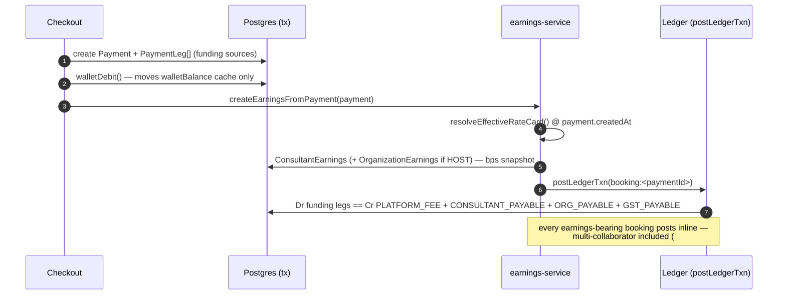

# Booking → earnings

**What this covers:** how a sponsored booking turns into money — the three-way split (`RateCard`, basis points, snapshots), the `BOOKING` ledger posting it produces, and the `ConsultantEarnings` / `OrganizationEarnings` rows that cache the result for payout. The funding side (which sources paid) is in [payment legs](09-payment-legs.md); the journal mechanics are in [ledger & postings](03-ledger-and-postings.md).

> Every host-side booking produces a `ConsultantEarnings` row and (if the expert settles to a HOST org) an `OrganizationEarnings` row. The split is resolved from a `RateCard` **at booking time**, snapshotted, and posted as one balanced `BOOKING` transaction. A retroactive rate change must never rewrite history.

---

## 1. The flow



The `walletDebit` in step 2 moves only the **cache** ([wallet & top-ups](04-wallet-and-topups.md)); the authoritative `Dr WALLET` leg is posted later, inside the booking transaction, where the full split is known.

---

## 2. `RateCard` — the split

```prisma
model RateCard {
  id              String  @id @default(uuid())
  ownerOrgId      String?       // org-scoped card …
  ownerContractId String?       // … or contract-scoped (never both)
  planType        CoveredPlanType?  // null = any
  planId          String?           // null = any
  minGrossPaise   Int?
  maxGrossPaise   Int?
  // Basis points — sum must equal 10000. Integer math; no float drift.
  platformBps     Int
  orgBps          Int
  consultantBps   Int
  effectiveFrom   DateTime  @default(now())
  effectiveTo     DateTime?
}
```

Two scoping columns let a card live at the **org** level (default across contracts) or the **contract** level (a negotiated per-customer split). Exactly one owner is set.

**Time-scoped, never updated.** A rate change closes the old card (`effectiveTo = now()`) and inserts a new one (`effectiveFrom = now()`) in one transaction (`bumpRateCard()`, `lib/api/organizations/rate-card.ts`). Yesterday's booking still resolves the card where `effectiveFrom <= booking.createdAt < effectiveTo`.

**One open window per scope, guarded twice (#1405).** The bump is a read-then-write: it looks for the currently effective card, closes it, and inserts the replacement. Under the default isolation level two administrators bumping the same scope at the same moment could each read "nothing is open here" and each insert a row with `effectiveTo = NULL`, after which `resolveEffectiveRateCard()` had two equally valid candidates and picked between them non-deterministically — two bookings a second apart could settle on different splits. `POST /api/organizations/{orgId}/rate-cards` now runs that transaction at the `Serializable` isolation level and wraps it in `withSerializableRetry()`, so the losing writer aborts and re-runs against the winner's state instead of surfacing a serialization error to the caller. Behind that, the partial unique index `rate_card_one_open_window` in `prisma/sql/check-constraints.sql` makes the invariant structural: it is declared `NULLS NOT DISTINCT` over the four scope columns, because three of them are nullable and Postgres would otherwise treat every NULL as distinct and exempt exactly the rows that need covering (an expression index over `COALESCE` was rejected: the enum-to-text cast is not immutable). A write that still collides comes back as HTTP 409 with the code `RATE_CARD_OPEN_WINDOW_CONFLICT`, which asks the caller to re-read the current card and retry rather than reporting a server fault.

**Resolution order** (`resolveEffectiveRateCard()`, most-specific → least):

1. `Membership.rateCardOverride` (per-expert).
2. Contract-scoped + `planId`.
3. Org-scoped + `planId`.
4. Contract-scoped + `CoveredPlanType`.
5. Org-scoped + `CoveredPlanType`.
6. Contract-scoped default.
7. Org-scoped default.
8. Hardcoded `DEFAULT_RATE_CARD` = **10% / 10% / 80%** (platform / org / expert); `rateCardId = null` is the sentinel for "defaults used".

**Which tiers a booking can reach depends on one flag.** `resolveOrgSplit()` (`lib/payments/payouts/earnings-service.ts`) is the resolver's only production caller, and until #1335 it passed just `orgId`, `membershipOverrideId` and `at`. A settling booking could therefore land only on tiers 1, 7 and 8 — the per-expert override, the org-scoped default, or the hardcoded fallback — even though it had already resolved the plan that selects tiers 2 through 5. The rate-card POST handler will happily create a contract-scoped or `planId`-scoped card, so such a card could exist and never be chosen.

`RATE_CARD_SCOPED_RESOLUTION` closes that gap, and it is **off unless the value is exactly `on`**. The default is off because the flip changes which card settles live money: any scoped card an org created while the tiers were unreachable would begin paying a different split the moment it becomes selectable, so an org must be able to audit its cards first and flip second. The gate is `isScopedRateCardResolutionEnabled()` in `lib/api/organizations/rate-card.ts`; off, `resolveOrgSplit()` makes the pre-#1335 call verbatim.

With the flag on, settlement forwards three more fields, all derived inside the same transaction that writes the earnings rows:

| Field        | Where it comes from                                                                                                                                       | When it is null                                                                                                                                                                                                                     |
| ------------ | --------------------------------------------------------------------------------------------------------------------------------------------------------- | ----------------------------------------------------------------------------------------------------------------------------------------------------------------------------------------------------------------------------------- |
| `planType`   | The settlement's own `AppointmentType`, mapped through the exhaustive `RATE_CARD_PLAN_TYPE` record so an enum rename fails the build.                     | Never, on the primary leg.                                                                                                                                                                                                          |
| `planId`     | The plan already resolved for the org-ownership lookup.                                                                                                   | Consultation and subscription bookings, whose plan ids are not carried in the settlement payload. Those still resolve at `planType` granularity (tiers 4 and 5).                                                                    |
| `contractId` | `BookingUtilization` (unique on `paymentId`) → `ProgramAssignment` → `Program` → `Contract`, which is the only link a settling payment has to a contract. | Marketplace and self-funded bookings, which have no contract; subscription bookings, which meter utilization at slot-allocation time and so have none yet at settlement; and any contract that does not belong to the settling org. |

That last exclusion is a tenancy guard rather than a nicety. A contract-scoped card is created under `POST /organizations/{orgId}/rate-cards`, which checks the contract against that org, so `ownerContractId` alone identifies the owner — and `resolveEffectiveRateCard()` matches `ownerContractId` without re-asserting the org. Since `Contract.organizationId` is the **sponsoring** org while `resolveOrgSplit()` resolves the expert's **host** org, forwarding the contract unguarded would let one tenant's booking settle on another tenant's negotiated split. Contract scope is therefore reachable only where the sponsor and the host are the same organization, which is the HYBRID case the tier was designed for.

The collaborator leg passes no scope at all under either flag state. ADR 18 makes collaborations org-blind, so the seller's contract and plan must not select a card owned by the collaborator's own org.

**The bps invariant:** `platformBps + orgBps + consultantBps === 10000` on every row — enforced at the creation site (`bumpRateCard()` + the rate-card POST handler), not yet a Postgres CHECK (follow-up).

> **Everything is bps now.** #772 unified splits on integer basis points (`10000 = 100%`). The old `Float` `sharePercentage` / `revenueSharePercentage` columns are gone — `ConsultantEarnings.shareBps` and the collaborator `revenueShareBps` columns replace them. Float money math is banned.

### 2.1 Two worked splits — marketplace vs HOST org

The split a booking gets depends on whether the expert settles to a HOST org. `resolveOrgSplit()` (`lib/payments/payouts/earnings-service.ts`) looks for an `ACTIVE` `EXPERT` membership on a `canHost` org; if there isn't one, the booking takes the **marketplace path**, and if there is, it takes the **RateCard three-way path**. Same ₹8,000 booking (`grossAmount = 800_000` paise; GST is computed separately on the fee region), two outcomes:

**Marketplace — Arjun Anderson (seeded freelance solo, no HOST-org panel).** No org split resolves, so `createEarningsFromPayment()` takes a flat `PAYOUT_CONSTANTS.PLATFORM_FEE_PERCENTAGE` (**20%**) and the consultant gets the rest — there is no org leg at all:

```
grossAmount          = 800_000 paise
platformFeePaise     = round(800_000 × 20 / 100) = 160_000   (platform's 20%)
totalConsultantPool  = 800_000 − 160_000         = 640_000   (Arjun's ConsultantEarnings)
```

Arjun nets **₹6,400**; the platform recognizes **₹1,600**. His `ConsultantEarnings.consultantSharePaise` carries the full ₹6,400 — no `OrganizationEarnings` row exists because no org is in the loop.

**HOST org — a LearnPro panel expert (seeded RateCard 10 / 10 / 80).** Now `resolveOrgSplit()` finds the LearnPro EXPERT membership and computes the split inline against the resolved rate card. Each independent share is **floored**, and the **org leg absorbs the rounding remainder**:

```
grossAmount          = 800_000 paise
platformFeePaise     = floor(800_000 × 1000 / 10000) = floor(80_000.0)  =  80_000  (10%)
consultantSharePaise = floor(800_000 × 8000 / 10000) = floor(640_000.0) = 640_000  (80%)
orgShare             = 800_000 − 80_000 − 640_000                       =  80_000  (the 10% org leg, by subtraction)
```

So the same ₹8,000 splits ₹800 platform / ₹6,400 to the panel expert / ₹800 retained by LearnPro — a three-way posting (`Cr PLATFORM_FEE` + `Cr CONSULTANT_PAYABLE` + `Cr ORG_PAYABLE`), see [chart of accounts §4](02-chart-of-accounts.md). The floors matter on odd amounts: a ₹8,001 booking (`800_100`) gives `platformFee = 80_010`, `consultantShare = 640_080`, `orgShare = 800_100 − 80_010 − 640_080 = 80_010` — the remainder lands in the org leg, never lost. Two independent `floor`s can each shave a paise; subtracting-the-rest into `orgShare` is what keeps `platformFee + consultantShare + orgShare == gross` exactly.

> Note the marketplace path uses the `PLATFORM_FEE_PERCENTAGE` constant (20%), **not** the `DEFAULT_RATE_CARD` (10/10/80). The default card is the fallback _inside_ `resolveOrgSplit()` — it only applies on the HOST-org path when no more-specific card resolves. A true solo marketplace booking never reaches `resolveOrgSplit()`, so the two figures (20% vs 10%) are _not_ a contradiction: they're two different code paths gated on whether a `canHost` EXPERT membership exists.

---

## 3. The `BOOKING` posting

The split becomes one balanced transaction (`booking:<paymentId>`, kind `BOOKING`). The funding legs ([payment legs](09-payment-legs.md)) are the debits; the split is the credits:

```
Dr CASH / WALLET(org) / ORG_RECEIVABLE(org) / PLATFORM_PROMO   (the funding legs)
Dr DISCOUNT            max(0, originalAmount + taxAmount − Σ(funding-leg debits))
   Cr PLATFORM_FEE              platform fee
   Cr CONSULTANT_PAYABLE(consultant)   total consultant pool
   Cr ORG_PAYABLE(org)         org share (only if > 0)
   Cr GST_PAYABLE              tax amount
```

See [ledger & postings §4.2](03-ledger-and-postings.md) for the exact leg-to-account mapping. **Every earnings-bearing booking now posts inline — multi-collaborator included** (#773, closed in the #778 finance-correctness PR). The splits path resolves each collaborator's HOST-org settlement up front and posts one balanced `booking:<paymentId>` transaction: funding debits by leg source, then credits of `PLATFORM_FEE` (the primary fee plus the settled collaborators' fee slices), one `CONSULTANT_PAYABLE` per party (a settled collaborator's earnings row stores the share **net** of the host-org cut, so cache equals journal credit exactly), one `ORG_PAYABLE` per host org, and `GST_PAYABLE`. A posting failure rolls the whole earnings creation back, and the reconciler's `EARNINGS_WITHOUT_BOOKING_TXN` finding (threshold 0) enforces that the platform never again runs partially journaled. One related standing pattern: a member-paid overage capture credits `ORG_PAYABLE` without an earnings row, so that account legitimately carries an overage-relief credit until the payout batch drains ledger payables — reconcile treats it as expected, not as drift.

---

## 4. Earnings rows are reconciled caches

Both earnings tables carry **bps snapshots** so a later rate bump can't rewrite them, plus cached amount columns the reconciler checks:

```prisma
model OrganizationEarnings {
  orgSharePaise        Int
  platformFeePaise     Int
  consultantSharePaise Int
  rateCardIdApplied    String?
  platformBpsApplied   Int?
  orgBpsApplied        Int?
  consultantBpsApplied Int?
  @@unique([paymentId, organizationId])  // one row per (payment, HOST org)
}
model ConsultantEarnings {
  shareBps             Int    // multi-collaborator split, basis points
  platformFeePaise     Int
  consultantSharePaise Int
  status               EarningStatus  // PENDING → READY → BATCHED → PAID (HELD on dispute)
  holdUntil            DateTime?
}
```

Settlement/payout code reads the `*Applied` / `*AtBooking` snapshots and the cached amounts — **never** the live `RateCard`. The reconciler asserts the cached amounts equal the booking journal's `PLATFORM_FEE + CONSULTANT_PAYABLE + ORG_PAYABLE` credits (`EARNINGS_LEDGER_DRIFT`, [ledger integrity](13-ledger-integrity.md)).

Note (per-collaborator, A3): one `Payment` can carry **N** `OrganizationEarnings` rows — the primary expert's org plus one per collaborator-at-a-different-HOST-org, capped by the `@@unique([paymentId, organizationId])` constraint.

---

## 5. `PayoutRecipient` — who gets the expert leg

`Membership.payoutRecipient` decides where the consultant share lands:

- `SELF` (default, marketplace) — booked to `ConsultantEarnings` for the expert's own payout.
- `ORGANIZATION` — internal/salaried expert; the expert-share leg is booked to the org, collapsing the three-way split into platform + org for that booking.

See [expert lifecycle](../30-programs-and-lifecycle/03-expert-lifecycle.md) for how an org flips an expert to `ORGANIZATION` on approval.

---

## 6. Program overage — when a booking breaches the cap

A sponsored booking can exceed the covering `ProgramAssignment`'s cap (a LICENSED_SEAT's `coveredEngagementsPerCycle` or a CREDIT_POOL's `creditBudgetPerCycle`). What happens is governed by the program's `OverageBehavior` (`BLOCK` / `CHARGE_MEMBER` / `CHARGE_ORG`) and computed by one pure mapper, `computeOverageForBooking` (`lib/payments/billing/overage.ts`), shared by both the pre-checkout preview and the at-checkout recorder so the two can never drift.

### 6.1 The marginal: base + surcharge

The marginal is the **over-cap portion of the real booking price** (consulting rates are heterogeneous, so it's a pass-through, optionally capped per engagement by `priceCapPerEngagementPaise`), then marked up by `overageSurchargeBps`. `OverageEvent` itemizes both so the charge stays auditable and GST-splittable:

- `basePaise` — the pass-through over-cap portion. **Invariant: `coveredPaise + basePaise == booking price`.**
- `surchargePaise` — `floor(basePaise × overageSurchargeBps / 10000)`. The surcharge is what can push the marginal _above_ a single booking price (overage costs more, by design).
- `marginalPaise` — the authoritative charged total, `basePaise + surchargePaise`.

### 6.2 Pre-checkout preview

`previewOverageForBooking` (`lib/payments/billing/overage-preview.ts`, surfaced at `POST /api/organizations/[orgId]/checkout/overage-preview`) answers "if this member books this plan via this org now, will it breach the cap and what does it cost?" — so the checkout UI warns **before** pay. It resolves the same active assignment as checkout and runs the same mapper over the assignment's _current_ (pre-booking) usage, returning `coveredPaise` / `marginalPaise` / `surchargePaise`, `willExceedCap`, `willBlock`, and `chargeTo`. PERSONAL funding, no covering assignment, or an unlimited LICENSE seat → `applicable: false` (no overage line shown).

### 6.3 At-checkout recording + the circuit breaker

On a real over-cap checkout, `recordOverageAtCheckout` (`lib/payments/billing/overage-settlement.ts`) runs inside the booking's Serializable tx:

- **Circuit breaker.** `maxOveragePerCyclePaise` is a per-cycle overage ceiling. If `cycleOverageSoFarPaise + marginal` would breach it, the mapper returns `decision: BLOCK, chargeTo: null` **regardless of `overageBehavior`** — the recorder throws `PROGRAM_CAP_EXHAUSTED` (HTTP 402), the same shape as a `BLOCK`-behavior refusal but with a distinct code so the dashboard can say "cycle ceiling" vs "per-member allocation". An unknown/missing `overageBehavior` also **fails safe to `BLOCK`**.
- **`CHARGE_MEMBER`** → a parent-linked **PENDING side-`Payment`** for the marginal (gateway _not_ called inside the tx; the order is minted lazily when the member opens the resume-checkout surface) + an `OverageEvent(PENDING)`. To avoid double-collecting `basePaise`, checkout carves it out of the org-funded parent's `INVOICE_ACCRUAL` leg (fail-closed: a non-invoice-funded parent has no credit-back path yet, #715, so it aborts rather than double-charge). Member is notified (`notifyOrgProgramOverageDue`) with a pay deep link. The webhook later posts the `OVERAGE_MEMBER` org-relief leg ([§4.8 of ledger & postings](03-ledger-and-postings.md)).
- **`CHARGE_ORG` on the INVOICE rail** → carve `basePaise` out of the base `INVOICE_ACCRUAL` leg and write the marginal as a distinct **`OVERAGE_INVOICE_ACCRUAL`** leg (the distinct source dodges the `@@unique([paymentId, source])` clash) + an `OverageEvent(PENDING)`. The cycle-close rollup turns it into an `InvoiceLineItem` and walks the event `PENDING → ACCRUED → CHARGED` ([invoicing](08-invoicing.md)).
- **`CHARGE_ORG` on the WALLET rail (#1458)** → nothing is billed, because the wallet debit taken when the booking committed is the whole nominal price and therefore already contains the over-cap pass-through. The recorder writes **no** leg and does **not** touch `Payment.amount`; it records an `OverageEvent` that is born `CHARGED` with `settledAt` stamped and `paymentId` pointing at the booking payment whose `WALLET` leg collected it. That event carries no `invoiceLineItemId`, so the reconciler's link invariant accepts either link as proof of collection. Anything else on this rail fails closed with a business error rather than inflating the payment: a positive `overageSurchargeBps` is a markup the wallet debit never took, and an org-sponsored payment carrying none of the `WALLET` / `INVOICE_ACCRUAL` / `LICENSE` funding legs means the funding seam itself has drifted.
- **`CHARGE_ORG` on the LICENSE rail is refused (#1458).** A licence is a flat fee settled at contract time, so a licence-funded booking moves no money per booking: its funding leg is deliberately ₹0 while `Payment.amount` stays at the full price, and the leg-sum guard excuses that only while the licence leg is the payment's _only_ funding leg. Adding an overage leg re-arms the comparison, so `assert_payment_legs_ok` raised at COMMIT and the booking died with an opaque database error. There is no per-booking rail to collect the marginal on, so `overageBehaviorUnsupportedReason` refuses any charging behaviour on a licence-funded account and checkout keeps the fail-closed backstop.
- **`CHARGE_MEMBER` is not available on a WALLET account (#715, guarded in #1458).** Collecting from the member requires carving the over-cap portion back out of the parent, which on the wallet rail would mean crediting the wallet mid-transaction — a path that has never been built. `overageBehaviorUnsupportedReason` (`lib/enterprise/reachable-paths.ts`) refuses the combination when the programme is created or patched, so an operator cannot save a configuration whose only outcome is a refused booking. Checkout keeps its fail-closed throw for programmes configured before that guard existed, now carrying the code `OVERAGE_CHARGE_MEMBER_UNSUPPORTED` and an HTTP 409.

The `chargeStatus` state machine itself is a single guarded transition (`transitionOverage`, `overage-transitions.ts`); the overage-event lifecycle table of states (`PENDING/ACCRUED/CHARGED/BLOCKED/REVERSED/FAILED`) is in [funding & programs](../00-foundations/03-funding-and-programs.md) / [programs](../30-programs-and-lifecycle/02-programs.md).

Because a wallet-funded overage never adds to `Payment.amount`, a cancellation of such a booking refunds exactly what the wallet was debited. The refund cascade splits the refund across the payment's legs, and the single `WALLET` leg equals `Payment.amount`, so a full refund credits the wallet back to the balance it held before the booking. The same cascade reverses the `CHARGED` event, because the money it represented has just been returned and the programme's per-cycle ceiling has to be released with it.

An overage also has to keep the booking journal balanced, and that is a tighter constraint than the leg-sum identity. Every credit in the BOOKING posting is derived from `Payment.originalAmount` plus `taxAmount` — the nominal price — while the debits are the funding legs plus a `DISCOUNT` plug clamped at zero or above. The posting therefore balances only while the funding legs sum to no more than the nominal gross. On the wallet rail that now holds by construction. On the invoice rail it does not: the base carve keeps `basePaise` inside the price, but `marginal = base + surcharge` raises both the accrual leg and `Payment.amount` by the surcharge, which is real funding sitting outside the nominal price. The posting therefore credits that surcharge to `PLATFORM_FEE`, because an over-cap surcharge is a markup the platform charges the organisation for exceeding its own cap and not consultant income — the consultant is paid out of `originalAmount`. Without that credit the posting was short by exactly `surchargePaise`, threw `LedgerImbalanceError`, and the booking committed with no journal entry at all (Sentry `FAMILIARISE_WEB-28`).

The refusals checkout can raise from inside its transaction all carry a machine-readable code, and the catch around that transaction rethrows any error whose code is registered in `BUSINESS_ERROR_CODES` instead of rewriting it. `PROGRAM_CAP_EXHAUSTED` therefore reaches the buyer as the HTTP 402 it was thrown as, with a toast that names the admin action, rather than as the 500 "Something Went Wrong" it used to collapse into.

---

## 7. Design decisions & trade-offs

- **Snapshot the card at booking, never resolve it retroactively.** A `RateCard` is time-scoped and immutable: a rate change closes the old row and inserts a new one (`bumpRateCard()`), and every earnings row stamps the `*Applied` bps it was split on (`OrganizationEarnings.platformBpsApplied/orgBpsApplied/consultantBpsApplied`, `ConsultantEarnings.shareBps`). The rejected alternative — a mutable card that settlement reads live — is simpler by one table-write but **corrupts history**: a Monday rate bump would silently restate Sunday's already-posted booking, and the reconciler's `EARNINGS_LEDGER_DRIFT` ([§4](#4-earnings-rows-are-reconciled-caches)) would then fire on every pre-bump payment because the cached amounts no longer match a card that changed underneath them. The cost is the snapshot columns + the close-and-insert dance; the benefit is that yesterday's money is _frozen_ — settlement code reads the snapshot, never the live card.
- **`floor` each independent share, subtract-the-rest into the org leg.** Three `round`s could sum to gross ± 1 paise; flooring `platformFee` and `consultantShare` independently and computing `orgShare = gross − platformFee − consultantShare` makes the identity `platformFee + consultantShare + orgShare == gross` hold _by construction_ (§2.1). The org leg deliberately absorbs the ≤1 paise remainder — it's the residual party, and a clamp guards the rare negative-`orgShare` case (`resolveOrgSplit()`, `lib/payments/payouts/earnings-service.ts`).
- **Earnings rows are reconciled caches, not the source of truth.** The authoritative split is the `BOOKING` journal's credits; the `Earnings` tables cache it (with bps snapshots) so payout can read one row instead of re-summing the journal per consultant. Same contract as `walletBalance` ([money model overview §4](01-money-model-overview.md)): append-only journal is truth, the cache is reconciled nightly (`EARNINGS_LEDGER_DRIFT`).

### 🛠️ What this design survived

- **The silently-dropped `DISCOUNT` plug on referral-funded bookings (`d335901e`, #776 / #785 review).** The `BOOKING` posting's `DISCOUNT` leg is the platform-absorbed gap between gross (`originalAmount + taxAmount`) and the funding actually applied. It was computed off `Payment.amount` — but a `REFERRAL_CREDIT` leg funds the booking (debited as `PLATFORM_PROMO`) and is **already excluded** from `Payment.amount` (the post-credit figure). So the credit was counted twice (once as `PLATFORM_PROMO`, once inside `DISCOUNT`), the posting failed `Σdebit == Σcredit`, and `postLedgerTxn` threw — silently dropping the _entire booking transaction_ for any referral-funded booking while the earnings rows still wrote. The fix bases the plug on `Σ(funding-leg debits)` (`fundingDebitTotal`, `lib/payments/payouts/earnings-service.ts`), counting the credit once. **Full narrative + the posting block lives in [ledger & postings §5b](03-ledger-and-postings.md#5b-what-this-design-survived)** — this doc owns the booking-split side; that doc owns the journal mechanics. The `DISCOUNT … max(0, originalAmount + taxAmount − Σ(funding-leg debits))` line in §3's posting box is the trace back to this fix: it bases on the funding-leg sum precisely so the referral credit isn't double-counted.

### 6.4 CHARGE_MEMBER timeout — two crons, two jobs

A member-pays overage sits `PENDING` until the side-payment SUCCEEDS. **Two distinct crons** retire never-settled ones — read both before touching either:

| Cron                                                     | Window                                     | What it does                                                                                                                                                                                          | Notifies? |
| -------------------------------------------------------- | ------------------------------------------ | ----------------------------------------------------------------------------------------------------------------------------------------------------------------------------------------------------- | --------- |
| `jobs/cleanup/sweep-abandoned-overage-charges.ts` (#785) | 7 days off the synthetic `overage:` intent | FAILs **never-_started_** side-charges (member never even minted the order) so they stop counting toward the circuit-breaker ceiling — **silent ceiling relief**                                      | No        |
| `jobs/billing/timeout-member-overages.ts` (#779 §A)      | hard **14-day** wall                       | FAILs the `OverageEvent` via the dedicated `chargeTimedOutAt` stamp + telemetry (`chargeAttemptCount` / `lastChargeAttemptAt` / `chargeFailureReason`) and **tells the member** the obligation lapsed | Yes       |

They're idempotent against each other: a row the 7-day sweep already moved to `FAILED` no longer matches `chargeStatus = PENDING` in the 14-day cron, and both claim on a `…:null` gate so a re-run/replica matches zero rows. A late capture webhook can still recover a wrongly-swept charge (`FAILED → CHARGED`, see `transitionOverage`).

### 6.5 Refund-failed notification

Refunds (including overage reversals) are gateway-bound; a `Refund` that the gateway **rejects** is stamped `failedAt` + `failureReason`, and the refund reconcile cron (`jobs/refunds/reconcile-pending-refunds.ts`, every 15 min) pages the payer via `notifyFailedRefunds`, selecting `FAILED` refunds where `failedNotifiedAt IS NULL` and stamping it so the alert fires once. (`Refund.reason` is the _operator's_ reason for refunding; `failureReason` is _why the gateway said no_ — don't conflate them.) See [invoicing §8](08-invoicing.md) for the refund credit-note cascade.

---

### Related docs

- [Payment legs](09-payment-legs.md) — the funding side (the booking's debits).
- [Ledger & postings](03-ledger-and-postings.md) — the `BOOKING` transaction in full.
- [Payout pipeline](07-payout-pipeline.md) — how earnings roll up into payouts.
- [Ledger integrity](13-ledger-integrity.md) — `EARNINGS_LEDGER_DRIFT`.
- [Concurrency & idempotency](../30-programs-and-lifecycle/01-concurrency-and-idempotency.md) — the atomic rate-card bump.
- [Expert lifecycle](../30-programs-and-lifecycle/03-expert-lifecycle.md) · [Harness verdict](../60-scenarios-and-verdicts/02-harness-verdict.md).
