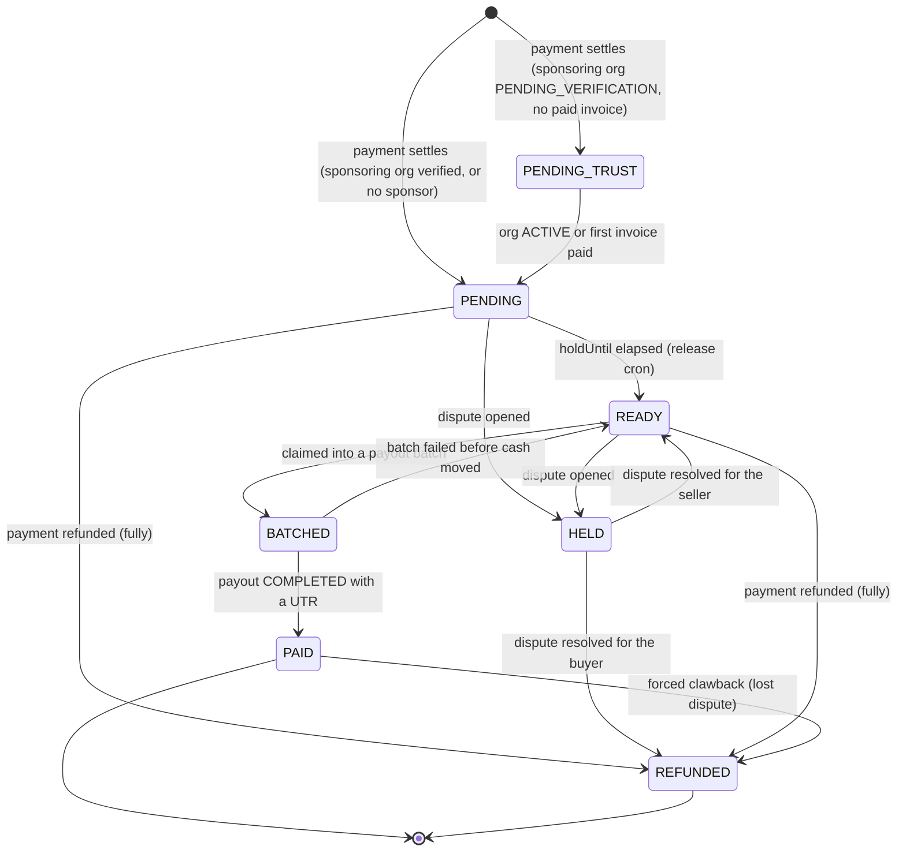

# Earnings lifecycle

**What this covers:** how an earnings row is minted when a payment settles, every `EarningStatus` it can move through, and how it is held, released, refunded, and finally paid. It covers both the consultant-side row (`ConsultantEarnings`) and the host-org-side row (`OrganizationEarnings`), because they share one status enum and one set of transition rules. The batching that consumes a `READY` row and turns it into an actual bank transfer lives in [payout pipeline](07-payout-pipeline.md); this doc stops at the moment a row becomes eligible for that batch.

> Every host-side booking mints one `ConsultantEarnings` row, and — when the expert settles to a HOST org — one `OrganizationEarnings` row as well. Both start life in a hold, move to `READY` when the hold elapses, and end in `PAID` when a payout's gateway leg confirms. A refund never deletes a row; it increments a cumulative refunded column and, when the row is fully reversed, flips it to `REFUNDED`.

---

## 1. How a row is minted

Earnings are minted from a settled payment, not from the booking request, so a payment that never captures never accrues anything. The entry point is `createEarningsFromPayment` (`lib/payments/payouts/earnings-service.ts`), called from the payment-success path. The function runs inside one `prisma.$transaction` and is idempotent: it first looks for an existing `ConsultantEarnings` row for the same `(paymentId, consultantProfileId)` and returns early if one is found, so an at-least-once webhook redelivery cannot double-mint.

The split is computed from the rate card that was effective **at payment-creation time**, not at settlement time — `resolveOrgSplit` is passed `payment.createdAt` precisely because a hold can be days long and the live card may have been bumped in the interim. The full split arithmetic (the marketplace 20% path versus the HOST-org three-way `RateCard` path, and the floor-and-subtract rounding) is documented in [booking → earnings §2.1](05-booking-to-earnings.md); this doc only needs the result: a `consultantSharePaise` for the expert and, on the HOST path, an `orgSharePaise` for the org.

The two row types differ in what they cache and how the split is stamped. A `ConsultantEarnings` row carries `consultantSharePaise`, `platformFeePaise`, the collaborator `shareBps`, and `refundedShareAmount`. An `OrganizationEarnings` row carries `grossAmountPaise`, `platformFeePaise`, `orgSharePaise`, `consultantSharePaise`, `refundedAmountPaise`, and the basis-point snapshot — `rateCardIdApplied`, `platformBpsApplied`, `orgBpsApplied`, and `consultantBpsApplied` — so that payout reconciliation reads the exact split that was applied rather than the live `RateCard`. That snapshot is the whole reason a retroactive rate change can never restate already-minted earnings.

The table below summarises which row each settlement path produces.

| Settlement path | `ConsultantEarnings` | `OrganizationEarnings` | Notes |
|---|---|---|---|
| Marketplace (solo expert, no HOST org) | one row, full consultant pool | none | flat 20% platform fee; no org leg exists |
| HOST org, `payoutRecipient = SELF` | one row per party (owner + collaborators) | one row, `orgSharePaise > 0` | three-way `RateCard` split |
| HOST org, `payoutRecipient = ORGANIZATION` | expert leg collapses into the org | one row | salaried/internal expert; see [expert lifecycle](../30-programs-and-lifecycle/03-expert-lifecycle.md) |
| HOST org, platform-only mode (`orgShare == 0`) | one row | none | a zero-value org row is intentionally skipped as noise |

> A single payment can carry **N** `OrganizationEarnings` rows post-A3 — the primary expert's org plus one per collaborator who settles to a different HOST org — bounded by the `@@unique([paymentId, organizationId])` constraint. See [booking → earnings §4](05-booking-to-earnings.md).

---

## 2. The `EarningStatus` state machine

Both row types move through the same `EarningStatus` enum (`prisma/schema.prisma`): `PENDING`, `PENDING_TRUST`, `HELD`, `READY`, `BATCHED`, `PAID`, and `REFUNDED`. The diagram below shows the legal transitions; each is explained in the paragraphs that follow.

Both the consultant row and any org row begin in **`PENDING`** — the hold period — when the booking's **sponsoring** org (`payment.organizationId`) is already verified or the booking has no sponsor. When the sponsoring org is still `PENDING_VERIFICATION` and has never paid an invoice, every row the booking writes — the consultant row included — begins in **`PENDING_TRUST`** instead; this is the #687 guard explained in §3.

The **`PENDING_TRUST → PENDING`** promotion is performed by the `release-pending-trust-earnings` cron (`jobs/cleanup/release-pending-trust-earnings.ts`) once the sponsoring org transitions to `ACTIVE` or its first invoice clears. Until then the row is invisible to payout batching, which only ever claims `READY` rows.

The **`PENDING → READY`** transition is the hold elapsing. The hourly `releaseEarningsFromHold` function (`earnings-service.ts`) flips every row whose `status` is `PENDING` and whose `holdUntil <= now` to `READY`, for both `ConsultantEarnings` and `OrganizationEarnings` in the same run. Hold mechanics are detailed in §4.

The **`PENDING → HELD`** and **`READY → HELD`** transitions freeze a row for a dispute. `holdEarnings` (`earnings-service.ts`) refuses to act unless the row is currently `PENDING` or `READY`, so a `PAID` or `REFUNDED` row can never be re-frozen. The inverse **`HELD → READY`** transition is `releaseHeldEarnings`, called when the dispute resolves in the seller's favour; it acts only on a row that is currently `HELD`.

The **`READY → BATCHED → PAID`** progression is where this doc hands off to the payout pipeline. Batching claims a row by stamping its `payoutId` / `orgPayoutId` and flipping it from `READY` to the intermediate **`BATCHED`** status at batch-creation time — on both the consultant and the org rail. A `BATCHED` row is committed to a payout but its cash has **not** yet left, so it is neither eligible to be batched again nor counted as disbursed by finance exports or dashboards. Only when the payout's gateway leg confirms (`PROCESSING → COMPLETED` **with a UTR**) does the pipeline flip `BATCHED → PAID` and post the settlement to the ledger — see [payout pipeline §3](07-payout-pipeline.md). A batch that fails before any cash moves releases its `BATCHED` rows back to `READY` for the next run (§5).

The transitions into **`REFUNDED`** are driven by `refundEarnings` and are covered in §5. The guard `assertEarningStatusTransitionLegal` (`lib/payments/payouts/earning-status.ts`) makes `REFUNDED` terminal and permits a `PAID` row to move only to `REFUNDED` — any other transition out of `PAID`, or any transition out of `REFUNDED`, throws `IllegalEarningStatusTransitionError`. This is what stops a settled row, which has already triggered a real bank transfer and a TDS deduction, from being silently rewritten.

---

## 3. `PENDING_TRUST` — the #687 invoice-fraud guard

`PENDING_TRUST` exists to close a fraud hole. An organization that is still `PENDING_VERIFICATION` and funds its bookings by INVOICE could otherwise accrue real consultant earnings against bookings it has not yet paid for, and then disappear before its first invoice ever clears — leaving the platform owing experts for work an unverified, unpaid org commissioned. To prevent that, `createEarningsFromPayment` resolves the booking's **sponsoring** org (`payment.organizationId` — the org that owes the invoice, not the expert's HOST org) once, up front: if that sponsoring org is `PENDING_VERIFICATION` and its count of `PAID` `OrganizationInvoice` rows is zero, **every** earnings row the booking writes — the consultant row, the primary org row, and each collaborator-org row — is minted in `PENDING_TRUST` rather than `PENDING` (`earnings-service.ts`). Keying on the sponsor rather than the host is what stops an unverified sponsor from letting either consultant *or* org earnings clear.

A row parked in `PENDING_TRUST` is excluded from the hold-release cron (which only touches `PENDING` rows) and therefore can never reach `READY` or be batched into a payout. The `release-pending-trust-earnings` cron promotes it to `PENDING` only once the org has earned trust — it goes `ACTIVE`, or it pays its first invoice. The rejected alternative, accruing straight to `PENDING`, would have been one less state to carry but would have re-opened the ghost-org hole.

Upstream of parking, the checkout path now hard-requires a **verified domain claim** before an org may fund anything by INVOICE at all (`assertVerifiedDomainOrThrow`, called on the INVOICE funding branch of `checkout.ts`). The ghost-org window is therefore narrowed on two fronts: an unverified sponsor cannot accrue INVOICE debt without first proving domain ownership, and any earnings its bookings do generate park in `PENDING_TRUST` until it earns trust.

---

## 4. Hold windows, dispute holds, and release

The hold window is what gives the platform time to absorb a refund or dispute before money leaves. At mint time, `createEarningsFromPayment` sets `holdUntil = now + HOLD_PERIOD_HOURS[appointmentType]` (`lib/payments/payouts/constants.ts`). The windows are keyed by appointment type and run from the moment of earnings creation, not from the appointment's completion time.

The table below lists the configured hold periods and the reasoning behind each.

| Appointment type | Hold (hours) | Rationale |
|---|---|---|
| `CONSULTATION` | 24 | short engagement, quick refund resolution |
| `CLASS` | 24 | same profile as a consultation |
| `WEBINAR` | 48 | leaves room for participant feedback |
| `SUBSCRIPTION` | 168 (7 days) | longer commitment, higher refund risk |

> 🟡 **Gap (doc-vs-code, no issue filed yet):** earlier drafts of the payout doc described the hold as roughly `completedAt + 3 days`. The code derives `holdUntil` from `Date.now()` at earnings-creation time using the per-type `HOLD_PERIOD_HOURS` table above (24h / 48h / 168h), and the default when the type is unknown is the 24-hour `CONSULTATION` window — there is no three-day default and the anchor is the creation timestamp, not `completedAt`. Treat the per-type table as ground truth.

Release is the hourly cron `releaseEarningsFromHold`, which runs one `updateMany` per row type: every `PENDING` row whose `holdUntil <= now` becomes `READY`. It does not touch `HELD` rows — a dispute hold is released only by an explicit `releaseHeldEarnings` call, never by the timer.

A dispute hold is the manual override on top of the timed hold. `holdEarnings` moves a `PENDING` or `READY` row to `HELD` and is rejected for any other starting status, so disputes can only freeze money that has not yet been paid. When the dispute resolves, the seller-favourable outcome is `releaseHeldEarnings` (`HELD → READY`, after which the row re-enters normal batching) and the buyer-favourable outcome is a refund (`HELD → REFUNDED`, §5).

---

## 5. Refunds: append-only decrements, never deletes

A refund never deletes an earnings row and never subtracts from the principal columns. Instead `refundEarnings` (`earnings-service.ts`) **increments** a cumulative refunded column — `refundedShareAmount` on `ConsultantEarnings`, `refundedAmountPaise` on `OrganizationEarnings` — and flips the row to `REFUNDED` only once that cumulative figure reaches the full share. Keeping the principal intact and tracking the reversal separately is what lets a partial refund be applied, and re-applied on a duplicate webhook, without ever over-reversing: each call caps the reversal at the remaining reversible balance (`max(0, share − alreadyRefunded)`).

Partial refunds are proportional. When `refundEarnings` is given a `refundAmount` smaller than the `paymentAmount`, it reverses that ratio of every linked earnings row (owner and each collaborator), and of every `OrganizationEarnings` row for the payment. A zero-amount refund is a no-op by construction. Because the refunded amount is tracked rather than subtracted, the payout pipeline's net-payout math is always `share − refunded`, which it reads directly off the row.

A refund of an earning that is **already `PAID`** is the clawback case, and it is gated. `refundEarnings` refuses to reverse a `PAID` row unless the caller passes `forceRefund: true` (the controlled lost-dispute path). When forced, it asserts the `PAID → REFUNDED` transition is legal, increments the refunded column, and — for a `ConsultantEarnings` row — writes a negative `TDSRecord` reversal in the same transaction so the withheld tax is unwound alongside the principal. On the org side, a refund of an earning that has already rolled into a completed `OrganizationPayout` is recorded against the payout's `clawbackAmountPaise` for manual recovery; the org pipeline does not auto-reverse a completed transfer. The clawback mechanics on the payout side are detailed in [payout pipeline](07-payout-pipeline.md).

> 🟡 **Gap (no issue filed yet):** the consultant-side forced clawback writes a negative `TDSRecord` row, but the org-side clawback only stamps `OrganizationPayout.clawbackAmountPaise` and `clawbackInitiatedAt` for an operator to action by hand — there is no automated reversal posting or TDS adjustment on the org rail. The `TdsAdjustment` model that would carry a signed reversal line into the next quarter's return is present in the schema but unwired (#778 §D/§E).

---

## 6. Where earnings appear in the ledger

The earnings rows are reconciled **caches**, not the source of truth. The authoritative split is the `BOOKING` journal's credits — `PLATFORM_FEE`, `CONSULTANT_PAYABLE`, `ORG_PAYABLE`, `GST_PAYABLE` — posted by the same transaction that mints the rows (see [ledger & postings §4.2](03-ledger-and-postings.md)). The earnings tables exist so that payout code can read one row per seller instead of re-summing the journal, and the nightly reconciler asserts that the cached amounts still equal the journal credits (`EARNINGS_LEDGER_DRIFT`, [ledger integrity](13-ledger-integrity.md)).

When a row finally reaches `PAID`, no new earnings-side number is written to the journal; the cash-leaving entry is the payout's own `PAYOUT` / `ORG_PAYOUT` posting (`Dr *_PAYABLE / Cr CASH + TDS_PAYABLE`), which draws down the payable that the `BOOKING` posting created. The full posting and its reconciliation invariant are in [payout pipeline §3](07-payout-pipeline.md) and [ledger & postings §4.4–4.5](03-ledger-and-postings.md).

---

### Related docs
- [Booking → earnings](05-booking-to-earnings.md) — the rate-card bps split that feeds each earnings row.
- [Payout pipeline](07-payout-pipeline.md) — how `READY` rows roll up into payouts and reach `PAID`.
- [Ledger & postings](03-ledger-and-postings.md) — the `BOOKING` credits the earnings rows cache.
- [Ledger integrity](13-ledger-integrity.md) — `EARNINGS_LEDGER_DRIFT`, the reconciler that checks the cache.
- [Expert lifecycle](../30-programs-and-lifecycle/03-expert-lifecycle.md) — how `payoutRecipient` decides whether an org earnings row exists.
