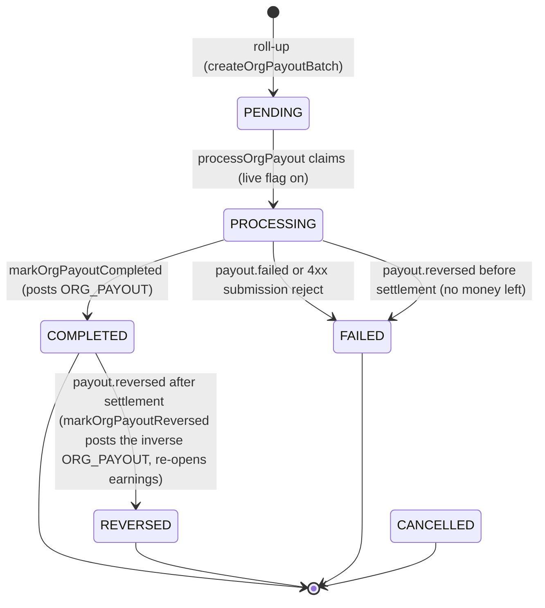
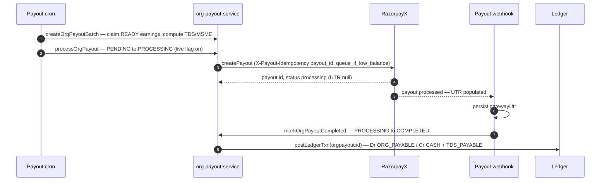

# Payout pipeline (host-side)

**What this covers:** how `READY` earnings roll up into an `OrganizationPayout`, how that payout is submitted to RazorpayX and driven through its gateway lifecycle, the `ORG_PAYOUT` ledger posting that settles the payable when it confirms, and the India statutory fields (TDS / MSME / FEMA) the payout carries. The consultant-side payout (`PAYOUT`) is the structural mirror and is noted where it diverges. The earnings rows this pipeline consumes — how they are minted, held, and released — now live in [earnings lifecycle](06-earnings-lifecycle.md); the booking split that creates them is in [booking → earnings](05-booking-to-earnings.md).

> When a booking settles for a `canHost` org (or an `EXPERT` membership with `payoutRecipient = ORGANIZATION`), an `OrganizationEarnings` row accrues. A periodic cron rolls a window's `READY` earnings into one `OrganizationPayout`, withholds TDS on the pool, submits the net to RazorpayX, and on the gateway's confirmation posts an `ORG_PAYOUT` transaction that draws the org's `ORG_PAYABLE` down to match the cash that left.

---

## 1. From `READY` earnings to a payout (two-sentence summary + link)

An `OrganizationEarnings` row is append-only — a refund increments `refundedAmountPaise` and never deletes — and it carries the basis-point snapshot of the split it was created with. The full `EarningStatus` machine (`PENDING`, `PENDING_TRUST`, `HELD`, `READY`, `BATCHED`, `PAID`, `REFUNDED`), the hold windows that gate `PENDING → READY`, the `#687` `PENDING_TRUST` fraud guard, and the refund decrements all now live in [earnings lifecycle](06-earnings-lifecycle.md); this doc picks the row up at `READY`.

The roll-up has two entry points that share `createOrgPayoutBatch` (`lib/payments/payouts/org-payout-service.ts`): the route `POST /api/organizations/[orgId]/payouts` (OWNER only) and a periodic cron. The procedure, in full, is the following. The batch claims every `READY` `OrganizationEarnings` row for the org with a null `orgPayoutId` whose `createdAt` falls in `[periodStart, periodEnd)`, by creating a placeholder `OrganizationPayout(status = PENDING)` and then stamping each claimed row's `orgPayoutId` in a single conditional `updateMany`. It sums `orgSharePaise − refundedAmountPaise` across the claimed rows to get the net payout, rejecting the batch if that net is zero or negative (refunds exceeding earnings) or if the rows are in mixed currencies. It resolves the org's PAN and MSME status in one fetch, computes the TDS to withhold and the MSME `mustPayByDate`, and writes them back to the payout along with the gross / platform-fee / refunds / net totals. It then flips the claimed earnings from `READY` to the intermediate `BATCHED` status — **not** `PAID`, because cash has not left yet — and writes an `OrgAuditLog(PAYOUT, PAYOUT_INITIATED)` entry. The `BATCHED → PAID` flip happens only later, when the payout reaches `COMPLETED` with a UTR (§3); a batch that fails before the gateway moves money releases its `BATCHED` rows back to `READY`.

### 1.1 Worked walkthrough — LearnPro's weekly batch with TDS

LearnPro Academy is the seeded HOST org: its `OrganizationPayoutAccount` is `VERIFIED` and it has a PAN on file via `taxInfo.panEncrypted`. Suppose the week's `READY` `OrganizationEarnings` sum to an org pool of **₹40,000** (`orgSharePaise = 4_000_000`) with no refunds. `createOrgPayoutBatch` does the following arithmetic (`org-payout-service.ts`).

```
netPayout       = orgShareSum − refundsSum   = 4_000_000 − 0 = 4_000_000 paise
TDS section     = 194O          (DEFAULT_SECTION for ECO payouts to host orgs)
TDS rate        = 0.001          (0.1% — Finance (No. 2) Act 2024, w.e.f. 1-Oct-2024)
tdsAmountPaise  = floor(4_000_000 × 0.001) = floor(4_000.0) = 4_000   (₹40 withheld)
amountAfterTds  = 4_000_000 − 4_000 = 3_996_000               (₹39,960 wired)
```

So LearnPro is owed ₹40,000, the platform withholds **₹40** of TDS to deposit with the government, and **₹39,960** is what goes through the gateway. The `ORG_PAYOUT` posting on `PROCESSING → COMPLETED` is `Dr ORG_PAYABLE(learnpro) 4_000_000 / Cr CASH 3_996_000 + Cr TDS_PAYABLE 4_000` — the debit clears the **full** ₹40,000 payable (net plus TDS), because the org's obligation is discharged whether the cash reached LearnPro or the taxman. The section defaults to 194-O at 0.1% because Familiarise is the e-commerce operator (ECO); a non-resident host would instead carry a DTAA rate and the FEMA fields in §4.

For a payee with **no PAN on file**, the 194-O no-PAN carve-out withholds **5%** (`NO_PAN_RATE_194O`) instead of 0.1% — on this pool that is ₹2,000, fifty times the ₹40 with-PAN figure. That rate cliff is exactly what the `7f7e7d12` PAN-ciphertext war story below was about.

---

## 2. The `PayoutStatus` machine and the `ORG_PAYOUT` posting

`PayoutStatus` (`prisma/schema.prisma`) now has seven values — `PENDING`, `APPROVED`, `PROCESSING`, `COMPLETED`, `FAILED`, `CANCELLED`, and `REVERSED` (added in #812). The `REVERSED` value exists specifically to record a bank bounce that lands **after** the payout already reached `COMPLETED`; the §3 discussion of why it was originally omitted is preserved for context. The diagram below is the org-side machine as the code actually drives it.



Two details distinguish the org machine from the consultant machine. First, the org pipeline has no `APPROVED` step in the live path: `processOrgPayout` claims `PENDING → PROCESSING` directly (the consultant pipeline keeps an admin/auto-approval `APPROVED` stage, §6). Second, when `ENABLE_LIVE_PAYOUTS` is off, `processOrgPayout` deliberately does **not** claim the row — it reads the status and returns, leaving it `PENDING` — because there is no gateway submission and no webhook to advance or roll it back, so claiming it would zombie the row in `PROCESSING` forever (`org-payout-service.ts`).

On `PROCESSING → COMPLETED`, `markOrgPayoutCompleted` posts the settlement (`idempotencyKey = orgpayout:<payoutId>`, `kind = ORG_PAYOUT`) inside the same transaction that flips the status, so a rolled-back transition cannot leave a half-posted ledger.

```
Dr ORG_PAYABLE(org)   netPayoutPaise    (clear what we owed the org, pre-withholding)
   Cr CASH(platform)  amountPaise       (what the rail actually transferred)
   Cr TDS_PAYABLE     tdsAmountPaise    (withheld, only if > 0)
```

The two money columns on `OrganizationPayout` are easy to read the wrong way round, so the schema now says which is which in a `///` comment and the service asserts the relationship before it posts. `netPayoutPaise` is the host organisation's share net of platform fee and refunds, taken **before** withholding, and it is also the base `computeTdsForPayout` is given. `amountPaise` is that figure minus the withholding, which is the sum RazorpayX or Stripe Connect actually moves. The identity `amountPaise + tdsAmountPaise == netPayoutPaise` therefore has to hold for the three legs above to tie out, and `assertOrgPayoutWithholdingIdentity` checks it inside the CAS transaction. When it does not hold there is no correct posting available — any figure we chose would clear the payable or credit cash by an amount that never moved — so the service records a `SystemEvent`, reports to Sentry from outside the transaction (a global-client write while a `$transaction` holds the only pooled connection would deadlock under `PG_POOL_MAX=1`) and throws, which rolls the completion back for the at-least-once webhook or the stuck-payout sweep to re-drive.

Until #1470 the posting debited `netPayoutPaise + TDS` and credited `CASH` at `netPayoutPaise`. That set balances, so the write-time check and the nightly imbalance finding both accepted it, but it cleared `ORG_PAYABLE` and credited `CASH` by exactly one TDS amount too much on every host-org payout, and `markOrgPayoutReversed` mirrored the same wrong shape so only a payout that stayed `COMPLETED` carried the overstatement. The same misreading also sat in the `TDSRecord` the completion files: `cumulativeAmountCredited` summed `netPayoutPaise + tdsAmountPaise` across the financial year, which counts the withholding twice, because `netPayoutPaise` is already the gross credited figure that Section 194-O asks for. Both are corrected, and the reversal is now the exact mirror of the corrected legs (`Dr CASH amountPaise`, `Dr TDS_PAYABLE tdsAmountPaise`, `Cr ORG_PAYABLE netPayoutPaise`) under the same assertion.

The **consultant** payout is the mirror — `payout:<payoutId>`, `kind = PAYOUT`: `Dr CONSULTANT_PAYABLE / Cr CASH + TDS_PAYABLE` (`lib/payments/payouts/payout-service.ts`). On `FAILED` (and, on the consultant rail, `CANCELLED`), the linked earnings are released back to `READY` with their `orgPayoutId` / `payoutId` cleared, and provisional `TDSRecord` rows are deleted. The reconciler asserts `sum(orgShare − refunded) == netPayoutPaise` (`ORG_PAYOUT_TOTAL_MISMATCH`, [ledger integrity](13-ledger-integrity.md)), and it does so only for payouts in `PENDING`, `APPROVED`, `PROCESSING` or `COMPLETED`. A `FAILED`, `REVERSED` or `CANCELLED` payout has deliberately detached its earnings back to `READY` with `orgPayoutId` cleared, so it ends up with nothing attached against a retained `netPayoutPaise`; reporting that as drift was noise rather than a finding (#1471).

> 🔒 **`ENABLE_LIVE_PAYOUTS` is still off.** The whole pipeline runs — batching, TDS/MSME, the status machine, the ledger posting — but **gateway submission is held**, so org payouts sit at `PENDING` (surfaced in the UI as "pending platform enablement", never as a failure). The `ORG_PAYOUT` / `PAYOUT` ledger leg posts only on a real `PROCESSING → COMPLETED`, so no cash-leaving entry exists until go-live. See the [live-payout go-live runbook](../50-operations/06-live-payout-go-live-runbook.md).

---

## 3. The RazorpayX gateway lifecycle and how we map it

The production payout path uses **RazorpayX Payouts** (Contacts → Fund Accounts → Payouts), submitted by `submitOrgPayoutToGateway` via `lib/payments/payouts/razorpay-payouts.ts`. A RazorpayX payout traverses up to nine states. The four non-terminal states are `queued` (created when the business account has insufficient balance and `queue_if_low_balance` is set — which our submission always passes — and auto-cancelled if left longer than three months), `pending` (only when an approval workflow is enabled), `scheduled` (future-dated), and `processing` (handed to the IMPS, NEFT, RTGS, or UPI rails). The five terminal states are `processed` (the happy path — the beneficiary bank has confirmed the credit and the UTR is now available), `reversed`, `rejected`, `cancelled`, and `failed`.

Crucially, a payout that reaches `processed` is **not** guaranteed to be final. If the beneficiary's bank later returns the funds — a closed, frozen, or name-mismatched account — RazorpayX raises a reversal transaction, credits the full amount plus fees and tax back to our business account, and fires the `payout.reversed` webhook (researched against [RazorpayX states & lifecycle](https://razorpay.com/docs/x/payouts/states-life-cycle/)).

The table below maps each gateway state onto our `PayoutStatus` as `mapPayoutStatus` and the reconcilers actually do it, and flags where the mapping is lossy or inconsistent. Note that `mapPayoutStatus` (the gateway-poll path) is separate from the `payout.reversed` **webhook** path: the webhook handlers now drive the dedicated `REVERSED` status (§3), but the poller's mapping below is unchanged.

| RazorpayX state | Our `PayoutStatus`                                   | Faithful?                | Note                                                                                                                                                                                         |
| --------------- | ---------------------------------------------------- | ------------------------ | -------------------------------------------------------------------------------------------------------------------------------------------------------------------------------------------- |
| `queued`        | `PROCESSING` (crons) / `PENDING` (`mapPayoutStatus`) | inconsistent             | two code paths map it differently; we have no `QUEUED` state                                                                                                                                 |
| `pending`       | `PENDING` (`mapPayoutStatus`) / `PROCESSING` (crons) | inconsistent             | approval-workflow only; we do not use it                                                                                                                                                     |
| `scheduled`     | unmapped                                             | gap                      | falls through to default; we never schedule                                                                                                                                                  |
| `processing`    | `PROCESSING`                                         | yes                      | the normal in-flight state                                                                                                                                                                   |
| `processed`     | `COMPLETED`                                          | yes                      | event carries the UTR; persisted to `gatewayUtr` before the `COMPLETED` flip                                                                                                                 |
| `reversed`      | `FAILED` (poll path) / `REVERSED` (webhook path)     | lossy in the poller only | `mapPayoutStatus` still collapses a polled `reversed` to `FAILED`; the `payout.reversed` webhook handler now stamps the dedicated `REVERSED` status and posts the inverse journal (§3, #812) |
| `rejected`      | `FAILED`                                             | lossy                    | approval/deadline reject indistinguishable from bank failure                                                                                                                                 |
| `cancelled`     | `CANCELLED`                                          | yes                      | manual cancel of a queued/scheduled payout                                                                                                                                                   |
| `failed`        | `FAILED`                                             | yes                      | Current-Account partner-bank rejection                                                                                                                                                       |

The UTR (Unique Transaction Reference) is the bank-rail receipt a host org uses to trace funds with its bank. It is **null** while a payout is `processing` and only becomes available once the beneficiary bank confirms the credit — immediately for IMPS/UPI, within roughly ninety seconds for NEFT. Our pipeline extracts it from the `payout.processed` payload (the entity carries `utr` by then) and persists it to `gatewayUtr` before flipping the row to `COMPLETED`, so the notification and audit log always hold the canonical bank reference. IMPS and UPI payouts are near-instant (a typical lifecycle of about 180 seconds); if a payout is still `processing` after that window it is most likely in NPCI's "deemed success" state and may take up to **T+3** working days to resolve. NEFT and RTGS run only during bank working hours and not on the second and fourth Saturdays, Sundays, or RBI holidays. `determinePayoutMode` auto-selects the rail by amount and account type: UPI for a VPA fund account, IMPS for a bank transfer up to ₹5,00,000, and NEFT above that; RTGS (minimum ₹2,00,000) is available but not auto-selected.

Every Create-Payout request carries an `X-Payout-Idempotency` header, mandatory since 15 March 2025. Our `generateIdempotencyKey` returns a deterministic `payout_<id>`, so a cron retry of the same payout always lands on the same RazorpayX idempotency slot and never creates a duplicate transfer. The cardinal rule on retries is to **reuse the original key**: retrying an in-flight payout with a fresh key makes RazorpayX treat it as a new payout and process both, double-paying the recipient. For that reason the live-submission path classifies gateway errors as permanent 4xx (mark `FAILED`, release earnings, never retry) or transient 5xx/network (re-throw so the cron retries with the same key), via `classifyGatewaySubmissionError` (`org-payout-service.ts`).

The sequence below traces a batch from submission through the gateway webhook to the `ORG_PAYOUT` posting.



> **Post-completion reversal is now handled (#812), with one remaining poller caveat.** The two facts that previously made a `COMPLETED → reversed` bounce a silent no-op are fixed. (a) `PayoutStatus` now carries a dedicated `REVERSED` value, so a bank reversal after settlement is no longer collapsed into `FAILED` and the audit signal survives. (b) `markOrgPayoutReversed` now claims a row from **`COMPLETED`** (not only `PROCESSING`): it flips it to `REVERSED`, posts the exact inverse `ORG_PAYOUT` journal (`idempotencyKey = orgpayout-reversal:<id>`), re-opens the linked earnings to `READY`, and writes the `PAYOUT_REVERSED` audit entry — all in one transaction. The consultant rail mirrors this via `markConsultantPayoutReversed` (inverse `PAYOUT` journal, `payout-reversal:<id>`). The nightly `reconcile-ledgers` job also now checks both rails for a missing original `PAYOUT`/`ORG_PAYOUT` posting, keyed on the original posting's idempotencyKey so a reversal row cannot mask a missing original (#812/#813). 🟡 **Remaining caveat:** the gateway **poller** (`scripts/payouts/reconcile-payout-status.ts`) still only re-polls `[PENDING, PROCESSING]` and `mapPayoutStatus` still collapses a polled `reversed` to `FAILED`, so a post-completion reversal is caught by the **webhook** path, not the poller. A poller-side `COMPLETED → reversed` re-poll is still a sensible fast-follow before high-value (NEFT/RTGS) payouts go live.

> **UTR persistence — resolved.** An earlier revision flagged that `gatewayUtr` was written nowhere. The webhook handler now extracts `utr` from the `payout.processed` entity and persists it before `markOrgPayoutCompleted` runs (`app/api/webhooks/utils.ts`, payout switch), so a host org can trace a completed payout with its bank. The gateway poller still reads only `payout.status`; the webhook is the UTR's delivery path, which is acceptable because the stuck-webhook sweeper re-drives missed deliveries.

---

## 4. India statutory fields on `OrganizationPayout`

The model carries every column the Indian payout needs. TDS and the MSME deadline are populated live at batch time; the FEMA columns (15CA/CB, FIRC, purpose code, FX rate) are manual until the first non-resident host org ships.

```prisma
tdsSectionApplied String?   // internal 1961-Act label: "194J" | "194O" | "194C" (map to §393 codes at export)
tdsAmountPaise    Int?
mustPayByDate     DateTime? // MSME §15 15/45-day rule
gatewayUtr        String?   // populated from the payout.processed payload (§3)
dtaaRateApplied   Decimal?
rbiPurposeCode    String?   // P0802 | P0807
fxRateUsed        Decimal?
firceRef          String?
form15caPartCRef  String?
form15cbRef       String?
```

### 4.1 TDS withholding

TDS is computed by `computeTdsForPayout` (`lib/compliance/tds.ts`). The default section is **194-O** for ECO payouts because Familiarise is the e-commerce operator; a `tdsSection` override pivots to 194J or 194C; a Section 197 lower-rate certificate applies the cert's rate; and a missing PAN withholds punitively — 194-O carries its own 5% no-PAN rate (`NO_PAN_RATE_194O`), distinct from the 20% `PAN_FALLBACK_RATE` used for 194J/194C. DTAA rates apply to non-residents only when strictly lower than the section default. `createOrgPayoutBatch` deducts the TDS before dispatch, and the `ORG_PAYOUT` posting's `Cr TDS_PAYABLE` records the withheld amount.

**The Income-tax Act, 2025 has been in force since 1 April 2026, and it changes the citation, not the arithmetic.** Every non-salary withholding the pipeline performs is now governed by the consolidated **Section 393**, which folds the old 194-series (194O, 194J, 194C) and Section 195 into a single tabular schedule keyed by numeric payment codes; salary moves to §392 and TCS to §394 ([incometax.gov.in Form 141 page, framed "u/s 393(1)"](https://www.incometax.gov.in/iec/foportal/help/all-topics/e-filing-services/form-141-challan-cum-statement-deduction-tax-us-3931-UM)). The rates and thresholds carried over unchanged — an ECO payout is still withheld at 0.10%, the no-PAN e-commerce rate is still 5%, and 194J's threshold rose to ₹50,000 for FY 2026-27 independently of the renaming — so `computeTdsForPayout` and the `tdsSectionApplied` / `TDSRecord.tdsSection` columns correctly continue to store the familiar `194O` / `194J` / `194C` labels as their internal classification. The no-PAN punitive provisions, old §206AA and §206CC, are likewise consolidated into **§397(2)**, which keeps the 20% default and expressly carries the 5% e-commerce carve-out — so the `NO_PAN_RATE_194O = 0.05` constant is still right, but its legal basis is now the §397(2) e-commerce exception rather than a 194-O-internal special rate.

> 🟡 **Gap — label-to-§393-code mapping at the filing boundary (tracked, existing TDS gap).** For any deduction dated on or after 1 April 2026, the quarterly return and challan must quote the relevant §393 payment code, not the legacy `194O` string. The portal validates the section codes on a return against the Income-tax Act 2025 numbering, so a return that carries a legacy section number is expected to fail that validation with a system-level error, per the CBDT's "Updated FAQs on Interplay & Transitions". The quarterly return draft already does this translation — `lib/compliance/tds-return.ts` carries a `paymentCode` per deductee line and refuses to serialize a return when any line lacks one (#1389) — so what remains open is the challan and form generators. The pipeline therefore needs the same label-to-code translation when the Form 140 (formerly 26Q) and Form 144 (formerly 27Q) generators are built — forms are renumbered 24Q→138, 26Q→140, 27Q→144, 16A→131. **Do not hard-code the numeric §393 payment codes yet:** research found public sources conflict on the exact 10xx codes (for example 194O is cited as both 1035 and 1010, 194C as 1023/1024 or 1017 or 1002), and several explicitly flag their codes as illustrative pending the final CBDT challan/RPU schema. The §393/§392/§394 section-level split is verified; the specific codes are not, and must be confirmed against the CBDT notification before they are committed.

> **Refund-driven TDS reversal now wired via `TDSRecord` (#813), richer model still pending.** When a payout is refunded after TDS has been withheld and deposited, the deductor does not chase a cash refund in the ordinary case: under CBDT Circular 2/2011 (carried forward by the 2025 Act) excess TDS discovered within the same financial year is adjusted against the deductor's liability in a later quarter, surfacing as a reduced or negative line in the next quarterly statement (Form 140 / 144). The refund cascade now implements exactly this: `recordTdsReversal` (`lib/payments/tax/tds-service.ts`) writes a negative `isReversal` `TDSRecord` capped at the original withholding, copying the original's FY/quarter when it is unfiled and stamping the current IST-reckoned quarter when it is already filed (the adjust-against-future-liability convention). A correction return for an already-filed quarter, and an excess discovered after the financial year closes (which must route to the Form 26B refund claim), both remain manual operator actions. 🟡 **Still pending:** the richer `TdsAdjustment` model and the FVU export that would emit these as machine-generated negative lines; this policy is provisional pending CA sign-off.

**Where the withholding becomes a filing row (#1354).** Until this change the org rail computed TDS, stamped it on `OrganizationPayout`, and stopped there, so a real statutory deduction never reached the quarterly return. `markOrgPayoutCompleted` now writes a `TDSRecord` on the org rail exactly as `reconcile-payout-status` does on the consultant rail, and it writes it at `COMPLETED` and nowhere else. That timing is the point: a batch that is built and then fails never withheld anything, so a record created at batch time would put money on the return that the government was never paid. The record is deleted and rewritten on each completion, because a payout can be `FAILED`, released back to `READY`, re-batched and completed again. `markOrgPayoutReversed` handles the mirror case: when a bank returns a completed payout, `recordOrgTdsReversal` writes a negative `TDSRecord` plus a `TdsAdjustment` that nets the withholding out of the quarter, capped against any reversal already booked so a redelivered webhook cannot reverse twice.

Both rails share one `TDSRecord` table, and a row belongs to exactly one of them. `consultantProfileId` and `organizationId` are both nullable, and two CHECK constraints in `prisma/sql/check-constraints.sql` do the work that `NOT NULL` used to do: `tds_record_deductee_xor` requires exactly one deductee, and `tds_record_payout_rail_matches` stops a row on one rail from citing the other rail's payout. Each rail also carries its own unique key, because a single key spanning both would dedupe nothing — Postgres treats NULLs as distinct, so an org row whose consultant columns are all null never conflicts with itself.

Authoritative: `docs/compliance/01-tds-overview.md`.

### 4.2 MSME §15 payment window

`computeMsmePaymentDeadline` (`lib/compliance/msme.ts`) stamps `mustPayByDate` from `OrganizationMsmeInfo` (the org's `msmeStatus` and `msmeWrittenAgreementOnFile`). A MICRO or SMALL supplier with no written agreement gets 15 days, with a written agreement up to 45 days (the MSMED §15 hard ceiling, which beats any longer `defaultTermsDays`); MEDIUM and non-MSME counterparties fall through to the contract's default terms (60 days). The daily overdue sweep is `jobs/compliance/msme-payment-alerts.ts`, which pages finance for any payout within five days of `mustPayByDate` that is not yet `COMPLETED`. The consultant rail mirrors this, deriving `ConsultantPayout.mustPayByDate` from the consultant's own `msmeStatus` and `writtenAgreementWithFamiliarise` (the supplier on the SELF rail is the consultant).

The cost of missing the window is twofold. Commercially, MSMED §16 imposes **compound interest with monthly rests at three times the RBI bank rate** on the overdue amount, with §24 voiding any contrary contract term. On the tax side, the buyer loses the deduction in the current year until the dues are actually paid.

> 🟡 **Gap — deadline keys off invoice date, not acceptance (no issue filed yet).** MSMED §15 runs the clock from acceptance or deemed acceptance (deemed acceptance being delivery plus fifteen days absent a written objection), but `computeMsmePaymentDeadline` derives `mustPayByDate` from invoice date. For rendered consulting services the two effectively coincide, so invoice date is a defensible conservative proxy, but it is a proxy and not the statutory trigger.

> 🟡 **Gap — §16 interest is neither documented nor accrued (no issue filed yet).** Nothing in the code models the §16 three-times-RBI-bank-rate monthly-compounding interest on a missed deadline; the cron only _alerts_. That is acceptable for v1 — the alert is meant to prevent the breach — but finance should understand that a missed `mustPayByDate` carries a real statutory interest cost we do not currently compute.

> 🟥 **Divergence vs `docs/compliance/03-msme-43b-h.md`.** That doc states 43B(h) "carries forward unchanged into the Income-tax Act, 2025 … under equivalent clause numbering." The mechanics are unchanged, but the **clause number changed**: under the 2025 Act old §43B becomes **Section 37** and the MSME limb §43B(h) becomes **Section 37(2)(g)** ("any sum payable … to a micro or small enterprise beyond the time limit specified in section 15 of the MSMED Act, 2006"), with the ITR-due-date relief again expressly excluding that clause (corroborated by [TaxGuru's §37 explainer](https://taxguru.in/income-tax/section-37-income-tax-act-2025-earlier-section-43b-income-tax-act-1961.html)). The compliance doc's "equivalent clause numbering" phrasing is stale. (This doc does not edit docs/compliance.) The revised Udyam thresholds in force since 1 April 2025 (S.O. 1364(E)) are MICRO ≤ ₹2.5 cr investment / ≤ ₹10 cr turnover, SMALL ≤ ₹25 cr / ≤ ₹100 cr, and MEDIUM ≤ ₹125 cr / ≤ ₹500 cr, applied as a composite test; the disallowance reaches only MICRO and SMALL suppliers, which is why `computeMsmePaymentDeadline` routes MEDIUM and NONE to ordinary terms.

Authoritative: `docs/compliance/03-msme-43b-h.md`.

### 4.3 Cross-border (FEMA)

For a `NON_RESIDENT` host or expert, the cross-border columns carry the regulatory trail: `form15caPartCRef` / `form15cbRef` (CA tax clearance), `rbiPurposeCode` (P0802 computing / P0807 consultancy), `dtaaRateApplied`, and `fxRateUsed` plus `firceRef`. These are populated manually until the first non-resident host org ships; the consultant rail's `processSinglePayout` outright rejects a non-resident payout today, since RazorpayX only pays Indian bank accounts and Section 195 / 393(2) withholding is not yet implemented.

Authoritative: `docs/compliance/07-cross-border-flows.md`.

---

## 5. The service / provider / automation layers

The pipeline is layered so that batching has one source of truth and the gateway call is isolated. `org-payout-service.ts` is the **service** layer: `getOrgPayoutEligibility` (a read-only dashboard probe), `createOrgPayoutBatch` (the atomic claim-and-compute described in §1), `processOrgPayout` (the `PENDING → PROCESSING` claim plus the post-transaction gateway submission), `markOrgPayoutCompleted` (the idempotent `PROCESSING → COMPLETED` plus the `ORG_PAYOUT` posting and the host-org notification), and the failure transitions `markOrgPayoutFailed` / `markOrgPayoutReversed`. `razorpay-payouts.ts` is the **provider** layer — the typed RazorpayX client for contacts, fund accounts, validation, payouts, and webhook signature verification.

The **automation** layer is the cron set. The consultant rail has four GitHub Actions jobs (`jobs/payouts/*.ts`). Three of them — `create-payout-batch`, `reconcile-payout-status`, and `handle-stuck-payouts` — are thin wrappers over the corresponding logic in `scripts/payouts/*.ts`: `create-payout-batch` groups `READY` consultant earnings into payouts weekly, `reconcile-payout-status` re-polls stale `PENDING`/`PROCESSING` payouts against the gateway every six hours, and `handle-stuck-payouts` sweeps payouts stuck in `PROCESSING` every four hours. The fourth, **`process-payouts`**, is different: `scripts/payouts/process-payouts.ts` was deleted in #850 and `jobs/payouts/process-payouts.ts` now drives `lib/payments/payouts` directly — applying TDS 194-O withholding, taking the `lock:payout_processing` Redis lock for concurrency safety, using CAS `skipped: true` claims (#776) so concurrent runs collapse safely, surfacing a `org_errors` output field separate from `failed` so a failed org-payout advancement never silently marks a consultant-disbursement run as successful, and also advancing org payouts via `processPendingOrgPayouts` in the same run.

The reconciler's age window is `48h–30d`: it gives webhooks 48 hours to land before polling and stops re-checking after 30 days. The stuck-handler treats a `PROCESSING` payout older than 24 hours as stuck; if the row has **no** `providerPayoutId` it never reached the gateway, so the handler resets it to `APPROVED` for retry (or marks it permanently `FAILED` after three attempts). If the row **does** carry a `providerPayoutId`, the handler queries the gateway and reconciles to the real status rather than blindly retrying. Both jobs cover the consultant rail (`ConsultantPayout`); the org rail's reconciliation is driven by webhooks plus `markOrgPayoutCompleted` and does not yet have an equivalent poller.

> 🟡 **Gap — IMPS deemed-success can collide with the 24h stuck threshold (no issue filed yet).** An IMPS/UPI payout in NPCI's deemed-success state can legitimately sit in `processing` for up to T+3, which exceeds the stuck-handler's 24-hour threshold. For a row that already carries a `providerPayoutId` this is safe — the handler reconciles against the gateway rather than re-submitting — but a retry path that ever re-submitted a genuinely-deemed-success payout without the idempotency guard could double-pay. The deterministic `payout_<id>` key is the protection; do not bypass it.

> 🟡 **Gap — no pre-run business-account balance check (no issue filed yet).** We pass `queue_if_low_balance = true`, so an underfunded RazorpayX business account silently parks payouts in `queued` (auto-cancelled after three months) rather than erroring, and no cron checks the balance before a run. Funding the account to cover the batch is a go-live runbook prerequisite.

---

## 6. `OrganizationPayoutAccount` and payment attribution

`PUT /api/organizations/[orgId]/payout-account` (OWNER) creates or replaces the account row. `accountNumberEncrypted` is AES-GCM at rest, with only `accountNumberLast4` held in plaintext for display; the row also holds `razorpayContactId` and `razorpayFundAccountId`. Both `getOrgPayoutEligibility` and `createOrgPayoutBatch` refuse any account whose `OrgPayoutAccountStatus` is not `VERIFIED`, and `submitOrgPayoutToGateway` additionally refuses to submit when no `razorpayFundAccountId` is present.

`Payment.organizationId` is the **sponsoring** org; the **hosting** org is reached via `OrganizationEarnings.paymentId`. They coincide when a HYBRID org sponsors its own expert and are independent otherwise. Post-A3, one payment can carry multiple `OrganizationEarnings` rows (one per collaborating HOST org) — see [booking → earnings §4](05-booking-to-earnings.md).

A note on the consultant rail, since this doc is host-side: the consultant pipeline keeps an explicit approval stage. `createPayoutBatch` auto-approves payouts below `AUTO_APPROVE_THRESHOLD` (₹5,000) and parks larger ones at `PENDING` for an admin, with a `MINIMUM_PAYOUT_AMOUNT` floor of ₹500 (`lib/payments/payouts/constants.ts`). The org rail has no such threshold gate today.

---

## 7. Design decisions & trade-offs

**Periodic batch with an `idempotencyKey` dedup, not a per-earning payout.** Each `READY` earning _could_ fire its own transfer the moment its hold elapses, but that would mean N gateway calls, N TDS computations, and N rows per org per period — and TDS section logic wants the _aggregate_ pool, not per-earning amounts. So the cron rolls a period's `READY` earnings into **one** `OrganizationPayout`, computes TDS once on the pool, and submits one transfer. The dedup is `OrganizationPayout.idempotencyKey @unique`: when two overlapping cron workers race the same period, the loser's insert hits `P2002` and the service falls through to return the winner's already-created row (`org-payout-service.ts`), so a retry or a replica cannot double-pay. The cost is up to a period of settlement latency; the benefit is one auditable payout per period and no N-way gateway fan-out.

**The flag freezes submission, not the pipeline.** With `ENABLE_LIVE_PAYOUTS` off, batching, TDS/MSME, the status machine, and the eventual ledger posting all run; only the gateway call is held, and the row is deliberately left at `PENDING` rather than claimed to `PROCESSING`. That keeps the whole path exercised in staging and seed data and makes go-live a flag flip rather than a code path that has never run. The cost is rows sitting at `PENDING` that an operator must read as "held," not "stuck" — hence the explicit "pending platform enablement" UI copy. The rejected alternative, short-circuiting the whole pipeline behind the flag, would mean the first real payout runs untested code.

**A held lock and an unreachable Redis mean different things, and the payout jobs now say which.** Every other money cron runs under `withCronLock(..., { failMode: "closed" })`, which pages when Redis cannot be reached rather than proceeding unlocked. The two payout entry points deliberately keep their own resource locks instead of being double-wrapped, because the resource they protect is finer-grained than the job — `createPayoutBatch` guards batch creation and `processApprovedPayouts` guards disbursement, and an admin-triggered call must contend with the cron on the same key. The cost of that choice was that `acquireLock` returns `null` for two very different conditions: a peer holds the lock, which is a clean skip, and Redis is unreachable, which is an outage that must page. Both entry points now check Redis health before asking for the lock and raise `CronLockUnavailableError` when it is unhealthy, so the two cases are no longer indistinguishable.

The mock-Redis case is the sharper one, and it is why the check rejects mock outright rather than treating it as healthy. `MockRedis` is an in-process map, so it grants the same lock to every process that asks. Under it, batch creation has mutual exclusion within a single process and none at all across two — which is precisely the concurrent-batch hazard the lock was introduced to prevent, restored in full while appearing to be protected.

### What this design survived

**A false-FAILed payout the gateway had already accepted → double disbursement (`8a924d41`, #785 task #24).** The processing catch block marked a payout `PROCESSING → FAILED` and unlinked its earnings (back to `READY`) on _any_ throw — including a DB write that threw _after_ RazorpayX had already accepted the transfer. The released earnings would then re-batch under a **fresh `idempotencyKey` the gateway will not dedupe**, paying the same money twice. The fix hoists `providerPayoutId` above the `try` so the catch can tell a **pre-gateway** failure (no provider id yet — safe to FAIL and release) from a **post-gateway** one (provider id set — money already sent): the latter persists the gateway id, leaves the row `PROCESSING` with earnings _linked_ (so the batcher's `payoutId: null` filter cannot re-batch them), and lets the stuck-payout handler reconcile it against the gateway. The flag was off, so no production money was double-paid — this was caught end-to-end before go-live.

**TDS over-withholding 50× because the PAN was encrypted (`7f7e7d12`, #785).** Both payout services passed `OrganizationTaxInfo.panEncrypted` _ciphertext_ straight into `computeTdsForPayout` as `panNumber`. The ciphertext failed `isValidPan`'s `[A-Z]{5}[0-9]{4}[A-Z]` regex, so the engine took the **194-O no-PAN fallback (5%)** instead of the with-PAN **0.1%** — withholding fifty times too much from every host-org payout that had a PAN safely on file. The fix added `panOnFile: boolean` to `TdsConsultantInput`: callers now pass `panNumber: null, panOnFile: !!taxInfo.panEncrypted`, so "a PAN exists" is signalled without trying to format-check ciphertext that cannot be validated until decrypt-at-filing-time. This is why §1.1's with-PAN figure is ₹40, not ₹2,000.

---

### Related docs

- [Earnings lifecycle](06-earnings-lifecycle.md) — the `EarningStatus` machine, holds, and refund decrements this pipeline consumes.
- [Booking → earnings](05-booking-to-earnings.md) — the rate-card bps snapshot that feeds the earnings row.
- [Ledger & postings](03-ledger-and-postings.md) — the `ORG_PAYOUT` / `PAYOUT` transactions in full.
- [Ledger integrity](13-ledger-integrity.md) — `ORG_PAYOUT_TOTAL_MISMATCH`.
- [Expert lifecycle](../30-programs-and-lifecycle/03-expert-lifecycle.md) — how `payoutRecipient` decides whether an org earnings row exists.
- Authoritative compliance: [`../../compliance/01-tds-overview.md`](../../compliance/01-tds-overview.md) · [`../../compliance/03-msme-43b-h.md`](../../compliance/03-msme-43b-h.md) · [`../../compliance/07-cross-border-flows.md`](../../compliance/07-cross-border-flows.md).
