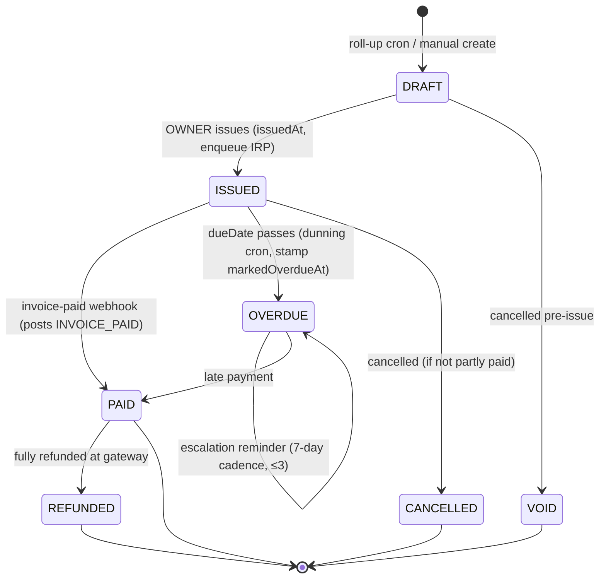
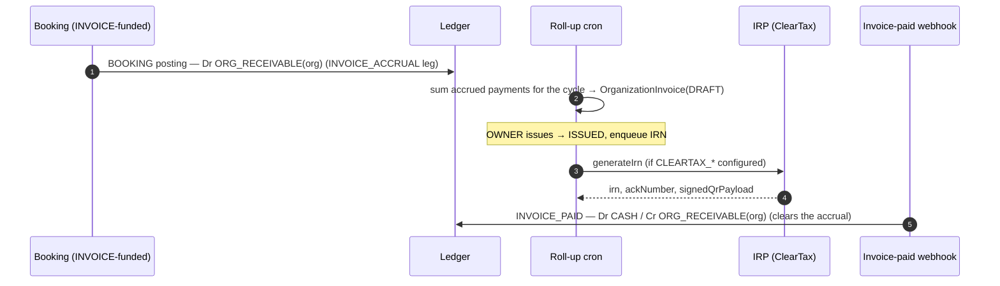

# Invoicing

**What this covers:** the India-compliant `OrganizationInvoice` — its lifecycle, GST breakdown, IRN/e-invoice fields, CGST Rule 46 numbering, the PO 3-way match, the **dunning** escalation, how a cycle's **overage** rolls into a line item, and how invoice payment clears the `ORG_RECEIVABLE` accrued at booking time — plus the **refund credit-note** machinery (CGST Sec 34 / Rule 53). Funding mechanics are in [payment legs](09-payment-legs.md); the postings are in [ledger & postings](03-ledger-and-postings.md).

> _Refreshed 2026-06-05 (#777/#778/#779 mega-audit): added the dunning lifecycle (§7), the overage→`InvoiceLineItem` rollup (§9), the IRP payload mapper (§4), and the refund credit-note unification (§8)._

> An INVOICE-funded org doesn't pay cash at booking — each booking debits `ORG_RECEIVABLE(org)` (the `INVOICE_ACCRUAL` leg). A monthly roll-up turns those accruals into an `OrganizationInvoice`; when the org pays, the `INVOICE_PAID` posting clears the receivable.

---

## 1. Lifecycle



`OrgInvoiceStatus` = `DRAFT | ISSUED | PAID | OVERDUE | VOID | CANCELLED | REFUNDED`. `REFUNDED` is distinct from `VOID`: `VOID` is pre-payment (cancelled before settlement), `REFUNDED` is post-payment. `PATCH …/invoices/[invoiceId]` (OWNER) gates transitions against an allow-list. The dunning escalation (§7) is **not** a new status — it loops within `OVERDUE`, bumping `dunningReminderCount` on each reminder.



On `ISSUED → PAID` the invoice-paid webhook (`app/api/webhooks/utils.ts`) posts `invoicepaid:<invoiceId>` (kind `INVOICE_PAID`): `Dr CASH / Cr ORG_RECEIVABLE(org)` for the invoice total, in the same transaction that flips the status. Note **issuance posts no money leg** — the receivable was accrued at booking; issuance just rolls accrued bookings into the invoice and records an audit row ([ledger & postings §3](03-ledger-and-postings.md)).

### 1.1 Worked walkthrough — Wipro's month-end invoice

**Wipro Limited** (seeded SPONSOR, `fundingSource = INVOICE`, GSTIN `29AABCW1234K1Z5`, `gstStateCode = KA`, NET-60) sponsors a leadership program. Through the cycle, every Wipro-sponsored booking past its LICENSED_SEAT coverage debits `ORG_RECEIVABLE(wipro)` via an `INVOICE_ACCRUAL` leg — **no cash moves at booking**. Say the cycle accrued **₹2,00,000** of billable bookings (`subtotalPaise = 20_000_000`).

At month-end the roll-up cron sums Wipro's unbilled `SUCCEEDED` accrual-funded payments into an `OrganizationInvoice(DRAFT)`, one `InvoiceLineItem` per booking. The platform's supplier GSTIN is also Karnataka-registered (state `29`) and Wipro's `placeOfSupply` is `KA` — **same state, so this is an intra-state supply**: GST splits CGST + SGST (9% + 9%), not IGST (`deriveGstBreakdown`, [§3](#3-gst-breakdown-cgst--sgst--igst)):

```
subtotalPaise =                                    20_000_000   (₹2,00,000)
taxPaise      = round(20_000_000 × 0.18)         =   3_600_000   (total GST @ 18%)
cgstPaise     = floor(taxPaise / 2)              =   1_800_000   (₹18,000)
sgstPaise     = taxPaise − cgstPaise             =   1_800_000   (₹18,000, absorbs the odd-paise remainder)
totalPaise    = 20_000_000 + 3_600_000           =  23_600_000   (₹2,36,000)
```

(The code rounds the *whole* 18% tax first, then floors half for CGST and lets SGST take the remainder, so `cgst + sgst == taxPaise` exactly — `gst.ts:16`. On a round subtotal like this there's no residual; on an odd subtotal SGST carries the extra paise.)

`invoiceNumber` is allocated gapless per `(orgId, FY)` — Wipro's first FY2026 invoice is `INV-WIP-2026-0001` (the seed's prefix). The OWNER issues it (`DRAFT → ISSUED`, `issuedAt` stamped, IRN enqueued), `dueDate = issuedAt + 60d` (NET-60). **Issuance posts no money leg** — the ₹2,36,000 receivable was already accrued booking-by-booking. Sixty days later Wipro pays; the invoice-paid webhook posts `Dr CASH 23_600_000 / Cr ORG_RECEIVABLE(wipro) 23_600_000` and flips `ISSUED → PAID` in one transaction. The `ORG_RECEIVABLE(wipro)` balance returns to zero for that invoice's bookings.

Were Wipro registered in a *different* state from the platform's supplier registration, the same ₹2,00,000 would carry `igstPaise = 36_00000` (₹36,000) and zero CGST/SGST — same total, different columns, because the place-of-supply crossed a state line.

---

## 2. Schema highlights

```prisma
model OrganizationInvoice {
  id               String @id @default(uuid())
  billingAccountId String
  organizationId   String
  purchaseOrderId  String?
  contractId       String?     // SetNull — invoice stays audit-readable if contract dies

  invoiceNumber String @unique          // <PREFIX>-<FY>-<SEQ>, CGST Rule 46
  status        OrgInvoiceStatus @default(DRAFT)

  // Money (integer paise)
  displayCurrency    Currency
  fxRateUsed         Decimal?
  inrEquivalentPaise Int            // always captured for GST filings
  subtotalPaise      Int
  igstPaise          Int @default(0)
  cgstPaise          Int @default(0)
  sgstPaise          Int @default(0)
  totalPaise         Int
  taxRate            Decimal?

  lineItems InvoiceLineItem[]       // typed rows (was Json `items`)

  // GST
  hsnCode       String  @default("999293")
  placeOfSupply String? @db.VarChar(2)
  reverseCharge Boolean @default(false)
  lutNumber     String?              // zero-rated exports
  gstin         String?  @db.VarChar(15)

  // E-invoice (IRN) — fields final; live IRP upload env-gated (§4)
  irn              String? @db.VarChar(64)
  ackNumber        String?
  ackDate          DateTime?
  signedQrPayload  String? @db.Text
  irpStatus        IrpStatus @default(PENDING)
  irpUploadedAt    DateTime?
  irpLastError     String?  @db.VarChar(500)   // provider failure reason
  irpLastAttemptAt DateTime?
  irpRetryCount    Int      @default(0)          // → FAILED at the cron's cap

  // Lifecycle
  billingCycleStart DateTime?
  billingCycleEnd   DateTime?
  autoGenerated     Boolean @default(false)
  issuedAt          DateTime?
  dueDate           DateTime
  paidAt            DateTime?
  pdfUrl            String?

  paymentId      String? @unique   // one-off invoices
  billedPayments Payment[]         // monthly roll-up: captured payments

  creditNotes CreditNote[]         // #778 §D — GST credit notes (§8)

  // #779 §A — dunning lifecycle (§7); each stamp is an idempotency gate
  markedOverdueAt       DateTime?
  dunningReminderCount  Int       @default(0)
  lastDunningReminderAt DateTime?
  dunningSuspendedAt    DateTime?  // set by dunning stage 3 when ENABLE_DUNNING_SUSPEND is on (#812)
}
```

> **Line items are typed now.** #772-era schema work replaced the old `items Json` blob with a relational `InvoiceLineItem[]` (one row per line: description, quantity, unit price paise, HSN, optional `paymentId`). Reads are still render/audit-time, but the typed table removes the JSON-shape drift risk and lets the PDF route + GST export query line-level data.

---

## 3. GST breakdown (CGST / SGST / IGST)

Which tax columns are populated depends entirely on the buyer's `placeOfSupply` relative to the seller's state; this table maps each supply scenario to the columns that `deriveGstBreakdown` writes on the invoice row.

| Condition | Tax columns |
|---|---|
| Intra-state (same state) | `cgstPaise` + `sgstPaise` (usually 9% + 9%) |
| Inter-state | `igstPaise` (usually 18%) |
| Export (zero-rated) | all tax = 0; `lutNumber` set |
| Reverse charge | `reverseCharge = true`; buyer self-accounts |

`placeOfSupply` is the buyer's 2-char GST state code (e.g. `"27"` Maharashtra). `deriveGstBreakdown` (`lib/compliance/gst.ts`) populates the columns. Authoritative rules: [`../compliance/02-gst-overview.md`](../../compliance/02-gst-overview.md). The booking's `GST_PAYABLE` credit ([ledger & postings §4.2](03-ledger-and-postings.md)) is the platform-side liability; the invoice records the customer-facing breakdown.

`hsnCode` default `999293` (commercial training & coaching); line items may override per-row.

---

## 4. IRN (e-invoice) — mapper + uploader

The model carries every field the IRP returns: `irn` (64-char), `ackNumber`, `ackDate`, `signedQrPayload`, `irpStatus` (`PENDING | GENERATED | CANCELLED | FAILED`), `irpUploadedAt`, plus retry telemetry (`irpRetryCount`, `irpLastError`, `irpLastAttemptAt`). The daily IRP uploader (`jobs/compliance/irp-uploader.ts`, `.github/workflows/irp-uploader.yml`) selects `irpStatus = PENDING` invoices `issuedAt` within **30 days** (the CBIC retroactive-IRN cut-off), batch size 50, and for each one:

1. **Map** the fetched row to the NIC e-invoice **schema v1.1** JSON via the pure mapper `buildIrpPayload` (`lib/compliance/irp-payload.ts`) — no DB access; the cron fetches, the mapper transforms. It splits each line's GST in the same intra/inter mode as the whole invoice (CGST+SGST vs IGST), rounds per line and pushes the paise residual onto the last line so `ItemList` sums reconcile to `ValDtls` exactly (the IRP rejects any per-line vs total mismatch), derives the 2-digit **numeric** GST state code from the GSTIN prefix, and tags `SupTyp` (`EXPWOP` for a zero-rated LUT export, else `B2B`). A mapping failure is **permanent** (missing buyer GSTIN, no line items, unresolved seller state): the row flips straight to `FAILED` with `irpLastError = "MAP: …"` — retrying can't fix structurally-unmappable data and the 30-day window shouldn't be burned looping on it.
2. **Submit** via `generateIrn` (`lib/compliance/irp.ts`). On `GENERATED` it persists `irn` / `ackNumber` / `ackDate` / `signedQrPayload` / `irpUploadedAt`. On `FAILED` it keeps the row `PENDING` and bumps `irpRetryCount` until the **cap (12 ≈ 12 daily retries)**, then flips to `FAILED` for manual review.

**Two independent gates** — don't conflate them:
- `ENABLE_IRP_UPLOADER` (a GitHub Actions repo `var`) gates whether the **scheduled workflow runs at all** — false ⇒ the cron is skipped so CI minutes aren't burned hitting a stub. It's one of the [five feature flags](../30-programs-and-lifecycle/06-feature-flags-and-rollout.md).
- `CLEARTAX_API_KEY` / `CLEARTAX_GSP_TOKEN` / `CLEARTAX_GSTIN` (env) gate whether `generateIrn` makes a **real ClearTax GSP call** vs returning the stub `{ status: "FAILED", reason: "STUB" }`. With the flag on but creds absent, the cron runs and records STUB as a normal retry — it never crashes on missing credentials.

> **Threshold context (web-validated 2026-06-05).** E-invoicing/IRN is mandatory at **₹5 cr AATO**; the **30-day** reporting deadline applies to **₹10 cr+** filers. IRN covers B2B invoices, exports, **and credit/debit notes** (§8); **B2C is not reported**. An IRN can be **cancelled on the IRP only within 24h** of generation and **never amended** there — post-window corrections go via GSTR-1 / a credit note. Sub-₹5cr orgs ride the stub and don't need an IRN to let the buyer claim ITC, so the gated-off default is correct for the platform's current size. Sources: [CBIC e-invoice rules](https://cleartax.in/s/cgst-rules-chapter-6-tax-invoice-credit-and-debit-notes), [e-invoice cancellation 24h rule](https://cleartax.in/s/gst-e-invoice-amend-cancellation).

---

## 5. Invoice numbering — CGST Rule 46

`invoiceNumber` = `<PREFIX>-<FY>-<SEQ>`, e.g. `ACME-2026-0042`. `PREFIX` = `Organization.invoiceNumberPrefix` or the uppercased slug; `FY` = Indian fiscal year (Apr–Mar); `SEQ` = 4-digit monotonic per `(organizationId, fiscalYear)`, allocated atomically from `OrgInvoiceCounter` via `INSERT … ON CONFLICT … RETURNING`. `@@unique([organizationId, invoiceNumber])` is the backstop; the counter is the primary mechanism. Helper: `lib/payments/billing/invoice-numbering.ts`.

---

## 6. Purchase orders + 3-way match

`PurchaseOrder` (created via `POST …/purchase-orders`, OWNER) declares a budget; `requiresPO = true` on the org warns when an OWNER creates a contract without one. The classic AP control:

1. **PO** declares the commit (`totalAmountPaise`).
2. **Contract** ties the cycle + terms to the PO (`Contract.purchaseOrderId`).
3. **Invoice** points at the same PO and decrements `remainingAmountPaise`.

**Atomic compare-and-swap** guards the balance (`…/invoices/route.ts`):

```ts
const claim = await tx.purchaseOrder.updateMany({
  where: { id, organizationId: orgId, status: "ACTIVE",
           remainingAmountPaise: { gte: gst.totalPaise } },
  data:  { remainingAmountPaise: { decrement: gst.totalPaise } },
});
if (claim.count !== 1) throw { httpStatus: 409, code: "PO_BALANCE_EXCEEDED" };
```

The predicate is the lock: two POSTs racing for the last ₹1 can't both win (`claim.count = 1` for exactly one). When `remainingAmountPaise` hits zero the PO goes `CLOSED`. **Restoration:** the PATCH route runs the inverse increment when an invoice goes `VOID`/`CANCELLED` with a PO attached (only restores what was decremented, gated by the transition allow-list). UI copy for `PO_BALANCE_EXCEEDED` lives in `lib/labels/org-errors.ts`. Regression coverage: `__tests__/enterprise/po-balance-enforcement.test.ts`.

---

## 7. Dunning — chasing an overdue invoice (#779 §A)

When an `ISSUED` invoice's `dueDate` passes, the **dunning cron** (`jobs/billing/dunning.ts`, daily ~05:00 IST, `.github/workflows/dunning.yml`) escalates in three stages. No new status value is introduced — it rides the existing `OVERDUE` and three idempotency-gate stamps on the invoice:

| Stage | Selects | Claims (idempotency gate) | Side-effect |
| --- | --- | --- | --- |
| **1 — first notice** | `ISSUED`, `dueDate < now`, `markedOverdueAt = null` | `updateMany … status ISSUED → OVERDUE, markedOverdueAt = now` | `notifyOrgInvoiceOverdue` (stage 0) + an `INVOICE_OVERDUE` `OrgAuditLog` row |
| **2 — escalation** | `OVERDUE`, `dunningReminderCount < 3`, last touch (`lastDunningReminderAt ?? markedOverdueAt`) older than **7 days** | `updateMany … lastDunningReminderAt = priorValue` → `now`, `dunningReminderCount += 1` | `notifyOrgInvoiceOverdue` at the next reminder stage |
| **3 — suspend (#812, `ENABLE_DUNNING_SUSPEND`-gated)** | `OVERDUE`, `dunningReminderCount >= 3`, `dunningSuspendedAt = null`, `lastDunningReminderAt` older than **7 days** (the last reminder, not the overdue stamp) | inside a Serializable transaction: `updateMany … dunningSuspendedAt = now` (claim) plus the audit write | an `INVOICE_DUNNING_SUSPENDED` `OrgAuditLog` row; `checkout.ts` then blocks the org's new sponsored bookings |

So the reminder cadence is **7-day intervals, capped at 3 reminders**, after which (when `ENABLE_DUNNING_SUSPEND` is set) a final suspend stage stamps `dunningSuspendedAt` 7 days past the last reminder. Each claim is a conditional `updateMany` on the prior stamp value, so two cron replicas / a same-day re-run can't double-notify or double-suspend (the loser sees `count === 0` and skips); stage 3 wraps its claim and audit write in one Serializable transaction so the two replicas can't both stamp + log. Only **dunnable** orgs are chased (`ACTIVE` / `PENDING_VERIFICATION` / `SUSPENDED`); a `DEACTIVATED` org is being torn down, so its invoices aren't pursued.

> **Walkthrough — Meridian Consulting (fictional) goes overdue.** Meridian's ₹4,00,000 NET-30 invoice issues 1-Apr, `dueDate` 1-May. It isn't paid. **Day 1 of overdue (≈2-May):** the dunning cron's stage-1 query finds it (`ISSUED`, `dueDate < now`, `markedOverdueAt = null`), claims `ISSUED → OVERDUE` stamping `markedOverdueAt`, fires `notifyOrgInvoiceOverdue` (reminder 0), and writes an `INVOICE_OVERDUE` audit row. **+7d (≈9-May):** stage 2 sees `OVERDUE`, `dunningReminderCount (0) < 3`, last touch (`markedOverdueAt`) >7d old → bumps the count to 1, stamps `lastDunningReminderAt`, sends reminder 1. **+14d, +21d:** reminders 2 and 3. **+28d:** `dunningReminderCount` is now 3, the `< 3` predicate fails, so **the reminder cadence stops** — Meridian gets no fourth reminder. From here behaviour depends on `ENABLE_DUNNING_SUSPEND`: with the flag **off** the invoice simply sits in `OVERDUE` and a human picks up collections; with the flag **on**, 7 days after the last reminder (≈28-May, measured from `lastDunningReminderAt`, not the overdue stamp) stage 3 stamps `dunningSuspendedAt` inside a Serializable transaction, writes an `INVOICE_DUNNING_SUSPENDED` audit row, and `checkout.ts` blocks Meridian's new sponsored bookings until the invoice is paid. Meridian is fictional precisely because this is a failure path — a real seeded org (Wipro, IIT Madras) is never shown defaulting.

> **Suspension cascade now ships behind a flag (#812).** Stage 3 writes `dunningSuspendedAt` when `ENABLE_DUNNING_SUSPEND` is set, suspending new sponsored bookings 7 days past the last reminder. With the flag unset, dunning stays **notify-only** — it marks overdue and sends reminders but never suspends — so don't assume booking-suspend-on-overdue is on by default; it follows the flag.

---

## 8. Refund credit notes (CGST Sec 34 / Rule 53)

A refund without a GST credit note is a filing mismatch, so a refund against an **invoiced** booking mints a `CreditNote` — the legal artifact that reverses output-tax liability. The minting is **unified**: one idempotent helper, `mintRefundCreditNote` (`lib/payments/operations/refund.ts`), is called from both the canonical refund cascade (`applyRefundCascade`) **and** the gateway-refund webhook (which bypasses the cascade), so exactly one CN is issued per refund regardless of redelivery or cron retry.

**What it does** (must run inside the refund tx):
- No-ops (returns `null`) for non-invoiced payments — a CN only makes sense against an issued `OrganizationInvoice`. It also refuses a **DRAFT/un-issued** invoice (minting a Sec 34 note against an undelivered document is a defect; DRAFT accruals are netted down on the leg instead — see [payment legs §5](09-payment-legs.md)).
- Reverses the invoice-accrual legs (`INVOICE_ACCRUAL` + `OVERAGE_INVOICE_ACCRUAL`) **proportionally** to the refund (strict proportion, no remainder-absorb — a CN is a tax document).
- Splits the proportional tax the same way the invoice did: **IGST** (inter-state) or **CGST+SGST** (intra-state, CGST takes the odd-paise remainder), mirroring `OrganizationInvoice`'s breakout so the CN nets cleanly.
- Allocates a **gapless per-org credit-note number** `<PREFIX>-CN-<FY>-<SEQ>` from `OrgCreditNoteCounter` (`lib/payments/billing/credit-note-numbering.ts`), atomic `UPSERT…RETURNING` — a **separate series from the invoice counter**, as Rule 53 requires.
- Idempotency is `CreditNote.refundId @unique`: it probes first and returns the existing CN on replay, so a webhook redelivery / cron retry never mints a duplicate or burns a sequence number.

A sibling, `mintInvoiceRefundCreditNote`, covers the other path — the org paid an `OrganizationInvoice` directly (via the gateway) and that payment was refunded — keyed off the invoice rather than a booking's accrual legs. Same proportional-tax shape, same `refundId @unique` idempotency.

```prisma
model CreditNote {
  id               String @id @default(cuid())
  creditNoteNumber String                 // <PREFIX>-CN-<FY>-<SEQ>, per-org (Rule 53)
  fiscalYear       Int    @default(0)
  organizationId   String
  invoiceId        String?                // original invoice (Sec 34 linkage); null for B2C/unregistered
  refundId         String? @unique        // idempotent refund-driven minting
  reason           String?
  subtotalPaise    Int
  igstPaise        Int @default(0)
  cgstPaise        Int @default(0)
  sgstPaise        Int @default(0)
  totalPaise       Int
  status           CreditNoteStatus @default(DRAFT)   // DRAFT | ISSUED | CANCELLED
  issuedAt         DateTime?
  @@unique([organizationId, creditNoteNumber])
}
```

The status-level invoice transition is the coarse view (`PAID → REFUNDED` for a fully-refunded paid invoice); the booking-level refund itself posts a `REFUND` ledger transaction reversing the original legs proportionally — including the prorated `GST_PAYABLE` reversal — gated by `Refund.cascadedAt` so the app / webhook / backstop-cron each apply it exactly once. See [ledger & postings §4.7](03-ledger-and-postings.md) and [booking → earnings §6.5](05-booking-to-earnings.md).

> **Refund-driven TDS reversal is now live via `TDSRecord` reversals (#813).** When a refund claws back a consultant payout, the cascade calls the shared `recordTdsReversal` helper (`lib/payments/tax/tds-service.ts`), which writes a negative `isReversal = true` `TDSRecord` so the quarterly 26Q nets the withholding back out. The reversal is an integer-paise proportion of the original withholding and is capped so cumulative reversals can never exceed it (a refund-then-chargeback can no longer double-reverse). It is filed-aware: if the original `TDSRecord` is not yet reported in Form 26Q the reversal copies the original's FY and quarter, but if the quarter is already filed it stamps the current IST-reckoned FY and quarter (the adjust-against-future-liability convention) — correction statements for filed quarters remain a manual CA action, and the policy is provisional pending CA sign-off. The richer `TdsAdjustment` model is still **schema-only** — it's the documented consolidation target in `tds.ts` (#778 §D), not yet wired. Web-validated GST rules for credit notes: serial number ≤16 chars unique per FY, must reference the original invoice, declared no later than **30 Nov following FY-end**. Source: [CGST Sec 34 / Rule 53](https://cleartax.in/s/cgst-rules-chapter-6-tax-invoice-credit-and-debit-notes).

---

## 8b. Consumer invoices (B2C) — #1365

Everything above concerns `OrganizationInvoice`, which is the document a sponsoring organization receives. A personal buyer paying by card receives a different document on a different series, and that path is documented separately in [B2C tax invoices and credit notes](../../payments/07-b2c-tax-invoice.md).

The two families are deliberately separate models rather than one model with nullable columns. `OrganizationInvoice` requires an organization, a billing account and a due date, and those columns are load-bearing for dunning and for the IRP e-invoice payload; a consumer invoice has none of them, is paid before it is issued, and runs on one platform-wide gapless series instead of one series per organization. Collapsing them would make every one of those columns optional and would quietly weaken the B2B guarantees this page describes.

What the two families share is the register. `jobs/compliance/gst-outward-register-export.ts` reads both invoice models and both credit-note models for a period and emits a single outward-supplies CSV for GSTR-1, stamping `gstr1ExportedAt` on the rows it reported so a re-run never re-stamps them.

---

## 9. Overage roll-up into a line item (#715 / #775)

A `CHARGE_ORG` program overage isn't billed instantly — its marginal accrues as an `OVERAGE_INVOICE_ACCRUAL` `PaymentLeg` at checkout ([booking → earnings §6.3](05-booking-to-earnings.md)) and is **rolled into the cycle's invoice** alongside the base bookings. `rollupOrgInvoiceAccruals` (`lib/payments/billing/invoice-rollup.ts`, driven by `jobs/billing/settle-invoice-accruals.ts`) gathers each org's unbilled `SUCCEEDED` payments carrying **either** accrual source, sums **both** leg sources into the line `unitPricePaise` (the base + the overage), and emits one `InvoiceLineItem` per booking. The accrual read, invoice create, and stamp all run inside a single **Serializable** transaction (#813), so two overlapping rollup runs can no longer both issue an invoice for the same accrual set — the loser aborts with a P2034 serialization error, which the job treats as a benign skip. The monthly cadence and the workflow's `concurrency` group are the outer belt; the in-transaction read is the suspenders.

For each rolled `CHARGE_ORG` `OverageEvent` it then walks the state machine `PENDING → ACCRUED` (via `transitionOverage`), stamping `settledAt` and the exact `invoiceLineItemId` the event landed on (auditability + reversal). The event reaches its terminal `CHARGED` only when the invoice is **paid** — the `INVOICE_PAID` ledger handler flips `ACCRUED → CHARGED`. This is why `settle-invoice-accruals` deliberately includes `OVERAGE_INVOICE_ACCRUAL` in its "orgs to bill" scan: an org whose base bookings are all LICENSE-covered (₹0 legs) but which has `CHARGE_ORG` overage would otherwise be skipped and never billed for the overage.

The `base` vs `surcharge` split is itemized on the `OverageEvent` (`basePaise` / `surchargePaise` / `marginalPaise`), so the charge stays GST-auditable even though the current rollup writes one combined line per booking; per-line surcharge itemization on the invoice is a future refinement.

---

## 10. Auto-generated vs hand-rolled

- `autoGenerated = true` — monthly roll-up cron; `billedPayments[]` lists captured payments.
- `autoGenerated = false` — OWNER-created via `POST …/invoices` for ad-hoc charges (setup fees, overage bundles).

---

## 11. Design decisions & trade-offs

- **Invoice-level GST split, not per-line (today).** The GST columns (`cgstPaise`/`sgstPaise`/`igstPaise`) live on `OrganizationInvoice`, computed once for the whole invoice, even though `InvoiceLineItem[]` is a typed child table (#772-era, `51e64547`). A per-line tax split would be more granular (and the IRP payload *does* split per line at upload time, §4), but the invoice's single intra/inter mode (driven by one place-of-supply) makes per-line tax redundant for a domestic services invoice — every line on a Wipro invoice is the same HSN, same place-of-supply, same rate. The cost is that a future mixed-rate invoice (different HSN per line) would need the split pushed down to the line; the benefit today is one GST computation and one `INVOICE_TOTAL_MISMATCH` check ([ledger integrity](13-ledger-integrity.md)) instead of N. The base/surcharge overage itemization (§9) is the first place this pressure shows up — it's itemized on the `OverageEvent` but still written as one combined line.
- **Dunning rides `OVERDUE` + idempotency-gate stamps, not a new status per reminder.** A `REMINDER_1`/`REMINDER_2`/`REMINDER_3` status ladder would encode the cadence in the type, but it also fragments the lifecycle and makes "is this invoice overdue?" a multi-value check. Instead one `OVERDUE` status loops, and three nullable stamps (`markedOverdueAt`, `dunningReminderCount`, `lastDunningReminderAt`) carry the escalation + double-send guard (§7). The cost is the cadence lives in cron logic, not the schema; the benefit is the status enum stays small and every reminder claim is a conditional `updateMany` that can't double-fire.
- **IRP upload is two independent gates, fail-soft on missing creds.** `ENABLE_IRP_UPLOADER` (does the cron run at all) and `CLEARTAX_*` (real GSP call vs stub) are deliberately separate (§4): the flag-on/creds-absent combination runs the cron and records `STUB` as a normal retry rather than crashing. This lets the pipeline be exercised before a ClearTax contract exists, and matches the platform's sub-₹5cr size where IRN isn't yet mandatory. The cost is a STUB result that looks like a retry in telemetry; the benefit is the uploader never hard-fails on configuration.

## 12. What this design survived

- **Gapless per-org invoice + credit-note counters under CGST Rule 46/53 (`37e3c71a`/`eae45f38`, #776).** A GST invoice series must be **gapless and monotonic per issuer per FY** — a missing or duplicated number is a filing defect. A naive `MAX(seq)+1` read-then-write races: two concurrent month-end roll-ups for the same org both read the same max and mint the same number, violating `@@unique([organizationId, invoiceNumber])` (one aborts, losing its invoice) or — worse — skipping a number. The design allocates from a dedicated `OrgInvoiceCounter` via an atomic upsert whose UPDATE path `increment`s `nextSeq` and returns the pre-increment value (`invoice-numbering.ts:46`) — equivalent to `INSERT … ON CONFLICT … RETURNING`, a single DB-level op the compound `@@id` serialises. Credit notes get their **own** counter (`OrgCreditNoteCounter`, `<PREFIX>-CN-<FY>-<SEQ>`) because Rule 53 requires a separate series (§8). The fiscal-year reckoning was also moved to **IST** (not UTC) so an invoice issued just before midnight IST on 31-Mar doesn't slip into the wrong FY's sequence (`37e3c71a` F3).
- **IRP mapping failures are permanent; submission failures retry to a cap (`53ee63de`, #777 §C).** The daily uploader (`jobs/compliance/irp-uploader.ts`) distinguishes two failure classes. A **mapping** failure — missing buyer GSTIN, no line items, unresolved seller state — is structural: retrying can't fix unmappable data, so `buildIrpPayload` returns `{ ok: false }` and the row flips **straight to `FAILED`** with `irpLastError = "MAP: …"` rather than burning the 30-day reporting window looping (`irp-uploader.ts:143`). A **submission** failure (GSP transient, network) keeps the row `PENDING` and bumps `irpRetryCount` until the cap (**`MAX_RETRIES = 12`** ≈ 12 daily attempts, `irp-uploader.ts:183`), then flips to `FAILED` for manual review. The per-line GST split rounds per line and pushes the paise residual onto the last line so `ItemList` sums reconcile to `ValDtls` exactly — the IRP rejects any per-line-vs-total mismatch. Without the permanent/transient split, one structurally-broken invoice would retry 12× a day forever and could starve the batch.

---

### Related docs
- [Funding & programs](../00-foundations/03-funding-and-programs.md) — the INVOICE funding source.
- [Payment legs](09-payment-legs.md) — how `INVOICE_ACCRUAL` / `OVERAGE_INVOICE_ACCRUAL` legs roll up.
- [Booking → earnings §6](05-booking-to-earnings.md) — the overage flow that feeds §9, and the refund-failed notify (§6.5).
- [Ledger & postings](03-ledger-and-postings.md) — the `INVOICE_PAID` / `REFUND` transactions.
- [Ledger integrity](13-ledger-integrity.md) — `INVOICE_TOTAL_MISMATCH`, `OVERAGE_CHARGESTATUS_INTEGRITY`.
- [Compliance map](../40-compliance-and-data/01-compliance-dpdp-gst-tds-msme.md) → [`../compliance/02-gst-overview.md`](../../compliance/02-gst-overview.md) (GST/IRN) · [`../compliance/05-refund-and-chargeback-tax-adjustments.md`](../../compliance/05-refund-and-chargeback-tax-adjustments.md) (credit notes / TDS adjustments) — authoritative.
- Ground truth: `lib/payments/billing/{invoice-rollup,invoice-numbering,credit-note-numbering}.ts`, `lib/payments/operations/refund.ts`, `lib/compliance/{irp,irp-payload}.ts`, `jobs/billing/{dunning,settle-invoice-accruals}.ts`, `jobs/compliance/irp-uploader.ts`.
