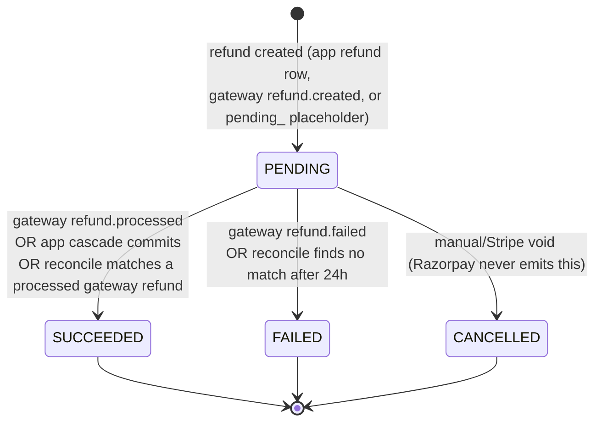
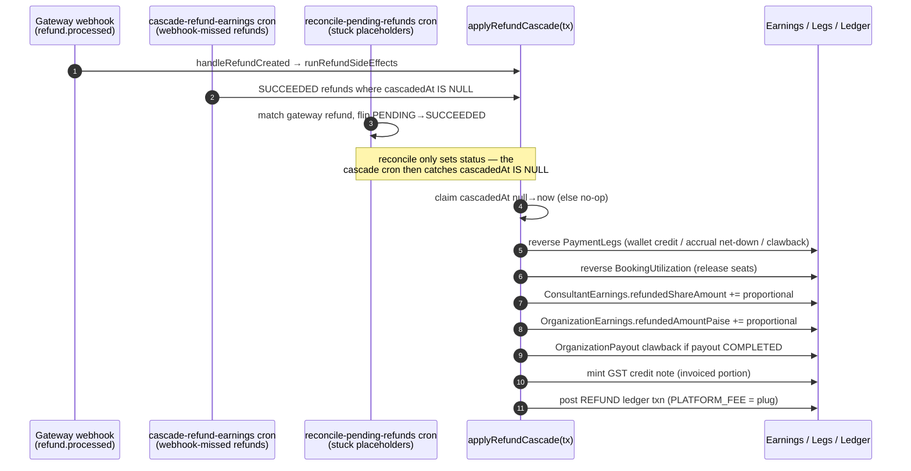

# Refunds

**What this covers:** the organization/B2B side of refunds — how a refund reverses org-funded earnings, wallet legs, invoice accruals, and the GST tax position. The consumer-marketplace (B2C) refund flow, the admin refund UI, and the two-phase gateway pattern stay documented in [`docs/payments/refunds-disputes/`](../../payments/refunds-disputes/README.md); this doc is the enterprise lens on the same engine.

A refund is money returned to the **buyer** (the consultee), as distinguished from a reimbursement (org → its own member) or a payout (platform → seller); the [money model overview §6](01-money-model-overview.md) draws that vocabulary boundary. Every refund — whoever starts it — flows through one engine, `applyRefundCascade` in `lib/payments/operations/refund.ts`, so the org-side side effects are identical regardless of trigger.

---

## 1. The refund object lifecycle

A `Refund` row (`prisma/schema.prisma`, `model Refund`) carries a `RefundStatus` of `PENDING`, `SUCCEEDED`, `FAILED`, or `CANCELLED`. There is deliberately **no `PROCESSING` value** — the row sits in `PENDING` from creation until the gateway confirms terminal success or failure. The status transitions are driven by three distinct triggers, and the diagram below names each one.

The **PENDING → SUCCEEDED** edge fires from any of three code paths. The app-initiated path (`refundPayment` in `refund.ts`) creates the row in `PENDING`, runs the cascade, and flips it to `SUCCEEDED` inside one Serializable transaction, so for app refunds the `PENDING` window is effectively instantaneous. The gateway path arrives as a `refund.processed` webhook routed through `handleRefundCreated` (`app/api/webhooks/utils.ts`), whose `mapRefundStatus` maps `processed`/`succeeded` to `SUCCEEDED`. The reconcile path (`scripts/refunds/reconcile-pending-refunds.ts`) picks up `PENDING` rows whose `refundId` still starts with `pending_` and, after at least an hour, queries the gateway for a matching refund and adopts its status.

The **PENDING → FAILED** edge fires either from a `refund.failed` webhook (the dispatcher forces the status string to `"failed"`, mapping to `FAILED`) or from the reconcile cron marking a stale placeholder `FAILED` when no matching gateway refund is found after 24 hours. A `FAILED` refund did not move money, so it does **not** reduce the payment's refundable balance — `refundPayment` only counts `SUCCEEDED` and `PENDING` refunds when computing how much is still refundable.

The **PENDING → CANCELLED** edge is reserved for manual voids and the Stripe path; the Razorpay adapter never produces `CANCELLED`, because a created Razorpay refund resolves to `processed` or `failed`, never a cancellation.

---

## 2. `applyRefundCascade` — the heart of the engine

`applyRefundCascade(tx, input)` is the single function that fans a refund out to every downstream money record. It is called from three trigger paths, all of which converge on the same atomic body, and its first act is an idempotency claim: it flips `Refund.cascadedAt` from `null` to `now()` with a conditional `updateMany`, and if the claim count is zero it returns immediately as a no-op. That stamp is what lets the webhook, the cron, and the app path race each other safely — exactly one wins the claim and the rest short-circuit.

The three triggers are: the **gateway webhook**, where `handleRefundCreated`'s inner `runRefundSideEffects` calls the cascade when a refund transitions to `SUCCEEDED`; the **cascade-refund-earnings cron** (`jobs/refunds/cascade-refund-earnings.ts` → `scripts/refunds/cascade-refund-earnings.ts`, every 15 minutes), which selects `SUCCEEDED` refunds where `cascadedAt IS NULL` and is the backstop for refunds whose webhook never landed; and the **reconcile-pending-refunds cron** (every 15 minutes), which does not call the cascade itself but flips stuck `pending_` placeholders to `SUCCEEDED`, leaving the cascade cron to pick them up on its next pass.

Inside the claimed transaction the cascade performs, in order: a **proportional PaymentLeg reversal** with the last leg absorbing the floor remainder, where a `WALLET` leg credits the org wallet back via `walletCredit`, an unbilled `INVOICE_ACCRUAL`/`OVERAGE_INVOICE_ACCRUAL` leg is netted through a negative `*_REVERSAL` sibling leg — the original leg is never mutated and the monthly rollup bills the net of the pair (#786; a PAID invoice instead defers to clawback), and `CARD`/`REFERRAL_CREDIT`/`LICENSE` legs are handled elsewhere; a **BookingUtilization reversal** that releases engagements proportionally; a **ConsultantEarnings** increment of `refundedShareAmount` capped at the consultant share; an **OrganizationEarnings** increment of `refundedAmountPaise` (org share only, never the consultant slice); an **OrganizationPayout clawback** that increments `clawbackAmountPaise` and stamps `clawbackInitiatedAt` when the earnings already rolled into a `COMPLETED` payout (manual recovery only in v1); the **credit-note mint** (§5); and finally a balanced **`REFUND` ledger transaction** (`idempotencyKey = refund:<refundId>`) where `PLATFORM_FEE` is the residual plug that absorbs the ≤3-paise floor remainder so the posting always balances. The ledger post no longer silently swallows a failure: because the cascade runs inside the caller's transaction, a posting failure records a durable `SystemEvent` on its own connection (so the row survives the rollback) and fires a P0 Sentry alert, then **re-throws** to roll the whole cascade back rather than half-applying the earnings/leg reversals with no balanced journal (#812). The caller — the refund cron or the gateway webhook — re-drives the refund, so the customer refund is not lost; it is re-applied atomically. The nightly reconciler's `EARNINGS_LEDGER_DRIFT`/`LEDGER_TXN_IMBALANCE` invariants remain the backstop that catches any residual divergence (see [ledger integrity](13-ledger-integrity.md)).

---

## 3. Gateway mechanics (Razorpay)

Razorpay's own refund object has its own lifecycle that sits *underneath* our `Refund` row, and understanding it explains why our authoritative state always arrives by webhook rather than from the synchronous API response. A Razorpay refund progresses through `created` (the refund has been initiated), `pending` (Razorpay is attempting the transfer), `processed` (money returned to the customer — terminal success), and `failed` (terminal failure); see https://razorpay.com/docs/api/refunds/ and https://razorpay.com/docs/payments/refunds/faqs/. Our adapter maps `created`/`pending` to `PENDING`, `processed` to `SUCCEEDED`, and `failed` to `FAILED`.

A refund **can still fail after it was created** — for example when the payment is older than the refund window, or the customer's instrument or bank rejects the transfer — so a `created` refund is never proof the money came back; only `refund.processed` is.

Razorpay offers three refund speeds, summarized below with their cost and timing implications for our finance reconciliation.

| Speed | Timing | Fee | Notes |
| --- | --- | --- | --- |
| `normal` | 5–7 working days | Free | Original payment's fees/taxes are not reversed to the merchant. |
| `instant` | Near-immediate via fund transfer | Small per-transaction fee, debited from the Razorpay balance | Itemized under Dashboard → Refunds and in the month-end invoice. |
| `optimum` | Instant when the instrument allows, else falls back to normal | Fee only when it actually goes instant | Razorpay chooses per its fund-transfer logic. |

When a fast refund is downgraded to normal speed, Razorpay fires `refund.speed_changed` (with `speed_requested` ≠ `speed_processed`) and **credits the instant-refund fee back** to the merchant balance (https://razorpay.com/docs/payments/refunds/refund-speed/, https://razorpay.com/docs/payments/refunds/instant/). Our dispatcher consumes `refund.speed_changed` as a **log-only** event — we record neither the processed speed nor the fee credit-back.

> 🟡 **Gap (no issue filed yet):** `refund.speed_changed` is logged and discarded (`app/api/webhooks/razorpay-dispatch.ts`). We keep no record of `speed_requested`/`speed_processed`, so support cannot answer "why did my instant refund take six days," and finance cannot reconcile the fee credit-back against the original instant-refund fee.

Two further gateway rules constrain refunds. A refund is **not possible for a payment older than roughly six months** (≈180 days) from capture; such an attempt resolves to `failed` (https://razorpay.com/docs/payments/refunds/faqs/). And **partial refunds are supported**, by specifying an `amount` in paise; repeated partial refunds are allowed up to the originally captured amount, never beyond it — which our `refundPayment` enforces by rejecting any request that exceeds the remaining refundable balance.

---

## 4. Consumer-protection context (refund SLA)

The org/B2B side of a refund still owes the same consumer-protection duty as the B2C side, because the person made whole is a real consumer. Rule 4(11) of the Consumer Protection (E-Commerce) Rules 2020 requires refunds within a "reasonable period," and the operative numeric benchmark is RBI's *Harmonisation of Turn Around Time (TAT) and Customer Compensation for Failed Transactions* (September 2019), which sets card and merchant auto-reversal at **T+5 working days** and prescribes **₹100 per day of compensation** for delay beyond that window (https://www.rbi.org.in/commonman/English/scripts/Notification.aspx?Id=3074). The practical SLA is therefore five to seven days, which aligns with Razorpay's normal refund speed. Note that our `Refund` schema carries **no `targetCompletionDate` field**, so the platform does not currently surface an expected-refund-by date or alert when a `PENDING` refund crosses its TAT — the time-bound SLA layer the Rules contemplate is unbuilt.

Authoritative: `docs/compliance/09`.

---

## 5. Credit notes on refunded invoiced payments

When a refund lands on a payment that was funded by an **issued** organization invoice, the cascade mints a GST credit note for the invoiced portion. Two functions do this: `mintRefundCreditNote` (the booking-centric path inside the cascade, keyed off the payment's `INVOICE_ACCRUAL` legs) and `mintInvoiceRefundCreditNote` (the gateway path when an org paid an `OrganizationInvoice` directly and that payment was refunded). Both are **idempotent on `refundId`** (`CreditNote.refundId @unique`), so a webhook redelivery or cron retry never mints a duplicate or burns a gapless sequence number, and both refuse to mint against a `DRAFT` or un-issued invoice — minting a Section 34 credit note against an unissued document would be a filing defect.

The number is allocated by `generateOrgCreditNoteNumber` (`lib/payments/billing/credit-note-numbering.ts`) from a per-`(org, fiscalYear)` counter that is **separate from the invoice series**, satisfying CGST Rule 53's separate-series requirement, and each note links back to its originating `OrganizationInvoice` via `invoiceId`, satisfying Rule 53(f)'s original-invoice-reference requirement. Rule 53 imposes the same numbering discipline as Rule 46(b): a consecutive serial of at most **sixteen characters**, drawn only from letters, numerals, and the separators `-` and `/`, unique within the Indian financial year (https://taxinformation.cbic.gov.in/content/html/tax_repository/gst/rules/cgst_rules/active/chapter6/).

The output-tax reduction a credit note enables is conditional, not automatic. Under CGST Section 34(2) the supplier may reduce its output-tax liability only if the note is declared in a return no later than the **thirtieth day of November following the end of the financial year** in which the supply was made (or the annual-return date, whichever is earlier), and only if **the incidence of tax has not already been passed on** to another person (https://taxinformation.cbic.gov.in/content/html/tax_repository/gst/acts/2017_CGST_act/active/chapter7/section34_v1.00.html). Neither the schema nor the cascade records the November deadline or the incidence condition, so any future credit-note-to-GSTR-1 export must gate the GST adjustment on both, not merely mint the note.

> 🟡 **Gap (no issue filed yet):** the credit-note number format overflows the 16-character cap for org prefixes longer than three characters. `generateOrgCreditNoteNumber` emits `<PREFIX>-CN-<FY>-<SEQ>` where `FY` is a four-digit year (`indianFiscalYear` returns e.g. `2026`) and `SEQ` is a four-digit zero-padded sequence. The length is therefore `len(PREFIX) + 13` (`-CN` = 3, `-2026` = 5, `-0001` = 5). A realistic prefix already breaks it: `WIPRO-CN-2026-0001` is **18 characters**, exceeding the Rule 53(c) sixteen-character limit. The budget is **prefix ≤ 3 characters** at a four-digit FY plus four-digit sequence; the invoice series (`<PREFIX>-<FY>-<SEQ>`, `len(PREFIX) + 10`) tolerates a prefix up to six. Neither path validates or truncates the prefix.

Authoritative: `docs/compliance` (CGST Rule 46/53, Section 34); see also the credit-note section of [invoicing](08-invoicing.md).

---

## 6. TDS on refunds

When a consultant's earnings are reversed by a refund, any TDS that was withheld on the original payout must be reversed too, as a negative line in the revised quarterly TDS return (26Q/27Q). This is now wired (#813): the refund cascade calls the shared `recordTdsReversal` (`lib/payments/tax/tds-service.ts`), which writes a negative `isReversal` **`TDSRecord`** sized as an integer-paise proportion of the original withholding and capped so cumulative reversals can never exceed it — so a refund-then-chargeback on the same payment cannot double-reverse. The reversal is filed-aware: an unfiled original is corrected in place (its FY and quarter are copied), while a filed original is stamped into the current IST-reckoned FY and quarter (the adjust-against-future-liability convention), with correction statements for filed quarters left to a manual CA action. This policy is provisional pending CA sign-off.

> 🟡 **Remaining gap (#778):** the richer `TdsAdjustment` model (signed `amountPaise`, `financialYear`/`quarter`, triggering `refundId`) is still **schema-only** — it is referenced only in a comment in `lib/compliance/tds.ts` and is the future consolidation target for FVU export. The same is true of the parallel `GstTcsAdjustment` model for refund reversal of collected GST TCS, which remains entirely manual.

---

### Related docs
- [Money model overview](01-money-model-overview.md) — the refund-vs-reimbursement-vs-payout vocabulary and the `REFUND` journal `kind`.
- [Ledger & postings](03-ledger-and-postings.md) — the `refund:<refundId>` and `topup-refund:<paymentId>` postings in detail.
- [Wallet & top-ups](04-wallet-and-topups.md) — how a `WALLET`-leg refund credits the org balance back.
- [Earnings lifecycle](06-earnings-lifecycle.md) — the `HELD`/`REFUNDED` earning states a refund drives.
- [Invoicing](08-invoicing.md) — the credit-note section and the invoice the refund adjusts.
- [Disputes](11-disputes.md) — chargebacks, the other way money leaves via the buyer's bank.
- [Payment webhooks](12-payment-webhooks.md) — the inbound `refund.*` events that drive this lifecycle.
- B2C / gateway-generic details: [`docs/payments/refunds-disputes/`](../../payments/refunds-disputes/README.md).
- Ground truth: `lib/payments/operations/refund.ts`, `lib/payments/billing/credit-note-numbering.ts`, `app/api/webhooks/utils.ts`, `scripts/refunds/*.ts`.
