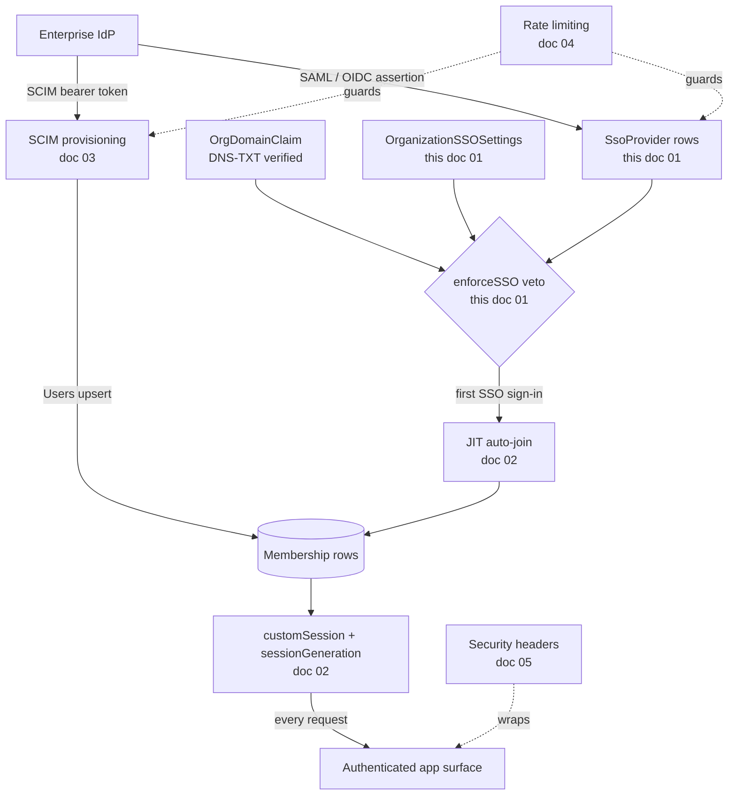
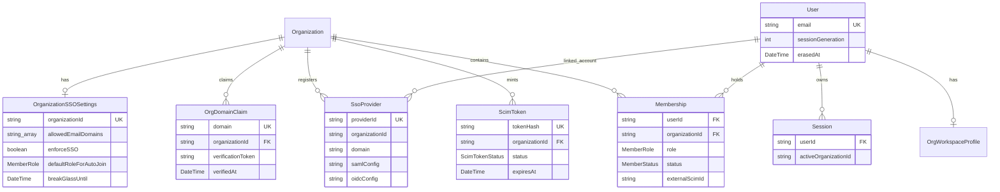
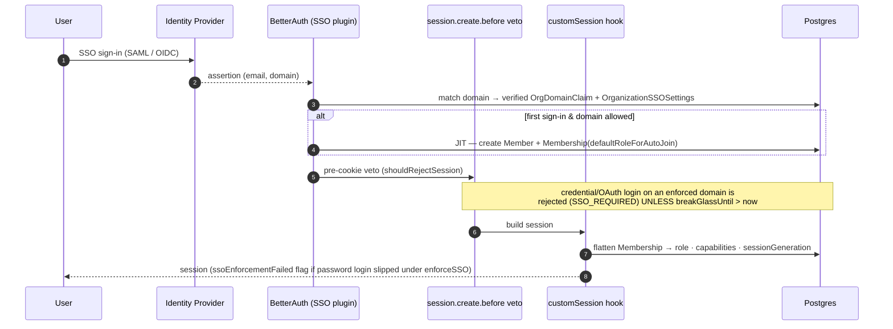
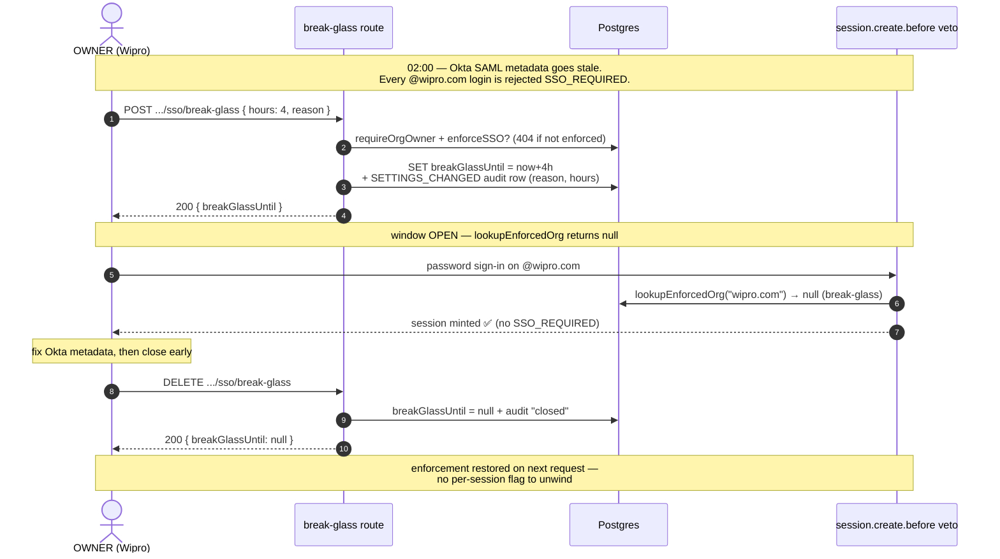

# SSO and authentication

SSO for the enterprise layer is a two-table split. The
`OrganizationSSOSettings` model holds the policy columns we own — the
allowed-domain allowlist, the enforcement switch, and the auto-join role —
while the `SsoProvider` model holds the BetterAuth-owned SAML and OIDC
configuration (issuer, entity, certificate, and redirect), with our schema
carrying a back-reference to the org through `organizationId`. A third
table, `OrgDomainClaim`, asserts domain ownership at the platform scope so
that two different orgs cannot both enforce SSO for the same email domain.

## How this band fits together

This is the first document in the IAM-and-security band, so it is worth
seeing how its pieces connect before diving into any one of them. The
flowchart below shows the path an enterprise identity travels: a verified
domain claim and the org's SSO settings together decide whether a login
is enforced; first-time SSO logins flow through JIT auto-join into a typed
`Membership`; an IdP can instead push membership through SCIM; and every
authenticated request reads the resulting membership through the session
layer. The remaining four docs in the band each zoom into one of these
boxes.



The entity-relationship diagram below captures the same surface at the
schema level, showing how the policy tables this doc owns relate to the
membership and session rows the session layer reads. The dashed-by-string
relations through email domain are conventions enforced in code rather
than foreign keys.



## The end-to-end sign-in path

The sequence diagram below traces a single SSO sign-in from the IdP
assertion through JIT auto-join and the pre-cookie veto down to the
session payload the app reads.



JIT auto-join and session refresh are detailed in [jit-and-session-refresh](02-jit-and-session-refresh.md).

## `OrganizationSSOSettings`

```prisma
model OrganizationSSOSettings {
  id             String       @id @default(uuid())
  organizationId String       @unique
  organization   Organization @relation(fields: [organizationId], references: [id], onDelete: Cascade)

  allowedEmailDomains    String[]   @default([])
  enforceSSO             Boolean    @default(false)
  defaultRoleForAutoJoin MemberRole @default(LEARNER)

  /// #779 §A — break-glass for enforceSSO. When SSO is enforced and the IdP is
  /// down, an OWNER opens a time-boxed window where password login is permitted
  /// again (auth layer skips the enforceSSO gate while breakGlassUntil > now).
  /// Who/why lives in the OrgAuditLog row the route emits — no duplicate columns.
  breakGlassUntil DateTime?

  createdAt DateTime @default(now())
  updatedAt DateTime @updatedAt
}
```

- `allowedEmailDomains` — the domain allowlist for auto-join on first
  SSO sign-in (e.g. `["acme.com", "acme.co.in"]`). Not case-sensitive;
  normalised to lower-case at write time.
- `enforceSSO` — when `true`, accounts whose email matches one of the
  allowed domains must authenticate via SSO. The primary gate is now a
  **server-side veto** in `databaseHooks.session.create.before`
  (`lib/sso/enforce-session.ts:shouldRejectSession`): a direct
  credential / OAuth sign-in on an enforced domain is rejected with
  `SSO_REQUIRED` *before the cookie is issued* — a raw POST to
  `/api/auth/sign-in/email` can no longer mint a session and merely get
  flagged after the fact (issue #673). The read-time
  `customSession` flag `ssoEnforcementFailed` is kept as
  defence-in-depth (see [Break-glass](#break-glass--idp-outage-escape-hatch)
  and [Session enforcement](#session-enforcement)).
- `defaultRoleForAutoJoin` — the `MemberRole` assigned when an SSO
  user lands in the org for the first time. Locked to `LEARNER` (see
  [JIT default role](#jit-default-role)).
- `breakGlassUntil` — time-boxed escape hatch for an IdP outage; see
  [Break-glass](#break-glass--idp-outage-escape-hatch).

> **Two postures, one switch.** `enforceSSO` is what separates a
> *hard* SSO tenant from a *convenience* one. Hypothetically, **Wipro**
> (a seeded design-partner org) is the hard case: Okta SAML registered,
> a verified `wipro.com` claim, `enforceSSO = true` — every `@wipro.com`
> account *must* come through Okta, and a stray password login is vetoed.
> **IIT Madras** (also seeded) is the soft case: it can register a
> provider for the SSO button without setting `enforceSSO`, so campus
> members keep the option of email login alongside SSO. Same tables, the
> single boolean is the policy. (Neither posture is wired by the seed —
> the seeded orgs carry no `ssoProvider` rows; this is the shape an
> operator would configure.)

Managed via `GET /api/organizations/[orgId]/sso` (MANAGER) and
`PATCH /api/organizations/[orgId]/sso` (OWNER). The PATCH refuses to
flip `enforceSSO=true` unless the org has at least one allowed domain
or a registered provider (409), and any enforcement / domain-list
change requires a **verified** domain (`DOMAIN_VERIFICATION_REQUIRED`)
— so an org can't gate sessions for a suffix it hasn't proven it owns.

## `SsoProvider`

```prisma
model SsoProvider {
  id             String  @id
  issuer         String
  oidcConfig     String?
  samlConfig     String?
  userId         String?
  user           User?   @relation(fields: [userId], references: [id], onDelete: Cascade)
  providerId     String
  organizationId String?
  domain         String

  @@unique([providerId])
  @@unique([organizationId, domain])
  @@map("ssoProvider")
}
```

Created via `POST /api/organizations/[orgId]/sso/providers` (OWNER),
listed via `GET` (MANAGER), deleted via `DELETE` (OWNER). The
BetterAuth `sso()` plugin (`@better-auth/sso`) handles the SAML / OIDC
handshake — SAML and OIDC; the table is auto-generated by the plugin
but we write the per-org rows. It is consulted by both the
`session.create.before` veto and the `customSession` hook
(`lib/auth.ts`) — via the shared `lookupEnforcedOrg` helper — to decide
whether the account that just logged in satisfies the enforcing org's
policy. `providerId` is globally unique (BetterAuth uses it as the URL
slug for `/api/auth/sso/.../{providerId}/...`); the `(organizationId,
domain)` composite makes "one provider per domain per org" load-bearing
at the DB layer even if a migration bypasses the route.

## `OrgDomainClaim`

```prisma
model OrgDomainClaim {
  id             String       @id @default(uuid())
  domain         String       @unique
  organizationId String
  organization   Organization @relation(fields: [organizationId], references: [id], onDelete: Cascade)
  claimedAt      DateTime     @default(now())

  verificationToken String?
  verifiedAt        DateTime?

  @@map("org_domain_claims")
}
```

`domain` is globally unique. Two orgs cannot both claim `acme.com` —
the second POST returns a Prisma P2002 error which the
`/api/organizations/[orgId]/domain-claims` handler maps to a 409.

DNS-TXT proof: `verificationToken` is handed to the caller on the claim
POST and must be placed at `_familiarise-verify.<domain>`; `POST /verify`
flips `verifiedAt`. **Only a verified claim gates identity** — every
enforcement read (`lookupEnforcedOrg`, the providers-POST domain gate,
the SSO-settings sensitive-change gate) checks `verifiedAt IS NOT NULL`,
so a malicious OWNER who claims a public domain like `google.com`
without verifying it cannot gate sessions for unrelated users. An
unverified claim is recorded for audit but never honored.

Claims are managed by OWNER:

- `POST /api/organizations/[orgId]/domain-claims` — adds a claim for
  the current org.
- `DELETE /api/organizations/[orgId]/domain-claims/[domain]` — releases
  a claim.

A domain claim is a stronger signal than `allowedEmailDomains`: it
asserts that the org is the *exclusive* rightful home for any user
with that email domain, which is what drives the login-time redirect
UX and enforces single-tenancy for HRIS auto-sync.

## Anti-lockout guards

SSO is a compliance-sensitive feature; we make it very hard to lock
yourself out:

1. **Enforcement only applies to enrolled SSO users, and fails open
   mid-setup.** Both the `session.create.before` veto and the
   `customSession` read-time flag use the shared `lookupEnforcedOrg`
   helper (`lib/sso/enforce-session.ts`), which returns `null` (= don't
   enforce) unless there's a *verified* `OrgDomainClaim` for the domain,
   the owning org is `ACTIVE`, and `enforceSSO` is on. Even then, an org
   with `enforceSSO = true` but **zero registered `ssoProvider` rows**
   fails open — the veto explicitly allows the session so the OWNER who
   just flipped the switch isn't trapped before adding an IdP.
   Enforcement is keyed on the user having an `Account` whose
   `providerId` is in the org's registered set — a personal Google /
   GitHub OAuth account does NOT satisfy it.
2. **Break-glass for an IdP outage.** Even a fully-enrolled org can
   re-open password login for a bounded window if its IdP goes down —
   see [Break-glass](#break-glass--idp-outage-escape-hatch).
3. **Platform admins always get in.** `requireOrgAccess` bypasses
   membership checks for `UserRole.ADMIN` and returns a synthesized
   OWNER membership — a lock-out can always be resolved by a platform
   admin from the admin console.
4. **Owners can disable enforcement from anywhere.** The PATCH handler
   at `/api/organizations/[orgId]/sso` does not itself require SSO.
5. **Domain claim release is DELETE-by-owner.** Not
   DELETE-by-anyone-with-matching-email.

## Design decisions & trade-offs

**Enforcement is a server-side session *veto*, not a client-side
redirect.** The naïve way to "enforce SSO" is to make the login page
notice an enforced domain and bounce the browser to the IdP. That is
UX, not security: a raw `POST /api/auth/sign-in/email` from `curl`
never renders the login page, so it sails straight past a redirect and
mints a session. The gate therefore lives in
`databaseHooks.session.create.before` → `shouldRejectSession`
(`lib/sso/enforce-session.ts`), which runs *inside* BetterAuth on every
auth path **before the cookie is issued** — credential, OAuth, SSO, and
signup alike. The cost of the veto is one extra DB round-trip per
session-create (the `lookupEnforcedOrg` read); the alternative — trusting
the client — was the actual bug (#673). The read-time `customSession`
`ssoEnforcementFailed` flag is kept as defence-in-depth, but it is the
backstop, not the gate.

**Domain ownership is proven by DNS-TXT, not by email round-trip.** An
email-based check ("we sent a code to `admin@acme.com`, paste it back")
proves you control *one mailbox*, not the *domain* — and the whole point
of `OrgDomainClaim` is to assert the org is the exclusive home for
*every* `@acme.com` user. Only the DNS zone owner can publish
`_familiarise-verify.<domain>`, so a TXT record is the right strength of
proof for a claim that gates other people's logins. It costs the
operator a trip to their DNS console (and the propagation wait), but it
is the difference between "someone with an `@acme.com` inbox" and "the
party that runs `acme.com`." Until `verifiedAt` is set, the claim is
recorded for audit but never honored by `lookupEnforcedOrg`.

### What this design survived

- **Raw-POST session minting under `enforceSSO` (#673).** Before the
  pre-cookie veto, `enforceSSO` was a read-time flag only: a direct
  `POST /api/auth/sign-in/email` minted a real session and merely got
  `ssoEnforcementFailed` stamped on it after the fact. The fix moved the
  primary gate into `session.create.before` and routed both the veto and
  the read-time flag through the *same* `lookupEnforcedOrg` helper so
  they can't drift — the comment block at the top of
  `lib/sso/enforce-session.ts` calls out #673 explicitly.
- **Garbage SAML certs crashing first sign-in (commit `fb68386c`, audit
  Phase A.2).** A `z.string().min(1)` cert schema let an operator paste a
  base64 *fingerprint* (or a body with no PEM markers) and save it. The
  break came later, deep in BetterAuth's SAML adapter, as an
  empty-bodied `500` the moment a real user clicked "Sign in with SSO" —
  with no UI feedback. `validateSamlCert` (`lib/sso/provider-schemas.ts`)
  now parses the PEM through Node's `X509Certificate` *at registration
  time* and fails closed with a copy-paste-able error. The same helper is
  reused by the pre-auth `domain-check` probe and the expiry cron, so a
  legacy row that predates the validator still gets caught.
- **Silent cert expiry (`scripts/cleanup/sso-cert-expiry-alert.ts`).**
  Most "SSO suddenly broke" pages are an expired signing cert nobody was
  watching. The daily cron parses each SAML provider's `notAfter` and
  audits `SSO_CERT_EXPIRING` at `WARN` (≤30d), `CRITICAL` (≤7d), and
  `EXPIRED` (past due) — the 30/7 split is the standard heads-up cadence
  (`WARN_DAYS = 30`, `CRITICAL_DAYS = 7` in the script), so you get a
  month's warning and then a louder one inside the danger week. It dedupes
  within a 20h window so a double-run can't double-alert, and skips OIDC
  (no stored cert).

## Break-glass — IdP-outage escape hatch

🔒 `#779 §E`. SSO enforcement closes a door; break-glass is the keypad
beside it. When `enforceSSO` is on and the org's IdP is unreachable
(expired SAML cert, SAML metadata change, Okta/Azure incident), nobody
on the enforced domain can sign in — the veto rejects every credential
login. An OWNER opens a **time-boxed** window during which the
`enforceSSO` gate is skipped for the claimed domain, so password login
works again until the IdP is restored.

`POST /api/organizations/[orgId]/sso/break-glass` (OWNER-gated via
`requireOrgOwner`):

```jsonc
{ "hours": 4, "reason": "Okta SAML cert expired; renewing now" }
// hours: 1..72, default 4 ; reason: required, min 5 chars
```

It stamps `OrganizationSSOSettings.breakGlassUntil = now + hours` and
writes a `SETTINGS` / `SETTINGS_CHANGED` audit row carrying the reason
+ duration. `DELETE` on the same path clears `breakGlassUntil` (closes
the window early) and audits the close. Both verbs return `404` when
SSO isn't actually enforced for the org — there is nothing to break.

The enforcement side is a single check in `lookupEnforcedOrg`: while
`breakGlassUntil > now` it returns `null`, so *both* the pre-cookie veto
and the read-time `ssoEnforcementFailed` flag stand down for the
window. No flag is flipped on individual sessions; expiry of the
timestamp restores enforcement automatically on the next request — no
second admin action required.

**The story, end to end.** Take **Wipro** (one of the seeded design-partner
orgs) and suppose — hypothetically; the seed does *not* wire SSO — its
IT team has enforced Okta SAML for `@wipro.com`. At 02:00 on a release
night Okta pushes a config change and the SAML metadata goes stale.
Every `@wipro.com` login now hits the `SSO_REQUIRED` veto: nobody can
get in, and the one person who *could* fix the Okta side is also locked
out of Familiarise. An OWNER (`tour-owner@familiarise.dev` in the seed)
opens a 4-hour break-glass window, logs in with a password, fixes Okta,
and closes the window early — total blast radius bounded to those four
hours and one audit row.



Two facts the diagram makes load-bearing, both verified in
`app/api/organizations/[orgId]/sso/break-glass/route.ts`: the route
`404`s if `enforceSSO` isn't actually on (there is nothing to break), and
DELETE is *optional* — if the OWNER forgets it, `breakGlassUntil > now`
simply goes false at the deadline and enforcement resumes on the next
`lookupEnforcedOrg` call. Closing early just shrinks the window.

**Why no who/why columns.** The actor (`actorMembershipId`) and the
operator-supplied `reason` live in the `OrgAuditLog` row, not as
duplicate columns on the settings table — the audit log is the
forensic record an enterprise security review will pull.

> Break-glass is also the clean answer to the rotation-window gap below:
> delete-then-recreate of a SAML provider implies a brief interval where
> the old cert is gone and the new one isn't trusted yet. Open a
> short break-glass window, rotate, then close it.

## Auto-join flow

When an SSO user lands for the first time:

1. BetterAuth creates the platform `User` + `Account` (with
   `providerId = ssoProvider.providerId`).
2. BetterAuth's organization plugin sees a matching org (via allowed
   domain) and creates a bare `Member` row.
3. `customSession` (`lib/auth.ts`) spots the bare `Member` without a
   `Membership` sibling and auto-creates one:
   - `role = defaultRoleForAutoJoin` — **locked to `LEARNER`** (audit
     Phase A.1; see [#jit-default-role](#jit-default-role) below).
   - `status = ACTIVE`
   - `consulteeProfileId` is populated when the role is LEARNER and
     the user has an existing ConsulteeProfile.
4. The `Member.id` is recorded as `Membership.betterAuthMemberId` so
   the bridge between the two tables is live.

The auto-repair is wrapped in a try/catch that swallows Prisma P2002
(unique-constraint races) ONLY — every other error re-throws and
surfaces at the BetterAuth boundary. Audit Phase A.3 narrowed the
prior bare `catch {}` because it swallowed transient DB drops + RLS
denials, leaving users with a session cookie but no Membership row.

For the full sequence (including the `sessionGeneration` marker that
keeps active sessions fresh after role changes) see
[`jit-and-session-refresh`](02-jit-and-session-refresh.md).

### JIT default role

`OrganizationSSOSettings.defaultRoleForAutoJoin` is locked at
`LEARNER` — the schema is `z.literal("LEARNER")` in
`lib/labels/org-labels.ts:JitDefaultRoleSchema`. The PATCH handler at
`/api/organizations/[orgId]/sso` rejects any other value with 400
`INVALID_DEFAULT_ROLE`.

Pre-audit, this field accepted any role including `OWNER`. With SSO
enabled, the first user to sign in via the IdP became co-owner of the
org instantly — a catastrophic privilege grant if the IdP was ever
misconfigured (or if anyone in the IT department happened to be on
that domain). The fix is principle-of-least-privilege: everyone lands
as LEARNER, admins promote explicitly via `/dashboard/.../members`,
the promotion is audit-logged (`MEMBER_ROLE_CHANGED`).

### Cert rotation

Cert rotation is **delete-then-recreate**, NOT PATCH. We deliberately
don't ship a `PATCH /sso/providers/[providerId]` endpoint because
silent config drift between the dashboard's cached state and the
actual IdP is a recurring source of broken SAML handshakes.

When your cert is approaching expiry:
1. (If SSO is enforced) open a short [break-glass](#break-glass--idp-outage-escape-hatch)
   window so the brief gap between DELETE and re-POST can't lock the
   org out.
2. Export the new PEM block from your IdP's admin console.
3. In Familiarise, DELETE the existing provider.
4. POST a fresh provider with the same `providerId` + new `cert`.
5. Close the break-glass window.

Industry guidance is that most "SSO suddenly broke" incidents are an
expired or mis-rotated signing cert, and that 30 days is the standard
heads-up window — so a daily cron pre-warns you. The job
(`jobs/cleanup/sso-cert-expiry-alert.ts`, a thin GitHub Actions wrapper
over `scripts/cleanup/sso-cert-expiry-alert.ts`) parses the X.509
`notAfter` out of every SAML provider's stored `samlConfig.cert` and
emits a `SETTINGS` / `SSO_CERT_EXPIRING` audit row at three severities
— `WARN` (≤30 days), `CRITICAL` (≤7 days), `EXPIRED` (past due) — and
fires a best-effort Novu bell notification to OWNERs. It runs daily at
08:30 IST (03:00 UTC) via `.github/workflows/sso-cert-expiry-alert.yml`,
dedupes within a 20h window so a double-run can't double-alert, and
skips OIDC providers (no stored cert — discovery-endpoint rotation is
invisible to us).

### Cert format validation

POST validates the `samlConfig.cert` field via Node's
`crypto.X509Certificate` constructor before any DB write. A malformed
PEM (e.g. pasting the base64 fingerprint by mistake, or pasting only
the body without `-----BEGIN/END CERTIFICATE-----` markers) returns
400 with a friendly error pointing at where to find the correct PEM
in the IdP console.

Pre-audit, the schema was `z.string().min(1)`. Garbage strings passed
the schema check and crashed BetterAuth's underlying SAML adapter at
first signin (an undefined-metadata `TypeError` deep in the SAML
library `@better-auth/sso` wraps — historically `@node-saml/node-saml`;
current `@better-auth/sso` ≥1.6 uses `samlify`, so don't hard-code the
package name in error-handling). The 500 had an empty body and the UI
gave no feedback. Audit Phase A.2.

#### Pre-auth runtime guard (SSO.1, May 2026)

Provider rows registered BEFORE `validateSamlCert` landed in the
schema bypass the registration-time check entirely. The same crash
can also happen if an operator force-edits the row in psql, or if a
migration replays a stale dump.

`/api/auth/sso/domain-check` now pre-parses the stored `samlConfig`
JSON and the X.509 cert before the signin UI hands the user off to
BetterAuth's SAML flow. If either parse fails, the route returns:

```json
{
  "enforceSSO": true,
  "providerMisconfigured": true,
  "errorCode": "SSO_PROVIDER_MISCONFIGURED"
}
```

The signin page (`app/auth/signin/page.tsx`) renders this as a toast
("Your SSO provider's certificate is invalid. Contact your IT admin
to re-paste the X.509 PEM.") and leaves the user on the credentials
form — which they may have for legacy reasons — instead of bouncing
into a BetterAuth 500. The friendly copy lives in
`lib/labels/org-errors.ts` under `SSO_PROVIDER_MISCONFIGURED`.

OIDC providers are not affected by this guard — they have no cert
and fail differently (unreachable `discoveryEndpoint`, rejected
`clientSecret`, etc.). Recovering an org from this state means:
delete the bad provider via the SSO settings UI and recreate it
with a valid PEM (the `[providerId]` DELETE route is the
delete-then-recreate path described above; there is intentionally
no PATCH).

See `__tests__/sso/domain-check-misconfigured-cert.test.ts` for the
regression coverage and `validateSamlCert` in
`lib/sso/provider-schemas.ts` for the shared parse helper used at
both registration time and this runtime guard.

### IdP-issued email verification

The SAML assertion / OIDC token's `email` claim is trusted as the
user's verified identity. We do NOT re-check email ownership in
Familiarise — the IdP is the authority.

**This means your IdP MUST be configured to:**
- Only release email claims for verified mailbox owners.
- Reject sign-ins from accounts whose email is unverified.
- For Okta: see "Profile → Profile editor → email → required + verified".
- For Azure AD: see "Enterprise apps → Familiarise → SSO → Edit attributes & claims".
- For Google Workspace: enforced by default — all `@your-domain.com`
  emails are verified Workspace addresses.

If your IdP releases an unverified email (e.g. an Azure AD guest
account whose email was never proven), an attacker could impersonate
that email. Familiarise's domain-ownership gate
(`OrgDomainClaim.verifiedAt`) prevents cross-org email spoofing, but
within-org spoofing depends on IdP hygiene.

## Org state gates SSO + auth

SSO enforcement only fires for an `ACTIVE` org: `lookupEnforcedOrg`
returns `null` for `PENDING_VERIFICATION`, `SUSPENDED`, and
`DEACTIVATED` orgs, so a not-yet-verified tenant can't gate sessions for
its email suffix, and a suspended one can't trap its members. The full
state machine — including what each state blocks — is in
[`organization-lifecycle`](../00-foundations/05-organization-lifecycle.md).

### Verification resubmit loop

When a platform admin **rejects** an org, the org stays
`PENDING_VERIFICATION` and gets stamped (`verificationReason`,
`verificationRejectedAt`) — there is no `REJECTED` status enum; rejection
is a set of timestamp/​reason columns on `Organization`. An OWNER or
MAINTAINER fixes the issue and re-submits via
`POST /api/organizations/[orgId]/verification/resubmit`
(`requireOrgAccess(orgId, "MAINTAINER")`), which bumps
`verificationSubmittedAt` and clears `verificationReason` +
`verificationRejectedAt` so the admin queue picks it up fresh, then
audits `SYSTEM` / `VERIFICATION_RESUBMITTED`. It returns `409`
(`NOTHING_TO_RESUBMIT`) unless the org is both `PENDING_VERIFICATION`
**and** previously rejected (`verificationRejectedAt` set) — you can't
resubmit an org that was never rejected, or one already moved past
pending. This is the self-serve loop that keeps a rejected enterprise
from being stuck waiting on a human re-trigger.

## Session enforcement

The `customSession` hook at the end of `lib/auth.ts` runs on every
request and:

- Hydrates `organizationMemberships[]` into the session shape (see
  the `overview` doc for the exact field list).
- Computes `ssoEnforcementFailed` per the checks above.
- Silently drops any enforcement check if the user's email domain
  doesn't match any enforcing org (failing open, not closed, so a
  non-corporate sign-in isn't blocked by an unrelated tenant's policy).

Separately — and as the *primary* gate — `databaseHooks.session.create.before`
runs `shouldRejectSession` (`lib/sso/enforce-session.ts`) just before
the cookie is issued, on every auth path (credential, OAuth, SSO,
signup). The `customSession` `ssoEnforcementFailed` flag is the
read-time defence-in-depth backstop; both share `lookupEnforcedOrg` so
they can't disagree on who is enforced (issue #673).

## Typed error codes

Every typed HTTP error the SSO + auth routes emit. Each `code` is the stable contract; the humanized copy lives in `lib/labels/org-errors.ts` (`humanizeOrgError`), wrapped at every dashboard mutation site so the UI never shows a raw code.

| Code | HTTP | Route(s) | Cause / fix |
|---|---|---|---|
| `SSO_REQUIRED` | 403 | session creation | Email+password on an enforced domain → use the SSO button. |
| `DOMAIN_NOT_OWNED` | 422 | `POST .../sso/providers` | Domain claimed by another org / never claimed. Claim + verify first. |
| `DOMAIN_NOT_VERIFIED` | 422 | `POST .../sso/providers` | Domain claimed but DNS TXT not yet verified. |
| `DOMAIN_ALREADY_REGISTERED` | 409 | `POST .../sso/providers` | Two providers for one domain. Pick one. |
| `PROVIDERID_TAKEN` | 409 | `POST .../sso/providers` | `SsoProvider.providerId` is globally unique (URL slug). |
| `ROLE_TRANSITION_BLOCKED` | 409 | `POST /members`, `PATCH /members/[id]` | LEARNER ↔ EXPERT direct transition — remove + re-add. See `lib/enterprise/role-transitions.ts`. |
| `ORG_NOT_VERIFIED` | 409 | revenue routes (top-up, invoice issue, payout) | PENDING_VERIFICATION org tried money. Admin must verify. |
| `LAST_OWNER_GUARD` | 409 | `PATCH`/`DELETE /members/[id]` | Can't remove the only active OWNER. Promote another first. |
| `DOMAIN_VERIFICATION_REQUIRED` | 422 | `PATCH .../sso` | Can't enforce SSO or set allowed domains without a verified domain claim. Verify first. |
| `NOTHING_TO_RESUBMIT` | 409 | `POST .../verification/resubmit` | Org isn't a rejected-and-still-pending verification. Nothing to re-submit. |
| `PROGRAM_TYPE_NOT_AVAILABLE` | 400 | `POST .../programs` | Programs v2 (PROJECT/RETAINER) not yet available (#703). |

> 🟡 **Two former rows are not stable codes.** A malformed SAML cert and
> a non-`LEARNER` `defaultRoleForAutoJoin` are both rejected by Zod
> *schema* validation (`validateSamlCert` refine; `JitDefaultRoleSchema
> = z.literal("LEARNER")`), so the response is the generic
> `400 { error: "Invalid body", detail: <zod flatten> }`, **not** a
> stable `INVALID_X509_CERT` / `INVALID_DEFAULT_ROLE` `code`. If you
> want those as first-class typed codes, lift the check out of the Zod
> schema into an explicit `throw Object.assign(...)` — until then,
> don't assert on a `code` field for these. (The runtime SSO probe DOES
> emit a stable `SSO_PROVIDER_MISCONFIGURED` for an already-stored bad
> cert — see the pre-auth guard above. `OPENID`/OIDC config errors
> likewise surface as generic 400s.)
>
> The OWNER-only break-glass route (`POST`/`DELETE .../sso/break-glass`)
> returns `404 { error: "SSO is not enforced..." }` when there's nothing
> to break and `400 { error: "Invalid body" }` for a bad payload —
> neither is a stable `code` either.

**Adding a new code:** stable `UPPER_SNAKE_CASE` constant (no version prefix); pick the status (`400` malformed body · `403` auth gate · `409` state conflict · `422` precondition failed); `throw Object.assign(new Error("CODE"), { httpStatus, code })`; add a row here + to `ORG_ERROR_COPY`; add a test asserting `status` + `body.code`.

## Testing SSO locally

Real IdPs cost iteration time. Four approaches, top-down — each catches bugs the one above can't:

| # | Tool | Protocol | Setup | Proves |
|---|---|---|---|---|
| 1 | `mocksaml.com` | SAML | zero (needs a public tunnel for the ACS POST) | assertion parsing + `customSession` auto-provisions a typed `Membership` |
| 2 | `saml-idp` (npm) | SAML | `npx saml-idp …` | SP-initiated flow, cert rotation, attribute mapping (no tunnel) |
| 3 | Keycloak (Docker) | SAML + OIDC | Docker | OIDC **PKCE** round-trip; closest to Okta/Azure |
| 4 | Auth0 / Okta dev tenant | OIDC / SAML | free signup | real-world signoff before a customer link |

**Prereqs (all):** dev server at `NEXT_PUBLIC_APP_URL`; a seeded org with `OWNER` (`npm run db:seed:small`); add `allowedEmailDomains` + a provider under `/dashboard/organization/<orgId>/settings/sso` — the Add Provider dialog shows the ACS / Redirect URI + SP Metadata URL to paste into the IdP.

**Keycloak OIDC + PKCE (the regression-critical path):**
```bash
docker run --name kc -p 8080:8080 -e KEYCLOAK_ADMIN=admin \
  -e KEYCLOAK_ADMIN_PASSWORD=admin quay.io/keycloak/keycloak:latest start-dev
# BetterAuth gates discovery on trustedOrigins — allowlist Keycloak for local:
BETTER_AUTH_TRUSTED_ORIGINS="http://localhost:3000,http://localhost:8080" npm run dev
```
Create a realm + user, an OIDC client (Client auth ON, Standard flow ON, redirect `http://localhost:3000/api/auth/sso/callback/kc-oidc`, **PKCE = S256**), then register it in the Add Provider dialog (Issuer `http://localhost:8080/realms/<realm>`, Discovery `…/.well-known/openid-configuration`). **PKCE check:** on "Sign in with SSO", the redirect to Keycloak's `/auth` must carry `code_challenge=<43+ char>` + `code_challenge_method=S256`. If missing, `ssoClient()` isn't wired or the signin page is doing a raw `fetch`.

**Common failure modes:** `redirect_uri mismatch` → copy the dialog's URI verbatim (case-sensitive); `InResponseTo mismatch` → lost `better-auth.state` cookie (sameSite); `code_verifier missing` → `ssoClient()` plugin not registered; typed `Membership` not created → `customSession` sync runs on session load, visit `/dashboard` once after the redirect.

## Related docs

- [jit-and-session-refresh](02-jit-and-session-refresh.md) — JIT auto-join sequence, `sessionGeneration` marker, role-change refresh without forced logout.
- [rate-limiting](04-rate-limiting.md) — why BetterAuth's built-in limiter is disabled; the Upstash-backed auth + SSO limiters; what the break-glass / resubmit routes are (and aren't) rate-limited by.
- [organization-lifecycle](../00-foundations/05-organization-lifecycle.md) — org status machine; what `PENDING_VERIFICATION` blocks and the rejection → resubmit loop.
- [roles-and-permissions](../00-foundations/04-roles-and-permissions.md) — `MemberRole` rank ladder.
- [dashboard-pages](../30-programs-and-lifecycle/04-dashboard-pages.md) — the `/settings/sso` page driving these APIs.
