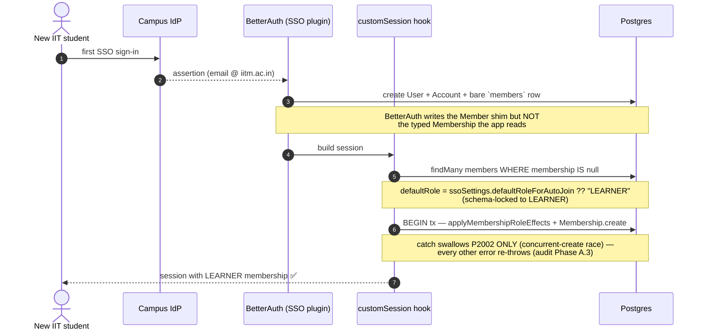
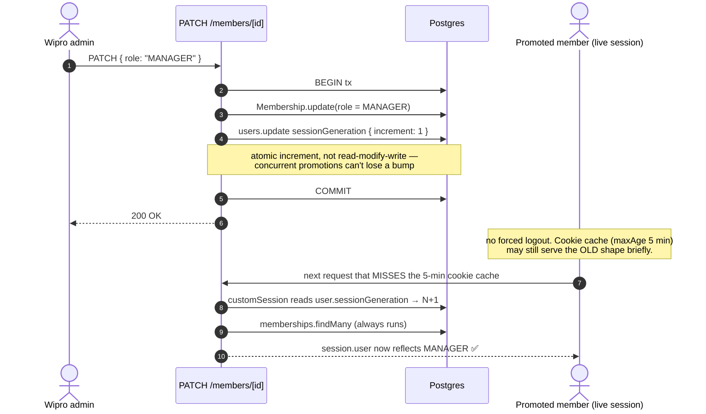

# JIT auto-join & session refresh

This document explains how organization memberships materialize when a
user signs in through an org's IdP for the very first time (Just-In-Time
auto-join), and how a role change propagates to an already-active session
without forcing the user to log out. It is written for engineers touching
`lib/auth.ts:customSession`, `lib/api/organizations/membership-transitions.ts`,
the `/api/organizations/[orgId]/members` route family, or the
`OrganizationSSOSettings` model. The companion docs are
[`sso-and-authentication`](01-sso-and-authentication.md), which covers the
SSO enforcement chain, and [`rate-limiting`](04-rate-limiting.md), which
covers the limiter posture.

---

## §1 — JIT (Just-In-Time) auto-join

When a user authenticates against an org's IdP for the very first time,
BetterAuth's SSO plugin writes a row to the `members` table (the
BetterAuth Member shim) but does NOT create the typed `Membership` row
the rest of the codebase reads. The bridge is in
`lib/auth.ts:customSession`:

```ts
const bareMembers = await prisma.member.findMany({
  where: { userId: user.id, membership: null },
  ...
});
for (const bm of bareMembers) {
  const defaultRole = bm.organization.ssoSettings?.defaultRoleForAutoJoin ?? "LEARNER";
  await prisma.$transaction(async (tx) => {
    const roleEffects = await applyMembershipRoleEffects(tx, {
      userId: user.id,
      role: defaultRole,
      preloadedProfiles, // pre-fetched at the top of customSession; B.7
    });
    await tx.membership.create({ /* role, FKs, betterAuthMemberId */ });
  });
}
```

Concretely: a new graduate student signs in to **IIT Madras** via the
campus IdP for the first time. The IdP asserts their identity, BetterAuth
writes the bare `members` row, and on the very next session load
`customSession` notices the row has no typed `Membership` sibling and
mints one as `LEARNER` (the locked `defaultRoleForAutoJoin`). No admin
touched anything; the student lands on a working dashboard scoped to
exactly LEARNER capabilities. (IIT Madras is a seeded org; the IdP wiring
is the operator-configured shape, not part of the seed.)



Three invariants make this safe:

### Invariant 1 — Role floor is LEARNER

`OrganizationSSOSettings.defaultRoleForAutoJoin` is locked at
`z.literal("LEARNER")` (`lib/labels/org-labels.ts:JitDefaultRoleSchema`,
audit Phase A.1). Pre-Phase-A.1, this field accepted any
non-privileged role including `OWNER` — which meant the first user to
sign in via SSO became co-owner of the org. Catastrophic privilege
grant.

The PATCH handler at `app/api/organizations/[orgId]/sso/route.ts`
rejects any other value with 400. The settings UI shows a locked
"Learner" label instead of the prior 3-option Select.

If an org needs to promote a new SSO user beyond LEARNER, the
admin does it explicitly via `/dashboard/organization/[orgId]/members`
after first signin. That path is audit-logged
(`MEMBER_ROLE_CHANGED`); JIT auto-join would not be.

### Invariant 2 — Catch is narrowed to P2002

The transaction's catch block only swallows `Prisma.PrismaClientKnownRequestError`
with code `P2002` (unique-constraint race — another concurrent session-
create won the membership). Every other error re-throws. Audit Phase A.3.

Pre-fix, the bare `catch {}` swallowed network drops, Supabase RLS
denials, FK violations — anything. Users could end up with a
session cookie but no Membership row, landing on a broken dashboard
where every org-scoped API call 403'd.

### Invariant 3 — Profile FKs pre-loaded

`applyMembershipRoleEffects` accepts `preloadedProfiles` so the
customSession hook fetches the user's `consulteeProfileId` +
`consultantProfileId` once and passes them through the bareMembers
loop. For a user in 10 SSO orgs, this is the difference between 10
redundant `users.findUnique` round-trips per session lookup and zero.
Audit Phase B.7.

---

## §2 — Session refresh after role / membership changes

### The problem

BetterAuth's session cookie has `session.updateAge: 24h`. The cookie
carries a snapshot of `organizationMemberships[]` (built by
`customSession`). If a user's role changes — promoted from LEARNER to
MANAGER, or removed entirely — their session cookie keeps the *old*
role payload for up to 24 hours.

Concrete failure mode: an OWNER demoted to LEARNER could keep
acting as OWNER for 24h. A removed member could keep accessing the org
dashboard for 24h. Both are real bugs, not just hygiene.

### The fix — `sessionGeneration` marker

Every membership mutation that affects the effective permission set
calls `bumpUserSessionGeneration(tx, userId)`, and the four mutation
paths that do so are as follows.

- A `POST /members` adds or reactivates a member.
- A `PATCH /members/[memberId]` changes a member's role, status, or departmentLabel.
- A `DELETE /members/[memberId]` soft-deletes a member to `REMOVED`.
- A `POST /invitations/accept` accepts an invitation.

The helper increments `users.sessionGeneration` by 1 inside the same
transaction as the mutation (`{ increment: 1 }` — an atomic Prisma
update, not a read-modify-write).

`customSession` reads the live row's `sessionGeneration` on every
session lookup and re-loads memberships from the DB **unconditionally**
(the `memberships.findMany` always runs; the marker is not yet used as
a skip-the-refetch guard — that fast-path is the future use noted in
`lib/auth.ts`). Since memberships are always fresh, the user's effective
permissions update on the next round-trip — no forced logout needed.
The marker is what client code can compare against its cached payload to
*detect* staleness; the always-on refetch is what actually corrects it.

One nuance worth knowing: BetterAuth's cookie cache (`session.cookieCache`,
`maxAge: 5 min` in `lib/auth.ts`) can serve a cached session shape for
up to 5 minutes before `customSession` is re-invoked, so "next
round-trip" means "next round-trip that misses the 5-minute cookie
cache." The catastrophic 24h figure below is the worst case when the
bump is *not* called at all and the only refresh is BetterAuth's
`updateAge: 24h` rotation.

#### Trade-off: 5-minute cookie cache vs a DB hit every request

The cookie cache is a deliberate freshness-for-throughput trade.
Without it, every authenticated request would re-run `customSession` —
which reads the live `users` row and a `memberships.findMany` — turning
the session check into a guaranteed two-query round-trip on *every* page
load and API call. With `cookieCache.maxAge = 5 min`, most requests are
served from the signed cookie and skip the DB entirely. The cost is a
bounded staleness window: a role change can take up to 5 minutes to
surface. We accept that ceiling for benign role *changes*, where "your new
capabilities appear within a few minutes, no re-login" is the right UX. The
*dangerous* staleness — a downgraded OWNER still acting as OWNER, or a
removed member still inside — is bounded by the **same** window rather than
cut short by a hard kill: there is no server-side revoke-by-userId
available (BetterAuth's `admin` plugin, which exposes `revokeUserSessions`,
is not installed, and core `revokeSession` needs the target's own token),
so removal also relies on the `sessionGeneration` bump and refetches on the
next cookie-cache miss, worst case at BetterAuth's 24h `updateAge`
rotation. Shrink `maxAge` toward zero and you trade DB load for fresher
roles; the current value says throughput wins for the benign case, and the
removal window is a known limitation rather than a kill switch.

### Why a counter, not a boolean

Concurrent role mutations (e.g. a script bulk-promoting interns)
would race against a boolean "stale" flag — the first reader clears
the flag, and later mutations are lost. A monotonic counter carried
in the session payload (`additionalFields.sessionGeneration`, see
`lib/auth.ts`) means each session can compare "I've seen up to N"
against the current row value, unambiguously.

### Why we don't force logout

The UX cost of "you've been signed out, please log in again" is high
relative to the marginal security benefit. The catastrophic case is
role downgrade with a stale OWNER session, or a removed member still
inside — and that is handled by the same `sessionGeneration` bump, not a
hard kill: no server-side revoke-by-userId is available (BetterAuth's
`admin` plugin is not installed, and core `revokeSession` needs the
target's own session token). So removal, downgrade, and soft-suspend all
bump the generation and refetch on the next cookie-cache miss, worst case
at the 24h `updateAge` rotation.

The `sessionGeneration` bump also handles the middle case: the membership
is still active, but the role / status changed. Next request reflects
the new permissions; no UX disruption.

### Sequence diagram

Walk it through a real promotion: a **Wipro** admin promotes a member
from LEARNER to MANAGER. The PATCH bumps `sessionGeneration` inside the
same transaction as the role write; the promoted user does *not* get
logged out. Their next request that misses the 5-minute cookie cache
re-runs `customSession`, which re-reads memberships and the new MANAGER
capabilities simply appear.



The "misses the 5-min cookie cache" qualifier is the honest version of
"next request": BetterAuth may serve a cached session shape for up to
`cookieCache.maxAge` (5 min) before `customSession` re-runs. The bump
itself is the *atomic increment* in the COMMIT box — it can never lose a
concurrent promotion, which is why the marker is a counter and not a
boolean (see [Why a counter](#why-a-counter-not-a-boolean)).

---

## §3 — Code anchors

- **Bump helper:** `lib/api/organizations/membership-transitions.ts:bumpUserSessionGeneration`
- **Schema:** `prisma/schema.prisma model User → sessionGeneration Int @default(0)`
- **Carry in session:** `lib/auth.ts` additionalFields + customSession `liveSessionGeneration`
- **JIT auto-join loop:** `lib/auth.ts:customSession` bareMembers loop
- **Role floor schema:** `lib/labels/org-labels.ts:JitDefaultRoleSchema`
- **API gate on settings:** `app/api/organizations/[orgId]/sso/route.ts:PatchBodySchema`

---

## §4 — Operator-facing rules

- After enabling SSO, the first user from each domain who signs in
  becomes a LEARNER in the org. Admins promote them explicitly via the
  Members page if the user is meant to be a MANAGER / MAINTAINER /
  OWNER.
- Role changes propagate to active sessions on the next request.
  No "please re-log-in" message; the user just sees their new
  capabilities appear.
- Member removal takes effect on the next request. The removed user
  doesn't have to be told to log out; their `organizationMemberships`
  array drops the org silently.

---

## §5 — Failure modes + how to detect them

The table below maps the symptoms you are most likely to observe back to their probable cause and the fix for each.

| Symptom | Likely cause | Fix |
|---|---|---|
| New SSO user can't access the dashboard, session cookie present | JIT auto-join transaction failed (non-P2002 error). Check server logs for the thrown error. | Investigate root cause — DB connection, RLS, FK. The narrowed catch surfaces it. |
| User keeps acting as old role well past the 5-min cookie-cache window after promotion | `bumpUserSessionGeneration` not called on the mutation path (so the only refresh left is BetterAuth's 24h `updateAge` rotation). | Search route handlers for the mutation; ensure `bumpUserSessionGeneration(tx, userId)` is called inside the tx. |
| `customSession` slow under high SSO sign-in load | The bareMembers loop is running for many orgs without `preloadedProfiles`. | Ensure the pre-fetch at the top of `customSession` is still in place; passes through `preloadedProfiles` to `applyMembershipRoleEffects`. |
| Settings page shows a role dropdown for `defaultRoleForAutoJoin` | A regression of audit Phase A.1. Schema must be `z.literal("LEARNER")`. | Re-check `JitDefaultRoleSchema` + the SSO settings page UI block. |
