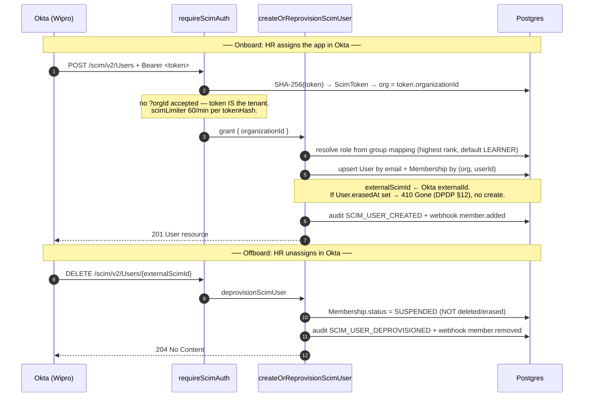

# SCIM 2.0 provisioning

Familiarise speaks SCIM 2.0 at `/scim/v2/**` so IdPs (Okta, Azure AD,
OneLogin, etc.) can manage organization membership without a custom
integration. The endpoints follow RFC 7643 (schema) and RFC 7644
(protocol) closely enough that the off-the-shelf SCIM connectors
work without modification.

## How a seat gets provisioned (and freed)

Picture **Wipro** (a seeded design-partner org; the SCIM wiring below is
the operator-configured shape, not seeded). Wipro's IT admin connects
Okta to Familiarise once with a SCIM bearer token. From then on the
*roster lives in Okta*: assign an employee to the Familiarise app and
Okta `POST`s them into existence here; offboard them in Okta and Okta
`DELETE`s them, freeing the seat. No one logs into Familiarise to manage
membership — the IdP is the source of truth.



The one subtlety worth internalizing from the diagram: **DELETE
suspends, it does not erase.** SCIM DELETE means "stop provisioning this
resource," so `deprovisionScimUser` flips `Membership.status` to
`SUSPENDED` (verified in `lib/scim/operations.ts`) — the seat is freed
and the webhook fires, but the user's data is untouched. Purging data is
a different, user-initiated act (DPDP §12 erasure), and the erasure
short-circuit below is what makes the two paths refuse to collide.

## Endpoint inventory

The five SCIM verbs we mount, their paths, and what each one does are summarized below.

| Verb | Path | Purpose |
|---|---|---|
| `GET` | `/scim/v2/Users` | List + filter (`?filter=userName eq "x"`), `startIndex`/`count` paginated (RFC 7644 §3.4.2). Returns a `ListResponse`. |
| `POST` | `/scim/v2/Users` | Create or re-provision a user. `201` with the `User` resource. |
| `GET` | `/scim/v2/Users/[id]` | Detail. |
| `PATCH` | `/scim/v2/Users/[id]` | `replace active` (Okta deactivate) + Azure-style whole-object `replace`. `200` with the resource. |
| `DELETE` | `/scim/v2/Users/[id]` | Soft-deprovision (`Membership.status = SUSPENDED`); returns `204 No Content`. |

The `[id]` segment is resolved as `Membership.externalScimId` **OR**
`Membership.id` (an `OR` predicate). An IdP-created resource keeps the
`externalScimId` it was minted with; an in-app-created membership keeps
its Familiarise `Membership.id` as its SCIM identity — so the URL stays
stable across the whole lifecycle regardless of who created the row.

**PATCH is a deliberate subset.** Only `op: "replace"` is honored
(`active` flips, or a whole-object replace that carries `active`); any
other op returns `400 invalidSyntax`. Full RFC 7644 §3.5.2 PATCH
(`add` / `remove` on arbitrary paths) is intentionally NOT implemented
— it's rarely used by IdP connectors and carries path-injection attack
surface. A PATCH whose operations we don't understand is a no-op that
echoes the current resource (rather than `500`) so the IdP doesn't loop.

Discovery endpoints (`ServiceProviderConfig`, `ResourceTypes`,
`Schemas`) are intentionally **not** mounted in v1 — the connectors we
target hard-code the resource shape and the SCIM-compliance reports
don't depend on these. They will be added in a follow-up if a target
IdP starts requiring them.

### Design decision: PATCH is `replace`-only, on purpose

Full RFC 7644 §3.5.2 PATCH lets the IdP send `add` / `remove` against an
*arbitrary `path`* — `members[value eq "x"].active`, nested filters, the
lot. Honoring that means turning an attacker-influenced path string into
a query against our data, which is path-injection surface for a feature
almost no IdP connector actually exercises. So we ship the 5% that
matters — `op: "replace"` carrying `active` (Okta's deactivate) or a
whole-object replace (Azure's "send everything every poll") — and reject
anything else with `400 invalidSyntax`. The trade-off is explicit: we are
*not* RFC-complete on PATCH, and an exotic connector that insists on
`add`/`remove` paths won't work until we extend it. In exchange we keep
the parser tiny and the attack surface near zero. One guard rail on top:
a PATCH whose ops we simply don't recognize is treated as a **no-op that
echoes the current resource** (not a `500`), so a chatty IdP doesn't
retry-loop on us (verified in `app/scim/v2/Users/[id]/route.ts`).

## Authentication

Every SCIM call carries `Authorization: Bearer <raw token>`.
`/api/organizations/[orgId]/scim/tokens` (OWNER-only — `requireOrgOwner`;
BILLING_ADMIN deliberately excluded, since a leaked token provisions
arbitrary users) mints tokens. The token is 48 random bytes
(base64url), and the **raw value is returned exactly once** on POST. We
store only its SHA-256 hash (`ScimToken.tokenHash`, unique), so a lost
token requires creating a fresh one. The auth helper at
`lib/scim/auth.ts` (`requireScimAuth`) also:

- hashes the bearer → looks it up → the token's `organizationId` becomes
  the implicit tenant (no `?orgId=` is accepted — that would risk an IdP
  cross-tenant leak);
- enforces `scimLimiter` (60 req/min per token, keyed on `tokenHash`);
- writes a `SCIM_TOKEN_USED_AFTER_REVOKE` audit row when a `REVOKED`
  token attempts to authenticate (still-in-IdP-config is useful signal),
  then 401s;
- bumps `lastUsedAt` on every successful call (fire-and-forget — a
  failed timestamp write never 5xxes the IdP).

> 🟡 **Gap: `ScimToken.expiresAt` is designed-not-enforced.** The column
> exists (so OWNERs can set a 6/12-month TTL at mint time and a rotation
> cron has a stable column to scan), but `requireScimAuth` does **not**
> yet reject an `ACTIVE` token past its `expiresAt` — its lookup selects
> only `{ id, organizationId, status }` and never reads `expiresAt`
> (verified in `lib/scim/auth.ts`). Today a token expires only on explicit
> `DELETE` (which flips it to `REVOKED`). Do not document TTL enforcement
> as shipped. (No issue filed yet.)

## Group → role mapping

`/api/organizations/[orgId]/scim/group-mappings` lets the OWNER bind
IdP group names to local `MemberRole` values, and a representative set
of those bindings looks like the table below.

| SCIM group name | → MemberRole |
|---|---|
| `IT-Admins` | `MAINTAINER` |
| `Finance-Leads` | `BILLING_ADMIN` |
| `Engineering-Managers` | `MANAGER` |
| `All-Employees` | `LEARNER` |

When a SCIM user is in multiple mapped groups, the highest-rank role
wins (see `resolveRoleFromGroupNames` in `lib/scim/resource-user.ts`).
When no group matches, the user is created as `LEARNER` — least
privilege by default.

## Erasure short-circuit

If a user has previously exercised DPDP §12 right-to-erasure
(`User.erasedAt IS NOT NULL`), every SCIM operation that would create
or re-provision them returns:

```json
{
  "schemas": ["urn:ietf:params:scim:api:messages:2.0:Error"],
  "status": "410",
  "detail": "User has been erased per DPDP §12 and cannot be re-provisioned. Remove the user from your IdP roster."
}
```

The IdP's provisioning report surfaces this as a permanent error so
the operator knows to delete the user from their IdP rather than retry
indefinitely.

## Webhooks

Every SCIM mutation that creates or removes a membership also emits
the matching outbound webhook event (`member.added` / `member.removed`),
so subscribers don't need to differentiate between in-app and
IdP-driven provisioning.

## Local integration testing

```bash
# 1. Mint a SCIM token (as OWNER).
TOKEN_PAYLOAD=$(curl -s -X POST $BASE/api/organizations/$ORG/scim/tokens \
  -H "Cookie: $OWNER_COOKIE" -H "Content-Type: application/json" \
  -d '{"label":"okta-test"}')
echo "$TOKEN_PAYLOAD" | jq .

# 2. Pull the raw token (only visible on this POST).
SCIM_TOKEN=$(echo "$TOKEN_PAYLOAD" | jq -r .token.rawToken)

# 3. Create a SCIM user.
curl -X POST $BASE/scim/v2/Users \
  -H "Authorization: Bearer $SCIM_TOKEN" \
  -H "Content-Type: application/scim+json" \
  -d '{
    "schemas": ["urn:ietf:params:scim:schemas:core:2.0:User"],
    "userName": "alice@acme.com",
    "name": { "givenName": "Alice", "familyName": "Doe" },
    "active": true,
    "emails": [{ "value": "alice@acme.com", "primary": true }],
    "externalId": "okta-user-42",
    "groups": [{ "value": "IT-Admins" }]
  }'

# 4. Deactivate.
curl -X PATCH $BASE/scim/v2/Users/okta-user-42 \
  -H "Authorization: Bearer $SCIM_TOKEN" \
  -H "Content-Type: application/scim+json" \
  -d '{
    "schemas": ["urn:ietf:params:scim:api:messages:2.0:PatchOp"],
    "Operations": [{ "op": "replace", "path": "active", "value": false }]
  }'
```

## Audit trail

All SCIM mutations land in `OrgAuditLog` under the `SYSTEM` category:

- `SCIM_USER_CREATED` / `SCIM_USER_REPROVISIONED` / `SCIM_USER_UPDATED` / `SCIM_USER_DEPROVISIONED`
- `SCIM_GROUP_MAPPED` / `SCIM_GROUP_UNMAPPED`
- `SCIM_TOKEN_CREATED` / `SCIM_TOKEN_REVOKED` / `SCIM_TOKEN_USED_AFTER_REVOKE`
