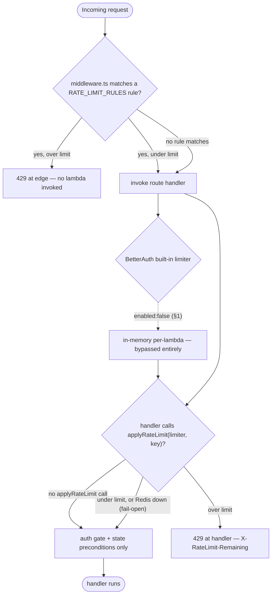

# Rate limiting

This document is the coverage matrix for auth and enterprise rate
limiting: it records who enforces what, at which layer, and why
BetterAuth's own limiter is disabled. It is written for engineers
touching `middleware.ts`, `lib/rate-limit.ts`, `lib/auth.ts`, any
unauthenticated route under `app/api/auth/**`, or the wallet, invoice,
and webhook endpoints.

---

## §0 — Two enforcement layers

Rate limits live in **two** places, and the matrix in §2 marks which is
which. Don't assume a route is limited just because middleware exists:

1. **Edge middleware** (`middleware.ts`, `RATE_LIMIT_RULES` table) — runs
   *before* any serverless function is invoked, so it stops cost
   amplification under DDoS. It's a small, explicit allow-list of
   high-risk public/auth routes. Adding a limit = appending a `RateRule`
   object to the `RATE_LIMIT_RULES` array (each rule is
   `{ label, match, limiter, key?, skipLocalhost }`). The first matching
   rule fires; rules match disjoint paths. **Do not** cite middleware
   line numbers — the table is reorderable and the line-numbered `if`
   chain it replaced is long gone.
2. **Route-handler level** (`applyRateLimit(limiter, key)` called inside
   the handler) — for authenticated org-scoped writes where the key
   (e.g. `org:${orgId}` or a SCIM `tokenHash`) isn't cheaply parseable
   at the edge, or where the limit is conceptually part of the
   handler's contract. `orgWebhookLimiter`, `orgInviteLimiter`,
   `orgDataExportLimiter`, and the SCIM `scimLimiter` are all enforced
   here, NOT in middleware.

All limiters are defined in `lib/rate-limit.ts` via the shared
`makeLimiter(count, window, prefix)` helper (Upstash sliding window).
`applyRateLimit` fails **open** (Redis down → request allowed) and
returns a `429` with an `X-RateLimit-Remaining` header on exceed. The
SCIM bearer path enforces `scimLimiter` from inside `requireScimAuth`
(`lib/scim/auth.ts`), so every `/scim/v2/**` verb inherits it without a
per-route call.

Read this as a gauntlet a request runs, edge first. The left branch
(edge middleware) exists to kill cost-amplification *before* a lambda
spins up; the right branch (handler limiter) catches authed writes whose
key only becomes known after the route resolves `orgId` / `tokenHash`.
Note where BetterAuth's own limiter *would* sit — and that it is off (§1):



The dotted BetterAuth node is the whole point of §1: it is wired into
the auth stack but `enabled: false`, so it never fires — every auth-path
limit you see is Upstash-backed at the edge instead. Two behaviors the
diagram bakes in, both load-bearing: a matched edge rule short-circuits
*before* the function runs (left branch), and `applyRateLimit` **fails
open** — if Redis is unreachable the request is allowed, not blocked, so
a Redis outage degrades to "no rate limit" rather than "site down."

---

## §1 — Why BetterAuth's built-in limiter is disabled

`lib/auth.ts` carries `rateLimit: { enabled: false }` (still true as of
this revision). This is deliberate:

- BetterAuth's limiter is **in-memory per Node.js process**.
- We deploy to **Netlify** (serverless). Each cold-start lambda gets
  its own counter. An attacker can race past a per-process gate by
  rotating through enough fresh lambdas.
- A globally-coherent limit has to live in shared state. We use
  Upstash Redis.

If you ever re-enable BetterAuth's limiter, audit the overlap against
the Upstash-backed limiters below. Double-counting produces two
different 429 responses for the same flow and confuses operators
during incident response.

See audit Phase B.8.

**What this design survived.** The disable isn't a default we never
touched — it's a documented decision with a comment block right above
`rateLimit: { enabled: false }` in `lib/auth.ts` that spells out the
serverless reasoning and points back here (and at audit Phase B.8). The
failure it pre-empts is subtle: leave BetterAuth's in-memory limiter
*on* alongside the Upstash one and the same brute-force flow can trip
*two different* 429s depending on which lambda served it — an
incident-response trap where the operator can't tell which limiter
fired or why the counts don't add up. One coherent limiter beats two
that disagree.

### Trade-off: per-subsystem limiters vs one global gate

The matrix has eight-plus named limiters instead of a single
catch-all. The cost is real — every new authed-write route has to pick
the right limiter (or define one) and document it in §2, and it's easy
to forget. The payoff is that each surface gets a window sized to *its*
threat: auth signin is 10/15min on IP (brute force), webhook config is
5/min on `org:` (config thrash), data-export is 1/24h on `org:`
(expensive job). A single global limiter can't express that spread
without either throttling logins too loosely or throttling reads too
tightly, and — because the keys differ (IP vs `org:` vs `tokenHash`) —
one bucket would force every tenant through the same keyspace, so one
noisy org behind a corporate NAT could starve everyone (see §6). Many
narrow limiters, each with its own `rl:` prefix, is the price of not
having that cross-tenant blast radius.

---

## §2 — Coverage matrix

Two layers (see §0), split into the two tables below: **edge** = a
`RATE_LIMIT_RULES` entry in `middleware.ts`; **handler** = an
`applyRateLimit(...)` call inside the route (or, for SCIM, inside
`requireScimAuth`). A third table lists v2 routes that are gated but
deliberately carry no limiter. All limiters are the `lib/rate-limit.ts`
exports — cite those names, not middleware line numbers.

### Edge-enforced (`middleware.ts` → `RATE_LIMIT_RULES`)

Middleware rules apply before any route handler executes and key exclusively on IP, making them the first line of defence for auth, SSO, and wallet endpoints against credential-stuffing and high-frequency abuse.

| Surface | Limiter | Window | Key | Skip localhost |
|---|---|---|---|---|
| `POST /api/auth/sign-in*` | `authLimiter` | 10 / 15 min | IP | yes |
| `POST /api/auth/sign-up*` | `authLimiter` | 10 / 15 min | IP | yes |
| `POST /api/auth/forget-password*` | `authLimiter` | 10 / 15 min | IP | yes |
| `GET /api/auth/sso/domain-check` | `ssoDomainCheckLimiter` | 60 / hour | IP | yes |
| `POST /api/organizations/invitations/accept` | `orgInviteAcceptLimiter` | 30 / hour | IP | yes |
| `POST /api/organizations/[orgId]/billing-account/wallet/top-ups` | `orgWalletTopUpLimiter` | 20 / hour | `org:${orgId}` | yes |

> The edge auth rule matches `sign-in` / `sign-up` / `forget-password`
> by `startsWith`. **`reset-password` is NOT in the table** and
> BetterAuth's own limiter is off (§1), so `POST /api/auth/reset-password`
> is not rate-limited in code today — the reset *token* is the gate
> (single-use, 30-min TTL via `resetPasswordTokenExpiresIn`). If you
> want a limit there, add a rule keyed on IP. (Public read endpoints —
> consultant search, trial-eligibility, newsletter, booking
> availability — also live in this table but aren't enterprise surfaces;
> they're documented in the global rate-limit notes, not here.)

### Handler-enforced (`applyRateLimit(...)` inside the route)

Handler-side limiters sit inside each route (or inside `requireScimAuth` for SCIM) and can therefore key on org-scoped identifiers rather than raw IP — consult the Key column carefully when adding a sibling route to an existing limiter.

| Surface | Limiter | Window | Key | Gate |
|---|---|---|---|---|
| `POST /api/organizations/[orgId]/invitations` | `orgInviteLimiter` | 20 / hour | `${orgId}` | MAINTAINER+ |
| `POST /api/organizations/[orgId]/webhooks` | `orgWebhookLimiter` | 5 / min | `org:${orgId}` | billing-admin∨owner |
| `PATCH /api/organizations/[orgId]/webhooks/[endpointId]` | `orgWebhookLimiter` | 5 / min | `org:${orgId}` | billing-admin∨owner |
| `POST .../webhooks/[endpointId]/rotate-secret` | `orgWebhookLimiter` | 5 / min | `org:${orgId}` | OWNER |
| `POST /api/organizations/[orgId]/data-exports` | `orgDataExportLimiter` | 1 / 24 h | `org:${orgId}` | billing-admin∨owner |
| `GET /scim/v2/**` (all verbs) | `scimLimiter` | 60 / min | `scim:${tokenHash}` | bearer token |

> **`orgInviteLimiter` keys on the bare `orgId`** (not `org:${orgId}`);
> the webhook + data-export limiters use the `org:` prefix. The keys are
> distinct prefixes (`rl:org-invite` vs `rl:org-webhook` etc.) so the
> mismatch is cosmetic, but copy the exact key when adding a sibling
> route to the same limiter.

### Gated but NOT rate-limited (intentional)

These v2 routes rely on their auth gate + state preconditions; no
limiter is wired, and none is needed at current threat-model:

| Surface | Gate | Why no limiter |
|---|---|---|
| `POST` / `DELETE .../sso/break-glass` | OWNER | OWNER-only + already requires `enforceSSO` on; a flood just re-stamps one timestamp. Every call audits, so abuse is visible. |
| `POST .../verification/resubmit` | MAINTAINER+ | Idempotent state flip gated on "previously rejected & still pending"; nothing to amplify. |
| `GET .../checkout/overage-preview` | any member | Read-only projection; covered by the §4 authed-read rationale. |
| `POST` / `DELETE .../consent` | MANAGER+ | MANAGER-gated config write; low call volume, audit-logged. |

Everything else inherits the org-scoped role gates in
`lib/auth-helpers.ts:requireOrgAccess` (and the field-level
`requireOrgBillingAdminOrOwner` disjunction on finance writes) plus the
IP-level Cloudflare / Netlify edge rate limits (the latter are
operational, not in code).

---

## §3 — Localhost bypass

`isBypassableIp(clientIp)` (`lib/rate-limit.ts`) returns true for `::1`,
`127.0.0.1`, and the `unknown_ip` sentinel — **but only when
`NODE_ENV !== "production"`**. In production it returns `false` for
every value (including the sentinel), so a header-stripping proxy can't
silently disable a limiter. The booking-algorithm-tests + Chrome MCP
runs need to fire hundreds of requests in a few minutes; the dev-only
bypass keeps them unblocked without weakening production limits.

The bypass is opt-in **per rule**: each `RATE_LIMIT_RULES` entry carries
a `skipLocalhost` flag and the value is intentionally inconsistent — the
auth + enterprise *write* rules set it `true` (bypass on localhost), the
public *read* rules (consultant search, eligibility, newsletter,
availability) set it `false` so they rate-limit even locally. Preserve
the original per-rule value when editing.

See `CLAUDE.md` memory note on agent-006 booking tests for context.

---

## §4 — What's NOT rate-limited (and why)

- **Authenticated org-scoped reads** (`GET /api/organizations/[orgId]/...`)
  — gated by `requireOrgAccess`. A bad actor with a valid OWNER
  session can already query the org's data; rate-limiting would just
  punish a UI bug that triggers a fetch loop. Use TanStack Query's
  `staleTime` to deduplicate.
- **Webhooks** (`POST /api/webhooks/razorpay`, etc.) — signature
  verification is the gate. Rate-limiting would risk dropping
  legitimate retries from the gateway.
- **Static assets + Next.js system routes** — handled at the edge.

---

## §5 — How to add a new limiter

1. Define the limiter once in `lib/rate-limit.ts` via the shared helper
   (don't hand-roll `new Ratelimit({...})` — `makeLimiter` wires the
   shared Upstash `redis` client + sliding window):
   ```ts
   export const myLimiter = makeLimiter(<count>, "<window>", "rl:my-key");
   ```
   Pick a **unique `rl:` prefix** so its bucket can't collide with
   another limiter's keyspace.
2. Choose the layer:
   - **Edge** (public/auth, cheap key): append a `RateRule` to
     `RATE_LIMIT_RULES` in `middleware.ts` — `{ label, match, limiter,
     key?, skipLocalhost }`. Omit `key` to default to client IP; return
     `null` from `key` to skip when the identifier can't be parsed.
   - **Handler** (authed org-scoped write, key needs the resolved
     `orgId` / `tokenHash`): call
     `const rl = await applyRateLimit(myLimiter, key); if (rl) return rl;`
     near the top of the handler, after the auth gate.
   Either way `applyRateLimit` returns a `429` `Response` on exceed and
   `null` on pass, and fails open if Redis is down.
3. **Document the limiter in §2 of this doc** (correct layer + key +
   window) so the matrix stays complete.
4. Add an MCP test case to the relevant prompt file (see SSO.9 in
   `prompts/enterprise-tests/1-membership-auth/1.3-sso-and-domain-claims.md`
   for the pattern — fire N requests, assert the tail returns 429).

---

## §6 — Common pitfalls

- **Don't pick a key shared across tenants.** A limiter keyed on
  `unknown_ip` from behind a corporate NAT will punish the whole
  company.
- **Don't put auth-mutation rate limits behind the auth gate.** If you
  apply `authLimiter` only after `requireApiAuth`, a brute-force
  attacker on the signin endpoint is never gated — the limiter must
  run BEFORE the session check.
- **Don't conflate idempotency with rate limiting.** A wallet top-up
  retry of the same `clientIdempotencyKey` is legitimate and should
  not count against the limiter (or should at least be deduped before
  counting). The current `orgWalletTopUpLimiter` counts every request;
  the idempotency key handles deduplication at the route layer.

---

## §7 — Audit references

- Phase B.8 — documented decision to keep BetterAuth's limiter
  disabled.
- `lib/auth.ts` `rateLimit: { enabled: false }` — the comment block
  above it references this decision and already points at this file's
  current path (`docs/enterprise/20-iam-and-security/04-rate-limiting.md`).
