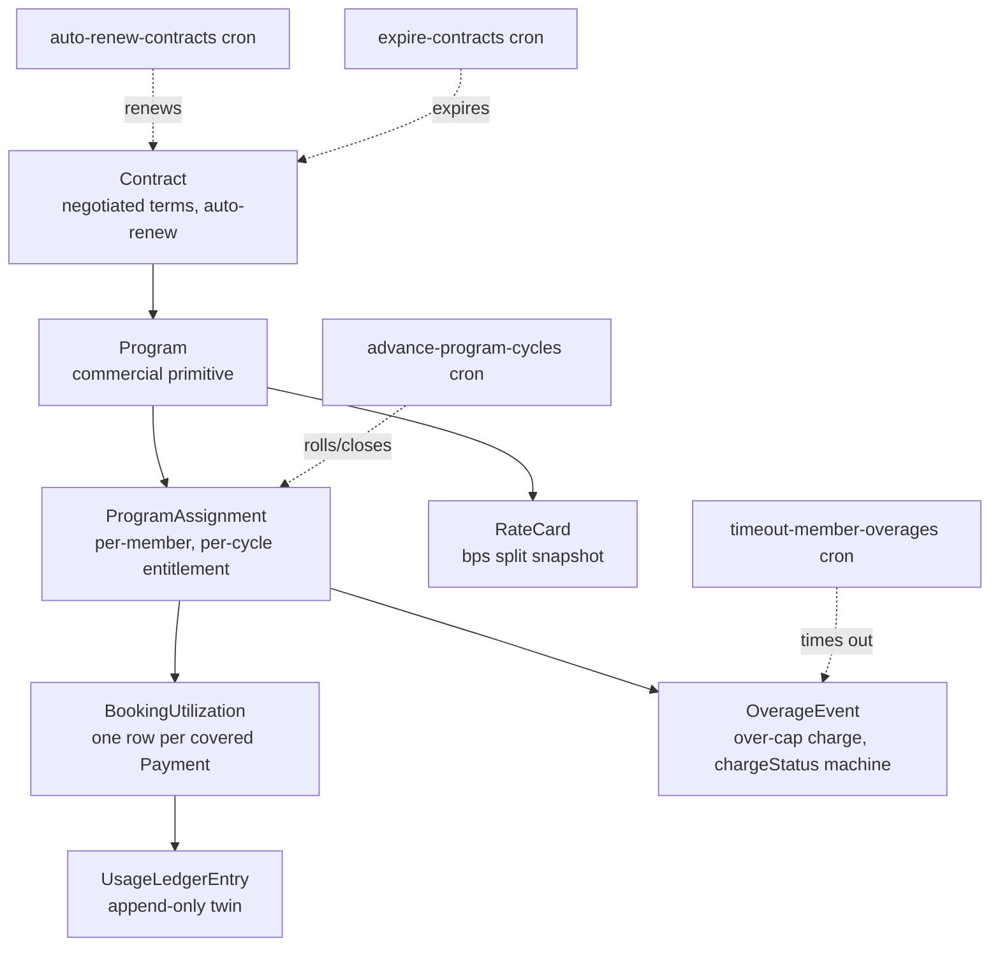
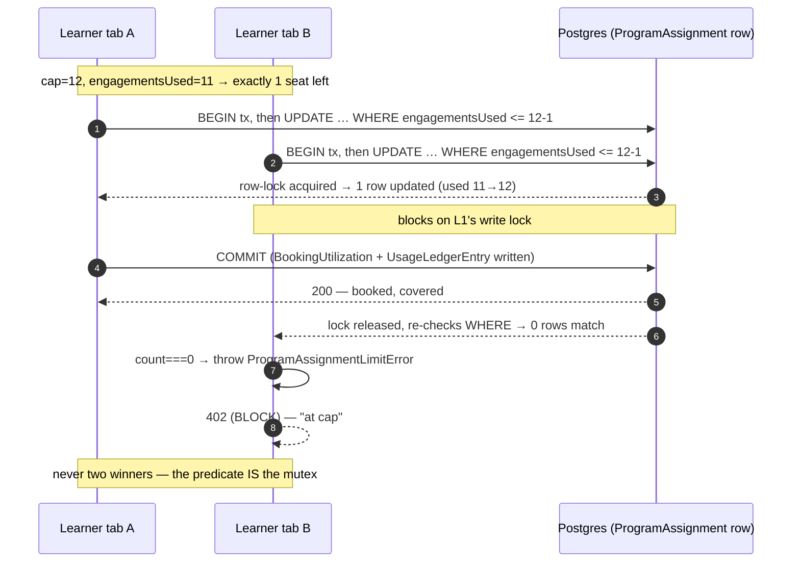
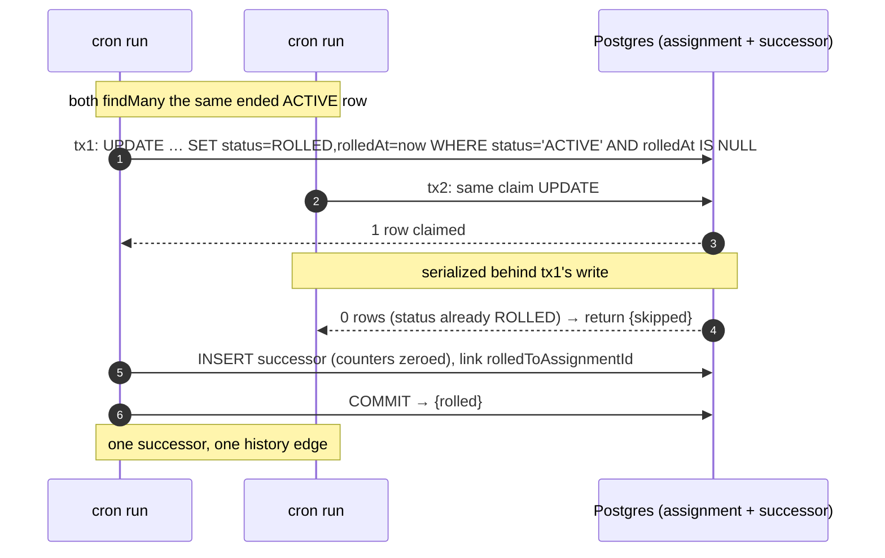

# Concurrency & idempotency

This document covers the atomic patterns that keep enterprise mutations correct under concurrency, and the idempotency keys that let every side-effect survive a duplicate call. It merges the former concurrency-and-locking and idempotency-keys documents into one reference.

The layer leans on Prisma transactions plus a few conditional `updateMany` compare-and-set writes for its hottest mutations. These are point mutations on rows whose identity is already known, so a Redis lock would add latency for no safety gain, and the enterprise write paths therefore take none. Two clarifications, because an earlier revision of this page overstated both (corrected in #1132): the CAS writes go through the Prisma ORM rather than `$executeRaw`, and Redis locks *are* used elsewhere in the codebase — every cron wraps in `withCronLock`, and the booking checkout takes slot, consultee and event locks. ADR 13 describes those as its Layer 4. Money idempotency is anchored by `LedgerTransaction.idempotencyKey @unique` together with a handful of other unique constraints.

## How this band fits together

This is the first document in the programs-and-lifecycle band, so it is worth seeing how the pieces it touches connect before diving into the locking detail. A `Contract` is the negotiated relationship an org signs; each `Program` hangs off one contract; each member draws against a per-cycle `ProgramAssignment`; every covered booking writes a `BookingUtilization` row (with a `UsageLedgerEntry` twin); and a booking that crosses the cap writes an `OverageEvent`. The nightly lifecycle crons advance, renew, and expire these rows. The diagram below is the map for the rest of the band.



The detail of each box lives in its own document: [programs](02-programs.md) owns the assignment and overage accounting, [contract lifecycle](07-contract-lifecycle.md) owns the contract state machine, and [cycle engine & rollover](08-cycle-engine-and-rollover.md) owns the assignment lifecycle and the rollover crons.

---

# Part 1 — Concurrency & locking

## Wallet debit (conditional UPDATE)

The wallet debit lives in `lib/api/organizations/wallet.ts#walletDebit` and is the canonical conditional-UPDATE lock:

```sql
UPDATE "BillingAccount"
SET "walletBalance" = "walletBalance" - :amountPaise
WHERE "id" = :billingAccountId
  AND "walletBalance" IS NOT NULL
  AND "walletBalance" >= :amountPaise
```
The `>= :amountPaise` predicate **is** the lock: Postgres takes a row-level write lock for the UPDATE, so two concurrent debits can't both satisfy it. Zero rows updated → `WalletInsufficientFundsError`. This moves only the **cache** ([money model §4](../10-money-and-ledger/01-money-model-overview.md)); the authoritative `Dr WALLET` leg posts later inside the `booking:<paymentId>` transaction, where the full split is known. Both run in the same Prisma transaction as the rest of checkout, so any downstream failure rolls back the decrement.

## Program-assignment claim (upsert on composite unique)

The claim helper is `lib/api/organizations/program-helpers.ts#claimProgramAssignment`, and the `@@unique([programId, membershipId, periodStart])` constraint is the lock. Two concurrent claims for the same member and period converge on a single row via an upsert with `ON CONFLICT DO NOTHING` semantics.

## Booking utilization (counter + usage ledger in lock-step)

`recordBookingUtilization` runs as one transaction. It first claims cap headroom with a guarded conditional UPDATE (`updateMany WHERE engagementsUsed <= cap - :n`, so the cap check and the increment can't race), then create `BookingUtilization` + its `UsageLedgerEntry` twin (`consumedPaise` is the CREDIT_POOL twin, metered against `creditBudgetPerCycle × 100`). When the guarded update matches zero rows the booking is over-cap: either checkout refuses (`BLOCK` → `ProgramAssignmentLimitError`) or the overage path bills it (`wasOverage = true`, persists an `OverageEvent`). The reconciler's `PROGRAM_ASSIGNMENT_ENGAGEMENTS_DRIFT` is the backstop ([ledger integrity](../10-money-and-ledger/13-ledger-integrity.md)).

**The race, drawn.** Picture the last covered seat on a Wipro learner's BLOCK assignment (`coveredEngagementsPerCycle - engagementsUsed == 1`) and two browser tabs hitting *Book* in the same millisecond. Both transactions read the same stable config and the same `engagementsUsed`; the correctness hinges entirely on the conditional UPDATE, because Postgres takes a row-level write lock the instant the first `updateMany` touches the row. The second transaction blocks on that lock, and when it unblocks it re-evaluates `WHERE engagementsUsed <= cap - 1` against the *already-incremented* value — which no longer matches — so it gets `count === 0` and throws. There is no read-then-write window to lose:



Swap `BLOCK` for `CHARGE_ORG` (Wipro's actual seed config) and tab B doesn't 402 — it takes the unconditional `update` branch, reads the post-increment value, sees `engagementsUsedAfter (13) > cap (12)`, flags `wasOverage` and persists an `OverageEvent` instead. Same lock, different verdict: the routing happens *after* the lock decides who crossed the cap, never before.

## Rate-card bump (two-step in one transaction)

`bumpRateCard` closes the current card (`effectiveTo = at`) and inserts a new one (`effectiveFrom = at`) inside a single transaction. A degenerate same-instant race can overlap the two rows, but `findEffective` orders by `effectiveFrom DESC` so the winner's row wins every lookup, and the money impact is nil because earnings already carry their bps snapshots (see [booking → earnings](../10-money-and-ledger/05-booking-to-earnings.md)).

## PO balance (atomic compare-and-swap)

The purchase-order balance decrements via `updateMany WHERE status='ACTIVE' AND remainingAmountPaise >= amount` in one statement, so two POSTs racing for the last ₹1 cannot both win (see [invoicing §6](../10-money-and-ledger/08-invoicing.md)).

## Domain-claim uniqueness

`OrgDomainClaim.domain` is globally `@unique`, so concurrent claims from two orgs resolve to a `P2002`, and the loser maps that error to a 409.

## `OrgAuditLog` writes

Audit writes are append-only — a single `.create()` runs inside the business transaction, so a failed operation leaves no phantom audit row, and an audit-write failure rolls back the operation it was documenting.

## What the layer avoids

The layer deliberately sidesteps three heavier mechanisms. It avoids Redis locks *on these row-scoped mutations* because they do not need slot-discovery locking — the cron and booking layers do take them. It avoids Postgres advisory locks because they are out of scope for this transactional surface. And it avoids serializable isolation on the hot paths, relying instead on conditional UPDATEs, unique constraints, and immutable ledger rows rather than raising the isolation level (the nightly lifecycle crons are the exception — each runs its per-row claim inside a `Serializable` transaction, covered below).

---

# Part 2 — Idempotency keys

The governing rule is that every side-effect entry point derives its idempotency key from immutable request content. It never accepts a client-supplied key (which is a replay-attack vector) and never uses `Date.now()` or a random value (which would defeat deduplication entirely).

## The money journal — `LedgerTransaction.idempotencyKey`

Every cash event posts through `postLedgerTxn`, which is idempotent on a structured, unique key. A repeat call is a no-op that returns `{ created: false }`; a racing duplicate hits the `@unique` `P2002`, aborts its transaction, and the retry lands on the fast path (see [ledger & postings §2](../10-money-and-ledger/03-ledger-and-postings.md)). The keys each money flow derives are listed below.

| Flow | Key |
|---|---|
| top-up | `topup:<providerOrderId>` |
| booking | `booking:<paymentId>` |
| invoice paid | `invoicepaid:<invoiceId>` |
| top-up refund | `topup-refund:<providerPaymentId>` |
| booking refund | `refund:<refundId>` |
| consultant payout | `payout:<payoutId>` |
| host-org payout | `orgpayout:<payoutId>` |

## Webhooks

Inbound webhooks dedupe on the vendor's own event id, falling back to a deterministic body hash when one isn't supplied, as the table records.

| Source | Key | Storage |
|---|---|---|
| Razorpay / Stripe | `event.id` (vendor) | `WebhookEvent.id` (permanent) |
| fallback | `sha256(raw_body)` | `WebhookEvent.id` |

Using a deterministic body-hash fallback rather than `Date.now()` plus a random value is what makes replays truly idempotent.

## Payment orders & top-ups

Payment-order and top-up flows key off the provider order id that the server itself minted, and each has a unique constraint that catches a duplicate POST, as summarised below.

| Operation | Key | Collision handling |
|---|---|---|
| Wallet top-up | `providerOrderId` (mint on create-order) | `P2002` on `WalletTopUp.providerOrderId` unique → POST returns the existing row |
| Invoice payment | `razorpay_order_id` | `P2002` on `OrganizationInvoice.providerPaymentOrderId` |
| One-time / day-pass checkout | `razorpay_order_id` | same |

The server never accepts a client-supplied key — it reuses the `razorpay_order_id` it minted. Top-up confirmation is doubly idempotent: the `WalletTopUp` claim is `updateMany WHERE status='PENDING'` (exactly one delivery wins) **and** the `topup:` ledger key dedupes the posting ([wallet & top-ups](../10-money-and-ledger/04-wallet-and-topups.md)).

## Invoices

The subscription cron computes `invoiceNumber` from `subscriptionId + billingCycleIndex`. Its atomic claim, `updateMany WHERE nextInvoiceDate <= now`, prevents a double invocation, and `OrganizationInvoice.invoiceNumber @unique` rejects any second insert with a `P2002` that is logged as `subs.invoice.skipped`.

## Cron claim gates (#777/#779 lifecycle crons)

The nightly lifecycle crons run on GitHub Actions (`.github/workflows/*.yml`, calling into `jobs/**`) and can double-fire, either through an overlapping replica or a same-day re-run. Each one gates on a timestamp-or-status column that it stamps inside a `Serializable` `$transaction` via a conditional `updateMany`, so the claim itself is the distributed lock: when `count === 0` another replica has already won and the run skips cleanly. A second unique constraint backstops the rare case of a run slipping past the claim. The crons and their gates are tabulated below.

| Cron (`jobs/…`) | Claim gate (`updateMany WHERE …`) | Backstop unique |
|---|---|---|
| `billing/advance-program-cycles` (ROLL/CLOSE) | `status='ACTIVE' AND rolledAt IS NULL` → set `status`, `rolledAt` | successor mint: `rolledToAssignmentId @unique` + `@@unique([programId, membershipId, periodStart])` → `P2002` |
| `contracts/auto-renew-contracts` | `status='ACTIVE' AND autoRenewedAt IS NULL` → set `autoRenewedAt` | `Contract.supersededByContractId @unique` → `P2002` |
| `contracts/expire-contracts` | `status='ACTIVE'` → set `status='EXPIRED'` | (idempotent on status alone) |
| `billing/timeout-member-overages` | `chargeStatus='PENDING' AND chargeTimedOutAt IS NULL` → set `chargeStatus='FAILED'`, `chargeTimedOutAt` | (PENDING→FAILED is the only legal target; a paid/swept row no longer matches) |
| `billing/wallet-low-balance` (auto-top-up) | rate-limited per account by `autoTopUpLastFiredAt` | gateway recurring-charge idempotency |
| `billing/dunning` stage 1 | `status='ISSUED' AND markedOverdueAt IS NULL` → set `status='OVERDUE'`, `markedOverdueAt` | (idempotent on status + stamp) |
| `billing/dunning` stage 2 | `status='OVERDUE' AND lastDunningReminderAt = <value-read> AND dunningReminderCount < 3` → set `lastDunningReminderAt`, `increment dunningReminderCount` | the read-then-match on `lastDunningReminderAt` is the optimistic-lock (concurrent reminder loses) |

The successor-mint chain (`rolledToAssignmentId @unique` + the zeroed-counter `ACTIVE` row) is the rollover idempotency anchor; `autoRenewedAt` is the contract-renewal anchor; `chargeTimedOutAt` is the member-overage-timeout anchor; `markedOverdueAt` / `lastDunningReminderAt` are the dunning anchors. None of these crons writes a `PAUSED` assignment (🟡 designed-not-active). Full state-machine detail: [cycle engine](08-cycle-engine-and-rollover.md), [contract lifecycle](07-contract-lifecycle.md).

**Why "the claim *is* the lock" survives a double-fire.** GitHub Actions can re-run a workflow, and an overlapping replica can pick the same `ProgramAssignment` whose `periodEnd` just passed. Both `advance-program-cycles` instances see the row in their `findMany` candidate set; the safety lives in the per-row `Serializable` `$transaction` that *claims* the row with `updateMany WHERE status='ACTIVE' AND rolledAt IS NULL`. Exactly one claim flips `ACTIVE → ROLLED`; the other gets `count === 0` and returns `skipped` without minting anything. The `rolledToAssignmentId @unique` + successor `@@unique([programId, membershipId, periodStart])` are the belt-and-braces below that — if two runs ever slipped past the claim (they can't, but constraints don't trust prose), the second `create` trips `P2002`, which is caught and skipped:



This is the same shape every lifecycle cron in the table above uses (`autoRenewedAt`, `markedOverdueAt`, `chargeTimedOutAt` …) — a timestamp-or-status column that the claim stamps, doubling as the distributed lock, with a unique constraint as the last line of defence.

## Payment legs

`PaymentLeg.sourceRef` carries the per-source key: a `CARD` leg uses the gateway payment id, a `REFERRAL_CREDIT` leg uses `referralCreditUsageId`, and an `INVOICE_ACCRUAL` or `LICENSE` leg uses `programAssignmentId`. The `@@unique([paymentId, source])` constraint blocks any duplicate-source leg (see [payment legs](../10-money-and-ledger/09-payment-legs.md)).

## Emails (Resend)

Outbound email sets `X-Entity-Ref-ID` from immutable content — `orgId + mustPayByDate` for the MSME alert, `invoiceId` for a receipt, and `organizationId + ssoProviderId` for SSO activation — so Resend dedupes a re-send automatically.

---

## Anti-patterns
- ❌ **Client-supplied idempotency keys for money** — a chosen collision forces a replayed success. Derive from immutable content.
- ❌ **`Date.now() + Math.random()` fallback** — replays aren't deduped; explicitly removed from webhook handlers.
- ❌ **Keys in the URL path** — caches/CDN may dedupe on path; keep keys in the body.
- ❌ **"Merge the duplicate later"** — a duplicate ledger posting double-counts a balance (balances are sums). Reject at write time with the `@unique` `P2002`; never reconcile two rows after the fact.

## Testing idempotency
Every money-touching path has a replay test: run the happy path, retry the identical request, assert **zero** additional mutations.
```ts
it("is idempotent on replay", async () => {
  const before = await prisma.ledgerTransaction.count();
  await handler(req);
  const afterFirst = await prisma.ledgerTransaction.count();
  await handler(req); // same req, same signature
  const afterSecond = await prisma.ledgerTransaction.count();
  expect(afterFirst - before).toBe(1);
  expect(afterSecond - afterFirst).toBe(0); // no new posting
});
```

---

### Related docs
- [Wallet & top-ups](../10-money-and-ledger/04-wallet-and-topups.md) — the debit/credit + top-up idempotency specifics.
- [Ledger & postings](../10-money-and-ledger/03-ledger-and-postings.md) — `postLedgerTxn` idempotency.
- [Programs](02-programs.md) — the assignment-claim flow.
- [Booking → earnings](../10-money-and-ledger/05-booking-to-earnings.md) — rate-card bump semantics.
- [Ledger integrity](../10-money-and-ledger/13-ledger-integrity.md) — the drift checks that backstop these guards.
- [Cycle engine & rollover](08-cycle-engine-and-rollover.md) — the successor-mint + roll/close claim gates.
- [Contract lifecycle](07-contract-lifecycle.md) — the auto-renew / expire claim gates.
