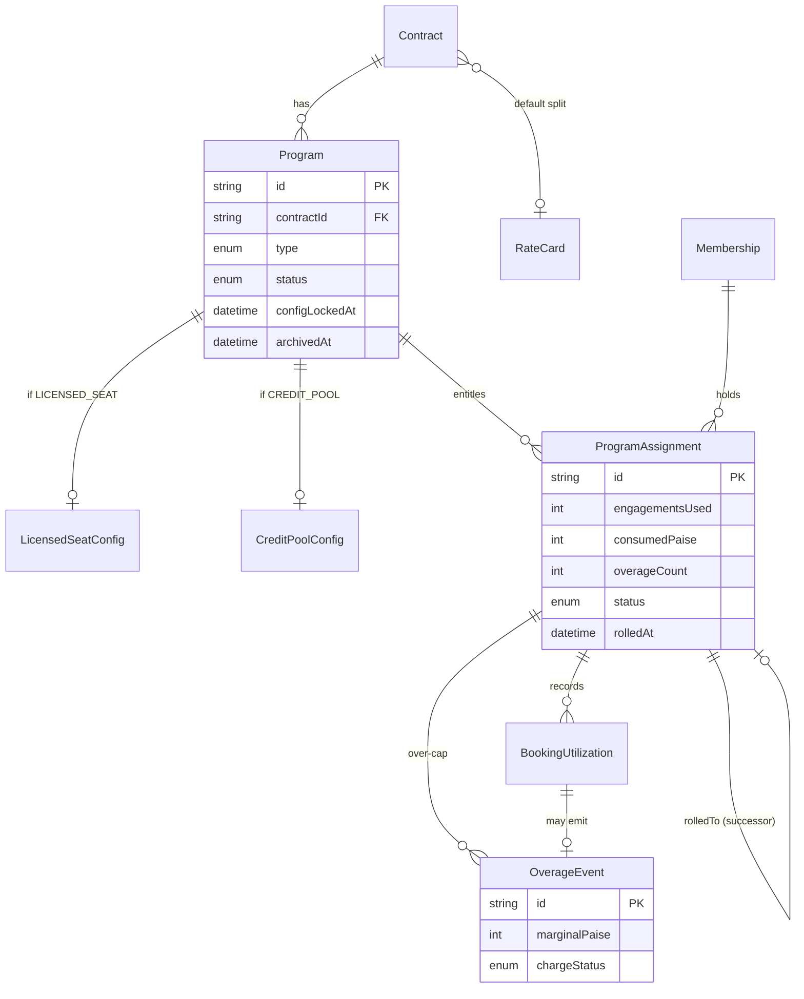
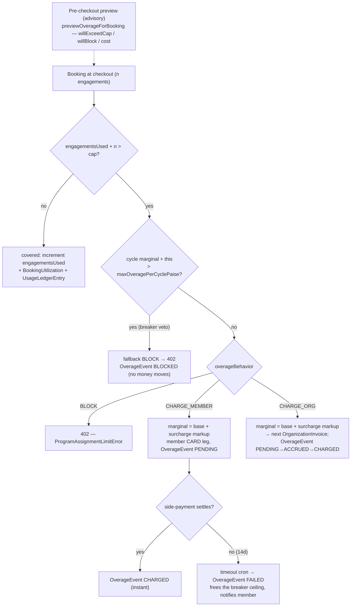
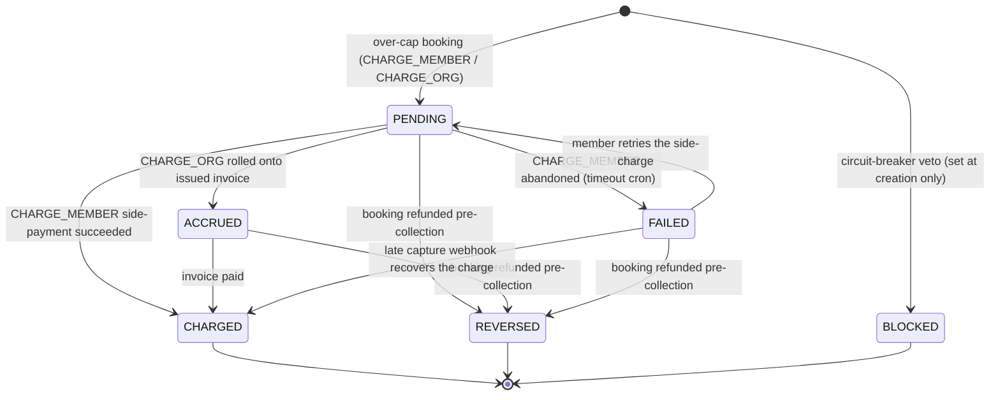

# Programs, assignments, and booking utilization

`Program` is the commercial primitive inside the enterprise layer. Every sponsored booking is attributed to a `ProgramAssignment`, the per-member entitlement row, and every successful booking leaves a `BookingUtilization` row alongside a `UsageLedgerEntry` twin.

The full chain is wired up in code: the schema, the helpers (`recordBookingUtilization`, `claimProgramAssignment`, `reverseBookingUtilization`), the management APIs, and the live checkout path all exist and run. Cap counting is done in engagement units, which the next section explains.

## The programs domain at a glance

Before the field-level detail, the entity-relationship diagram below shows how the six models in this domain relate. A `Program` hangs off one `Contract` and carries exactly one of two sibling config rows (`LicensedSeatConfig` or `CreditPoolConfig`). A member draws against a per-cycle `ProgramAssignment`, each covered booking writes a `BookingUtilization`, and a booking that crosses the cap writes an `OverageEvent`. A `RateCard` supplies the bps split that settlement snapshots onto each utilization.



## Counting model — engagements, not bookings, not slots

The cap on a `LicensedSeatConfig` is denominated in engagements, where one engagement is one `Appointment` row, that is, one calendar occurrence regardless of its duration. Counting this way avoids two failure modes. Counting whole bookings would under-charge multi-session plans, because a 12-call SUBSCRIPTION purchased once at signup would burn a single cap unit and let the remaining eleven escape — the bug that issue #710 fixed. Counting slots, on the other hand, is commercially incoherent, because orgs do not sell "8 slots per cycle", they sell occurrences, and per-occurrence price is governed separately by `priceCapPerEngagementPaise`. The table below shows how each plan type maps onto cap units.

| Plan type             | Cap units consumed                    | Debited at        |
|-----------------------|---------------------------------------|-------------------|
| 30-min CONSULTATION   | 1                                     | checkout          |
| 4-hour CONSULTATION   | 1 (price cap polices the duration)    | checkout          |
| WEBINAR (any length)  | 1                                     | checkout          |
| 8-week CLASS          | 8 (one per class day enrolment)       | checkout          |
| 12-call SUBSCRIPTION  | 1 per consultant allocation (lazy)    | slot allocation   |

The term **engagement** was picked to avoid collision with BetterAuth
`Session` and Stream's `MeetingSession` (which is a video-call record,
not a billing unit).

## Booking → cap → overage



The counter increment + ledger twin are written atomically in one transaction; see [concurrency & idempotency](01-concurrency-and-idempotency.md). `CREDIT_POOL` programs apply the same shape with the cap denominated in credits (1 credit = ₹1) — the meter is `consumedPaise` against `creditBudgetPerCycle × 100`. The pre-checkout preview (`lib/payments/billing/overage-preview.ts`, route `GET /api/organizations/[orgId]/checkout/overage-preview`) is **advisory only** — it reuses the same `computeOverageForBooking` mapper over the assignment's *current* usage so preview and the checkout recorder can't drift, then the authoritative `OverageEvent` is persisted at checkout. The `base`/`surcharge` split lives on the `OverageEvent` (`marginalPaise == basePaise + surchargePaise`); the CHARGE_MEMBER timeout wall (14 days → `FAILED`) is the [timeout cron](01-concurrency-and-idempotency.md).

> 🟡 **Gap (SUBSCRIPTION lazy-debit crosses the cap silently).** SUBSCRIPTION engagements debit at slot-allocation time, and `SlotAllocationService` discards `recordBookingUtilization`'s result — a `wasOverage=true` crossing on a `CHARGE_*` program at allocation never reaches `recordOverageAtCheckout`, so no `OverageEvent`, side-payment, or accrual leg is created while `overageCount` still increments (a silent under-charge; the reconciler's `OVERAGE_COUNT_DRIFT` fires on exactly these rows). Wiring it needs a #715-style design decision first, because follow-on allocations pass `priceAtBookingPaise: 0` and the marginal price basis is undefined on that path. Found in the 2026-06-10 overage architecture audit.

### The `OverageEvent` charge-status machine

An `OverageEvent` carries a `chargeStatus` field of type `OverageChargeStatus`, and this band owns that state machine. The enum has six values — `PENDING`, `ACCRUED`, `CHARGED`, `BLOCKED`, `REVERSED`, and `FAILED` — and every transition is a guarded `updateMany` whose `where` clause names the legal source states (the guard in `lib/payments/billing/overage-transitions.ts`), so an illegal move simply matches zero rows. A `CHARGE_ORG` overage walks `PENDING → ACCRUED → CHARGED` as it rolls onto an invoice that is then paid; a `CHARGE_MEMBER` overage settles `PENDING → CHARGED` when the side-payment succeeds, or `PENDING → FAILED` (with a retry edge back to `PENDING`) when the member abandons it; a circuit-breaker veto is recorded as `BLOCKED` at creation and moves nowhere; and a refunded booking drives the event to `REVERSED` while it is still uncollected. `CHARGED` and `REVERSED` are terminal — reversing an already-collected overage needs a real credit note, not a status flip.



### Walkthrough A — Wipro's licensed seats hit the cap (CHARGE_ORG)

The seeded Wipro program (`Wipro Engineer Leadership`, `LICENSED_SEAT`,
`coveredEngagementsPerCycle = 12`, `overageBehavior = CHARGE_ORG`,
`priceCapPerEngagementPaise = ₹10,000`, no surcharge, ANNUAL) is the canonical
"flat-fee with a safety valve" shape. Follow one learner's assignment across the
cap boundary (the seed starts learner #0 at `engagementsUsed = 3`; here we walk
the same row up to the edge):

| Booking | `engagementsUsed` before | Price | Outcome | What gets written |
|---|---|---|---|---|
| 12th covered engagement | 11 | ₹8,000 | covered (last free seat) | `engagementsUsed → 12`, `BookingUtilization` + `UsageLedgerEntry`, no `OverageEvent` |
| 13th (1st overage) | 12 | ₹12,000 | **CHARGE_ORG** | `engagementsUsed → 13`, `overageCount → 1`, `OverageEvent` |

The 13th is the interesting one. `remainingSeats = max(0, 12 − 12) = 0`, so the
whole booking is over-cap. The pass-through marginal would be the real ₹12,000,
but `priceCapPerEngagementPaise` caps what the program will absorb per overage
engagement at ₹10,000 — so `basePaise = min(₹12,000, 1 × ₹10,000) = ₹10,000`,
`surchargePaise = 0` (no bps set), `marginalPaise = ₹10,000`,
`coveredPaise = ₹2,000`. Because Wipro routes `CHARGE_ORG`, the booking
**proceeds**: an `OverageEvent` (`PENDING`) is stamped and accrues onto the next
`OrganizationInvoice` cycle (`PENDING → ACCRUED → CHARGED`). The learner pays
nothing extra at checkout; their employer's AP sees the ₹10,000 on the invoice.
Had Wipro set `maxOveragePerCyclePaise`, the same 13th booking would instead
fall back to `BLOCK` once the cycle's cumulative `OverageEvent.marginalPaise`
crossed that ceiling — the circuit breaker overrides `CHARGE_ORG`.

### Walkthrough B — IIT Madras drains a credit pool (BLOCK)

IIT's seeded program (`IIT Student Coaching Pool`, `CREDIT_POOL`,
`creditBudgetPerCycle = 10,000` ⇒ `creditBudgetPaise = 10,000 × 100 = ₹10,000/month`,
MONTHLY, `overageBehavior` left at its `@default(BLOCK)`) meters in **paise on
`consumedPaise`**, not engagement count. Same booking helper, different unit:

| Booking | `consumedPaise` before | Price | Remaining budget | Outcome |
|---|---|---|---|---|
| early-month session | ₹0 | ₹3,000 | ₹10,000 | covered → `consumedPaise → ₹3,000` |
| mid-month sessions | ₹7,000 | ₹2,000 | ₹3,000 | covered → `consumedPaise → ₹9,000` |
| over-budget session | ₹9,000 | ₹3,000 | ₹1,000 | **402** — `ProgramAssignmentLimitError` |

On the third booking `remaining = ₹10,000 − ₹9,000 = ₹1,000`, the ₹3,000 price
exceeds it, and because the pool is `BLOCK`, `creditBudgetPerCycle` is a **hard** cap:
the guarded `updateMany WHERE consumedPaise <= budget − price` matches zero rows
and checkout throws a 402 ([the race, drawn](01-concurrency-and-idempotency.md)).
Nothing is half-written — the student picks a cheaper session or waits for the
MONTHLY rollover, which mints a fresh assignment with `consumedPaise = 0` (see
[cycle engine](08-cycle-engine-and-rollover.md)). Flip the same pool to
`CHARGE_ORG` and the ₹2,000 over-budget portion would accrue to the invoice
instead; the `creditBudgetPerCycle` cap becomes *soft*. That single enum value is the
whole difference between "students get cut off at ₹10,000" and "the dean's
office eats the overflow."

## Schema

```prisma
model Program {
  id         String        @id @default(uuid())
  contractId String
  contract   Contract      @relation(fields: [contractId], references: [id], onDelete: Cascade)
  type       ProgramType
  name       String
  status     ProgramStatus @default(ACTIVE)

  coveredPlanTypes  CoveredPlanType[]
  allowedCategories String[]

  licensedSeatConfig LicensedSeatConfig?
  creditPoolConfig   CreditPoolConfig?

  /// #779 §B — persistent money-config lock. Stamped in the tx that creates the
  /// FIRST ProgramAssignment (not at program-create, so a typo on a brand-new
  /// program is still fixable). Non-null ⇒ LOCKED_PROGRAM_FIELDS are read-only.
  configLockedAt DateTime?

  /// #777 §B — archive/soft-delete. Never hard-delete once configLockedAt is
  /// set (financial history rides on it); archivedAt hides from active lists.
  archivedAt DateTime?

  assignments ProgramAssignment[]
  ...
}
```

`ProgramType` is `LICENSED_SEAT | CREDIT_POOL` (the PROJECT/RETAINER subtypes
are not in the enum today). The subtype is declared by `type`, and the
corresponding config row is one of two sibling tables. The pre-Arch-4
`customConfig: Json` escape hatch was removed — bespoke splits live on a
per-Program rate-card override (see
`docs/enterprise/10-money-and-ledger/05-booking-to-earnings.md`) rather than as JSON blobs that the
typed config tables can't enforce. `configLockedAt` and `archivedAt` are the
two #777/#779 lifecycle columns — see [Config lock & archive](#config-lock--archive-)
and [Cycle engine (summary)](#cycle-engine-summary) below.

## `LicensedSeatConfig`

```prisma
model LicensedSeatConfig {
  programId                  String          @id
  program                    Program         @relation(fields: [programId], references: [id], onDelete: Cascade)
  ratePerSeatPaise           Int
  cycle                      BillingCycle
  coveredEngagementsPerCycle Int?
  overageBehavior            OverageBehavior @default(BLOCK)
  activeSeatCount            Int             @default(0)
  priceCapPerEngagementPaise Int?
  /// #775 — bps markup applied to the pass-through overage marginal, after
  /// `priceCapPerEngagementPaise`. Null = no markup (marginal == price).
  overageSurchargeBps        Int?
  /// #768 lockdown #14/#15 — circuit breaker on CHARGE_ORG runaway. Null =
  /// no ceiling. Non-null = cumulative OverageEvent.marginalPaise within
  /// the current cycle cannot exceed this; subsequent bookings fall back
  /// to BLOCK regardless of overageBehavior.
  maxOveragePerCyclePaise    Int?
}
```

- `coveredEngagementsPerCycle = null` is the v1 "unlimited" marker —
  it is the new home for the pre-Arch-4 unlimited billing mode (the
  `LICENSE` funding source). A LICENSE-funded org typically has exactly one
  LICENSED_SEAT Program with this column null.
- `priceCapPerEngagementPaise` limits the grossAmount the program will
  absorb for a single engagement. If a plan price exceeds the cap, the
  excess is treated as overage and routed according to
  `overageBehavior`.
- `overageSurchargeBps` is the only overage **markup** knob (#775): the
  marginal passed through is the real over-cap engagement price plus this
  basis-point markup. Our model passes through the heterogeneous real price
  rather than a flat per-unit tier, so this is the single surcharge lever.
- `maxOveragePerCyclePaise` is the **circuit breaker** (#768): once the
  cycle's cumulative `OverageEvent.marginalPaise` would exceed it, the next
  booking falls back to `BLOCK` regardless of `overageBehavior`. Caps a
  CHARGE_ORG runaway at a known ceiling.
- `activeSeatCount` is the aggregate across non-completed assignments.
  A follow-up cron reconciles drift nightly.

`CreditPoolConfig` carries the same `overageBehavior` / `overageSurchargeBps`
/ `maxOveragePerCyclePaise` trio for parity — the credit-pool cap is
`creditBudgetPerCycle × 100` paise and bookings past it route the same three ways.

## `CreditPoolConfig`

```prisma
model CreditPoolConfig {
  programId               String @id
  cycle                   BillingCycle
  creditBudgetPerCycle         Int                // hard cap (1 credit = ₹1)
  minimumCreditsPerPeriod Int?
}
```

Pool with a per-cycle credit cap. `creditBudgetPerCycle` is the hard cap
when `overageBehavior=BLOCK` (and the soft cap when overage routes
elsewhere). `minimumCreditsPerPeriod` is an optional commitment
minimum that rolls into the next invoice if unconsumed.

**1 credit = ₹1 = 100 paise. Fixed.** The per-credit value + tier
multiplier columns that an earlier draft carried were dropped before
launch — they were never branched in checkout and only added a
translation layer that finance and audit dashboards had to undo at
read time. Per-tier rate adjustments now live on a Program rate-card
override (see `booking-to-earnings`).

A credit debit moves money exactly like any other WALLET booking: the
`BOOKING` `LedgerTransaction` debits the `WALLET(org)` journal account,
and `walletDebit()` decrements the `BillingAccount.walletBalance`
*cache* in the same conditional UPDATE (see
`ledger-and-postings` / `wallet-and-topups`). The
CreditPool Program is the *policy*, not the storage.

## `ProgramAssignment`

```prisma
model ProgramAssignment {
  id           String     @id @default(uuid())
  programId    String
  program      Program    @relation(fields: [programId], references: [id], onDelete: Cascade)
  membershipId String
  membership   Membership @relation(fields: [membershipId], references: [id], onDelete: Cascade)

  periodStart DateTime
  periodEnd   DateTime

  /// Engagements consumed in the current cycle (1 per Appointment).
  engagementsUsed Int @default(0)
  /// #775/#753 — CREDIT_POOL money-meter: paise consumed this cycle (1 credit
  /// = ₹1 = 100 paise). LICENSED_SEAT leaves it 0 (meters by engagement count).
  consumedPaise   Int @default(0)
  overageCount    Int @default(0)

  /// #779 §A — explicit assignment lifecycle (was inferred from periodEnd vs
  /// now). ACTIVE = drawing from cap; ROLLED = cycle advanced, successor minted;
  /// PAUSED = org-suspend cascade froze it; CLOSED = contract expired/terminated;
  /// CANCELLED = member removed mid-cycle. The cycle engine drives the moves.
  status AssignmentStatus @default(ACTIVE)

  /// #779 §A — rollover chain. The cycle engine mints a fresh ACTIVE row for the
  /// next period and points the closing row here (one self-join for history).
  rolledToAssignmentId String?            @unique
  rolledToAssignment   ProgramAssignment? @relation("AssignmentRollover", fields: [rolledToAssignmentId], references: [id], onDelete: SetNull)
  rolledFromAssignment ProgramAssignment? @relation("AssignmentRollover")
  /// #779 §A — set when the cycle engine processed this row (idempotency gate).
  rolledAt DateTime?

  utilizations BookingUtilization[]

  @@unique([programId, membershipId, periodStart])
  @@index([membershipId, periodEnd])
  @@index([status, periodEnd])
}
```

One row per (Program, Membership, cycle). `claimProgramAssignment()`
in `lib/api/organizations/program-helpers.ts` inserts via
`createMany({ skipDuplicates })` (INSERT … ON CONFLICT DO NOTHING) on the
composite unique, which makes the claim idempotent under concurrent bookings
and — unlike a caught `P2002` — doesn't poison the surrounding transaction.
It reports `created` so the caller bumps `activeSeatCount` exactly once.

`engagementsUsed` is incremented atomically by a guarded conditional UPDATE
inside `recordBookingUtilization()` (`updateMany WHERE engagementsUsed <= cap -
delta`, so the cap check and the increment can't race); `consumedPaise` is the
CREDIT_POOL twin (metered against `creditBudgetPerCycle × 100`). A nightly cron
reconciles both against the append-only `UsageLedgerEntry` sums, where the
ledger is the source of truth.

`status` + the `rolledTo…`/`rolledAt` chain are the **cycle-engine** columns —
they replace the pre-#779 "infer live-ness from `periodEnd < now`" pattern that
left zombie assignments. The full state machine, the nightly roll-vs-close
cron, and successor minting live in
[Cycle engine & rollover](08-cycle-engine-and-rollover.md).

## `BookingUtilization`

```prisma
model BookingUtilization {
  id                  String @id @default(uuid())
  programAssignmentId String
  paymentId           String @unique
  engagementsConsumed Int @default(1)
  priceAtBookingPaise Int
  wasOverage          Boolean @default(false)

  // Rate-card snapshot (ties to OrganizationEarnings for settlement).
  platformBpsAtBooking   Int?
  orgBpsAtBooking        Int?
  consultantBpsAtBooking Int?

  // Reversal marker. Row is never deleted.
  reversedAt     DateTime?
  reversalReason String?
  ...
}
```

The rate-card snapshot columns mirror the ones on
`OrganizationEarnings` (see `booking-to-earnings`). Settlement
reconciliation compares these two snapshots to detect drift.

`paymentId` is `@unique` — one row per Payment. For SUBSCRIPTION's
lazy allocation pattern, `recordBookingUtilization()` upserts and
*increments* `engagementsConsumed` on subsequent allocations rather
than inserting a new row. The append-only `UsageLedgerEntry` still
gets one row per call, so `sum(ledger.engagementsConsumed)` per
payment equals the upserted `BookingUtilization.engagementsConsumed`.

### Reversal (refund path)

`reverseBookingUtilization()` stamps `reversedAt = now()` and appends
an opposing `UsageLedgerEntry` with negative `engagementsConsumed`.
The row is never deleted because:

- Partial refunds may run more than once per booking — the original
  row is still needed.
- Point-in-time analytics ("who used seats on 2026-04-10?") must
  still find the row.
- Audit trail needs the original cap decision.

The `engagementsUsed` counter on the parent assignment is decremented
at the same time. **Partial** reversal is supported (#776): callers pass
`engagementsToReverse` to release a fraction (clamped to the unreversed
remainder derived from the negative ledger entries), and `refundRatio`
to reverse `consumedPaise` in proportion to the actual money refunded
(so a 75k refund of a 2×100k booking reverses 75k of price even though it
releases one whole seat). `reversedAt` is stamped only when the cumulative
reversal fully exhausts the original consumption; the linked `OverageEvent`
is transitioned to `REVERSED` only on that final exhaustion, and only while
it's still uncollected (an already-`CHARGED` overage needs a real refund /
credit note, not a silent status flip).

## `OverageBehavior`

The `overageBehavior` enum on a config row decides what happens when a LICENSED_SEAT assignment exceeds its cap, as the table below sets out.

| Value           | When a LICENSED_SEAT assignment exceeds cap                |
|-----------------|------------------------------------------------------------|
| `BLOCK`         | Checkout throws `ProgramAssignmentLimitError` → HTTP 402. |
| `CHARGE_MEMBER` | Booking proceeds. Learner pays the overage on their own card. `wasOverage = true`. |
| `CHARGE_ORG`    | Booking proceeds. Overage is attributed to the next `OrganizationInvoice` cycle. |

## Config lock & archive 🔒

A program's **money config locks the moment anything rides on it** (#779 §B).
`Program.configLockedAt` is stamped in the transaction that creates the *first*
`ProgramAssignment` (not at program-create — a typo on a brand-new program is
still fixable). Non-null ⇒ the `LOCKED_PROGRAM_FIELDS` (`type`,
`coveredPlanTypes`, `ratePerSeatPaise`, `coveredEngagementsPerCycle`,
`creditBudgetPerCycle`, `overageBehavior`, `overageSurchargeBps`,
`priceCapPerEngagementPaise`, `maxOveragePerCyclePaise`) are read-only. A
money-field PATCH on a locked program returns `409 PROGRAM_CONFIG_LOCKED` —
only `name` / `status` / `allowedCategories` stay editable. The predicate lives
in `lib/enterprise/config-lock.ts`; `configLockedAt` is authoritative, with a
belt-and-braces derived count (`assignments|bookings|overageEvents > 0`) as a
fallback. The `GET` route returns a `locked` boolean so the edit dialog can
disable the locked inputs without a second round-trip. There is **no
"applies-next-cycle" pending config** — changing money terms = archive this
program + create a new one (mirrors the RateCard bump / contract supersession
immutable pattern).

`Program.archivedAt` is the soft-delete: once `configLockedAt` is set the
program is never hard-deleted (financial history rides on it); `archivedAt`
hides it from active lists and the cycle engine **skips** archived programs.
Because a skipped program would zombie its live allocations, the archive PATCH
refuses while any `ACTIVE` in-window assignment exists
(`409 PROGRAM_HAS_ACTIVE_ASSIGNMENTS`) — cancel them or let the cycle end
first. `DELETE` stays DRAFT-only (no assignments, no historical utilization).

## Cycle engine (summary)

`ProgramAssignment` is per-cycle: `status` (`AssignmentStatus`) plus the
`rolledToAssignmentId`/`rolledAt` chain make liveness explicit instead of
inferred from `periodEnd`. A nightly cron rolls each ended ACTIVE period into a
fresh successor (counters zeroed) while its contract is ACTIVE + auto-renewing
+ the successor fits the term, otherwise it closes the assignment. This is the
mechanism that kills zombie assignments (#779 §A/§B). The state machine,
roll-vs-close decision table, successor minting, and the PAUSED/CANCELLED paths
are documented in full in
[Cycle engine & rollover](08-cycle-engine-and-rollover.md); the contract states
it reads are in [Contract lifecycle](07-contract-lifecycle.md).

## API surface

The program and assignment CRUD routes and their role gates are listed below.

| Route | Verbs | Role |
|-------|-------|------|
| `/api/organizations/[orgId]/programs` | `GET` | any active member |
| `/api/organizations/[orgId]/programs` | `POST` | MAINTAINER |
| `/api/organizations/[orgId]/programs/[programId]` | `GET` | any active member |
| `/api/organizations/[orgId]/programs/[programId]` | `PATCH`, `DELETE` | MAINTAINER |
| `/api/organizations/[orgId]/programs/[programId]/assignments` | `GET` | any active member |
| `/api/organizations/[orgId]/programs/[programId]/assignments` | `POST` | MAINTAINER |
| `/api/organizations/[orgId]/programs/[programId]/assignments/[assignmentId]` | `GET` | any active member |
| `/api/organizations/[orgId]/programs/[programId]/assignments/[assignmentId]` | `PATCH`, `DELETE` | MAINTAINER |
| `/api/organizations/[orgId]/programs/[programId]/auto-enroll` | `POST` | MAINTAINER + canSponsor |

The POST body is a Zod `discriminatedUnion("type", [...])` so a
`LICENSED_SEAT` body with `creditPoolConfig` fails validation at the
edge, not at the FK layer. See
`app/api/organizations/[orgId]/programs/route.ts`. The assignment `PATCH`
also accepts `{ cancel: true }` — early-cancel an allocation without removing
the member (claims an `ACTIVE` row → `CANCELLED`, clamps `periodEnd`, frees the
seat); see [cycle engine](08-cycle-engine-and-rollover.md).

### Bulk auto-enrollment (#1230 wave-9)

`POST .../auto-enroll` provisions a whole cohort in one call: body is
`{ membershipIds: string[] (1..200), periodStart, periodEnd }`. Per-entry
Serializable transactions reuse the exact single-assign composition —
`claimProgramAssignment` → seat bump on genuine create → first-write
`configLockedAt` stamp → `PROGRAM_ASSIGNED` audit row — so concurrent batches
cannot double-count seats. Only ACTIVE memberships are enrollable; PENDING /
SUSPENDED rows fail per-row without aborting the batch.

Idempotency rides the caller-supplied period: re-running the SAME body is a
no-op (every row reports `created=false`, counted as `skipped`, no seat
bump), because the `@@unique(programId, membershipId, periodStart)` key is
stable. Periods are deliberately never server-derived from "now" — a derived
start would change the idempotency key across retries and silently duplicate
coverage windows. Rate limit: 10/hour per org (`rl:org-auto-enroll`).

## Related docs

- `funding-and-programs` — funding × program matrix.
- `booking-to-earnings` — where the bps snapshots feed.
- `concurrency-and-idempotency` — claim pattern + cycle-engine idempotency anchors.
- `ledger-and-postings` — UsageLedgerEntry invariants.
- [`contract-lifecycle`](07-contract-lifecycle.md) — the contract a program hangs off.
- [`cycle-engine-and-rollover`](08-cycle-engine-and-rollover.md) — assignment lifecycle + rollover.
