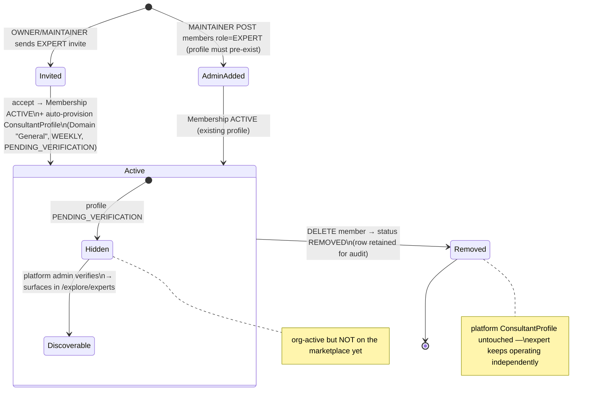
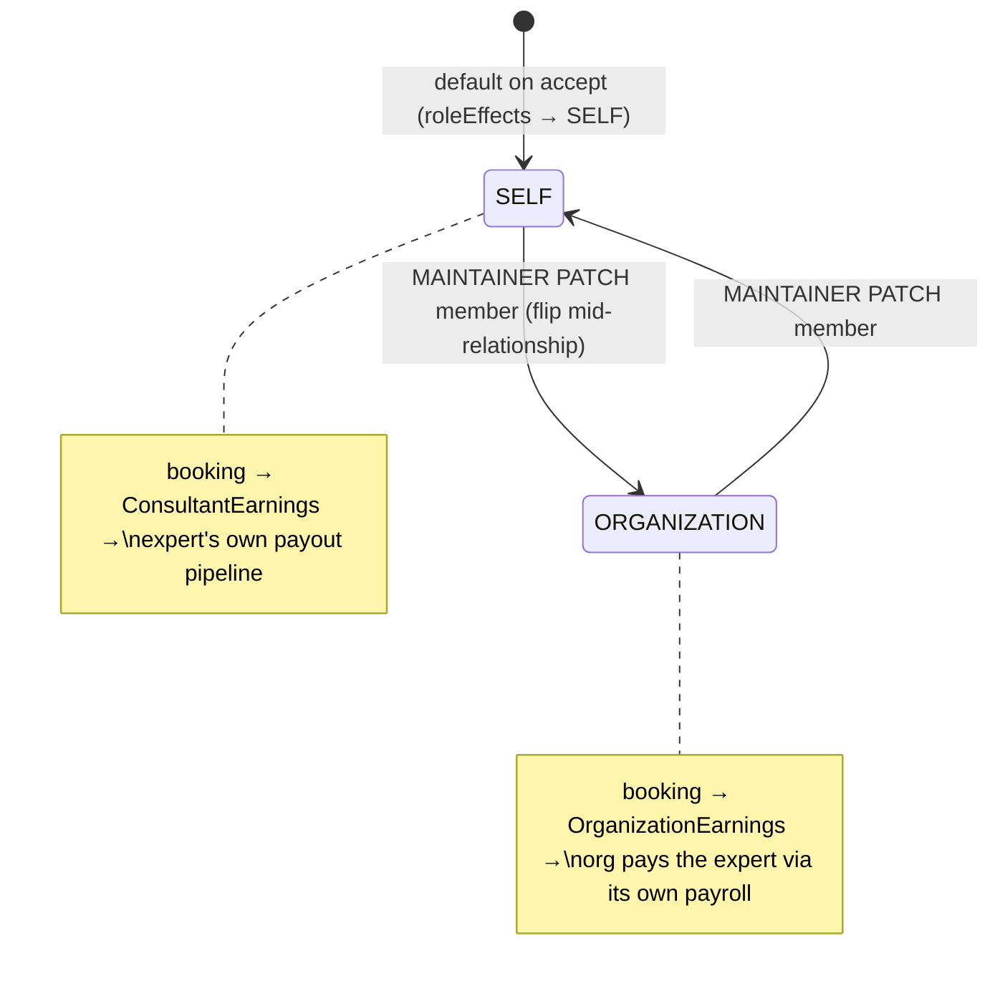

# Expert lifecycle

EXPERT is the `MemberRole` value for anyone who delivers services on
behalf of an org (`canHost=true`). It replaces the pre-Arch-4 term
"Consultant" in the org-side vocabulary. The underlying
`ConsultantProfile` model is unchanged — the rename lives in the org
layer so logs and UI don't have to disambiguate platform consultants
from org experts.

## Prerequisites

An expert can only join an org whose `canHost = true`. The API
refuses EXPERT membership on sponsor-only orgs at
`POST /api/organizations/[orgId]/members` — the body's `role = EXPERT`
is rejected when the organization's capability booleans don't support
hosting.

Each expert still owns a personal `ConsultantProfile` on the platform.
The `Membership.consultantProfileId` foreign key links to that
profile, so the org side can read the expert's domain, reviews, and
availability without duplicating data.

## How experts join an org

EXPERT and LEARNER are **disjoint roles** — a member cannot flip between
them on the same Membership (see `lib/enterprise/role-transitions.ts`).
That boundary removed the in-org "apply to deliver" workflow that used
to live on `Membership.applicationNote / appliedAt / approvedAt /
approvedBy`; those columns were dropped in
`prisma/migrations/20260420100000_drop_membership_application_fields`.

Today there are two entry points to EXPERT membership:

1. **Invitation** — an OWNER/MAINTAINER sends an EXPERT invite; on
   acceptance (`app/api/organizations/invitations/accept/route.ts`) the
   server creates a `Membership` row with `status = ACTIVE`, and
   auto-provisions a `ConsultantProfile` (placeholder `Domain "General"`,
   `scheduleType = WEEKLY`, `verificationStatus = PENDING_VERIFICATION`)
   if the user doesn't already have one. The org EXPERT completes
   their real domain + schedule selection from the consultant profile
   editor, and platform verification still gates their visibility in
   `/explore/experts`.
2. **Direct admin add** — a MAINTAINER posts to
   `POST /api/organizations/[orgId]/members` with `role = EXPERT`. This
   path requires the target user to already have a `ConsultantProfile`.

If the product decides later to bring back an in-org application queue,
build it around a dedicated model (e.g. `ExpertApplication`) rather than
re-adding fields to `Membership` — keeping join state separate from
membership state avoids the LEARNER↔EXPERT ambiguity this refactor
fixed.

## The expert journey, end to end

Two facts trip up new readers: there is **no org-side "approve" step** (the
membership is `ACTIVE` the instant the invite is accepted), and the review that
*does* gate visibility is **platform** verification of the underlying
`ConsultantProfile`, not anything the org does. So the journey has two
independent axes — org membership status, and platform verification status —
plus the settlement fork that decides whose books an earning lands on:





The fork is read **at booking time** and snapshotted onto that booking's
earnings, so flipping `payoutRecipient` later never rewrites money already
settled — `SELF` and `ORGANIZATION` are per-org on the `Membership`, which is
exactly why a freelancer can earn independently at one org while being salaried
at another (e.g. Arjun, the solo consultant, takes `SELF` at his own org but
joins IIT Madras as an external-panel EXPERT also on `SELF`, whereas IIT's
internal professors are seeded `ORGANIZATION`).

> **Design note — why org accept is not an approval gate.** Folding "platform
> verification" into the org's accept step was rejected: an org admin can't
> vouch for KYC/identity the platform is liable for, and making the org wait on
> platform review would block the expert from completing their own profile +
> schedule. Splitting the axes lets the expert be productive inside the org
> (visible to managers, assignable) the moment they accept, while the
> marketplace stays gated on the verification the platform actually owns.

## `PayoutRecipient`

Every EXPERT membership carries `payoutRecipient: PayoutRecipient`:

```prisma
enum PayoutRecipient {
  SELF          // default marketplace case — expert keeps their share
  ORGANIZATION  // internal/salaried expert — org captures the share
}
```

The column is stored on `Membership`, not on the `ConsultantProfile`,
because the same expert can belong to two orgs with different
arrangements (a freelancer earning independently at one org and
salaried at another).

Settlement reads `payoutRecipient` at booking time:

- `SELF` — the expert's share lands in `ConsultantEarnings` and flows
  to the expert's own payout pipeline.
- `ORGANIZATION` — the expert's share is added to `OrganizationEarnings`
  and disappears from the expert's books for that booking. The org's
  `OrganizationPayout` cycle pays the expert separately through its
  own payroll.

`payoutRecipient` defaults to `SELF` when a Membership is created. The accept
handler and the direct-add path both stamp it from
`applyMembershipRoleEffects` (`lib/api/organizations/membership-transitions.ts`),
which returns `SELF` for every role today. An operator then flips it to
`ORGANIZATION` for an internal expert via `PATCH …/members/[memberId]`
(MAINTAINER-editable; a role change resets it back to the `SELF` default).
Flipping it mid-cycle does not retroactively rewrite already-booked earnings,
because those carry the bps snapshot and their own recipient decision.

## Rate-card overrides

`Membership.rateCardOverrideId` points at an optional per-expert
`RateCard`. When present, the rate-card resolver uses it at position 1
in the override chain (see `booking-to-earnings`). Use cases:

- A star expert negotiates a 90/10 split instead of the default 80/20.
- An internal expert with `payoutRecipient = ORGANIZATION` gets a
  platform-only card (100 bps platform, 9900 bps org, 0 bps expert)
  so the split math still validates.

## Removal

`DELETE /api/organizations/[orgId]/members/[memberId]` sets
`status = REMOVED` and emits `MEMBER_REMOVED`. The `Membership` row is
retained — it back-references earnings (via
`OrganizationEarnings.orgPayoutId` chains to the expert's bookings) and
deleting it would orphan the audit trail.

An EXPERT's platform `ConsultantProfile` is untouched by org removal.
They continue to operate as an independent marketplace expert.

## `isIndependent` flag on `ConsultantProfile`

`ConsultantProfile.isIndependent: Boolean @default(true)` denotes that
a profile has no active EXPERT membership. Maintained by the membership
write path — when an expert's first ACTIVE membership lands, the flag
flips to false; when the last one is removed, it flips back to true.

The explore surface reads this flag to decide whether to render the
"hosted by <org>" badge on an expert card.

## Promoting a learner to expert (or vice versa)

Not supported on the same Membership row — the transition is blocked
at the API (`409 ROLE_TRANSITION_BLOCKED`, see
`lib/enterprise/role-transitions.ts`). The correct recipe is:

1. `DELETE /api/organizations/[orgId]/members/[memberId]` on the
   existing row (sets `status = REMOVED`, retains the row for audit).
2. `POST /api/organizations/[orgId]/invitations` with the new role.
3. The user accepts the invite. A fresh Membership lands with the
   right profile FKs — `ConsulteeProfile` for LEARNER or a
   placeholder `ConsultantProfile` for EXPERT. Audit rows show the
   removal and the new member cleanly, rather than a single
   `ROLE_CHANGE` hiding the profile-swap.

See `roles-and-permissions` for the policy and its UX copy.

## Related docs

- `booking-to-earnings` — rate-card resolution and the
  `payoutRecipient` fork.
- `roles-and-permissions` — where EXPERT sits on the rank ladder
  and the LEARNER ↔ EXPERT disjoint rule.
- `payout-pipeline` — how EXPERT earnings reconcile.
- `public-pages-and-discovery` — how the explore surface surfaces
  org-hosted experts.
