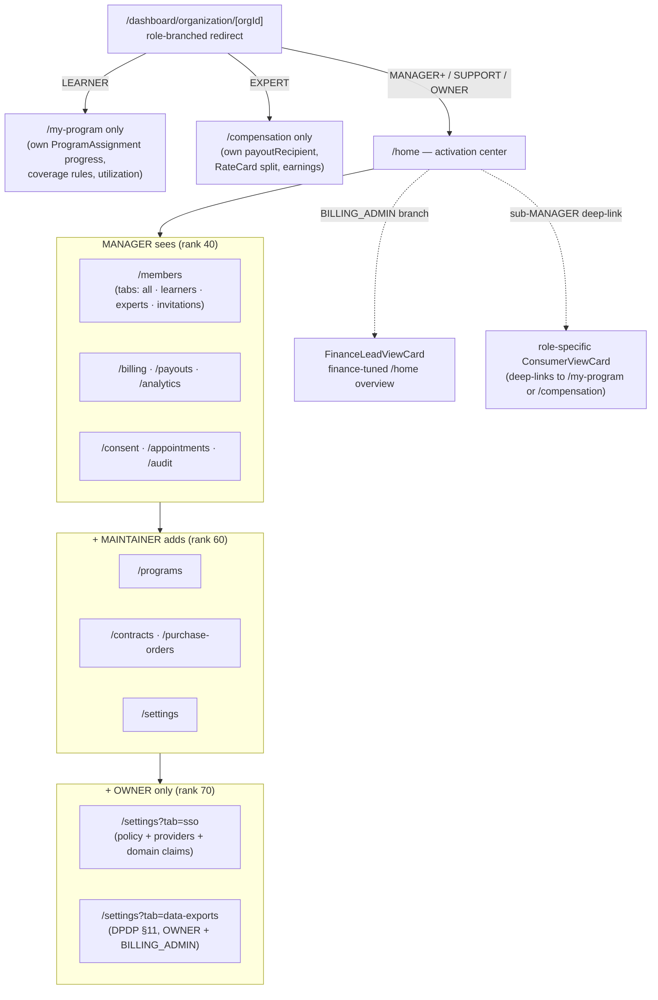

# Dashboard pages

Every organization-scoped dashboard page lives under
`app/dashboard/organization/[orgId]/**`. Roles are gated server-side
via `requireOrgAccess` at the API layer; the pages themselves do a
thin `requireOrgAccess` check plus role-driven conditional rendering.

## Page tree

The list below is the actual `page.tsx` set under
`app/dashboard/organization/[orgId]/` (verified 2026-07-26, after the navigation consolidation — see [ADR 19](../70-design-decisions/19-personal-vs-org-dashboard-split.md)).

```
/dashboard/organization                        → server-redirect (see § below):
                                                  OrgWorkspace → /dashboard/org-workspace/
                                                  <id>/home; everyone else → /dashboard
/dashboard/organization/create                 → org-creation wizard
/dashboard/organization/[orgId]                → role-aware redirect:
                                                  MANAGER+ / OWNER / SUPPORT → /home;
                                                  LEARNER → /my-program;
                                                  EXPERT  → /compensation;
                                                  no membership → personal
                                                  dashboard via
                                                  resolvePersonalDashboardHref
/dashboard/organization/[orgId]/home           → state-aware activation center
                                                  (action banners + Getting-Started
                                                  checklist + stat grid). BILLING_ADMIN
                                                  sees the finance overview; sub-MANAGER
                                                  deep-links see a role-specific
                                                  consumer card. See "/home" below.
/dashboard/organization/[orgId]/my-program     → LEARNER's per-org allocation:
                                                  ProgramAssignment progress,
                                                  coverage rules, utilization
                                                  history. canSponsor only.
/dashboard/organization/[orgId]/compensation   → EXPERT's per-org payout view:
                                                  Membership.payoutRecipient,
                                                  RateCard split, recent earnings
                                                  on org-tagged payments. canHost
                                                  only.
/dashboard/organization/[orgId]/appointments   → the member's own org sessions,
                                                  plus the org-wide operations
                                                  feed under ?scope=everyone.
                                                  See "Appointments scopes" below.
/dashboard/organization/[orgId]/members        → unified Membership list, with
                                                  ?tab=learners | experts |
                                                  invitations. See "Members tabs".
/dashboard/organization/[orgId]/collaborations → collaborators on THIS org's
                                                  hosted webinar/class plans
                                                  (#1025). Split by the PLAN's
                                                  org-ness: B2C-plan
                                                  collaborators stay on the
                                                  personal consultant dashboard.
                                                  canHost only.
/dashboard/organization/[orgId]/contracts      → contracts + linked programs;
                                                  term-edit drawer (locked vs editable)
/dashboard/organization/[orgId]/catalog        → org-OWNED webinar + class
                                                  plans; expert picker +
                                                  visibility; archive/restore
                                                  (never deletes). canHost only.
/dashboard/organization/[orgId]/programs       → programs + assignments;
                                                  config-lock-aware edit dialog
/dashboard/organization/[orgId]/purchase-orders → PO list + 3-way match view
/dashboard/organization/[orgId]/billing        → BillingAccount + WalletTab +
                                                  invoices (single surface; see below)
/dashboard/organization/[orgId]/reimbursements → PERSONAL-funded reimbursement
                                                  report (#714)
/dashboard/organization/[orgId]/payouts        → OrganizationPayout list + TDS
                                                  summary (host-side only)
/dashboard/organization/[orgId]/analytics      → rollups (bookings, revenue,
                                                  earnings, wallet burn-down)
/dashboard/organization/[orgId]/documents      → documents uploaded against
                                                  this org's appointments, with
                                                  each review's outcome
/dashboard/organization/[orgId]/recordings     → session recordings for events
                                                  run under this org
/dashboard/organization/[orgId]/disputes       → payment-dispute tracker
/dashboard/organization/[orgId]/reimbursements → (see above)
/dashboard/organization/[orgId]/audit          → per-org OrgAuditLog (rich filters)
/dashboard/organization/[orgId]/consent        → ConsentArtifact roster + DPDP
                                                  withdraw/grant (DPDP §6(4))
/dashboard/organization/[orgId]/settings       → branding + policy, with
                                                  ?tab=sso | webhooks | scim |
                                                  data-exports
```

### Surfaces that are tabs, not routes

The sidebar carried 28 entries at its peak, several of which were a filter or
a single read-only table rather than a destination. Those became tabs on the
page that already owned the object. Every tab is addressable as
`?tab=<value>`, so a link into a specific panel still works.

Documents and Recordings were briefly folded together this way too, under a
"Resources" page. They were split back out: a sidebar group labelled
Resources holding one item also called Resources is redundant nesting, and
the two lists answer different questions — a review queue versus an archive.
Consolidation is worth doing when it removes a duplicate, not when it just
adds a level.

| Page | Tabs | Why they merged |
|---|---|---|
| `/members` | `all`, `learners`, `experts`, `invitations` | `learners` and `experts` were `?role=` queries against the same `/api/organizations/[orgId]/members` endpoint the roster already read. `learners` was additionally capped at `perPage=100` with no pagination. |
| `/settings` | `general`, `sso`, `webhooks`, `scim`, `data-exports` | SSO had no sidebar entry at all and was reachable only from a link inside the settings page. |
| `/billing` | `invoices`, `wallet` | Unchanged — this one predates the consolidation. |

Tabs are gated individually on the same `OrgSurface` keys the sidebar uses, so
a role that cannot reach a surface does not get a trigger for it.

### Appointments scopes

`/appointments` replaced a pair of adjacent sidebar entries — `Appointments`
and `My Appointments` — that shared a noun, differed only in scope, and were
both visible to an OWNER.

| Scope | Query | Data source | Who sees it |
|---|---|---|---|
| `mine` (default) | `?scope=mine` | `getOrgMemberAppointments` | any ACTIVE member — a pure LEARNER has to be able to see their own sessions |
| `everyone` | `?scope=everyone` | `getOrgAppointments` | `operations.read` only |

A viewer without `operations.read` never sees the toggle, so the page cannot
offer a control that would 403. A non-operator who hand-edits the URL to
`?scope=everyone` is quietly served their own sessions rather than an error.
The `mine` scope mounts a video-only `StreamProvider` around its subtree so
Join works without connecting video on every org route.

There is **no `/credits` route** — the wallet view is a tab inside `/billing`
(see "Billing surface" below). The old `/plans` org-catalog page was removed in
the legacy-stub cleanup; discovery now reads the per-type plans' visibility (see
[public pages & discovery](05-public-pages-and-discovery.md)).

A few additional surfaces are not in the org-scoped tree:

- `/organizations/invite/[token]` — invite-accept landing
  (`app/organizations/invite/[token]/page.tsx`).
- `/dashboard/org-workspace/[orgWorkspaceId]/**` — **the cross-org portfolio**,
  titled "All organizations" in the UI. Keyed on `OrgWorkspaceProfile.id`. Has
  its own sidebar (mirrors /dashboard/admin and /dashboard/staff) with four
  pages. Its labels were deliberately renamed away from `Billing` and
  `Settings`: both collided head-on with the per-org dashboard's entries of the
  same name, and an operator moving between the two layers had no way to tell
  which one they were looking at.
    - `/home` — "Overview". Cross-org stats row + grid of orgs you OWN + "+ New
      organization" CTA. Replaces the old `/dashboard/organization`
      switcher list (which now 308-redirects here for OrgWorkspaces).
    - `/activity` — cross-org audit feed aggregating `OrgAuditLog` rows
      across all owned orgs. Cursor-paginated. Distinct from per-org
      `/audit` which scopes to one org and supports rich filters.
    - `/billing` — labelled **"Spend"**. Cross-org outstanding invoices +
      wallet balance roll-up. Distinct from per-org `/billing`, which mutates
      one org's wallet and invoices. Read-only.
    - `/settings` — labelled **"Workspace settings"**. Default landing org,
      locale and currency, notification routing. All three sections persist
      through `PATCH /api/org-workspace/[orgWorkspaceId]/settings`; the
      "storage deferred to v1.1" note this doc previously carried is stale.
      These are workspace-level preferences with no per-org equivalent, which
      is why the page stayed rather than folding into per-org settings.
    - The bare `/dashboard/org-workspace/[orgWorkspaceId]` URL redirects to
      `/home`. It previously 404'd.
    - `/create` — same `<CreateOrganizationWizard />` as
      `/dashboard/organization/create`, but inside this dashboard's
      chrome (operators creating their 2nd, 3rd, … org never leave the
      chrome). Both entry points redirect to
      `/dashboard/organization/<newOrgId>/home` on success.
- `/dashboard/admin/**` — the platform admin surface that can verify,
  suspend, or deactivate any org. Lives outside this doc set.

The bare `/dashboard/organization` URL is now a server-redirect:
OrgWorkspace → `/dashboard/org-workspace/<id>/home`; non-OrgWorkspace → `/dashboard`.
The org grid that used to live there is gone — non-OrgWorkspace members
(LEARNER, EXPERT) navigate between orgs via the OrganizationSwitcher
dropdown in the top bar, which never required a list page.

## Role-visibility nav-map

The same `[orgId]` URL lands four different humans on four different surfaces.
`[orgId]/page.tsx` does the role-branched redirect (consumers to their personal
view, operators to `/home`); from there the sidebar shows only what that role's
gate would let through. This is the mental model a new reader needs before the
exhaustive matrix below — *who sees what*, not *which constant enforces it*:



Two nuances the table compresses. First, role access is no longer expressed
as a cumulative rank floor: since the 2026-07 remediation, every surface is
granted through the **permission matrix** in `lib/auth/org-permissions.ts`,
which the sidebar, the page guards, and the API routes all consume — so the
"Roles" column below names a matrix surface and lists exactly which roles it
admits. Second, the boxes are *also* capability-gated — a `canHost=false`
org hides the Experts tab, `/payouts` and `/catalog` even from an OWNER, and a
`canSponsor=false` org hides `/programs`, `/contracts`, `/billing`, and
`/purchase-orders`.

## Visibility by capability

Visibility here is the **capability** gate only. Every tab is **also**
role-gated through the matrix surface named in the "Roles" column, which the
page enforces via `useRequireOrgAccess({ permission })` and the API enforces
via `requireOrgAccess(orgId, { permission })`. The matrix definition in
`lib/auth/org-permissions.ts` is the single source of truth; this table is a
readable projection of it.

| Page           | SPONSOR | HOST | HYBRID | Roles (matrix surface) | In sidebar? | Notes |
|----------------|---------|------|--------|-----------|-------------|-------|
| `/home`        | ✅      | ✅   | ✅     | any active member | yes | Renders the operator stat grid when `operations.read` passes; role-branched ConsumerViewCard otherwise. |
| `/my-program`  | ✅      | —    | ✅     | `myProgram.read` (LEARNER; page filters server-side to caller's assignments) | yes (LEARNER + canSponsor only) | Per-cycle ProgramAssignment progress, coverage rules, utilization history. 404 on canSponsor=false. |
| `/compensation` | —    | ✅   | ✅     | `myArrangement.read` (EXPERT; page filters to caller's earnings) | yes (EXPERT + canHost only) | Membership.payoutRecipient, default RateCard split, recent earnings on org-tagged payments. 404 on canHost=false. |
| `/members`     | ✅      | ✅   | ✅     | `members.read` (OWNER, MAINTAINER, MANAGER, SUPPORT) | yes | BILLING_ADMIN is operator-blind and excluded at sidebar, page, and API. |
| `/members?tab=experts` | — | ✅ | ✅ | `experts.read` (OWNER, MAINTAINER, MANAGER) | tab (if `canHost`) | Tab on Members. Hidden when `canHost = false`. |
| `/members?tab=learners` | ✅ | — | ✅ | `learners.read` (OWNER, MAINTAINER, MANAGER) | tab (if `canSponsor`) | Tab on Members. Hidden when `canSponsor = false`. |
| `/members?tab=invitations` | ✅ | ✅ | ✅ | `invitations.manage` (OWNER, MAINTAINER) | tab | Tab on Members. Send-invite button disabled pre-verification; uses `humanizeOrgError` for `ORG_NOT_VERIFIED`. |
| `/catalog`     | —       | ✅   | ✅     | `catalog.manage` (OWNER, MAINTAINER, MANAGER) | yes (if `canHost`) | The offerings the org OWNS, distinct from the sponsorship entitlements on `/programs`. Webinar and Class only — `ConsultationPlan` and `SubscriptionPlan` require a `consultantProfileId`, so an org can never solely own one. The named deliverer is re-checked server-side against an ACTIVE EXPERT membership. |
| `/programs`    | ✅      | —    | ✅     | `programs.manage` (OWNER, MAINTAINER) | yes (if `canSponsor`) | The learner-facing catalog GETs stay open to any active member by design. |
| `/billing`     | ✅      | —    | ✅     | `billing.read` (OWNER, MAINTAINER, BILLING_ADMIN, MANAGER); mutations `billing.manage` (OWNER, BILLING_ADMIN) | yes (if `canSponsor`) | BillingAccount summary + wallet (`WalletTab`) + invoices — one unified surface. The former extra `fundingSource=WALLET` sidebar branch was removed as unreachable (a BillingAccount only exists when `canSponsor=true`). |
| `/payouts`     | —       | ✅   | ✅     | `payouts.read`; mutations `payouts.manage` (OWNER, BILLING_ADMIN) | yes (if `canHost`) | Host-side only. |
| `/analytics`   | ✅      | ✅   | ✅     | `operations.read` (OWNER, MAINTAINER, MANAGER, SUPPORT) | yes | Rollups respect capability — host-side numbers hidden when `canHost = false` and vice versa. SUPPORT reads for L1/L2 investigation. |
| `/settings`    | ✅      | ✅   | ✅     | `settings.manage` (OWNER, MAINTAINER) | yes | Branding + policy. |
| `/settings?tab=sso` | ✅ | ✅ | ✅ | **OWNER** (rank floor — genuine hierarchy) | tab | Tab on Settings. Previously had no sidebar entry at all and was reachable only from a link inside the settings page. |
| `/contracts`   | ✅      | —    | ✅     | `contracts.read` (OWNER, MAINTAINER); mutations `contracts.manage` (OWNER) | yes under `canSponsor` + `contracts.read` | The old `≥MAINTAINER ‖ finance` sidebar expression showed a dead tab to MANAGER and BILLING_ADMIN; the matrix entry ended that drift. |
| `/purchase-orders` | ✅  | —    | ✅     | `purchaseOrders.read` (OWNER, MAINTAINER, BILLING_ADMIN, MANAGER); mutations `purchaseOrders.manage` (OWNER, BILLING_ADMIN) | yes under `canSponsor && requiresPO` | Receipt icon. |
| `/consent`     | ✅      | ✅   | ✅     | `consent.read` / `consent.manage` (OWNER, MAINTAINER, MANAGER) | yes | ShieldCheck icon; DPDP artifact roster. BILLING_ADMIN's former page-guard reach was closed to match the sidebar. |

> The `/plans` page (previous "org catalog" over the removed
> `OrganizationPlan` model) is gone. Discovery now reads each per-type
> plan's `OrgPlanVisibility` directly — see
> [public pages & discovery](05-public-pages-and-discovery.md). The
> operations surfaces (`/appointments`, `/documents`, `/recordings`)
> all share the single `operations.read`
> grant (OWNER, MAINTAINER, MANAGER, SUPPORT) at sidebar, page, and API;
> `/reimbursements` uses `reimbursements.read` plus the
> `fundingSource=PERSONAL` structural gate; `/audit` uses `audit.read`
> (OWNER, MAINTAINER, SUPPORT) with the CSV export kept at a MAINTAINER
> rank floor because bulk export is a governance action; and the
> the `/settings` integration tabs (`webhooks`, `scim`, `data-exports`)
> use `integrations.read` (the finance set).

### Billing surface

`/billing` is the **single** BillingAccount surface (invoices + payment terms +
pending charges); the wallet view is a tab (`billing/WalletTab.tsx`), not a
separate page. **There is no `/credits` route** — the old `/credits` alias was
collapsed, so the prior "two-page split" TODO is resolved: one URL, one route
guard, a `WalletTab` for WALLET-funded orgs. The NET-60 StatCard is conditional
on `fundingSource !== "WALLET"`.

## `/home` — the state-aware activation center

`/home` is not a static dashboard; it renders the org's **real next actions**
from one derived model. `home/page.tsx` is a thin server shell that renders
`HomePageClient`, which fetches `GET …/analytics` (+ `…/activity`), maps the
payload → an `OrgActivationSnapshot`, and runs two **pure** derivations from
`lib/enterprise/org-activation.ts`:

- **`deriveActionCenter(snapshot, orgId)`** → severity-ordered banners
  (`critical` / `warning` / `info`) for conditions that need action *now*:
  pending verification, suspended, overdue invoices, credit-pool cap ≥ 80%,
  contract expiring within 30 days, pending overages, **stuck payouts**, low
  wallet (< ₹1,000 `WALLET_LOW_BALANCE_PAISE`). Only conditions whose backing
  data exists today render — dunning/dispute banners arrive with their crons.
- **`deriveActivationChecklist(snapshot, orgId)`** → the Getting-Started steps,
  capability-aware: a SPONSOR runs verify → KYB(INVOICE) → billing → contract →
  program → invite → assign; a HOST-only org collapses to verify → invite. The
  checklist auto-hides once every applicable step is done.

Branching: `BILLING_ADMIN` gets a finance-tuned overview (`FinanceLeadViewCard`);
a sub-MANAGER who deep-links here sees a role-specific consumer card (deep-link
to `/my-program` or `/compensation`); MANAGER+ gets the operator stat grid +
checklist + activity feed.

> **Honest "pending platform enablement" payout copy.** While
> `ENABLE_LIVE_PAYOUTS=false`, the server counts `PROCESSING` payouts and the
> action center renders *"N payouts pending platform enablement — payout
> disbursement isn't live yet; these are held, not failed."* The flag is read
> **server-side** (in `resolveActivationSignals`); when it's on, the stuck-payout
> count is forced to 0 so the banner disappears. The copy never calls a held
> payout a failure (see [feature flags](06-feature-flags-and-rollout.md)).

The derivations are pure (unit-testable without a DB); the few extra reads the
analytics payload doesn't carry (`hasContract`, expiring-soon count, KYB,
pending-overage sum, stuck-payout count, cap-near %) are done by
`resolveActivationSignals(orgId)`, which the analytics route merges in.

## Program / contract safe-field edit UI (config-lock)

The program and contract edit surfaces are **lock-aware** so an operator can't
even attempt a money-field edit that the server would 409. Both GET routes
return a derived `locked` boolean alongside the row (no second round-trip):

- **Programs** (`programs/page.tsx`): the edit dialog reads `program.locked`
  (`?? true` — fail-safe: lock until known). When locked it disables every money
  input, shows a `LockedHint` ("money config is locked — only the name can be
  changed"), and sends `name` alone. The server re-checks via
  `getProgramLockState` and 409s `PROGRAM_CONFIG_LOCKED` on any money field that
  slips through. Locking is triggered by the first assignment
  (`Program.configLockedAt`) — see [programs](02-programs.md).
- **Contracts** (`contracts/page.tsx`): the term-edit drawer disables the locked
  term fields (`effectiveFrom`, `effectiveTo`, `paymentTermsDays`) when the
  contract is in use; `autoRenew` stays editable (forward-looking). The server
  enforces `CONTRACT_TERMS_LOCKED` — see [contract lifecycle](07-contract-lifecycle.md).

The UI is convenience; the server is authoritative in both cases.

## DPDP data-export & consent surfaces

Two compliance surfaces sit under the org dashboard:

- **`/settings?tab=data-exports`** — DPDP §11 right-to-access. OWNER +
  BILLING_ADMIN request a bundle (rate-limited 1/24h via `orgDataExportLimiter`);
  a worker picks up the `OrgDataExportJob` within ~10 min, uploads to Supabase
  Storage, and the page exposes a 7-day signed-URL download. The page polls every
  15s while `PENDING`/`PROCESSING` and stops on terminal states
  (`READY`/`FAILED`/`EXPIRED`). (Model is `OrgDataExportJob` — not `OrgDataExport`.)
- **`/consent`** — DPDP consent-artifact roster. Lists active + withdrawn
  `ConsentArtifact`s and lets an admin grant/withdraw on a member's behalf, with
  withdraw at the same prominence as grant (DPDP §6(4)). Gated via
  `useRequireFinanceSurface` (OWNER + MAINTAINER + BILLING_ADMIN + MANAGER),
  mirroring the MANAGER floor on `…/consent`.

## Navigation source of truth

The sidebar is built in
`app/dashboard/organization/[orgId]/layout.tsx` (`sidebarItems`
memo) from three inputs: the org's `canSponsor` / `canHost` /
`fundingSource` booleans, and the current user's `MemberRole`
ranked via the local `isAtLeast()` helper (duplicated narrowly from
`lib/auth-helpers.ts` because the layout runs before the org query
cache is warm). The sidebar is cosmetic — it does not re-derive
from `deriveCapabilityKind()` and it does not enforce authorization.
Every page and API route still calls `requireOrgAccess` / `useRequireOrgAccess`
independently. Items that would 404/403/501 are simply hidden to
keep the nav tidy.

## Personal dashboard routing

The "Personal Dashboard" chip at the bottom of the org sidebar
resolves its href through a single helper,
`resolvePersonalDashboardHref` in `lib/labels/personal-dashboard.ts`.
Priority: `orgWorkspaceProfile → consultantProfile → consulteeProfile` —
operator identity wins over consumer identity, and
`ConsultantProfile` wins over `ConsulteeProfile` for users who have
both. If the user has none of the three, the chip is hidden. The same
resolver backs the invitations dialog, `OrgContextBar`, and the org
layout shell; do not inline a ternary.

## Invitations dialog polish

`/dashboard/organization/[orgId]/members?tab=invitations` disables the "Send
invite" button with a tooltip when the org's status is
`PENDING_VERIFICATION`. Any `ORG_NOT_VERIFIED` error returned from
the POST is run through `humanizeOrgError` (`lib/labels/org-errors.ts`)
before it reaches the toast, so users see the friendly sentence
instead of the raw error code.

## Wizard

`/dashboard/organization/create` uses the self-service narrowers from
`lib/labels/org-labels.ts`:

- `SelfServiceFundingSourceSchema` limits the dropdown to `PERSONAL |
  WALLET | INVOICE | LICENSE` (no PROJECT).
- `SelfServiceMemberRoleSchema` limits the default-role selector to
  `OWNER | MAINTAINER | MANAGER | LEARNER`.

The wizard POSTs `{ canSponsor, canHost, fundingSource, ... }` to
`/api/organizations`. An INERT-result body (both booleans false) is
blocked at the Zod layer before reaching the server.

## Session refetch on membership change

Any API call that flips a membership role (e.g.
`PATCH /members/[memberId]`) returns a fresh `Membership` shape. The
dashboard shell listens for the response and re-fetches the session
via BetterAuth's session client so `organizationMemberships[]` is
updated without a full reload.

## Related docs

- `overview` — the session shape each page consumes.
- `organization-types` — capability behaviour that drives
  visibility.
- `roles-and-permissions` — role gates at the API layer.
- `api-reference` — the route each page calls.
- [`feature-flags-and-rollout`](06-feature-flags-and-rollout.md) — the capability/flag gates that drive page visibility.
- [`contract-lifecycle`](07-contract-lifecycle.md) — the contract term-lock the edit drawer reflects.
