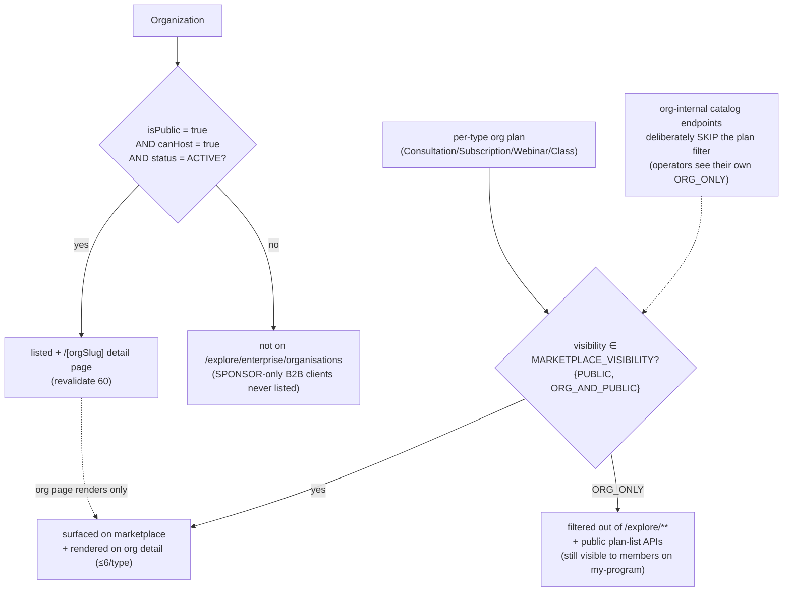

# Public pages and discovery

This document explains how an org and its plans surface on the public marketplace. It covers the `OrgPlanVisibility` gate on per-type plans, the public org list and detail pages, the attribution leg that `PERSONAL` funding leaves on a payment, and the explore-card badge. It is for anyone touching marketplace discovery or org public exposure, and it was last verified against code on 2026-06-05 (#726/#778).

The enterprise layer's public-facing footprint is just two things. The first is per-type org-owned plans that opt into the marketplace via `OrgPlanVisibility`; the org's "catalog" is now simply its visible plans rather than a separate model. The second is public org pages for HOST and HYBRID orgs that opt into discovery by setting `Organization.isPublic = true`.

The standalone `OrganizationPlan` model and the `/catalog` route set were both removed in the #778 elegance pass, because a separate "org catalog" table duplicated the bookable shape of the four per-type plans. The catalog an org exposes is now exactly its `ConsultationPlan`, `SubscriptionPlan`, `WebinarPlan`, and `ClassPlan` rows (those with `organizationId` set) whose `visibility` is public. Do not reintroduce `OrganizationPlan`.

## Plan visibility (`OrgPlanVisibility`)

Each of the four per-type plan models carries:

```prisma
enum OrgPlanVisibility {
  PUBLIC          // visible everywhere (default for personal plans)
  ORG_ONLY        // only org members see it; marketplace MUST filter it out
  ORG_AND_PUBLIC  // discoverable AND surfaced to org members
}
```

```prisma
// on ConsultationPlan / SubscriptionPlan / WebinarPlan / ClassPlan
visibility OrgPlanVisibility @default(PUBLIC)
```

The single source of truth for "what's safe to show publicly" is
`lib/api/plans/visibility.ts`:

```ts
export const MARKETPLACE_VISIBILITY: OrgPlanVisibility[] = [
  "PUBLIC",
  "ORG_AND_PUBLIC",
];
```

Every public plan-list surface composes `marketplaceVisibilityWhere()` (or the
shared `buildPlanWhereClause`) into its `where` so an `ORG_ONLY` plan never
leaks to `/explore/**`. The filter is applied in the `/api/plans/*` list routes
(consultations, subscriptions, webinars, classes), `plan-filters.ts`'s
`buildPlanWhereClause` (webinars + classes), and the consultant-detail GET
(narrows included plans for non-privileged viewers). **Org-internal** catalog
endpoints (operators viewing their own org's plans) MUST NOT use this filter —
they accept `ORG_ONLY` for the viewer's own org by design. Routing every public
surface through one constant keeps the tenant-private-catalog-leak class (#726)
auditable.

Two changes landed with [ADR 24](../70-design-decisions/24-offering-content-model.md).
The first is that `eventPlanDiscoverableWhere()` — visibility plus
`archivedAt: null` — now applies to all four plan types rather than only the two
that used to have the column, and it is the filter a public surface should
reach for. The public org page was the one surface that filtered visibility but
not the archive, so a withdrawn plan still rendered there and linked straight
into checkout; it now composes the full filter like everything else.

A third change closed a back door the list filters never covered: the four plan
DETAIL pages are reached by primary key, not by listing, and filtered on
nothing at all, so an `ORG_ONLY` plan was fully readable by anyone holding its
id and an archived plan still rendered a page with a live booking button.
`isPlanViewable()` now gates all four. Consultation and subscription detail
pages were added at the same time, giving all four types parity.

The second is that `ORG_ONLY` finally has a reader. Narrowing a plan to
`ORG_ONLY` previously made it invisible to everyone, including the members it
was authored for, because the marketplace filter correctly excluded it from
`/explore/**` and no member-facing surface existed. The catalog panel on
`/dashboard/organization/[orgId]/my-program` is that surface: an org-internal
read that deliberately skips the visibility filter, gated entirely on
`requireOrgAccess(orgId)` having confirmed membership. It is a panel on an
existing destination rather than a new nav entry, per
[ADR 19](../70-design-decisions/19-personal-vs-org-dashboard-split.md).

## The two discovery gates, drawn

Discovery is two independent AND-gates: one decides whether the **org** appears
at all, the other decides whether a given **plan** is safe to show. They don't
interact — an `ORG_ONLY` plan stays hidden even on a fully public org, and a
public plan on a non-public org is unreachable because there's no public org
page to host it. Drawing both keeps the tenant-leak class (#726) legible:



The org-gate is hard-coded in `GET /api/organizations/public` (and the
`[orgSlug]` detail loader); the plan-gate is the single `MARKETPLACE_VISIBILITY`
constant composed into every public plan-list `where`. Routing all four
per-type surfaces through one constant is the deliberate choice — a dropped
filter on any one of them would be a private-catalog leak, so there's exactly
one place to audit.

## Enterprise marketing pages (sales + education)

Separate from marketplace discovery: public marketing routes that explain the
sponsor product and route buyers to sales. These do **not** list private
sponsor orgs.

| Route | Role |
|---|---|
| `/enterprise` | B2B landing — Familiarise Enterprise overview |
| `/enterprise/team-training` | Licensed-seat / cohort training narrative |
| `/enterprise/corporate-mentorship` | Credit-pool / sponsored 1:1 mentorship narrative |

Navbar: **Enterprise** list dropdown (overview, program pages, Talk to sales).
Org directory filters (`?type=EXPERT_NETWORK` etc.) stay under Explore →
Organisations. Footer mirrors the program links. Homepage `EnterpriseSection`
primary CTA → `/enterprise`. Chrome: dark-hero routes registered in
`lib/navigation/public-chrome.ts`.

## Public org pages

A HOST or HYBRID org that sets `Organization.isPublic = true` becomes discoverable through two surfaces.

The list surface is `app/explore/enterprise/organisations/page.tsx`, backed by the unauthenticated `GET /api/organizations/public`. Its query filters to `isPublic = true AND status = "ACTIVE"` (deletedAt is null). Capability (`canHost`) is deliberately **not** a listing precondition: while `ENABLE_HOST_ORGS` is off, no org can set `canHost`, so a capability filter would make the directory structurally empty. It accepts optional `industry` (a case-insensitive contains match) and `search` filters, and uses cursor-style pagination with a page size of 24 capped at 50. Both surfaces revalidate on a 300-second ISR window.

The detail surface is `app/explore/enterprise/organisations/[orgSlug]/page.tsx` (also `revalidate = 300`). It resolves the org by its `slug` under the same `isPublic + ACTIVE` guard, then renders the org's branding plus up to six of each per-type plan, each filtered to `visibility ∈ {PUBLIC, ORG_AND_PUBLIC}`. SPONSOR-only orgs may appear when their owner opts in via `isPublic`; confidentiality for B2B clients is governed by that opt-in switch, not by hosting capability.

## Attribution-only semantics for PERSONAL funding

A `FundingSource = PERSONAL` org tags the learner's `Payment` with
`organizationId` so analytics can roll up "all sessions booked by Acme
employees". No money flows through the org — the learner pays at checkout on
their own card. This is the attribution leg `PaymentLeg` can't represent on its
own (it carries `source = CARD`), so the org tag lives on the
`Payment.organizationId` column directly.

## Explore-side visibility (the org badge)

When `canHost = true` and the org has ACTIVE experts, the org's name appears as
a badge on each expert's marketplace card. The explore query resolves the badge
by joining `Membership(status = ACTIVE, role = EXPERT)` ordered by
`createdAt ASC` so a multi-org expert surfaces a deterministic primary org. The
`ConsultantProfile.isIndependent` flag (true when a profile has no active EXPERT
membership) decides whether the "hosted by &lt;org&gt;" badge renders at all.
The explore query itself is part of the marketplace surface and lives outside
the `/api/organizations` tree.

## Related docs

- [Dashboard pages](04-dashboard-pages.md) — the org-internal surfaces that feed this.
- [Expert lifecycle](03-expert-lifecycle.md) — how an expert becomes discoverable in the org's public context.
- [Feature flags & rollout](06-feature-flags-and-rollout.md) — `OrgPlanVisibility` in the flag/gating picture.
