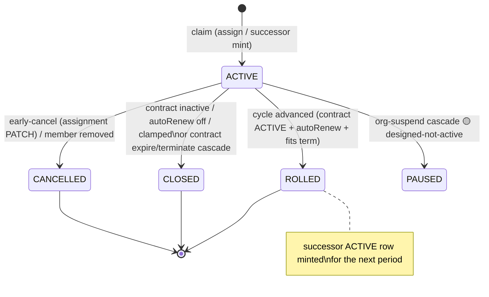

# Cycle engine and rollover

This document covers the `ProgramAssignment` lifecycle (`AssignmentStatus`), the nightly cycle-advance cron, the roll-vs-close decision table, successor minting and the rollover chain, the PAUSED and CANCELLED paths, and how cycle-close interplays with overage settlement. It is for engineers touching `advance-program-cycles`, assignment CRUD, or reconcile, and it was last verified against code on 2026-06-05 (#779 §A/§B).

A `ProgramAssignment` is a per-cycle entitlement row — one per `(Program, Membership, periodStart)`. Before #779 an assignment's liveness was inferred from `periodEnd` versus now, which left zombie assignments: rows whose period had ended but which nothing ever advanced or closed, so caps and seat counts drifted. This engine is what kills them, because it gives every assignment an explicit `status` and a nightly job that moves it.

## State machine



Each `AssignmentStatus` value, what it means, and which code path sets it are summarised in the table below.

| Status | Meaning | Who sets it |
|---|---|---|
| `ACTIVE` | drawing from cap this cycle | claim helper (assign / successor mint) |
| `ROLLED` | cycle advanced; successor minted | `advance-program-cycles` (ROLL) |
| `CLOSED` | contract expired/terminated, or roll declined | `advance-program-cycles` (CLOSE), expire-contracts, contract terminate cascade |
| `CANCELLED` | ended mid-cycle without rolling | assignment early-cancel PATCH; member-removal cascade |
| `PAUSED` | frozen by an org-suspend cascade | 🟡 **designed-not-active** — enum value exists; no code path sets it yet |

> 🟡 **PAUSED is reserved, not wired.** The `AssignmentStatus` enum carries
> `PAUSED` for the org-suspend cascade described in the schema comment, but no
> code currently writes it (grep-verified 2026-06-05). It lands when the
> suspension cascade ships; until then a suspended org's assignments keep their
> existing status.

## Schema (excerpt)

```prisma
model ProgramAssignment {
  // ... periodStart / periodEnd / engagementsUsed / consumedPaise / overageCount ...

  /// #779 §A — explicit assignment lifecycle (was inferred from periodEnd vs
  /// now). ACTIVE = drawing from cap; ROLLED = cycle advanced, successor minted;
  /// PAUSED = org-suspend cascade froze it; CLOSED = contract expired/terminated;
  /// CANCELLED = member removed mid-cycle. The cycle engine drives the moves.
  status AssignmentStatus @default(ACTIVE)

  /// #779 §A — rollover chain. The cycle engine mints a fresh ACTIVE row for the
  /// next period and points the closing row here (one self-join for history;
  /// reconcile asserts no gap/overlap between periods).
  rolledToAssignmentId String?            @unique
  rolledToAssignment   ProgramAssignment? @relation("AssignmentRollover", fields: [rolledToAssignmentId], references: [id], onDelete: SetNull)
  rolledFromAssignment ProgramAssignment? @relation("AssignmentRollover")
  /// #779 §A — set when the cycle engine processed this row (idempotency gate).
  rolledAt DateTime?

  @@unique([programId, membershipId, periodStart])
  @@index([membershipId, periodEnd])
  @@index([status, periodEnd])
}

enum AssignmentStatus {
  ACTIVE
  ROLLED
  PAUSED
  CLOSED
  CANCELLED
}
```

## Nightly cycle-advance cron

`jobs/billing/advance-program-cycles.ts` (GitHub Action
`.github/workflows/advance-program-cycles.yml`, daily `15 2 * * *` UTC) runs
**ahead of** auto-renew-contracts (`30 2`) and expire-contracts (`0 3`) so an
assignment whose contract is still ACTIVE rolls into its next period *before*
any contract-side state moves under it.

A row is a candidate when `status = ACTIVE`, `rolledAt = null`, and `periodEnd <= now`, and its program is still live (`program.status = ACTIVE` with `archivedAt = null`). Each run is bounded to `BATCH_SIZE = 500` candidates, and the next nightly tick drains any remainder.

Per candidate, the engine computes the successor period
(`successorStart = periodEnd`, `successorEnd = nextPeriodEnd(start, cycle)`),
runs `decideCycleTransition`, then applies the decision inside a per-row
**Serializable** `$transaction`:

- **ROLL** — claim `ACTIVE → ROLLED` (+ `rolledAt`) via conditional
  `updateMany` (`count === 0` ⇒ another replica won → skip), mint the successor
  `ACTIVE` row for the next cycle, then link `old.rolledToAssignmentId =
  successor.id`. Emits `PROGRAM_ASSIGNMENT_ROLLED`.
- **CLOSE** — claim `ACTIVE → CLOSED` (+ `rolledAt`); no successor. Emits the
  same audit action with `closed: true` + `reason`.

**Idempotency** has two layers: the `rolledAt`/status claim gate, and the
`rolledToAssignmentId @unique` + successor `@@unique([programId, membershipId,
periodStart])` constraints — a double-mint by a second replica trips `P2002`,
which is caught and skipped cleanly.

### Date math

`nextPeriodEnd(start, cycle)` (`lib/enterprise/cycle-engine.ts`) advances by
MONTHLY / QUARTERLY / ANNUAL using JS `Date` month arithmetic, with an explicit
**month-overflow guard**: if the day-of-month rolled (e.g. Jan-31 + 1 month
would spill into March), it pins to the last day of the intended month
(`setDate(0)`). This mirrors the cycle arithmetic in
`generate-subscription-invoices.ts`.

## Roll-vs-close decision table

`decideCycleTransition` (`lib/enterprise/cycle-engine.ts`) is pure (no Prisma,
no IO) so the month-end / clamp / roll-vs-close edges are unit-testable without
a DB. It evaluates **in this order**:

| # | Condition | Decision | Reason |
|---|---|---|---|
| 1 | `contractStatus !== "ACTIVE"` | **CLOSE** | `CONTRACT_INACTIVE` |
| 2 | `contractAutoRenew === false` | **CLOSE** | `AUTORENEW_OFF` |
| 3 | `effectiveTo !== null && successorPeriodEnd > effectiveTo` | **CLOSE** | `CLAMPED` |
| 4 | else | **ROLL** | `AUTORENEW` |

The **clamp** (row 3) is the subtle one: a successor whose end would exceed the
contract's hard `effectiveTo` would bill past the term, so the engine closes
instead of rolling. An open-ended contract (`effectiveTo = null`) never clamps.

`resolveProgramCycle(program)` picks the cycle from whichever money-config the
program carries (`licensedSeatConfig.cycle ?? creditPoolConfig.cycle`); both
null is a malformed program and the cron skips it (`stats.skipped`).

## Successor minting

A ROLL mints a fresh `ACTIVE` row for `[successorStart, successorEnd]` with
**counters zeroed** — `engagementsUsed = 0`, `consumedPaise = 0`,
`overageCount = 0` — so the new cycle starts clean. The closing row points
forward via `rolledToAssignmentId`; the successor's `rolledFromAssignment`
back-relation answers "where did this come from?". Reconcile
([ledger integrity](../10-money-and-ledger/13-ledger-integrity.md)) asserts no gap/overlap between a
chained pair's periods.

### Worked example — IIT Madras's credit pool rolls a month

Take a student on the seeded **IIT Madras** `IIT Student Coaching Pool`
(`CREDIT_POOL`, `MONTHLY`, `creditBudgetPerCycle = 10,000` ⇒ ₹10,000/month) whose
contract is **ACTIVE + auto-renewing** with a year-out `effectiveTo`. Their
March assignment (`[2026-03-01, 2026-04-01]`) drew ₹6,300 of credit before the
month closed. On the night of 2026-04-01 the cron sees `periodEnd <= now`, runs
`decideCycleTransition` → **ROLL** (contract ACTIVE, autoRenew on, successor end
`2026-05-01` is within `effectiveTo`), and in one Serializable tx writes:

| | old row `A₁` (March) | successor `A₂` (April) |
|---|---|---|
| `id` | `…aaa1` | `…bbb2` (fresh) |
| `periodStart` | `2026-03-01` | `2026-04-01` (= old `periodEnd`) |
| `periodEnd` | `2026-04-01` | `2026-05-01` (`nextPeriodEnd`, MONTHLY) |
| `status` | `ACTIVE → ROLLED` | `ACTIVE` |
| `consumedPaise` | `630000` (frozen) | `0` (zeroed) |
| `engagementsUsed` | (its count, frozen) | `0` |
| `overageCount` | (frozen) | `0` |
| `rolledAt` | `null → 2026-04-01T02:15Z` | `null` |
| `rolledToAssignmentId` | `null → …bbb2` | `null` |

Then a `PROGRAM_ASSIGNMENT_ROLLED` audit row lands. The March row's
`consumedPaise = 630000` is **preserved**, not reset — that's the cycle's
permanent record, and reconcile still asserts `A₁.consumedPaise == Σ price` of
A₁'s `UsageLedgerEntry` rows. April starts the student at a clean ₹10,000 of
headroom. The chain edge `A₁.rolledToAssignmentId = A₂.id` lets history walk
forward; `A₂.rolledFromAssignment` walks back.

> ⚠️ The seeded IIT contract leaves `autoRenew` at its `false` default, so a
> literal seed-data run would **CLOSE** (`AUTORENEW_OFF`) rather than ROLL — the
> example above assumes the auto-renewing variant to show the ROLL path. The
> seed also seeds a year-long assignment window, not monthly; this walkthrough
> uses MONTHLY periods (the program's actual `cycle`) to show a real rollover.
> Both are faithful to the field shapes; only the contract's `autoRenew` toggle
> differs from the seed.

## PAUSED / CANCELLED paths (off-engine)

These transitions are driven by CRUD routes, not the cron:

- **Early cancel** — `PATCH /programs/[programId]/assignments/[assignmentId]`
  with `{ cancel: true }` (MAINTAINER + canSponsor). Claims an `ACTIVE` row →
  `CANCELLED`, clamps `periodEnd` to `max(now, periodStart)` (no negative
  period), frees the seat (`adjustActiveSeatCount(-1)`). Claiming only `ACTIVE`
  means a concurrent cancel / cycle-rollover can't double-free the seat
  (`409 ASSIGNMENT_NOT_ACTIVE` for the loser). History (utilizations) stays.
- **Member removal** — `DELETE /members/[memberId]` cascades: still-live
  assignments are `updateMany`'d to `CLOSED`/`CANCELLED` with `periodEnd = now`
  (member-removal sets `status = CANCELLED`), so a removed member stops drawing
  immediately.
- **Contract expire / terminate** — closes assignments to `CLOSED` (see
  [contract lifecycle](07-contract-lifecycle.md)); the cron will not later
  re-touch them because its candidate filter requires `status = ACTIVE`.

## Interplay with overage settlement & reconcile

The cycle engine itself moves **entitlement state**, not money. Overage that a
member booked over-cap during the cycle is settled separately:

- **CHARGE_ORG** overage accrues onto the org invoice; the cycle-close +
  invoice path drives `OverageEvent` `PENDING → ACCRUED → CHARGED`
  (see [invoicing](../10-money-and-ledger/08-invoicing.md)).
- **CHARGE_MEMBER** overage settles instantly at checkout (`PENDING → CHARGED`)
  or times out (`→ FAILED`) via the timeout cron — independent of the cycle
  roll.

Because a successor's counters are zeroed, cycle-scoped aggregates
(cap-near %, overage-so-far) reset cleanly per period. Reconcile asserts
`engagementsUsed == sum(UsageLedgerEntry.engagementsConsumed)` and, for
CREDIT_POOL, `consumedPaise == sum(price)` **per assignment** — i.e. per cycle,
since each cycle is its own row. The `PROGRAM_ASSIGNMENT_ENGAGEMENTS_DRIFT`
check ([ledger integrity](../10-money-and-ledger/13-ledger-integrity.md)) is the backstop.

## Design decisions & trade-offs

- **Mint-successor vs mutate-in-place.** The engine could have just bumped the
  existing row's `periodStart`/`periodEnd` and zeroed its counters in place — one
  row, less storage. It mints a fresh row instead, for two reasons. **Audit
  trail:** the closed cycle's `consumedPaise`/`engagementsUsed` stay frozen on
  their own row, so "what did this student burn in March?" is a row lookup, not a
  reconstruction from the ledger. **Idempotency:** a fresh row keyed by
  `@@unique([programId, membershipId, periodStart])` plus
  `rolledToAssignmentId @unique` means a double-fired cron trips `P2002` on the
  second mint and skips cleanly — whereas an in-place mutation has no natural
  unique to collide on, so a re-run would silently re-zero a cycle that had
  already started accumulating usage. The cost is one row per cycle per member;
  the win is a tamper-evident chain reconcile can assert gap/overlap-freedom
  across.
- **`decideCycleTransition` is ordered, and the clamp is the subtle edge.** The
  four conditions evaluate top-down (`cycle-engine.ts`): contract not ACTIVE →
  CLOSE; autoRenew off → CLOSE; successor end > `effectiveTo` → CLOSE (`CLAMPED`);
  else ROLL. The first two are obvious; the **clamp** is the one that bites — a
  contract that's ACTIVE *and* auto-renewing still CLOSEs the assignment if the
  next period would end past the contract's hard `effectiveTo`, because rolling
  would bill a cycle the term doesn't cover. An open-ended contract
  (`effectiveTo = null`) never clamps. Keeping the function pure (no Prisma, no
  IO) is what makes these month-end/clamp edges unit-testable without a DB.

### 🛠️ What this design survived — the zombie assignments

Before the cycle engine, an assignment's "is it still live?" was **inferred** at
every read site from `periodEnd` vs `now`. That left **zombie assignments**: a row
whose period had ended but which nothing ever advanced or closed. Its `periodEnd`
was in the past, but its `engagementsUsed`/`consumedPaise` caps still sat there
stale, its seat still counted toward `activeSeatCount`, and there was no fresh
period for the member to draw against — the entitlement just silently rotted.
Every consumer had to re-derive liveness, and any one that forgot the
`periodEnd < now` check would read a dead row as live.

`#779 §A/§B` (commit `52a6d37f`, whose message is literally *"cycle engine +
contract auto-renew (kills the zombie assignments)"*) replaced inference with an
explicit `AssignmentStatus` and a nightly job that *moves* every ended period:

| Before | After |
|---|---|
| "Live?" inferred from `periodEnd < now` everywhere | explicit `AssignmentStatus`, one source of truth |
| Ended periods lingered as silent `ACTIVE`-by-default | nightly cron ROLLs or CLOSEs every ended period |
| Contract expiry left assignments untouched | expire/terminate cascade closes them in-tx |
| No idempotent successor minting | `rolledAt` + `rolledToAssignmentId @unique` |

The subsystem checklist still tracks this as the line item *"Cycle auto-rollover
at `periodEnd` … (kills zombie assignments)"*
([90-audits/02-subsystem-checklist.md](../90-audits/02-subsystem-checklist.md)).
The status column is now the single source of truth: a read site checks
`status = ACTIVE`, never re-derives liveness from dates, and the cron guarantees
no ended period stays `ACTIVE` past one nightly tick.

## Related docs

- [Programs](02-programs.md) — assignment accounting, caps, the claim helper.
- [Contract lifecycle](07-contract-lifecycle.md) — the contract state the
  decision table reads.
- [Concurrency & idempotency](01-concurrency-and-idempotency.md) — the claim
  gates + unique constraints as idempotency anchors.
- [Invoicing](../10-money-and-ledger/08-invoicing.md) — CHARGE_ORG overage settlement at cycle close.
- [Ledger integrity](../10-money-and-ledger/13-ledger-integrity.md) — the reconcile/drift checks.
