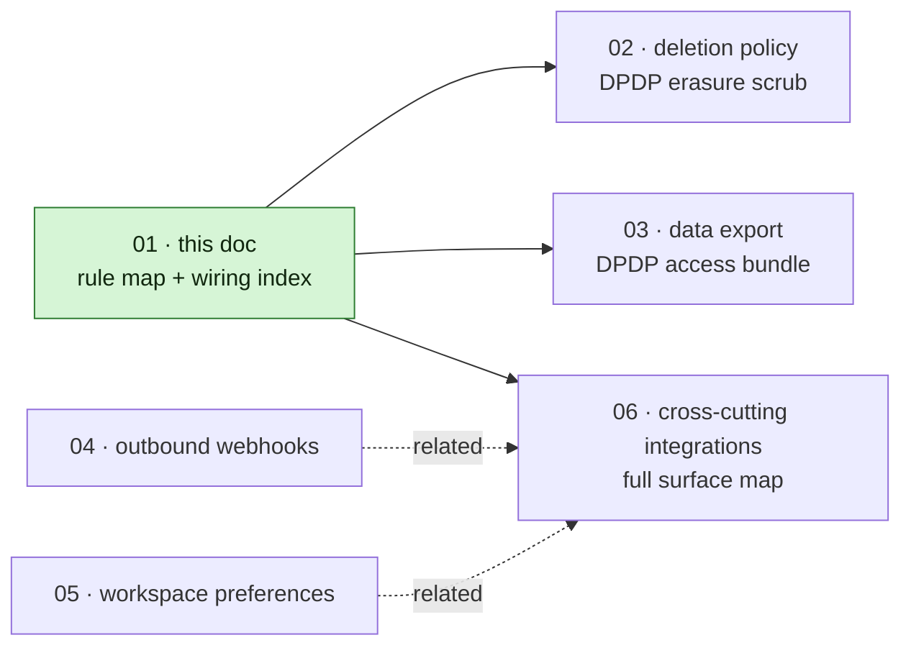
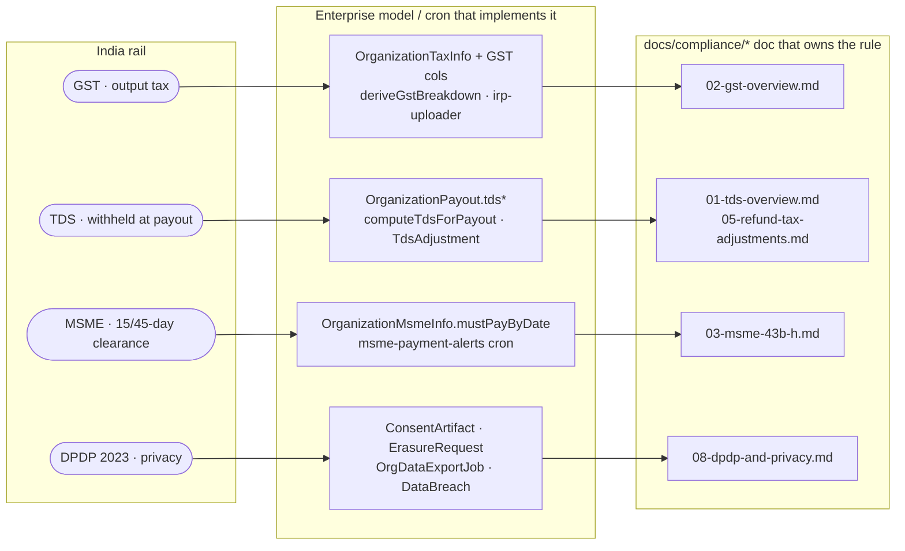
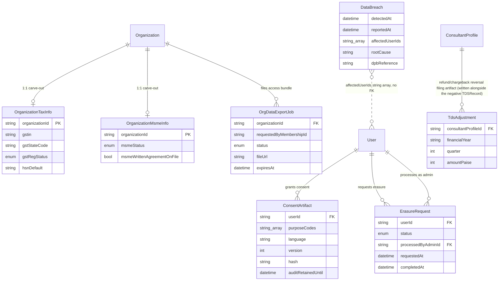

# Compliance: GST · TDS · MSME · DPDP (enterprise touchpoints)

**What this covers.** This document is the self-contained compliance map for the enterprise subsystem. For each India statutory rail that the B2B/enterprise flow touches — GST, TDS, MSME, and DPDP — it states the current rule with its primary citation and effective date, names the model, cron, and library file that implement it, and records the gap status where code lags the law. The deeper, rates-and-thresholds-level treatment still lives one tree over in [`docs/compliance/`](../../compliance/00-overview.md); each rail section ends with an `Authoritative:` pointer to the compliance doc that owns the obligation. Where this document's research contradicts a claim in `docs/compliance/*`, the divergence is called out inline with a 🟥 marker so the two trees can be reconciled deliberately rather than silently.

If you are new to the codebase, four India rails matter for the enterprise tier. **GST** is the sales tax we add to invoices and remit to the government. **TDS** is tax we withhold _out of_ what we pay consultants and host organizations and deposit on their behalf. **MSME** is a law that forces prompt payment to small suppliers and disallows the buyer's tax deduction if the payment is late. **DPDP** is India's GDPR-equivalent privacy law. Each rail reduces, in our code, to one or two schema models plus a cron, and that wiring is what this document maps.

> **Division of labour.** `docs/compliance/*` owns the regulatory obligation — what the law requires. This document owns the wiring — which model, posting, and cron implement it on the enterprise side. When the two disagree, the compliance docs win on _rules_ and the code wins on _behaviour_.

## Where this sits in the compliance band

The diagram below places this document within the 40-compliance-and-data band. This file is the index and rule map; the four documents beside it drill into the operational mechanics of deletion, export, webhooks, and the cross-cutting integration surface.

The map reads left-to-right: each rail flows from the abstract obligation, through the enterprise schema or cron that wires it, to the compliance document that owns the rule.

The four sections below expand each row; §5 lists the crons, and §6 is the everything-else table for the remaining rails (RBI, cross-border, consumer protection).

---

## 1. GST (output tax on bookings and invoices)

Every booking credits `GST_PAYABLE` with `Payment.taxAmount` (see [ledger and postings](../10-money-and-ledger/03-ledger-and-postings.md) §4.2), and a refund reverses the prorated GST share (§4.7). `GST_PAYABLE` is a platform liability — tax we have collected and owe to the government until it is remitted.

On the invoice side, `OrganizationInvoice` carries `igstPaise`, `cgstPaise`, `sgstPaise`, and `placeOfSupply`, derived by `deriveGstBreakdown()` (`lib/compliance/gst.ts`) from the place-of-supply comparison: an intra-state supply splits into CGST plus SGST, while an inter-state supply is a single IGST line. The organization's GST identity lives on the `OrganizationTaxInfo` carve-out (`gstin`, `gstStateCode`, `gstRegStatus`, `hsnDefault`), which #768 moved off the `Organization` God-Model.

A refund mints a sequential `CreditNote` (per-organization, CGST Rule 53) through the idempotent `mintRefundCreditNote` (`lib/payments/operations/refund.ts`; numbering in `lib/payments/billing/credit-note-numbering.ts`). The `CreditNote.refundId @unique` constraint makes minting idempotent across webhook redeliveries and cron retries.

### The numbering rule (Rule 46(b) / Rule 53)

CGST Rule 46(b) requires every tax invoice to carry a consecutive serial number that does not exceed **sixteen characters**, drawn only from letters, numerals, and the two permitted separators hyphen (`-`) and slash (`/`), and unique within a single Indian financial year (April–March). Rule 53 imposes the same numbering discipline on credit and debit notes but in a _separate_ series, and each note must reference the serial number and date of the original invoice it adjusts. Familiarise satisfies the "consecutive and unique per financial year" requirement by allocating each number atomically from a dedicated per-(organization, fiscal-year) counter (`OrgInvoiceCounter` / `OrgCreditNoteCounter`), backed by `@@unique` constraints, and reckons the fiscal year in IST so an invoice issued in the final minutes of 31 March is filed under the closing year's series rather than slipping into the next one.

It is worth stating precisely what the law does and does not demand. Rule 46(b) requires the series to be consecutive and unique per financial year, **not** strictly "gapless." A gap is acceptable where it is explained by a cancelled or voided document retained in the records, and a cancelled number must never be reused. Our counter is in fact gapless under normal operation, which is the safest superset of the requirement — a rare burned sequence number from a rolled-back transaction is a documentable exception, not a compliance defect.

- **Source (primary):** CGST Rules 46 and 53 — https://taxinformation.cbic.gov.in/content/html/tax_repository/gst/rules/cgst_rules/active/chapter6/rule46_v1.00.html. Core text in force since 1 July 2017; the "unique for a financial year" wording is long-standing and reiterated for FY 2025-26.

> 🟢 **Resolved (#807):** the ≤16-character Rule 46(b)/53 cap is now enforced at counter time — `GST_DOC_NUMBER_MAX_LEN = 16` in `lib/payments/billing/invoice-numbering.ts` deterministically truncates the org prefix so the assembled number never exceeds the cap (shared by the credit-note series). On framing: the statute requires consecutive-and-unique per financial year, not strictly gapless; our gapless counters are the safe superset, and a rare burned number from a rolled-back transaction is a documentable exception rather than a defect.

> 🟡 **Gap:** Section 34(2) ties the _reduction in output-tax liability_ through a credit note to two conditions — declaration no later than 30 November following the end of the supply's financial year, and the incidence of tax not having been passed on to the buyer. Neither the schema nor `refund.ts` records or gates on these; the credit note is minted but the output-tax-reduction eligibility is silently unmodelled. This is a follow-up for the (unbuilt) GSTR-1 export, not a numbering bug. (No issue filed yet.)

### e-invoice / IRN

`OrganizationInvoice.{irn, ackNumber, signedQrPayload, irpStatus, irpRetryCount}` are schema-final. The IRP uploader is body-live but env-gated behind `ENABLE_IRP_UPLOADER` plus ClearTax GSP credentials (`jobs/compliance/irp-uploader.ts` → `lib/compliance/irp.ts` `generateIrn`, payload mapper `lib/compliance/irp-payload.ts`). When credentials are absent, `generateIrn` returns `{ status: "FAILED", reason: "STUB" }` and the cron records it as an ordinary retry. The relevant thresholds are unchanged: e-invoicing (IRN generation) is mandatory at PAN-level aggregate annual turnover (AATO) of **≥ ₹5 crore**, a level in force since 1 August 2023, and the stricter 30-day IRP reporting window binds only filers at **AATO ≥ ₹10 crore**, effective 1 April 2025. B2C remains a voluntary pilot and is not IRN-reportable today, so we report IRNs only on `OrganizationInvoice` (B2B) documents.

- **Source (primary):** NIC IRN spec https://einv-apisandbox.nic.in/irn.html; 30-day window advisory https://einvoice6.gst.gov.in/content/revised-time-limit-for-e-invoice-reporting-for-businesses-with-aato-of-%E2%82%B910-crores-above/.

> 🟡 **Gap:** Credit and debit notes are themselves IRN-reportable as `CRN`/`DBN` documents once AATO crosses ₹5 crore, but `buildIrpPayload` hardcodes `DocDtls.Typ = "INV"` and the uploader scans only `OrganizationInvoice`; `CreditNote` has no IRP columns. Correctly deferred while sub-₹5-crore and IRN-gated, but a schema-plus-pipeline gap to track for launch. (No issue filed yet; tracked alongside #778/#779 enterprise audit follow-ups.)

> 🟡 **Gap:** The `lib/compliance/irp.ts` header says e-invoicing is mandatory "AATO > ₹5 Cr (since 2017-18)" and uses `>` rather than `≥`. The ₹5 crore mandate is since 1 August 2023 (2017-18 is only the AATO look-back base year), and the thresholds are inclusive. Cosmetic comment fix. (No issue filed yet.)

**Authoritative:** [docs/compliance/02-gst-overview.md](../../compliance/02-gst-overview.md).

## 2. TDS (tax withheld at payout)

Both payout flows withhold TDS with the posting `Dr *_PAYABLE (net+TDS) / Cr CASH (net) / Cr TDS_PAYABLE (withheld)` — consultant ([§4.4](../10-money-and-ledger/03-ledger-and-postings.md)) and host-org ([§4.5](../10-money-and-ledger/03-ledger-and-postings.md)). `OrganizationPayout` and `ConsultantPayout` persist `tdsSectionApplied`, `tdsAmountPaise`, and rate snapshots, and `TDSRecord` rows back the quarterly return. Computation is the pure `computeTdsForPayout` (`lib/compliance/tds.ts`, `DEFAULT_SECTION = "194O"`), with the consultant path's legacy ₹50K cumulative gate behind the `TDS_ENGINE` env flag (default `LEGACY` until the CA confirms pure 194-O semantics in writing — one env flip at launch). A refund- or chargeback-driven reversal writes both a signed-negative `isReversal` `TDSRecord` (the YTD/dedup source) and a `TdsAdjustment` row (the filing artifact the Form 140/144 export will read) via the shared `recordTdsReversal` (`lib/payments/tax/tds-service.ts`, #813/#778 §D). The TDS admin surface is gated behind `ENABLE_TDS_ADMIN_VIEW`.

### The current rule — Income-tax Act 2025

The **Income-tax Act, 2025 (Act 30 of 2025)** has been in force since **1 April 2026** and is current law, not an upcoming change; the 1961 Act stands repealed for transactions on or after that date. The renumbering is structural rather than substantive: every non-salary TDS provision (the old 194-series and Section 195) is consolidated into a single **Section 393** with a tabular schedule keyed by numeric payment codes, salary withholding moves to §392, and TCS to §394. The no-PAN punitive rate (old Sections 206AA and 206CC) is now **Section 397(2)**, which keeps the 20% default but carries an explicit 5% carve-out for e-commerce. Rates and thresholds carry over unchanged: an e-commerce-operator payout is still withheld at 0.10% (the rate the Finance (No. 2) Act 2024 cut from 1% effective 1 October 2024).

The withholding arithmetic in `computeTdsForPayout` is therefore correct as written, and the `tdsSectionApplied` / `tdsSection` columns continue to store the familiar `194O` / `194J` / `194C` labels as internal classification keys. What changes is the **filing boundary**: for any deduction dated on or after 1 April 2026, the quarterly return and challan must quote the relevant Section 393 payment code, not the legacy `194O` string. The portal validates the section codes on a return against the Income-tax Act 2025 numbering, so a return that carries a legacy section number is expected to fail that validation, per the CBDT's "Updated FAQs on Interplay & Transitions". This platform emits the new codes at the point a return is generated, so the question does not arise for a return it produces. The forms are also renumbered — 26Q → **Form 140** (non-salary), 27Q → **Form 144** (non-resident), 16A → **Form 131** (non-salary certificate).

The exact numeric payment codes (the 10xx series — for example 194O often cited as 1035) are **not reliably verifiable** from public sources: publishers disagree (194O appears as 1035 or 1010; 194C as 1023/1024 or 1017 or 1002), and several explicitly flag their codes as illustrative pending the final CBDT challan/RPU schema. Do **not** hard-code these codes; confirm them against the CBDT notification when the Form 140/144 generator is built.

Since #781 §C/§D the schema is ready for that generator without further migration: every stored TDS rate is integer basis points (`tdsRateBps` on the profile, payout, and `TDSRecord` — the old `Float` columns let the two engines disagree on whether 0.1% was `0.001` or `10`), and the `TdsRate` lookup table is keyed by `(lawCode, section, effectiveFrom)` with a nullable `paymentCode`, so IT1961 and IT2025 rows coexist and the engine selects by deduction date. Rate rows are append-only — a statutory change is a new row, never an update to history. The CBDT payment codes slot into `TdsRate.paymentCode` once confirmed.

- **Source (primary):** incometax.gov.in Form 141 page (confirms §393(1)) https://www.incometax.gov.in/iec/foportal/help/all-topics/e-filing-services/form-141-challan-cum-statement-deduction-tax-us-3931-UM; §397(2) merger and 5% e-commerce carve-out https://blog.tdsman.com/2026/05/higher-rate-of-tds-for-non-furnishing-of-pan-section-3972-206aa-206cc/; form mapping https://blog.tdsman.com/2026/03/new-tds-tcs-forms-it-act-2025-mapping-with-old-forms/.

### Refund-after-deduction mechanics

When a payout is refunded after TDS has been withheld and deposited, the excess is adjusted against the deductor's TDS liability in a later quarter of the **same financial year** (CBDT Circular 2/2011, carried forward by the 2025 Act), surfacing as a reduced or negative line in that quarter's Form 140/144. The refund cascade now implements this through `recordTdsReversal` (#813): it writes a negative `isReversal` `TDSRecord` capped at the original withholding, copying the original's FY/quarter when the original is unfiled and stamping the current IST-reckoned quarter when the original is already filed. The correction return for an already-filed quarter, and an excess discovered after the financial year closes (which routes to the Form 26B refund claim), both remain operator actions rather than automated filings; this policy is provisional pending CA sign-off.

> 🟥 **Divergence:** The compliance docs and the `tds.ts` header frame the no-PAN 5% rate as a "194-O internal special carve-out, not the 20% of 206AA." The current law places the 5% itself inside **Section 397(2)** (the consolidated no-PAN provision's e-commerce exception); old Section 206AA no longer exists. The constant value (`NO_PAN_RATE_194O = 0.05`) is economically correct, but the citation in the header docblock and `docs/compliance/01`/`11` should move from "206AA carve-out for 194O" to "§397(2) e-commerce carve-out."

> 🟡 **Gap (narrowed):** `TdsAdjustment` is now written on every reversal alongside the negative `TDSRecord` (#778 §D), so the filing artifact exists at event time; its `reportedInForm26Q` flag is a legacy label (the concept maps to Form 140 for FY 2026-27+). What stays deferred is the FVU/quarterly-return export — where the §393-code translation and Form 140/144/131 naming belong (#778 §F). The `194J` rate is a flat 10% and does not model the technical-2% versus professional-10% split that §393 now exposes as distinct payment codes; this is a pre-existing withholding nuance, not a 2025-Act regression. (Tracked under #778; FVU export has no separate issue.)

**Authoritative:** [docs/compliance/01-tds-overview.md](../../compliance/01-tds-overview.md), [docs/compliance/04-tds-quarterly-filings.md](../../compliance/04-tds-quarterly-filings.md), [docs/compliance/05-refund-and-chargeback-tax-adjustments.md](../../compliance/05-refund-and-chargeback-tax-adjustments.md).

## 3. MSME (15/45-day payment clearance)

`OrganizationMsmeInfo { msmeStatus, msmeWrittenAgreementOnFile }` classifies a host org (#771 D10, also moved off the `Organization` God-Model), and `OrganizationPayout.mustPayByDate` carries the derived statutory deadline computed by `computeMsmePaymentDeadline` (`lib/compliance/msme.ts`). The consultant rail mirrors this with `msmeStatus`, `udyamNumber`, and `writtenAgreementWithFamiliarise` on the consultant model and `ConsultantPayout.mustPayByDate`.

### The current rule

Section 15 of the MSMED Act 2006 caps payment to a Micro or Small supplier at **45 days** when a written agreement is on file and **15 days** without one, and the clock runs from acceptance or deemed acceptance of the goods or services (deemed acceptance being delivery plus fifteen days absent a written objection). So `msmeWrittenAgreementOnFile = true` produces a 45-day deadline and `false` a 15-day one; the window is a hard ceiling that overrides any longer `defaultTermsDays`, which apply only to MEDIUM and non-MSME counterparties. Section 16 imposes compound interest with monthly rests at three times the RBI bank rate on a missed deadline, and §24 overrides any contrary contract term — we do not currently accrue this interest, so the `msme-payment-alerts` cron is the control that keeps us inside the window.

The tax consequence lived in **Section 43B(h)** of the Income-tax Act 1961 (Finance Act 2023, effective 1 April 2024): the buyer loses the deduction until the dues are actually paid. From **1 April 2026** the Income-tax Act 2025 renumbers this — old §43B becomes **Section 37**, and the MSME limb §43B(h) becomes **Section 37(2)(g)** ("any sum payable to a micro or small enterprise beyond the time limit specified in section 15 of the MSMED Act, 2006"). The actual-payment-only mechanics are unchanged; only the citation moves. The disallowance reaches **only Micro and Small** suppliers — Medium enterprises are outside both §43B(h) and §37(2)(g), which is why `computeMsmePaymentDeadline` routes MEDIUM (and NONE) to ordinary contract terms.

The revised Udyam thresholds (S.O. 1364(E), effective 1 April 2025) are Micro ≤ ₹2.5 cr investment and ≤ ₹10 cr turnover, Small ≤ ₹25 cr and ≤ ₹100 cr, Medium ≤ ₹125 cr and ≤ ₹500 cr, applied as a composite test where breaching either limb bumps the enterprise up a tier.

- **Source (primary):** MSMED Act 2006 §§15/16 https://samadhaan.msme.gov.in/WriteReadData/DocumentFile/MSMED2006act.pdf; §43B(h) → §37(2)(g) mapping https://taxguru.in/income-tax/section-37-income-tax-act-2025-earlier-section-43b-income-tax-act-1961.html; Udyam thresholds S.O. 1364(E), 21 March 2025.

> 🟥 **Divergence:** `docs/compliance/03-msme-43b-h.md` states that §43B(h) "carries forward unchanged into the Income-tax Act, 2025 under equivalent clause numbering." The _mechanics_ are unaffected, but the **clause number changed**: §43B(h) → **§37(2)(g)** (§43B as a whole → §37), confirmed across three sources. The "equivalent clause numbering" phrasing should be replaced with the explicit §37(2)(g) mapping. Doc 03 also references consultant fields `ConsultantProfile.isMsme` / `msmeRegistrationNumber` / `msmeType` that do not exist in the schema — the real fields are `msmeStatus`, `udyamNumber`, and `writtenAgreementWithFamiliarise`.

> 🟡 **Gap:** `computeMsmePaymentDeadline` keys the deadline off `invoiceDate`, but §15 keys off acceptance / deemed acceptance. For rendered consulting services these effectively coincide (service rendered ≈ accepted), so invoice date is a defensible conservative proxy, but it is a proxy. The §16 interest is documented nowhere and not computed; the cron only alerts. Every "43B(h)" label in code and alert copy should be updated to read "43B(h) / §37(2)(g) (Income-tax Act 2025)" before the first filing covering a payment on or after 1 April 2026. (No issue filed yet.)

**Authoritative:** [docs/compliance/03-msme-43b-h.md](../../compliance/03-msme-43b-h.md).

## 4. DPDP 2023 (consent, erasure, retention, breach)

The Digital Personal Data Protection Act 2023, with the **DPDP Rules 2025** notified on 13 November 2025, binds Familiarise as a Data Fiduciary. Crucially, almost none of the operational duties are in force yet. Under Rule 1, only definitions and the Data Protection Board's constitution are live today; the **Consent Manager registration framework (Rule 4) opens 13 November 2026**, and **every duty that binds an operator of our size — consent notices (Rule 3), security safeguards (Rule 6), breach reporting (Rule 7), retention and erasure (Rule 8), data-principal rights and the 90-day grievance ceiling (Rule 14) — commences together on 13 May 2027** (eighteen months after notification). We implement these early; the runway is the build window, not a reason to defer the schema.

- **Source (primary):** DPDP Rules 2025 Rule 1 (verbatim commencement) https://www.dpdpa.com/dpdparules/rule1.html; gazette notification 13 November 2025 (PIB).

**Consent (Rule 3 / Act §5).** `ConsentArtifact` (purpose codes, grant/withdraw timestamps, language, notice version, SHA-256 tamper-evident hash, `auditRetainedUntil`) is the model. The org-side surface is `POST/GET/DELETE /api/organizations/[orgId]/consent` (`buildConsentArtifact` / `withdrawConsent`, `lib/compliance/dpdp.ts`); withdrawal stamps `withdrawnAt` and is irreversible, a re-grant being a fresh artifact. Expired rows are swept by `consent-retention-sweeper`. Rule 3 requires a standalone, itemised, plain-language notice, and Act §5(3) gives the data principal the right to that notice in English or any of the 22 Eighth-Schedule languages — the schema supports `language` and `version`, so the remaining gap is the _notice rendering and signup capture_, not the model.

**Erasure (Act §8(7) / Rule 8 / §12 rights).** Filed via `ErasureRequest` (`POST /api/users/me/erasure-requests` → `POST /api/admin/erasure-requests/[id]/process`); PII is tombstone-scrubbed by `lib/compliance/erasure/scrub-user.ts` while `lib/enterprise/audit-sanitize.ts` keeps the org-visible projection clean. Ledger rows are never deleted — erasure pseudonymizes the actor, not the money, relying on the Rule 8 "retention necessary for compliance with any law" exception. The full flow, and the framing of why this is the exception rather than a workaround, is in the [deletion policy](02-deletion-policy.md).

**Access (Act §11) / data export.** The org-scoped right-to-access bundle runs through `OrgDataExportJob` (async worker, 7-day signed URL, 1 export per org per 24 hours). Rule 14 sets no fixed statutory turnaround for the access response, so the async model is a compliant operational choice. See [data export](03-data-export.md).

**Breach (Rule 7).** `databreach-deadline-alerts` tracks a 72-hour clock off `DataBreach` rows.

> 🟡 **Gap (breach is two-stage; the schema now models both, the cron one).** Rule 7 requires intimation _without delay_ to both the Board and the affected principals (with five content elements) on becoming aware, _plus_ a detailed report to the Board within 72 hours. The 72-hour clock attaches only to the Board's _detailed_ report. Since #781 §D the `DataBreach` model carries the principal leg too — `principalsNotifiedAt`, `principalNotificationChannel`, and `principalNotificationNote` alongside the Board-leg `reportedAt` — so both duties are now provable from the row. What remains open is operational: the `databreach-deadline-alerts` cron still tracks only the Board clock, and its email cites only "Section 8(6), DPDP Act" where the source is Act §8(6) + Rules 2025 Rule 7. (Tracked in `docs/compliance/08-dpdp-and-privacy.md`; live-impl PR to fix the cron.)

> 🟡 **Gap (SDF is not a numeric threshold).** The `lib/compliance/dpdp.ts` comment treats "≥ 5M active users" as the Significant-Data-Fiduciary trigger. SDF has **no** numeric trigger in law — it is a Government designation under Act §10 weighing volume, sensitivity, and risk, and Familiarise is an implausible designee at any near-term scale. Keep the `isSignificantDataFiduciary` flag as cheap optionality but label the "5M" as a heuristic. (No issue filed yet.)

> 🟡 **Gap (self-serve consumer rights).** Per-data-principal self-serve access (`/api/me/*`) and correction endpoints are missing, and there is no published grievance officer or intake for the 90-day Rule 14(3) ceiling — the one hard statutory clock. The org-scoped export and admin-driven erasure cover the operator and tenant paths today. (Tracked under #701.)

**Authoritative:** [docs/compliance/08-dpdp-and-privacy.md](../../compliance/08-dpdp-and-privacy.md).

### Compliance-domain entity map

The compliance models and their owner relations, as they stand in `prisma/schema.prisma`:

Note two structural facts the diagram encodes: `DataBreach` has **no foreign key** to `User` — affected principals are a `String[]` of ids, which is part of why the model cannot today carry per-principal notification state (the Rule 7 gap above); and `ErasureRequest` relates to `User` twice, once as the subject and once as the processing admin (`processedByAdminId`, SetNull on admin deletion so the evidence-of-erasure trail outlives staff turnover).

## 5. Compliance crons

Each cron runs as a GitHub Action (`.github/workflows/*.yml`) calling a thin shim in `jobs/compliance/*`; each also exposes a `CRON_SECRET`-gated manual trigger at `POST /api/cleanup/*`.

- `irp-uploader` performs e-invoice IRN generation (env-gated, see §1).
- `consent-retention-sweeper` purges `ConsentArtifact` rows past `auditRetainedUntil`.
- `databreach-deadline-alerts` runs the 72-hour DPDP breach-reporting clock hourly.
- `msme-payment-alerts` warns finance before the 15/45-day deadline a default would lock.

Audit-log retention (7 years for INVOICE/PAYOUT/WALLET/CONTRACT/CONSENT categories, 2 years otherwise) is enforced by `prune-audit-logs` (`jobs/cleanup/`).

## 6. Other rails

The remaining statutory surfaces touch enterprise more lightly; each has its own owning compliance doc.

| Topic                                     | Enterprise hook                                                                      | Authoritative                                                                                                                                                                                      |
| ----------------------------------------- | ------------------------------------------------------------------------------------ | -------------------------------------------------------------------------------------------------------------------------------------------------------------------------------------------------- |
| RBI PA / payment architecture             | wallet is a closed-system prepaid liability, not custody; payouts via provider float | [docs/compliance/10-rbi-pa-and-payment-architecture.md](../../compliance/10-rbi-pa-and-payment-architecture.md)                                                                                    |
| Cross-border (Sec 195 → §393(2), 15CA/CB) | `OrganizationPayout.form15caPartCRef` / `form15cbRef` (schema-final, stubbed)        | [docs/compliance/07-cross-border-flows.md](../../compliance/07-cross-border-flows.md)                                                                                                              |
| Consumer protection / grievance           | refund SLA, grievance officer (48h ack / one-month redress)                          | [docs/compliance/09-consumer-protection-and-grievance.md](../../compliance/09-consumer-protection-and-grievance.md)                                                                                |
| Compliance calendar and roadmap           | recurring filing cadence                                                             | [docs/compliance/12-india-compliance-calendar.md](../../compliance/12-india-compliance-calendar.md), [docs/compliance/13-implementation-roadmap.md](../../compliance/13-implementation-roadmap.md) |

---

### Related docs

- [Payout pipeline](../10-money-and-ledger/07-payout-pipeline.md) — TDS and MSME fields in the payout flow.
- [Invoicing](../10-money-and-ledger/08-invoicing.md) — GST breakdown and IRN.
- [Ledger and postings](../10-money-and-ledger/03-ledger-and-postings.md) — `GST_PAYABLE` / `TDS_PAYABLE` legs.
- [`../compliance/00-overview.md`](../../compliance/00-overview.md) — the compliance index (authoritative).
