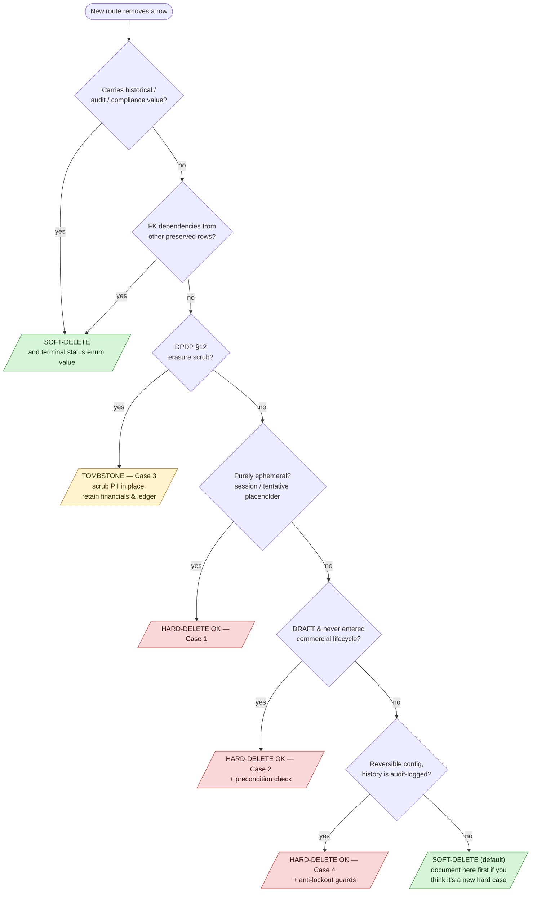

# Deletion policy

This document defines when the codebase should **soft-delete** (flip a status flag) versus **hard-delete** (`prisma.x.delete()` / `deleteMany`). The current codebase already follows most of these rules; this doc captures the policy so new routes stay consistent.

## The one-line rule

**Default to soft-delete.** Hard-delete is reserved for four specific cases — everything else uses a typed status enum with a terminal value.

## Why soft-delete by default

1. **Audit trail preservation.** Compliance reviews ("did Wipro have access to Program X in Q2?") need historical truth. Hard-deleted rows can't answer the question.
2. **Reversibility.** Accidents happen — a misclick shouldn't require DB restore. Soft-delete lets an OWNER (or admin) restore by flipping status back.
3. **Foreign-key integrity.** `onDelete: Cascade` is seductive but dangerous — one accidental hard-delete on a high-fanout entity can erase dependent rows you didn't intend. Soft-delete keeps the row available to joins + downstream queries while marking it as inactive.
4. **Compliance retention.** Financial records (Payment, OrganizationInvoice, Refund, Earnings) must be retained for 5-7 years per Indian tax + accounting law. You cannot actually delete a paid invoice; the most you can do is a tax-void / tombstone.

## The soft-delete pattern

Every entity subject to soft-delete exposes a typed `status` enum with an explicit terminal value. Route handlers transition status; they never call `prisma.x.delete()`.

Concrete examples from the codebase:

| Entity | Status enum | Terminal values | Transition route |
|---|---|---|---|
| `Membership` | `MemberStatus` | `REMOVED` | `DELETE /api/organizations/[orgId]/members/[memberId]` flips to `REMOVED` |
| `Organization` | `OrgStatus` | `DEACTIVATED` | `POST /api/admin/organizations/[orgId]/verify` with `action=DEACTIVATE` |
| `Invitation` | (String) | `revoked`, `expired` | `DELETE /api/organizations/[orgId]/invitations/[invitationId]` → `revoked`; `cleanup-stale-invitations` cron → `expired` |
| `Contract` | `ContractStatus` | `TERMINATED`, `EXPIRED` | `PATCH /api/organizations/[orgId]/contracts/[contractId]` with status transition |
| `Program` | `ProgramStatus` + `archivedAt` | `CANCELLED`, `COMPLETED`; archive via `archivedAt` | `DELETE /api/organizations/[orgId]/programs/[programId]` → soft cancel if assignments exist; hard-delete only if zero assignments. Archive (`archivedAt`, #777 §B) is a separate **soft-hide** — it removes the program from active lists without ending it; once `configLockedAt` is set the program can never be hard-deleted (financial history rides on it). |
| `OrganizationInvoice` | `OrgInvoiceStatus` | `VOID`, `CANCELLED`, `REFUNDED` | Status transitions via `PATCH` or webhook |
| `SsoProvider` | (via delete with guard) | row removed | hard-delete here is a known exception — see Case 4 below |

When you need to query "active rows only," filter by `status: { notIn: [/* terminal values */] }`. Active scope is enforced at the query site, not via Prisma middleware — explicit is better than magical.

## The four hard-delete cases

Hard-delete is only acceptable in one of these four cases.

### Case 1 — Ephemeral config rows with no audit value

Rows that exist purely as runtime state + have zero historical interest beyond their TTL window:

- **BetterAuth `Session` and `Account`** rows — deleted on logout or session expiry. No retention value.
- **Tentative `SlotOfAppointment`** rows — deleted when payment fails or the webhook rolls back an appointment (see `app/api/webhooks/utils.ts`, `lib/payments/webhooks/handlers.ts`).
- **Abandoned `WalletTopUp` rows** (PENDING / FAILED) past the grace window — reaped by `cleanup-abandoned-org-top-ups` cron. The unconfirmed row is schema-level noise; the fact that a top-up was abandoned is captured in the audit log + the cron's output. A *confirmed* top-up is never reaped — it owns a balanced `TOPUP` journal transaction (`LedgerEntry` rows are immutable, see Case 3).

### Case 2 — DRAFT-only entities with no commercial commitment

Rows that were created but never entered the commercial lifecycle:

- **`Contract`** in DRAFT — hard-delete only; ACTIVE / SIGNED contracts transition through `TERMINATED` / `EXPIRED` instead.
- **`OrganizationInvoice`** in DRAFT — hard-delete. Any invoice that was ever ISSUED must transition to `VOID` / `CANCELLED` / `REFUNDED`, never be deleted.

The route handler is responsible for the precondition check:

```ts
if (contract.status !== "DRAFT") {
  throw Object.assign(new Error("Only DRAFT contracts can be deleted"), { httpStatus: 409 });
}
await tx.contract.delete({ where: { id: contractId } });
```

### Case 3 — DPDP erasure scrub (§8(7) duty, §12 right)

When a data subject exercises their right to erasure under the DPDP Act 2023, the platform erases their personal data through a **tombstone scrub** rather than a row deletion. The legal basis is twofold. The Data Fiduciary's erasure duty is Act §8(7), read with Rule 8 of the DPDP Rules 2025: personal data must be erased once the specified purpose is no longer served, **"unless its retention is necessary for compliance with any law for the time being in force."** The data principal's corresponding right to request erasure is Act §12. Our scrub leans squarely on that statutory retention exception — Indian tax and accounting law (a 5–7 year keep on financial records) overrides the erasure right for money rows, so we pseudonymise the actor and retain the books. This is the exact carve-out the Rules contemplate, not a workaround.

> **Caveat — Rule 8(3) is a separate retention floor this scrub does not yet enforce.** The statutory-retention exception above is Act §8(7)'s carve-out, scoped to what "compliance with any law" actually requires (Rule 8(1) carries identical wording but binds only a Data Fiduciary "who is of such class … as are specified in Third Schedule," which we are not) — for us, the 5–7 year keep on money rows. Rule 8(3) opens "Without prejudice to sub-rules (1) and (2)," so it binds independently of Third Schedule class membership and is broader than that money-row exception: it requires retaining personal data, associated traffic data, and other logs — our own and any Data Processor's — for at least one year from the date of processing, before causing erasure. That retention is *for the Seventh Schedule purposes* — State access to personal data for sovereignty/security reasons, for a State function or a law-mandated disclosure, or for MeitY's SDF-designation assessment (`[See rule 23(1) and 8(3)]`) — it is not a general business-records floor. In practice this still means an erasure request filed within a year of processing can't fully purge non-financial rows either, since `scrub-user.ts` doesn't compute or check a one-year-from-processing date. And it extends to Data Processors acting on our behalf (video/recording, chat, hosting vendors): discharging Rule 8(3) means being able to show the vendor also retained for a year, and being able to cause that vendor to erase on our instruction under Act §8(7)(b) once the floor and any longer statutory retention have cleared. Neither is implemented today. See [docs/compliance/08-dpdp-and-privacy.md](../../compliance/08-dpdp-and-privacy.md) for the full Rule 8(2)/(3) text and the Seventh Schedule.

The implementation is a tombstone scrub:

- `User` row stays (financial records depend on it). Identifiable fields (`name`, `email`, `phoneNumber`, `image`) are overwritten with deterministic tombstones: `email = erased-<hash>@erased.invalid`, `name = ERASED_<hash>`.
- `ConsulteeProfile` / `ConsultantProfile` rows stay; free-text fields (`bio`, `linkedIn`) are nulled.
- `Membership` status flips to `ERASED` (new enum value, additive).
- BetterAuth `Session` / `Account` rows ARE hard-deleted (Case 1).
- `OrgAuditLog.details` JSON is scrubbed in-place for rows mentioning the erased user.
- Financial rows (Payment, Refund, OrganizationInvoice) and the
  double-entry journal (`LedgerTransaction` / `LedgerEntry`) are
  retained — legal retention supersedes erasure. `LedgerEntry` is
  immutable (`onDelete: Restrict` on both its transaction and account
  FK; reversals are explicit counter-transactions, never row edits or
  deletes), so erasure can only **pseudonymize the actor** — it never
  touches a money row. The tombstoned identity is enough to de-link.

**Status (PR #655, May 2026):** Phase 2 has landed. The manual log
`docs/compliance/erasure-requests-manual-log.md` is now read-only —
new requests flow through the API path below. Existing manual
entries remain for historical audit continuity.

> **War story — "erase the user" vs "never edit a money row".** DPDP
> §8(7) says erase the data subject's personal data once the purpose is
> served — with an express exception where retention is necessary to
> comply with another law. Indian IT-Act retention says keep financial
> records for years. These collide head-on the moment an erased user is
> the actor on a paid invoice or a payout, and the §8(7) exception is
> precisely what resolves the collision in favour of retention for the
> money rows. The two-table double-entry journal makes the collision
> non-negotiable on one side: `LedgerEntry` is `onDelete: Restrict` on
> *both* its transaction and account FK, and reversals are explicit
> counter-transactions — there is no code path that edits or deletes a
> posted money row. So erasure could not be "delete the rows that mention
> the user." The resolution (shipped in `e40914fa`,
> `lib/compliance/erasure/scrub-user.ts`) is **pseudonymize the actor,
> retain the money**: overwrite the `User`'s identifiers with
> deterministic tombstones, stamp a one-way `pseudonymousId =
> sha256(userId + ERASURE_SALT)`, and leave every `Payment` /
> `OrganizationInvoice` / `OrganizationPayout` / ledger row intact — the
> tombstoned identity is enough to de-link the human while keeping the
> books auditable. The companion read-side guard,
> `lib/enterprise/audit-sanitize.ts` (hardened in `bd61b3fb`), keeps the
> *next* leak from happening in reverse: it redacts engineering noise
> (Prisma errors, stack frames) out of the org-visible audit projection
> so an erased-user investigation can't surface raw internals. Two
> mechanisms, one principle: the row survives, the identity does not.

**Persona — an IIT Madras student invokes erasure.** IIT Madras is a
HYBRID campus org in the design-partner set; a graduating student who
booked consultations through it files §12. Walking what `scrubUser`
does to them: their `User.name`/`email`/`phone`/`bio` become tombstones,
their `Membership` on IIT Madras flips to `ERASED`, their BetterAuth
`Session` + `Account` rows are hard-deleted (immediate sign-out
everywhere), and a `member.removed` webhook fires to IIT Madras with
`source: "dpdp_erasure"` so any SCIM/HRIS downstream deprovisions too.
What **survives**: the `LedgerTransaction`/`LedgerEntry` rows for every
booking they paid for (immutable, retained), and a `USER_ERASURE_PROCESSED`
audit row on the org — *pseudonymized*, but kept past the user's own
erasure as the regulatory evidence-of-erasure record. The student is
gone; the org's books and the proof-of-compliance are not.

#### Request lifecycle

The flow runs through four steps and a self-imposed clock.

1. The user files a request via `POST /api/users/me/erasure-requests`,
   which is idempotent — re-filing while a PENDING request is already
   open returns the existing row rather than creating a duplicate, and
   the new row lands at `ErasureRequest.status = PENDING`.
2. An admin reviews the queue via `GET /api/admin/erasure-requests`.
3. The admin processes a request via
   `POST /api/admin/erasure-requests/[id]/process`, which flips the
   status to IN_PROGRESS, runs `scrubUser`, and marks the row COMPLETED.
4. Alternatively the admin rejects the request via
   `POST /api/admin/erasure-requests/[id]/reject` with a required
   `reason` — for example, the user has an open financial dispute.

Our **30-day erasure turnaround is an internal service standard, not a
statutory deadline.** The DPDP Rules 2025 fix no fixed response time for
access, correction, or erasure requests under Rule 14; they require the
Data Fiduciary to publish, and then meet, its own timeline. The only
hard clock the Rules impose is grievance redressal — a "reasonable
period not exceeding ninety days" under Rule 14(3). We therefore commit
to 30 days for erasure as a stricter-than-required promise (and 90 days
as the grievance ceiling), publish both, and monitor the 30-day target
externally from `requestedAt`, alerting ops when a request is within
seven days of expiry.

> **What does *not* apply to us: the Third Schedule three-year
> auto-erase.** The DPDP Rules 2025 Third Schedule imposes a
> three-year erase-after-inactivity clock, but only on three enumerated
> large-scale classes — e-commerce and social-media intermediaries with
> at least two crore registered Indian users, and online-gaming
> intermediaries with at least fifty lakh registered users. Familiarise
> is a consulting platform in none of those classes and orders of
> magnitude below those thresholds, so our erasure duty is the general
> §8(7) "purpose-served / consent-withdrawn, subject to the
> legal-retention exception" duty, not a calendar-driven auto-purge. The
> `consent-retention-sweeper` that does run governs the distinct
> seven-year audit-retention window on consent artifacts, not an
> inactivity erase.

> **When this binds.** None of the DPDP operational duties — erasure
> included — are legally enforceable against an operator of our size
> before **13 May 2027**, when Rules 3, 7, 8, and 14 commence eighteen
> months after the 13 November 2025 notification. We implement the scrub
> ahead of that date by choice; the runway is the build window, not a
> reason to defer. (Source: DPDP Rules 2025 Rule 1(4),
> https://www.dpdpa.com/dpdparules/rule1.html.)
> Authoritative: [docs/compliance/08-dpdp-and-privacy.md](../../compliance/08-dpdp-and-privacy.md).

#### What gets scrubbed (canonical reference)

The single source of truth is `lib/compliance/erasure/scrub-user.ts`.
Summary table:

| Field / Table | Action |
|---|---|
| `User.name` | `"Erased User <8-char hash>"` |
| `User.email` | `erased-<16-char hash>@erased.invalid` |
| `User.image, phone, address, bio, linkedinUrl, dateOfBirth` | NULL |
| `User.erasedAt` | `now()` |
| `User.pseudonymousId` | `sha256(userId + ERASURE_SALT)` |
| `Membership[].status` | `ERASED` |
| `ConsultantProfile.headline, videoIntroUrl` | NULL |
| `Session` + `Account` rows | hard-deleted (forces sign-out) |
| `Payment*`, `OrganizationInvoice`, `OrganizationPayout`, journal rows (`LedgerTransaction` / `LedgerEntry`) | **retained** (`LedgerEntry` is immutable, `onDelete: Restrict`) |

#### Cross-feature interactions

- **SCIM**: subsequent SCIM PUT/POST for an erased user returns
  `410 Gone` so the IdP marks the user as permanently un-provisionable.
- **Outbound webhooks**: a `member.removed` event fires per affected
  organization with `source: "dpdp_erasure"` so integrators see the
  deprovisioning even when the user was IdP-managed.
- **Audit log**: every processed erasure writes a
  `USER_ERASURE_PROCESSED` row to each affected org under the SYSTEM
  category. The audit row stays past the user's own erasure as the
  regulatory evidence-of-erasure record.

#### Recovery path

There isn't one. An erased user cannot be revived; if it turns out the
erasure was an admin error, the only path is to create a fresh
`User` (different email) and re-issue invitations. The pseudonymous id
on the original row is preserved for cross-reference investigations.

#### Audit pseudonymization vs. retention sweeps

Two distinct mechanisms keep the audit/consent surface honest, and they
are not the same thing:

- **Pseudonymization** is part of the erasure scrub above —
  `lib/compliance/erasure/scrub-user.ts` rewrites the actor's
  identifiers to the deterministic pseudonym, and
  `lib/enterprise/audit-sanitize.ts` is the read-side guard that keeps
  engineering noise (Prisma errors, stack frames) out of the
  org-visible projection. Neither deletes a row.
- **Retention sweeps** are time-based deletes of rows that have aged
  past their statutory window:
  - `prune-audit-logs` (`jobs/cleanup/`, also `POST /api/cleanup/prune-audit-logs`)
    deletes `OrgAuditLog` rows older than 7y (INVOICE / PAYOUT / WALLET /
    CONTRACT / CONSENT) or 2y (everything else).
  - `consent-retention-sweeper` (`jobs/compliance/`, GH-Actions only —
    no manual HTTP trigger) purges `ConsentArtifact` rows past
    `auditRetainedUntil`.

  These are append-only-table hygiene, not erasure — the immutable
  money journal (`LedgerTransaction` / `LedgerEntry`) is never swept.

### Case 4 — Reversible config without audit value

Small configurational rows whose history lives in the audit log, not in the row itself:

- **`OrgDomainClaim`** — released via `DELETE /api/organizations/[orgId]/domain-claims/[domain]`. The release is captured as an `OrgAuditLog(SETTINGS / DOMAIN_RELEASED)` entry, so deleting the row loses no information. Anti-lockout guard refuses the delete if releasing would leave the org inconsistent (enforceSSO=true + zero providers + zero domains).
- **`SsoProvider`** — deleted via `DELETE /api/organizations/[orgId]/sso/providers/[providerId]`. Same reasoning: deletion captured as `SSO_DISABLED` audit row; anti-lockout guard prevents deleting the last provider when enforceSSO is on.

Both are OWNER-gated and guarded, so accidental deletion is unlikely.

## Decision tree

When adding a new route that removes something, walk this tree top-down. Stop at the first match. New devs: start here before writing any `delete()` — the default answer is soft-delete, and hard-delete is the narrow exception.



Three exits, three colours: 🟢 soft-delete (the default and Q1/Q2/Q7),
🟡 the DPDP tombstone (Case 3 — neither a true delete nor a plain
soft-delete), 🔴 the three genuine hard-delete cases (1/2/4), each
gated by its own precondition or guard.

## Current codebase audit

Routes that hard-delete are listed below. The ones marked `OK` match the policy above; the ones marked `REVIEW` are flagged for follow-up.

### Enterprise surface (`app/api/organizations/**`)

Each org-namespaced delete route is audited against the four-case deletion policy above; the Verdict column records whether it matches (OK), requires follow-up (REVIEW), or follows the hybrid hard/soft logic the policy allows.

| Route | Entity | Action | Verdict |
|---|---|---|---|
| `DELETE /organizations/[orgId]/domain-claims/[domain]` | `OrgDomainClaim` | hard-delete | OK — Case 4 |
| `DELETE /organizations/[orgId]/sso/providers/[providerId]` | `SsoProvider` | hard-delete | OK — Case 4 |
| `DELETE /organizations/[orgId]/contracts/[contractId]` | `Contract` | hard-delete (DRAFT-only) | OK — Case 2 |
| `DELETE /organizations/[orgId]/programs/[programId]` | `Program` | soft / hard depending on assignments | OK — hybrid, correct policy |
| `DELETE /organizations/[orgId]/members/[memberId]` | `Membership` | soft (status=REMOVED) | OK — default soft-delete |
| `DELETE /organizations/[orgId]/invitations/[invitationId]` | `Invitation` | soft (status=revoked) | OK — default soft-delete |
| `DELETE /organizations/[orgId]` | `Organization` | hard-delete with reference check | REVIEW — see below |

**`DELETE /organizations/[orgId]` review**: this route hard-deletes an Organization only when zero references exist (no memberships, no invoices, no contracts, no programs). In practice any org that was ever ACTIVE has references, so the delete almost always fails — correct behavior. The policy-compliant alternative is to flip `status = DEACTIVATED` (already possible via `POST /admin/organizations/[orgId]/verify`). Recommend documenting this in the route header + deprecating the hard-delete path; track as follow-up issue.

### Non-enterprise surface (platform routes)

Out of this epic's scope but observed during the grep:

| Route | Entity | Action | Verdict |
|---|---|---|---|
| `DELETE /plans/webinars/[webinarPlanId]` | `WebinarPlan` | hard-delete | REVIEW — plans carry booking history; should be soft-delete via `isActive` flag |
| `DELETE /plans/classes/[classPlanId]` | `ClassPlan` | hard-delete | REVIEW — same |
| `DELETE /plans/consultations/[consultationPlanId]` | `ConsultationPlan` | hard-delete | REVIEW — same |
| `DELETE /plans/subscriptions/[subscriptionPlanId]` | `SubscriptionPlan` | hard-delete | REVIEW — same |
| `DELETE /user/[id]` | `User` | hard-delete | REVIEW — user hard-delete should be gated to DPDP §12 only; general self-delete should be soft |
| `DELETE /user/consultants/[id]` | `ConsultantProfile` | hard-delete | REVIEW — profiles are long-lived; soft-delete via `isActive` recommended |
| `DELETE /user/consultees/[id]` | `ConsulteeProfile` | hard-delete | REVIEW — same |
| `DELETE /events/webinars/[webinarId]` | `Webinar` | hard-delete | REVIEW — events have booking history |

**Follow-up work**: each REVIEW row above is a candidate for a small refactor PR. None are urgent for the enterprise launch — the routes work today, they just have a policy mismatch that will bite us later. Track under the `Enterprise` + `tech-debt` labels.

## Anti-lockout guards (v1)

Five vectors are guarded inside transactions; three more were closed in
the cleanup PR following the foundation work. The full list:

| # | Vector | Guard | Test |
|---|--------|-------|------|
| 1 | Demote the only ACTIVE OWNER | PATCH `/members/[memberId]` runs `count(role=OWNER, status=ACTIVE)` inside a Serializable transaction; refuses if the demotion leaves zero. | `__tests__/enterprise/member-anti-lockout.test.ts` |
| 2 | Remove the only ACTIVE OWNER | Same route, same guard — `status: REMOVED` is treated identically to a demote. | Same |
| 3 | Hard-delete the last verified domain claim on an `enforceSSO=true` org | Domain-claim `DELETE` rejects when the result would leave zero verified claims AND the org enforces SSO. | Manual (no unit test today) |
| 4 | Hard-delete the last `SsoProvider` on an `enforceSSO=true` org | SSO provider `DELETE` rejects when the result would leave zero registered providers AND the org enforces SSO. | Manual |
| 5 | Cascade-orphan an org via member soft-delete | All member removal goes through `status=REMOVED`, never raw `DELETE`. The soft-delete keeps audit + payment FKs intact. | Same as #1 |
| 6 | **Bulk member operations** | `/api/organizations/[orgId]/members/bulk` returns a deterministic `405` with `BULK_REMOVAL_NOT_SUPPORTED`. Closes the door on a future loop-bypass that skips the per-member Serializable guard. | `__tests__/enterprise/anti-lockout-gaps.test.ts` |
| 7 | **Terminate ACTIVE contract with live assignments** | Contract `PATCH status=TERMINATED` refuses when `programAssignment.count(periodEnd >= now)` > 0 on the contract's programs. Forces operator to cancel assignments (or wait for cycle roll) so checkout can't 500 on orphaned-assignment lookup. | Same |
| 8 | **Hard-delete program with utilization history** | Program `DELETE` runs at Serializable isolation, and refuses both when `_count.assignments > 0` *and* when any `BookingUtilization` row still references the program. The audit trail and refund path both rely on the FK target staying alive. | Same |

The two unguarded vectors (#9 contract concurrent termination, #10
batched program-config edits) are not user-exposed in the v1 UI and
are tracked under #703 §15 for v1.1.

## Glossary

- **Soft-delete** — row stays in the database; a status flag transitions to a terminal value that marks it as inactive. Queries filter on status.
- **Hard-delete** — `prisma.x.delete()` or `deleteMany()`; row is removed from the database.
- **Tombstone** — a soft-delete with PII fields overwritten by non-identifying placeholders. Used for DPDP §12 erasure to reconcile deletion-right with financial retention.
- **Cascade** — foreign-key `onDelete: Cascade` automatically deletes dependent rows when a parent row is deleted. Dangerous in production; prefer soft-delete at the parent level to preserve FK integrity without truncating children.

## Glossary — business terms

- **Design-partner customer set** (also informally "launch cohort") — the curated group of 2-3 enterprise customers onboarded during the first 3-6 months post-MVP to validate the enterprise tier. NOT related to the `Class` Prisma model (which is a B2C cohort-based course appointment type). The term appears in `design-partner-customer-set` where the selection criteria are spelled out.
