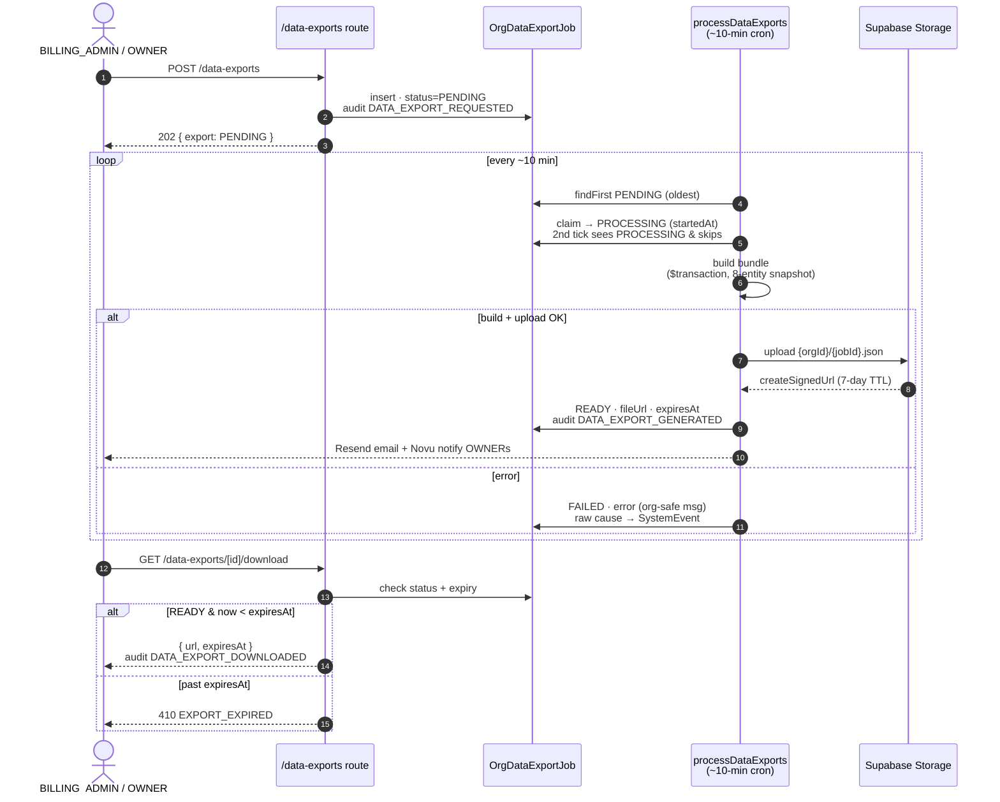

# Org-wide data export (DPDP §11)

Familiarise honours DPDP §11 right-to-access at the organization level
via an async export job (the `OrgDataExportJob` model). OWNER +
BILLING_ADMIN can request a JSON bundle of every entity scoped to their
org; the worker builds the bundle, uploads it to Supabase Storage, and
emails the requester with a 7-day signed-URL link.

> DPDP Act §11 (web-validated 2026-06-05) is the data principal's
> right of access: a summary of the personal data being processed plus
> the identities of every Data Fiduciary and Data Processor with whom it
> has been shared. This export is the org-tenant analogue — a full
> snapshot of the org-scoped rows the operator is entitled to. The
> per-data-principal §12 erasure path is a separate flow; see
> [deletion policy](02-deletion-policy.md).
>
> Rule 14 of the DPDP Rules 2025 requires us only to publish the means by
> which such a request is made and the identifier needed to authenticate
> it; it sets **no fixed statutory turnaround** for the access response
> itself. Our asynchronous job model — the request returns `202`, a
> worker builds the bundle out-of-band, and a 7-day signed URL delivers
> it — therefore comfortably satisfies the Rule, and the polling surface
> and rate limit are operational choices rather than compliance
> constraints. None of this is enforceable against an operator of our
> size before **13 May 2027**, when Rule 14 commences eighteen months
> after the 13 November 2025 notification; the intervening runway is the
> build window, and the `OrgDataExportJob` schema is already in place.
> (Source: DPDP Rules 2025 Rule 14, https://www.dpdpa.com/dpdparules/rule14.html;
> commencement Rule 1(4).) Authoritative: [docs/compliance/08-dpdp-and-privacy.md](../../compliance/08-dpdp-and-privacy.md).

## Schema

```prisma
model OrgDataExportJob {
  id                      String              @id @default(cuid())
  organizationId          String
  organization            Organization        @relation(fields: [organizationId], references: [id], onDelete: Cascade)
  requestedByMembershipId String
  status                  OrgDataExportStatus @default(PENDING)
  fileUrl                 String?
  fileSizeBytes           BigInt?
  expiresAt               DateTime?
  error                   String?             @db.Text
  createdAt               DateTime            @default(now())
  startedAt               DateTime?
  completedAt             DateTime?

  @@index([organizationId, createdAt(sort: Desc)])
}

enum OrgDataExportStatus {
  PENDING
  PROCESSING
  READY
  FAILED
  EXPIRED
}
```

`PENDING → PROCESSING → READY` is the green path; `FAILED` carries the
error on the row (org-safe — the raw cause goes to `SystemEvent`, never
the job row); `EXPIRED` is the post-7-day terminal state once the
signed URL has lapsed.

## Lifecycle

The export is **asynchronous on purpose**: the request returns `202`
immediately and a cron builds the bundle out-of-band. The states are
`PENDING → PROCESSING → READY → EXPIRED` (with `FAILED` as the off-ramp).



> **Trade-off — async job + expiring URL, not a synchronous download.**
> The bundle is an 8-entity, full-org snapshot (members, contracts,
> programs, invoices, earnings, payouts, audit log). Streaming that
> inline off the `POST` would hold a request open for an unbounded build
> and pin financial PII in the response buffer. Instead the worker writes
> it to object storage behind a **7-day signed URL** (`createSignedUrl`),
> so the heavy build is off the request path and the PII lives behind a
> short-lived, revocable link rather than a permanent download route. The
> cost is the polling surface (`GET /data-exports` lists recent jobs) and
> the `PENDING → READY` wait — acceptable for a once-per-24h compliance
> artifact. v1 ships **JSON-only** (no zipped JSON+CSV); see "Why
> JSON-only" below.

**Persona — Wipro's compliance officer files a DPDP §11 access
request.** Wipro (a SPONSOR enterprise in the design-partner set) gets a
regulator query and needs a full snapshot of the org-scoped personal
data the platform holds. Their compliance officer — who holds
BILLING_ADMIN, the governance floor these routes require — hits
`POST /data-exports`, gets a `202`, and polls the dashboard until the
job flips `READY`. The 7-day signed URL is long enough to run their
post-export ETL; after that the link lapses to `EXPIRED` and a fresh
request is needed. The §11 *access* path is org-tenant-wide; the
per-data-principal §12 *erasure* path is separate (see
[deletion policy](02-deletion-policy.md)).

## Routes

Three endpoints form the request-poll-download lifecycle of a DPDP §11 export bundle; all are gated to OWNER or BILLING_ADMIN because every bundle contains financial PII.

| Verb | Path | Behaviour |
|---|---|---|
| `POST` | `/api/organizations/[orgId]/data-exports` | Files a request, inserts `OrgDataExportJob(PENDING)`, returns `202 { export }`. |
| `GET` | `/api/organizations/[orgId]/data-exports` | Lists this org's jobs from the last 30 days (take 50), newest first. Polling surface for the dashboard. |
| `GET` | `/api/organizations/[orgId]/data-exports/[exportId]/download` | Resolves the signed URL when `status=READY`. `409 EXPORT_NOT_READY` if not ready; `410 EXPORT_EXPIRED` once past `expiresAt`. Returns `{ url, expiresAt }`. |

All three are gated OWNER + BILLING_ADMIN (`requireOrgBillingAdminOrOwner`)
— export bundles include financial PII, so the same governance floor as
billing-account mutations applies.

The worker logic lives in `scripts/cleanup/process-data-exports.ts`
(`processDataExports`). It is scheduled as a GitHub Actions cron
(`.github/workflows/process-data-exports.yml`, every ~10 min) via the
thin wrapper `jobs/cleanup/process-data-exports.ts`; the same logic is
also reachable as a `CRON_SECRET`-gated manual trigger at
`POST /api/cleanup/process-data-exports`.

## Bundle shape

Flat JSON, schemaVersion `1`. Top-level keys:

```json
{
  "organizationId": "org_xxx",
  "generatedAt": "2026-05-15T10:00:00.000Z",
  "schemaVersion": 1,
  "organization": { ... },
  "members": [ { id, name, email } ],
  "memberships": [ ... ],
  "contracts": [ ... ],
  "programs": [ ... ],
  "invoices": [ ... ],
  "earnings": [ ... ],
  "payouts": [ ... ],
  "auditLog": [ ... ]
}
```

The audit log included reflects the platform-wide retention policy
(7y for INVOICE / PAYOUT / WALLET / CONTRACT / CONSENT; 2y for
everything else — see `scripts/cleanup/prune-audit-logs.ts`). Older
rows have already been pruned by the `prune-audit-logs` cron and are
NOT recoverable through this export.

**Why JSON-only (not zipped JSON+CSV).** The worker ships a single
JSON object, not a zip with a CSV companion set. The DPDP §11 audience
is compliance reviewers who prefer JSON (greppable, no separator-escape
ambiguity), and adding `adm-zip` as a hard dependency is a footprint
hit the caller doesn't need — integrators who want CSV convert locally
(`jq -r '@csv'`). The file naming scheme is forward-compatible, so a
future zip variant keeps the dashboard's download link working. (Note:
a couple of route/schema header comments still say "JSON+CSV" — those
are aspirational; the worker is the behaviour of record and emits JSON.)

The bundle is uploaded to Supabase Storage at
`{bucket}/{orgId}/{jobId}.json` (`bucket` = `SUPABASE_DATA_EXPORT_BUCKET`,
default `org-exports`) with a 7-day `createSignedUrl`.

## Rate limit

`orgDataExportLimiter` — 1 export per organization per 24 hours
(enforced by the rate limiter, not a DB constraint). The bundle build
is O(N × 8 entities); we don't want a single tenant running 24 exports
a day even if their compliance pipeline allows it.

## Audit trail

Every state transition writes an `OrgAuditLog` row under SYSTEM:

- `DATA_EXPORT_REQUESTED` — at job creation, actor is the requester.
- `DATA_EXPORT_GENERATED` — worker success.
- `DATA_EXPORT_FAILED` — worker error path (carries the message).
- `DATA_EXPORT_DOWNLOADED` — each `GET /download` call.

## Local development

When `NEXT_PUBLIC_SUPABASE_URL` or `SUPABASE_SERVICE_ROLE_KEY` is not
set, the worker writes the bundle to `/tmp/familiarise-data-exports/`
and returns a `file://` URL. The download route refuses to serve
non-http URLs, so the end-to-end happy path requires the Supabase
env vars to be configured even locally.

## Verification

```bash
# As OWNER or BILLING_ADMIN — returns 202
curl -X POST $BASE/api/organizations/$ORG/data-exports \
  -H "Cookie: $OWNER_COOKIE"
# 202 {"export":{"id":"...","status":"PENDING", ...}}

# Trigger the worker manually (the GitHub Actions cron runs it ≤10 min
# otherwise). This HTTP route is CRON_SECRET-gated and shares the global
# Prisma client — it does NOT disconnect, unlike the standalone job wrapper.
curl -X POST $BASE/api/cleanup/process-data-exports \
  -H "Authorization: Bearer $CRON_SECRET"

# Poll until READY
curl $BASE/api/organizations/$ORG/data-exports -H "Cookie: $OWNER_COOKIE"

# Pull download link
curl $BASE/api/organizations/$ORG/data-exports/$EXPORT_ID/download \
  -H "Cookie: $OWNER_COOKIE"
# {"url":"https://...signed-url","expiresAt":"..."}
```
