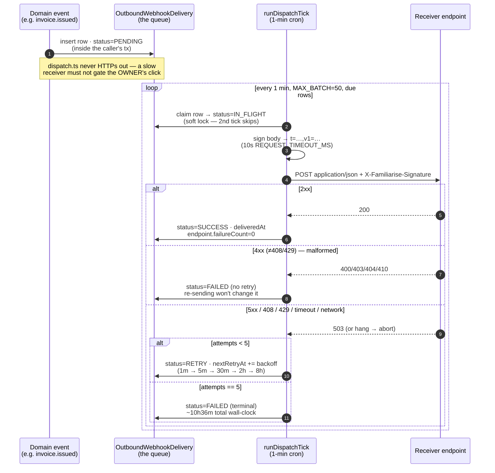
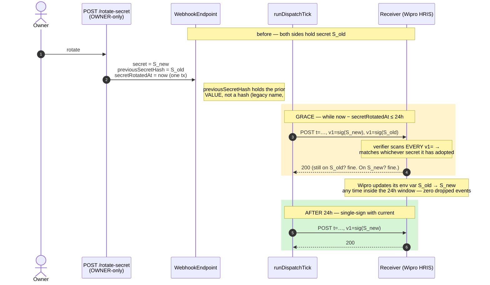

# Outbound webhooks

PR #655 introduces per-organization outbound webhook endpoints so that
external integrations (HRIS, finance ERP, customer-success tools) can
react to lifecycle events without polling the dashboard or scraping the
audit-log export.

> **Outbound, not inbound.** This document is about the events
> Familiarise *sends out* to an integrator's endpoint (rows in
> `OutboundWebhookDelivery`). It is not the same surface as the
> **inbound** Razorpay/RazorpayX gateway webhooks Familiarise *receives*
> (rows in `WebhookEvent`), which back payment idempotency and money
> side-effects; those are documented separately at
> [`../10-money-and-ledger/12-payment-webhooks.md`](../10-money-and-ledger/12-payment-webhooks.md).
> The two share the word "webhook" and nothing else — different table,
> different direction, different signing scheme. The "Jobs & schedule"
> section below spells out which crons touch which table.

## Delivery lifecycle at a glance

A "webhook" here is one row in `OutboundWebhookDelivery` — that table
**is** the queue (no SQS/RabbitMQ; the platform runs on Netlify/Vercel
where a first-class queue is a paid tier — `worker.ts` header, `4b4ce31`).
A domain event inserts a `PENDING` row inside the *same* transaction as
the business mutation, then a 1-minute cron drains it, signs it, POSTs
it, and walks the backoff schedule on failure. The signature header is
`t=<unix-seconds>,v1=<sha256-hex>` — Stripe's scheme, so a receiver
ports its verifier mentally.



The `id` on the body is **the** idempotency key — the same `id` lands
more than once whenever a retry fires, so receivers must dedupe. If the
operator PAUSEs/DISABLEs the endpoint after a row was queued, the worker
marks that row `FAILED` (`worker.ts` `row.endpoint.status !== "ACTIVE"`)
— the explicit pause beats the retry schedule.

> **War story — why fire-and-forget, not a hosted queue.** The obvious
> design is "POST the webhook from the route handler." It was rejected
> on three failure modes spelled out in `dispatch.ts` (`4b4ce31`): a
> slow integrator would leak latency into an OWNER's invoice-issue p99;
> the open POST would hold the Serializable `$transaction` (and its PO /
> wallet row locks) for the receiver's full RTT; and a `4xx` can't roll
> back a `member.added` we already committed. So `dispatchWebhookEvent`
> does one `SELECT` + N `INSERT`s on the caller's own `tx` and returns —
> the receiver's health is fully decoupled from ours. The swap-in to SQS
> later is a single function; everything else stays.

## Event catalog

The catalog is closed. Adding a new event requires the corresponding
emit-point + a doc update; renaming an event is a breaking change to
every receiver.

| Event | Triggered from | Payload highlights |
|---|---|---|
| `member.added` | `POST /api/organizations/[orgId]/members` (in-app invite accept) AND SCIM upsert (Batch 4) | `{ membershipId, userId, role, departmentLabel }` |
| `member.removed` | `DELETE /api/organizations/[orgId]/members/[memberId]` AND SCIM deprovision | `{ membershipId, userId, role, previousStatus }` |
| `invoice.issued` | `POST .../billing-account/invoices` when `issueImmediately=true` | `{ invoiceId, invoiceNumber, totalPaise, displayCurrency, dueDate, purchaseOrderId?, contractId? }` |
| `invoice.paid` | Razorpay payment webhook flips invoice status to `PAID` | `{ invoiceId, invoiceNumber, paidPaise, paymentId, settledAt }` |
| `payout.completed` | RazorpayX `payout.processed` webhook → status PAID | `{ payoutId, totalPaise, currency, payoutReference, settledAt }` |
| `payout.failed` | RazorpayX `payout.failed` OR `payout.reversed` webhook | `{ payoutId, reason, lastError }` |
| `contract.signed` | Contract status transition `DRAFT → ACTIVE` | `{ contractId, status, effectiveFrom, totalAmountPaise? }` |
| `program.assigned` | `ProgramAssignment.create` (in-app + SCIM-driven) | `{ programId, membershipId, periodStart, periodEnd }` |

## Receiver contract

Every delivery is a `POST` with `Content-Type: application/json` and:

```
X-Familiarise-Signature: t=<unix-seconds>,v1=<sha256-hex>
User-Agent: Familiarise-Webhooks/1.0
```

Body shape:

```json
{
  "id": "del_xxxx",        // OutboundWebhookDelivery.id
  "type": "invoice.issued",
  "createdAt": "2026-05-15T10:00:00.000Z",
  "data": { ... event-specific payload ... }
}
```

The `id` field is **the** idempotency key. Receivers MUST store the IDs
they've already processed and skip duplicates — our retry schedule WILL
deliver the same `id` more than once if your endpoint responds with 5xx
or times out.

## Signature verification

The signature scheme mirrors Stripe's (`t=<unix>,v1=<hex>`) so any
language with HMAC-SHA256 + a string concat + a constant-time compare
can verify in <20 lines.

Reference implementation (Node):

```ts
import { createHmac, timingSafeEqual } from "node:crypto";

const REPLAY_WINDOW_SECONDS = 9 * 60 * 60; // match producer

function verify(secret: string, body: string, header: string): boolean {
  const parts = header.split(",");
  const t = parts.find(p => p.startsWith("t="))?.slice(2);
  // Scan EVERY v1= entry, not just the first: during a secret rotation
  // we emit two (current + previous) — see "Secret rotation" below. A
  // receiver matching only the first signature would reject deliveries
  // signed with the secret it hasn't adopted yet.
  const v1s = parts.filter(p => p.startsWith("v1=")).map(p => p.slice(3));
  if (!t || v1s.length === 0) return false;
  if (Math.abs(Date.now() / 1000 - Number(t)) > REPLAY_WINDOW_SECONDS) return false;
  const expected = createHmac("sha256", secret).update(`${t}.${body}`).digest();
  return v1s.some(v1 => {
    const received = Buffer.from(v1, "hex");
    return received.length === expected.length && timingSafeEqual(received, expected);
  });
}
```

The replay window (`DEFAULT_REPLAY_WINDOW_SECONDS` in `signing.ts`)
must be **at least 9 hours** because our retry schedule (1m / 5m / 30m
/ 2h / 8h) means the same signature can land at +8h after creation. A
receiver with a tighter window will mis-reject late retries. (Stripe's
own default tolerance is 5 minutes — web-validated 2026-06-05 — but
Stripe redelivers on a much longer, separate schedule; our 9h window
is sized to our in-band 8h backoff tail, and the rationale is sound.)

## Secret rotation — the 24h dual-sign grace window 🔒

Rotating a secret would normally break every in-flight receiver the
instant the new secret lands: the receiver is still verifying with the
old one. To make rotation a non-event, the worker **dual-signs** during
a grace window.

`WebhookEndpoint` carries two rotation columns:

- `secretRotatedAt` — stamped at the moment of rotation.
- `previousSecretHash` — despite the name, holds the **previous secret
  value** (not a hash) for the duration of the window so the worker can
  re-sign with it. The name is legacy; it gets renamed at the next
  schema reset (#768).

`WEBHOOK_ROTATION_GRACE_MS = 24h` (`signing.ts`). While
`now - secretRotatedAt ≤ 24h` AND `previousSecretHash` is non-null, the
worker emits **both** signatures as repeated `v1=` entries:

```
X-Familiarise-Signature: t=<unix>,v1=<sig-with-current>,v1=<sig-with-previous>
```

A receiver running the body through either secret matches one of the
listed `v1=` values — exactly how Stripe/Svix list multiple signatures
during their own rotation overlap (web-validated 2026-06-05: Stripe
signs with both old and new secrets during a configurable overlap and
SDK verifiers accept either). The reference verifier in
[Signature verification](#signature-verification) already iterates every
`v1=`, so a standard implementation Just Works. After 24h the worker
drops back to single-signing with the current secret.

End-to-end this is wired: `POST /rotate-secret` mints a fresh 32-byte
secret, copies the prior `secret` into `previousSecretHash`, and stamps
`secretRotatedAt` inside one transaction (plus a `WEBHOOK_SECRET_ROTATED`
audit row with `graceWindowHours: 24`); the worker reads those columns
on every tick and dual-signs accordingly. The new secret is returned
**once** in the rotate response — the dashboard surfaces a copy-now
affordance because subsequent GETs redact it.



> **War story — rotation as a non-event (the Stripe/Svix pattern).** The
> naive rotate is "overwrite `secret`, done" — which breaks every
> in-flight receiver the instant it lands, because they're still
> verifying with the old value. We adopted the
> sign-with-both-during-an-overlap pattern that Stripe and Svix use
> (web-validated 2026-06-05: Stripe signs with both old and new secrets
> during a configurable overlap and its SDK verifiers accept either).
> The producer side is `signPayload(secret, body, ts, previousSecret)`
> appending a second `v1=` (`signing.ts`, `WEBHOOK_ROTATION_GRACE_MS =
> 24h`); the consumer side is the reference verifier already iterating
> every `v1=`. Shipped in `e542530` as a follow-up to the base subsystem
> (`4b4ce31`). One stale doc-comment survives on the `WebhookEndpoint`
> schema model claiming the route "overwrites secret directly" — that
> comment pre-dates the grace and is wrong; the route + worker do the
> full dance.

**Persona — Wipro's HRIS endpoint.** Wipro (a SPONSOR enterprise in the
design-partner set) subscribes its HRIS to `member.added` /
`member.removed` so its internal directory mirrors who has an active
seat. Their security team rotates webhook secrets quarterly. Without the
grace window, every quarterly rotation would drop the deliveries in
flight at the cutover instant — a `member.added` lost here means an
engineer who never appears in the HRIS. With the 24h dual-sign, Wipro's
ops rolls the env var whenever it's convenient inside the day, and not a
single membership event is dropped: the worker is signing with both
secrets the whole time.

## Retry semantics

Worker schedule (`lib/enterprise/outbound-webhooks/worker.ts`,
`runDispatchTick`; `MAX_ATTEMPTS = 5`):

| Attempt | Outcome on transient failure | Cumulative wall-clock |
|--------:|------------------------------|-----------------------|
| 1 | RETRY, `nextRetryAt` +1m | 1m |
| 2 | RETRY, +5m | 6m |
| 3 | RETRY, +30m | 36m |
| 4 | RETRY, +2h | 2h 36m |
| 5 | RETRY, +8h | 10h 36m |
| 6 | (`attempts ≥ 5`) → `FAILED` | terminal |

Total wall-clock from first attempt to FAILED is ~10h 36m, which is
why the 9h replay window has headroom to spare. Each delivery POST
carries a 10-second timeout (`REQUEST_TIMEOUT_MS`); a hung receiver is
aborted and treated as a transient network error.

Outcome classification per attempt:

- **2xx** → `SUCCESS`, stamp `deliveredAt`, reset `endpoint.failureCount`.
- **4xx except 408 / 429** (`400`, `403`, `404`, `410`, …) → `FAILED`
  immediately, no retry — the receiver told us the request is malformed
  and re-sending the same body + signature won't change the outcome.
- **5xx / 408 / 429 / network error / timeout** → `RETRY` with the next
  backoff slot, OR `FAILED` if attempt 5 just ran.

If the endpoint was `PAUSED`/`DISABLED` after a delivery was queued,
the worker marks that delivery `FAILED` with a descriptive error —
the operator's explicit pause wins over the retry schedule.

`OutboundWebhookDelivery.status` is the `DeliveryStatus` enum:
`PENDING` (first attempt due) → `IN_FLIGHT` (soft lock during the POST;
a second tick observing IN_FLIGHT skips the row) → `SUCCESS` | `RETRY`
| `FAILED`.

The soft lock is hardened against two failure modes (#812). A worker that
crashes mid-POST would otherwise leave a row stuck in `IN_FLIGHT` forever,
because nothing re-selects that status; the worker now treats an `IN_FLIGHT`
row whose `updatedAt` is older than the stale window as a crashed-mid-delivery
orphan and re-queues it. And because two ticks could both read a `PENDING`
(or stale-`IN_FLIGHT`) row before either flips it, the flip to `IN_FLIGHT`
is a guarded atomic claim — an `updateMany` that only succeeds if the row is
still in the expected state — so a `count === 0` loser skips the row and
overlapping ticks can no longer double-deliver.

## API gate matrix

See `docs/enterprise/00-foundations/04-roles-and-permissions.md` for the canonical
table. Quick view:

| Verb | Path | Gate |
|---|---|---|
| `GET` | `/webhooks` + `/[endpointId]` + `/deliveries` | MANAGER+ |
| `POST` | `/webhooks` (create) | OWNER + BILLING_ADMIN |
| `PATCH` | `/webhooks/[endpointId]` | OWNER + BILLING_ADMIN |
| `POST` | `/webhooks/[endpointId]/deliveries/[deliveryId]/redeliver` | OWNER + BILLING_ADMIN |
| `POST` | `/webhooks/[endpointId]/rotate-secret` | OWNER only |
| `DELETE` | `/webhooks/[endpointId]` | OWNER only |

The OWNER-only floor on `DELETE` and `rotate-secret` is deliberate —
both actions are sensitive from the integrator's perspective (deletion
cascade-drops pending deliveries; rotation starts the 24h dual-sign
grace clock, after which the receiver MUST have adopted the new
secret). BILLING_ADMIN can create endpoints and pause/disable them, but
not rotate or delete.

## Local integration testing

The fastest path to a green receiver:

1. Open https://webhook.site and copy the unique URL.
2. `curl -X POST $BASE/api/organizations/$ORG/webhooks -H "Cookie: $OWNER_COOKIE" -H "Content-Type: application/json" -d '{"url":"<webhook.site URL>","eventSubscriptions":["invoice.issued"]}'`
3. Note the returned `secret` — copy it into webhook.site's "Edit response" if you want to test signature verification, or keep it for the next step.
4. Issue an invoice with `issueImmediately=true`.
5. Wait for the next cron tick (≤1 min) or trigger it manually:
   `curl -X POST $BASE/api/cleanup/dispatch-outbound-webhooks -H "Authorization: Bearer $CRON_SECRET"`
6. Verify webhook.site shows the delivery + the `X-Familiarise-Signature` header.

## Rate limits

- `orgWebhookLimiter` — 5 per minute per org for POST/PATCH/rotate-secret. Org-keyed.
- Worker batch ceiling is `MAX_BATCH = 50` in `worker.ts`, drained on a 1-minute tick. A single tick processes at most 50 due deliveries platform-wide; per-endpoint volume is bounded by the same tick cadence.

## Jobs & schedule

Three GitHub Actions crons touch the webhook surface — and two of them
are about a **different** table, which is a common source of confusion:

| Job (GH Actions wrapper → `scripts/cleanup/*`) | Table | What it does | Cadence |
|---|---|---|---|
| `dispatch-outbound-webhooks` → `runDispatchTick` | **`OutboundWebhookDelivery`** | Drains the delivery queue: signs, POSTs, walks the backoff schedule. The delivery table IS the queue. Emits a `WEBHOOK` SystemEvent warning if the due-backlog exceeds 200. | every 1 min |
| `sweep-stuck-webhook-events` | **`WebhookEvent`** (inbound) | Re-drives **inbound** Razorpay gateway events left `processed=false` after an `after()`-callback crash, so money side-effects (invoice paid, wallet credited) actually land. Nothing to do with outbound delivery. | every ~10 min |
| `archive-webhook-events` | **`WebhookEvent`** (inbound) | Prunes old inbound gateway events: processed >30d, failed/errored >90d. | weekly |

So: **`dispatch` is the outbound delivery worker; `sweep`/`archive`
operate on the inbound gateway-event ledger** (`WebhookEvent`), which
backs Razorpay/RazorpayX webhook idempotency and is documented with the
payments webhook handlers, not here. The canonical scheduler is GitHub
Actions (`.github/workflows/*.yml`); each `jobs/cleanup/*.ts` wrapper
is a thin GH-Actions shim, and `POST /api/cleanup/<job>` is a
`CRON_SECRET`-gated manual trigger for the same logic.

## Audit trail

Every CRUD action and every delivery final state writes to
`OrgAuditLog` under the `WEBHOOK` category:

- `WEBHOOK_ENDPOINT_CREATED|UPDATED|DELETED|SECRET_ROTATED|PAUSED|RESUMED`
- `WEBHOOK_DELIVERY_SUCCEEDED|FAILED|REDELIVERED`

Filter for these in the audit-log export when investigating
integrator-reported issues.
