# Cross-cutting integrations — enterprise surface map

The enterprise subsystem is not a self-contained module. It plumbs
itself through every existing pre-enterprise subsystem so that an org
operator gets one coherent dashboard view of work their members do,
and so that platform-side jobs (billing crons, payout batches, audit
sweeps, retention sweeps) can treat the org as a tenant.

This doc is the single reference for which subsystems are wired into
enterprise, which are explicitly **not** wired (and why), and which
specific code paths/schema columns connect them. Use it as the answer
to "should this new feature touch enterprise?" and as a triage map
when an org operator reports "X feels broken — does this even know
about orgs?".

## The one-picture map (how it all hangs together)

If you read nothing else, read this. Every box is a pre-enterprise
subsystem; the **enterprise layer** in the centre is the thin tenancy
seam that tags each one with an `Organization`. Edge labels are the
*link* — the column or relation that carries org identity. Box colour
is the integration status (the same ✅/🟡/🔴/⏸ markers the tables below
use). The picture is derived entirely from the verified section tables
that follow — if a box and its section ever disagree, the section wins.

```mermaid
flowchart TB
  ENT["Enterprise tenancy layer<br/>Organization · Membership · Contract"]:::wired

  subgraph BOOK["A · Booking plane"]
    APPT["Appointments<br/>Appointment.organizationId"]:::wired
    DOCR["Docs-for-review<br/>via Appointment"]:::wired
    MEET["Stream meeting/recording<br/>MeetingSession.organizationId"]:::wired
  end

  subgraph MONEY["B · Money plane"]
    PAY["Payments<br/>Payment.organizationId + notes"]:::wired
    WALLET["Wallet<br/>BillingAccount.walletBalance"]:::partial
    PAYOUT["Payouts (HOST)<br/>OrganizationPayout"]:::wired
    INV["Invoicing + PO<br/>OrganizationInvoice / OrgInvoiceCounter"]:::wired
    DUN["BillingSubscription + dunning"]:::partial
    LEDGER["Double-entry ledger<br/>LedgerTransaction / LedgerEntry"]:::wired
  end

  subgraph ACCESS["C · Membership & access"]
    ROLES["Roles · Invitations<br/>Membership.role"]:::wired
    SSO["SSO + domain claims + break-glass<br/>OrganizationSSOSettings"]:::wired
    SCIM["SCIM provisioning"]:::wired
  end

  subgraph PROG["D · Programs & rate plans"]
    PROGRAMS["Programs + cycle engine + overage<br/>Program → Contract"]:::wired
    RATE["RateCards (HOST)<br/>ownerOrgId"]:::wired
    CONTRACT["Contracts (auto-renew/supersede)<br/>Contract.organizationId"]:::wired
  end

  subgraph STREAMSG["E · Stream chat & video"]
    CHAN["Consultation/webinar channels<br/>custom.organization_id"]:::wired
    DM["DM channels"]:::skipped
  end

  subgraph COMP["F · Compliance crons"]
    GST["GST / e-invoice (IRN)<br/>OrganizationTaxInfo"]:::wired
    TDS["TDS<br/>OrganizationPayout.tds*"]:::wired
    MSME["MSME 43B(h)<br/>OrganizationMsmeInfo"]:::wired
    DPDP["DPDP: consent / erasure / export / breach"]:::wired
    HRIS["HRIS provisioning"]:::parked
  end

  subgraph OPS["G · Operational plane"]
    AUDIT["OrgAuditLog (append-only)"]:::wired
    SYSEV["SystemEvent + BetterStack"]:::wired
    NOVU["Notifications (Novu)"]:::wired
    HOOKS["Outbound webhooks (+24h rotation grace)"]:::wired
  end

  DASH["H · Org dashboard — 25 routes<br/>/dashboard/organization/[orgId]/*"]:::wired

  ENT --> BOOK
  ENT --> MONEY
  ENT --> ACCESS
  ENT --> PROG
  ENT --> STREAMSG
  ENT --> COMP
  ENT --> OPS
  ENT --> DASH

  %% Cross-plane edges that carry money/identity truth
  PAY -->|"posts"| LEDGER
  WALLET -->|"Dr CASH / Cr WALLET"| LEDGER
  PAYOUT -->|"withholds TDS"| TDS
  INV -->|"GST split + IRN"| GST
  CONTRACT -->|"1:1"| DUN
  PROGRAMS -->|"hangs off"| CONTRACT
  ROLES -->|"deprovision"| HOOKS
  DPDP -->|"member.removed on erasure"| HOOKS
  AUDIT -->|"raw payloads diverted"| SYSEV

  classDef wired fill:#d6f5d6,stroke:#2e7d32,color:#11270f;
  classDef partial fill:#fff3cd,stroke:#b7791f,color:#3a2f00;
  classDef skipped fill:#f8d7da,stroke:#c0392b,color:#3a0f12;
  classDef parked fill:#e2e3e5,stroke:#6c757d,color:#1c1f23;
```

Legend: 🟢 ✅ Wired · 🟡 🟡 Partial (a sub-surface is designed-not-active —
e.g. wallet mandate auto-charge, dunning suspend cascade) · 🔴 🔴 Skipped
(deliberately not org-aware) · ⚪ ⏸ Parked (schema-ready, impl stubbed
behind a flag or a customer-demand gate). The single most important
property the picture encodes: **money truth always flows *into* the
double-entry ledger** (`B.7`), and every deprovisioning — including a
DPDP erasure — *fans out through outbound webhooks* (`G.4`) so an
external HRIS never desyncs silently.

## How to read this doc

Every subsystem has a status row:

| Marker | Meaning |
|---|---|
| ✅ Wired | Production-ready org-aware. New work should keep this contract. |
| 🟡 Partial | Some surfaces are org-aware; others still single-tenant. PR or follow-up issue should close. |
| 🔴 Skipped | Deliberately NOT org-aware. The rationale below explains why; reopen only with explicit customer demand. |
| ⏸ Parked | Org-aware path exists but is gated behind a flag or deferred until a customer asks. |

Each section also lists:

- **Schema** — Prisma models + key columns that link to `Organization`
- **Code paths** — main `lib/`, `actions/`, `app/api/`, or `jobs/` files
- **Org dashboard surface** — which `/dashboard/organization/[orgId]/*` route exposes it (if any)
- **Why** — the design reason, in one paragraph
- **Future work** — open GitHub issue numbers (no URLs — GitHub autolinks)

---

## A. Booking & appointment plane

### A.1 Appointments — ✅ Wired

- **Schema:** `Appointment.organizationId` (denorm, `#674` scope split). Stamped at checkout when the booker is an org-funded membership.
- **Code paths:** [`lib/payments/operations/checkout.ts`](../../../lib/payments/operations/checkout.ts) (1737–1805 derives org context); [`app/api/organizations/[orgId]/appointments`](../../../app/api/organizations/[orgId]/appointments) (org-scoped read).
- **Org dashboard surface:** `/dashboard/organization/[orgId]/appointments`
- **Why:** Appointment is the lowest-cardinality booking artifact. Tagging it directly (rather than back-deriving from `Payment.organizationId`) keeps org-scoped queries on a single composite index and unblocks per-org appointment audit dashboards.
- **Future work:** none open.

### A.2 Bookings (checkout flow) — ✅ Wired

- **Schema:** `Payment.organizationId`, `Payment.billingAccountId`, `Payment.billableToOrgInvoiceId`, `BookingUtilization.programAssignmentId` → `Program.contractId` → `Contract.organizationId`. Wallet debits via `walletDebit()` (`lib/api/organizations/wallet.ts`).
- **Code paths:** [`lib/payments/operations/checkout.ts`](../../../lib/payments/operations/checkout.ts) routes the four funding modes (PERSONAL/WALLET/INVOICE/LICENSE) — see the funding-and-programs doc for the rules. `BookingUtilization` is written inside the same `tx` as the appointment create so program-cap state and the booking commit together.
- **Org dashboard surface:** `/billing`, `/reimbursements`, `/programs`.
- **Why:** Money and entitlement state share one Serializable transaction so a crash mid-booking can never produce a debit without a booking or a booking without a debit.
- **Future work:** `#716` refund/payouts/pricing epic (parked).

### A.3 Documents-for-review — ✅ Wired

- **Schema:** Inherited via `AppointmentDocument.appointmentId → Appointment.organizationId`. No direct FK on the document row.
- **Code paths:** [`lib/api/scope/list-documents.ts`](../../../lib/api/scope/list-documents.ts); [`app/dashboard/organization/[orgId]/documents/page.tsx`](../../../app/dashboard/organization/[orgId]/documents/page.tsx).
- **Org dashboard surface:** `/documents`
- **Why:** Documents are 1:1 (or 1:N) with appointments. Inheritance avoids drift between document and parent-appointment tenancy. Bulk-review queries must filter on `Appointment.organizationId`, never application-side.
- **Future work:** none open.

### A.4 Bookings — Stream meeting/video — 🟡 Partial → ✅ as of `#674` C.4

- **Schema:** `MeetingSession.organizationId` (denorm, added in C.4 migration `20260528_meeting_session_organization_id_denorm`). `Recording.organizationId` already denormalized in PR `#655`.
- **Code paths:** [`actions/stream/meetings/meeting.action.ts`](../../../actions/stream/meetings/meeting.action.ts) writes `organizationId` at create; [`app/api/organizations/[orgId]/stream/calls/route.ts`](../../../app/api/organizations/[orgId]/stream/calls/route.ts) indexes directly on `(organizationId, createdAt)` instead of joining through `SlotOfAppointment`.
- **Org dashboard surface:** `/recordings`
- **Why:** Org admins need audit + retention queries that are constant-time per page load. Network round-trips to Stream's `queryCalls` are too slow for a dashboard list view; the local join-free path is what makes the surface viable.
- **Future work:** Stream transcription retention enforcement remains global; per-org retention only applies to recordings today.

---

## B. Money plane

### B.1 Payments — ✅ Wired

- **Schema:** `Payment.organizationId`, `Payment.fundingSource` (via webhook attribution), `Payment.billingAccountId`. Razorpay order `notes` now carry `organizationId` + `fundingSource` on org-sponsored bookings (C.1, `#687`).
- **Code paths:** [`lib/payments/core/razorpay.ts`](../../../lib/payments/core/razorpay.ts); [`lib/payments/operations/checkout.ts:buildPaymentMetadata`](../../../lib/payments/operations/checkout.ts); [`app/api/webhooks/utils.ts`](../../../app/api/webhooks/utils.ts) reads `notes.organizationId` for credit-purchase, invoice-payment, and refund flows.
- **Why:** The gateway notes are a server-side proof that the booker's claimed org matches the gateway's record. Without them, a `#687` invoice-fraud reconciler would need a DB lookup per webhook to verify org attribution; with them, the verification is a string compare inside the webhook handler.
- **Future work:** PR-3 webhook reconciler to cross-check `notes.organizationId` against `Payment.organizationId` and surface drift in `SystemEvent`.

### B.2 Wallet — ✅ Wired (auto-top-up floor wired; mandate auto-charge 🟡 designed-not-active)

- **Schema:** `BillingAccount.walletBalance` (derived cache), `WalletTopUp` (top-up lifecycle, keyed by `providerOrderId @unique`), and the org's WALLET `LedgerAccount` (credit-normal) holding one `LedgerEntry` per cash movement. Auto-top-up columns: `{minBalancePaise, autoTopUpEnabled, autoTopUpAmountPaise, autoTopUpMandateId, autoTopUpLastFiredAt}` (#777 §C). Note: the threshold is `minBalancePaise` — there is no `walletFloorPaise`.
- **Code paths:** [`lib/api/organizations/wallet.ts`](../../../lib/api/organizations/wallet.ts) — `walletDebit()`/`walletCredit()` move the cached balance; `initiateTopUp()`/`confirmTopUp()` drive the `WalletTopUp` lifecycle. A confirmed top-up posts one balanced `LedgerTransaction` (`Dr CASH / Cr WALLET`) via [`postLedgerTxn`](../../../lib/payments/ledger/post.ts) inside the same `tx`. [`jobs/billing/wallet-low-balance.ts`](../../../jobs/billing/wallet-low-balance.ts) scans accounts whose `walletBalance < minBalancePaise` and notifies (one alert per `autoTopUpLastFiredAt` cooldown).
- **Org dashboard surface:** `/billing`
- **Why:** The journal (`ledger-and-postings`) is the source of truth; `walletBalance` is a cache asserted against the WALLET account by the reconciler (`WALLET_BALANCE_DRIFT`). `LedgerAccount.currency` exists so a future multi-currency wallet (`#711`) doesn't need a backfill against historical postings.
- 🟡 **Designed-not-active:** the low-balance cron today only *alerts*; the gateway-mandate auto-charge (`autoTopUpMandateId`/`autoTopUpAmountPaise`) is a TODO(`#777`) pending Razorpay recurring mandates — those two columns are unused by the cron until then.
- **Future work:** Mandate auto-charge (`#777`); multi-currency wallets (`#711`, parked).

### B.3 Payouts — ✅ Wired (HOST orgs)

- **Schema:** `OrganizationPayout`, `OrganizationEarnings`, `OrganizationPayoutAccount` (encrypted account number). TDS columns on the payout row.
- **Code paths:** [`scripts/payouts/create-payout-batch.ts`](../../../scripts/payouts/create-payout-batch.ts) loops per canHost org; [`lib/payments/payouts/org-payout-service.ts:markOrgPayoutCompleted`](../../../lib/payments/payouts/org-payout-service.ts) does the idempotent PROCESSING → COMPLETED transition and fires the Novu notify (`#718`).
- **Org dashboard surface:** `/payouts`
- **Why:** Payouts run as a weekly batch; per-org idempotency keys ensure re-running the cron in the same window is a no-op. The Novu fan-out is co-located with the status transition so a future status-change call site cannot silently forget to notify.
- **Future work:** Live RazorpayX submission + Stripe Connect `transfers` (PR-3 territory, deferred). Webhook reconciler.

### B.4 Invoicing — ✅ Wired

- **Schema:** `OrganizationInvoice` (per-org sequential numbering via `OrgInvoiceCounter`). GST breakdown columns (`igstPaise`/`cgstPaise`/`sgstPaise`/`placeOfSupply`). IRP fields (`irn`, `ackNumber`, `signedQrPayload`, `irpStatus`, `irpRetryCount`).
- **Code paths:** [`app/api/organizations/[orgId]/billing-account/invoices/route.ts`](../../../app/api/organizations/[orgId]/billing-account/invoices/route.ts) (POST with race-safe PO decrement); [`jobs/billing/generate-subscription-invoices.ts`](../../../jobs/billing/generate-subscription-invoices.ts) (cycle billing).
- **Org dashboard surface:** `/billing`
- **Why:** Atomic counter under `(organizationId, fiscalYear)` makes concurrent invoice issuance race-safe. The PO balance decrement is wrapped in the same transaction with a `gte` overflow guard so two simultaneous issuances cannot overdraw an authorised PO.
- **Future work:** Form 26Q quarterly TDS filing; multi-attendee per-place-of-supply billing (both parked).

### B.5 Purchase Orders — ✅ Wired

- **Schema:** `PurchaseOrder.organizationId`, `PurchaseOrder.remainingAmountPaise` (race-safe decrement at invoice issuance; race-safe increment on void/cancel).
- **Code paths:** [`app/api/organizations/[orgId]/billing-account/purchase-orders/route.ts`](../../../app/api/organizations/[orgId]/billing-account/purchase-orders/route.ts); invoice-side decrement in [`app/api/organizations/[orgId]/billing-account/invoices/route.ts`](../../../app/api/organizations/[orgId]/billing-account/invoices/route.ts) (lines 210-230).
- **Org dashboard surface:** `/purchase-orders`
- **Why:** Indian enterprise orgs frequently require a PO before an invoice can be issued. The atomic decrement pattern mirrors the wallet-debit `where: { remaining: { gte: amount } }` discipline.
- **Future work:** none open.

### B.6 BillingSubscription + dunning (LICENSE/INVOICE recurring) — ✅ Wired (suspension cascade behind `ENABLE_DUNNING_SUSPEND`)

- **Schema:** `BillingSubscription` (linked 1:1 to `Contract`). `BillingSubscription.renewalReminderSentAt` (once-per-cycle gate for renewal-upcoming notification, C.5). Dunning state on `OrganizationInvoice` (`markedOverdueAt`, `dunningReminderCount`, `lastDunningReminderAt`, `dunningSuspendedAt`).
- **Code paths:**
  - Invoicing: [`jobs/billing/generate-subscription-invoices.ts`](../../../jobs/billing/generate-subscription-invoices.ts) — `sendRenewalReminders()` then cycle-advance + invoice transaction (invoice-paid postings land via `postLedgerTxn` when the payment confirms).
  - **Dunning** (#779 §A/§D, #812): [`jobs/billing/dunning.ts`](../../../jobs/billing/dunning.ts) — Stage 1 flips past-due ISSUED invoices to OVERDUE; Stage 2 sends escalation reminders on a 7-day cadence, capped at 3 (`MAX_REMINDERS = 3`); Stage 3 (`ENABLE_DUNNING_SUSPEND`-gated) stamps `dunningSuspendedAt` 7 days past the last reminder, claim + audit in one Serializable transaction. DEACTIVATED orgs are skipped.
- **Org dashboard surface:** `/billing` (Annual License panel)
- **Why:** A daily cron handles renewal-upcoming notification (7 days before `nextInvoiceDate`), renewal-day invoice creation, and OVERDUE dunning. Same idempotency pattern (conditional `updateMany` claim) throughout so no row is double-charged or double-reminded.
- 🟡 **Config-gated off by default:** the **booking-suspend cascade** (Stage 3) only runs when `ENABLE_DUNNING_SUSPEND` is set (#812); with the flag unset, dunning stays notify-only and `dunningSuspendedAt` is never written.
- **Future work:** none open on this surface — invoicing now runs on a GitHub Actions schedule (`generate-subscription-invoices` daily, `settle-invoice-accruals` monthly, #813) and the suspend cascade ships behind its flag.

### B.7 Double-entry ledger discipline — ✅ Wired

- **Schema:** money journal — `LedgerAccount` (10 kinds: CASH, WALLET, PLATFORM_FEE, PLATFORM_PROMO, DISCOUNT, CONSULTANT_PAYABLE, ORG_PAYABLE, ORG_RECEIVABLE, TDS_PAYABLE, GST_PAYABLE) / `LedgerTransaction` (`idempotencyKey @unique`) / `LedgerEntry` (DEBIT|CREDIT, `amountPaise` BigInt) — plus the usage ledger `UsageLedgerEntry` and `LedgerReconciliationReport`.
- **Code paths:** every money-moving site posts one balanced `LedgerTransaction` (`Σ DEBIT == Σ CREDIT`) via [`postLedgerTxn`](../../../lib/payments/ledger/post.ts). Reconcile cron [`scripts/reconcile/reconcile-ledgers.ts`](../../../scripts/reconcile/reconcile-ledgers.ts) (also the `jobs/reconcile/reconcile-ledgers.ts` entry point) asserts journal + aggregate invariants nightly.
- **Why:** See `ledger-and-postings`. Two ledgers (money journal + `UsageLedgerEntry`), not three. The journal is append-only; any reversal is a balanced counter-transaction, never an update of the original.
- **Future work:** none open.

---

## C. Membership & access

### C.1 Roles & Permissions — ✅ Wired

- **Schema:** `Membership.role` (7-role ladder: OWNER → MAINTAINER → BILLING_ADMIN → MANAGER → EXPERT → SUPPORT → LEARNER). `MemberRole` enum.
- **Code paths:** [`lib/auth-helpers.ts:requireOrgAccess`](../../../lib/auth-helpers.ts) + [`lib/auth/billing-admin-gate.ts`](../../../lib/auth/billing-admin-gate.ts). Role-transition reconciliation in [`lib/api/organizations/membership-transitions.ts`](../../../lib/api/organizations/membership-transitions.ts).
- **Why:** Role rank decides not just permission but profile reconciliation — LEARNER lazy-creates `ConsulteeProfile`, EXPERT lazy-creates `ConsultantProfile`. The bridge ensures consultant earnings and consultee bookings work the moment a role flip commits.
- **Future work:** none open.

### C.2 Invitations — ✅ Wired

- **Schema:** BetterAuth `Invitation` table bridged to `Membership` at accept time. `OrgDomainClaim` for SSO auto-join.
- **Code paths:** [`app/api/organizations/[orgId]/invitations/route.ts`](../../../app/api/organizations/[orgId]/invitations/route.ts). `HostInvitableMemberRoleSchema` extends the standard list with EXPERT when the org is `canHost=true` (`#729`).
- **Org dashboard surface:** `/invitations`
- **Why:** Self-service add of EXPERT is gated to canHost orgs at the schema level so a sponsor-only org cannot accidentally onboard a consultant.
- **Future work:** Partial-unique index on `(email, organizationId)` waiting on Prisma 7 GA (`#747`).

### C.3 OrgWorkspace (cross-org operator) — ✅ Wired

- **Schema:** `OrgWorkspaceProfile` (1:1 with `User`, mirrors `ConsultantProfile`/`StaffProfile`). Preference columns: `defaultLandingOrganizationId`, `notificationRoutingMode`, `locale`, `currencyDisplayCode`.
- **Code paths:** [`app/dashboard/org-workspace/`](../../../app/dashboard/org-workspace) — 5 pages.
- **Why:** A single human can operate multiple orgs (consultancy with several clients). The workspace profile lets the session carry the operator's preferences across the orgs they have access to, without polluting `Membership` (which is per-org).
- **Future work:** none open.

### C.4 SSO + Domain Claims + break-glass — ✅ Wired

- **Schema:** `OrganizationSSOSettings.{enforceSSO, breakGlassUntil}` (#779 §E), `OrgDomainClaim` (DNS TXT verification), SAML provider rows.
- **Code paths:** [`lib/sso/provider-schemas.ts`](../../../lib/sso/provider-schemas.ts) — `validateSamlCert` PEM check that fails closed before BetterAuth sees a malformed cert. [`app/api/auth/sso/domain-check/route.ts`](../../../app/api/auth/sso/domain-check/route.ts). **Break-glass** (#779 §E): [`app/api/organizations/[orgId]/sso/break-glass/route.ts`](../../../app/api/organizations/[orgId]/sso/break-glass/route.ts) stamps `breakGlassUntil`; [`lib/sso/enforce-session.ts`](../../../lib/sso/enforce-session.ts) skips the `enforceSSO` gate while `breakGlassUntil > now` so a locked-out admin can recover when the IdP is down.
- **Org dashboard surface:** `/settings/sso`, `/domain-claims`
- **Why:** Domain verification via TXT + cert PEM validation means the org provisioning surface fails fast and friendly instead of crashing BetterAuth at first assertion. Break-glass closes the "enforced SSO + dead IdP = nobody can log in" trap without disabling enforcement permanently.
- **Future work:** OIDC live deployment (`#670`/`#672`, deferred); cert auto-rotation runbook.

### C.6 Org verification resubmit — ✅ Wired

- **Schema:** `Organization.status` (`OrgStatus`, e.g. `PENDING_VERIFICATION`) plus the verification stamps `{verificationReason, verificationSubmittedAt, verificationRejectedAt}` — no RESUBMIT enum value; resubmit is a state transition, not an enum.
- **Code paths:** [`app/api/organizations/[orgId]/verification/resubmit/route.ts`](../../../app/api/organizations/[orgId]/verification/resubmit/route.ts) (#779 §A) — only a previously-rejected, still-pending org can resubmit (`NOTHING_TO_RESUBMIT` guard otherwise); re-stamps `verificationSubmittedAt` and writes a `VERIFICATION_RESUBMITTED` audit row.
- **Why:** Self-serve recovery after an admin rejection, instead of forcing a support ticket to re-open the KYB review.
- **Future work:** none open.

### C.5 SCIM provisioning — ✅ Live

- **Schema:** `ScimToken`, `ScimGroupMapping`.
- **Code paths:** The SCIM 2.0 endpoints are implemented under `/scim/v2/**`, authenticated by bearer token (`requireScimAuth`, `lib/scim/auth.ts`). Tokens are stored as SHA-256 hashes, scoped to an org, and honour an optional `expiresAt` deadline — an expired token stops authenticating with a 401 while its row stays ACTIVE so an operator can see it lapsed (#789). Earlier docs describing SCIM as "parked / stubbed 501" are stale.
- **Future work:** Rotation-reminder cron over `ScimToken.expiresAt` (the enforcement read already ships).

---

## D. Programs & rate plans

### D.1 Programs — ✅ Wired (LICENSED_SEAT + CREDIT_POOL, cycle engine, overage)

- **Schema:** `Program.{configLockedAt, archivedAt}`, `LicensedSeatConfig.{overageSurchargeBps, maxOveragePerCyclePaise}`, `CreditPoolConfig`, `ProgramAssignment.{consumedPaise, status, rolledToAssignmentId, rolledAt}`, `BookingUtilization`, `OverageEvent` (append-only; `OverageChargeStatus {PENDING, ACCRUED, CHARGED, BLOCKED, REVERSED, FAILED}` + timeout telemetry).
- **Code paths:**
  - Cap-enforce + engagement-debit: [`lib/api/organizations/program-helpers.ts:recordBookingUtilization`](../../../lib/api/organizations/program-helpers.ts); per-plan-type `engagementsForCap` in [`lib/payments/operations/checkout.ts`](../../../lib/payments/operations/checkout.ts).
  - **Cycle engine + rollover** (#779 §A/§B): [`lib/enterprise/cycle-engine.ts`](../../../lib/enterprise/cycle-engine.ts) + [`jobs/billing/advance-program-cycles.ts`](../../../jobs/billing/advance-program-cycles.ts) — advances cycles and rolls unused entitlement onto the next assignment (`rolledToAssignmentId`/`rolledAt`), killing the zombie-assignment problem.
  - **Overage** (#778/#779): the `OverageEvent` ledger splits `marginalPaise == basePaise + surchargePaise`; CHARGE_MEMBER settles instantly, CHARGE_ORG rolls into the renewal invoice. The per-cycle circuit breaker (`maxOveragePerCyclePaise`) flips overruns to `BLOCKED`; abandoned CHARGE_MEMBER side-payments time out → `FAILED` via [`jobs/billing/timeout-member-overages.ts`](../../../jobs/billing/timeout-member-overages.ts) (sweep also at `jobs/cleanup/sweep-abandoned-overage-charges.ts`).
- **Org dashboard surface:** `/programs` (incl. overage view)
- **Why:** Cap modes (BLOCK / CHARGE_MEMBER / CHARGE_ORG) and the engagement-counter pattern are in `programs`. The booking transaction owns both the cap decision and the appointment commit; the cycle cron owns rollover + overage roll-up.
- **Future work:** Programs v2 (PROJECT/RETAINER) parked behind `PROGRAM_TYPE_NOT_AVAILABLE` rejection guard (`#681` parked).

### D.2 RateCards — ✅ Wired (canHost orgs)

- **Schema:** `RateCard` with FK `ownerOrgId → organizations(id)` (`#728` fix landed in PR `#682`-era migration `20260427052712`). 7-level override chain (org-default → contract → plan-type → plan-id → membership-override).
- **Code paths:** [`lib/api/organizations/rate-card.ts:bumpRateCard`](../../../lib/api/organizations/rate-card.ts) — append-only `effectiveFrom` writes, never UPDATE. BPS snapshot on `BookingUtilization` so a rate-card change doesn't retroactively alter historical revenue split.
- **Org dashboard surface:** `/settings/rate-cards` (canHost only)
- **Why:** Settlement reads the BPS snapshot from the utilization row, not the live rate card, so an org changing its split doesn't restate past earnings.
- **Future work:** none open.

### D.3 Contracts — ✅ Wired (incl. auto-renew / supersede / end-early)

- **Schema:** `Contract` (status machine DRAFT → ACTIVE → EXPIRED/TERMINATED), `paymentTermsDays`, `autoRenew`, plus the v2 lifecycle columns `{supersededByContractId, supersededAt, supersessionReason, autoRenewedAt}` (#779 §A/§C).
- **Code paths:**
  - Create: [`app/api/organizations/[orgId]/contracts/route.ts`](../../../app/api/organizations/[orgId]/contracts/route.ts) handles LICENSE-funded create as an atomic Contract + BillingSubscription write so the dashboard never sees half-configured LICENSE state (`#756`).
  - **Auto-renew** (#779 §A): [`jobs/contracts/auto-renew-contracts.ts`](../../../jobs/contracts/auto-renew-contracts.ts) stamps `autoRenewedAt` and extends the term; [`jobs/contracts/expire-contracts.ts`](../../../jobs/contracts/expire-contracts.ts) transitions lapsed contracts to EXPIRED. Together these kill the zombie-assignment problem (assignments outliving a dead contract).
  - **Supersede / end-early** (#779 §A): supersession links the replacement via `supersededByContractId` + reason; end-early is a guarded status transition (see anti-lockout #7 in [deletion-policy](02-deletion-policy.md)).
- **Org dashboard surface:** `/contracts`
- **Why:** A LICENSE contract without a BillingSubscription is incoherent; bundling them in one transaction means the Get-Started checklist on `/home` doesn't need a retry path. Renewal/expiry/supersession run on contract crons so the lifecycle advances without an operator click.
- **Future work:** none open.

---

## E. Stream chat & video

### E.1 Stream consultation/webinar/class channels — ✅ Wired

- **Schema:** No Prisma fields — Stream stores channels externally. Org tagging is `custom.organization_id` on the Stream channel.
- **Code paths:** [`actions/stream/chat/channel.action.ts`](../../../actions/stream/chat/channel.action.ts) — `createConsultationChannel`, `createSubscriptionChannel`, `createWebinarChannel`, `createClassChannel`. Each accepts an optional `organizationId` override; otherwise falls back through `plan.organizationId` → `appointment.organizationId` (C.3) → null.
- **Why:** Plan-level org covers org-hosted plans; appointment-level org covers org-funded bookings on platform plans. Combined, the chain catches the 2 customer-relevant cases without false positives on personal bookings.
- **Future work:** none open.

### E.2 Stream DM (direct message) channels — 🔴 Skipped

- **Code paths:** [`actions/stream/chat/channel.action.ts:createDirectMessageChannel`](../../../actions/stream/chat/channel.action.ts).
- **Why:** DMs are private 1:1 communication. Tagging them with org context creates a surveillance surface (org admins could query "DMs my members had with consultants"). Org-tagged consultation channels already cover the legitimate audit need.
- **Future work:** none. Reopen only if a customer with a documented compliance requirement asks.

### E.3 Stream video / MeetingSession — ✅ Wired (C.4)

See A.4. Recording retention sweeps per-org via `Organization.streamRecordingRetentionDays` in [`scripts/cleanup/cleanup-old-stream-recordings.ts`](../../../scripts/cleanup/cleanup-old-stream-recordings.ts).

---

## F. Compliance

### F.1 GST — ✅ Wired

- **Schema:** `OrganizationTaxInfo.{gstin, gstStateCode, gstRegStatus, hsnDefault}` (1:1 carve-out off the `Organization` God-Model, #768); GST columns on `OrganizationInvoice` (`igstPaise`/`cgstPaise`/`sgstPaise`/`placeOfSupply`). Refund-driven `CreditNote` (sequential per-org, CGST Rule 53) + monthly `GstTcsBatch` / `GstTcsAdjustment` for GSTR-8 (#778 §D).
- **Code paths:** [`lib/compliance/gst.ts:deriveGstBreakdown`](../../../lib/compliance/gst.ts); credit notes via [`lib/payments/operations/refund.ts:mintRefundCreditNote`](../../../lib/payments/operations/refund.ts) (idempotent on `CreditNote.refundId @unique`) + [`lib/payments/billing/credit-note-numbering.ts`](../../../lib/payments/billing/credit-note-numbering.ts).
- **Why:** Place-of-supply rules require a supplier-versus-buyer state comparison; the helper returns either CGST+SGST (intra-state) or IGST (inter-state), and the supplier state is env-overridable so a registered-office move does not require a code change. Invoice numbering satisfies CGST Rule 46(b) — a consecutive serial, unique per IST financial year — via the atomic per-(org, FY) counter; credit notes satisfy Rule 53's separate-series-plus-original-invoice-reference discipline.
- **Future work:** Live GSTIN registry verification API (format-only validation today, parked); GST TCS collection + GSTR-8 filing flag-gated pending CA sign-off. Two compliance gaps tracked for launch (no issue filed yet): the credit-note format `<PREFIX>-CN-<FY>-<SEQ>` can overflow Rule 53's 16-character cap for prefixes longer than three characters; and once AATO crosses ₹5 crore, credit/debit notes become IRN-reportable as `CRN`/`DBN`, which the payload mapper (hardcoded `Typ:"INV"`) and the `CreditNote` model (no IRP columns) do not yet support. See [01-compliance-dpdp-gst-tds-msme.md](01-compliance-dpdp-gst-tds-msme.md) §1.

### F.2 TDS — ✅ Wired (Section default + reversal)

- **Schema:** TDS columns on `OrganizationPayout` / `ConsultantPayout` (`tdsSectionApplied`, `tdsAmountPaise`, `mustPayByDate`, `form15caPartCRef`, etc.); `TDSRecord` for Form 26Q (now also carrying signed `isReversal` rows for refund reversals); the richer `TdsAdjustment` consolidation model is still schema-only (#778 §D).
- **Code paths:** [`lib/compliance/tds.ts`](../../../lib/compliance/tds.ts) — `computeTdsForPayout` (pure; `DEFAULT_SECTION = "194O"`); refund reversals go through `recordTdsReversal` in [`lib/payments/tax/tds-service.ts`](../../../lib/payments/tax/tds-service.ts), which writes the negative `TDSRecord` (capped, filed-aware FY/quarter, #813).
- **Why:** Section selection (194J vs 194O vs 194C) currently defaults to 194O, and full derivation including expert-status checks is `#713`; refund reversals write a negative line for the next quarter's revised return, and the admin TDS surface is gated by `ENABLE_TDS_ADMIN_VIEW`. The withholding *rates* are current under the Income-tax Act 2025 (in force 1 April 2026, which consolidated the 194-series and §195 into a single **Section 393**), so the `194O`/`194J`/`194C` labels remain correct as internal classification keys. What changes is the filing boundary: a deduction dated on or after 1 April 2026 must be filed citing the §393 payment code (Form 140 / 144, formerly 26Q / 27Q), not the legacy section string, and the no-PAN 5% rate now derives from §397(2) rather than a 194-O-internal carve-out. Authoritative: [docs/compliance/01-tds-overview.md](../../compliance/01-tds-overview.md).
- **Future work:** Section selection logic (`#713`); FVU export for `TdsAdjustment` (#778 §F deferred), which is where the §393-code translation and Form 140/144 naming belong — the numeric 10xx codes are not yet reliably published and must not be hard-coded until the CBDT challan/RPU schema is confirmed; Form 140 (formerly 26Q) quarterly filing (parked).

### F.3 MSME — ✅ Wired

- **Schema:** `OrganizationMsmeInfo.{msmeStatus, msmeWrittenAgreementOnFile}` (1:1 carve-out, #771 D10); `OrganizationPayout.mustPayByDate`.
- **Code paths:** [`lib/compliance/msme.ts:computeMsmePaymentDeadline`](../../../lib/compliance/msme.ts); [`jobs/compliance/msme-payment-alerts.ts`](../../../jobs/compliance/msme-payment-alerts.ts).
- **Why:** Section 15 of the MSMED Act 2006 requires payment to a Micro or Small supplier within 45 days (written agreement on file) or 15 days (none), and the income-tax disallowance makes the buyer's expense deduction contingent on meeting that window. The deadline cron alerts before a default would lock the deduction.
- **Future work:** The income-tax citation has moved. Old §43B(h) of the Income-tax Act 1961 is renumbered to **§37(2)(g)** under the Income-tax Act 2025, in force 1 April 2026 (web-validated 2026-06-05; https://taxguru.in/income-tax/section-37-income-tax-act-2025-earlier-section-43b-income-tax-act-1961.html). The mechanics are unchanged but every "43B(h)" label in `lib/compliance/msme.ts` and the alert copy should read "43B(h) / §37(2)(g)" before the first filing covering a payment on or after 1 April 2026. The deadline is also computed from `invoiceDate` as a conservative proxy for the statutory acceptance / deemed-acceptance trigger. (No issue filed yet.) Authoritative: [docs/compliance/03-msme-43b-h.md](../../compliance/03-msme-43b-h.md).

### F.4 DPDP — Consent + Erasure + DataExport + DataBreach — ✅ Wired

- **Schema:** `ConsentArtifact`, `ErasureRequest`, `OrgDataExportJob`, `DataBreach`.
- **Code paths:**
  - Consent: `POST/GET/DELETE /api/organizations/[orgId]/consent` → [`lib/compliance/dpdp.ts`](../../../lib/compliance/dpdp.ts) `buildConsentArtifact` / `withdrawConsent`. Withdrawal stamps `withdrawnAt` (irreversible; re-grant = fresh artifact). `consent-retention-sweeper` purges past `auditRetainedUntil`.
  - Erasure (§12): `ErasureRequest` queue (`/api/users/me/erasure-requests` → `/api/admin/erasure-requests/[id]/process`) → [`lib/compliance/erasure/scrub-user.ts`](../../../lib/compliance/erasure/scrub-user.ts) tombstone scrub; read-side [`lib/enterprise/audit-sanitize.ts`](../../../lib/enterprise/audit-sanitize.ts).
  - Access (§11): [`scripts/cleanup/process-data-exports.ts`](../../../scripts/cleanup/process-data-exports.ts) — 7-day signed-URL JSON bundle, Novu notify to OWNERs.
  - Breach: [`jobs/compliance/databreach-deadline-alerts.ts`](../../../jobs/compliance/databreach-deadline-alerts.ts) — tracks the 72-hour Board detailed-report clock off `DataBreach` rows.
- **Why:** The export bundle is JSON-only (compliance reviewers prefer JSON; `jq -r '@csv'` produces CSV locally), and erasure pseudonymizes the actor while retaining the immutable money journal under the §8(7) legal-retention exception. The operative point on timing is that the DPDP Rules 2025 were notified 13 November 2025 but almost nothing binds us yet: the Consent Manager framework opens 13 November 2026, and the duties that bind an operator of our size — consent notice (Rule 3), breach reporting (Rule 7), retention and erasure (Rule 8), and rights enablement plus the 90-day grievance ceiling (Rule 14) — all commence together on **13 May 2027**. We implement them early. See [compliance-dpdp-gst-tds-msme](01-compliance-dpdp-gst-tds-msme.md), [deletion-policy](02-deletion-policy.md), [data-export](03-data-export.md). Authoritative: [docs/compliance/08-dpdp-and-privacy.md](../../compliance/08-dpdp-and-privacy.md).
- 🟡 **Designed-not-active (Rule 7 is two-stage; the model captures one stage):** Rule 7 requires intimation *without delay* to both the Data Protection Board and the affected principals on becoming aware, **plus** a detailed report to the Board within 72 hours — the 72-hour clock attaches only to the Board's *detailed* report, not to the initial intimation and not to the principal notification. `DataBreach` and the `databreach-deadline-alerts` cron model only the 72-hour leg; there is no field for the principal-notification content/timestamp or the initial-versus-detailed split, and the cron email cites only "Section 8(6), DPDP Act" (the source is Act §8(6) + Rules 2025 Rule 7). The `lib/compliance/dpdp.ts` docblock previously said the rules were "operational from 14 May 2027," which was off by one day against Rule 1(4)'s eighteen-months-from-13-November-2025 computation. That has since been fixed: the docblock now reads "13 May 2027 — not 14 May" (verified against the live file on 2026-08-27), so this date is correct in code today. The two-stage Rule 7 modeling gap described above remains open.
- **Future work:** Self-service user-account consent-withdrawal route (org-side DELETE exists today); two-stage breach intimation; retention dashboard UI (`#701`).

### F.5 IRP / e-invoice — ✅ Wired (env-gated)

- **Schema:** `OrganizationInvoice.{irn, ackNumber, signedQrPayload, irpStatus, irpRetryCount, irpLastError, irpLastAttemptAt}`.
- **Code paths:** [`jobs/compliance/irp-uploader.ts`](../../../jobs/compliance/irp-uploader.ts) → [`lib/compliance/irp.ts:generateIrn`](../../../lib/compliance/irp.ts) + payload mapper [`lib/compliance/irp-payload.ts:buildIrpPayload`](../../../lib/compliance/irp-payload.ts), ClearTax GSP connector with retry telemetry.
- **Why:** Body is live but gated behind `ENABLE_IRP_UPLOADER` + ClearTax creds (`CLEARTAX_API_KEY`/`CLEARTAX_GSP_TOKEN`/`CLEARTAX_GSTIN`). With creds absent `generateIrn` returns `{ status: "FAILED", reason: "STUB" }` and the cron records a normal retry — never crashes on missing credentials.
- **Future work:** Production approval + sandbox proof; accountant/legal sign-off on IRN format (PR-2).

### F.6 HRIS provisioning — ⏸ Parked (no schema yet)

- **Schema:** none. There is no `HrisConfig` model in `prisma/schema.prisma` today, and no `ENABLE_HRIS` flag (the five live flags are ENABLE_HOST_ORGS, ENABLE_LIVE_PAYOUTS, ENABLE_IRP_UPLOADER, ENABLE_TDS_ADMIN_VIEW, ENABLE_BETTERSTACK_TELEMETRY).
- **Code paths:** none yet.
- **Why:** No design-partner customer has asked. Deferred entirely — schema + connector land together when a customer commits.
- **Future work:** Build when a customer commits (`#744` E3).

---

## G. Operational plane

### G.1 Audit log — ✅ Wired

- **Schema:** `OrgAuditLog` (append-only, org-visible). 9 categories. Read-side scrubbing via [`lib/enterprise/audit-sanitize.ts`](../../../lib/enterprise/audit-sanitize.ts).
- **Code paths:** Every mutation site writes an `OrgAuditLog` row. CSV export at [`app/api/organizations/[orgId]/audit/export/route.ts`](../../../app/api/organizations/[orgId]/audit/export/route.ts) with a 200k-row ceiling.
- **Org dashboard surface:** `/audit`
- **Why:** Org-visible audit log must not leak engineering noise (stack traces, Prisma error syntax). The three-layer defense — write-side discipline, read-side scrub, channel separation — is documented in `system-events`.
- **Future work:** none open.

### G.2 SystemEvent (admin-only) + BetterStack telemetry — ✅ Wired

See `system-events`. Raw engineering payloads go here, never to `OrgAuditLog`. `recordSystemEvent`/`recordSystemError` always write the `SystemEvent` table (source of truth); when `ENABLE_BETTERSTACK_TELEMETRY=true` AND `BETTERSTACK_SOURCE_TOKEN` + `BETTERSTACK_INGEST_URL` are set, they ALSO ship the event to Better Stack Telemetry (#776 §K) so a failed reconcile / stuck payout / webhook-queue backlog / HMAC failure can page someone. Off by default; fire-and-forget side channel, never on the critical path.

### G.3 Notifications (Novu) — ✅ Wired

- **Schema:** No Prisma — Novu is external. Roster derived from `Membership` at trigger time.
- **Code paths:** [`lib/novu/org-workflows.ts`](../../../lib/novu/org-workflows.ts) — 12 helpers. Workflow IDs in [`lib/novu/workflows.ts`](../../../lib/novu/workflows.ts).
- **Why:** Each `notifyOrg*` helper queries the relevant `Membership` roster (OWNER-only for finance events; all-active for membership events) and triggers Novu. Non-throwing — Novu downtime never blocks the underlying mutation.
- **Future work:** Workflow template body/email/digest config in the Novu dashboard (ops track).

### G.4 Outbound webhooks — ✅ Wired (incl. 24h secret-rotation grace)

- **Schema:** `WebhookEndpoint.{secret, secretRotatedAt, previousSecretHash}`, `OutboundWebhookDelivery` (HMAC-SHA256 signed; the delivery table IS the queue).
- **Code paths:** [`lib/enterprise/outbound-webhooks/`](../../../lib/enterprise/outbound-webhooks) — `signing.ts` (`WEBHOOK_ROTATION_GRACE_MS = 24h`, `DEFAULT_REPLAY_WINDOW_SECONDS = 9h`), `worker.ts` (`runDispatchTick`, backoff 1m/5m/30m/2h/8h, MAX_ATTEMPTS 5), `dispatch.ts`. Jobs (`jobs/cleanup/`): `dispatch-outbound-webhooks` drains `OutboundWebhookDelivery` every 1 min; `sweep-stuck-webhook-events` / `archive-webhook-events` operate on the **inbound** `WebhookEvent` gateway ledger, not outbound delivery.
- **Why:** Integrators receive signed delivery events for org lifecycle changes. **Secret rotation is a non-event**: `/rotate-secret` stashes the prior secret in `previousSecretHash` and stamps `secretRotatedAt`; the worker **dual-signs** (two `v1=` entries) for 24h so receivers verifying with either secret stay green — mirroring Stripe/Svix rotation overlap (web-validated 2026-06-05). End-to-end wired in `worker.ts`. Full detail in [outbound-webhooks](04-outbound-webhooks.md).
- **Future work:** none open. (Schema doc-comment on `WebhookEndpoint` still says the rotate route "overwrites secret directly" — that comment is stale; the route + worker do the full grace dance.)

### G.5 MaintenanceWindow — ✅ Wired (read-side, C.2)

- **Schema:** `MaintenanceWindow.organizationId` (nullable; NULL = platform-wide).
- **Code paths:** [`lib/maintenance.ts:getActiveOrgMaintenanceWindow`](../../../lib/maintenance.ts); [`scripts/payouts/create-payout-batch.ts`](../../../scripts/payouts/create-payout-batch.ts) skips a single tenant on an active OFFLINE window.
- **Why:** Per-org maintenance lets ops pause finance jobs for one tenant (e.g. mid-migration, mid-audit) without affecting the rest of the batch.
- **Future work:** Admin write API, per-org Redis keys, Novu on window start/end, wire into `generate-subscription-invoices.ts` (filed as follow-up under `#746`).

---

## H. Org dashboard surfaces (25 routes)

Each route lives at `/dashboard/organization/[orgId]/<slug>`. All are MANAGER+ unless noted; BILLING_ADMIN gets the finance-tuned `/home` variant.

| Route | Surface |
|---|---|
| `/home` | Stat grid (members / programs / wallet / invoices / reimbursements (PERSONAL only, C.B.4) / earnings) + Get Started checklist + activity feed |
| `/members` | Roster + invite role gating + role-transition guards |
| `/my-program` | LEARNER-only view of their own ProgramAssignment |
| `/compensation` | EXPERT-only view of their rate-card + earnings |
| `/programs` | LICENSED_SEAT / CREDIT_POOL CRUD + assignment + overage view |
| `/contracts` | Contract CRUD + LICENSE flat-fee on-create flow |
| `/purchase-orders` | PO CRUD + remainingAmountPaise display |
| `/billing` | Wallet / invoices / Annual License panel (LICENSE only) |
| `/payouts` | OrganizationPayout list (canHost only) |
| `/settings` | Org metadata, branding, GSTIN, payment terms |
| `/settings/sso` | SAML provider + domain claim |
| `/audit` | OrgAuditLog list + CSV export |
| `/consent` | ConsentArtifact register |
| `/analytics` | Cross-section aggregates (driven by `/api/organizations/[orgId]/analytics`) |
| `/appointments` | Org-tagged appointment list, with a `Mine \| Everyone` scope toggle whose wider arm is gated on `operations.read` |
| `/documents` | Bulk-review surface for org-scoped AppointmentDocuments |
| `/recordings` | Recordings by org, governed by `streamRecordingRetentionDays` |
| `/reimbursements` | PERSONAL spend dashboard (date filter + CSV export — C.B.4) |
| `/domain-claims` | DNS TXT verification |

Several routes in earlier revisions of this table no longer exist, and their
destinations after the ADR 19 consolidation are as follows. `/invitations`,
`/experts` and `/learners` became `?tab=` panels on `/members`, since all three
were `?role=` queries against the endpoint the roster already read.
`/integrations` split into the SCIM, webhooks and data-export panels on
`/settings`, alongside SSO. `/trials` folded into `/appointments`, a trial being
an appointment. `/waitlist` is gone because the waitlist feature is being
retired rather than relocated.

OrgWorkspace cross-org operator pages live separately at `/dashboard/org-workspace/*` — 6 pages (`/home`, `/activity`, `/billing`, `/settings`, `/support`, `/create`).

---

## I. Skipped subsystems — explicit non-integration list

These are not org-aware, by design. The rationale is in the row.

| Subsystem | Reason for skipping |
|---|---|
| **Referrals** | User-growth mechanic, not B2B procurement. Org-scoping adds schema columns and credit-routing logic without a customer demand signal. Reopen if an affiliate/reseller org requests it. |
| **Discount codes** | No org-owned codes today — all platform-wide. Adding `DiscountCode.organizationId` is a cheap forward step when the first B2B customer asks for volume codes; doing it pre-demand risks shipping unused complexity. |
| **Disputes** | `Dispute.paymentId → Payment.organizationId` join already provides queryability. Denormalising adds write-side overhead and is premature optimization until per-org dispute dashboards are demanded. |
| **Stream DM channels** | See E.2 — privacy / surveillance concern. |
| **Reviews & ratings** | Personal feedback artifact. Org-scoped quality control surfaces through OrgAuditLog (engagement complaints) and `/experts` roster status, not through `Review` rows. |
| **Affiliates** | Same rationale as referrals. |
| **Public marketplace search** | Org-private discovery lives at `/explore/enterprise/organisations` already; public search stays user-scoped to avoid mixing trust models. |
| **Consultation templates / types** | Platform-defined. Org-specific templates would enable vertical deployments (healthcare/legal) but no customer has asked. |
| **Calendar / availability** | Member-scoped via `Membership`. No separate org calendar concept — orgs view their members' calendars through the `/appointments` aggregate, not a dedicated route. |
| **Support tickets** | Currently global routing. Org-scoped ticket routing is a sensible v2 feature; deferred until ticket volume justifies the per-org SLA infrastructure. |

The combined SKIP rationale: every one of these would add 100–500 LoC of org-scoping plumbing and at least one schema migration with no concrete customer demand. The cost of "reopen if asked" is low (each is a clean forward addition); the cost of "ship pre-demand" is the maintenance burden of unused code.

---

## J. Future work index

Numbers are GitHub issues — refer to those for the canonical spec.

- `#674` — org scope split (umbrella; many sub-tasks)
- `#687` — invoice-fraud mitigation (Razorpay notes verification pending; KYB gate via `OrgKybVerification` landed)
- `#701` — DPDP retention dashboard UI + self-service user consent-withdrawal (erasure + org-side withdrawal now wired)
- `#709` — cron schedule audit (per-org maintenance wiring is one half of this)
- `#711` — multi-currency wallets (parked)
- `#713` — TDS section derivation (default 194O live; full derivation pending)
- `#715` — overage charging epic — **landed** in v2 (breaker/surcharge/timeout, see D.1)
- `#716` — refund / payouts / pricing consolidation — refund unification (`mintRefundCreditNote`, `TdsAdjustment`) **landed**; live payouts still parked
- `#735` — OrgAdmin → OrgWorkspace mechanical rename (parked)
- `#744` — post-MVP defer list (HRIS, multi-attendee billing)
- `#745` — Enterprise simplification flagship (parked)
- `#746` — Enterprise additions flagship (parked) — most "deferred" items here roll up
- `#747` — Invitation partial-unique index (blocked on Prisma 7 GA)
- `#777` / `#778` / `#779` — enterprise v2 mega-audit (cycle engine, contract auto-renew/supersede, overage, dunning, wallet floor, SSO break-glass, verification resubmit, webhook rotation grace) — **landed** (this doc reflects v2)

---

**Owner:** enterprise platform team
**Last touched:** 2026-06-05 (post enterprise v2 mega-audit `#777`/`#778`/`#779` — cycle engine, contract lifecycle, overage, dunning, wallet floor, SSO break-glass, verification resubmit, webhook rotation grace).
**Review cadence:** at each major enterprise PR landing.
