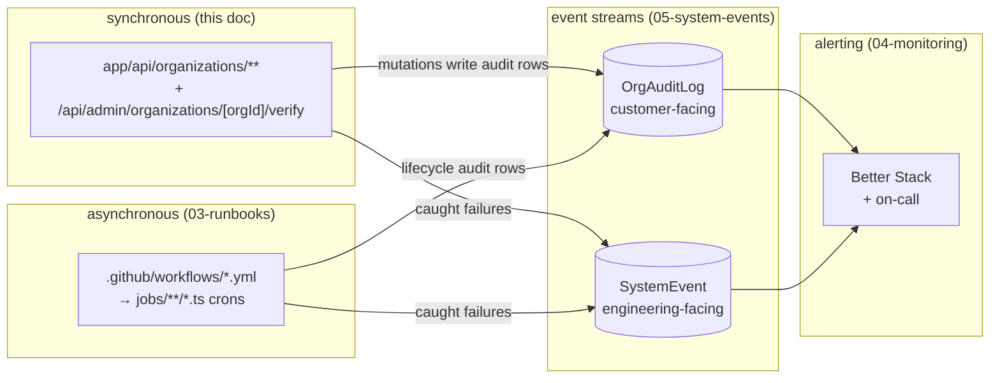

# API reference

This page is one of four operational surfaces in this band, and it sits at
the front of the chain that the rest of the band documents. The HTTP routes
catalogued below are the synchronous entry points; the crons in
[`03-runbooks.md`](03-runbooks.md) drive the asynchronous work; both write to
the event streams described in [`05-system-events.md`](05-system-events.md);
and [`04-monitoring.md`](04-monitoring.md) turns those streams into alerts.
The diagram below shows how the four fit together so you can place any route
in the larger operational picture.

> **How to read this table.** Each row is one `path × verb`.
> **Min role** is the _floor_ — `requireOrgAccess(orgId, minRole)` (or
> `requireOrgOwner`) from `lib/auth-helpers.ts`; higher ranks and
> platform admins always pass. 🔒 rows gate on
> `requireOrgBillingAdminOrOwner` (`lib/auth/billing-admin-gate.ts`,
> OWNER ∨ BILLING_ADMIN) instead; 🔓 marks the one **field-level RBAC**
> route. **Audit actions** are the exact string literals the handler
> emits to `OrgAuditLog` on success (`—` = no audit row); the `(CATEGORY)`
> is the `OrgAuditCategory`. To verify a row against code: open the route
> file under `app/api/organizations/**`, confirm the gate call at the top
> and the `AUDIT_ACTIONS.<CAT>.<NAME>` constant at the write site
> (`lib/enterprise/audit-actions.ts`).

Every enterprise-layer HTTP endpoint, exhaustively. Roles are the
_minimum_ required role — higher-rank roles and platform admins
always pass. Audit actions are the string literals emitted by the
route on success; rows land in `OrgAuditLog` with the category shown
in parentheses. Constants live in `lib/enterprise/audit-actions.ts`.

> **Billing surfaces are governed by `requireOrgBillingAdminOrOwner`**
> (`lib/auth/billing-admin-gate.ts`) — an **OWNER ∨ BILLING_ADMIN**
> disjunction. MAINTAINER is _deliberately excluded_ from money
> surfaces even though it outranks BILLING_ADMIN on the org ladder.
> Rows gated this way are marked 🔒 **OWNER / BILLING_ADMIN** below.

_Last reconciled against the filesystem: 2026-06-05 (post v2 mega-audit,
#777/#778/#779). 71 route files → 71 row-groups; see "Route count" at
the bottom._

## Top-level collection

These are the unscoped routes that operate above any single organization — the org switcher feed, org creation, the public directory, and invite acceptance.

| Path                                    | Verb   | Min role      | Purpose                                                                                                                                                                                                                                                                                                               | Audit actions              |
| --------------------------------------- | ------ | ------------- | --------------------------------------------------------------------------------------------------------------------------------------------------------------------------------------------------------------------------------------------------------------------------------------------------------------------- | -------------------------- |
| `/api/organizations`                    | `GET`  | authenticated | List the caller's orgs (switcher feed)                                                                                                                                                                                                                                                                                | —                          |
| `/api/organizations`                    | `POST` | authenticated | Create org + BillingAccount + OWNER Membership. Also upserts an `OrgWorkspaceProfile` for the creator (so they become "an operator of at least one org") and returns `orgWorkspaceProfileId` on the response.                                                                                                         | `MEMBER_ADDED` (MEMBER)    |
| `/api/organizations/public`             | `GET`  | public        | Public org directory (no session). Filtered to `isPublic = true`.                                                                                                                                                                                                                                                     | —                          |
| `/api/organizations/invitations/accept` | `POST` | authenticated | Accept an invite via token. Side-effects: LEARNER invites lazily upsert a `ConsulteeProfile` (via `ensureConsulteeProfile`); EXPERT invites upsert a placeholder `ConsultantProfile` (`Domain "General"`, `scheduleType = WEEKLY`, `verificationStatus = PENDING_VERIFICATION`) if the user doesn't already have one. | `INVITE_ACCEPTED` (MEMBER) |

## Org record

These routes read and mutate the organization record itself, including branding assets and the platform-admin verification state machine.

| Path                                          | Verb     | Min role                              | Purpose                                                                                                                                                                                                                                                                                                                                                                                                                                                                                                                                                                                                  | Audit actions                                                                               |
| --------------------------------------------- | -------- | ------------------------------------- | -------------------------------------------------------------------------------------------------------------------------------------------------------------------------------------------------------------------------------------------------------------------------------------------------------------------------------------------------------------------------------------------------------------------------------------------------------------------------------------------------------------------------------------------------------------------------------------------------------- | ------------------------------------------------------------------------------------------- |
| `/api/organizations/[orgId]`                  | `GET`    | LEARNER                               | Full merged org record + capabilities + counts                                                                                                                                                                                                                                                                                                                                                                                                                                                                                                                                                           | —                                                                                           |
| `/api/organizations/[orgId]`                  | `PATCH`  | active member 🔓 **field-level RBAC** | Branding + policy + capability flips. The gate is `requireOrgAccess` (any active member) followed by a **field-level allowlist**: OWNER may touch every field; MAINTAINER is limited to `MAINTAINER_FIELDS` (name, description, industry, website, sizeBucket, logo, bannerImage, primaryColor, secondaryColor); BILLING_ADMIN is limited to `BILLING_ADMIN_FIELDS` (billingEmail, paymentTermsDays). Any out-of-remit field → `403 FIELD_RBAC_FORBIDDEN` naming the offending fields. Capability guard: can't disable both `canSponsor`/`canHost`; can't disable `canSponsor` while wallet balance > 0. | `SETTINGS_CHANGED` (SETTINGS)                                                               |
| `/api/organizations/[orgId]`                  | `DELETE` | OWNER                                 | Hard-delete (refused `409` if any contracts/invoices/POs/earnings exist — admins DEACTIVATE instead). No audit row: the org and its `OrgAuditLog` rows are deleted in the same tx, so there's nothing to write to.                                                                                                                                                                                                                                                                                                                                                                                       | —                                                                                           |
| `/api/organizations/[orgId]/branding/[asset]` | `POST`   | OWNER                                 | Upload logo or banner image (multipart `file`; `asset` = `logo` \| `banner`)                                                                                                                                                                                                                                                                                                                                                                                                                                                                                                                             | `SETTINGS_CHANGED` (SETTINGS)                                                               |
| `/api/organizations/[orgId]/branding/[asset]` | `DELETE` | OWNER                                 | Remove logo or banner image (`asset` = `logo` \| `banner`)                                                                                                                                                                                                                                                                                                                                                                                                                                                                                                                                               | `SETTINGS_CHANGED` (SETTINGS)                                                               |
| `/api/organizations/[orgId]/settings`         | `GET`    | LEARNER                               | Thin settings projection                                                                                                                                                                                                                                                                                                                                                                                                                                                                                                                                                                                 | —                                                                                           |
| `/api/admin/organizations/[orgId]/verify`     | `POST`   | platform ADMIN                        | One route handles `VERIFY / REJECT / SUSPEND / REACTIVATE / DEACTIVATE` (action upper-cased, defaults to `VERIFY`). `REJECT` requires a `reason` and keeps the org `PENDING_VERIFICATION` (stamps `verificationReason` + `verificationRejectedAt` for the resubmit loop).                                                                                                                                                                                                                                                                                                                                | `VERIFIED` / `VERIFICATION_REJECTED` / `SUSPENDED` / `REACTIVATED` / `DEACTIVATED` (SYSTEM) |

## Members and invitations

These routes manage membership records and the invitation lifecycle; the anti-lockout guard and the LEARNER↔EXPERT transition guard both live here.

| Path                                                    | Verb                                | Min role      | Purpose                                                                                                                                                                                                                                | Audit actions                                  |
| ------------------------------------------------------- | ----------------------------------- | ------------- | -------------------------------------------------------------------------------------------------------------------------------------------------------------------------------------------------------------------------------------- | ---------------------------------------------- |
| `/api/organizations/[orgId]/members`                    | `GET`                               | active member | Paginated list; `?role=` / `?status=` / `?q=`                                                                                                                                                                                          | —                                              |
| `/api/organizations/[orgId]/members`                    | `POST`                              | MAINTAINER    | Direct add (idempotent on userId). If the userId matches a `REMOVED` membership the row is reactivated, with the same `LEARNER ↔ EXPERT` transition guard applied (`409 ROLE_TRANSITION_BLOCKED` on violation).                        | `MEMBER_ADDED` / `MEMBER_REACTIVATED` (MEMBER) |
| `/api/organizations/[orgId]/members/bulk`               | `GET` `POST` `PUT` `PATCH` `DELETE` | —             | **Deterministic `405` stub** (`BULK_REMOVAL_NOT_SUPPORTED`). Bulk member ops are intentionally unsupported in v1 so nothing bypasses the last-OWNER anti-lockout guard; use the single-member PATCH instead. See `deletion-policy`.    | —                                              |
| `/api/organizations/[orgId]/members/[memberId]`         | `GET`                               | active member | Full member record                                                                                                                                                                                                                     | —                                              |
| `/api/organizations/[orgId]/members/[memberId]`         | `PATCH`                             | MAINTAINER    | Role / status / departmentLabel / payoutRecipient. Returns `409 ROLE_TRANSITION_BLOCKED` if the caller tries to flip LEARNER ↔ EXPERT (`lib/enterprise/role-transitions.ts`); last-OWNER anti-lockout guard runs in a Serializable tx. | `ROLE_CHANGE` / `STATUS_CHANGE` (MEMBER)       |
| `/api/organizations/[orgId]/members/[memberId]`         | `DELETE`                            | MAINTAINER    | Set `status = REMOVED`                                                                                                                                                                                                                 | `MEMBER_REMOVED` (MEMBER)                      |
| `/api/organizations/[orgId]/invitations`                | `GET`                               | MAINTAINER    | Pending + accepted + revoked invites                                                                                                                                                                                                   | —                                              |
| `/api/organizations/[orgId]/invitations`                | `POST`                              | MAINTAINER    | Send (or resend) invite                                                                                                                                                                                                                | `INVITE_SENT` / `INVITE_RESENT` (MEMBER)       |
| `/api/organizations/[orgId]/invitations/[invitationId]` | `GET`                               | MAINTAINER    | Invite detail                                                                                                                                                                                                                          | —                                              |
| `/api/organizations/[orgId]/invitations/[invitationId]` | `DELETE`                            | MAINTAINER    | Revoke                                                                                                                                                                                                                                 | `INVITE_REVOKED` (MEMBER)                      |

## Contracts

These routes cover the contract lifecycle — creation, term edits, the lock state that freezes terms once a contract is in use, and the supersede flow that replaces a contract immutably.

| Path                                                          | Verb     | Min role   | Purpose                                                                                                                                                                                                                                                                                                                                                                                                                                                                                                                  | Audit actions                                                             |
| ------------------------------------------------------------- | -------- | ---------- | ------------------------------------------------------------------------------------------------------------------------------------------------------------------------------------------------------------------------------------------------------------------------------------------------------------------------------------------------------------------------------------------------------------------------------------------------------------------------------------------------------------------------ | ------------------------------------------------------------------------- |
| `/api/organizations/[orgId]/contracts`                        | `GET`    | MAINTAINER | List with `?status=` filter                                                                                                                                                                                                                                                                                                                                                                                                                                                                                              | —                                                                         |
| `/api/organizations/[orgId]/contracts`                        | `POST`   | OWNER      | Create DRAFT/ACTIVE contract. May atomically mint a flat-fee `BillingSubscription` when the BillingAccount is `fundingSource=LICENSE` (`licenseFeePaise` + `licenseCycle`). `requireActive` — a contract can't bind an unverified org.                                                                                                                                                                                                                                                                                   | `CONTRACT_CREATED` (CONTRACT)                                             |
| `/api/organizations/[orgId]/contracts/[contractId]`           | `GET`    | MAINTAINER | Contract detail + programs; response carries a derived `locked` flag (term-field lock state).                                                                                                                                                                                                                                                                                                                                                                                                                            | —                                                                         |
| `/api/organizations/[orgId]/contracts/[contractId]`           | `PATCH`  | OWNER      | Status transitions + terms. **Term fields** (`effectiveFrom`, `effectiveTo`, `paymentTermsDays`) lock once the contract is signed/billing (`getContractLockState`) → `409 CONTRACT_TERMS_LOCKED`; `autoRenew` stays editable. **`status=TERMINATED`** from ACTIVE is guarded: `409` while any live assignment is in its current cycle, or `409 CONTRACT_HAS_OUTSTANDING_INVOICES` while ISSUED/OVERDUE invoices exist; once allowed, an in-tx cascade flips programs ACTIVE→EXPIRED and their ACTIVE assignments→CLOSED. | `CONTRACT_SIGNED` / `CONTRACT_TERMINATED` / `CONTRACT_EXPIRED` (CONTRACT) |
| `/api/organizations/[orgId]/contracts/[contractId]`           | `DELETE` | OWNER      | DRAFT-only hard delete (refused if programs attached)                                                                                                                                                                                                                                                                                                                                                                                                                                                                    | `CONTRACT_TERMINATED` (CONTRACT)                                          |
| `/api/organizations/[orgId]/contracts/[contractId]/supersede` | `POST`   | OWNER      | #779 §A — contracts are immutable in use; supersede mints a successor with new terms, re-points programs, and retires the old row. `reason` accepts only `AMENDMENT` (cuts over now, old→TERMINATED) or `RENEWAL` (chains off old `effectiveTo`, old→EXPIRED). Invoices keep their old `contractId`; `supersededByContractId @unique` is the double-run backstop. `409` if the contract isn't ACTIVE or is already superseded.                                                                                           | `CONTRACT_SUPERSEDED` (CONTRACT)                                          |

## Programs and assignments

These routes manage programs and their per-member assignments, including the money-config lock that freezes pricing fields once a program is live.

| Path                                                                         | Verb     | Min role      | Purpose                                                                                                                                                                                                                                                                                                                                                                                                                                                                                               | Audit actions                                                 |
| ---------------------------------------------------------------------------- | -------- | ------------- | ----------------------------------------------------------------------------------------------------------------------------------------------------------------------------------------------------------------------------------------------------------------------------------------------------------------------------------------------------------------------------------------------------------------------------------------------------------------------------------------------------- | ------------------------------------------------------------- |
| `/api/organizations/[orgId]/programs`                                        | `GET`    | active member | List programs for org (canSponsor)                                                                                                                                                                                                                                                                                                                                                                                                                                                                    | —                                                             |
| `/api/organizations/[orgId]/programs`                                        | `POST`   | MAINTAINER    | Create LICENSED_SEAT or CREDIT_POOL program                                                                                                                                                                                                                                                                                                                                                                                                                                                           | `PROGRAM_CREATED` (PROGRAM)                                   |
| `/api/organizations/[orgId]/programs/[programId]`                            | `GET`    | active member | Program detail; response carries a derived `locked` flag (money-config lock state).                                                                                                                                                                                                                                                                                                                                                                                                                   | —                                                             |
| `/api/organizations/[orgId]/programs/[programId]`                            | `PATCH`  | MAINTAINER    | Safe-field edits (`name`, `status`, `allowedCategories`) always allowed. **Money fields** (`coveredPlanTypes`, `ratePerSeatPaise`, `coveredEngagementsPerCycle`, `creditBudgetPerCycle`, `overageBehavior`, `overageSurchargeBps`, `priceCapPerEngagementPaise`, `maxOveragePerCyclePaise`) freeze once the program is in use (`getProgramLockState`) → `409 PROGRAM_CONFIG_LOCKED`. **`archived=true`** stamps `archivedAt`, guarded `409 PROGRAM_HAS_ACTIVE_ASSIGNMENTS` if live allocations exist. | `PROGRAM_PAUSED` / `PROGRAM_ARCHIVED` (PROGRAM)               |
| `/api/organizations/[orgId]/programs/[programId]`                            | `DELETE` | MAINTAINER    | DRAFT/no-assignment hard delete (Serializable; refused if assignments or historical utilizations exist)                                                                                                                                                                                                                                                                                                                                                                                               | `PROGRAM_DELETED` (PROGRAM)                                   |
| `/api/organizations/[orgId]/programs/[programId]/assignments`                | `GET`    | active member | List assignments                                                                                                                                                                                                                                                                                                                                                                                                                                                                                      | —                                                             |
| `/api/organizations/[orgId]/programs/[programId]/assignments`                | `POST`   | MAINTAINER    | Upsert assignment for a membership                                                                                                                                                                                                                                                                                                                                                                                                                                                                    | `PROGRAM_ASSIGNED` (PROGRAM)                                  |
| `/api/organizations/[orgId]/programs/[programId]/assignments/[assignmentId]` | `GET`    | active member | Assignment detail + utilizations                                                                                                                                                                                                                                                                                                                                                                                                                                                                      | —                                                             |
| `/api/organizations/[orgId]/programs/[programId]/assignments/[assignmentId]` | `PATCH`  | MAINTAINER    | Period / engagementsUsed reconciliation; `status` flip emits unassign                                                                                                                                                                                                                                                                                                                                                                                                                                 | `PROGRAM_ASSIGNMENT_UPDATED` / `PROGRAM_UNASSIGNED` (PROGRAM) |
| `/api/organizations/[orgId]/programs/[programId]/assignments/[assignmentId]` | `DELETE` | MAINTAINER    | Remove assignment                                                                                                                                                                                                                                                                                                                                                                                                                                                                                     | `PROGRAM_UNASSIGNED` (PROGRAM)                                |

## Billing account

These routes expose the billing account, wallet balance, and top-up flow; the money-mutating ones gate on `requireOrgBillingAdminOrOwner` and are marked 🔒.

| Path                                                                  | Verb    | Min role                 | Purpose                                                                                                                                                                                                | Audit actions                                                                |
| --------------------------------------------------------------------- | ------- | ------------------------ | ------------------------------------------------------------------------------------------------------------------------------------------------------------------------------------------------------ | ---------------------------------------------------------------------------- |
| `/api/organizations/[orgId]/billing`                                  | `GET`   | MANAGER                  | Aggregated billing snapshot for the unified Billing dashboard (month-to-date gross, outstanding, pending charges, paymentTermsDays). DB-side `aggregate({ _sum })`, O(1).                              | —                                                                            |
| `/api/organizations/[orgId]/billing-account`                          | `GET`   | MANAGER                  | Account summary + balance + creditLimit                                                                                                                                                                | —                                                                            |
| `/api/organizations/[orgId]/billing-account`                          | `PATCH` | 🔒 OWNER / BILLING_ADMIN | Change billingEmail / fundingSource (guarded)                                                                                                                                                          | `SETTINGS_CHANGED` (SETTINGS)                                                |
| `/api/organizations/[orgId]/billing-account/wallet`                   | `GET`   | MANAGER                  | Wallet balance + history (the org's WALLET-account `LedgerEntry` rows)                                                                                                                                 | —                                                                            |
| `/api/organizations/[orgId]/billing-account/wallet/top-ups`           | `GET`   | MANAGER                  | List top-ups (pending + confirmed)                                                                                                                                                                     | —                                                                            |
| `/api/organizations/[orgId]/billing-account/wallet/top-ups`           | `POST`  | 🔒 OWNER / BILLING_ADMIN | Mint Razorpay order + a PENDING `WalletTopUp` (keyed by `providerOrderId @unique`); the webhook (`notes.type=wallet_topup`) confirms it idempotently and posts the `TOPUP` txn (`Dr CASH / Cr WALLET`) | `WALLET_TOPUP` (WALLET) — `WALLET_TOPUP_CONFIRMED` is emitted by the webhook |
| `/api/organizations/[orgId]/billing-account/wallet/top-ups/[topUpId]` | `GET`   | MANAGER                  | Top-up detail; `topUpId` is the `WalletTopUp` id                                                                                                                                                       | —                                                                            |

## Invoices and purchase orders

These routes cover manual invoices, invoice-payment initiation, PDF rendering, and purchase orders; the webhook completes the ISSUED→PAID flip out of band.

| Path                                                                  | Verb     | Min role                 | Purpose                                                                                                                                                            | Audit actions                                                                    |
| --------------------------------------------------------------------- | -------- | ------------------------ | ------------------------------------------------------------------------------------------------------------------------------------------------------------------ | -------------------------------------------------------------------------------- |
| `/api/organizations/[orgId]/billing-account/invoices`                 | `GET`    | MANAGER                  | List with `?status=` filter                                                                                                                                        | —                                                                                |
| `/api/organizations/[orgId]/billing-account/invoices`                 | `POST`   | 🔒 OWNER / BILLING_ADMIN | Manual invoice. Dashboard composer defaults `dueDate` to NET-60 and posts `issueImmediately: true` so the row lands as `ISSUED` in a single call.                  | `INVOICE_GENERATED` (INVOICE)                                                    |
| `/api/organizations/[orgId]/billing-account/invoices/[invoiceId]`     | `GET`    | MANAGER                  | Invoice detail                                                                                                                                                     | —                                                                                |
| `/api/organizations/[orgId]/billing-account/invoices/[invoiceId]`     | `PATCH`  | 🔒 OWNER / BILLING_ADMIN | Status transitions (DRAFT→ISSUED, DRAFT→CANCELLED, ISSUED/OVERDUE→VOID)                                                                                            | `INVOICE_ISSUED` / `INVOICE_CANCELLED` / `INVOICE_VOIDED` (INVOICE)              |
| `/api/organizations/[orgId]/billing-account/invoices/[invoiceId]/pay` | `POST`   | 🔒 OWNER / BILLING_ADMIN | Mint Razorpay order for the invoice; the webhook (`notes.type=invoice_payment`) flips ISSUED→PAID and posts the `INVOICE_PAID` txn (`Dr CASH / Cr ORG_RECEIVABLE`) | `INVOICE_PAYMENT_INITIATED` (INVOICE) — `INVOICE_PAID` is emitted by the webhook |
| `/api/organizations/[orgId]/billing-account/invoices/[invoiceId]/pdf` | `GET`    | MANAGER                  | Rendered invoice PDF                                                                                                                                               | —                                                                                |
| `/api/organizations/[orgId]/billing-account/purchase-orders`          | `GET`    | MANAGER                  | List POs                                                                                                                                                           | —                                                                                |
| `/api/organizations/[orgId]/billing-account/purchase-orders`          | `POST`   | 🔒 OWNER / BILLING_ADMIN | Create PO                                                                                                                                                          | `PURCHASE_ORDER_CREATED` (INVOICE)                                               |
| `/api/organizations/[orgId]/billing-account/purchase-orders/[poId]`   | `GET`    | MANAGER                  | PO detail + linked invoices                                                                                                                                        | —                                                                                |
| `/api/organizations/[orgId]/billing-account/purchase-orders/[poId]`   | `PATCH`  | 🔒 OWNER / BILLING_ADMIN | Update PO metadata                                                                                                                                                 | —                                                                                |
| `/api/organizations/[orgId]/billing-account/purchase-orders/[poId]`   | `DELETE` | 🔒 OWNER / BILLING_ADMIN | Cancel PO (if unused)                                                                                                                                              | —                                                                                |

## Rate cards, earnings, payouts (host side)

These are the host-side money routes for organizations that earn — rate cards, the payout account, and the earnings-to-payout rollup; most mutations gate on `requireOrgBillingAdminOrOwner`.

| Path                                             | Verb    | Min role                           | Purpose                                                                                                                                                                                                                                                                                                                                                                                                                                 | Audit actions                                    |
| ------------------------------------------------ | ------- | ---------------------------------- | --------------------------------------------------------------------------------------------------------------------------------------------------------------------------------------------------------------------------------------------------------------------------------------------------------------------------------------------------------------------------------------------------------------------------------------- | ------------------------------------------------ |
| `/api/organizations/[orgId]/rate-cards`          | `GET`   | active member (canHost)            | Effective cards + history. Read widened from MANAGER so an EXPERT can confirm their commission split.                                                                                                                                                                                                                                                                                                                                   | —                                                |
| `/api/organizations/[orgId]/rate-cards`          | `POST`  | 🔒 OWNER / BILLING_ADMIN (canHost) | Create / bump a card (atomic two-step). A card scoped to a `contractId`, `planType` or `planId` is only selected at settlement when `RATE_CARD_SCOPED_RESOLUTION=on` (#1335). With the flag off, settlement forwards only the org id, the membership override and the payment time: a valid membership override wins, then the org default card, and with neither the built-in default (10% platform, 10% org, 80% consultant) applies. | `RATE_CARD_BUMPED` (PROGRAM)                     |
| `/api/organizations/[orgId]/rate-cards/[cardId]` | `GET`   | MANAGER (canHost)                  | Card detail                                                                                                                                                                                                                                                                                                                                                                                                                             | —                                                |
| `/api/organizations/[orgId]/rate-cards/[cardId]` | `PATCH` | 🔒 OWNER / BILLING_ADMIN (canHost) | Close (set `effectiveTo`)                                                                                                                                                                                                                                                                                                                                                                                                               | `RATE_CARD_BUMPED` (PROGRAM)                     |
| `/api/organizations/[orgId]/payout-account`      | `GET`   | MANAGER                            | Account summary + last4                                                                                                                                                                                                                                                                                                                                                                                                                 | —                                                |
| `/api/organizations/[orgId]/payout-account`      | `PUT`   | OWNER                              | Replace account (encrypted at rest)                                                                                                                                                                                                                                                                                                                                                                                                     | `SETTINGS_CHANGED` (SETTINGS)                    |
| `/api/organizations/[orgId]/earnings`            | `GET`   | MANAGER                            | List OrganizationEarnings rows                                                                                                                                                                                                                                                                                                                                                                                                          | —                                                |
| `/api/organizations/[orgId]/payouts`             | `GET`   | MANAGER                            | List OrganizationPayouts                                                                                                                                                                                                                                                                                                                                                                                                                | —                                                |
| `/api/organizations/[orgId]/payouts`             | `POST`  | 🔒 OWNER / BILLING_ADMIN           | Roll up earnings → PayoutCycle                                                                                                                                                                                                                                                                                                                                                                                                          | `PAYOUT_INITIATED` (PAYOUT)                      |
| `/api/organizations/[orgId]/payouts/[payoutId]`  | `GET`   | MANAGER                            | Payout detail + earnings list                                                                                                                                                                                                                                                                                                                                                                                                           | —                                                |
| `/api/organizations/[orgId]/payouts/[payoutId]`  | `PATCH` | 🔒 OWNER / BILLING_ADMIN           | Flip to PROCESSED / CANCELLED                                                                                                                                                                                                                                                                                                                                                                                                           | `PAYOUT_INITIATED` / `PAYOUT_CANCELLED` (PAYOUT) |

## Reimbursements, disputes, documents (read surfaces)

These are read-only roster endpoints — reimbursements, disputes, documents, trials, appointments, and recordings — all gated at MANAGER and none of them emit audit rows.

| Path                                               | Verb  | Min role | Purpose                      | Audit actions |
| -------------------------------------------------- | ----- | -------- | ---------------------------- | ------------- |
| `/api/organizations/[orgId]/reimbursements`        | `GET` | MANAGER  | Reimbursement roster         | —             |
| `/api/organizations/[orgId]/reimbursements/export` | `GET` | MANAGER  | CSV export of reimbursements | —             |
| `/api/organizations/[orgId]/disputes`              | `GET` | MANAGER  | Dispute roster (org-scoped)  | —             |
| `/api/organizations/[orgId]/documents`             | `GET` | MANAGER  | Org document list            | —             |
| `/api/organizations/[orgId]/trials`                | `GET` | MANAGER  | Trial roster                 | —             |
| `/api/organizations/[orgId]/appointments`          | `GET` | MANAGER  | Org appointment feed         | —             |
| `/api/organizations/[orgId]/recordings`            | `GET` | MANAGER  | Stream recording roster      | —             |

## SSO and domains

These routes configure SSO providers, the break-glass escape hatch, and domain claims; the OWNER-only gates reflect that these are IdP-trust roots.

| Path                                                       | Verb     | Min role | Purpose                                                                                                                                                                                                                                                | Audit actions                                                  |
| ---------------------------------------------------------- | -------- | -------- | ------------------------------------------------------------------------------------------------------------------------------------------------------------------------------------------------------------------------------------------------------ | -------------------------------------------------------------- |
| `/api/organizations/[orgId]/sso`                           | `GET`    | MANAGER  | Settings read                                                                                                                                                                                                                                          | —                                                              |
| `/api/organizations/[orgId]/sso`                           | `PATCH`  | OWNER    | allowedEmailDomains / enforceSSO / defaultRoleForAutoJoin                                                                                                                                                                                              | `SSO_ENABLED` / `SSO_DISABLED` / `SETTINGS_CHANGED` (SETTINGS) |
| `/api/organizations/[orgId]/sso/providers`                 | `GET`    | MANAGER  | List providers                                                                                                                                                                                                                                         | —                                                              |
| `/api/organizations/[orgId]/sso/providers`                 | `POST`   | OWNER    | Add SAML/OIDC provider                                                                                                                                                                                                                                 | `SSO_ENABLED` (SETTINGS)                                       |
| `/api/organizations/[orgId]/sso/providers/[providerId]`    | `GET`    | MANAGER  | Provider detail. Response includes a derived `providerType` of `SAML` or `OIDC`, inferred from whether `samlConfig` or `oidcConfig` is populated on the row.                                                                                           | —                                                              |
| `/api/organizations/[orgId]/sso/providers/[providerId]`    | `DELETE` | OWNER    | Remove provider                                                                                                                                                                                                                                        | `SSO_DISABLED` (SETTINGS)                                      |
| `/api/organizations/[orgId]/sso/break-glass`               | `POST`   | OWNER    | #779 §E — open a time-boxed IdP-outage escape hatch (password login re-allowed while `breakGlassUntil > now`). `hours` 1–72 (default 4), `reason` required (min 5 chars). `404` if SSO isn't enforced. Who/why lives in the audit row, not on columns. | `SETTINGS_CHANGED` (SETTINGS)                                  |
| `/api/organizations/[orgId]/sso/break-glass`               | `DELETE` | OWNER    | Close the window early (clears `breakGlassUntil`). `404` if SSO isn't enforced.                                                                                                                                                                        | `SETTINGS_CHANGED` (SETTINGS)                                  |
| `/api/organizations/[orgId]/domain-claims`                 | `GET`    | MANAGER  | List claims                                                                                                                                                                                                                                            | —                                                              |
| `/api/organizations/[orgId]/domain-claims`                 | `POST`   | OWNER    | Claim domain                                                                                                                                                                                                                                           | `DOMAIN_CLAIMED` (SETTINGS)                                    |
| `/api/organizations/[orgId]/domain-claims/[domain]`        | `DELETE` | OWNER    | Release claim                                                                                                                                                                                                                                          | `DOMAIN_RELEASED` (SETTINGS)                                   |
| `/api/organizations/[orgId]/domain-claims/[domain]/verify` | `POST`   | OWNER    | Verify the DNS TXT record at `_familiarise-verify.<domain>` matches the claim's `verificationToken`; flips `verifiedAt` NULL→now() and unlocks domain-based SSO auto-join.                                                                             | `DOMAIN_VERIFIED` (SETTINGS)                                   |

## SCIM provisioning

SCIM **runtime** (the IdP-facing `/scim/v2/...` push surface) lives outside
this table; these are the org-admin **configuration** routes. All are
OWNER-only — provisioning tokens and group mappings are IdP-trust roots.

| Path                                                         | Verb     | Min role | Purpose                                   | Audit actions                  |
| ------------------------------------------------------------ | -------- | -------- | ----------------------------------------- | ------------------------------ |
| `/api/organizations/[orgId]/scim/tokens`                     | `GET`    | OWNER    | List provisioning tokens (secrets masked) | —                              |
| `/api/organizations/[orgId]/scim/tokens`                     | `POST`   | OWNER    | Mint a SCIM bearer token (returned once)  | `SCIM_TOKEN_CREATED` (SYSTEM)  |
| `/api/organizations/[orgId]/scim/tokens/[tokenId]`           | `DELETE` | OWNER    | Revoke a token                            | `SCIM_TOKEN_REVOKED` (SYSTEM)  |
| `/api/organizations/[orgId]/scim/group-mappings`             | `GET`    | OWNER    | List IdP-group → role mappings            | —                              |
| `/api/organizations/[orgId]/scim/group-mappings`             | `POST`   | OWNER    | Map an IdP group to a `MemberRole`        | `SCIM_GROUP_MAPPED` (SYSTEM)   |
| `/api/organizations/[orgId]/scim/group-mappings/[mappingId]` | `DELETE` | OWNER    | Remove a group mapping                    | `SCIM_GROUP_UNMAPPED` (SYSTEM) |

## Outbound webhooks

`requireOrgBillingAdminOrOwner` governs **create/configure/redeliver**;
**secret rotation and endpoint deletion are OWNER-only** (highest-trust
operations from the integrator's POV). Read surfaces are MANAGER.

| Path                                                                                 | Verb     | Min role                 | Purpose                                                                                                                                                                                                                                   | Audit actions                                                                                 |
| ------------------------------------------------------------------------------------ | -------- | ------------------------ | ----------------------------------------------------------------------------------------------------------------------------------------------------------------------------------------------------------------------------------------- | --------------------------------------------------------------------------------------------- |
| `/api/organizations/[orgId]/webhooks`                                                | `GET`    | MANAGER                  | List endpoints                                                                                                                                                                                                                            | —                                                                                             |
| `/api/organizations/[orgId]/webhooks`                                                | `POST`   | 🔒 OWNER / BILLING_ADMIN | Create endpoint (returns secret once)                                                                                                                                                                                                     | `WEBHOOK_ENDPOINT_CREATED` (WEBHOOK)                                                          |
| `/api/organizations/[orgId]/webhooks/[endpointId]`                                   | `GET`    | MANAGER                  | Endpoint detail                                                                                                                                                                                                                           | —                                                                                             |
| `/api/organizations/[orgId]/webhooks/[endpointId]`                                   | `PATCH`  | 🔒 OWNER / BILLING_ADMIN | Update / pause / resume                                                                                                                                                                                                                   | `WEBHOOK_ENDPOINT_PAUSED` / `WEBHOOK_ENDPOINT_RESUMED` / `WEBHOOK_ENDPOINT_UPDATED` (WEBHOOK) |
| `/api/organizations/[orgId]/webhooks/[endpointId]`                                   | `DELETE` | OWNER                    | Remove endpoint                                                                                                                                                                                                                           | `WEBHOOK_ENDPOINT_DELETED` (WEBHOOK)                                                          |
| `/api/organizations/[orgId]/webhooks/[endpointId]/rotate-secret`                     | `POST`   | OWNER                    | Mint a fresh 32-byte secret (returned once); stashes the prior secret + stamps `secretRotatedAt` so the worker dual-signs for a 24h grace window. Rate-limited (`orgWebhookLimiter`). BILLING_ADMIN can pause/disable but **not** rotate. | `WEBHOOK_SECRET_ROTATED` (WEBHOOK)                                                            |
| `/api/organizations/[orgId]/webhooks/[endpointId]/deliveries`                        | `GET`    | MANAGER                  | Delivery attempt history                                                                                                                                                                                                                  | —                                                                                             |
| `/api/organizations/[orgId]/webhooks/[endpointId]/deliveries/[deliveryId]/redeliver` | `POST`   | 🔒 OWNER / BILLING_ADMIN | Re-enqueue a single delivery                                                                                                                                                                                                              | `WEBHOOK_DELIVERY_REDELIVERED` (WEBHOOK)                                                      |

## Compliance: verification, consent, data exports

Routes in this group implement DPDP §11 (data access bundles), §12 (consent grant/withdrawal), and the self-serve verification resubmit loop; the minimum role column reflects that financial PII in export bundles demands the same governance floor as billing mutations.

| Path                                                          | Verb     | Min role                 | Purpose                                                                                                                                                                                                                                           | Audit actions                       |
| ------------------------------------------------------------- | -------- | ------------------------ | ------------------------------------------------------------------------------------------------------------------------------------------------------------------------------------------------------------------------------------------------- | ----------------------------------- |
| `/api/organizations/[orgId]/verification/resubmit`            | `POST`   | MAINTAINER               | #779 §A — self-serve resubmit after an admin REJECT. Bumps `verificationSubmittedAt`, clears `verificationReason` + `verificationRejectedAt`. `409 NOTHING_TO_RESUBMIT` unless the org is `PENDING_VERIFICATION` with a non-null rejection stamp. | `VERIFICATION_RESUBMITTED` (SYSTEM) |
| `/api/organizations/[orgId]/consent`                          | `GET`    | MANAGER                  | ConsentArtifact roster (org-scoped via member relation); `?userId=` / `?active=` / `?limit=`                                                                                                                                                      | —                                   |
| `/api/organizations/[orgId]/consent`                          | `POST`   | MANAGER                  | Record a grant. `userId` is validated as a non-empty string (1–128 chars) because `User.id` is a `cuid()`, not a UUID. Writes a SHA-256-hashed `ConsentArtifact`.                                                                                 | `CONSENT_GRANTED` (CONSENT)         |
| `/api/organizations/[orgId]/consent`                          | `DELETE` | MANAGER                  | Withdraw (DPDP §12) — stamps `withdrawnAt` on the user's active artifacts. `?userId=` required; `?purposeCode=` scopes the withdrawal (omit to withdraw all). Withdrawal is irreversible; a re-grant is a fresh artifact.                         | `CONSENT_WITHDRAWN` (CONSENT)       |
| `/api/organizations/[orgId]/data-exports`                     | `GET`    | 🔒 OWNER / BILLING_ADMIN | List export jobs (last 30 days). Rows are `OrgDataExportJob`.                                                                                                                                                                                     | —                                   |
| `/api/organizations/[orgId]/data-exports`                     | `POST`   | 🔒 OWNER / BILLING_ADMIN | Request a DPDP §11 export bundle (async worker). **Rate-limited 1/24h** (`orgDataExportLimiter`); bundles carry financial PII, hence the billing-governance floor. Returns `202`.                                                                 | `DATA_EXPORT_REQUESTED` (SYSTEM)    |
| `/api/organizations/[orgId]/data-exports/[exportId]/download` | `GET`    | 🔒 OWNER / BILLING_ADMIN | Signed-URL download when `status=READY` and unexpired. `409 EXPORT_NOT_READY`, `410 EXPORT_EXPIRED`.                                                                                                                                              | `DATA_EXPORT_DOWNLOADED` (SYSTEM)   |

## Checkout, analytics, activity, audit

These routes cover the advisory overage preview, analytics rollups, and the two audit-log read surfaces (the narrower `/activity` feed and the wider `/audit` read plus its auditable CSV export).

| Path                                                  | Verb  | Min role      | Purpose                                                                                                                                                                                                                                                                         | Audit actions                   |
| ----------------------------------------------------- | ----- | ------------- | ------------------------------------------------------------------------------------------------------------------------------------------------------------------------------------------------------------------------------------------------------------------------------- | ------------------------------- |
| `/api/organizations/[orgId]/checkout/overage-preview` | `GET` | active member | #777 §C — advisory pre-checkout overage preview ("will booking this plan breach my cap, and what does it cost?"). Price is read **server-side** from the plan list price (`?planType=` / `?planId=` / `?sessions=`); a safe over-estimate vs the authoritative checkout charge. | —                               |
| `/api/organizations/[orgId]/analytics`                | `GET` | MANAGER       | Rollups (bookings, revenue, earnings, wallet burn)                                                                                                                                                                                                                              | —                               |
| `/api/organizations/[orgId]/activity`                 | `GET` | MANAGER       | OrgAuditLog feed (filterable by `?category=` / `?action=` / date)                                                                                                                                                                                                               | —                               |
| `/api/organizations/[orgId]/audit`                    | `GET` | active member | Audit-log read (paginated; `?actions[]=` / `?category=` / date). Wider read than `/activity`.                                                                                                                                                                                   | —                               |
| `/api/organizations/[orgId]/audit/export`             | `GET` | MAINTAINER    | CSV export of the audit trail (`?actions[]=` / date). The export is itself auditable.                                                                                                                                                                                           | `AUDIT_LOG_EXPORTED` (SETTINGS) |

## Stream (chat / video)

These two routes expose the org's Stream chat and video metadata; the call/recording export is auditable because it is a compliance pull.

| Path                                         | Verb  | Min role | Purpose                                                                                  | Audit actions                       |
| -------------------------------------------- | ----- | -------- | ---------------------------------------------------------------------------------------- | ----------------------------------- |
| `/api/organizations/[orgId]/stream/channels` | `GET` | MANAGER  | Stream chat channel roster (metadata only; message bodies are never fetched, per ADR 20) | `STREAM_CHANNELS_EXPORTED` (SYSTEM) |
| `/api/organizations/[orgId]/stream/calls`    | `GET` | MANAGER  | Call/recording metadata export (compliance pull)                                         | `STREAM_CALLS_EXPORTED` (SYSTEM)    |

## Retired audit actions

The Arch-4 refactor removed the in-org "apply to deliver" workflow. The
following action strings are no longer emitted and have been deleted
from `lib/enterprise/audit-actions.ts`:

- `EXPERT_APPLIED`
- `EXPERT_APPROVED`
- `EXPERT_REJECTED`

EXPERT entry is now invite-driven (or direct admin add); see
`expert-lifecycle`. The corresponding `Membership` columns
(`applicationNote`, `appliedAt`, `approvedAt`, `approvedBy`) were
dropped in the same cycle — any doc referencing those is stale.

## Invariants across the table

- Every mutating route writes an `OrgAuditLog` row in the same Prisma
  transaction as its business-logic mutation. Action strings live in
  `lib/enterprise/audit-actions.ts` and the corresponding `category`
  is always one of the `OrgAuditCategory` values. (The lone exception
  is `DELETE /api/organizations/[orgId]`, which hard-deletes the org
  and its audit rows together — there's no surviving row to write.)
- Most routes gate on `requireOrgAccess(orgId, minRole)` or
  `requireOrgOwner(orgId)` from `lib/auth-helpers.ts`. **Billing
  surfaces** gate on `requireOrgBillingAdminOrOwner` from
  `lib/auth/billing-admin-gate.ts` (OWNER ∨ BILLING_ADMIN). Platform
  admins bypass the gate and get a synthesised OWNER stub Membership.
- `PATCH /api/organizations/[orgId]` is the one **field-level RBAC**
  route: the role gate is the lowest active membership, then each
  touched field is checked against `MAINTAINER_FIELDS` /
  `BILLING_ADMIN_FIELDS` (OWNER passes all).
- Every body is parsed through a Zod schema before it reaches Prisma.
  No handler uses `as` casts to narrow. Invalid bodies return 400
  with the flattened error.
- Cross-tenant id theft is rejected at the handler, not at the FK
  layer. Routes that accept a nested id (e.g. `billingAccountId` in
  POST /contracts, `contractId` in POST /programs) verify ownership
  against the outer `orgId` before writing.

## Route count

71 route files reconcile to the row-groups above (a row-group is one
path; multiple verbs on a path each get their own line). The count
breaks down as follows, verified against the filesystem on 2026-06-05:

- 67 under `app/api/organizations/[orgId]/**` that carry org-admin row-groups
- 3 top-level org routes (`/organizations`, `/organizations/public`,
  `/organizations/invitations/accept`)
- 1 enterprise admin route (`/api/admin/organizations/[orgId]/verify`)

The 70 files under `app/api/organizations/**` (67 scoped to `[orgId]` plus
the 3 top-level routes) and the single admin route sum to 71.

`members/bulk` is counted (it ships a deterministic `405` stub, listed
above). There are **no** `/hris*` or `/catalog*` routes in the tree —
those audit-action constants exist in `audit-actions.ts` but their
routes have not landed; see `route-migration-table`.

## Related docs

- `roles-and-permissions` — full rank ladder and the rationale
  for OWNER-vs-MAINTAINER (and the BILLING_ADMIN billing-surface) splits.
- `route-migration-table` — old-route → new-route map for
  anyone porting code from a pre-Arch-4 branch.
