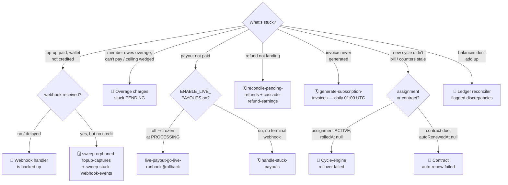
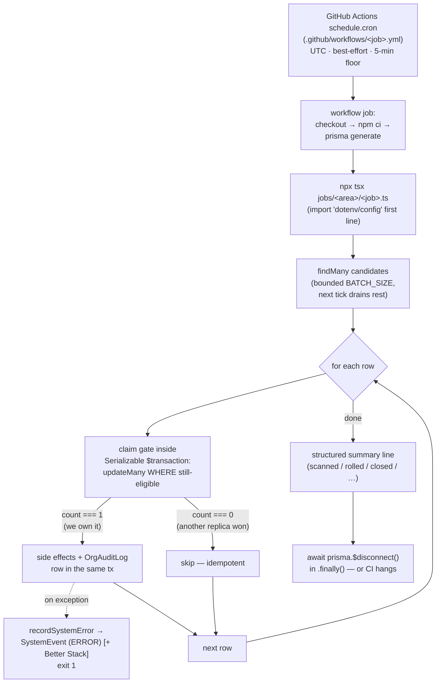

# Operational runbooks

This document captures the step-by-step procedures for responding to the
most common enterprise incidents and scheduled operational tasks. Pair it
with the alerting playbook in `monitoring`.

The goal is to make every runbook a **self-contained, copy-pasteable
sequence** — an on-call engineer at 3 AM should be able to execute one
top-to-bottom without reading any other document.

> Legend
> - 🚨 — incident response (reactive)
> - 🗓️ — scheduled operational task (proactive)
> - 🔬 — diagnostic helper (read-only, safe to run any time)

## Triage: "money looks stuck — where?"

Start here when a customer or an alert says money is stuck and you don't
yet know which subsystem owns it. Each leaf routes to the runbook (or the
cron in the 🗓️ catalogue) that owns the recovery. This is a *router*, not
a procedure — once you land on a 🚨 section, follow it top-to-bottom.



Three of those leaves (orphaned top-up captures, stuck payouts, pending
refunds) have **no dedicated 🚨 section** — the cron *is* the runbook:
force a run from the 🗓️ catalogue below and read its summary line. The
two invoice-generation jobs that earlier lacked workflows now both fire
on schedule (`generate-subscription-invoices` daily, `settle-invoice-accruals`
monthly), and the `consolidated-invoice-rollup` job that referenced a
missing script was retired into `settle-invoice-accruals` (#813), so the
formerly-broken invoice paths are wired.

---

## 🗓️ Scheduled-task catalogue (cron → script)

**Scheduling is GitHub Actions, not Netlify.** Every recurring task is a
workflow under [`.github/workflows/*.yml`](../../../.github/workflows) with a
`schedule.cron` block that invokes one standalone script under
[`jobs/**`](../../../jobs) via `npx tsx`. There is **no** `netlify.toml`
cron, no `app/api/cron` route, and no external scheduler. To find what
runs a job, open its workflow; to run it by hand, see *🔬 Running cron
jobs locally* below, or trigger the workflow with `workflow_dispatch`.

> ⚠️ **GitHub-Actions cron caveats** (verified against GitHub docs
> 2026-06-05). Scheduled workflows (a) enforce a **5-minute minimum**
> interval — a `* * * * *` (every-minute) cron is silently throttled to
> ~5 min; and (b) are **best-effort, not guaranteed** — runs are
> commonly delayed 5–30 min and can be **dropped entirely** under
> platform load, especially on the top-of-hour / midnight-UTC spike.
> Treat every cadence below as a ceiling, never a deadline. The crons
> are built to absorb this: each is idempotent (claim-by-conditional-
> `updateMany`, count===0 ⇒ skip), so a delayed run, a double run, or a
> skipped-then-catch-up run is always safe. A sharp-deadline job
> (DPDP 72h breach, MSME) runs **hourly** precisely so a dropped run
> can't cross the cutoff.

All cron times are **UTC** (GitHub Actions interprets cron in UTC). Some
job docstrings annotate the IST-local equivalent; both are noted where
they differ.

### Anatomy of a cron run

Every enterprise cron has the same skeleton, which is why a delayed,
doubled, or dropped GitHub-Actions run is always safe. The **claim gate**
is the load-bearing step: a conditional `updateMany` (or an idempotency
stamp) that lets exactly one runner own a row. If `count === 0`, someone
else already claimed it — skip, don't retry-into-a-double. Knowing this
shape tells you, for any "the cron isn't working" page, *where* to look:
no rows scanned ⇒ the schedule didn't fire; rows scanned but 0 claimed ⇒
a stamp is already set (often the fix already happened); rows claimed but
work failed ⇒ the per-row `catch` + the failure `SystemEvent`.



Two real variants of this skeleton:
- **v2 lifecycle jobs** (`advance-program-cycles.ts`, `dunning.ts`) are
  self-contained: `dotenv/config` first line, `if (require.main ===
  module)` main block, explicit `$disconnect()` in `.finally()`. The
  claim gate is the conditional `updateMany` shown above. `expire-
  contracts.ts` is the canonical template (see *🔬 Running cron jobs
  locally*).
- **#785 sweepers** (`sweep-stuck-webhook-events.ts`) are thin wrappers
  over a `scripts/cleanup/*` helper and additionally emit GitHub-Actions
  annotations (`::notice::` on recovery, `::warning::` on still-failing)
  plus `GITHUB_OUTPUT` key=value pairs the workflow can read.

### Enterprise billing & lifecycle

Rows are ordered by daily execution time (UTC); pay attention to the ⚠️ markers — the jobs flagged there have no active GitHub Actions workflow and must be triggered manually until the gap is closed.

| Workflow | Script | Cron (UTC) | What it does |
|---|---|---|---|
| `advance-program-cycles` | `jobs/billing/advance-program-cycles.ts` | `15 2 * * *` | Cycle engine: per ended `ProgramAssignment` ROLL (mint successor, `rolledAt`) or CLOSE. Runs **before** auto-renew so a live contract's assignment rolls first. |
| `auto-renew-contracts` | `jobs/contracts/auto-renew-contracts.ts` | `30 2 * * *` | Mints RENEWAL successor + EXPIREs old (`autoRenewedAt` gate). Re-points programs to successor so the cycle engine keeps rolling. Runs 30 min **before** expire. |
| `expire-contracts` | `jobs/contracts/expire-contracts.ts` | `0 3 * * *` | Flips ACTIVE contracts past `effectiveTo` → EXPIRED. Auto-renew already moved the renewable ones, so this catches only the non-renewing. |
| `generate-subscription-invoices` | `jobs/billing/generate-subscription-invoices.ts` | `0 1 * * *` (01:00 UTC = 06:30 IST) | One invoice per `BillingSubscription` with `nextInvoiceDate <= now`; claim = advance `nextInvoiceDate`. The workflow carries a `concurrency` group (#813) so two overlapping runs queue rather than race the find-then-claim. |
| `settle-invoice-accruals` | `jobs/billing/settle-invoice-accruals.ts` | `0 4 1 * *` (monthly, 1st, 04:00 UTC = 09:30 IST) | Rolls each org's unbilled `INVOICE_ACCRUAL` + `OVERAGE_INVOICE_ACCRUAL` bookings into one invoice (thin wrapper over `rollupOrgInvoiceAccruals`). Gated by `ENABLE_CONSOLIDATED_INVOICE` (no-ops when unset). Monthly because rolling up the same ISSUED invoices twice would duplicate parent invoices; the workflow also has a `concurrency` group (#813) and `rollupOrgInvoiceAccruals` now reads the accrual set inside a Serializable transaction, so a second overlapping run aborts with a benign P2034 serialization skip instead of double-billing. Absorbed the retired `consolidated-invoice-rollup` job (#813). |
| `dunning` | `jobs/billing/dunning.ts` | `30 23 * * *` (05:00 IST) | Stage 1 ISSUED→OVERDUE (`markedOverdueAt`, `INVOICE_OVERDUE`); stage 2 escalation reminders, 7-day cadence × max 3 (`dunningReminderCount`); stage 3 (#812, `ENABLE_DUNNING_SUSPEND`-gated) stamps `dunningSuspendedAt` 7 days past the **last** reminder (`lastDunningReminderAt`), claimed + audit-logged in one Serializable transaction. |
| `timeout-member-overages` | `jobs/billing/timeout-member-overages.ts` | `0 23 * * *` (04:30 IST per docstring) | Hard 14-day wall: never-settled `CHARGE_MEMBER` `OverageEvent` PENDING→FAILED (`chargeTimedOutAt`), frees the per-cycle ceiling, notifies the member. |
| `sweep-abandoned-overage-charges` | `jobs/cleanup/sweep-abandoned-overage-charges.ts` | `30 2 * * *` | Sibling sweep (#785): FAILs never-*started* side-charges at 7d to free the ceiling **silently** (no member notify). Idempotent against the 14-day timeout cron. |
| `wallet-low-balance` | `jobs/billing/wallet-low-balance.ts` | `45 23 * * *` (05:15 IST) | **NOTIFY-ONLY** floor: WALLET `BillingAccount`s below `minBalancePaise` → alert finance, stamp `autoTopUpLastFiredAt` (24h cooldown). No money moves; gateway-mandate auto-charge is `TODO(#777)`. |

### Webhooks, top-ups & money reconciliation

These cron jobs keep the outbound webhook queue drained, heal stuck inbound events and orphaned top-up captures, cascade refund earnings, and run the nightly ledger integrity audit — they are the operational backbone that guarantees no money side-effect is silently lost.

| Workflow | Script | Cron (UTC) | What it does |
|---|---|---|---|
| `dispatch-outbound-webhooks` | `jobs/cleanup/dispatch-outbound-webhooks.ts` | `* * * * *` → **~5 min effective** | Drains the `OutboundWebhookDelivery` queue (PENDING + due RETRY). Emits a `WEBHOOK`/WARN `SystemEvent` when backlog > 200. |
| `archive-webhook-events` | `jobs/cleanup/archive-webhook-events.ts` | `0 0 * * 0` (weekly Sun) | Ages out processed inbound `WebhookEvent` rows. |
| `sweep-stuck-webhook-events` | `jobs/cleanup/sweep-stuck-webhook-events.ts` | `*/10 * * * *` | Re-drives inbound `WebhookEvent` rows left `processed=false` after an `after()` callback crash, so money side-effects land without a gateway redelivery. Also re-drives Razorpay refund webhooks that arrived before the payment was captured (the handler defers them by leaving the row unprocessed), terminally capping a deferred event at `giveUpAfterHours` (7 days) so an unknown payment can't churn forever. |
| `sweep-orphaned-topup-captures` | `jobs/cleanup/sweep-orphaned-topup-captures.ts` | `*/30 * * * *` | Re-credits gateway-captured top-ups whose confirm/ledger post rolled back (`capturedAt` set, still PENDING). |
| `cleanup-abandoned-org-top-ups` | `jobs/cleanup/cleanup-abandoned-org-top-ups.ts` | `0 2 * * *` | Reaps never-completed org wallet top-up intents past the grace window. |
| `cascade-refund-earnings` | `jobs/refunds/cascade-refund-earnings.ts` | `*/15 * * * *` | Idempotent refund→earnings cascade (`mintRefundCreditNote`; `Refund.cascadedAt` gate). |
| `reconcile-pending-refunds` | `jobs/refunds/reconcile-pending-refunds.ts` | `*/15 * * * *` | Reconciles PENDING refunds against the gateway; notifies on failed refunds (no more silent stuck money). |
| `reconcile-ledgers` | `jobs/reconcile/reconcile-ledgers.ts` | `45 3 * * *` | Nightly money-integrity audit. Exit 2 + `RECONCILE`/ERROR `SystemEvent` on discrepancies, exit 1 + `recordSystemError` on crash. See *🚨 Ledger reconciler flagged discrepancies*. |
| `reconcile-document-storage` | `jobs/cleanup/reconcile-document-storage.ts` | `0 2 * * *` | Reconciles `OrganizationDocument` rows against object storage (orphaned + missing files). |

### Payouts & earnings

These jobs assemble and submit the weekly payout batch, reconcile in-flight transfers, release earnings out of the hold gate, and backfill earnings rows — the `ENABLE_LIVE_PAYOUTS` flag gates actual gateway disbursement across all of them.

| Workflow | Script | Cron (UTC) | What it does |
|---|---|---|---|
| `create-payout-batch` | `jobs/payouts/create-payout-batch.ts` | `0 20 * * 1` (Mon) | Assembles the weekly payout batch. |
| `process-payouts` | `jobs/payouts/process-payouts.ts` | `0 21 * * 1` (Mon) | Submits batch to gateway — **gated by `ENABLE_LIVE_PAYOUTS`** (off ⇒ rows freeze at PROCESSING). See [`live-payout-go-live-runbook`](06-live-payout-go-live-runbook.md). |
| `handle-stuck-payouts` | `jobs/payouts/handle-stuck-payouts.ts` | `0 */4 * * *` | Reconciles/retries/fails PROCESSING payouts with no terminal webhook. Emits `PAYOUT` `SystemEvent` (+ `recordSystemError` on permanent failure → Better Stack). |
| `reconcile-payout-status` | `jobs/payouts/reconcile-payout-status.ts` | `0 */6 * * *` | Pulls gateway truth for in-flight payouts. |
| `release-earnings` | `jobs/earnings/release-earnings.ts` | `0 * * * *` (hourly) | PENDING → READY when `holdUntil` lapses. |
| `release-pending-trust-earnings` | `jobs/cleanup/release-pending-trust-earnings.ts` | `30 * * * *` (hourly) | Invoice-fraud trust gate: PENDING_TRUST → PENDING once the org is ACTIVE or has paid an invoice (#687). Disjoint rows from `release-earnings`. |
| `sync-payment-earnings` | `jobs/earnings/sync-payment-earnings.ts` | `0 * * * *` (hourly) | Backfills earnings rows from succeeded payments. |

### Compliance & SSO

Regulatory jobs in this group handle e-invoice IRN generation, DPDP breach-deadline alerting, MSME payment notices, SSO certificate expiry, consent retention, audit-log pruning, and the DPDP §11 data-export worker — note which ones carry a ⚠️ indicating no active workflow file.

| Workflow | Script | Cron (UTC) | What it does |
|---|---|---|---|
| `irp-uploader` | `jobs/compliance/irp-uploader.ts` | `30 2 * * *` (08:00 IST) | E-invoice IRN generation via ClearTax GSP. **Gated by `ENABLE_IRP_UPLOADER`**; stubbed sub-₹5cr returns `{status:"FAILED",reason:"STUB"}` recorded as a normal retry. |
| `databreach-deadline-alerts` | `jobs/compliance/databreach-deadline-alerts.ts` | `15 * * * *` (hourly) | DPDP 72h breach-report deadline alerts (`event:"dpdp.databreach.deadline"`). Hourly because the cutoff is sharp. |
| `msme-payment-alerts` | `jobs/compliance/msme-payment-alerts.ts` | `30 4 * * *` | MSME §43B(h) at-risk-payout email to finance. Degrades to log-only if `MSME_ALERT_EMAIL`/`RESEND_API_KEY` unset. |
| `sso-cert-expiry-alert` | `jobs/cleanup/sso-cert-expiry-alert.ts` | `0 3 * * *` (08:30 IST) | SP/IdP cert expiry: 30d WARN / 7d CRITICAL → `SSO_CERT_EXPIRING` audit row. |
| `consent-retention-sweeper` | `jobs/compliance/consent-retention-sweeper.ts` ⚠️ | **NOT SCHEDULED** | DPDP `ConsentArtifact` retention sweep (`DPDP_SWEEPER_DELETE`-gated). ⚠️ **The job exists but has no workflow file** as of 2026-06-05 — its docstring claims "weekly Sunday 03:00 IST" but nothing fires it. Run manually until a workflow is added, or treat retention deletion as not-yet-automated. |
| `prune-audit-logs` | `jobs/cleanup/prune-audit-logs.ts` | `15 3 * * *` | Deletes audit rows past retention (7y financial / 2y other); one `AUDIT_PRUNED` summary row per org. |
| `process-data-exports` | `jobs/cleanup/process-data-exports.ts` → `scripts/cleanup/process-data-exports.ts` | `*/10 * * * *` (≈10 min) | DPDP §11 right-to-access worker: drains pending `OrgDataExportJob` rows, builds the bundle, writes `DATA_EXPORT_GENERATED`/`_FAILED`. On failure writes the clean prose audit row + a raw `SystemEvent` (`category=DATA_EXPORT`, `correlationId=job.id`). Outputs `picked/succeeded/failed`. |

### Non-enterprise crons (for completeness)

Disputes (`alert-dispute-deadlines` hourly, `handle-lost-disputes` /
`reconcile-disputes` every 6h), appointments, waitlist, Stream recording
retention (`cleanup-old-stream-recordings`, `mark-expired-recordings`,
`transfer-expiring-recordings`), discount expiry, and the auth-token /
empty-folder / tentative-slot cleanups all live under the same
`.github/workflows` + `jobs/**` convention but are outside the
enterprise billing/compliance surface this doc owns.

> 🔬 **How the ⚠️ gaps surfaced.** The 2026-06-05 docs refresh caught four
> mismatches by diffing the `jobs/**` tree against `.github/workflows/*.yml`
> both ways — a job with no matching `npx tsx` line in any workflow, and a
> workflow whose `tsx` target doesn't exist on disk. Three of those are now
> closed (#813): `generate-subscription-invoices` and `settle-invoice-accruals`
> have workflows, and the `consolidated-invoice-rollup` workflow + missing
> script were retired into `settle-invoice-accruals`. Only
> `consent-retention-sweeper` still exists with no workflow. Re-run that diff
> after adding or moving any cron; a docstring that *claims* a cadence is not
> proof a workflow fires it.

---

## 🚨 Webhook handler is backed up (Razorpay or Stripe)

**Symptoms:** `webhookEvent.status = "QUEUED"` rows accumulating, or
`payment.captured` events are delayed more than 5 minutes from the vendor
dashboard timestamp.

**Impact:** Wallet top-ups, invoice payments, and refunds appear "stuck"
to the user because the downstream `WalletTopUp` confirm + ledger
postings (and `OrganizationInvoice` updates) are gated on the webhook.
Subscriptions keep billing but the local `BillingSubscription` state lags.

> **Why a sweeper backs this up.** The `sweep-stuck-webhook-events` cron
> (catalogue above; `26772ea9`, #785) exists because a `WebhookEvent`
> could land, get HMAC-verified, then have its `after()` callback crash —
> leaving `processed=false` with no gateway redelivery coming. The sweeper
> re-drives those rows every ~10 min so the money side-effect lands
> without a manual replay. If this runbook fires, check whether the
> sweeper is *already* recovering the backlog (its `::notice::` /
> `recovered` count) before replaying by hand.

**Response:**

1. Confirm the backup via the reconciler's `GET` endpoint —
   `/api/admin/reconcile-ledgers?onlyDirty=true` — and check the vendor
   dashboards for inbound-event volume.
2. Scan the app logs for the canonical webhook-failure log lines emitted
   by `app/api/webhooks/razorpay/route.ts` and `app/api/webhooks/stripe/route.ts`.
   The receive path is idempotent, so **replays are always safe** — the
   `WebhookEvent.id` deduplicator will no-op on already-processed rows.
3. If a specific event `id` is wedged on a downstream exception, inspect
   `WebhookEvent.attempts`, `lastError`, and the associated ledger rows.
   Manually replay by POSTing the original payload to the same endpoint
   with the original `X-Razorpay-Signature` / `Stripe-Signature` header.
4. If the signature has drifted (e.g. we rotated
   `RAZORPAY_WEBHOOK_SECRET`), re-register the webhook endpoint in the
   vendor dashboard — **never** loosen signature verification in code.

**Do not:**
- Increase the webhook HTTP timeout beyond 25s (Razorpay will retry
  regardless after 5s; wedging the Next.js edge function just holds
  memory).
- Skip the signature check to "unblock" a stuck event. Use admin SQL
  instead to mark the row `PROCESSED` with a human note.

---

## 🚨 Ledger reconciler flagged discrepancies

**Symptoms:** Nightly `reconcile-ledgers` cron (see
`.github/workflows/reconcile-ledgers.yml`) exits with code `2`, or the
admin dashboard shows a `LedgerReconciliationReport` with `ok=false`.

**Impact:** A money-journal or usage-ledger invariant (see
`ledger-and-postings`) is not holding. A `LedgerTransaction` may be
unbalanced, the `BillingAccount.walletBalance` cache may have drifted from
the WALLET account, or an aggregate (earnings / seats / org-payout) no
longer matches its journal postings.

**Response:**

1. Pull the latest report:
   ```bash
   curl -s https://app.familiarise.com/api/admin/reconcile-ledgers?onlyDirty=true \
     -H "Authorization: Bearer $PRIVILEGED_TOKEN" | jq .
   ```
2. Each `finding.kind` maps to a known invariant (codes defined in
   `scripts/reconcile/reconcile-ledgers.ts`; same set in the
   `jobs/reconcile/reconcile-ledgers.ts` cron entry point):
   - `WALLET_BALANCE_DRIFT` — `BillingAccount.walletBalance` cache
     disagrees with the signed balance of the org's WALLET
     `LedgerAccount` (`ledgerBalancePaise`). The nightly cron fails
     closed on this finding (#837): it freezes that `BillingAccount`'s
     discretionary wallet spend (a `WALLET_FREEZE` `SystemEvent`) and
     pages P0, so no further checkout debits draw down an untrusted
     balance until an operator reconciles the drift and clears the
     freeze with a `WALLET_UNFREEZE`. Top-up credits are not gated.
   - `LEDGER_TXN_IMBALANCE` — a `LedgerTransaction` has
     `Σ DEBIT ≠ Σ CREDIT` across its `LedgerEntry` rows. Should be
     impossible (`postLedgerTxn` rejects unbalanced postings) — a hit
     means a row was hand-edited or partially written.
   - `EARNINGS_LEDGER_DRIFT` — `OrganizationEarnings` aggregates
     disagree with the `CONSULTANT_PAYABLE`/`ORG_PAYABLE` journal legs.
   - `PROGRAM_ASSIGNMENT_ENGAGEMENTS_DRIFT` — `ProgramAssignment`
     engagement counters disagree with the `UsageLedgerEntry` rows.
   - `ACTIVE_SEAT_COUNT_DRIFT` — cached active-seat count disagrees
     with live `ProgramAssignment` membership.
   - `PAYMENT_LEG_SUM_MISMATCH` — a `Payment`'s amount disagrees with
     the sum of its attributed journal legs.
   - `ORG_PAYOUT_TOTAL_MISMATCH` — an `OrganizationPayout` total
     disagrees with its `ORG_PAYABLE`/`PAYOUT` postings.
3. For each finding, identify the root cause — nearly always a
   half-applied transaction caused by a webhook that died before
   commit. Manually re-run the affected webhook replay (see above).
4. Once reconciled, trigger a fresh audit via `POST` to the admin
   endpoint with `{ organizationId }` scoped to the affected org and
   confirm `ok=true`.

**Correcting drift:** the journal is append-only. Never edit or delete a
`LedgerTransaction`/`LedgerEntry` row to "fix" a finding — post a
balanced **counter-transaction** (Σ DEBIT == Σ CREDIT) that reverses the
bad legs, then re-run reconcile. `WALLET_BALANCE_DRIFT` is the lone
exception: the balance is a derived cache, so re-deriving it from the
WALLET account is a legitimate repair (the journal is the source of
truth). Once the cache is re-derived and reconcile is clean, clear the
cron's protective spend-freeze on that account with a `WALLET_UNFREEZE`
so bookings can debit the wallet again.

**Never** auto-close a finding. Every row represents real money drift.

---

## 🚨 DPDP consent-withdrawal purge didn't run

**Symptoms:** Stale `ConsentArtifact` rows older than
`CONSENT_RETENTION_DAYS` (default 365) are still present, or a user's
withdrawal-of-consent request doesn't propagate.

**Response:**

1. Verify the sweeper ran: check the last scheduled run of
   `jobs/compliance/consent-retention-sweeper.ts` in CI logs.
2. If `DPDP_SWEEPER_DELETE=false` (default), the sweeper only counts —
   **this is the deliberate pre-MVP posture**. Flip the env flag to
   `true` in production to enable deletions, roll out behind a feature
   flag per tenant if needed.
3. For individual withdrawal, call the API:
   ```bash
   curl -X DELETE "https://app.familiarise.com/api/organizations/$ORG/consent" \
     -H "Authorization: Bearer $TOKEN" \
     -H "Content-Type: application/json" \
     -d '{ "userId": "…", "purpose": "ANALYTICS" }'
   ```
   Omitting `purpose` withdraws all consents for that user in that org.
4. Confirm the `ConsentArtifact.withdrawnAt` timestamp is set and an
   `OrgAuditLog` row with `action = CONSENT_WITHDRAWN` exists.

---

## 🚨 MSME payment deadline alert not delivered

**Symptoms:** Finance team didn't receive the daily "at-risk payouts"
email from `jobs/compliance/msme-payment-alerts.ts`.

**Response:**

1. Confirm `MSME_ALERT_EMAIL` and `RESEND_API_KEY` are set in the job
   environment. Missing values degrade the job to **log-only** mode —
   the structured log line is still emitted for Cloud Logging to pick
   up, but no email is sent.
2. Check Resend's dashboard for bounces/rate-limit errors.
3. Trigger a manual run:
   ```bash
   npx tsx jobs/compliance/msme-payment-alerts.ts
   ```
   Expect to see `msme.alert.sent` or `msme.alert.logged` log lines.
4. If the alert window itself is wrong (e.g. 3 days, not 7), edit
   `ALERT_WINDOW_DAYS` in the job source, not the env — this is a
   compliance parameter that should be code-reviewed.

---

## 🚨 Overage charges stuck PENDING (timeout sweep)

**Symptoms:** `OverageEvent` rows with `overageBehavior=CHARGE_MEMBER`,
`chargeStatus=PENDING`, and `chargeAttemptCount` climbing or
`chargeFailureReason` set — members report "I was told I owe an overage
but can't pay it", or a program's per-cycle circuit-breaker ceiling is
wedged because never-resolved PENDING charges still count against it.

**Impact:** A PENDING member-pays overage holds a slot in the per-cycle
ceiling. Enough wedged rows and the breaker trips, blocking *legitimate*
new overage on that assignment.

**Two crons own this — know which one applies:**

- `jobs/billing/timeout-member-overages.ts` (`0 23 * * *`) — the hard
  **14-day** wall. PENDING → FAILED, stamps `chargeTimedOutAt` +
  `chargeFailureReason`, **notifies the member** the obligation lapsed.
- `jobs/cleanup/sweep-abandoned-overage-charges.ts` (`30 2 * * *`) — FAILs
  never-*started* side-charges at **7 days silently** (no notify) to free
  the ceiling.

They are idempotent against each other: once a row is FAILED it no longer
matches `chargeStatus = PENDING`.

**Response:**

1. Confirm which rows are stuck and how old:
   ```sql
   SELECT id, "chargeStatus", "chargeAttemptCount", "chargeFailureReason",
          "chargeTimedOutAt", "lastChargeAttemptAt", "createdAt"
   FROM "OverageEvent"
   WHERE "overageBehavior" = 'CHARGE_MEMBER' AND "chargeStatus" = 'PENDING'
   ORDER BY "createdAt" ASC LIMIT 50;
   ```
2. If rows are **older than 14 days** and still PENDING, the timeout cron
   isn't running. Force it: `npx tsx jobs/billing/timeout-member-overages.ts`.
   Expect `timedOut=N` and one member notification per row.
3. If the ceiling is wedged but the rows are **younger than the windows**,
   that's a real unpaid obligation, not a stuck-money bug — don't FAIL
   them early. Confirm the member was actually billed (`Payment` against
   the synthetic `overage:` intent) before touching anything.
4. **Do not** hand-edit `chargeStatus` to CHARGED — that fakes a payment
   that never landed and desyncs the ledger. Only the side-payment
   webhook may move PENDING → CHARGED.

`OverageChargeStatus` legal values: `PENDING`, `ACCRUED`, `CHARGED`,
`BLOCKED`, `REVERSED`, `FAILED`.

---

## 🚨 Dunning escalation gone wrong

**Symptoms:** an org reports duplicate/too-frequent overdue reminders, an
invoice stuck `ISSUED` past due with no reminders, or finance asks why a
clearly-overdue invoice never escalated.

**Impact:** reputational (spamming a paying customer) or revenue
(genuinely overdue invoice never chased). The dunning cron
(`jobs/billing/dunning.ts`, `30 23 * * *` = 05:00 IST) runs **after**
invoice-gen + expire so it reads invoices in their final state.

**How it's supposed to behave:**

- **Stage 1:** `ISSUED` + `dueDate` past + `markedOverdueAt:null` → claim
  ISSUED→OVERDUE (stamp `markedOverdueAt`), notify, emit `INVOICE_OVERDUE`.
- **Stage 2:** OVERDUE rows with `dunningReminderCount < 3` whose last
  reminder (`lastDunningReminderAt`, else `markedOverdueAt`) is **>7 days**
  old → bump count, re-notify at the next stage.
- **Stage 3 (#812, `ENABLE_DUNNING_SUSPEND`-gated):** once all 3 reminders
  have gone out and the invoice is still OVERDUE **7 days past the last
  reminder** (`lastDunningReminderAt`, not `markedOverdueAt`, since the
  three reminders already span ~21 days), stamp `dunningSuspendedAt`. The
  claim and its `INVOICE_DUNNING_SUSPENDED` audit row commit together in a
  single Serializable transaction so two replicas can't both stamp + log.
  `checkout.ts` blocks the org's new sponsored bookings while any such
  invoice is unpaid; paying the invoice lifts the suspension naturally.
- Only orgs in `ACTIVE` / `PENDING_VERIFICATION` / `SUSPENDED` are dunned;
  `DEACTIVATED` orgs are not chased.

**Response:**

1. **Duplicate reminders** → a same-day double-run or two replicas. The
   claim (`updateMany` gated on the exact `lastDunningReminderAt` the read
   saw) makes this near-impossible; if you see it, check for a job
   invoked outside GitHub Actions (a stray manual `tsx` loop) racing the
   cron. The notify is fire-and-forget *after* a committed claim, so a
   notify retry (Novu side) is the more likely culprit — check Novu, not
   the DB.
2. **Stuck ISSUED past due, no reminder** → confirm the org status is in
   the dunnable set and `dueDate < now`. Then force a run:
   `npx tsx jobs/billing/dunning.ts` and read the `scannedStage1 /
   markedOverdue / scannedStage2 / remindersSent` summary line.
3. **Stopped at 3 reminders** → working as designed (`MAX_REMINDERS=3`).
   Escalation past that is a manual finance/collections action, not a
   cron concern.
4. **Never raise `MAX_REMINDERS` or shorten `REMINDER_INTERVAL_MS` via
   env** — they're code constants in `dunning.ts`; changing dunning
   cadence is a policy decision that must be code-reviewed.

---

## 🚨 Auto-top-up / wallet-floor mandate failure

**Symptoms:** an org's wallet sits below its `minBalancePaise` floor and
bookings start failing for insufficient balance, OR finance complains the
low-balance alert "fires every run" / "never fires".

**Impact:** a sponsored org with a drained wallet can't cover bookings.

**Critical context — there is NO auto-charge yet.** `wallet-low-balance.ts`
(`45 23 * * *` = 05:15 IST) is **NOTIFY-ONLY**. It detects WALLET
`BillingAccount`s below `minBalancePaise`, alerts finance, and stamps
`autoTopUpLastFiredAt` as a **24h cooldown** — it does **not** create a
`WalletTopUp`, does **not** move money, and does **not** charge
`autoTopUpMandateId`. The gateway-mandate auto-charge is `TODO(#777)`
pending Razorpay mandates. (There is no `walletFloorPaise` field — the
floor is `minBalancePaise`.)

**Response:**

1. **Alert fires every run** → the 24h cooldown stamp isn't sticking.
   `autoTopUpLastFiredAt` is both the cooldown gate and the claim key;
   if two replicas race, the loser skips. Verify a single scheduled
   invocation. Confirm the column is actually being written:
   ```sql
   SELECT id, "ownerOrgId", "walletBalance", "minBalancePaise",
          "autoTopUpLastFiredAt"
   FROM "BillingAccount"
   WHERE "fundingSource" = 'WALLET' AND "minBalancePaise" IS NOT NULL;
   ```
2. **Alert never fires** → either no floor is configured
   (`minBalancePaise IS NULL` ⇒ the org opted out of the floor) or the
   balance is above it. Force a run: `npx tsx jobs/billing/wallet-low-balance.ts`
   and read `scanned / notified`.
3. **Org genuinely drained** → because auto-charge is not wired, the
   **only** remedy today is the org topping up manually (or finance
   raising an invoice). Do not expect the cron to refill the wallet.
4. When mandates land (#777), the charge will happen inside a tx that
   writes the `WalletTopUp` + ledger row gated on `autoTopUpEnabled`;
   until then, treat this purely as an alerting signal.

---

## 🚨 Cycle-engine rollover failed (assignment stuck un-rolled)

**Symptoms:** a `ProgramAssignment` with `status=ACTIVE`, `rolledAt:null`,
and `periodEnd` in the **past** — the member's usage counters never reset
for the new period, or a renewed contract's program shows no successor
assignment.

**Impact:** the member is metered against a stale (expired) period;
engagements/consumed counters don't reset; billing for the new cycle may
not accrue.

**How it's supposed to behave** (`jobs/billing/advance-program-cycles.ts`,
`15 2 * * *`, **before** auto-renew at 02:30 and expire at 03:00):

- Contract ACTIVE + `autoRenew` + successor period fits within
  `effectiveTo` → **ROLL**: claim ACTIVE→ROLLED (`rolledAt`), mint the
  successor ACTIVE row (counters reset to 0), link
  `rolledToAssignmentId` (`@unique` backstops a double-mint as P2002).
- Otherwise → **CLOSE**: claim ACTIVE→CLOSED, no successor.
- Both write one `PROGRAM_ASSIGNMENT_ROLLED` audit row
  (`details.closed` distinguishes).

**Response:**

1. Find stuck assignments:
   ```sql
   SELECT pa.id, pa."programId", pa.status, pa."periodEnd", pa."rolledAt",
          p.status AS program_status, p."archivedAt"
   FROM "ProgramAssignment" pa
   JOIN "Program" p ON p.id = pa."programId"
   WHERE pa.status = 'ACTIVE' AND pa."rolledAt" IS NULL
     AND pa."periodEnd" < now()
   ORDER BY pa."periodEnd" ASC LIMIT 50;
   ```
2. **Program archived / not ACTIVE** → the engine deliberately skips
   assignments on a non-live program (`program.status='ACTIVE',
   archivedAt:null`). That's correct; the assignment is dormant by design.
3. **Malformed program (no money-config)** → `resolveProgramCycle`
   returns null and the row is counted as `skipped`. Fix the program's
   `licensedSeatConfig`/`creditPoolConfig`, then re-run.
4. **Contract isn't ACTIVE when it should be** → this is the classic
   ordering bug. Auto-renew **re-points programs to the successor
   contract** so the engine still sees ACTIVE. If a renewal failed (see
   next runbook), the engine will CLOSE every assignment instead of
   rolling. **Fix the contract first, then re-run cycles.**
5. Force a drain (bounded 500/run, so loop if the backlog is large):
   ```bash
   npx tsx jobs/billing/advance-program-cycles.ts   # scanned/rolled/closed/skipped
   ```
6. **Never** hand-mint a successor assignment — the `@@unique([programId,
   membershipId, periodStart])` + `rolledToAssignmentId @unique` are the
   only safe double-mint guards; bypassing them risks double-billing.

---

## 🚨 Contract auto-renew failed

**Symptoms:** a contract with `autoRenew=true`, `status=ACTIVE`,
`effectiveTo` in the past, and `autoRenewedAt:null` — i.e. it should have
renewed last night and didn't. Downstream, the cycle engine then CLOSEs
the contract's assignments (see runbook above), so the two failures
usually surface together.

**Impact:** the org's programs lose their governing term; assignments
close instead of rolling; new-cycle billing stops. This is the "zombie
assignment" failure mode the renewal engine exists to prevent.

**How it's supposed to behave** (`jobs/contracts/auto-renew-contracts.ts`,
`30 2 * * *`, 30 min **before** expire at 03:00 — renewal must win the
race with expiry):

1. Claim by stamping `autoRenewedAt` (distributed lock).
2. Mint RENEWAL successor (same org / billing account / terms;
   `effectiveFrom = old.effectiveTo`; same duration).
3. Re-point the old contract's programs to the successor (so the cycle
   engine keeps rolling) — invoices keep their old `contractId`.
4. Stamp `supersededByContractId` / `supersededAt` /
   `supersessionReason=RENEWAL` and flip old → EXPIRED in the same tx,
   write `CONTRACT_AUTO_RENEWED`.

**Response:**

1. Find un-renewed-but-due contracts:
   ```sql
   SELECT id, "organizationId", status, "autoRenew", "effectiveTo",
          "autoRenewedAt", "supersededByContractId"
   FROM "Contract"
   WHERE status = 'ACTIVE' AND "autoRenew" = true
     AND "autoRenewedAt" IS NULL AND "effectiveTo" < now()
   ORDER BY "effectiveTo" ASC;
   ```
2. Force the renewal cron: `npx tsx jobs/contracts/auto-renew-contracts.ts`
   → read `scanned / renewed / skipped`.
3. **`skipped` due to P2002** → `supersededByContractId @unique` tripped
   because another replica already renewed it. Idempotent; the successor
   exists — verify and move on.
4. **Order matters at 3 AM:** if you are manually unsticking a batch, run
   **auto-renew first, then advance-program-cycles, then expire-contracts**
   — the same order the crons fire. Running expire first will EXPIRE a
   contract the renewal would have carried, and you'll be repairing
   closed assignments by hand.
5. **Never** leave two ACTIVE contracts on one org — auto-renew EXPIREs
   the predecessor precisely because two ACTIVE terms double-count
   billing. If you find two, the renewal half-applied; reconcile to one
   ACTIVE (the successor) before re-running cycles.

---

## 🗓️ Onboarding a new enterprise org

1. Verify creator role: `user.role = ORG_WORKSPACE` (or platform `ADMIN`).
2. Run through the wizard at `/dashboard/organization/create` —
   **org creation only fires on the Review step's "Launch" action**, so
   dropping out mid-flow is safe and leaves no orphan rows.
3. After launch, OWNER membership is created in the same transaction as
   the `Organization` and `BillingAccount` (when sponsoring).
4. If the org sponsors with `fundingSource = INVOICE`, ensure the
   finance team has approved the payment terms (default NET-60, capped
   at 180 days).
5. Kick off an SSO config if the org has `allowedEmailDomains` — domain
   claims must be verified via the out-of-band DNS TXT record process
   before `enforceSSO` can be enabled.

## 🗓️ Rotating Razorpay credentials

1. Generate new keys in the Razorpay dashboard.
2. Update `RAZORPAY_KEY_ID`, `RAZORPAY_KEY_SECRET`, and
   `RAZORPAY_WEBHOOK_SECRET` in the deployment environment.
3. **Deploy the change before updating the webhook endpoint** — the
   HMAC verification will reject any event signed with the new secret
   until the code has rolled out.
4. In the Razorpay dashboard, update the webhook's signing secret to
   match; Razorpay will start retrying failed webhooks immediately.
5. Run `POST /api/admin/reconcile-ledgers` after the dust settles to
   confirm no events were lost in the transition.

---

## 🔬 Inspect a specific organization's ledger state

```bash
curl -X POST "https://app.familiarise.com/api/admin/reconcile-ledgers" \
  -H "Authorization: Bearer $PRIVILEGED_TOKEN" \
  -H "Content-Type: application/json" \
  -d '{ "organizationId": "$ORG_ID" }' | jq .
```

Returns a `LedgerReconciliationReport` scoped to just that org. `ok=true`
means every invariant holds; `findings` lists every drifted row.

## 🔬 List webhook events for an order

Given a Razorpay `order_id` or Stripe `payment_intent_id`:

```sql
SELECT id, provider, event_type, status, attempts, last_error, created_at
FROM webhook_events
WHERE payload::text LIKE '%' || :order_id || '%'
ORDER BY created_at DESC
LIMIT 20;
```

Use this when a user reports "I paid but nothing happened" — the
`status` column tells you whether the webhook was received, processed,
or failed.

## 🔬 Running cron jobs locally

Every standalone job under `jobs/**/*.ts` (cron entry points + their
shared helpers) is executable via `tsx`. Useful when you need to
reproduce a GitHub-Actions failure offline, force a one-off sweep,
or smoke-test a new cron before wiring its workflow.

A local run does **not** report to Sentry, and it says so on the first
line of its output. The runner enables Sentry only when
`NEXT_PUBLIC_SENTRY_ENVIRONMENT` names a deployed environment, which the
workflows set to `production` and a developer's `.env` sets to
`development`. This matters because a bare `tsx` process has no
`NODE_ENV` at all, so the guard that keeps `next dev` out of the shared
production project (#901) does not apply here and local runs would
otherwise ship straight into it. If you genuinely need to watch events
arrive while debugging, point `NEXT_PUBLIC_SENTRY_DSN` at your own
throwaway Sentry project and set `NEXT_PUBLIC_SENTRY_ENVIRONMENT` to
something outside `development`, `test` and `local` for that one run.

```bash
# Minimum required env (loaded via dotenv/config from .env at the top
# of every standalone job):
#   DATABASE_URL, DIRECT_URL — Supabase Postgres connection strings
#   STREAM_API_KEY, STREAM_API_SECRET — for jobs/meetings/* + stream/*
#   RAZORPAY_KEY_ID, RAZORPAY_KEY_SECRET — for jobs/payouts/*
#   RESEND_API_KEY — for jobs/compliance/* (email out)
#   DPDP_SWEEPER_DELETE=false — gates destructive scrub in any DPDP runs

npx tsx jobs/contracts/expire-contracts.ts
npx tsx jobs/compliance/databreach-deadline-alerts.ts
npx tsx jobs/compliance/irp-uploader.ts
npx tsx jobs/compliance/msme-payment-alerts.ts
npx tsx jobs/cleanup/release-pending-trust-earnings.ts
npx tsx jobs/meetings/reconcile-orphaned-sessions.ts
```

**Required boilerplate inside each job:**
1. `import "dotenv/config";` as the FIRST line. Without it, tsx
   doesn't load `.env` and `PrismaClient` throws on the first query.
2. An explicit `await prisma.$disconnect()` in `.finally()` of the
   `if (require.main === module)` block. Without it, the script
   process hangs after the work completes and CI marks the job as
   stuck.

The `expire-contracts.ts` job is the canonical template; the other
standalone jobs mirror its shape. New jobs should copy that
boilerplate verbatim — `jobs/contracts/expire-contracts.ts` lines
26 (dotenv) + 115-123 (main block with $disconnect).

**Exit codes:** `0` = success, `1` = at least one row failed and
the error was captured in the structured-log output. Any other exit
code indicates the script crashed before completing — check the
last log line for a stack trace.

## 🗓️ Flipping the CSP from report-only to enforce

The CSP shipped in PR #655 is `Content-Security-Policy-Report-Only`
by default. Receiver violations stream to `/api/csp-report` and
surface as `event: "csp_violation"` lines in the structured log.

**Cutover protocol** — do not flip before completing this:

1. **Day 0 → Day 7 (observe).** Tail production logs filtered to
   `event: "csp_violation"`. Expected steady-state shape:
   ```
   { "event": "csp_violation", "ip": "...", "ua": "...",
     "report": { "csp-report": { "violated-directive": "...",
                                  "blocked-uri": "...",
                                  "document-uri": "..." } } }
   ```
   Tally by `violated-directive`. Anything **outside** the directive
   list in `next.config.mjs` `CSP_DIRECTIVES` is a real candidate;
   anything inside is browser noise (extensions injecting scripts,
   crawlers ignoring CSP, etc.).
2. **Day 7 (review).** Aggregate the violation counts. Two checks:
   - Are any LEGITIMATE third-party resources getting blocked? If
     yes → add the domain to the matching `script-src` /
     `connect-src` / etc. directive in `next.config.mjs` and start
     the 7-day clock again. Common offenders: a new monitoring SDK,
     a new analytics endpoint, a new Stream.io region.
   - Are any reports clustering on a single `blocked-uri` that looks
     malicious (e.g. `data:` URI with base64 payload)? If yes →
     leave it blocked AND flip enforce; the report-only window
     surfaced an attack.
3. **Day 7 — flip.** Set `ENABLE_CSP_ENFORCE=true` in the production
   env. The header key changes from `Content-Security-Policy-Report-Only`
   to `Content-Security-Policy`. Same allow-list, same report
   destination — but browsers now BLOCK violations instead of
   allowing-but-flagging.
4. **Day 7 + 24h (smoke).** Curl-fetch `/`, `/auth/signin`,
   `/dashboard/organization/[orgId]/billing` for an active customer
   org and verify the dashboard still loads end-to-end. Razorpay
   checkout popup is the highest-risk path — a missing entry in
   `frame-src` or `script-src` here will break payments.
5. **Rollback path.** If enforce breaks anything, flip
   `ENABLE_CSP_ENFORCE` back to `false` (or unset). The header
   immediately reverts to report-only on the next request. No
   restart required; no other change needed.

**What NEVER goes in the directive list:** `*`, `'unsafe-eval'` in
`connect-src`, `data:` in `script-src`. Each of these defeats the
purpose. The current allow-list is documented in
`docs/enterprise/20-iam-and-security/05-security-headers.md` with the rationale per
directive.

**Reporter URL note.** `/api/csp-report` is unauthenticated by
design — the browser is the originator, not the user. It's
rate-limited via `spamLimiter` on IP. Watch for the rate-limit
hitting (429s in the log) if a single client misconfigures + spams
violations; that's the signal to widen the spam budget.
