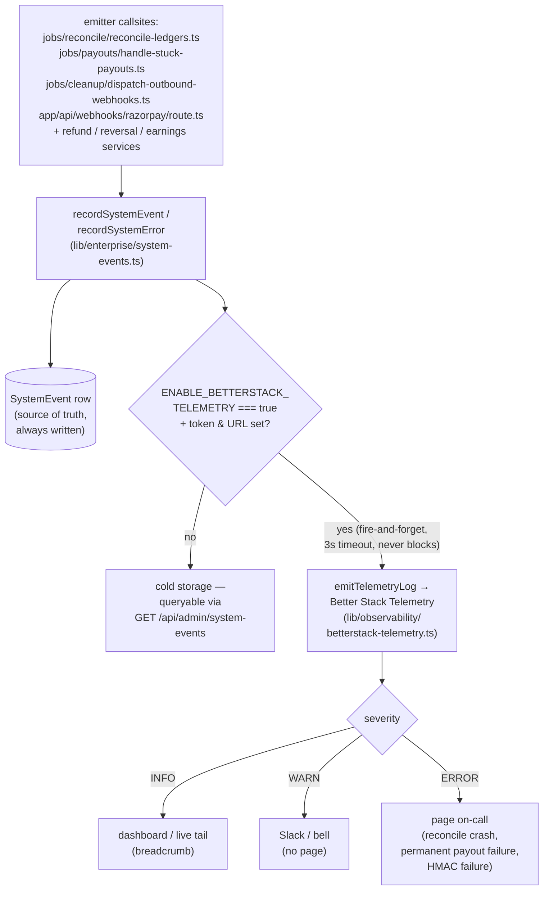

# Monitoring & alerting

This document is the source of truth for every alert, metric, and
observability signal the enterprise platform emits. Pair it with
`runbooks` for the response procedures.

> **First on-call? Use it like this.** You get paged → the alert names a
> **condition** and a **runbook anchor** (the *Alerts* tables below). Open
> that anchor in [`./03-runbooks.md`](03-runbooks.md) and execute it
> top-to-bottom — every Critical alert maps to one. If you're staring at a
> raw `SystemEvent` instead of a tuned alert, its `category` (`PAYOUT` /
> `RECONCILE` / `WEBHOOK` / `DATA_EXPORT`) tells you which subsystem and
> therefore which runbook section. Don't tune thresholds mid-incident —
> the numbers here are 30-day starting points, not gospel.

---

## Principles

1. **Structured logs, not print statements.** Every log line that's
   alertable has a stable `event` field that Cloud Logging routes to
   Datadog / Grafana / your observability stack of choice. Grepping
   random messages doesn't scale.
2. **Alerts trigger on symptoms, not causes.** We alert on "the wallet
   balance doesn't match the ledger" (symptom), not "a specific webhook
   retried" (cause). Causes live in logs; symptoms page humans.
3. **Every alert has a runbook.** If you can't write the response
   procedure in `runbooks`, the alert is too vague — tighten it.

---

## Log event taxonomy

All application logs use the following shape:

```ts
logger.info({
  event: "webhook.razorpay.received",
  provider: "razorpay",
  eventType: "payment.captured",
  eventId: "…",
  orgId: "…",
  durationMs: 42,
  ok: true,
});
```

The enterprise-critical `event` names are:

### Webhook lifecycle
- `webhook.razorpay.received` — inbound request (one per HMAC-verified event)
- `webhook.razorpay.processed` — downstream handler succeeded
- `webhook.razorpay.failed` — downstream handler threw
- `webhook.stripe.*` — same shape for Stripe
- `webhook.deduplicated` — idempotent replay short-circuited

### Wallet & invoice
- `wallet.topup.initiated` — order created, awaiting payment.captured
- `wallet.topup.confirmed` — webhook applied the credit
- `invoice.generated` — cron created a new `OrganizationInvoice`
- `invoice.paid` — payment captured against an invoice
- `invoice.irp.attempted` — IRP (e-invoice) upload attempted
- `invoice.irp.failed` — IRP upload failed (retry scheduled)

### Ledger & reconciliation
- `reconcile.started` — auditor began a run
- `reconcile.finding` — a single invariant broke (one per finding)
- `reconcile.completed` — auditor finished
- `ledger.transaction.serializable.retry` — `P2002`/serialization
  conflict triggered a retry at the Serializable isolation level

### Compliance
- `dpdp.consent.withdrawn` — user or admin withdrew consent
- `dpdp.sweeper.counted` / `dpdp.sweeper.deleted` — retention sweep
- `msme.alert.logged` / `msme.alert.sent` — MSME 43B(h) deadline alert

### Subscription cron
- `subs.invoice.claimed` — an individual subscription was claimed for
  billing (atomic `updateMany`)
- `subs.invoice.created` — invoice row created
- `subs.invoice.skipped` — already claimed by another worker

### v2 subsystems — primary signal is the job summary line + `SystemEvent`

The #777/#778/#779 crons don't all emit bespoke `event:` log names; most
print a single structured **summary line** at completion and rely on
their idempotency stamps as the observability surface (you alert on the
*absence* of progress, or on a backlog of un-stamped rows, not on a
per-row log). Know what each prints so you can build the alert:

| Subsystem | Job | Summary fields | Audit / SystemEvent signal |
|---|---|---|---|
| Cycle engine | `advance-program-cycles` | `scanned / rolled / closed / skipped` | `PROGRAM_ASSIGNMENT_ROLLED` audit row per ROLL/CLOSE |
| Contract auto-renew | `auto-renew-contracts` | `scanned / renewed / skipped` | `CONTRACT_AUTO_RENEWED` audit row |
| Contract expiry | `expire-contracts` | (expired count) | `CONTRACT_EXPIRED` audit row |
| Dunning | `dunning` | `scannedStage1 / markedOverdue / scannedStage2 / remindersSent / suspended` | `INVOICE_OVERDUE` (stage 1), `INVOICE_DUNNING_SUSPENDED` (stage 3, `ENABLE_DUNNING_SUSPEND`) |
| Overage timeout | `timeout-member-overages` | `scanned / timedOut` | — (member notify) |
| Overage abandon sweep | `sweep-abandoned-overage-charges` | `scanned / failed` + `::notice::` | — (silent) |
| Wallet floor (notify-only) | `wallet-low-balance` | `scanned / notified` | — (finance notify) |
| Stuck-webhook re-drive | `sweep-stuck-webhook-events` | `scanned / recovered / stillFailing` + `::warning::` | — |
| Orphaned top-up captures | `sweep-orphaned-topup-captures` | `scanned / recredited / stillFailing` | — |
| SSO cert expiry | `sso-cert-expiry-alert` | `scanned / alerted / parseFailures` | `SSO_CERT_EXPIRING` audit row |
| Outbound webhook dispatch | `dispatch-outbound-webhooks` | `scanned / succeeded / retried / failed` | `WEBHOOK`/WARN `SystemEvent` when backlog > 200 |

Two failure surfaces the v2 crons share, neither of which prints a
distinct `event:` line:

- **Webhook secret rotation** is observable via the `WEBHOOK_SECRET_ROTATED`
  audit action + the 24h dual-sign window (`WEBHOOK_ROTATION_GRACE_MS`,
  `lib/enterprise/outbound-webhooks/signing.ts`). Alert on deliveries
  still failing **after** the grace window elapsed (the consumer never
  swapped to the new secret).
- **SSO break-glass opened** has **no** dedicated event or audit action —
  it's a `breakGlassUntil` window on `OrganizationSSOSettings`, vetoed in
  `lib/sso/enforce-session.ts`. To page on it, watch for `SETTINGS_CHANGED`
  audit rows carrying the break-glass `details`, or query
  `OrganizationSSOSettings WHERE breakGlassUntil > now()`. See the
  warning row added below.

### Stream jobs on the operator surface (#1270)

Every scheduled Stream job is now listed by `/api/staff/system-jobs` and can be
run from `/api/admin/system-jobs/run`, using the same core function the workflow
calls. This closed two gaps at once. Before it, no Stream job appeared in either
catalogue, so the staff Jobs page could not show when any of them had last run;
and because `stream-sync` held a bespoke Redis lock rather than the fleet's
`withCronLock`, it wrote no `SystemJobExecution` row at all and would have shown
as never having run even after being listed.

| Job id | Summary fields | What a non-zero value means |
| --- | --- | --- |
| `stream-sync` | `staleIdentified / usersDeleted / failedDeletions` | Users that exist on Stream but not here were removed. Persistent `failedDeletions` usually means a Stream rate limit. |
| `mark-expired-recordings` | `expiredCount` | Recordings whose Stream URL has lapsed were tombstoned. |
| `transfer-expiring-recordings` | `succeeded / failed / expiringStreamOnly` | A non-zero `failed`, or any at-risk count in the job's own warning, means permanent recordings are approaching Stream's fourteen-day deletion with no copy in Supabase. Page on it. |
| `cleanup-old-stream-recordings` | `scanned / expired` | Recordings past their organization's retention window were erased from Supabase and tombstoned. A run that fails is a DPDP erasure gap, not a tidiness problem. |
| `reconcile-orphaned-recordings` | `scanned / recovered / stillMissing / unrecoverable` | `recovered` is good news about the job and bad news about the webhook: the row exists only because a delivery was lost. `unrecoverable` counts recordings Stream has already deleted, and it only ever grows. |
| `expire-event-channels` | `frozen / deleted / skippedAlreadyFrozen` | Post-event chat channels moved through the freeze and delete stages. |
| `reconcile-orphaned-sessions` | `processed / reconciled / streamNotFound` | Meeting sessions whose `call.session_ended` webhook never landed were closed. |

Two guards keep this fleet honest, and both are static, so they fail in CI rather
than in production. `__tests__/maintenance/cron-lock-registry.test.ts` re-derives
every scheduled workflow's entrypoint and asserts it takes a cron lock, which is
also what guarantees the `SystemJobExecution` row exists. `__tests__/maintenance/workflow-import-env.test.ts`
walks the same entrypoints' import graphs and fails if any of them reaches a
`server-only` module — the defect that had five workflows dying during module
evaluation, on every run, with no signal anywhere except a red Actions job that
nobody was watching.

---

## Alerts

The thresholds below are starting points — tune them per tenant once
you have 30 days of traffic data.

### Critical (page on-call immediately)

Every row here represents a condition where money integrity, subscription continuity, or cycle correctness is at risk; each cell links to the runbook section that contains the remediation steps.

| Alert | Condition | Runbook |
|-------|-----------|---------|
| Webhook queue backup | `count(webhook.razorpay.received) - count(webhook.razorpay.processed)` > 50 for 5 min | `03-runbooks.md#webhook-handler-is-backed-up-razorpay-or-stripe` |
| Ledger reconciler failing | `reconcile.completed` with `ok=false` in the last 24h | `03-runbooks.md#ledger-reconciler-flagged-discrepancies` |
| Wallet balance drift | any `reconcile.finding` with `kind=WALLET_BALANCE_DRIFT` | Same |
| Subscription cron crash | `subs.invoice.created` count = 0 for 2 consecutive days while `BillingSubscription` rows with `nextInvoiceDate < now()` exist | N/A — page SRE |
| HMAC verification failing | `WEBHOOK`/WARN `SystemEvent` ("HMAC verification failed") rate > 1/min | `03-runbooks.md#rotating-razorpay-credentials` / check LB stripping headers |
| Reconcile/payout crash | `RECONCILE` or `PAYOUT` `SystemEvent` with `severity=ERROR` (Better Stack sink) | `03-runbooks.md#ledger-reconciler-flagged-discrepancies` |
| Cycle engine stalled | `ProgramAssignment` with `status=ACTIVE`, `rolledAt=null`, `periodEnd < now() - 24h` count > 0 | `03-runbooks.md#cycle-engine-rollover-failed-assignment-stuck-un-rolled` |
| Contract auto-renew stalled | `Contract` with `autoRenew=true`, `status=ACTIVE`, `autoRenewedAt=null`, `effectiveTo < now() - 1h` count > 0 | `03-runbooks.md#contract-auto-renew-failed` |

### Warning (Slack, no page)

Each row describes a condition that signals a degraded but not yet broken state — IRP backlog, webhook grace-window lapses, dunning stalls — where a Slack notification gives the on-call team time to investigate before it escalates.

| Alert | Condition |
|-------|-----------|
| IRP upload failure rate | `invoice.irp.failed` / `invoice.irp.attempted` > 20% rolling 1h (only meaningful when `ENABLE_IRP_UPLOADER=true`; stub returns are expected sub-₹5cr) |
| Outbound webhook backlog | `WEBHOOK`/WARN `SystemEvent` "queue backlog" (fires at > 200 due deliveries) |
| Webhook secret rotation not adopted | `WEBHOOK_DELIVERY_FAILED` for an endpoint still failing > 24h after its `WEBHOOK_SECRET_ROTATED` row (consumer never swapped — grace window lapsed) |
| SSO break-glass open | `OrganizationSSOSettings.breakGlassUntil > now()` (SSO enforcement is bypassed for that window — confirm it was intentional) |
| Overage ceiling wedged | `OverageEvent` `chargeStatus=PENDING`, `overageBehavior=CHARGE_MEMBER`, `createdAt < now() - 14d` count > 0 (timeout cron not draining) |
| Dunning not escalating | `dunning` summary `markedOverdue + remindersSent = 0` for 48h while OVERDUE invoices with `dunningReminderCount < 3` exist |
| Wallet floor breached | `BillingAccount` `fundingSource=WALLET`, `walletBalance < minBalancePaise` (notify-only cron; no auto-charge — may need manual top-up) |
| DPDP sweeper skipped | `dpdp.sweeper.counted` without a `dpdp.sweeper.deleted` follow-up for 7 days when `DPDP_SWEEPER_DELETE=true` — **and note** the sweeper has no scheduled workflow today (see `runbooks` catalogue ⚠️) |
| MSME alerts not firing | `msme.alert.logged` count = 0 for 48h |

### Info (dashboard only)

These metrics require no immediate action but belong on a live dashboard as leading indicators — a rising serializable-retry rate or a deduplication spike can foreshadow the warning conditions above.

| Metric | Purpose |
|--------|---------|
| `webhook.deduplicated` rate | Healthy baseline for vendor retry behaviour |
| `ledger.transaction.serializable.retry` rate | Rising rate signals contention hotspots |
| MRR / ARPU trends | Business-health dashboard |

---

## Dashboards

Keep each dashboard **single-responsibility**:

1. **Money dashboard**
   - Wallet balance by org (top 20)
   - Open invoices (`ISSUED` + overdue)
   - Last 24h payment volume (by gateway)
   - Last reconciler run status

2. **Ops dashboard**
   - Webhook backlog size
   - Subscription cron last run + row count
   - DPDP sweeper last run
   - MSME alerts last run + rows alerted

3. **Compliance dashboard**
   - Consent artifacts by state
   - IRP upload success rate
   - Retention sweeper delete count (when live mode is on)

---

## Manual spot-checks

Run these during release rollouts to confirm nothing regressed:

```bash
# Webhook smoke test (Razorpay)
node scripts/razorpay-test-webhook.ts --event payment.captured --org $ORG_ID

# Reconciler dry-run against production
curl -X POST "$PROD/api/admin/reconcile-ledgers" \
  -H "Authorization: Bearer $TOKEN" \
  -H "Content-Type: application/json" \
  -d '{}' | jq '.report.ok'

# MSME alert dry-run
MSME_ALERT_EMAIL=dev-null@familiarise.com npx tsx jobs/compliance/msme-payment-alerts.ts
```

All three should emit deterministic output — wrap them in Bash `set -e`
for CI.

---

## What we explicitly don't alert on

- **Individual failed logins** — SSO noise, handled by BetterAuth rate
  limiting.
- **Individual webhook retries** — Razorpay will retry up to 24h, and
  the dedup layer handles it. Alert only on aggregate backlog.
- **Cancelled subscriptions** — user action; the funnel analytics team
  owns this, not the SRE on-call.

This list grows over time. When in doubt, add the metric to the info
dashboard first; promote to warning/critical once you've seen the
baseline.

## Alerting sink — Better Stack Telemetry (#776 §K)

How a caught failure becomes a page. The `SystemEvent` row is the source
of truth (always written, even with the sink off); Better Stack is the
*delivery* leg that turns a cold row into something an on-call human
actually sees. The flag `ENABLE_BETTERSTACK_TELEMETRY` is the only switch
between "rots in a table" and "wakes someone".



> The severity → channel mapping (INFO dashboard / WARN Slack / ERROR
> page) is **policy you configure in Better Stack**, not something the
> code enforces — the code only sets `level` from `SystemEventSeverity`
> (`lib/enterprise/system-events.ts` `severityToTelemetryLevel`). The
> *Alerts* tables above are the contract for what each severity should
> route to.

`recordSystemEvent` / `recordSystemError` (`lib/enterprise/system-events.ts`)
write the `SystemEvent` table (source of truth) and, when
`ENABLE_BETTERSTACK_TELEMETRY=true` with `BETTERSTACK_SOURCE_TOKEN` +
`BETTERSTACK_INGEST_URL` set, **also** ship a JSON event to the Better Stack
Telemetry logs HTTP ingest (`lib/observability/betterstack-telemetry.ts`,
Bearer source token). The sink is best-effort and off the critical path — an
ingest outage never blocks the caller.

Wired page-worthy callsites: failed/crashed ledger reconcile
(`jobs/reconcile/reconcile-ledgers.ts`), permanently-failed payouts
(`jobs/payouts/handle-stuck-payouts.ts`), outbound webhook queue backlog
(`jobs/cleanup/dispatch-outbound-webhooks.ts`), and inbound HMAC verification
failures (`app/api/webhooks/razorpay/route.ts`). This is distinct from
`lib/betterstack.ts`, which drives the Uptime/Incident-Management API for
maintenance windows.
