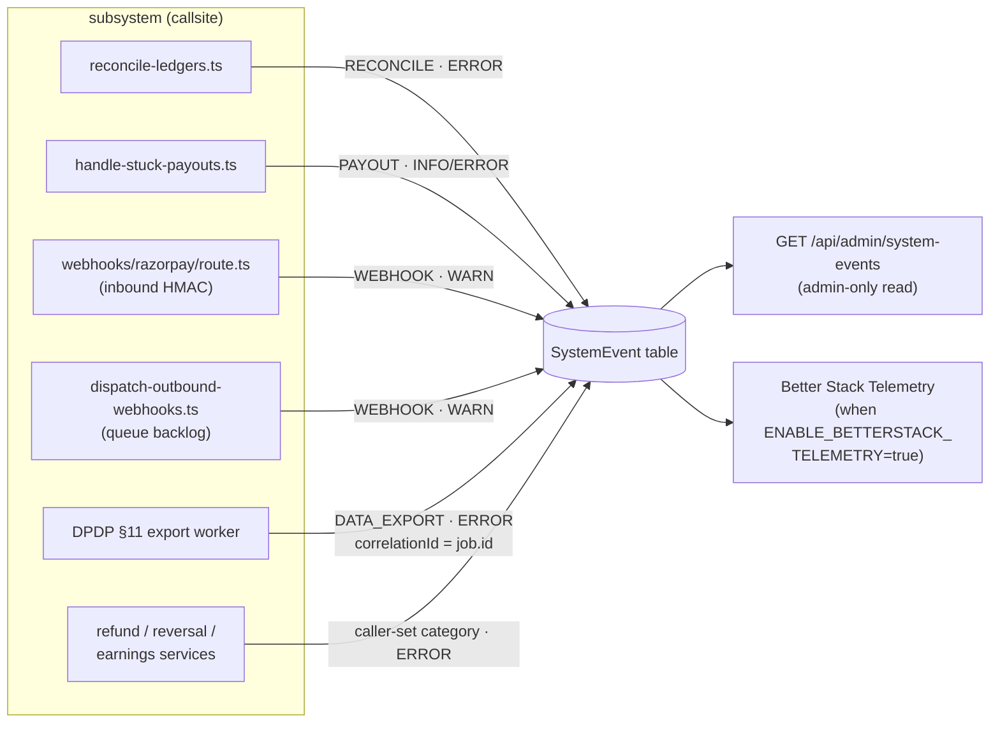

# SystemEvent — engineering-facing operational events

> **Two taxonomies, on purpose.** `SystemEvent` (this doc) is the
> **engineering-facing** stream — raw, admin-only, keyed by `category`.
> `OrgAuditLog` is the **customer-facing** stream — clean prose, member-
> readable, keyed by `action`. Same incident can write to both. This page
> documents both taxonomies (the `OrgAuditLog` action catalogue lives
> here too because callers need one place to look up "what string do I
> emit"), but they are distinct tables with distinct audiences and
> distinct read paths. If you're deciding where a new event goes: does an
> *org member* need to see it? → `OrgAuditLog` action. Does only
> *engineering* need the stack trace? → `SystemEvent` category.

Familiarise keeps **two** event streams, not one. This separation
prevents engineering noise (Prisma stack traces, internal IDs, raw
worker errors) from leaking into the org-visible audit log.

| Table | Audience | Content |
|---|---|---|
| `OrgAuditLog` | Org members (MAINTAINER+ readable) | Clean human prose: "PO WZ-2026-0042 created (INR 500,000)" |
| `SystemEvent` | Platform admins only | Raw engineering payload: stack frames, Prisma error syntax, HTTP responses |

Both can record the **same incident** — a failed data-export job
writes a clean prose row to `OrgAuditLog` ("Data export bundle failed
— engineering notified") and a raw stack-trace row to `SystemEvent`,
linked via `correlationId = exportJob.id`.

## Why a separate table

The platform shipped pre-MVP with a single audit log. An org owner
opening their dashboard saw audit rows like:

> "Data export bundle failed: Invalid \`prisma.organization.findUnique()\` invocation: { where: { id: '…', ? AND?: ProgramWhereInput | ProgramWhereInput\[\], ? type?: EnumProgramTypeFilter | ProgramType, … }"

This is **information disclosure**. Any org owner — including a
future hostile tenant — could enumerate our internal schema by
provoking errors. Three layers of defense:

1. **Write-side discipline** — failure paths write a clean prose
   description to `OrgAuditLog` and the raw error to `SystemEvent`.
2. **Read-side scrub** — `lib/enterprise/audit-sanitize.ts` strips
   known engineering-noise patterns from `OrgAuditLog.description`
   before the row reaches a client. Catches legacy rows and any
   regression at a new call site.
3. **Channel separation** — `SystemEvent` is admin-only by design.
   No org-scoped API route reads from it.

See [`audit-sanitize.ts`](../../../lib/enterprise/audit-sanitize.ts) for
the redaction patterns. See
[`system-events.ts`](../../../lib/enterprise/system-events.ts) for the
write helpers.

## Schema

```prisma
model SystemEvent {
  id             String              @id @default(uuid())
  organizationId String?             // nullable — platform-wide events
  category       String              // DATA_EXPORT | HRIS_SYNC | …
  severity       SystemEventSeverity @default(INFO)
  message        String              @db.Text
  context        Json?
  correlationId  String?
  createdAt      DateTime            @default(now())

  @@index([organizationId, createdAt])
  @@index([category, createdAt])
  @@index([severity, createdAt])
  @@index([correlationId])
}

enum SystemEventSeverity { INFO  WARN  ERROR }
```

### Field semantics

- **`organizationId`** — most events are tenant-scoped (job failed
  for org X); some are platform-wide (cron tick, deploy marker) and
  leave this `null`. FK on delete is `SetNull` because we want the
  event history to outlive a deleted org for incident post-mortems.

- **`category`** — free-form string matching the worker family.
  Conventional values: `DATA_EXPORT`, `HRIS_SYNC`, `WEBHOOK`,
  `PAYOUT`, `CRON`, `RECONCILE`. New workers add new values without
  a migration.

- **`severity`** — three-level enum. `INFO` = routine breadcrumb,
  `WARN` = recoverable issue worth flagging, `ERROR` = job failed,
  engineering should investigate.

- **`message`** — raw engineering string. Safe to interpolate
  `err.message`, Prisma error text, HTTP status codes, internal IDs.
  Never shown to org users.

- **`context`** — free-form JSON payload. By convention `recordSystemError`
  fills it with `{ errorMessage, stack, ...callerContext }`.

- **`correlationId`** — groups events for one invocation. Typically
  the parent job ID (e.g. `OrgDataExportJob.id`). Query
  `SystemEvent WHERE correlationId = 'abc' ORDER BY createdAt` to
  reconstruct one job's lifecycle.

## Writing events

Two helpers in `lib/enterprise/system-events.ts`:

```ts
import { recordSystemEvent, recordSystemError } from "@/lib/enterprise/system-events";

// Routine: a normal lifecycle breadcrumb
await recordSystemEvent({
  organizationId: orgId,
  category: "CRON",
  severity: "INFO",
  message: "Weekly payout batch started",
  correlationId: batchId,
});

// Error: an exception was caught
await recordSystemError({
  organizationId: orgId,
  category: "DATA_EXPORT",
  summary: "Data export bundle failed",  // ← prose summary
  err,                                    // ← raw exception
  context: { exportId: job.id },
  correlationId: job.id,
});
```

Both are **best-effort**: a failing `SystemEvent.create()` swallows
the error and logs to console. An outage of this table must not
cascade into the calling worker.

The companion org-visible audit row is written separately, in a
transaction adjacent to the system event:

```ts
await prisma.$transaction(async (tx) => {
  await tx.orgDataExportJob.update({ where: { id: job.id }, data: { status: "FAILED" } });
  await tx.orgAuditLog.create({
    data: {
      organizationId: job.organizationId,
      category: "SYSTEM",
      action: AUDIT_ACTIONS.SYSTEM.DATA_EXPORT_FAILED,
      // CLEAN prose only. Never interpolate err.message here.
      description: "Data export bundle could not be generated. Engineering notified.",
      details: { exportId: job.id },
    },
  });
});

// System event written outside the tx — non-blocking, captures the stack.
await recordSystemError({
  organizationId: job.organizationId,
  category: "DATA_EXPORT",
  summary: "Data export bundle failed",
  err,
  correlationId: job.id,
});
```

This pattern is the convention for every catch-and-record site.

## `OrgAuditLog` action catalogue

The org-visible audit trail. `OrgAuditLog.action` is a free-form `String`
in the schema (new events ship without a migration), but
[`lib/enterprise/audit-actions.ts`](../../../lib/enterprise/audit-actions.ts)
is the IDE-facing source of truth — callers import a constant for
autocomplete + typo safety. The constant object is
`satisfies Record<OrgAuditCategory, Record<string, string>>`, so every
top-level key below is also a value of the `OrgAuditCategory` enum.

Regenerated from code 2026-06-05. The v2 mega-audit (#777/#778/#779)
added the rows flagged **(v2)** below — supersede/auto-renew/end-early,
assignment rolled, invoice overdue/dunning, verification resubmit,
archive, and the existing webhook-secret-rotation / data-export rows.

> Dead vocabulary: `CONSULTANT_APPLIED` / `_APPROVED` / `_REJECTED` and
> their `EXPERT_*` aliases were purged in the Arch-4 terminology
> migration along with the old `OrgAuditAction` Prisma enum. They must
> not reappear — EXPERT membership is invite-driven
> ([`expert-lifecycle`](../30-programs-and-lifecycle/03-expert-lifecycle.md)).

### `MEMBER`
MEMBER events fire on every change to an organization's human membership roster — from adding or removing a member to role changes and the full invite flow — including the automatic expiry that the `cleanup-stale-invitations` cron emits for 14-day-old pending invites.

| action | Emission point |
|---|---|
| `MEMBER_ADDED` / `MEMBER_REACTIVATED` / `MEMBER_REMOVED` | members CRUD routes |
| `ROLE_CHANGE` / `STATUS_CHANGE` | member PATCH |
| `INVITE_SENT` / `INVITE_RESENT` / `INVITE_ACCEPTED` / `INVITE_REVOKED` | invite routes |
| `INVITE_EXPIRED` | `cleanup-stale-invitations` cron (PENDING invite past 14d) |

### `CONTRACT`
CONTRACT events span a contract's entire state machine — creation, countersigning, termination, and natural expiry fired by cron — plus the v2 supersession and auto-renew actions that result from the `advance-program-cycles` / `auto-renew-contracts` jobs.

| action | Emission point |
|---|---|
| `CONTRACT_CREATED` / `CONTRACT_SIGNED` / `CONTRACT_TERMINATED` / `CONTRACT_EXPIRED` | contract routes + `expire-contracts` cron |
| `CONTRACT_SUPERSEDED` **(v2 #779)** | amend/renew/supersede route (manual term replacement) |
| `CONTRACT_AUTO_RENEWED` **(v2 #779)** | `auto-renew-contracts` cron (mints RENEWAL successor, EXPIREs old) |

### `PROGRAM`
PROGRAM events cover the full entitlement lifecycle — create, pause, archive, delete, and all assignment mutations — plus the cron-driven cycle rollover that mints a successor assignment at each period boundary.

| action | Emission point |
|---|---|
| `PROGRAM_CREATED` / `PROGRAM_PAUSED` / `PROGRAM_DELETED` | program CRUD (DELETE no longer reuses `PROGRAM_PAUSED`) |
| `PROGRAM_ARCHIVED` **(v2 #777 §B)** | archive/unarchive (soft-hide; financial history preserved) |
| `PROGRAM_ASSIGNED` / `PROGRAM_ASSIGNMENT_UPDATED` / `PROGRAM_UNASSIGNED` | assignment routes |
| `PROGRAM_ASSIGNMENT_ROLLED` **(v2 #779)** | `advance-program-cycles` cron — one row per ROLL **and** per CLOSE (`details.closed` distinguishes) |
| `RATE_CARD_BUMPED` | rate-card change |

### `WALLET`
Wallet events capture prepaid-balance mutations: a top-up intent (`WALLET_TOPUP`), the confirmed credit once the Razorpay webhook lands, a refund back to the gateway, and any booking-time debit that fails the overdraft guard.

| action | Emission point |
|---|---|
| `WALLET_TOPUP` / `WALLET_TOPUP_CONFIRMED` | top-up initiate + webhook confirm |
| `WALLET_REFUND` | wallet refund |
| `WALLET_DEBIT_FAILED` | debit attempt with insufficient balance |

### `INVOICE`
INVOICE events record the full arc of an organization's billing document — from purchase-order creation and invoice generation through payment, overdue escalation, cancellation, and refund — and are the primary audit trail for GST compliance and dunning state.

| action | Emission point |
|---|---|
| `PURCHASE_ORDER_CREATED` | PO route |
| `INVOICE_GENERATED` / `INVOICE_ISSUED` | `generate-subscription-invoices` (daily) + accrual rollup (`settle-invoice-accruals`, monthly) |
| `INVOICE_OVERDUE` **(v2 #779)** | `dunning` cron stage 1 (ISSUED→OVERDUE, stamps `markedOverdueAt`) |
| `INVOICE_DUNNING_SUSPENDED` **(#812)** | `dunning` cron stage 3 (`ENABLE_DUNNING_SUSPEND`-gated) when an OVERDUE invoice stays unpaid 7 days past the last reminder; stamps `dunningSuspendedAt` |
| `INVOICE_PAYMENT_INITIATED` / `INVOICE_PAID` | invoice pay flow |
| `INVOICE_CANCELLED` / `INVOICE_VOIDED` / `INVOICE_REFUNDED` / `REFUND_DENIED` | invoice admin actions |
| `INVOICE_ROLLED_UP` | accrual rollup in `settle-invoice-accruals` (parent rolls up child invoices), which absorbed the retired `consolidated-invoice-rollup` job (#813) |

> Dunning **stage 2** (escalation reminders, 7d cadence × max 3) does
> **not** emit a distinct audit action — it bumps
> `dunningReminderCount` + `lastDunningReminderAt` and re-notifies; only
> the stage-1 ISSUED→OVERDUE flip writes `INVOICE_OVERDUE`. Stage 3
> (`ENABLE_DUNNING_SUSPEND`-gated, #812) now writes `INVOICE_DUNNING_SUSPENDED`
> when it stamps `dunningSuspendedAt`; the claim and that audit row commit
> together in one Serializable transaction.

### `PAYOUT`
PAYOUT events trace the full disbursement lifecycle — from batch creation and gateway submission through terminal success, failure, or reversal — as well as the earnings hold/release gate and the manual clawback path when a refund hits an already-completed payout.

| action | Emission point |
|---|---|
| `PAYOUT_INITIATED` / `PAYOUT_PROCESSED` / `PAYOUT_COMPLETED` / `PAYOUT_CANCELLED` / `PAYOUT_FAILED` | payout pipeline + webhooks |
| `EARNINGS_HELD` / `EARNINGS_RELEASED` | hold gate + release cron |
| `PAYOUT_CLAWBACK` | `applyRefundCascade` when a refund hits an already-COMPLETED payout (manual recovery v1) |
| `PAYOUT_REVERSED` | `payout.reversed` webhook (bank rejected a submitted transfer). On the org side `markOrgPayoutReversed` writes this audit action; the consultant side `markConsultantPayoutReversed` claims COMPLETED→REVERSED, posts the inverse PAYOUT journal, and re-opens its earnings to READY but has no consultant-scoped audit table, so it logs the equivalent as structured output (#812). |

### `SETTINGS`
Configuration changes that affect org identity, access control, or compliance posture all land in SETTINGS — from SSO toggling and domain verification to audit-log exports and the SSO-cert expiry warning fired by cron.

| action | Emission point |
|---|---|
| `SETTINGS_CHANGED` | org settings PATCH |
| `SSO_ENABLED` / `SSO_DISABLED` | SSO config |
| `DOMAIN_CLAIMED` / `DOMAIN_VERIFIED` / `DOMAIN_RELEASED` | domain-claim routes (DNS TXT verify) |
| `AUDIT_LOG_EXPORTED` | `GET …/audit/export` (the CSV exporter is itself auditable) |
| `SSO_CERT_EXPIRING` | `sso-cert-expiry-alert` cron (30d WARN / 7d CRITICAL; `details.daysRemaining`) |

> There is **no** dedicated break-glass audit action. SSO break-glass is
> a `breakGlassUntil` window on `OrganizationSSOSettings` enforced in
> [`lib/sso/enforce-session.ts`](../../../lib/sso/enforce-session.ts); the
> open/close mutation rides the generic `SETTINGS_CHANGED` row. If you
> are looking for "who opened break-glass", filter `SETTINGS_CHANGED`
> with the break-glass `details` payload, not a distinct action.

### `CONSENT`
CONSENT events track the DPDP data-principal lifecycle — a grant when an org records consent on behalf of a user, a withdrawal when that user exercises their §12 erasure right, and a breach report when the platform raises a data-breach incident.

| action | Emission point |
|---|---|
| `CONSENT_GRANTED` / `CONSENT_WITHDRAWN` | consent routes (DPDP grant/withdraw) |
| `DATA_BREACH_REPORTED` | breach intake |

### `CATALOG`
Sponsored-plan visibility is managed through CATALOG events, which fire when an org's billing admin adds a plan to or removes one from the sponsored catalog.

| action | Emission point |
|---|---|
| `CATALOG_PLAN_CREATED` | `POST …/catalog` (OWNER adds a sponsored plan) |
| `CATALOG_PLAN_DEACTIVATED` | `DELETE …/catalog` bulk deactivate (one row, `details.planIds`) |

### `SYSTEM`
The catch-all for platform-actor events (the actor is the platform/an
IdP token/a regulatory surface, not a human member).

| action | Emission point |
|---|---|
| `VERIFIED` / `SUSPENDED` / `REACTIVATED` / `DEACTIVATED` | org status machine |
| `VERIFICATION_REJECTED` / `VERIFICATION_RESUBMITTED` **(v2 #779 §A)** | PENDING_VERIFICATION resubmit loop (admin bounces → OWNER re-submits; org stays PENDING throughout) |
| `ORG_DELETED` | `DELETE …/[orgId]` (row outlives the org via soft-deleted membership FK) |
| `AUDIT_PRUNED` | `prune-audit-logs` cron (one summary row/org/run: `{deleted7y,deleted2y,cutoff7y,cutoff2y}`) |
| `STREAM_RECORDING_DELETED` / `STREAM_CALLS_EXPORTED` / `STREAM_RETENTION_CHANGED` | Stream retention cron + export + settings |
| `USER_ERASURE_REQUESTED` / `_PROCESSED` / `_REJECTED` / `_SLA_WARNING` | DPDP §12 erasure lifecycle |
| `DATA_EXPORT_REQUESTED` / `_GENERATED` / `_FAILED` / `_DOWNLOADED` | DPDP §11 access-bundle lifecycle (`process-data-exports` worker writes GENERATED/FAILED) |
| `SCIM_USER_*` / `SCIM_GROUP_*` / `SCIM_TOKEN_*` (9 actions) | SCIM 2.0 provisioning (actor is an IdP token) |

### `WEBHOOK`
Outbound webhook subsystem (one category for endpoint config + delivery
results). Delivery rows emit **one summary per final state**, not per
attempt.

| action | Emission point |
|---|---|
| `WEBHOOK_ENDPOINT_CREATED` / `_UPDATED` / `_DELETED` | endpoint CRUD |
| `WEBHOOK_SECRET_ROTATED` **(v2)** | secret rotation (starts the 24h dual-sign grace — see `monitoring`) |
| `WEBHOOK_ENDPOINT_PAUSED` / `_RESUMED` | endpoint enable/disable |
| `WEBHOOK_DELIVERY_SUCCEEDED` / `_FAILED` / `_REDELIVERED` | dispatch worker terminal states |

## `SystemEvent` category catalogue

Before the table: the **emission map**. This is the engineering-facing
half of the two-stream split — which subsystem writes which `category`,
and where those rows are read. Use it to answer "I'm seeing `PAYOUT`
ERROR events, who emits those?" without grepping. (The customer-facing
half — `OrgAuditLog` actions by category — is the catalogue two sections
up.) Only the four categories with a **live emitter** are shown; `CRON`
and `HRIS_SYNC` are reserved vocabulary nothing writes yet.



`SystemEvent.category` is a free-form string (new workers add values
without a migration). The conventional values and their current
emitters — the ones that actually call `recordSystemEvent` /
`recordSystemError` today (grep verified 2026-06-05):

| category | Emitters (callsites) | Notes |
|---|---|---|
| `WEBHOOK` | `app/api/webhooks/razorpay/route.ts` (HMAC verification failed, WARN — both Razorpay + RazorpayX secret paths); `jobs/cleanup/dispatch-outbound-webhooks.ts` (outbound queue backlog > 200, WARN) | inbound tamper/misconfig + outbound queue health |
| `RECONCILE` | `jobs/reconcile/reconcile-ledgers.ts` (discrepancies found → ERROR; auditor crashed → ERROR) | money-integrity drift |
| `PAYOUT` | `jobs/payouts/handle-stuck-payouts.ts` (`recordSystemEvent` breadcrumb + `recordSystemError` on permanent failure) | stuck/failed disbursement |
| `DATA_EXPORT` | DPDP §11 worker failure path (the canonical clean-prose-vs-raw-stack split below) | `correlationId = OrgDataExportJob.id` |

Additional `recordSystemError` callsites that flow through the same sink
(they pass their own `category`): `lib/payments/operations/refund.ts`,
`lib/payments/operations/reversal-engine.ts`,
`lib/payments/payouts/earnings-service.ts`. Every one of these ALSO
ships to Better Stack Telemetry when `ENABLE_BETTERSTACK_TELEMETRY=true`
— `recordSystemEvent` fires `emitTelemetryLog` fire-and-forget after the
DB write (see `monitoring` for the sink wiring).

> Other conventional categories named in the schema docstring
> (`HRIS_SYNC`, `CRON`) have **no live emitter** as of 2026-06-05 — they
> are reserved vocabulary, not active streams. Don't build an alert on a
> category nothing writes.

## Reading events

### Platform admin API

```
GET /api/admin/system-events
```

Admin-only (`requireAdminAuth`). Query params:

- `severity` — `INFO` | `WARN` | `ERROR`
- `category` — exact match
- `organizationId` — scope to one tenant
- `correlationId` — pull all events for one job invocation
- `since` — ISO timestamp lower bound
- `limit` — page size (default 100, max 500)

Cursor pagination on `(createdAt DESC, id DESC)` using the covering
indexes.

### Future admin UI

Not yet shipped. The API surface is enough for engineering's current
needs (curl + Slack incident channel). A dashboard page would live at
`/dashboard/admin/system-events` and is tracked separately.

## Read-side scrub (defense in depth)

`lib/enterprise/audit-sanitize.ts` catches any case where engineering
noise still reaches `OrgAuditLog`. The sanitizer runs on:

- `GET /api/organizations/[orgId]/audit` (list endpoint)
- `GET /api/organizations/[orgId]/audit/export` (CSV exporter)

Five patterns flag a description as "engineering goop" and trigger a
redaction:

1. `Invalid \`prisma.*.findUnique()\` invocation` (Prisma error shape)
2. `ProgramWhereInput`, `LicensedSeatConfigNullableScalarRelationFilter`,
   etc. (Prisma schema enum names)
3. `at someFn (file.ts:42:13)` (Node stack frames)
4. `node:internal/...` paths
5. Long JSON blobs inline

When matched, the description is replaced with:

> `<safe prefix>: [redacted — engineering details available to platform admins only]`

The "safe prefix" preserves the user-meaningful header (e.g. "Data
export bundle failed:") when the prefix itself is clean prose, so the
OWNER still knows *what kind* of event happened.

`sanitizeAuditDetails()` likewise strips known sensitive keys
(`error`, `stack`, `prismaError`, `errorStack`, `rawError`) from the
`details` JSON payload at projection time.

The raw row stays in the DB — only the org-visible **projection** is
sanitized. Engineering can pull the original via direct SQL or the
admin API.

## Tests

`__tests__/enterprise/audit-sanitize.test.ts` (16 tests, 100% coverage)
covers every redaction pattern + idempotency + the prefix-preservation
behavior. Includes a regression test for the exact
`LicensedSeatConfigNullableScalarRelationFilter` string that
triggered the original bug report.

## Related

- [`organization-lifecycle`](../00-foundations/05-organization-lifecycle.md) — org status state machine
- [`data-export`](../40-compliance-and-data/03-data-export.md) — DPDP §11 worker that exercises both event streams
- `lib/enterprise/audit-actions.ts` — typed action catalogue for `OrgAuditLog`
- `lib/enterprise/audit-sanitize.ts` — read-side scrub
- `lib/enterprise/system-events.ts` — write helpers
