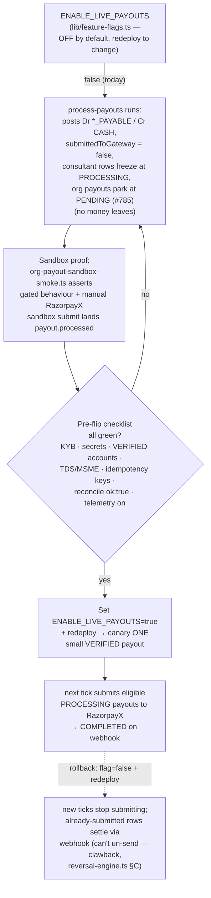

# Live-payout go-live runbook

> **Status:** `ENABLE_LIVE_PAYOUTS` is **OFF**. Payouts create rows and post
> `Dr *_PAYABLE / Cr CASH` but freeze at `PROCESSING` — money does **not**
> leave the gateway. This runbook makes flipping the flag a de-risked,
> one-variable operation. Related: [payout-pipeline](../10-money-and-ledger/07-payout-pipeline.md),
> [runbooks](03-runbooks.md).

The disbursement code is real (`lib/payments/payouts/org-payout-service.ts`
`submitOrgPayoutToGateway`, `razorpay-payouts.ts` `createPayout` — a live
RazorpayX POST). It is gated solely by `process.env.ENABLE_LIVE_PAYOUTS === "true"`.
The risk at go-live is paying the wrong amount/recipient on an unproven path, so
we prove the path in sandbox before flipping the production flag.

The gate, end to end — one flag, two states, with the prove-before-flip
path between them:



## Why a runbook and not just "flip the flag"

`processOrgPayout` reads the flag at call time. With it off, `submittedToGateway`
is always `false` and the row stays `PROCESSING`. Flipping it on makes the very
next cron tick submit **every** eligible `PROCESSING` payout to RazorpayX. That
is real money on the first run — so the prerequisites below are hard gates.

## Pre-flip checklist (all must be green)

- [ ] **RazorpayX account live** + KYB complete; the platform's RazorpayX
      balance is funded to cover the first batch.
- [ ] **Production secrets set** in the deploy env: `RAZORPAY_KEY_ID`,
      `RAZORPAY_SECRET` (RazorpayX-enabled), `RAZORPAYX_WEBHOOK_SECRET`.
      The canonical secret name is `RAZORPAY_SECRET`; the reconciliation
      scripts accept the legacy `RAZORPAY_KEY_SECRET` as a fallback only, so
      new environments must not rely on it (#677 PM-1).
- [ ] **Payout accounts VERIFIED** for every org/consultant in the first batch
      (`OrganizationPayoutAccount.status === "VERIFIED"`; the contact +
      fund-account side-channel finished provisioning).
- [ ] **TDS + MSME fields populated** on the payouts (`tdsAmountPaise`,
      `mustPayByDate` — both payout paths stamp these as of #776).
- [ ] **Idempotency keys present** (`payout_<profile>_<batch>`, NOT NULL) so a
      retry can never double-pay.
- [ ] **Sandbox proof done** (next section) — green.
- [ ] **Reconcile clean**: `reconcile-ledgers` reports `ok:true`, 0 findings
      (incl. `ORG_PAYOUT_TOTAL_MISMATCH`, `LEDGER_BALANCE_SNAPSHOT_DRIFT`).
- [ ] **Monitoring live**: `ENABLE_BETTERSTACK_TELEMETRY=true` so a stuck/failed
      payout pages someone (#776 §K — `handle-stuck-payouts` emits to the sink).
- [ ] **Rollback understood** (final section).

## RazorpayX go-live realities the checklist must cover

The checklist above proves the *submission* path, but the gateway's own
lifecycle has three sharp edges that only matter once real money is
moving. Each is documented in detail in
[`payout-pipeline`](../10-money-and-ledger/07-payout-pipeline.md) §3; they
are summarised here as go-live concerns because the prove-before-flip work
must account for them before any high-value payout ships.

The first edge is **post-completion reversal**. A RazorpayX payout that
reaches `processed` is not guaranteed to be final: if the beneficiary's
bank later returns the funds — a closed, frozen, or name-mismatched
account — RazorpayX credits the amount back to our business account and
fires a `payout.reversed` webhook. This is now handled (#812): `PayoutStatus`
carries a dedicated `REVERSED` value, and `markOrgPayoutReversed` claims a
`COMPLETED` row into `REVERSED`, posts the exact inverse `ORG_PAYOUT`
journal, re-opens the linked earnings to `READY`, and writes the
`PAYOUT_REVERSED` audit entry in one transaction (the consultant rail
mirrors this via `markConsultantPayoutReversed`). The one remaining caveat
is that the gateway **poller** still only re-polls `PENDING`/`PROCESSING`
and `mapPayoutStatus` collapses a polled `reversed` to `FAILED`, so a
post-completion reversal is caught by the **webhook** path rather than the
poller. At go-live, confirm the `payout.reversed` webhook is delivering and
read the `OrgAuditLog` `PAYOUT_REVERSED` row to distinguish a true bank
reversal from an ordinary failure; a poller-side `COMPLETED → reversed`
re-poll remains a sensible fast-follow before NEFT/RTGS payouts go live.

The second edge is the **UTR, which arrives on `payout.updated`**. The
Unique Transaction Reference is the bank-rail receipt a host org uses to
trace funds, and it is null while a payout is `processing` — it only
becomes available once the beneficiary bank confirms the credit, delivered
on the `payout.updated` webhook. The `OrganizationPayout.gatewayUtr` column
exists but is not yet populated, so a go-live operator must be prepared to
fetch the UTR from the RazorpayX dashboard when a host org asks for a bank
reference, until persisting `payout.updated` is wired.

The third edge is **deemed-success and the T+3 window**. IMPS and UPI
payouts are near-instant, but a payout still `processing` after roughly
three minutes is most likely in NPCI's deemed-success state and can take
up to T+3 working days to resolve. That window exceeds the
`handle-stuck-payouts` 24-hour threshold, so a row carrying a
`providerPayoutId` will be reconciled against the gateway rather than
re-submitted — which is safe precisely because of the deterministic
`payout_<profile>_<batch>` idempotency key. The canary should be a UPI or
IMPS payout whose `processed` confirmation you can watch land, and the
operator must not treat a still-`processing` row inside the T+3 window as a
failure to retry.

## Sandbox proof

Goal: prove the submission path is correct **without** touching the production
flag. The smoke asserts the gated behaviour and is safe to run anywhere:

```bash
# Asserts: with the flag OFF, processOrgPayout advances to PROCESSING and makes
# NO gateway submission (no providerPayoutId, money does not leave).
DATABASE_URL=… DIRECT_URL=… npx tsx scripts/smoke/org-payout-sandbox-smoke.ts
```

Sandbox-proof items, each mapped to an assertion the smoke makes (or a manual
step for the ones that need real sandbox creds):

| Proof item | How |
|---|---|
| Flag off ⇒ no disbursement | smoke: `submittedToGateway === false`, status `PROCESSING` |
| No money leaves while gated | smoke: `providerPayoutId == null` after process |
| TDS/MSME stamped before submit | inspect a real batch in staging (`tdsAmountPaise`, `mustPayByDate`) |
| Idempotency key never null | schema `@unique` + creator stamps `payout_<profile>_<batch>` |
| Real sandbox submit succeeds | **manual**: set `RAZORPAYX_SANDBOX_KEY`/`_SECRET`, submit one payout against the RazorpayX sandbox host, confirm the `payout.processed` webhook lands and `markOrgPayoutCompleted` fires |

## Flip procedure

1. Confirm the checklist + sandbox proof are green.
2. Set `ENABLE_LIVE_PAYOUTS=true` in the **production** deploy env (it's not a
   runtime toggle — a redeploy is required; this is intentional).
3. Redeploy.
4. **Canary**: ensure only ONE small, fully-VERIFIED payout is eligible for the
   first `process-payouts` tick (cancel/hold the rest). Watch it go
   `PROCESSING → COMPLETED` and confirm the `payout.processed` webhook +
   `notifyOrgPayoutCompleted`.
5. Reconcile (`reconcile-ledgers`) — expect 0 findings.
6. Release the held payouts.

## Rollback

- Set `ENABLE_LIVE_PAYOUTS=false` and redeploy. New ticks stop submitting; rows
  in `PROCESSING` that were already submitted continue to settle via webhook
  (you can't un-send a transfer — that's a clawback, see §C reversal engine).
- A stuck `PROCESSING` row (submitted, no terminal webhook) is handled by
  `jobs/payouts/handle-stuck-payouts` (reconcile against the gateway, retry, or
  fail). It now emits to the telemetry sink on permanent failure.
- A wrong disbursement is recovered via the reversal engine's `PAYOUT_CLAWBACK`
  source (`lib/payments/operations/reversal-engine.ts`) — ledger clawback is
  immediate; the gateway-side transfer reversal is the deferred #716 tail.
