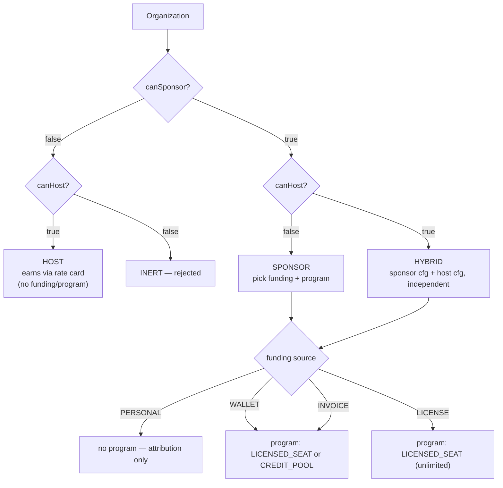
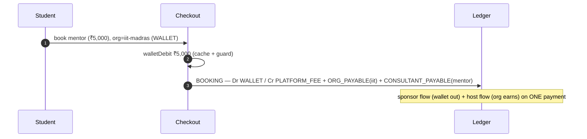
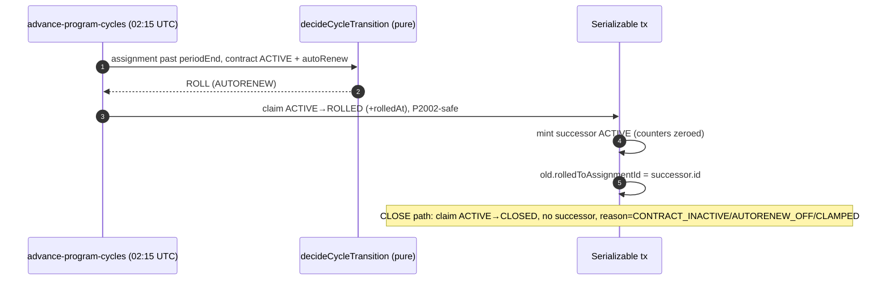
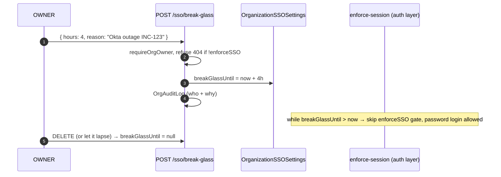

# Scenarios & worked examples — every permutation

**What this covers:** the full cross-product of the enterprise axes — **capability** (`canSponsor` × `canHost`), **funding source**, **program type**, **overage behaviour**, **payout recipient** — what each combination means, which are valid, and then **detailed end-to-end playthroughs** (a startup, Wipro, LearnPro, a consulting firm, IIT Madras, a solo consultant, and a product company on the credit-pool money-meter — §5.10a) showing every leg, posting, and settlement — followed by the **v2 lifecycle & money-safety scenarios** (§5.11–§5.16: cycle rollover, surcharge + circuit-breaker overage, dunning, wallet floor, contract supersession, SSO break-glass). This is the doc to read once you understand the parts ([organization-types](../00-foundations/02-organization-types.md)–[ledger-integrity](../10-money-and-ledger/13-ledger-integrity.md), plus [contract-lifecycle](../30-programs-and-lifecycle/07-contract-lifecycle.md)/[cycle-engine-and-rollover](../30-programs-and-lifecycle/08-cycle-engine-and-rollover.md)) and want to see them compose.

> Every steady-state example uses the seed cohort (`prisma/seedFiles/15a-create-organizations.ts`) so the numbers are real and reproducible. The v2 scenarios (§5.11–§5.16) are **time-based** — they only fire when a cron advances state past a `periodEnd` / `dueDate`, which the static seed hasn't yet hit; each one says explicitly whether it's seed-grounded or a hypothetical with exact field values. Postings are transcribed from [ledger & postings §4](../10-money-and-ledger/03-ledger-and-postings.md); read that first if a `Dr/Cr` block is unfamiliar. ₹ amounts are paise in code (₹1 = 100 paise).

---

## 1. The axes

Five independent decision points — capability, funding source, program type, overage behaviour, and payout recipient — together determine every enterprise configuration; this table names their values and where each one lives in the schema.

| Axis | Values | Lives on | Doc |
| --- | --- | --- | --- |
| **Capability** | `canSponsor` × `canHost` → SPONSOR / HOST / HYBRID (INERT rejected) | `Organization` | [organization-types](../00-foundations/02-organization-types.md) |
| **Funding source** (sponsor side only) | PERSONAL · WALLET · INVOICE · LICENSE · *PROJECT (v2)* | `BillingAccount` | [funding-and-programs](../00-foundations/03-funding-and-programs.md) |
| **Program type** (the entitlement) | LICENSED_SEAT · CREDIT_POOL · *PROJECT/RETAINER (v2)* | `Program` (under `Contract`) | [programs](../30-programs-and-lifecycle/02-programs.md) |
| **Overage behaviour** (cap exhaustion) | BLOCK · CHARGE_MEMBER · CHARGE_ORG | `LicensedSeatConfig` | [programs](../30-programs-and-lifecycle/02-programs.md) |
| **Payout recipient** (host side) | SELF · ORGANIZATION | `Membership` | [booking-to-earnings](../10-money-and-ledger/05-booking-to-earnings.md) |



---

## 2. Capability × funding — which combinations exist

Funding only applies to the **sponsor** side. A pure HOST org has no `BillingAccount`.

| Capability | PERSONAL | WALLET | INVOICE | LICENSE |
| --- | --- | --- | --- | --- |
| **SPONSOR** (canHost=false) | ✅ attribution-only | ✅ prepaid pool | ✅ NET-NN postpaid | ✅ flat-fee contract |
| **HOST** (canSponsor=false) | — (no billing account) | — | — | — |
| **HYBRID** (both) | ✅ + host earnings | ✅ + host earnings | ✅ + host earnings | ✅ + host earnings |

A HYBRID org runs **two independent flows on the same `Payment`** when it sponsors its own expert: the sponsor side pays (via its funding source) and the host side accrues `OrganizationEarnings` — each computed from its own `RateCard`. They never net inside one ledger account; they're separate postings.

## 3. Funding × program — what the program adds

Each funding source pairs with a limited set of program types and drives a distinct per-booking money leg; read this to understand what journal entry a booking will produce given a sponsor org's configuration.

| Funding | Typical program | Per-booking money | Notes |
| --- | --- | --- | --- |
| PERSONAL | *(none)* | learner's `CARD` → `Dr CASH` | org is attribution-only; `Payment.organizationId` tagged |
| WALLET | LICENSED_SEAT or CREDIT_POOL | `WALLET` leg → `Dr WALLET(org)` | prepaid; overdraft-guarded; balance is a derived cache |
| INVOICE | LICENSED_SEAT or CREDIT_POOL | `INVOICE_ACCRUAL` leg → `Dr ORG_RECEIVABLE(org)` | no cash at booking; billed at cycle close |
| LICENSE | LICENSED_SEAT (`coveredEngagementsPerCycle = null`) | `LICENSE` leg → **0** (no money) | flat fee already paid via subscription; bookings only consume `UsageLedgerEntry` |

## 4. Program × overage — what happens at the cap

`OverageBehavior` only bites when a `LICENSED_SEAT` engagement count (or a `CREDIT_POOL` credit balance) is exhausted mid-cycle:

| Behaviour | At the cap | Money path |
| --- | --- | --- |
| `BLOCK` | checkout returns **402** (`ProgramAssignmentLimitError`) | none |
| `CHARGE_MEMBER` | member pays the overage on their own card | `CARD` leg → `Dr CASH`; `BookingUtilization.wasOverage = true`; `OverageEvent PENDING` |
| `CHARGE_ORG` | org absorbs it | `OVERAGE_INVOICE_ACCRUAL` leg → `Dr ORG_RECEIVABLE` at booking, rolled into the cycle invoice; `OverageEvent PENDING→ACCRUED→CHARGED` |

Two knobs ride on top of the marginal (both per [programs §6](../30-programs-and-lifecycle/02-programs.md)): `overageSurchargeBps` marks the pass-through up (`marginalPaise = basePaise + surchargePaise`), and `maxOveragePerCyclePaise` is a **circuit breaker** — once the cycle's cumulative `OverageEvent.marginalPaise` would breach it, the next booking falls back to `BLOCK` (distinct code `PROGRAM_CAP_EXHAUSTED`, 402) regardless of `overageBehavior`. The full overage state machine (`PENDING/ACCRUED/CHARGED/BLOCKED/REVERSED/FAILED`) lives in [programs](../30-programs-and-lifecycle/02-programs.md); worked numbers are in [§5.12](#512-overage-with-surcharge--circuit-breaker-v2); the cap-vs-cycle interplay is in [cycle-engine-and-rollover](../30-programs-and-lifecycle/08-cycle-engine-and-rollover.md).

---

## 5. Worked examples

Each shows **setup → a booking → the leg(s) → the ledger posting → settlement → reconcile**. They build up in capability order — **SPONSOR** (5.1–5.3) → **HOST** (5.4–5.5) → **HYBRID** (5.6, which combines both) → cross-cutting cases (5.7–5.10, plus the product-company CREDIT_POOL money-meter §5.10a) → **v2 lifecycle & money-safety** (5.11–5.16: cycle rollover, surcharge + breaker overage, dunning, wallet floor, contract supersession, SSO break-glass).

### 5.1 A startup — SPONSOR · PERSONAL (attribution-only, the simplest)

**Setup:** a 20-person startup wants visibility into coaching spend without prepaying. `canSponsor=true, canHost=false`, `BillingAccount(fundingSource=PERSONAL)`, no program.

**A booking.** Employee books a ₹1,500 session on their own card; the org is only tagged:
```
BOOKING  booking:<paymentId>
  Dr CASH(platform)                 150000   (employee card)
     Cr PLATFORM_FEE                 ...
     Cr CONSULTANT_PAYABLE(expert)   ...
     Cr GST_PAYABLE                  ...
```
`Payment.organizationId = <startup>` for analytics; **no wallet, no invoice, no receivable**. Upgrading later to WALLET/INVOICE is a `fundingSource` change (with the wallet-drain guard, [organization-types](../00-foundations/02-organization-types.md)).

### 5.2 Wipro — SPONSOR · INVOICE · LICENSED_SEAT (the buyer)

**Setup (seed):** `canSponsor=true, canHost=false`. `BillingAccount(fundingSource=INVOICE, requiresPO=true)`. A `PurchaseOrder` for **₹50,00,000**. A `LICENSED_SEAT` program *"Wipro Engineer Leadership Program"* — **200 seats**, **₹25,000/seat/year**, **`coveredEngagementsPerCycle = 12`**, `overageBehavior = CHARGE_ORG`. Members are LEARNERs; the OWNER is Head of People Ops, with a **BILLING_ADMIN** from finance managing POs/invoices.

**Seat subscription (the recurring money).** The 200 seats × ₹25,000 bill via `BillingSubscription` → `OrganizationInvoice` against the PO. Issuing the invoice decrements `PurchaseOrder.remainingAmountPaise` (atomic compare-and-swap, [invoicing §6](../10-money-and-ledger/08-invoicing.md)); paying it posts:
```
INVOICE_PAID  invoicepaid:<invoiceId>
  Dr CASH(platform)            <invoice total>
     Cr ORG_RECEIVABLE(wipro)  <invoice total>
```

**A covered booking (within the 12/cycle cap).** Engineer Alice books her 3rd leadership session this cycle. The seat already paid for it, so **no money moves at booking**:
- `PaymentLeg(source=LICENSE, amountPaise=0)`.
- `recordBookingUtilization` writes a `UsageLedgerEntry(engagementsConsumed=1)` and atomically increments `ProgramAssignment.engagementsUsed` (3 → 4).
- **No `BOOKING` journal txn** — `postLedgerTxn` is skipped because the funding total is 0 (correct: nothing moved). The consultant is paid from the pooled seat revenue at settlement, not per booking.

**An overage booking (the 13th).** `engagementsUsed (12) + 1 > 12` and `overageBehavior = CHARGE_ORG`. Price ₹4,000. Wipro is `canHost=false` and the expert is a marketplace consultant, so there's **no `ORG_PAYABLE`** leg — the org-share bps fold into the platform/consultant split:
```
BOOKING  booking:<paymentId>
  Dr ORG_RECEIVABLE(wipro)         400000
     Cr PLATFORM_FEE                40000   (10%)
     Cr CONSULTANT_PAYABLE(expert) 360000   (90%, expert settles SELF)
     Cr GST_PAYABLE                 (per place-of-supply; omitted for clarity)
```
`BookingUtilization.wasOverage = true`. At cycle close the accrued `ORG_RECEIVABLE` rolls into the next `OrganizationInvoice`; paying it clears the receivable.

**Subsidiaries.** Wipro seeds two child orgs (`parentId = wipro.id`); the subtree UI is deferred ([hierarchy](../00-foundations/06-hierarchy.md)) but each subsidiary carries its own `BillingAccount`; consolidated reporting against `rootId` is a follow-up cron.

**Reconcile:** `engagementsUsed` == `Σ UsageLedgerEntry` (`PROGRAM_ASSIGNMENT_ENGAGEMENTS_DRIFT`); `activeSeatCount` == in-period LICENSED_SEAT assignments (`ACTIVE_SEAT_COUNT_DRIFT`); every booking/invoice txn balances.

### 5.3 LICENSE — flat-fee, unlimited

**Setup:** an org on `LICENSE` funding with a `LICENSED_SEAT` program where `coveredEngagementsPerCycle = null` (unlimited), `cycle = ANNUAL`, flat fee paid once via subscription invoice. `overageBehavior = BLOCK` is moot (no cap).

**Every booking** posts `PaymentLeg(source=LICENSE, amountPaise=0)` + a `UsageLedgerEntry` — **no money, no `BOOKING` txn, no cap**. Platform + consultant economics settle from the flat-fee revenue at the subscription level. This is why "PREPAID_UNLIMITED" was never a separate funding model — it's just `LICENSED_SEAT` with a null cap ([funding-and-programs](../00-foundations/03-funding-and-programs.md)). Together with covered LICENSED_SEAT bookings (§5.2) and pure PERSONAL (§5.1), this is one of the cases where the money journal **legitimately skips a posting** — nothing moved.

### 5.4 LearnPro Academy — HOST · marketplace learner pays (the provider)

**Setup (seed):** `canSponsor=false, canHost=true`. `OrganizationPayoutAccount` + a `RateCard` **10/10/80** + EXPERT memberships. No billing account, no funding source — LearnPro **earns**, it doesn't sponsor.

**A booking.** A marketplace learner (not an org member) books a LearnPro expert for ₹2,000 on their own card:
```
BOOKING  booking:<paymentId>
  Dr CASH(platform)                  200000   (the learner's card)
     Cr PLATFORM_FEE                  20000   (10%)
     Cr ORG_PAYABLE(learnpro)         20000   (10%)
     Cr CONSULTANT_PAYABLE(expert)   160000   (80%)
```
LearnPro's 10% → `OrganizationEarnings`; the expert's 80% → `ConsultantEarnings`. Settlement: `ORG_PAYOUT` to LearnPro, `PAYOUT` to the expert, each withholding TDS. **`PayoutRecipient = SELF`** — the expert is paid directly (contrast §5.5).

> **Time-scoped rate cards:** if LearnPro bumps its card to 10/20/70 at month 3 (`bumpRateCard()`), earnings already created keep settling at their snapshot (`consultantBpsApplied = 8000`) — the bump never rewrites history ([booking-to-earnings §2](../10-money-and-ledger/05-booking-to-earnings.md)).

### 5.5 Acme Advisory — HOST · salaried consultants (consulting firm as provider)

**Setup:** a boutique consulting firm. `canSponsor=false, canHost=true`. Custom `RateCard` **15/10/75** with each consultant's `Membership.payoutRecipient = ORGANIZATION` (salaried). The consultant-share leg is booked to the **org**, collapsing the three-way split into platform + org.

**A booking** (₹10,000 senior-advisor session):
```
BOOKING  booking:<paymentId>
  Dr CASH(platform)              1000000
     Cr PLATFORM_FEE              150000   (15%)
     Cr ORG_PAYABLE(acme)        850000   (85% = org 10% + consultant 75%, since payoutRecipient=ORGANIZATION)
```
- **No `CONSULTANT_PAYABLE`** leg — the firm collects the consultant's share and pays the advisor through payroll, off-platform.
- `OrganizationEarnings` carries the full 85%; one `ORG_PAYOUT` settles it.

This is the canonical agency / consulting-firm shape: the platform deals with the firm, the firm deals with its people. Set `payoutRecipient = ORGANIZATION` at expert approval ([expert-lifecycle](../30-programs-and-lifecycle/03-expert-lifecycle.md)).

### 5.6 IIT Madras — HYBRID · WALLET · CREDIT_POOL (both flows on one payment)

**Setup (seed):** `canSponsor=true, canHost=true` — it both sponsors students *and* hosts a faculty mentor, so it combines §5.1–5.5. `BillingAccount(fundingSource=WALLET)`. `CREDIT_POOL` program *"IIT Student Coaching Pool"* — **10,000 credits/month** (1 credit = ₹1). Default rate card **10/10/80**.

**Top-ups (seed: 3 × ₹5,00,000).** Each confirmed top-up posts:
```
TOPUP  topup:<orderId>
  Dr CASH(platform)         5000000   (₹5,00,000)
     Cr WALLET(iit-madras)  5000000
```
After 3 top-ups the `WALLET` account owes ₹15,00,000; `walletBalance` cache = ₹15,00,000.

**A booking (seed: 5 × ₹5,000 debits).** A student books IIT's faculty mentor for ₹5,000. IIT is **both** the sponsor (pays from wallet) **and** the host (earns the org share):
```
walletDebit() : UPDATE walletBalance -= 500000 WHERE walletBalance >= 500000   (cache + overdraft guard)

BOOKING  booking:<paymentId>
  Dr WALLET(iit-madras)              500000   (₹5,000 spent from the pool)
     Cr PLATFORM_FEE                  50000   (10%)
     Cr ORG_PAYABLE(iit-madras)       50000   (10% — IIT's host earnings)
     Cr CONSULTANT_PAYABLE(mentor)   400000   (80%)
```
The HYBRID self-deal is visible: ₹5,000 leaves IIT's wallet, ₹500 returns as `ORG_PAYABLE` (host earnings), so IIT's net cost is ₹4,500; the mentor is owed ₹4,000; the platform keeps ₹500.

**Host-side settlement.** `ORG_PAYABLE(iit-madras)` accrues into `OrganizationEarnings` (`PENDING → READY`), then:
```
ORG_PAYOUT  orgpayout:<payoutId>
  Dr ORG_PAYABLE(iit-madras)   <net + TDS>
     Cr CASH(platform)          <net>
     Cr TDS_PAYABLE             <withheld>
```
The mentor's `CONSULTANT_PAYABLE` settles the same way via `payout:<id>`.

**After the seed (5 debits):** `walletBalance = ₹15,00,000 − ₹25,000 = ₹14,75,000`, exactly `-balance(WALLET account)` — `WALLET_BALANCE_DRIFT` passes.



### 5.7 Overage deep-dive (LICENSED_SEAT cap hit)

Wipro's program (§5.2), comparing the three `overageBehavior` settings on the 13th booking (₹4,000 list price). Every path runs the **same pure mapper** (`computeOverageForBooking`) so the pre-checkout preview ([§5.12](#512-overage-with-surcharge--circuit-breaker-v2)) and the at-checkout recorder can't drift:

| Behaviour | Outcome | Posting + `OverageEvent` |
| --- | --- | --- |
| `BLOCK` | checkout 402 `ProgramAssignmentLimitError` (per-allocation cap) | none — nothing books |
| `CHARGE_MEMBER` | Alice pays the marginal on her card | parent-linked side-`Payment` (`CARD` leg → later `Dr CASH`); `wasOverage=true`; `OverageEvent PENDING` → `CHARGED` on settle (or `FAILED` at the 14-day wall) |
| `CHARGE_ORG` (Wipro's setting) | Wipro absorbs it | `OVERAGE_INVOICE_ACCRUAL` → `Dr ORG_RECEIVABLE(wipro)`, rolled into next cycle's invoice (§5.2); `OverageEvent PENDING→ACCRUED→CHARGED` |

The cap-check + counter increment are atomic ([concurrency-and-idempotency](../30-programs-and-lifecycle/01-concurrency-and-idempotency.md)); two near-cap bookings can't both "cover." `priceCapPerEngagementPaise` caps the per-engagement price the seat will absorb (excess → overage); `overageSurchargeBps` marks the marginal up; `maxOveragePerCyclePaise` is the per-cycle **circuit breaker** that vetoes runaway CHARGE_ORG accrual (falls back to `BLOCK` with code `PROGRAM_CAP_EXHAUSTED`). The worked numbers for all three knobs are in [§5.12](#512-overage-with-surcharge--circuit-breaker-v2).

### 5.8 Multi-collaborator booking

A webinar co-hosted by two experts at **different** HOST orgs (LearnPro + Acme). Each collaborator's `revenueShareBps` slices the consultant pool; each org accrues its own `OrganizationEarnings` (one row per `(paymentId, organizationId)`).

> **Coverage gap (#773):** the per-collaborator HOST-org settlement writes the earnings rows, but the **balanced `BOOKING` journal txn is deferred** for multi-collaborator payments (single-consultant bookings post inline). Reconcile counts these as `earningsPaymentsWithoutBookingTxn` (informational, not a finding) until #773 lands the multi-leg posting. See [booking-to-earnings §3](../10-money-and-ledger/05-booking-to-earnings.md) and [ledger-integrity §2](../10-money-and-ledger/13-ledger-integrity.md).

### 5.9 Arjun (solo consultant) — pure marketplace, the org-layer no-op

**Setup (seed):** `canSponsor=false, canHost=true` convenience org (`arjun-anderson-coaching-…`), but a booking against Arjun by a marketplace learner (no org context) takes the **marketplace** path:
- `Payment.organizationId = null`; `PaymentLeg(source=CARD)` → `Dr CASH`.
- `ConsultantEarnings` at the default split; **no `OrganizationEarnings`, no `BookingUtilization`** (no program), no wallet.
- Arjun's payout runs via the consultant pipeline (`payout:<id>`).

This scenario exists to assert the **enterprise layer must not interfere with the marketplace flow**: every `lib/` enterprise primitive checks "is there an org?" before writing, and settlement short-circuits at `resolveOrgShare() === null`.

### 5.10 Rate-card math (integer paise, no float drift)

Default card `platform=1000, org=1000, consultant=8000` bps; gross ₹10,000 = `1000000` paise:
```
platformFeePaise     = 1000000 * 1000 / 10000 = 100000
orgSharePaise        = 1000000 * 1000 / 10000 = 100000
consultantSharePaise = 1000000 * 8000 / 10000 = 800000
```
Integer division; any ±₹0.01 rounding remainder is absorbed in the platform line so the legs always sum to the gross. Splits are **basis points**, never floats ([money-model-overview](../10-money-and-ledger/01-money-model-overview.md)).

### 5.10a Acmeware — SPONSOR · INVOICE · CREDIT_POOL · CHARGE_ORG (the money-meter, product-company shape)

> **Hypothetical — not in the seed.** "Acmeware" is a fictional **product-based** software company (the seed's SPONSOR is the services enterprise Wipro, §5.2; the campus IIT, §5.6, is the only seeded CREDIT_POOL but it's WALLET-funded and never hits its cap). This scenario fills two gaps at once: the persona axis (a product company sponsoring its staff, distinct from a services firm / campus / provider / freelancer) **and** the only untold funding×program diagonal — **INVOICE · CREDIT_POOL** ([§3](#3-funding--program--what-the-program-adds) marks it valid; no worked example existed). Every field below maps to a real schema column; numbers are illustrative.

**Setup.** Acmeware buys a coaching budget for its 60 product engineers, billed monthly in arrears (it has AP, not a prepaid float). `canSponsor=true, canHost=false`. `BillingAccount(fundingSource=INVOICE)`. A `CREDIT_POOL` program *"Acmeware IC Growth Pool"* — `CreditPoolConfig`: **`creditBudgetPerCycle = 50_000`** (1 credit = ₹1, so a **₹50,000/month** budget — the cap is `creditBudgetPerCycle × 100 = 5_000_000` paise), `cycle = MONTHLY`, `overageBehavior = CHARGE_ORG`, `overageSurchargeBps = 1000` (10%), **`maxOveragePerCyclePaise = 1_000_000`** (₹10,000 breaker). Engineers are LEARNERs on one shared pool assignment; the meter is `ProgramAssignment.consumedPaise` against the ₹50,000 cap (CREDIT_POOL burns by **price**, not engagement count — contrast Wipro's `engagementsUsed`).

**A covered booking (within budget).** With `consumedPaise = ₹46,000`, engineer Dev books a ₹3,000 session. `₹46,000 + ₹3,000 = ₹49,000 ≤ ₹50,000` — covered. Unlike a LICENSE seat (§5.3) or a covered LICENSED_SEAT (§5.2) which post **0**, an INVOICE-funded covered booking still **accrues** (the org owes for it at cycle close):
```
BOOKING  booking:<paymentId>
  Dr ORG_RECEIVABLE(acmeware)      300000   (INVOICE_ACCRUAL leg)
     Cr PLATFORM_FEE                30000   (10%)
     Cr CONSULTANT_PAYABLE(expert) 270000   (90%, expert settles SELF)
```
`recordBookingUtilization` increments `consumedPaise` (₹46,000 → ₹49,000) via the guarded conditional UPDATE (cap-check + increment can't race, [programs §schema](../30-programs-and-lifecycle/02-programs.md)) and writes the `UsageLedgerEntry(priceAtBookingPaise = 300000)` twin. Acmeware is `canHost=false`, so no `ORG_PAYABLE` leg — same collapse as §5.2.

**An over-budget booking (the money-meter exhausts).** `consumedPaise = ₹49,000`; Dev books a **₹5,000** session. `₹49,000 + ₹5,000 = ₹54,000 > ₹50,000` — only ₹1,000 of budget remains, so the booking **straddles** the cap. The shared `computeOverageForBooking` mapper carves it ([booking-to-earnings §6.1](../10-money-and-ledger/05-booking-to-earnings.md)):
```
coveredPaise   = ₹1,000 remaining budget                          =  100000
basePaise      = ₹5,000 − ₹1,000 over-cap pass-through            =  400000   (no priceCap on this config)
surchargePaise = floor(basePaise × 1000 / 10000)                  =   40000   (10% of ₹4,000)
marginalPaise  = basePaise + surchargePaise                       =  440000   (₹4,400)
```
Invariant holds: `coveredPaise + basePaise == ₹5,000` booking price. Cycle overage-so-far is ₹0, so `₹0 + ₹4,400 ≤ ₹10,000` breaker — clear. CHARGE_ORG carves `basePaise` out of the base accrual leg and writes the marginal as a distinct `OVERAGE_INVOICE_ACCRUAL` leg (distinct `source` dodges the `@@unique([paymentId, source])` clash):
```
BOOKING  booking:<paymentId>
  Dr ORG_RECEIVABLE(acmeware)      100000   (INVOICE_ACCRUAL — the ₹1,000 covered remainder)
  Dr ORG_RECEIVABLE(acmeware)      440000   (OVERAGE_INVOICE_ACCRUAL — the ₹4,400 marginal)
     Cr PLATFORM_FEE                54000    (10% of ₹5,400)
     Cr CONSULTANT_PAYABLE(expert) 486000    (90%)
```
`consumedPaise` saturates at the ₹50,000 cap; `BookingUtilization.wasOverage = true`; `OverageEvent(PENDING, basePaise=400000, surchargePaise=40000, marginalPaise=440000)`. At cycle close `settle-invoice-accruals` rolls both legs into one `OrganizationInvoice` and walks the event `PENDING → ACCRUED`; paying that invoice flips it → `CHARGED` ([§5.12](#512-overage-with-surcharge--circuit-breaker-v2) is the LICENSED_SEAT mirror of this exact mechanic).

**The breaker veto (later in the cycle).** Once cumulative `OverageEvent.marginalPaise` this cycle nears ₹10,000, the next over-budget booking trips the circuit breaker: the mapper returns `decision: BLOCK, chargeTo: null` **regardless of `CHARGE_ORG`**, the recorder throws **`PROGRAM_CAP_EXHAUSTED` (402)**, and an `OverageEvent(BLOCKED)` is recorded — nothing books, no money moves ([§4](#4-program--overage--what-happens-at-the-cap) / [§5.12 step 3b](#512-overage-with-surcharge--circuit-breaker-v2)). The dashboard distinguishes "monthly ceiling reached" (cycle breaker) from "budget exhausted" (per-assignment cap).

**Reconcile:** `consumedPaise` == `Σ UsageLedgerEntry.priceAtBookingPaise` for the period (the CREDIT_POOL twin of `PROGRAM_ASSIGNMENT_ENGAGEMENTS_DRIFT`); every `BOOKING` + invoice txn balances; the accrued `ORG_RECEIVABLE` clears on `INVOICE_PAID`.

> **Why CHARGE_ORG and not CHARGE_MEMBER/WALLET here.** Both overage-routing paths carve `basePaise` out of the parent's **`INVOICE_ACCRUAL`** leg, so they presuppose INVOICE funding — a non-invoice (WALLET/PERSONAL) parent has no credit-back path yet and CHARGE_MEMBER **fail-closes** rather than double-charge (#715, [booking-to-earnings §6.3](../10-money-and-ledger/05-booking-to-earnings.md)). That's why the only clean worked CREDIT_POOL-overage shape is INVOICE-funded; a WALLET CREDIT_POOL (IIT, §5.6) runs `overageBehavior = BLOCK`.

---

## 5b. v2 lifecycle & money-safety scenarios

The cases above are **steady-state** — one booking, one posting. The six below are **time-based**: they only fire when a nightly cron advances state past a `periodEnd`, a `dueDate`, or an outage window. They're the surfaces the v2 mega-audit (#777/#778/#779) added — the [contract lifecycle](../30-programs-and-lifecycle/07-contract-lifecycle.md) and [cycle engine](../30-programs-and-lifecycle/08-cycle-engine-and-rollover.md) state machines, made concrete. Each says up front whether it's **seed-grounded** (the seed cohort already carries the rows) or a **hypothetical** (exact field values given, but the static seed hasn't aged into the trigger yet).

> **Why the seed can't show most of these live.** The seed stamps assignment `periodStart = Jan-1-thisYear`, `periodEnd = Jan-1-nextYear`, and contracts `effectiveTo ≈ now + 1y` (faker). So on a fresh reseed nothing is past its `periodEnd`/`dueDate`/`effectiveTo` — the rollover/expiry/dunning crons correctly find **zero** candidates. To watch them fire you either let real time pass, hand-edit a row's date into the past, or invoke the job with `workflow_dispatch`. The scenarios below give the exact transitions you'd see.

### 5.11 Cycle rollover — ROLL vs CLOSE at `periodEnd` (v2)

**Seed-grounded shape (Wipro, §5.2), hypothetical trigger.** Wipro's contract has `autoRenew = true` (seed) and a LICENSED_SEAT program with three live `ACTIVE` assignments (learners). Imagine the clock at the assignment `periodEnd`. The nightly **`advance-program-cycles`** cron (GitHub Action `advance-program-cycles.yml`, **02:15 UTC**) runs *ahead of* auto-renew (02:30) and expiry (03:00) so an assignment whose contract is still live rolls **before** any contract-side state moves under it.

Per candidate (`status = ACTIVE`, `rolledAt = null`, `periodEnd <= now`, on a live program), the pure `decideCycleTransition` ([cycle-engine-and-rollover decision table](../30-programs-and-lifecycle/08-cycle-engine-and-rollover.md)) evaluates in order:

| Wipro assignment | `contractStatus` | `autoRenew` | successor end vs `effectiveTo` | Decision |
| --- | --- | --- | --- | --- |
| Alice (contract ACTIVE, renews) | ACTIVE | true | fits | **ROLL** (`AUTORENEW`) |
| — same, but contract already TERMINATED | TERMINATED | — | — | **CLOSE** (`CONTRACT_INACTIVE`) |
| — same, but `autoRenew` flipped off | ACTIVE | false | — | **CLOSE** (`AUTORENEW_OFF`) |
| — same, but next period would outlive `effectiveTo` | ACTIVE | true | exceeds | **CLOSE** (`CLAMPED`) |

A **ROLL** (inside a per-row Serializable tx):
1. Claim `ACTIVE → ROLLED` + stamp `rolledAt` via conditional `updateMany` (`count === 0` ⇒ another replica won → skip).
2. Mint the successor `ACTIVE` row for `[periodEnd, nextPeriodEnd(periodEnd, ANNUAL)]` with **counters zeroed** — `engagementsUsed = 0`, `consumedPaise = 0`, `overageCount = 0`.
3. Link `old.rolledToAssignmentId = successor.id` (the successor's `rolledFromAssignment` back-relation answers "where did this come from?").
4. Emit `PROGRAM_ASSIGNMENT_ROLLED`.

A **CLOSE** claims `ACTIVE → CLOSED` + `rolledAt`, mints **no** successor, emits the same audit action with `closed: true` + `reason`. There is **no money leg** — the cycle engine moves *entitlement state*, not money; any over-cap overage the member booked during the closing cycle settles on its own path (CHARGE_ORG → invoice rollup; CHARGE_MEMBER → instant/timeout). Idempotency is two-layered: the `rolledAt`/status claim gate plus `rolledToAssignmentId @unique` + the successor's `@@unique([programId, membershipId, periodStart])` — a double-mint trips `P2002`, caught and skipped. Reconcile asserts no gap/overlap between a chained pair's periods.



### 5.12 Overage with surcharge + circuit breaker (v2)

**Seed-grounded shape (Wipro), hypothetical numbers.** Wipro's seed config: `coveredEngagementsPerCycle = 12`, `overageBehavior = CHARGE_ORG`, `priceCapPerEngagementPaise = ₹10,000`. The seed does **not** set `overageSurchargeBps` or `maxOveragePerCyclePaise` (both null = no markup, no ceiling); set them to walk this scenario. Say `overageSurchargeBps = 1500` (15%) and `maxOveragePerCyclePaise = ₹20,000`.

Alice is at the cap (`engagementsUsed = 12`) and books a **₹12,000** session (13th engagement).

**Step 1 — the marginal (base + surcharge).** The price cap polices the per-engagement price the seat absorbs: the over-cap pass-through is the *capped* price, ₹10,000, not ₹12,000.
```
basePaise      = min(₹12,000, priceCap ₹10,000) carved over-cap   = 1000000
surchargePaise = floor(basePaise × overageSurchargeBps / 10000)   =  150000   (15% of ₹10,000)
marginalPaise  = basePaise + surchargePaise                       = 1150000   (₹11,500)
```
Invariant on the `OverageEvent`: `coveredPaise + basePaise == booking price` and `marginalPaise == basePaise + surchargePaise` ([booking-to-earnings §6.1](../10-money-and-ledger/05-booking-to-earnings.md)).

**Step 2 — pre-checkout preview (advisory).** Before Alice confirms, `GET /api/organizations/[orgId]/checkout/overage-preview` runs the **same** `computeOverageForBooking` mapper over her *current* usage and returns `willExceedCap = true`, `marginalPaise = 1150000`, `chargeTo = ORG`. The UI warns "this exceeds the cap; ₹11,500 will bill to Wipro." No money has moved — preview is read-only.

**Step 3a — CHARGE_ORG accrual (within the breaker).** Cycle overage-so-far is ₹0, so `₹0 + ₹11,500 ≤ ₹20,000` — the breaker is clear. `recordOverageAtCheckout` (inside the booking's Serializable tx) carves `basePaise` out of the base `INVOICE_ACCRUAL` leg and writes the marginal as a distinct `OVERAGE_INVOICE_ACCRUAL` leg (distinct `source` dodges the `@@unique([paymentId, source])` clash), and persists `OverageEvent(PENDING)`:
```
BOOKING  booking:<paymentId>
  Dr ORG_RECEIVABLE(wipro)        1150000   (OVERAGE_INVOICE_ACCRUAL leg)
     Cr PLATFORM_FEE              115000    (10%)
     Cr CONSULTANT_PAYABLE(expert) 1035000  (90%, expert settles SELF)
```
At cycle close, `settle-invoice-accruals` rolls this into an `InvoiceLineItem` and walks the event `PENDING → ACCRUED` (stamping `settledAt` + `invoiceLineItemId`); the terminal `CHARGED` lands only when the invoice is **paid** (`INVOICE_PAID` handler flips `ACCRUED → CHARGED`). See [invoicing §9](../10-money-and-ledger/08-invoicing.md).

**Step 3b — the breaker veto (BLOCKED).** Now say Alice already accrued ₹15,000 of overage this cycle and books another ₹12,000 session (marginal ₹11,500). `₹15,000 + ₹11,500 = ₹26,500 > ₹20,000` ceiling. The mapper returns `decision: BLOCK, chargeTo: null` **regardless of `CHARGE_ORG`**; `recordOverageAtCheckout` throws **`PROGRAM_CAP_EXHAUSTED` (402)** (distinct from the per-allocation `ProgramAssignmentLimitError`), and the `OverageEvent` is recorded `BLOCKED`. Nothing books, no money moves. The dashboard can say "cycle ceiling reached" vs "per-member allocation."

**Step 3c — CHARGE_MEMBER + 14-day timeout (FAILED).** If Wipro's program were `CHARGE_MEMBER` instead: checkout mints a parent-linked **PENDING side-`Payment`** for the ₹11,500 marginal (gateway order minted lazily when Alice opens resume-checkout), an `OverageEvent(PENDING)`, and carves `basePaise` out of the org-funded parent's accrual leg so she isn't double-charged (#785). If she settles it, the webhook posts the `OVERAGE_MEMBER` org-relief leg (`Dr CASH / Cr ORG_PAYABLE(wipro)`, [ledger-and-postings §4.8](../10-money-and-ledger/03-ledger-and-postings.md)) and flips the event → `CHARGED`. If she abandons it, the **`timeout-member-overages`** cron (23:00 UTC, hard **14-day** wall) stamps `chargeTimedOutAt`, flips the event → `FAILED`, frees the breaker ceiling, and **notifies** her. (A separate 7-day sweep, #785, silently FAILs charges she never even *started* so they stop counting toward the ceiling — read both before touching either, [booking-to-earnings §6.4](../10-money-and-ledger/05-booking-to-earnings.md).)

### 5.13 Dunning — chasing an overdue invoice (v2)

**Hypothetical (the seed's only invoice is DRAFT).** The seed ships one Wipro `OrganizationInvoice` in **DRAFT** (`INV-WIP-2026-0001`), so the dunning cron skips it (it only chases `ISSUED`/`OVERDUE`). To walk this, issue an invoice (`PATCH … status=ISSUED`) with a `dueDate` in the past.

The **`dunning`** cron (`jobs/billing/dunning.ts`, GitHub Action `dunning.yml`, **23:30 UTC ≈ 05:00 IST**) escalates in three stages — **no new status value**, it rides `OVERDUE` plus three idempotency-gate stamps:

| Stage | Selects | Claims (idempotency gate) | Side-effect |
| --- | --- | --- | --- |
| **1 — first notice** | `ISSUED`, `dueDate < now`, `markedOverdueAt = null` | `updateMany … ISSUED → OVERDUE, markedOverdueAt = now` | `notifyOrgInvoiceOverdue` (stage 0) + `INVOICE_OVERDUE` audit |
| **2 — escalation** | `OVERDUE`, `dunningReminderCount < 3`, last touch (`lastDunningReminderAt ?? markedOverdueAt`) > **7 days** old | `updateMany … lastDunningReminderAt → now, dunningReminderCount += 1` | `notifyOrgInvoiceOverdue` at the next reminder stage |
| **3 — suspend (`ENABLE_DUNNING_SUSPEND`)** | `OVERDUE`, `dunningReminderCount >= 3`, `dunningSuspendedAt = null`, `lastDunningReminderAt` > **7 days** old | inside a Serializable tx: `updateMany … dunningSuspendedAt = now` + the audit write | `INVOICE_DUNNING_SUSPENDED` audit; `checkout.ts` blocks the org's new sponsored bookings |

The reminder cadence is **7-day intervals, capped at 3 reminders**, after which (when `ENABLE_DUNNING_SUSPEND` is set) a final stage stamps `dunningSuspendedAt` 7 days past the last reminder. Each claim is a conditional `updateMany` on the prior stamp value, so two replicas / a same-day re-run can't double-notify or double-suspend (loser sees `count === 0`); the suspend stage runs its claim and audit write in one Serializable transaction. Only **dunnable** orgs are chased (`ACTIVE`/`PENDING_VERIFICATION`/`SUSPENDED`); a `DEACTIVATED` org being torn down is left alone. On the Wipro dashboard the action center shows "N invoices overdue → Pay now" and the invoice renders "OVERDUE · N days late".

> **Suspension stage now ships behind a flag (#812).** Stage 3 writes `dunningSuspendedAt` when `ENABLE_DUNNING_SUSPEND` is set, blocking new sponsored bookings 7 days past the last reminder (measured from `lastDunningReminderAt`, not the overdue stamp). With the flag unset, dunning stays **notify-only** — it marks overdue and sends reminders but never freezes the org — so don't read booking-suspend-on-overdue as on by default; it follows the flag. See [invoicing §7](../10-money-and-ledger/08-invoicing.md).

### 5.14 Wallet auto-top-up — low-balance notify (v2, NOTIFY-ONLY)

**Seed-grounded shape (IIT Madras), hypothetical trigger.** IIT's WALLET `BillingAccount` carries `walletBalance = ₹14,75,000` (seed). The auto-top-up fields (`minBalancePaise`, `autoTopUpEnabled`, `autoTopUpAmountPaise`, `autoTopUpMandateId`, `autoTopUpLastFiredAt`) are all null/false on the seed — set `minBalancePaise = ₹1,00,000` to arm the floor, then imagine the balance drawn down below it.

The **`wallet-low-balance`** cron (`jobs/billing/wallet-low-balance.ts`, GitHub Action `wallet-low-balance.yml`, **23:45 UTC = 05:15 IST**):
1. Selects WALLET accounts with a non-null `minBalancePaise` whose `autoTopUpLastFiredAt` is null or > 24h old (the `walletBalance < minBalancePaise` compare can't be a Prisma column-compare, so it's narrowed here and checked in JS).
2. Skips any whose live `walletBalance >= minBalancePaise`.
3. **Claims** the row with a conditional `updateMany WHERE autoTopUpLastFiredAt = <value-read>` → stamp `now`. That stamp doubles as **idempotency gate + 24h notify cooldown** — a second replica / same-day re-run sees `count === 0` and skips, so the org is alerted at most once per day.
4. Fires `notifyOrgWalletLow` (Novu) with the balance, the floor, and a deep link to the top-up surface. IIT's home action center shows "Wallet balance low → Top up."

> 🟡 **NOTIFY-ONLY — no money moves.** The schema comment describes the *intended* end state (cron charges `autoTopUpMandateId` for `autoTopUpAmountPaise`). The current cron **moves no money and creates no `WalletTopUp`** — Razorpay recurring mandates aren't wired, so `autoTopUpEnabled` / `autoTopUpAmountPaise` / `autoTopUpMandateId` are **written-but-unread** (`TODO(#777)`). It detects the dip, notifies finance, and stamps the cooldown — nothing else. When real mandates land, the charge (a `WalletTopUp` + `Dr CASH / Cr WALLET`, exactly like a manual top-up) slots into step 3 inside the claim's transaction; the idempotency gate is already there. See [wallet-and-topups §7](../10-money-and-ledger/04-wallet-and-topups.md).

### 5.15 Contract supersession + auto-renew (v2)

**Seed-grounded shape (Wipro), hypothetical trigger.** Wipro's seed contract is `ACTIVE`, `autoRenew = true`, `effectiveTo ≈ now + 1y`. Two ways its terms change — neither **mutates** the row (contracts are immutable once in use, [contract-lifecycle](../30-programs-and-lifecycle/07-contract-lifecycle.md)); both **supersede**: mint a successor, re-point the programs, retire the old row with the chain recorded.

**Manual supersede — AMENDMENT vs RENEWAL.** `POST /api/organizations/[orgId]/contracts/[contractId]/supersede` (OWNER + canSponsor) accepts **only** `AMENDMENT | RENEWAL` (`TERMINATION_REPLACEMENT` is system-only, never client-settable). In one tx:

| Reason | Successor `effectiveFrom` | Old contract → | When |
| --- | --- | --- | --- |
| `AMENDMENT` | now (cut-over) | **TERMINATED** | mid-term terms change |
| `RENEWAL` | old `effectiveTo` (same duration) | **EXPIRED** | term rollover |

1. Guard: old contract must be `ACTIVE` (`409 CONTRACT_NOT_ACTIVE`) and not already superseded (`409 CONTRACT_ALREADY_SUPERSEDED` — the `supersededByContractId @unique` is the double-run backstop, a second supersede hits `P2002`).
2. Create the successor (`status = ACTIVE`, `signedAt = now` — the supersede *is* the signing of the new terms); omitted fields carry over.
3. `program.updateMany({ where: { contractId: old } })` re-points **every** program to the successor — without this the cycle engine would see a non-ACTIVE contract at the next `periodEnd` and CLOSE the assignments instead of rolling them.
4. Stamp the old row (`supersededByContractId`/`supersededAt`/`supersessionReason`) and flip it (`TERMINATED` or `EXPIRED`).
5. Emit `CONTRACT_SUPERSEDED`. **Invoices keep their old `contractId`** — the money trail stays on the term that billed them.

**Auto-renew (the unattended RENEWAL path).** `jobs/contracts/auto-renew-contracts.ts` (GitHub Action `auto-renew-contracts.yml`, **02:30 UTC**) runs **30 min before** the expiry cron (03:00) so renewal wins the race. Per contract due (`status = ACTIVE`, `autoRenew = true`, `autoRenewedAt = null`, `effectiveTo <= now`): **claim** by stamping `autoRenewedAt` via conditional `updateMany` (the gate *is* the distributed lock — `count === 0` ⇒ another replica won → skip), mint the RENEWAL successor (`effectiveFrom = old.effectiveTo`, `effectiveTo = old.effectiveTo + old duration`), re-point programs, flip the old row → `EXPIRED` in the same tx, emit `CONTRACT_AUTO_RENEWED`. The renewal is a **fresh Contract**, not an in-place `effectiveTo` bump — keeps each term's invoices anchored to the term that billed them.

> 🟡 **Route/cron only — no dashboard button.** Supersede/amend/renew exist as the route + the auto-renew cron; there's **no UI control** yet (#777 §B). The Wipro dashboard shows `Auto-renew` read-only; drive supersession via the route and confirm the old row reads superseded + the new row ACTIVE.

### 5.16 SSO break-glass — IdP-outage escape hatch (v2)

**Hypothetical (no seed org enables `enforceSSO`).** The seed ships no `OrganizationSSOSettings` with `enforceSSO = true`, so to walk this, turn **Enforce SSO** on for an org first (password login is then blocked for its claimed domains).

Now the IdP goes down and members are locked out. An **OWNER** opens a window: `POST /api/organizations/[orgId]/sso/break-glass` with `{ hours, reason }` — `hours` is `1–72`, **default 4**; `reason` is required (≥5 chars). The route (`requireOrgOwner`):
1. Refuses with `404` if `enforceSSO` isn't on for this org ("nothing to break").
2. Sets `OrganizationSSOSettings.breakGlassUntil = now + hours`.
3. Writes an `OrgAuditLog` row (`SETTINGS_CHANGED`, "SSO break-glass opened") carrying **who** (`actorMembershipId`) + **why** (`details.reason`/`hours`/`until`) — the window's who/why lives only in the audit row, not on columns.

While `breakGlassUntil > now`, the auth layer (`lib/sso/enforce-session.ts`) **skips** the `enforceSSO` gate for that org, so credential login is permitted again. **Closing:** let it lapse, or `DELETE /api/organizations/[orgId]/sso/break-glass` (clears `breakGlassUntil`, writes a "break-glass closed" audit row). No dashboard control yet — verify via the route + the audit entry (#779 §E).



---

## 6. The seed cohort at a glance

Four seeded organizations cover every major org shape; use this map as a quick cheat-sheet when tracing a worked example to its real seed counterpart or when signing in via `SEED_PASSWORD` to walk a flow live.

| Org | Capability | Funding | Program | Money fact |
| --- | --- | --- | --- | --- |
| `wipro` | SPONSOR | INVOICE | LICENSED_SEAT (200 seats, 12/cycle) | PO ₹50,00,000; seat ₹25,000/yr |
| `iit-madras` | HYBRID | WALLET | CREDIT_POOL (10,000/mo) | wallet ₹14,75,000 (3×₹5L − 5×₹5K) |
| `learnpro-academy` | HOST | — | — | 10/10/80 rate card |
| `arjun-anderson-coaching-…` | HOST | — | — | solo consultant, dynamic slug |

Sign in as the seed users (`SEED_PASSWORD`, default `SeedPass123!`) to walk these live — see [design-partner-customer-set](03-design-partner-customer-set.md).

---

### Related docs
- [organization-types](../00-foundations/02-organization-types.md) · [funding-and-programs](../00-foundations/03-funding-and-programs.md) · [programs](../30-programs-and-lifecycle/02-programs.md) — the axes.
- [ledger-and-postings](../10-money-and-ledger/03-ledger-and-postings.md) — every posting shown here, in full.
- [booking-to-earnings](../10-money-and-ledger/05-booking-to-earnings.md) · [payout-pipeline](../10-money-and-ledger/07-payout-pipeline.md) · [invoicing](../10-money-and-ledger/08-invoicing.md) — the settlement paths.
- [contract-lifecycle](../30-programs-and-lifecycle/07-contract-lifecycle.md) · [cycle-engine-and-rollover](../30-programs-and-lifecycle/08-cycle-engine-and-rollover.md) — the lifecycle state machines behind §5.11/§5.15/§5.16.
- [ledger-integrity](../10-money-and-ledger/13-ledger-integrity.md) — the reconcile checks that prove each scenario ties out.
- [harness-verdict](02-harness-verdict.md) — the scenario-by-scenario verdict table.
- [verification-guide](../90-audits/03-verification-guide.md) — the seeded logins + click-through flows that walk these scenarios live.
